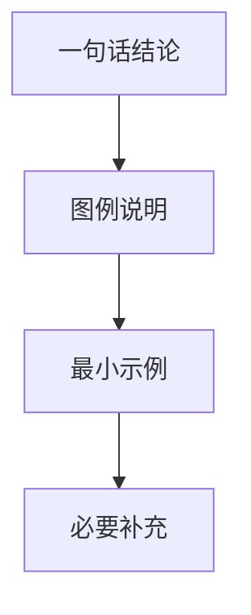

# 文档风格：图例与示例优先

## 核心原则

- 先给结论，再给图例或示例，最后只补最少说明。
- 能用图说明就不用长段落；能用示例说明就不重复解释。
- 每个知识点至少给一个最小示例（代码、命令、输入输出或对照表）。
- 涉及流程、时序、架构、状态变化时，优先使用 Mermaid 图。
- 段落尽量短句化；单段不超过 3 句，避免背景铺垫过长。

## 输出结构

1. 一句话结论
2. 图例（流程图/结构图/对比图）
3. 最小可运行或可对照示例
4. 必要补充（可省略）

## 好/坏对照

### 不推荐（文案过重）

- 用 6-10 句连续解释概念，缺少图和可验证示例。
- 同一结论重复改写 2-3 次，信息增量很低。

### 推荐（图例+示例驱动）

- 先给 Mermaid 图，再给 10-20 行最小示例，最后仅 1-3 句说明限制条件。



## 避免重复与合并

- **动笔前先检索**：新增或编写文档前，先用 `grep` 或 `codegraph_search` 检索项目中是否已有同主题内容，避免与既有文档重复。
- **跨文档引用，而非复制**：需要复用另一份文档的结论时，用相对链接（如 `[详见](../xxx.md)`）指向它，不要把整段内容抄过来。
- **发现重复主动合并**：若新内容与既有文档高度重叠，优先合并为一份——以更完整、风格更规范的那份为主文档，择优吸收其他文档的独有细节，再删除冗余文件。
- **删除前确认**：合并产生的删除不可逆；删除非本次创建的既有文件前，向用户确认（git 历史可恢复，但仍需明确授权）。

## 文档拆分

- **超长即拆**：文档超过约 300 行（或 3 个以上互不依赖的大主题）时，按主题拆出子文档，主文档只保留索引。
- **主文档作为索引**：拆分后主文档保留一句话概述 + 指向子文档的相对链接；不复制子文档内容。

```markdown
## 核心模块

### [事件系统](./docs/events.md)
事件委托的实现：handler 存 Fiber，监听器统一注册在根容器。
```

- **子文档就近放置**：放在主文档同目录的 `docs/` 子目录（或同级），命名与主题一致（如 `docs/events.md`）。
- **拆分时机**：新增章节导致文档明显变长时主动拆；不要先堆成超长文档再拆。
- **内链可导航**：拆分后主文档的每个子主题链接都可直接点击跳转，避免读者在单个超长文件里滚动定位。
