01 前言

**本节大纲**

## 02 view

**View 常用属性**

## 03 ViewGroup 

**ViewGroup.LayoutParams**

**ViewGroup.MarginLayoutParams**

**Android UI 组件的层次结构**

# 控制 UI 界面

## 04 使用 XML 布局文件控制 UI 界面

## 06 在 Java 代码中控制 UI 界面

## 08 使用 XML 和 Java 代码混合控制 UI 界面

## 10 开发自定义的 View

# 界面布局

## 相对布局管理器

## 线性布局管理器

## 帧布局管理器

## 表格布局管理器

## 网格布局管理器

## 布局管理器的嵌套

### 布局管理器的嵌套原则

### 实例（ 跳过 ）

# 基本 UI 组件

## 文本类组件

### 文本框组件

### 编辑框组件

#### 实例（ 跳过）

## 按钮类组件

### 普通按钮

**写法**

**增加监听器**

#### 实例（跳过）

### 图片按钮

### 单选按钮

**单选按钮组**

### 复选框

## 日期时间类组件

### 日期选择器

### 时间选择器

# Activity

## 本节大纲

## Activity 概述

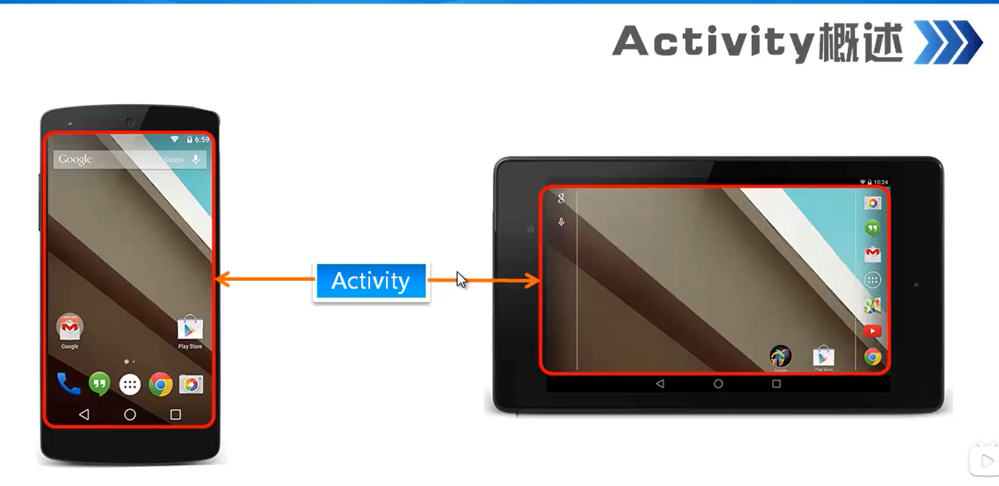

**4 种状态**

 

**生命周期**

## 创建和配置 Activity

**创建**

**配置 Activity**

**第一个 Activity 中间的四句表示这是入口 activity** 

**创建**

**activity 的布局文件**

**注册 Activity**

## 启动和关闭 Activity

**Intent**

**启动**

**关闭**

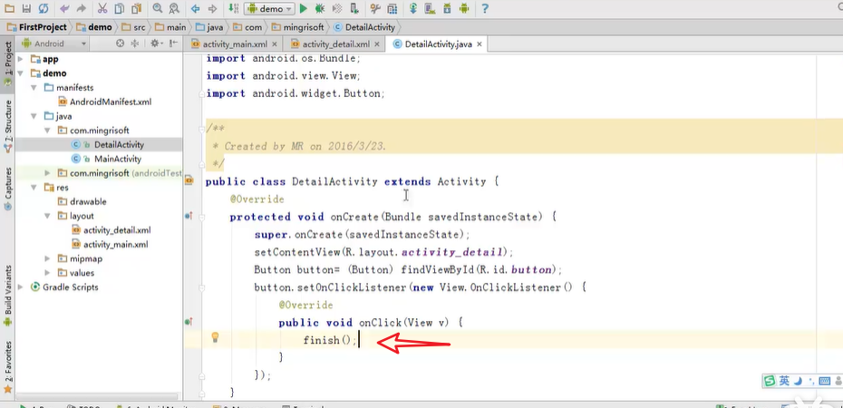

## 使用 Bundle 在 Activity 之间交换数据

**什么是 Bundle**

数据存在 Bundle 里， 通过 Intent 传递到另一个 Activity

**存**

**取**

## 调用另一个 Acitivity 并返回结果

调用选择头像 AC 并返回一个头像结果给调用的 AC

传递选择结果

获取传递结果

# Fragment

## Fragment 生命周期和创建 F

 

有点像组件

**生命周期**

**创建 Fragment**

## 在 Activity 中添加 Fragment

**直接在布局文件中添加**

**当 Acitivity 运行时添加**

id 为 content

id 为 fl

# Intent 

## 知识大纲

## 初识 Intent

**工作过程**

## Intent 对象的属性

### **Component name**

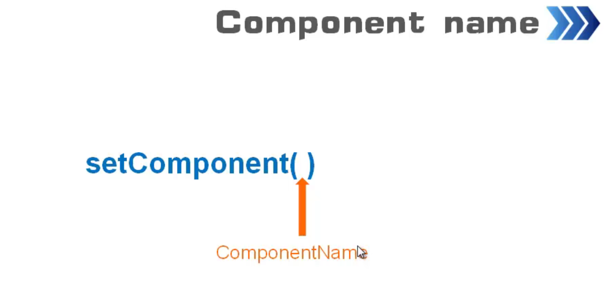

可用于启动另一个 Activity

### Action 和 Data

tips：两者要联合使用

设置权限发送短信和电话权限

### Action 和 Category

### Extras 属性

put bundle 和 get bundle

### Flags 属性

指示如何启动 AC

### Intent 种类

**显示 Intent**

需要指定目标组件

**隐式 Intent**

**区别**

### Intent 过滤器

**实例**

tips：没有指定跳转，需要配置过滤器

# Android 事件处理和手势

## 知识大纲

## 事件处理概述

## 基于监听事件处理流程

## 基于回调的事件处理

在 MainActivity 类里重写方法即可

**两者区别**

## 物理按键事件处理

tips：**安卓为每一个按键都提供了三个方法，并用不同的常量来区别物理按键**

## 触摸屏事件处理

### **单击事件**

### 长按事件

tips：长按两秒才会触发

### 触摸事件

### 单击事件与触摸事件的区别

tips：会优先触发触摸事件，如果触摸事件返回 false 会触发单击事件

## 手势检测

左右滑动

##  手势的创建和导出

**手势添加**

安卓有可以添加手势的程序

**手势的识别**

# Android 应用资源

## 字符串资源

**定义**

tips：注意标签严格区分大小写

**使用**

- 在布局文件中使用

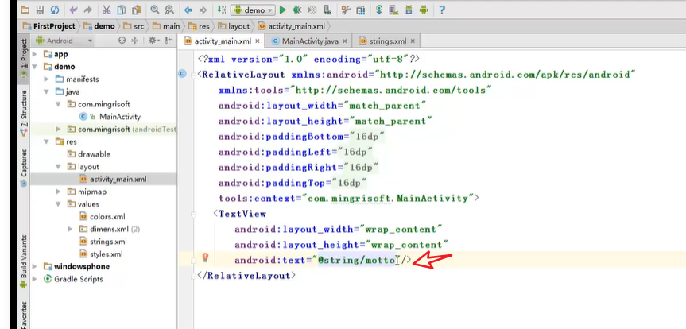

- 在 java文件中使用

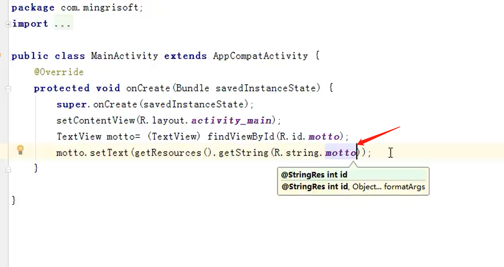

## 颜色资源

**定义**

**定义**

**使用**

- 在 XML 中使用

- 在 Java 中使用

sdk23 以上才能直接使用getcolor方法

## 尺寸资源语法

dp：设备独立像素比

sp：可伸缩像素

**如何使用**

**在 xml 中使用**

**在 java 文件中使用**

## 布局资源

在 java 中使用

## 数组资源

**如何使用**

定义数组资源文件

定义字符串数组

使用字符串数组

在 java 中使用

## Drawable 资源

图片资源

**StateListDrawable 资源**

 **定义**

在 xml 中使用

## mipmap 资源

## 主题资源

**定义**

**设置主题**

## 样式资源

**定义**

和主题资源定义在同一个文件，主题资源是针对整个应用和页面，而样式资源是相对于组件来说

**使用**

## 菜单资源

**定义菜单资源文件**

**选项菜单**

## Action

### **知识大纲**

### Action Bar

**初始 Action Bar**

**显示和隐藏 Action Bar**

tips：在 xml 中隐藏

**在 java 中控制**

### 添加 Action Item

tips： always 表示总是显示，ifRoom 表示只有当区域足够才显示， never 表示从不显示在 actionBar 上，在溢出菜单中；

### 添加 Action View

**定义 actionBar**

**定义 ActionView**

tips：注意 app 前缀

### Action Bar 与 Tab

**开发步骤**

**创建多个 fragement 以及它的布局文件**

**配置标签页**

### 实现层级式导航

 

# 消息通知和广播

## 消息提示框

## 使用 AlertDialog 实现对话框

tips：图表区，标题区也可能没有

## 列表对话框

### 带单选列表选的对话框

### 带多选列表项的对话框（跳过）

## 使用 Notification 显示通知

**实现步骤**

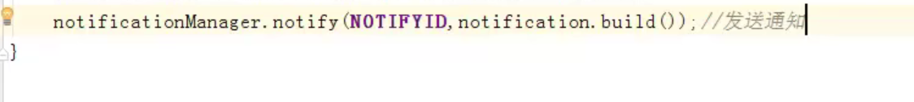

### 使用 BroadcastReceiver

tips：展现广播的三种方式

tips：发送广播

tips：广播接收器

tips：注册广播接收器

## 使用 AlterManager 设置闹钟

**布局界面**

**创建闹钟提醒内容的 AlarmActvity**

**设置闹钟**

# 绘图和动画

## 画笔和画布

### 画笔的作用

### 画布的作用

tips：通过画笔绘制各种图形

###  绘图的基本步骤

### 绘制一个橙色的矩形

tips：定义布局管理器

tips：在画布上绘画

tips：将画布添加到布局管理器

## 绘制几何图形

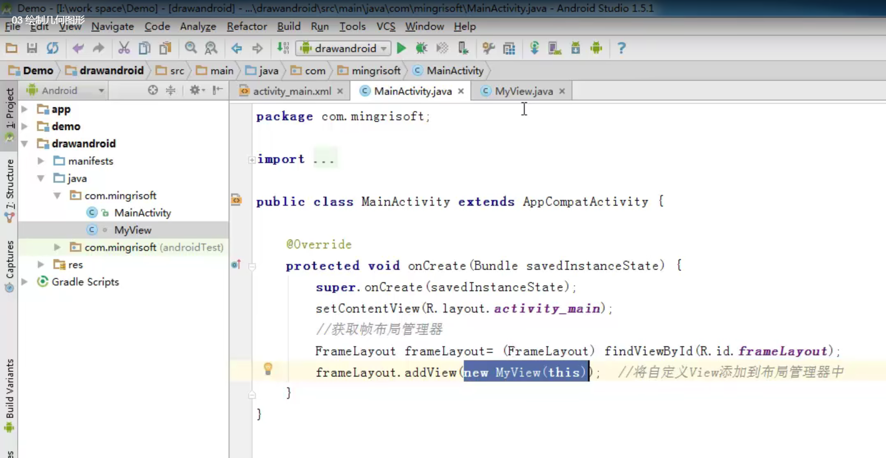

**绘制机器人**

## 绘制文本

tips:应用场景，像这种场景你就无法使用文本框的方式去显示文字，得通过绘制文本

**实例**

tips：布局方面使用了帧布局管理器

tips：将自定义的 view 添加到帧布局管理器当中

tips：绘制文本

## 绘制图片

### 创建位图对象

**BitmapFactory 类**

**Bitmap类**

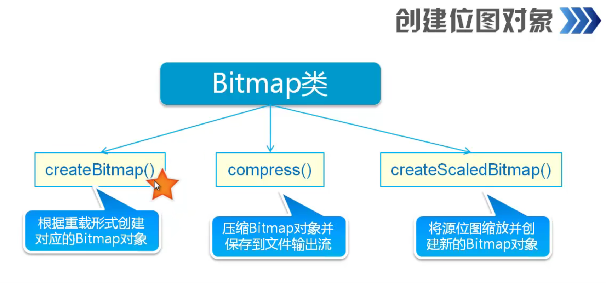

在上面的例子的基础上挖一块区域绘制

## 绘制路径

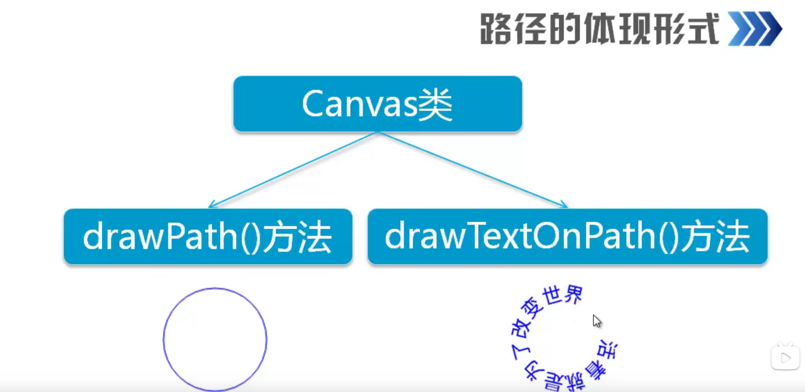

**绘制路径**

**绘制路径文本**

## 逐帧动画

**创建动画资源文件**

**在布局文件中使用动画资源文件**

**控制动画的开始与停止**

## 补间动画

### **透明度渐变**

### **旋转动画**

### **缩放动画**

定义

使用

### 平移动画

### 总结

### 淡出淡出的动画实例

# 视频和音频（跳过）

# 数据存储

## Shared Perferences

tips：第二个参数用于控制访问权限

### 存储数据步骤

### 读取数据步骤

### 实例

## 内部存储和外部存储

### I/O 流

### 文件的存储方式

### **内部存储**

tips：**安卓的内部存储和外部存储都是存储再手机当中**，不是什么外部卡或者u盘之类的

**实例**

**保存**

**读取**

tips：flush 是清楚缓存

### 外部存储

tips：手机连接到电脑上能被电脑识别的一定是外部存储

## 数据库存储

### sqlite3 的使用

### 使用代码操作数据

## Content Provider

tips：用于实现程序之间的数据共享

### **数据模型**

### **URL 和 URI**

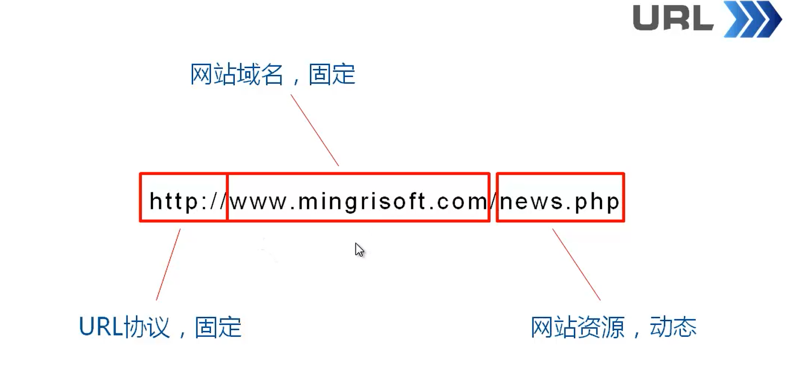

**URI 与 URL 的区别**

### **实例**

## Handler

### Handler 消息传递机制

**创建线程测试**

tips：这会报错因为

### **为什么要使用 Handler**

总结：Handler 是 android 中提供的一个消息处理的机制

### 实现游戏进度条

### Message 语法

### Message 对象

## Service

### 什么是 service

tips：比如我们的手机音乐，切到后台了它还在播放

### service 的基本用法

#### 创建与配置 service

**创建**

**配置**

#### 启动和停止 service

**startService 的生命周期**

#### 实例（跳过）

### Bound Service

tips：前者无法通信

#### 生命周期

#### 实现的基本步骤

#### 实例

**开发步骤**

### IntentService 的使用

# PPT

## 第一章 Android智能手机开发概述

### 1.1 智能手机及其操作系统

### 1.2 为什么要学习 Android

### 1.3 Android SDK 简介

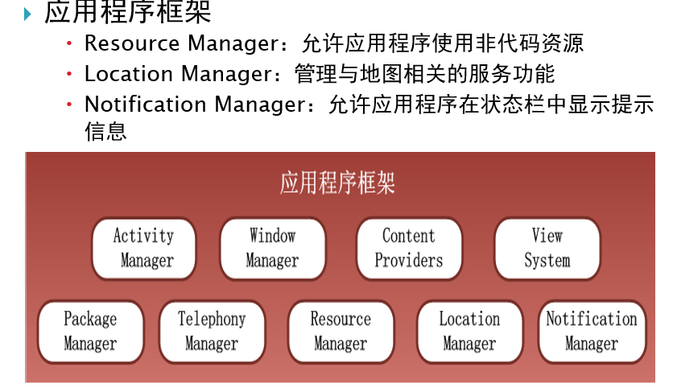

#### 简单的 Android 应用程序组成

### 1.4 用于在 Eclipse 中开发程序的外挂工具 ADT

### 1.5 Dalvik 虚拟机

### 1.6 虚拟仿真器 AVD

### 1.7 在 Android Market 上发布自己的应用程序

### 1.8 本章小结

### 习题

组成：Linux 内核、（中间件层、Android 运行时）、应用程序框架、应用程序

## 第三章 Android应用程序基本组成概述

### 3.1 Android 应用程序及主要结构概述

#### 3.1.1

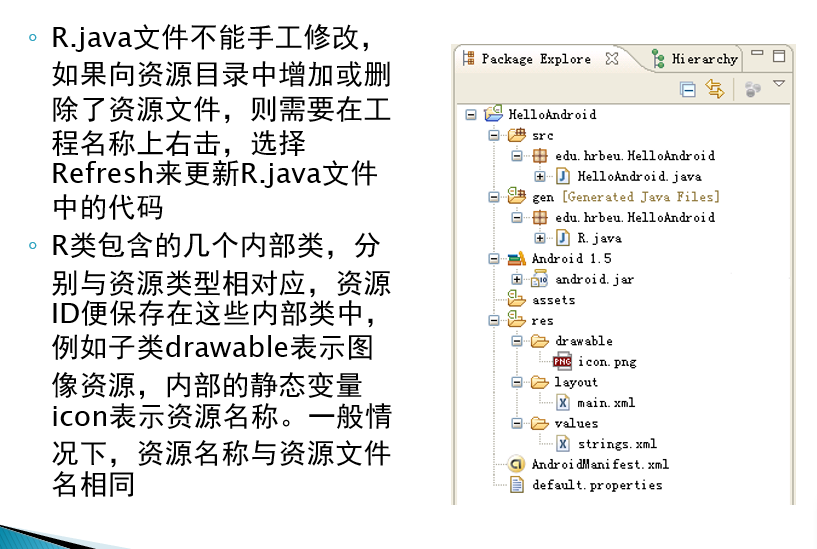

#### 3.1.2

#### 3.1.3 资源目录 res

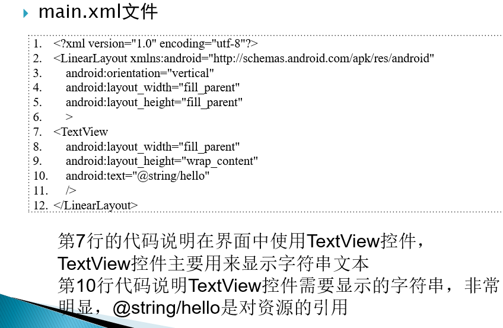

#### 3.1.4 AndroidMainfest

#### 3.1.5 default.properties

### 3.2 Activity 简介

### 3.3 Intent

### 3.4 service

### 3.5 Content Provider

### 3.6 Android SDK 部分 API 功能简介

### 3.7 本章小结

### 习题

1. 通过 Intent，一个 Activity 能跳转到另一个 Ac
2. 

## 第四章 界面布局与常用资源使用

### 4.1 概述

#### 4.1.1 组件的 ID 属性

#### 4.1.2 尺寸参数

#### 4.1.3 XML 布局组件标记及布局属性

### 4.2 布局及其加载

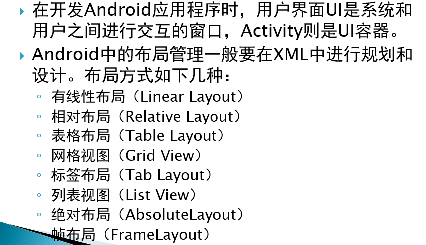

### 4.3 线性布局 LinearLayout

### 4.4 相对布局 RelativeLayout

### 4.5 绝对布局 AbsoluteLayout

## 4.6 表格局部

## 4.7 帧布局 FramLayout

## 4.8 在 Activity 中定义和引用布局

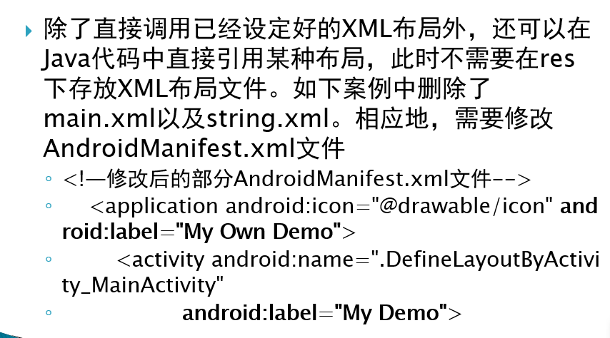

## 4.9 资源的管理与使用

## 4.10 本章小结

## 习题

# 第五章 Android事件处理机制 

## 5.1 Widget 概述

## 5.2 Button

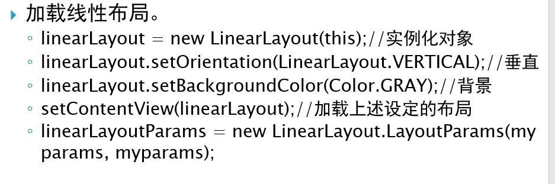

## 5.3 Android 中的事件处理机制

### 5.3.1 基于回调机制的事件处理

**onkeyDown**

**onTouchEvent**

**onFocusChanged**

### 5.3.2 基于监听接口的事件处理

**onClick**

## 5.4 TextView 与 EditText

### 5.4.1 TextView

### 5.4.2  EditText

### 5.4.3 TextView 与 EditText 联合使用

## 5.5 CheckBox

## 5.6 RadioButton

**案例**

## 5.7 列表 ListView

## 5.8 下拉列表 Spinner

### 5.9 自动输入提示 AutoCompleteTextView

## 5.10 Tabs

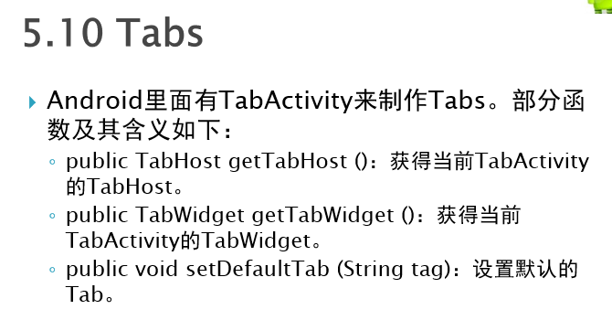

# 第六章 对话框、菜单与提示信息

## 6.1 对话框

### 6.1.1 创建简单的提示对话框

### 6.1.2 创建具有简单界面的提示对话框

## 6.2 菜单

### 6.2.1 选项菜单

### 6.2.2 子菜单 SubMenu 及其编程实现

### 6.2.3 快捷菜单 context menu 及其编程实现

## 6.3 提示消息 Toast

## 6.4 温馨消息 Notification

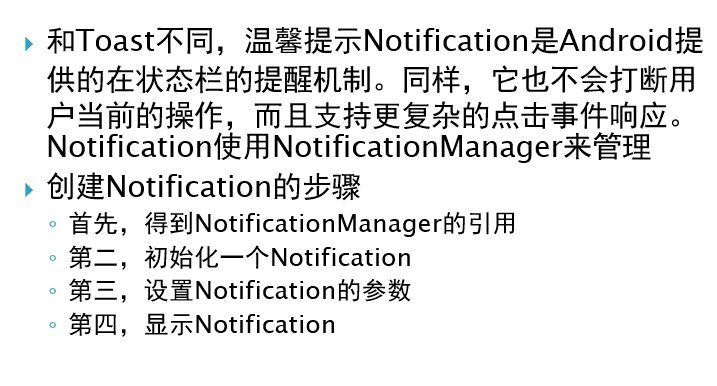

# 第七章 Intent及基于Buddle的数据传递

## 7.1 Intent 概述

## 7.2 Intent 的组成

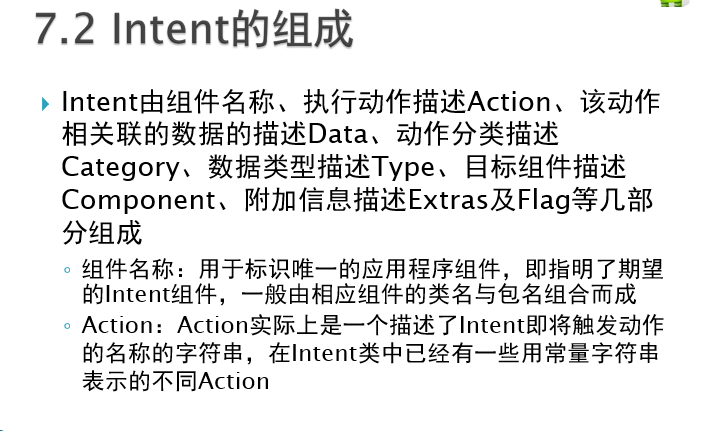

## 7.3 Intent filter

## 7.4 Intent 的实现

### 7.4.1 启动同一个工程中的另一个 Activity

#### Intent 案例

### 7.4.2 启动不同工程中的 Activity

### 7.4. 3 Intent 的 URI 参数及其应用

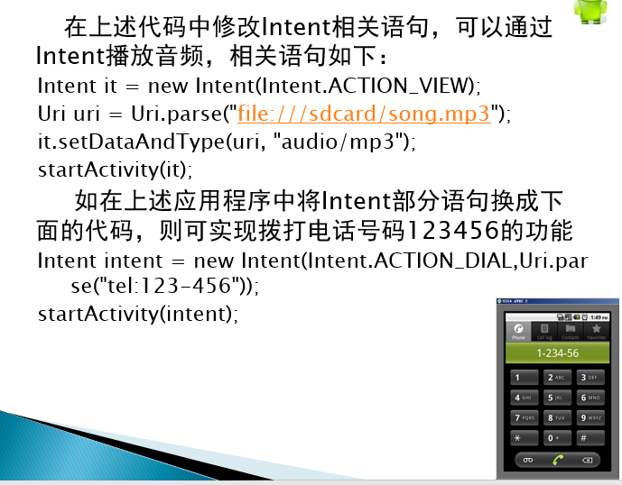

## 7.5 基于 Bundle 的消息传递

### 7.5.1 通过 Buddle 传递单参数

### 7.5.2 通过 Bunddle 传递多参数

# 第八章 服务和广播 

## 8.1 Service 简介

## 8.2 创建和启动、停止本地 Service

## 8.3 Broadcast 及其使用

### 8.3.1 系统广播概述

### 8.3.2 注册 BroadcastReceiver

### 8.3.3 静态与动态注册广播

**静态注册**

**动态注册**

## 8.4 本章小结

# 第九章 数据存取和SQLite数据库以及内容提供者

## 9.1 内部文件存取操作

# 第十章 Android中的多媒体应用

**从 Raw 源文件中播放**

**从本地文件系统中播放**

**从网络文件中播放**

## 10.3 基于 Camera 类的照相功能的实现

## 10.4 音视频的录制

