# 第一章

## 1.1.1 操作系统的概念、功能和目标

### 概念

### 操作系统的功能和目标

#### 作为系统资源的管理者

#### 作为用户和计算机硬件组件的接口

#### 作为最接近硬件的层次

## 1.1.2 操作系统的四个特征

### 并发

### 共享

### 虚拟

个人理解：虚拟技术其实就是让 cpu、存储器在不同的时间段分配给不同的进程使用，让用户看起来好像一个 cpu 一次性能运行多个程序，其实从微观上看 cpu 在某个时间段只能去运行一个程序

### 异步

### 总结

## 1.1.3 操作系统的发展与分类

### 实时操作系统

### 其他几种系统

### 总结

## 1.1.4 操作系统的运行机制和体系结构

### 知识总览

### 什么是指令

### 两种指令

### 两种处理器状态

### 两种程序的区别

### 运行机制

### 操作系统的内核

tips：原子性：一执行就不能被中断

### 操作系统的体系结构

### 总结 

## 1.1.5 中断和异常

### 知识总览

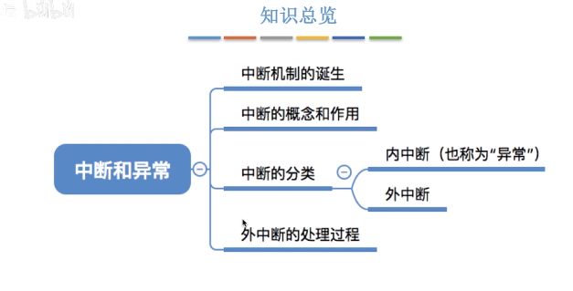

### 中断机制的诞生

我们知道旧的计算机只能串行执行程序

### 中断的概念和作用

### 中断分类

### 外中断的处理过程

### 总结

## 1.1.6 系统调用

### 知识总览

### 什么是系统调用

### 系统调用与库函数的区别

tips：其实我们用的很多的库其实就是帮助我们屏蔽掉许多系统调用复杂的细节，方便我们更加便捷开发（如果说没有这些库函数的辅助，我们直接自己进行系统调用，那编程将变得十分繁琐）

### 系统调用背后的过程

tips：陷入指令（trap）是唯一一个核心态下系统无法调用的指令，它只能在用户态下调用，让用户态转化为核心态

### 总结

## 考点

### 1. 了解操作系统的主要特征。

1）并发特征（Concurrence）

***\*区分并发和并行两个定义：从宏观和微观角度\****

并发是两个或多个事件在同一个时间间隔内发生，在宏观上所有的时间同时发生，微观上事件串行发生的。

并行是在任意时刻两个或多个事件同时发生。

如果为多道程序设计，只有一个CPU只能是并发，如果有多个CPU，可以做到并行。

2）共享特征（Sharing）

3）不确定性（异步性）

异步性给系统带来潜在危险，有可能导致与时间有关的错误。

### 2.理解并能详细描述用户与操作系统之间的接口分类。理解系统调用、函数调用区别与联系。

**用户与操作系统之间的接口分类**

（1）程序接口又称应用编程接口API，程序中使用这个接口可以调用操作系统的服务和功能。

（2）操作接口又称作业（或功能）级接口，**是操作系统为用户操作控制计算机工作和提供服务的手段的集合**。

**系统调用和函数调用的区别**

系统调用是操作系统提供给应用程序使用的接口，应用程序可以发出系统调用请求来获得操作系统的服务，而函数调用其实就是帮助我们屏蔽了系统调用复杂的细节，大部分库调用的底层其实就是系统调用，方便我们更加便捷开发，如果说没有函数调用的辅助，我们每一步都进行系统调用，那编程将变得十分繁琐。

# 第 二 章 进程

## 2.1.1 进程的定义、组成、组织方式、特征

### 知识总览

### 进程的定义

tips：这个阶段系统资源总是被一个程序独享

tips：这个阶段系统资源被多个程序使用

个人理解进程：每个进程就像每一条流水线一样，具备将产品加工完成的功能，但是要注意这两条流水线中间的工具不能同时使用，进程多不一定好，因为资源有限，这样当要拿同一个系统资源的时候就有人需要等待，反而会让每个进程需要等待的时间更久，最理想的状态就是你用的时候永远没人用，你不用的时候永远有人用

### 进程的组成

### 进程的组织

### 进程的特征

### 总结

## 2.1.2 进程的状态与转换

### 知识总览

### 进程的状态

#### 三种基本状态

 

#### 另外两种状态

#### 进程状态的转换

#### 总结

## 2.1.3 进程控制

### 什么是进程控制

### 如何实现进程控制

### 进程相关的原语 

## 2.1.4 进程通信

### 什么是进程通信

### 进程通信--共享存储

### 进程通信---管道通信

### 进程通信--消息传递

### 总结

## 2.1.5 线程概念和多线程模型

### 知识总览

### 什么是线程，为什么要引入线程

### 引入线程机制后，有什么变化

### 线程的属性

### 线程的实现方式

 

### 多线程模型

**多对一**

**一对一**

**多对多**

### 总结

·

## 2.2.1 处理机调度的概念和层次

### 知识总览

### 调度的基本概念

### 调度的三个层次

#### 高级调度

#### 中级调度

**补充知识**

 

#### 低级调度

#### 对比

### 总结

## 2.2.2 进程调度时机、切换与过程、方式

### 知识总览

### 进程调度的时机

### 进程调度的方式

### 进程的切换与过程

### 知识点回顾与重要考点

## 2.2.3 调度算法的评价指标

### 知识总览

### CPU 利用率

### 系统吞吐量

### 周转时间

意思就是虽然都是这个时间完成这个任务但是感受不同，比如你等了10分钟上了1分钟的厕所，和别人等了1分钟上了10分钟的厕所体验感是不一样的。所以这个平均周转时间来衡量还不够完美

### 等待时间

### 响应时间

### 总结

## 2.2.4 调度算法（跳过）

## 2.2.5 调度算法（跳过）

## 2.3.1 进程同步、进程互斥

### 知识总览

### 什么是进程同步

总而言之，进程同步就是让会相互影响的异步的进程之间前后关系的一个协调定义。

### 什么是进程互斥

### 总结

## 2.3.2 进程互斥的软件实现方法（跳过）

### 总结

## 2.3.3 进程互斥的硬件实现方法（跳过）

## 2.3.4 信号量机制

### 总结

### 信号量机制

#### 整型信号量

#### 记录型信号量

### 总结

## 2.3.5 用信号量实现进程互斥、同步、前驱关系

### 信号量机制实现进程互斥

### 信号量机制实现进程同步

记住 前 p 后 v，让 p 去阻塞在后面的进程，v 去启动进程，反正不管是 p1 还是 p2 先执行，都会等到 p1 执行后

### 信号量机制实现前驱关系

S1 肯定是在 S2 执行之前执行，因为只有 v 了之后 p 才能继续执行下去

### 总结

## 2.3.6 生产者-消费问题

### 问题描述

### 问题分析

### 如何实现

### 能否改变相邻 p、v 操作的顺序

### 总结

## 2.3.7 多生产者-多消费者问题（跳过）

## 2.3.8 吸烟者问题（跳过）

## 2.3.9 读者-写者问题（跳过）

## 2.3.10 哲学家进餐问题（跳过）

## 2.3.11 管程

### 知识总览

### 为什么要引入管程

### 管程的定义和基本特征

个人理解：管程就好像是对一系列复杂操作进行了封装的函数，暴露出一些 api 供用户使用

### 用管程解决生产者消费者问题

### java 中类似管程的机制

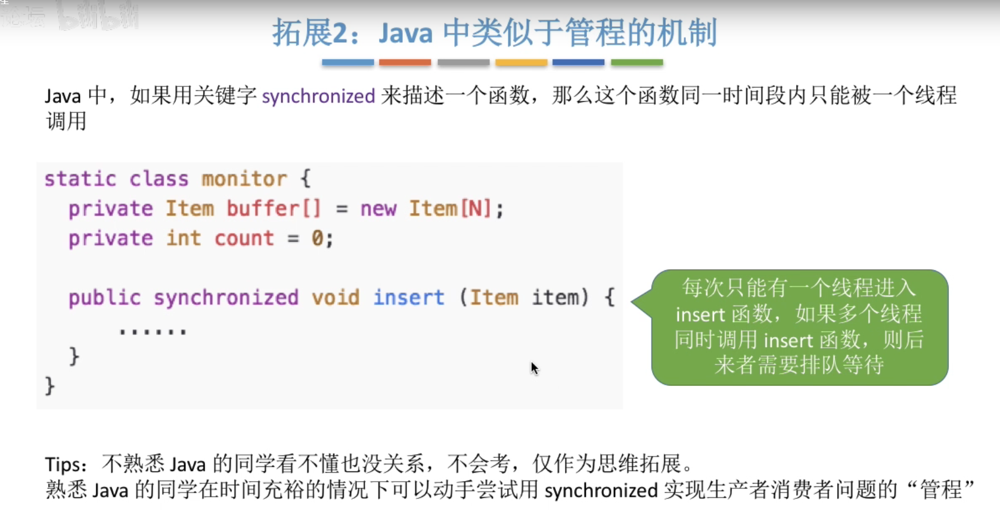

### 总结

## 2.4.1 死锁的概念

### 知识总览

### 什么是死锁

### 死锁、饥饿、死循环的区别

### 死锁产生的必要条件

### 什么时候会发生死锁

### 死锁的处理策略

### 总结

## 2.4.2 死锁的处理策略--预防死锁（跳过）

## 2.4.3 死锁的处理策略--避免死锁（跳过）

## 2.4.4 死锁的处理策略--检测和解决

tips：绿色线表示已占用（如 R1 类资源有两个被 p1 占用），蓝色表示请求资源

tips：很显然只要让 p1 先执行完 p2 也就可以执行完，这个图是可以完全简化的

**图简化前：**

**简化后若还存在边说明的死锁进程，接触方法有：**

## 考点1

### 1.理解进程控制块含义。进程控制块内容。理解进程的内存映像、进程上下文基本概念。

- 进程控制块含义

​	进程控制块（Processing Control Block），是[操作系统](https://baike.baidu.com/item/操作系统/192)[核心](https://baike.baidu.com/item/核心/33149)中一种数据结构，主要表示[进程](https://baike.baidu.com/item/进程)状态，是进程存在的唯一标志。

- 进程控制块内容

​	进程标识符：当进程被创建时，操作系统会为该进程分配一个唯一的，不重复的 ID，用于区分不同的进程

​	处理机状态：当进程切换时需要把进程当前的运行情况记录下来保存在 PCB 中，如程序计数器的值表示当前程	序执行到那里

​	进程调度信息：记录当前资源分配清单：程序段指针，数据段指针，键盘，鼠标

​	进程控制信息：记录进程当前状态和进程的优先级

- 进程的内存映像

​	程序段、数据段、PCB 三部分组成了进程映像。一般情况下，我们把进程映像就简称为进程，例如，所谓创建	进程，实质上是创建进程映像中的 PCB，而撤销进程，实质上是撤销进程实体中的 PCB。

- 进程上下文

​	进程上下文一般在进程切换中提到：进程上下文实际上是进程执行活动全过程的静态描述。

### 2.理解进程、线程、程序的概念。他们之间区别与联系。

- 进程：进程是 cpu 资源分配的基本单位
- 线程：是进程的一个实体，是 CPU 调度资源的基本单位
- 程序：程序是文件，它是一系列代码的集合
- 区别与联系：线程可以理解成”轻量级“的进程，进程是资源分配的基本单位，而线程是资源调度的基本单位；进程是程序的一次执行，进程是暂时的，动态创建的，而程序是可保存的。

### 3.理解进程3 状态、5状态、7状态含义及相互转换条件。会画出相互转换关系图。

- 运行态：表示当前进程占有 CPU，并在 CPU 上运行
- 就绪态：已经具备运行条件（拥有处理机之外所有需要的资源），但由于没有空闲 CPU，而暂时不能运行
- 阻塞态：因等待某一事件而暂时不能运行，如等待操作系统分配打印机，等待读磁盘操作的结果。

### 4.了解作业调度算法。

- 优先数调度算法
  - 先来先服务调度算法（first come first served，FCFS）调度算法：按照作业进入系统的时间顺序排序
  - 最短作业优先（shortest job first，SJF）调度算法：优先处理计算时间短的作业有利于提高系统的吞吐率和平均周转率（对计算时间长的作业不公平，甚至会出现“饥饿”现象）
  - 最短剩余时间优先（shortest remaining time first，SRTF）调度算法：类似于 SJF 调度算法，其不公平特征比 SJF 调度算法更加突出，其不公平特征比 SJF 调度算法更加突出
  - 最高响应比优先（highest response ratio first，HRRF） 调度算法：响应比是等待时间与计算时间之比（这一算法能够改善 SJF 调度算法和 SRTF调度算法对计算时间长的作业/进程极端不公平的问题）
- 时间片轮询算法：基于先来先服务算法，但是每个进程占有 CPU 运行必须受到时间片的限制，一旦进程运行时间超过了该时间片就得让出 CPU
- 分级调度算法：建立多个按照优先级调度的就绪进程队列。一般来说，高优先级就绪进程分配的时间片短，而每个就绪进程队列的优先数和时间片一般相同
- 彩票调度算法：根据概率进行调度，操作系统为进程发放一定数量的彩票，当调度进程需要做出决策时，随机选择一张彩票，持有该彩票的进程将获得系统资源

## 考点2

### 1.理解进程通信概念及常用进程通信方式

概念：进程通信指进程之间的信息交换

常用的进程通信方式有：

- 共享存储：设置一个共享空间，注意进程间要互斥地访问，有基于数据结构（低级，能存储的数据量少）和基于存储区（高级，能存储的数据量多）两种共享方式
- 管道通信：设置一个特殊的共享文件（管道），其实就是一个缓冲区（一个管道只能实现半双工通信，实现双向同时通信要建立两个管道，各进程要互斥访问管道，写满时，不能再写。读空时，不能再读。没写满，不能读，没读空，不能写）
- 消息传递：通过系统提供“发送/接受源语”传递结构化的消息（消息头/消息体），有两种实现方式，第一种是直接通信方式（消息直接挂到接收方的消息队列里）第二种是间接（信箱）通信方式（消息先发到中间体（信箱））

### 2.理解临界区概念及几种临界区管理方法。

概念：并发进程中与互斥变量有关的程序段称为“临界区”。

管理方法：

- 关中断

  - 进程在进入临界区之前关中断，退出临界区时开中断，关中断期间，由于进程上下文切换都是由中断事件引起的，因此进程的执行不会被打断，不会切换线程，保证了临界区的互斥执行。

  - 关中断缺点：限制交叉执行程序的能力，关中断方法不适合多CPU系统，关中断权利赋予给用户十分危险

- 测试并建立指令
  - 用户程序可以利用 TS 指令实现临界区的上锁和开锁操作。在进入临界区之前，首先通过 TS 指令测试 lock，如果没有进程在临界区内则可以进入，否则必须循环测试直接 lock 值为 false；当进程退出临界区时，将 lock 值置为 false（由于 TS 指令是不可分割指令，在测试和形成条件码之间不可能有其他进程测试变量值，从而确保临界区管理的正确性）。
  - 
  - 

### 3.会用信号量，PV操作解决缓冲区、多进程运行同步等问题

### 4.理解死锁概念、理解银行家算法、安全性检测算法并能解决实际问题。

死锁概念：在并发环境下，各进程因竞争资源而造成的一种互相等待对方手里的资源，导致各进程都阻塞，都无法向前推进的现象，就是“死锁”。

产生死锁的四个必要条件：

- 互斥条件：进程应互斥使用资源
- 占有和等待条件：等待时，不释放已占有的资源
- 不剥夺条件：不能从另一进程抢夺资源，资源只能被占有进程自己释放
- 循环等待条件：存在一个循环等待链，其中，每一个进程分别等待它前一个进程所占有的资源，造成永久等待

银行家算法：检查资源申请者对各类资源的最大需求量，如果系统现存的各类资源可以满足它的最大需求量时，就满足当前的申请。这样申请者进程就不会因为某类资源得不到满足而处于永远等待状态，即死锁问题。

安全性检测算法：构造资源分配图，对于可完全简化的图说明不存在死锁，若不可完全简化的图说明存在死锁

tips:在这个图的基础上加一条 p1 调度 P2 的图就是无法简化的图了

解决方法：

- 结束所有进程的执行，并重新启动操作系统（方法简单，但之前工作会全部作废，损失很大）
- 撤销陷于死锁的所有进程，接触死锁，重新启动执行（代价也相当大）
- 在进程执行过程中定时设置校验点，从校验点开始重执行，让所有进程回退，直到足以解除死锁（这种措施要求系统建立并保存校验点，支持回退及重启机制）
- 中止一个卷入死锁的进程，以后再重新执行

# 第三章 内存

## 3.1.1 内存的基础知识

### 知识总览

### 什么是内存？有何作用？

### 几个常用的数量单位

### 进程的运行原理-指令

### 逻辑地址 vs 物理地址

### 从写程序到程序运行过程分析

### 逻辑地址转换为绝对地址

#### 绝对装入

#### 静态重定位

#### 动态重定位

tips：现在的计算机大多采用这种方法

### 链接的三种方式

### 总结

## 3.1.2 内存管理的概念

### 内存空间的分配与回收

### 内存空间的扩展

### 地址转换

### 内存保护

### 总结

## 3.1.3 覆盖与交换

### 知识总览

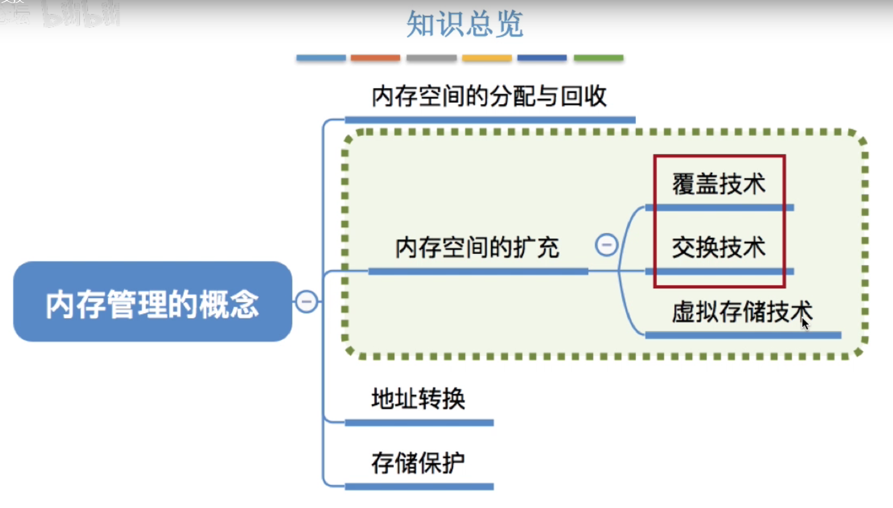

### 覆盖技术

### 交换技术

**挂起状态回顾**

### 知识回顾与重要考点

## 3.1.4 连续分配管理方式

### 知识总览

### 单一连续分配

### 固定分区分配

### 动态分区分配

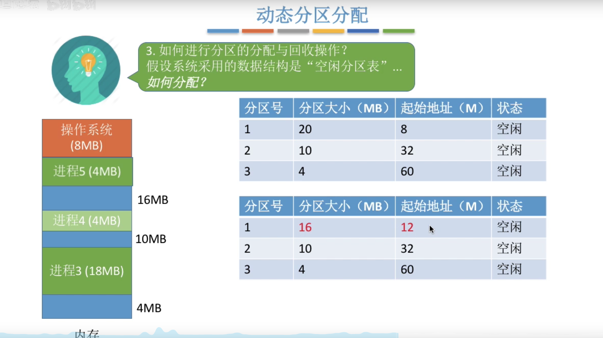

### 总结

## 3.1.5 动态分区分配计算法（跳过）

## 3.1.6 基本分页存储管理的基本概念

### 问题

### 知识总览

### 思路

### 分页存储管理的基本概念

### 思考

### 如何实现地址的转换

### 逻辑地址结构

### 页表

### 知识回顾

## 3.1.7 基本地址变换机构

### 知识总览

### 基本地址变换机构

**图示**

### 例题说明

### 例题

### 对页表项大小的进一步探讨（难重点）

### 知识回顾与考点

## 3.1.8 具有快表的地址变换机构

### 知识总览

### 局部性原理

### 什么是快表

### 引入快表后，地址的变换过程

### 总结

tips：就比如你做一个循环，其实访问的地址基本都是同一个页号内的，所以快表机制可以减少我们从页表查询页号的时间（循环第一次的时候就将页号存到快表中，之后就不用再查询页/慢表了）

## 3.1.9 两级页表

### 知识总览

### 单级页表存在问题

### 如何解决单机页表的问题

### 两级页表的原理、地址结构

### 如何实现地址变换

### 如何解决单级页表的问题

### 需要注意的几个细节

### 知识回顾与重点考点

## 3.1.10 基本分段存储管理方式

### 知识总览

### 分段

### 段表

### 地址变换

**由于段内地址 1024 = 1k 小于 3K 说明段内地址并没有超过**

### 分段、分页管理的对比

### 知识回顾与重要考点

## 3.1.11 段页式管理方式

### 知识总览

### 分页、分段的优缺点分析

### 段页式管理

### 段页式管理的逻辑地址结构

### 段表、页表

### 寻址过程

## 3.2.1 虚拟内存的基本概念

### 知识总览

### 传统管理方式的特征

### 局部性原理

### 虚拟内存的定义和特征

### 如何实现虚拟内存技术

### 总结

## 3.2.2 请求分页管理方式

### 知识总览

### 页表机制

### 缺页中断机构

### 地址变换机构

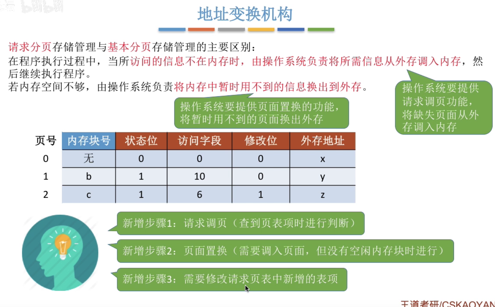

### 总结

## 3.2.3 页面置换算法（跳过）

## 3.2.4 页面分配策略（跳过）

## 考点

### 1.理解存储管理基本功能。

(1)内存分配和去配；

(2)地址映射：将逻辑地址变换成物理地址，抽象成一维数组或二维地址空间；

(3) 存储共享和存储保护，其中存储保护为各道作业、任务或进程在自己所属区域中运行，不破坏别的作业或不被“别人”破坏，更不要破坏整个系统工作; 存储共享是为了进程间通信和提高主存利用率，两个或多个进程共用内存中相同的分区，即他们的物理内存有相交部分; 

(4)存储扩充：虚拟内存，允许进程虚拟地址空间大于主存空间。

### 2.理解并会使用可变存储分区管理常用算法。

可变分区管理的基本原理：系统在作业装入主存执行之前并不建立分区，当要装入一个作业时，再根据作业需要的主存量查看主存中是否有足够的空间。若有，则按需要量分割一个分区分配给该作业；若无，则令该作业等待主存空间。

五种可变分区**分配算法**实现原理。

（1）最先适应分配算法：空闲区表中的空闲区可按首地址从小到大顺序排列，在进行内存分配时，从头开始顺序查找，直到找到一块分区的大小可以满足需求

（2）下次适应分配算法：分配内存时不是从头进行查找可以分配内存的空闲分区，而是从上一次分配内存的空闲分区的下一个分区开始查找，直到找到可以为该进程分配内存的空闲分区；

（3) 最优适应分配算法：空闲区表中的空闲区可按空闲块从小到大顺序排列，在进行内存分配时，从头开始顺序查找，直到找到一块分区的大小可以满足需求

（4）最坏适应分配算法：空闲区表中的空闲区可按空闲块从大到小顺序排列，在进行内存分配时，从头开始顺序查找，直到找到一块分区的大小可以满足需求

（5) 快速适应分配算法 ：为经常用到的长度的空闲区设置单独的链表，在内存分配时，优先查找该链表

### 3.请求页式虚拟存储管理的常用的页面调度算法。

- 先进先调度算法

​	**先进先出调度算法根据页面进入内存的时间先后选择淘汰页面，先进入内存的页面先淘汰，后进入内存的后淘	汰。**本算法实现时需要将页面按进入内存的时间先后组成一个队列，每次调度队首页面予以淘汰。

- 最近最少调度算法

​	先进先出调度算法没有考虑页面的使用情况，大多数情况下性能不佳。根据程序执行的局部性特点，程序一旦	访问了某些代码和数据，则在一段时间内会经常访问他们，因此**最近最少用调度在选择淘汰页面时会考虑页面	最近的使用，总是选择在最近一段时间以来最少使用的页面予以淘汰。**算法实现时需要为每个页面设置数据结	构记录页面自上次访问以来所经历的时间。

- 最近最不常用调度算法

​	由于程序设计中经常使用循环结构，根据程序执行的局部性特点，可以设想在一段时间内经常被访问的代码和	数据在将来也会经常被访问，显然这样的页面不应该被淘汰。**最近最不常用调度算法总是根据一段时间内页面	的访问次数来选择淘汰页面，每次淘汰访问次数最少的页面。**算法实现时需要为每个页面设置计数器，记录访	问次数。计数器由硬件或操作系统自动定时清零。

# 第四章 文件管理

## 4.1.1 初始文件管理

### 文件的属性

### 文件内部数据的组织形式

### 操作系统应该提供的功能

### 文件如何存放在外存

### 其他需要操作系统实现的文件管理功能

### 总结

## 4.1.2 文件的逻辑结构

### 知识总览

### 有结构文件

### 有结构文件的逻辑结构

### 顺序文件

### 索引文件

### 索引顺序文件

#### 检索效率分析

#### 多级索引顺序文件

### 总结

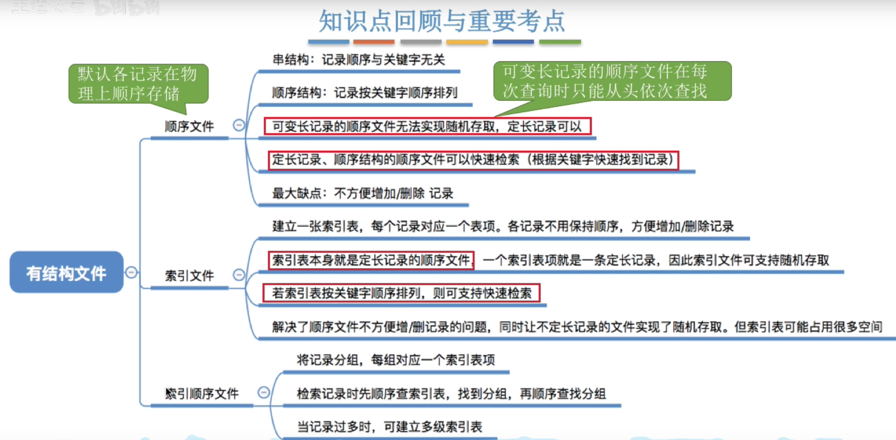

## 4.1.3 文件的目录

### 知识总览

### 文件控制块

### 目录结构

#### 单级目录结构

#### 两级目录结构

#### 多级目录结构

#### 无环图目录结构

#### 索引结点（FCB的改进）

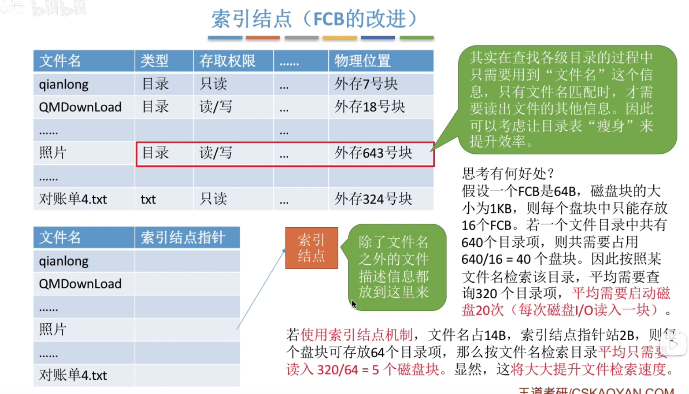

### 知识总结

## 4.1.4 文件的物理结构（上）

### 知识总览

### 文件块、磁盘块

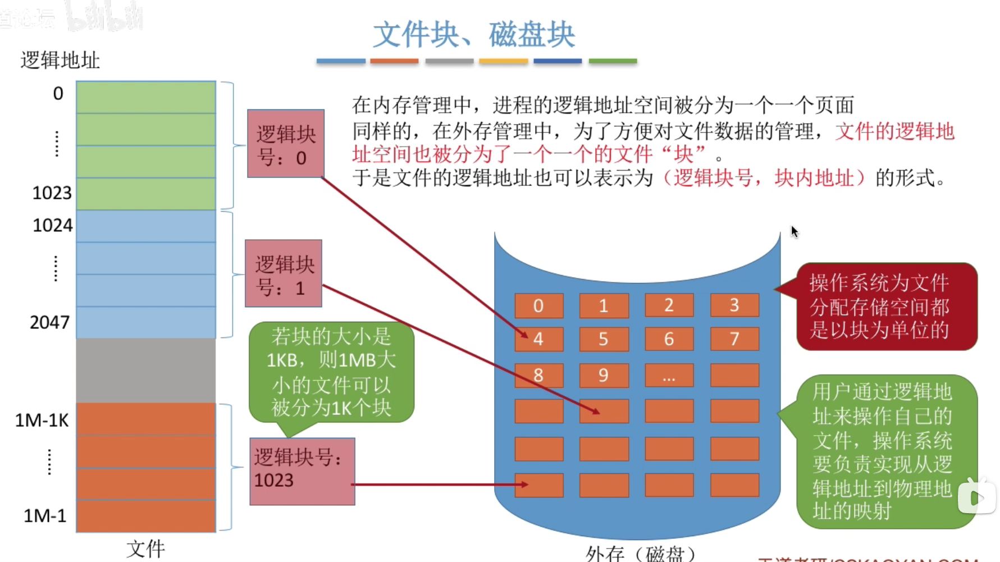

### 文件分配方式

#### 连续分配

**优点**

**缺点**

**总结**

#### 链接分配

##### 隐式链接

##### 显示链接

##### 链接分配总结

## 4.1.4 文件的物理结构（下）

### 索引分配

## 4.1.5 文件存储空间管理

### 知识总览

### 存储空间的划分与初始化

### 存储空间管理方法

#### 空闲表法

#### 空闲链表法

#### 位示图法

#### 成组链接法

#### 总结

## 4.1.6 文件的基本操作

### 知识总览

### 创建文件

### 删除文件

### 打开文件

### 关闭文件

### 读文件

### 写文件

### 知识总结

## 4.1.7 文件共享

### 知识总览

### 基于索引结点的共享方式（硬链接）

### 基于符号链的共享方式（软链接）

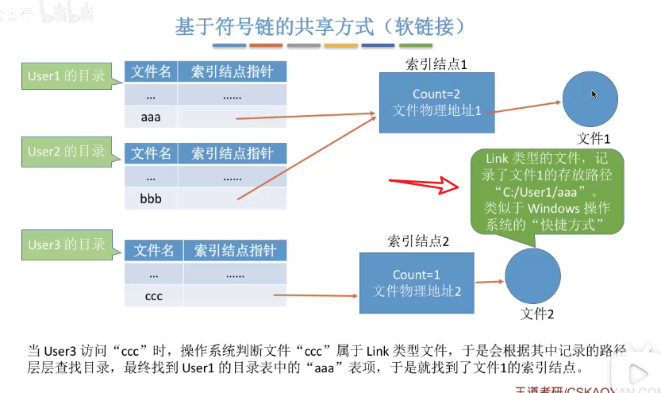

### 知识总结

## 4.1.8 文件保护

### 口令保护

### 加密保护

### 访问控制

### Window 的访问控制

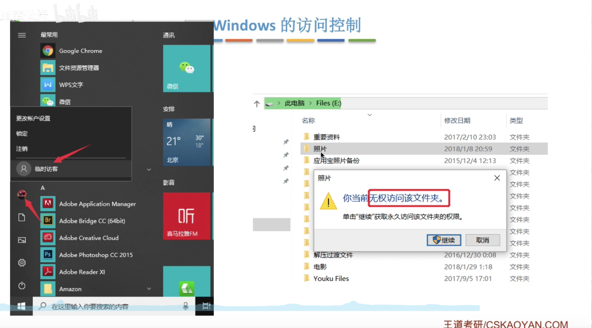

### 知识总结

## 4.1.9 文件系统的层次结构

### 文件的层次结构

### 知识点回顾与重要考点

## 4.2.1 磁盘的结构

### 知识总览

### 磁盘、磁道、扇区

### 如何在磁盘中读/写数据

### 盘面、柱面

### 磁盘的物理地址

### 磁盘的分类

### 知识点回顾与重要考点 

## 4.2.2 磁盘调度算法

### 知识总览

### 一次磁盘读/写需要的时间

### 先来先服务算法（FCFS）

### 最短寻找时间优先（SSTF）

### 扫描算法（SCAN）

### LOOK 调度算法

### 循环扫描算法（C-SCAN）

### C-LOOK 调度算法

### 知识总结

## 4.2.3 减少磁盘延迟时间的方法

### 交替编号

### 磁盘地址结构的设计

### 错位命名

### 总结

## 4.2.4 磁盘管理

### 知识总览

### 磁盘初始化

### 引导块

### 坏块的管理

### 总结

## 考点

### 1.理解文件的物理结构

### 2.理解文件的逻辑结构

逻辑文件：从用户观点看逻辑文件是用户所观察到的文件组织形式，是用户可以直接处理的数据及结构，它独立于物理设备，逻辑文件又称为文件组织。

物理文件是与存储介质性能有关的，在外存上存储的组织形式。

 （1）文件的逻辑结构分类：流式文件、记录式文件。

 （2）文件的物理结构分类：顺序文件、连接文件、索引文件。

# 第五章 设备管理

## 5.1.1 I-O 设备的概念和分类

### 知识总览

### 什么是 I/O 设备

### I/O 设备的分类

#### 按使用特性

#### 按传输速率分类

#### 按信息交换的单位分类

### 总结

## 5.1.2 I/O 控制器

### 知识总览

### I/O 设备的机械部件

### I/O 设备的电子部件（I/O控制器）

### I/O 控制器的组成 

### 内存映像 I/O v.s. 寄存器独立编址

### 总结

## 5.1.3 I/O 控制方式

### 知识总览

### 程序直接控制方式

### 中断驱动方式

### DMA 方式

**DMA 控制器**

### 通道控制方式

### 总结

## 5.1.4 I/O 软件层次结构

### 知识总览

### 用户层软件

### 设备独立性软件

### 设备驱动程序

### 中断处理程序

### 总结

## 5.1.5 I-O 设备子系统

### 知识总览

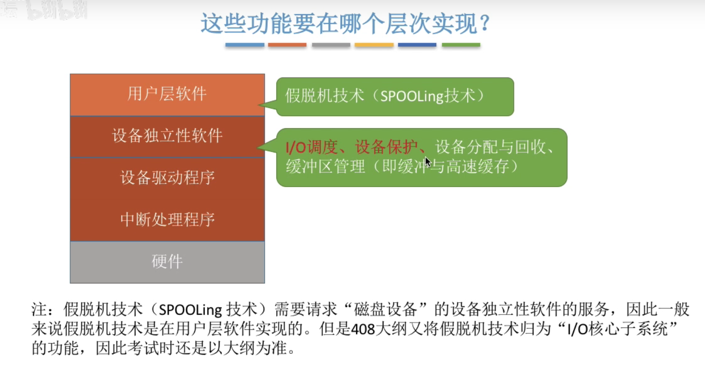

### I/O 调度

### 设备保护

## 5.1.6 假脱机技术

### 知识总览

### 什么是脱机技术

### 输入井输出井

### 共享打印机原理分析

### 总结

## 5.1.7 设备的分配与回收

### 知识总览

### 设备分配时应考虑的因素

### 静态分配和动态分配

### 设备分配管理中的数据结构

### 设备分配步骤

### 总结

## 5.1.8 缓冲区管理

### 缓冲区的作用

### 单缓冲

### 双缓冲

### 使用单/双缓冲在通信时的区别

### 循环缓冲区

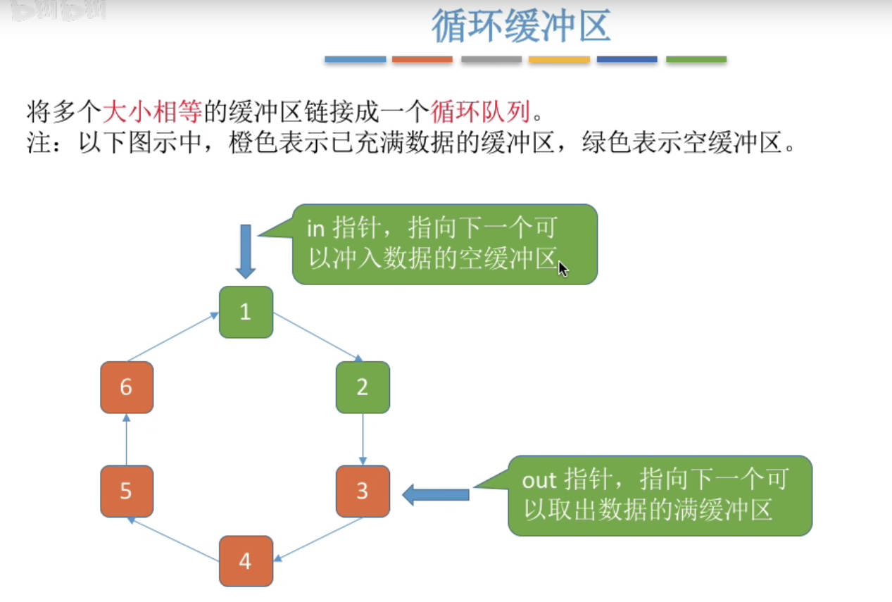

### 缓冲池

### 知识总览

## 考点

### 1.理解计算机 I/O 系统构成及其各部分功能（还没整理完）。

由输入输出控制系统和外围设备两部分组成，是计算机系统的重要组成部分。在计算机系统中，通常把处理器和主存储器之外的部分称为输入输出系统。

### 2.理解计算机 I/O 软件构成及其各组成部分功能。

I/O 软件层次结构从上到下分别为：

- 用户层软件：**实现了与用户交互的接口，用户可直接使用该层提供的、与 I/O 操作相关的库函数对设备进行操作**
- 设备独立性软件：**建立逻辑设备名到物理设备名的映射关系**，根据设备类型选择调用相应的驱动程序
- 设备驱动程序：主要负责对硬件设备的具体控制，**将上层发出的一系列命令（如 read/write）转化成特定设备“能听得懂”的一系列操作**。包括设置设备寄存器，检查设备状态等。
- 中断处理程序：当 I/O 任务完成时，**I/O 控制器会发送一个中断信号，系统会根据中断信号类型找到相应的中断处理程序并执行**。

### 3.理解并会计算磁盘调度先来先服务、最短查找时间、双向扫描算法、电梯调度算法

- 先来先服务（FCFS）：根据进程请求访问磁盘的先后顺序进行调度
- 最短查找时间（SSTF）：算法选择调度处理的磁道是与当前磁头所在磁道距离最近的磁道，以使每次的寻找时间最短
- 电梯调度算法：SSTF 算法会产生饥饿的原因在于：磁头有可能在一个小区域内来回来去地移动。为了防止这个问题，可以规定：只有磁头移动到最外侧磁道的时候才能往内移动，移动到最内侧磁道的时候才能往外移动，这就是扫描算法的思想。
- 循环扫描算法：只有磁头朝某个方向移动时才会响应请求，移动到边缘后立即让磁头返回起点，返回途中不响应任何请求
