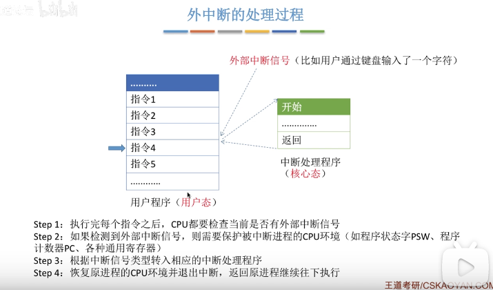
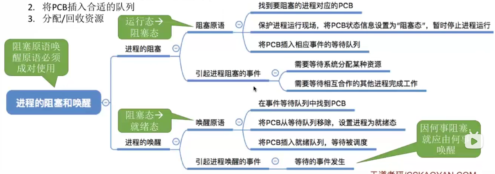
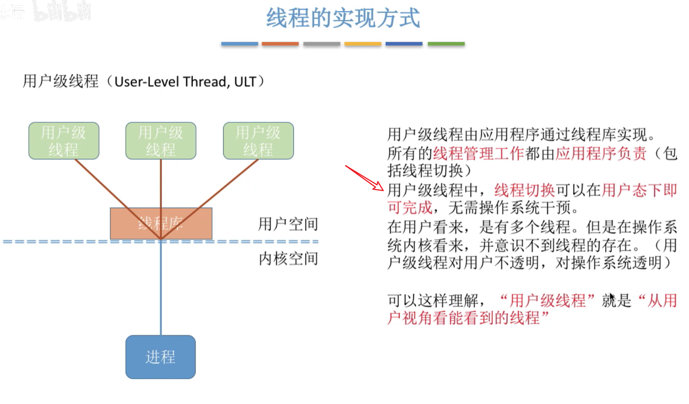
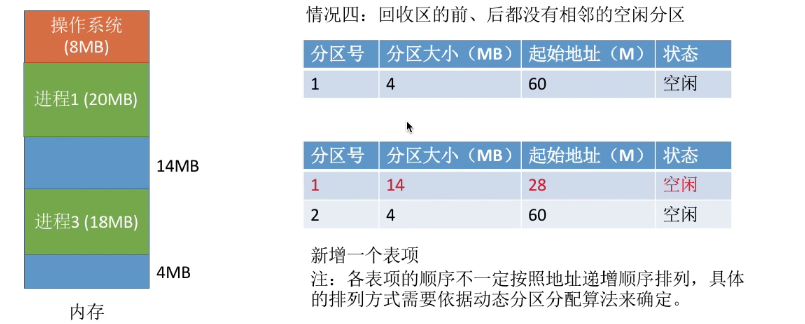

# 第一章

## 1.1.1 操作系统的概念、功能和目标

### 概念

### 操作系统的功能和目标

#### 作为系统资源的管理者

#### 作为用户和计算机硬件组件的接口

#### 作为最接近硬件的层次

## 1.1.2 操作系统的四个特征

### 并发

### 共享

### 虚拟

个人理解：虚拟技术其实就是让 cpu、存储器在不同的时间段分配给不同的进程使用，让用户看起来好像一个 cpu 一次性能运行多个程序，其实从微观上看 cpu 在某个时间段只能去运行一个程序

### 异步

### 总结

## 1.1.3 操作系统的发展与分类

### 实时操作系统

### 其他几种系统

### 总结

## 1.1.4 操作系统的运行机制和体系结构

### 知识总览

### 什么是指令

### 两种指令

### 两种处理器状态

### 两种程序的区别

### 运行机制

### 操作系统的内核

tips：原子性：一执行就不能被中断

### 操作系统的体系结构

### 总结 

## 1.1.5 中断和异常

### 知识总览

### 中断机制的诞生

我们知道旧的计算机只能串行执行程序

### 中断的概念和作用

### 中断分类

### 外中断的处理过程

### 总结

## 1.1.6 系统调用

### 知识总览

### 什么是系统调用

### 系统调用与库函数的区别

tips：其实我们用的很多的库其实就是帮助我们屏蔽掉许多系统调用复杂的细节，方便我们更加便捷开发（如果说没有这些库函数的辅助，我们直接自己进行系统调用，那编程将变得十分繁琐）

### 系统调用背后的过程

tips：陷入指令（trap）是唯一一个核心态下系统无法调用的指令，它只能在用户态下调用，让用户态转化为核心态

### 总结

# 第 二 章 进程

## 2.1.1 进程的定义、组成、组织方式、特征

### 知识总览

### 进程的定义

tips：这个阶段系统资源总是被一个程序独享

tips：这个阶段系统资源被多个程序使用

个人理解进程：每个进程就像每一条流水线一样，具备将产品加工完成的功能，但是要注意这两条流水线中间的工具不能同时使用，进程多不一定好，因为资源有限，这样当要拿同一个系统资源的时候就有人需要等待，反而会让每个进程需要等待的时间更久，最理想的状态就是你用的时候永远没人用，你不用的时候永远有人用

### 进程的组成

### 进程的组织

### 进程的特征

### 总结

## 2.1.2 进程的状态与转换

### 知识总览

### 进程的状态

#### 三种基本状态

 

#### 另外两种状态

#### 进程状态的转换

#### 总结

## 2.1.3 进程控制

### 什么是进程控制

### 如何实现进程控制

### 进程相关的原语 

## 2.1.4 进程通信

### 什么是进程通信

### 进程通信--共享存储

### 进程通信---管道通信

### 进程通信--消息传递

### 总结

## 2.1.5 线程概念和多线程模型

### 知识总览

### 什么是线程，为什么要引入线程

### 引入线程机制后，有什么变化

### 线程的属性

### 线程的实现方式

 

### 多线程模型

**多对一**

**一对一**

**多对多**

### 总结

·

## 2.2.1 处理机调度的概念和层次

### 知识总览

### 调度的基本概念

### 调度的三个层次

#### 高级调度

#### 中级调度

**补充知识**

 

#### 低级调度

#### 对比

### 总结

## 2.2.2 进程调度时机、切换与过程、方式

### 知识总览

### 进程调度的时机

### 进程调度的方式

### 进程的切换与过程

### 知识点回顾与重要考点

## 2.2.3 调度算法的评价指标

### 知识总览

### CPU 利用率

### 系统吞吐量

### 周转时间

意思就是虽然都是这个时间完成这个任务但是感受不同，比如你等了10分钟上了1分钟的厕所，和别人等了1分钟上了10分钟的厕所体验感是不一样的。所以这个平均周转时间来衡量还不够完美

### 等待时间

### 响应时间

### 总结

## 2.2.4 调度算法（跳过）

## 2.2.5 调度算法（跳过）

## 2.3.1 进程同步、进程互斥

### 知识总览

### 什么是进程同步

总而言之，进程同步就是让会相互影响的异步的进程之间前后关系的一个协调定义。

### 什么是进程互斥

### 总结

## 2.3.2 进程互斥的软件实现方法（跳过）

### 总结

## 2.3.3 进程互斥的硬件实现方法（跳过）

## 2.3.4 信号量机制

### 总结

### 信号量机制

#### 整型信号量

#### 记录型信号量

### 总结

## 2.3.5 用信号量实现进程互斥、同步、前驱关系

### 信号量机制实现进程互斥

### 信号量机制实现进程同步

记住 前 p 后 v，让 p 去阻塞在后面的进程，v 去启动进程，反正不管是 p1 还是 p2 先执行，都会等到 p1 执行后

### 信号量机制实现前驱关系

S1 肯定是在 S2 执行之前执行，因为只有 v 了之后 p 才能继续执行下去

### 总结

## 2.3.6 生产者-消费问题

### 问题描述

### 问题分析

### 如何实现

### 能否改变相邻 p、v 操作的顺序

### 总结

## 2.3.7 多生产者-多消费者问题（跳过）

## 2.3.8 吸烟者问题（跳过）

## 2.3.9 读者-写者问题（跳过）

## 2.3.10 哲学家进餐问题（跳过）

## 2.3.11 管程

### 知识总览

### 为什么要引入管程

### 管程的定义和基本特征

个人理解：管程就好像是对一系列复杂操作进行了封装的函数，暴露出一些 api 供用户使用

### 用管程解决生产者消费者问题

### java 中类似管程的机制

### 总结

## 2.4.1 死锁的概念

### 知识总览

### 什么是死锁

### 死锁、饥饿、死循环的区别

### 死锁产生的必要条件

### 什么时候会发生死锁

### 死锁的处理策略

### 总结

## 2.4.2 死锁的处理策略--预防死锁（跳过）

## 2.4.3 死锁的处理策略--避免死锁（跳过）

## 2.4.4 死锁的处理策略--检测和解决（跳过）

# 第三章 内存

## 3.1.1 内存的基础知识

### 知识总览

### 什么是内存？有何作用？

### 几个常用的数量单位

### 进程的运行原理-指令

### 逻辑地址 vs 物理地址

### 从写程序到程序运行过程分析

### 逻辑地址转换为绝对地址

#### 绝对装入

#### 静态重定位

#### 动态重定位

tips：现在的计算机大多采用这种方法

### 链接的三种方式

### 总结

## 3.1.2 内存管理的概念

### 内存空间的分配与回收

### 内存空间的扩展

### 地址转换

### 内存保护

### 总结

## 3.1.3 覆盖与交换

### 知识总览

### 覆盖技术

### 交换技术

**挂起状态回顾**

### 知识回顾与重要考点

## 3.1.4 连续分配管理方式

### 知识总览

### 单一连续分配

### 固定分区分配

### 动态分区分配

### 总结

## 3.1.5 动态分区分配计算法（跳过）

## 3.1.6 基本分页存储管理的基本概念
