# 密码与加密技术

## 密码学概念

## 密码系统基本原理

## 密码体制及其分类

对比

## 密码破译方法

### 穷举破译法

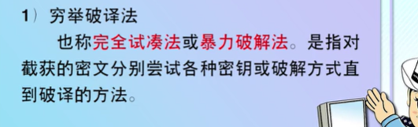

**案例**

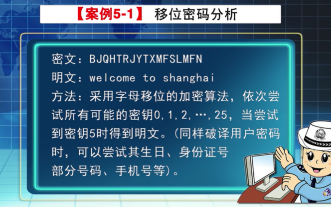

### 统计分析法

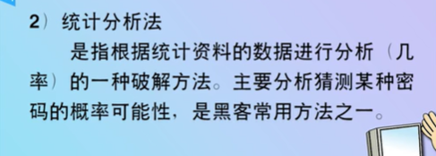

### 其他方法

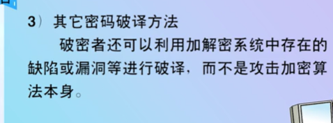

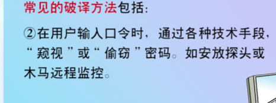

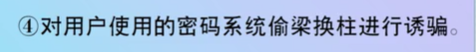

### 防止措施

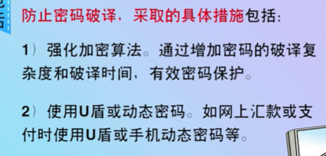

## 密钥管理方式

### 对称密码体制的密钥管理

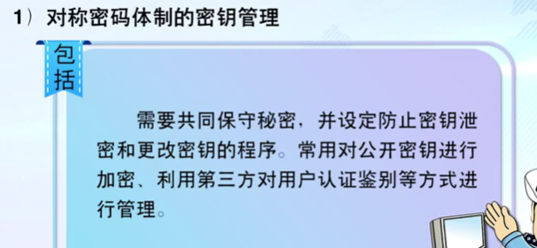

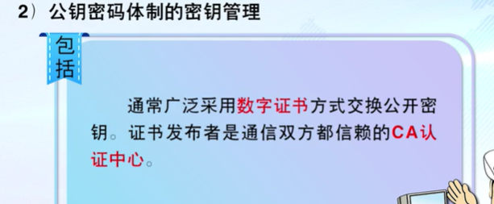

## 常用加密技术应用

### 古典密码体制

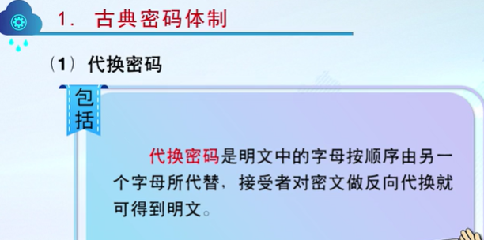

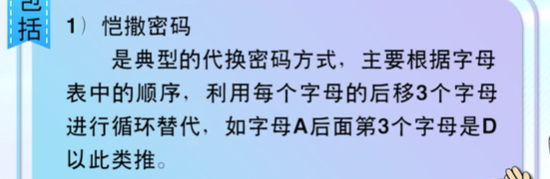

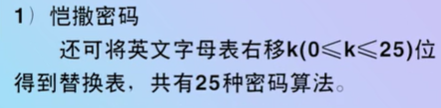

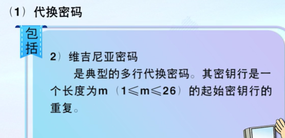

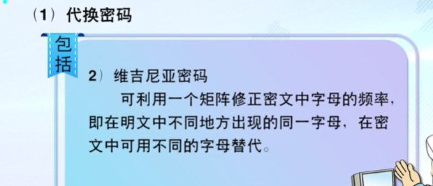

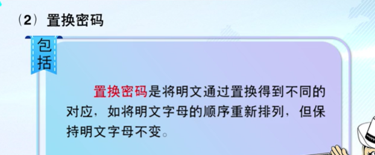

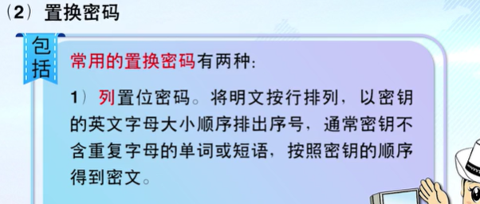

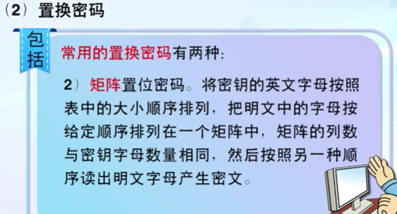

### 单向加密体制

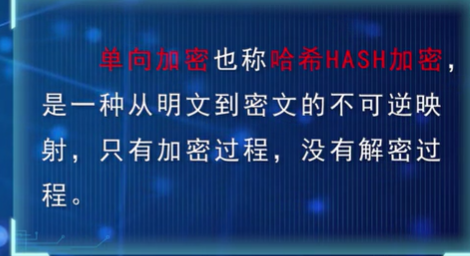

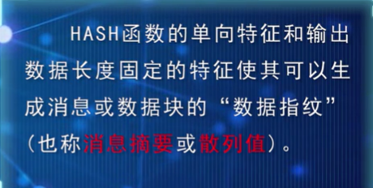

### 无线网络加密技术

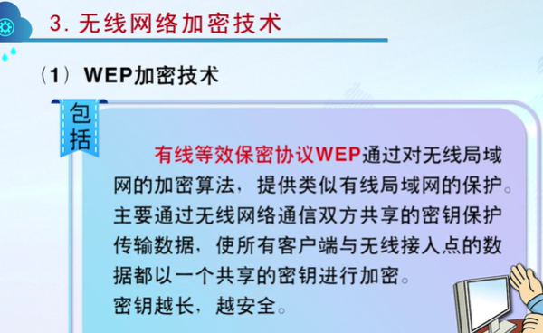 

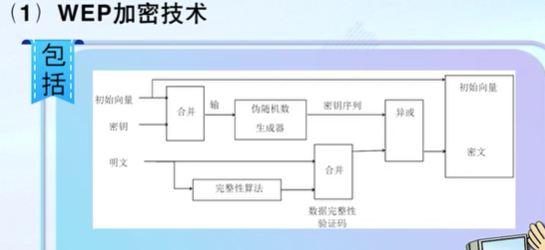

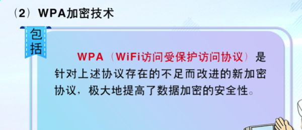

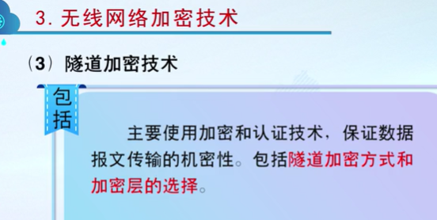

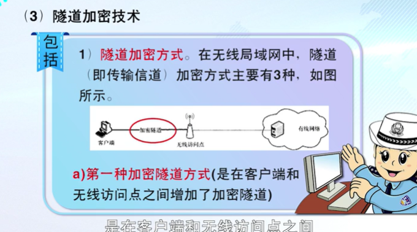

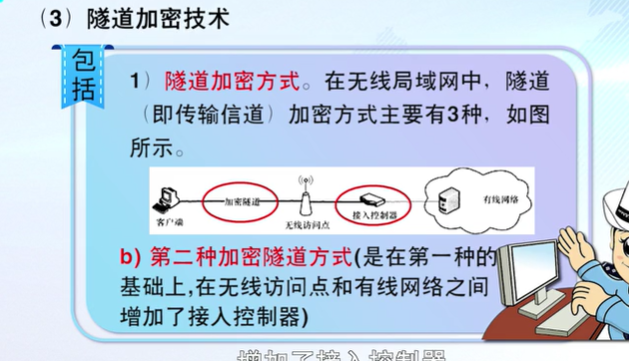

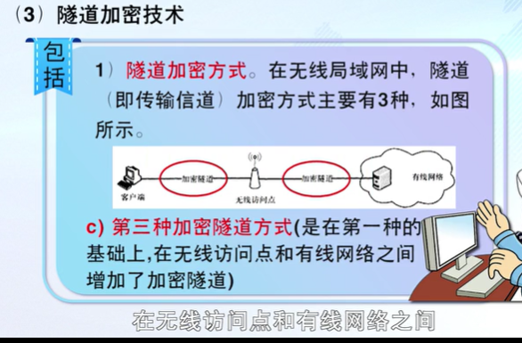

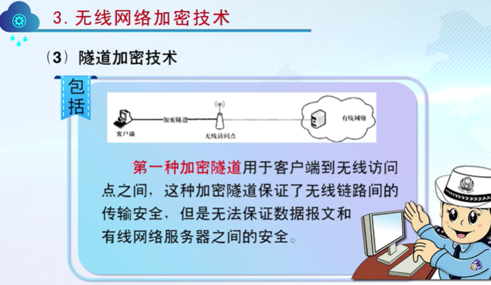

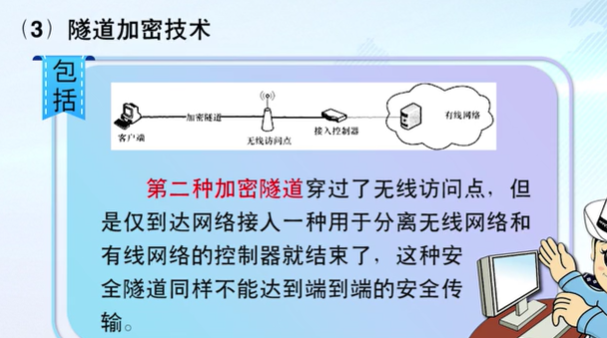

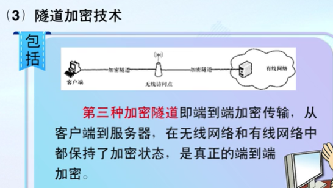

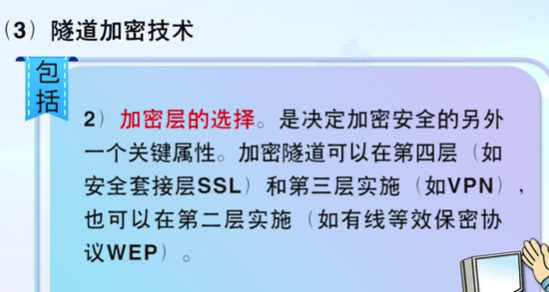

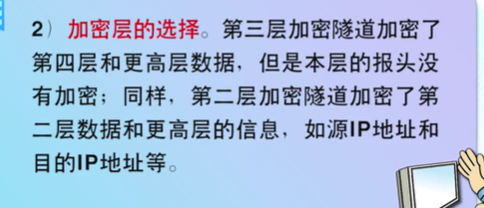

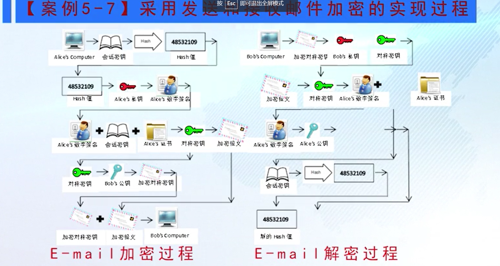

# 身份认证与访问控制

## 访问控制

### 概念及原理

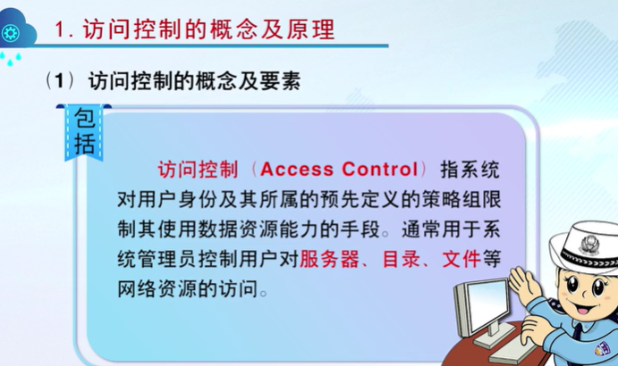

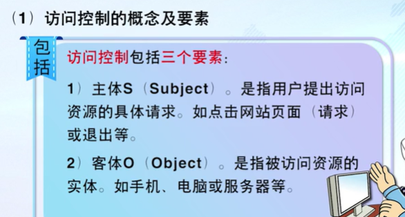

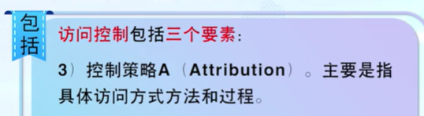

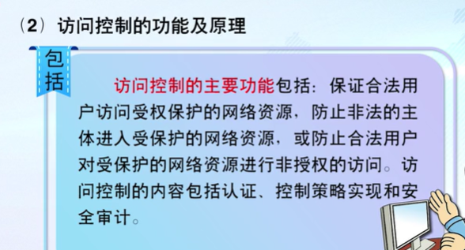

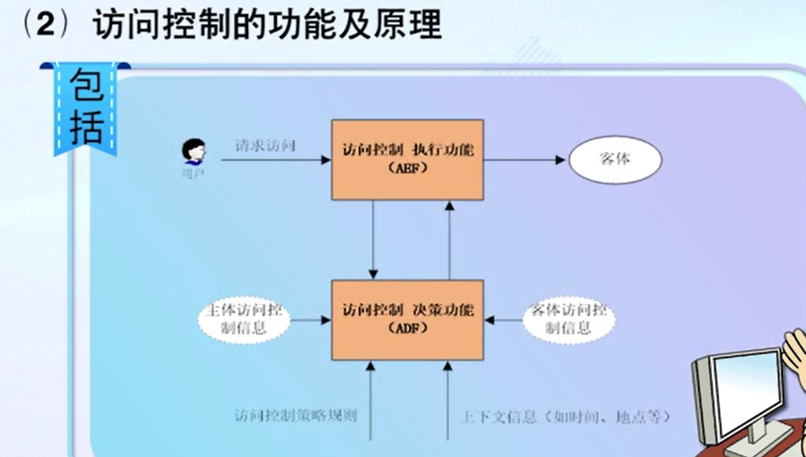

### 类型及机制

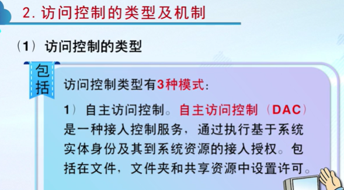

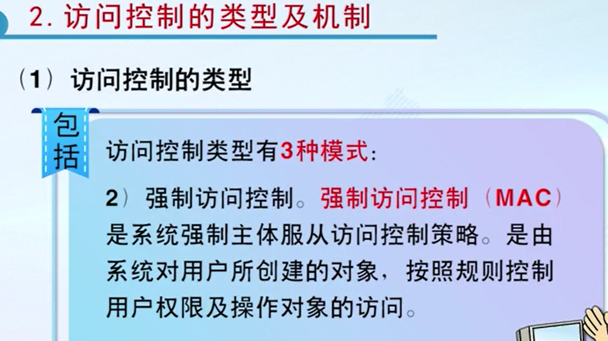

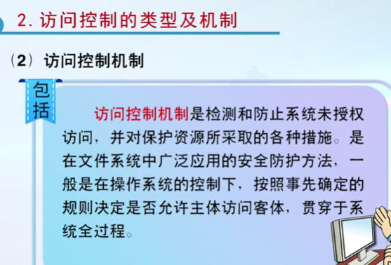

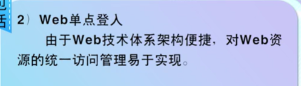

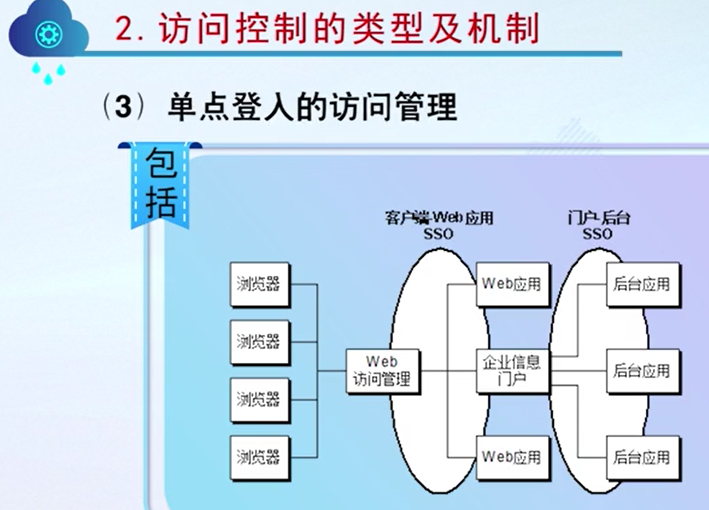

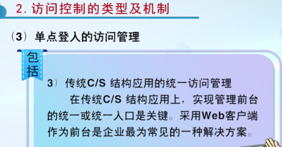

### 安全策略

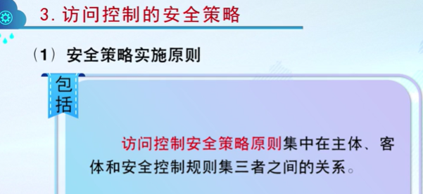

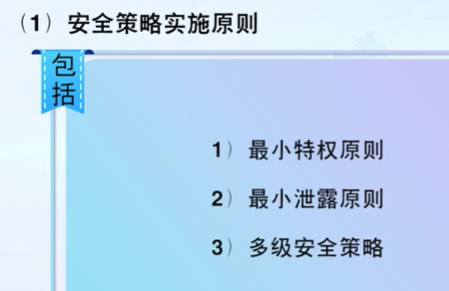

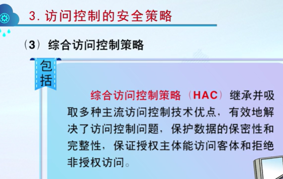

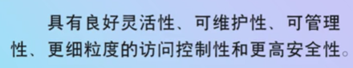

### 认证服务与访问控制系统

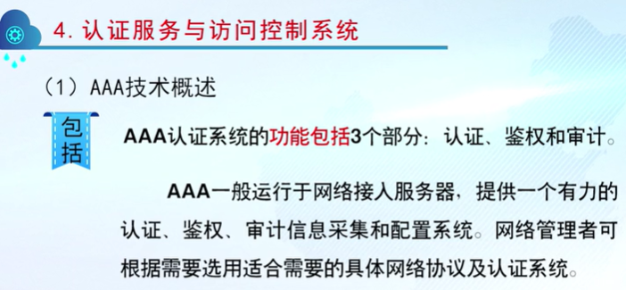

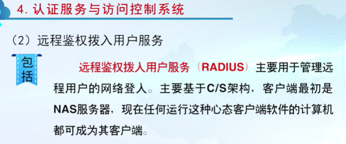

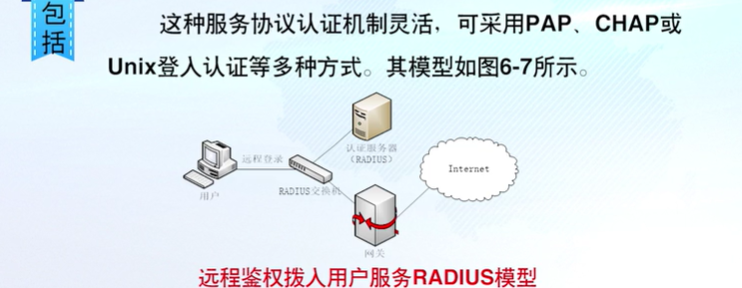

### 准入控制与身份认证管理

# 防火墙技术

## 防火墙的定义

## 防火墙基本功能

**实际应用**

## 优缺点及特性

### **缺点**

### 特性

## 分类和应用

### 分类

### 应用

# 计算机及手机病毒防范

## 计算机病毒的构成与传播

**构成**

