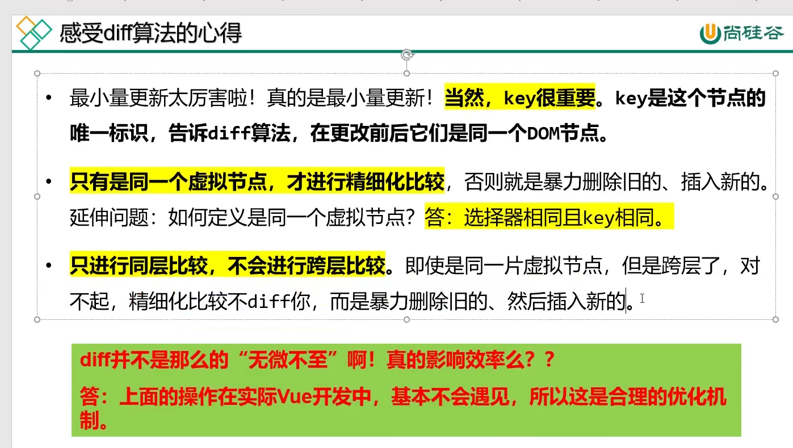

# Vue源码解析之虚拟DOM和diff算法

## 01 课程内容介绍


## 02 snabbdom 简介和测试环境搭配

### snabbdom

tips：虚拟 dom 的核心库

#### 安装


#### 测试环境搭建


```js
module.exports = {
    // 入口
    entry: './src/index.js',
    // 出口
    output: {
        // （webpack-dev-server的时候）虚拟打包路径，就是说文件夹不会真正生成，而是在8080端口虚拟生成
        publicPath: 'xuni',
        // 打包出来的文件名，不会真正的物理生成
        filename: 'bundle.js'
    },
    devServer: {
        // 端口号
        port: 8080,
        // 静态资源文件夹
        contentBase: 'www'
    }
};
```

## 03 虚拟Dom和h函数

### 虚拟Dom 概念


### diff 是发生在虚拟DOM上的


### 本次课研究什么？


###  h 函数用来产生虚拟节点


### 一个虚拟节点有多些属性


```js
import { init } from 'snabbdom/init';
import { classModule } from 'snabbdom/modules/class';
import { propsModule } from 'snabbdom/modules/props';
import { styleModule } from 'snabbdom/modules/style';
import { eventListenersModule } from 'snabbdom/modules/eventlisteners';
import { h } from 'snabbdom/h';

// 创建出patch函数
const patch = init([classModule, propsModule, styleModule, eventListenersModule]);

// 创建虚拟节点
const myVnode1 = h('a', {
    props: {
        href: 'http://www.atguigu.com',
        target: '_blank'
    }
}, '尚硅谷');

// 没有属性的话可以省略第二个参数
const myVnode2 = h('div', '我是一个盒子');

// 有层级的嵌套用数组
const myVnode3 = h('ul', [
    h('li', {}, '苹果'),
    h('li', '西瓜'),
    h('li', [
        h('div', [
            h('p', '哈哈'),
            h('p', '嘻嘻')
        ])
    ]),
    h('li', h('p', '火龙果')) // 单个嵌套可以省略数组
]);

console.log(myVnode3);

// 让虚拟节点上树
const container = document.getElementById('container');
patch(container, myVnode3);
```


### 手写 h 函数

**vnode.js**


**h.js**

```js
import vnode from './vnode.js';

// 编写一个低配版本的h函数，这个函数必须接受3个参数，缺一不可
// 相当于它的重载功能较弱。
// 也就是说，调用的时候形态必须是下面的三种之一：
// 形态① h('div', {}, '文字')
// 形态② h('div', {}, [])
// 形态③ h('div', {}, h())
export default function (sel, data, c) {
    // 检查参数的个数
    if (arguments.length != 3)
        throw new Error('对不起，h函数必须传入3个参数，我们是低配版h函数');
    // 检查参数c的类型
    if (typeof c == 'string' || typeof c == 'number') {
        // 说明现在调用h函数是形态①
        return vnode(sel, data, undefined, c, undefined);
    } else if (Array.isArray(c)) {
        // 说明现在调用h函数是形态②
        let children = [];
        // 遍历c，收集children
        for (let i = 0; i < c.length; i++) {
            // 检查c[i]必须是一个对象，如果不满足
            if (!(typeof c[i] == 'object' && c[i].hasOwnProperty('sel')))
                throw new Error('传入的数组参数中有项不是h函数');
            // 这里不用执行c[i]，因为你的测试语句中已经有了执行
            // 此时只需要收集好就可以了
            children.push(c[i]);
        }
        // 循环结束了，就说明children收集完毕了，此时可以返回虚拟节点了，它有children属性的
        return vnode(sel, data, children, undefined, undefined);
    } else if (typeof c == 'object' && c.hasOwnProperty('sel')) {
        // 说明现在调用h函数是形态③
        // 即，传入的c是唯一的children。不用执行c，因为测试语句中已经执行了c。
        let children = [c];
        return vnode(sel, data, children, undefined, undefined);
    } else {
        throw new Error('传入的第三个参数类型不对');
    }
};
```

### 感受 diff 算法



```js
// 得到盒子和按钮
const container = document.getElementById('container');
const btn = document.getElementById('btn');

// 创建出patch函数
const patch = init([classModule, propsModule, styleModule, eventListenersModule]);

const vnode1 = h('ul', {}, [
    h('li', { key: 'A' }, 'A'),
    h('li', { key: 'B' }, 'B'),
    h('li', { key: 'C' }, 'C'),
    h('li', { key: 'D' }, 'D')
]);

patch(container, vnode1);

const vnode2 = h('ul', {}, [
    h('li', { key: 'D' }, 'D'),
    h('li', { key: 'A' }, 'A'),
    h('li', { key: 'C' }, 'C'),
    h('li', { key: 'B' }, 'B')
]);

// 点击按钮时，将vnode1变为vnode2
btn.onclick = function () {
    patch(vnode1, vnode2); // 因为 key 相同内容也没有变化，diff 算法后节点只是移动位置
};
```

