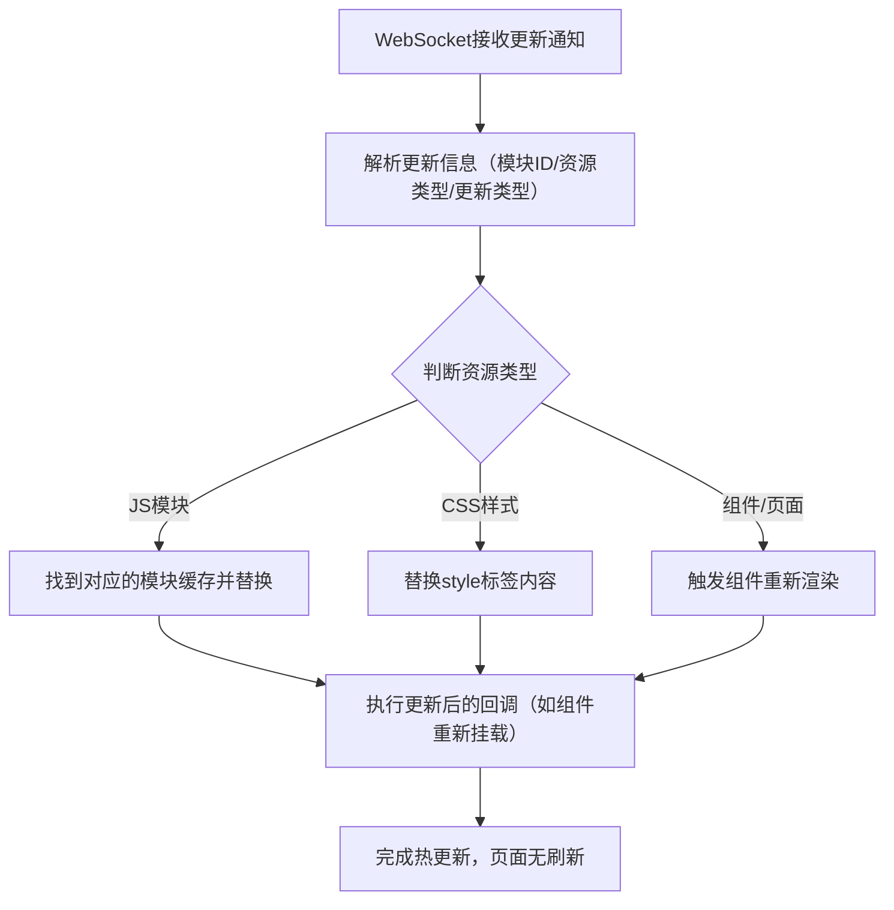

这个过程核心是**按需替换**而非刷新整个页面，Vite 和 Webpack 的实现思路一致但细节有差异（Vite 更轻量），下面我会从通用逻辑到具体实现逐步拆解：

### 一、浏览器端 HMR 替换资源的核心流程

先明确整体逻辑，再分步骤解释：



### 二、具体替换逻辑（分资源类型）

#### 1. CSS 样式替换（最简单，Vite/Webpack 逻辑一致）

CSS 热更新是最基础的场景，无需执行 JS 逻辑，直接操作 DOM 即可：

-   WebSocket 推送的更新信息包含：`{ type: 'css-update', path: '/src/style.css', content: '新的CSS内容' }`
-   浏览器端处理逻辑：
    1. 根据 `path` 找到页面中对应的 `<style>` 标签（HMR 注入的 style 标签会带有唯一标识，如 `data-vite-dev-id="/src/style.css"`）；
    2. 直接替换该 style 标签的 `textContent` 为新的 CSS 内容；
    3. 若找不到对应标签（如新增样式），则创建新的 style 标签并插入 head 中；
    4. 旧样式会被自动覆盖，页面样式实时更新。

#### 2. JS 模块替换（核心差异点）

这是最复杂的部分，Vite 和 Webpack 都基于 ES 模块的特性，但实现方式不同：

##### （1）Webpack 的 JS 模块替换（基于模块缓存 + 模块图）

Webpack 会为每个模块生成唯一的 `module ID`，并维护一个**模块缓存对象**（`__webpack_modules__`）和**模块导出缓存**（`__webpack_exports__`）：

1. 接收更新通知：包含 `{ type: 'module', updatedModules: [123], removedModules: [] }`（123 是模块 ID）；
2. 清除缓存：删除 `__webpack_modules__[123]` 和 `__webpack_exports__[123]` 中的旧模块；
3. 重新加载模块：通过 `import()` 动态加载更新后的模块（URL 带哈希避免缓存）；
4. 执行热替换回调：Webpack 会调用模块中定义的 `module.hot.accept()` 回调，比如 React 组件会在回调中重新渲染组件，替换页面中的旧组件；
5. 兜底处理：若模块无法热替换（如无 accept 回调），则触发 `window.location.reload()` 刷新页面。

##### （2）Vite 的 JS 模块替换（基于原生 ES 模块 + 缓存失效）

Vite 不打包开发环境的代码，直接使用浏览器原生 ES 模块，因此替换更轻量：

1. 接收更新通知：包含 `{ type: 'update', updates: [{ path: '/src/App.vue', timestamp: 123456 }] }`；
2. 失效模块缓存：Vite 会修改浏览器的 `import.meta.hot` 对象，标记该模块为“过期”；
3. 重新加载模块：通过 `import()` 动态加载带时间戳的新模块（如 `/src/App.vue?t=123456`），原生 ES 模块会直接请求新资源（避免缓存）；
4. 触发组件更新：Vite 针对 Vue/React 等框架做了内置适配，会自动调用框架的更新逻辑（如 Vue 的 `app.mount()` 重新挂载组件）；
5. 清理旧模块：移除旧模块的导出引用，避免内存泄漏。

#### 3. 静态资源/图片替换

这类资源的更新逻辑更简单：

1. WebSocket 推送资源更新路径（如 `/src/assets/logo.png`）；
2. 浏览器找到页面中引用该资源的元素（``）；
3. 修改 `src` 属性为带时间戳的新路径（如 `/src/assets/logo.png?t=123456`），浏览器会自动重新请求新图片并渲染；
4. 若资源被 CSS 引用（如 `background: url(logo.png)`），则会触发 CSS 热更新（如上文的 CSS 替换逻辑）。

### 三、核心代码示例（简化版）

下面是浏览器端处理 HMR 替换的核心逻辑简化代码，帮你理解本质：

```javascript
// 模拟 WebSocket 接收更新通知
const ws = new WebSocket('ws://localhost:3000/ws');
ws.onmessage = (e) => {
    const update = JSON.parse(e.data);

    // 处理 CSS 更新
    if (update.type === 'css-update') {
        const styleTag = document.querySelector(
            `style[data-vite-dev-id="${update.path}"]`
        );
        if (styleTag) {
            styleTag.textContent = update.content; // 直接替换 CSS 内容
        }
    }

    // 处理 JS 模块更新
    if (update.type === 'module-update') {
        // 清除模块缓存（Webpack 逻辑）
        delete __webpack_modules__[update.moduleId];
        // 动态加载新模块
        import(update.modulePath + '?t=' + Date.now()).then((newModule) => {
            // 执行热替换回调，更新页面
            if (module.hot?.accept) {
                module.hot.accept(() => {
                    // React/Vue 组件重新渲染逻辑
                    renderApp(newModule.default);
                });
            }
        });
    }
};
```

### 总结

1. **核心原则**：浏览器端始终遵循“按需替换”，只更新变化的资源，而非刷新整个页面，核心是**清除缓存 + 重新加载 + 框架适配更新**；
2. **CSS 替换**：直接操作 DOM 替换 style 标签内容，是最轻量化的更新；
3. **JS 替换**：Webpack 基于自定义模块缓存，Vite 基于原生 ES 模块，均通过 `import()` 动态加载新模块，并触发框架的更新逻辑；
4. **差异点**：Vite 利用原生 ES 模块减少了打包开销，更新速度更快；Webpack 依赖自定义模块系统，兼容性更好但更新流程稍复杂。
