# 创建第一个应用

## 	Web 框架选择

# 控制器

## 状态码

默认情况下，响应的**状态码**总是**200**，我们可以通过在处理程序层添加 `@HttpCode` 装饰器来轻松更改此行为。

```typescript
import { Controller, Get, Provide, HttpCode } from '@midwayjs/decorator';
@Provide()
@Controller('/')
export class HomeController {  
    @Get('/')  
    @HttpCode(201)  
    async home() {    return 'Hello Midwayjs!';  }
}
```

tips：状态码装饰器不能在响应流关闭后（response.end 之后）修改。

## 响应头

Midway 提供 `@SetHeader` 装饰器来简单的设置自定义响应头。

```typescript
import { Controller, Get, Provide, SetHeader } from '@midwayjs/decorator';
@Provide()
@Controller('/')
export class HomeController {  
    @Get('/')  
    @SetHeader('x-bbb', '123')  
    async home() {    return 'Hello Midwayjs!';  }
}
```

当有多个响应头需要修改的时候，你可以直接传入对象。

```typescript
import { Controller, Get, Provide, SetHeader } from '@midwayjs/decorator';
@Provide()
@Controller('/')
export class HomeController {  
    @Get('/')  
    @SetHeader({    'x-bbb': '123',    'x-ccc': '234',  })  
    async home() {    return 'Hello Midwayjs!';  }
}
```

tips：响应头装饰器不能在响应流关闭后（response.end 之后）修改。

## 重定向

如果需要简单的将某个路由重定向到另一个路由，可以使用 `@Redirect` 装饰器。 `@Redirect` 装饰器的参数为一个跳转的 URL，以及一个可选的状态码，默认跳转的状态码为 `302` 。

```typescript
import { Controller, Get, Provide, Redirect } from '@midwayjs/decorator';
@Provide()
@Controller('/')
export class LoginController {  
  @Get('/login_check')  
  async check() {    // TODO  
  }
  @Get('/login')  
  @Redirect('/login_check')  
  async login() {    // TODO  }
  @Get('/login_another')  
  @Redirect('/login_check', 302)  
  async loginAnother() {    // TODO  }
}
```

tips：重定向装饰器不能在响应流关闭后（response.end 之后）修改。

## 响应类型

虽然浏览器会自动根据内容判断最佳的响应内容，但是我们经常会碰到需要手动设置的情况。我们也提供了 `@ContentType` 装饰器用于设置响应类型。

```typescript
import { Controller, Get, Provide, ContentType } from '@midwayjs/decorator';
@Provide()
@Controller('/')
export class HomeController {  
    @Get('/')  
    @ContentType('html')  
    async login() {    return '<body>hello world</body>';  }
}
```

tips：响应类型装饰器不能在响应流关闭后（response.end 之后）修改。

## 优先级

midway 已经统一对路由做排序，通配的路径将自动降低优先级，在最后被加载。

规则如下：

- 1、绝对路径规则优先级最高如 `/ab/cb/e`
- 2、星号只能出现最后且必须在/后面，`如 /ab/cb/**`
- 3、如果绝对路径和通配都能匹配一个路径时，绝对规则优先级高，比如 `/abc/*` 和 `/abc/d`，那么请求 `/abc/d` 时，会匹配到后一个绝对的路由
- 4、有多个通配能匹配一个路径时，最长的规则匹配，如 `/ab/**` 和 `/ab/cd/**` 在匹配 `/ab/cd/f` 时命中 `/ab/cd/**`
- 5、如果 `/` 与 `/*` 都能匹配 `/` ,但 `/` 的优先级高于 `/*`
- 6、如果都为通配，但是其余权重都一样，比如 `/:page/page` 和 `/page/:page` ，那么两者权重等价，以编码加载顺序为准

此规则也与 Serverless 下函数的路由规则保持一致。

简单理解为，“明确的路由优先级最高，长的路由优先级高，通配的优先级最低”。

比如：

```typescript
@Controller('/api')export class APIController {  
    @Get('/invoke/*')  
    async invokeAll() {}
  	@Get('/invoke/abc')  
    async invokeABC() {}
}
```

这种情况下，会先注册 `/invoke/abc` ，保证优先级更高。

不同的 Controller 的优先级，我们会以长度进行排序， `/` 根 Controller 我们将会最后加载。

# 服务和注入

在业务中，只有控制器（Controller）的代码是不够的，一般来说会有一些业务逻辑被抽象到一个特定的逻辑单元中，我们一般称为服务（Service）。


提供这个抽象有以下几个好处：

- 保持 Controller 中的逻辑更加简洁。
- 保持业务逻辑的独立性，抽象出来的 Service 可以被多个 Controller 重复调用。
- 将逻辑和展现分离，更容易编写测试用例。

## 创建服务

在 Midway 中，普通的服务就是一个 Class，比如我们之前创建了一个接受 user 请求的 Controller，这些我们来新增一个处理这些数据的服务。

对于服务的文件，我们一般会存放到 `src/service` 目录中。我们来添加一个 user 服务。

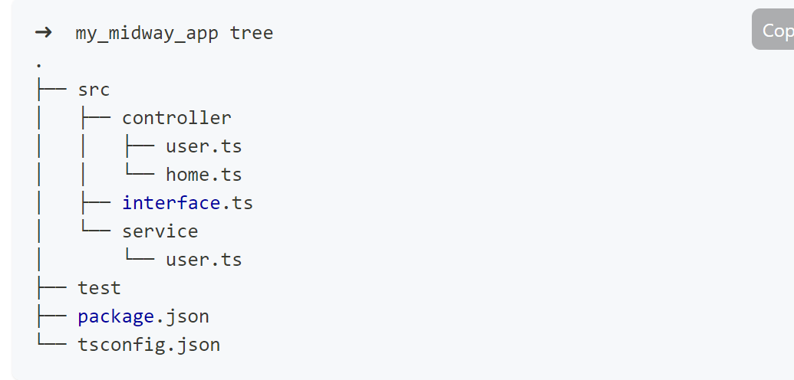

内容为：

```typescript
// src/service/user.tsimport { Provide } from '@midwayjs/decorator';
@Provide()
export class UserService {  
    async getUser(id: number) {    
        return {      
            id,      
            name: 'Harry',      
            age: 18,    
        };  
    }
}
```

**除了一个 `@Provide` 装饰器外，整个服务的结构和普通的 Class 一模一样，这样就行了。**

**之前我们还增加了一个 User 定义，这里也可以直接使用。**

```typescript
import { Provide } from '@midwayjs/decorator';
import { User } from '../interface';

@Provide()
export class UserService {

  async getUser(id: number): Promise<User> {
    return {
      id,
      name: 'Harry',
      age: 18',
    };
  }
}
```

## 使用服务

在 Controller 处，我们需要来调用这个服务。传统的代码写法，我们需要初始化这个 Class（new），然后将实例放在需要调用的地方。在 Midway 中，你**不需要这么做**，只需要编写我们提供的 **"依赖注入"** 的代码写法。

```typescript
import { Inject, Controller, Get, Provide, Query } from '@midwayjs/decorator';
import { UserService } from '../service/user';

@Provide()
@Controller('/api/user')
export class APIController {
  @Inject()
  userService: UserService;

  @Get('/')
  async getUser(@Query('id') uid) {
    const user = await this.userService.getUser(uid);
    return { success: true, message: 'OK', data: user };
  }
}
```

**使用服务的过程分为几部分：**

- 1、使用 `@Provide` 装饰器暴露你的服务
- 2、在调用的代码处，使用 `@Inject` 装饰器注入你的服务
- 3、调用注入服务，执行对应的方法

Midway 的核心 “依赖注入” 容器会**自动关联**你的控制器（Controller） 和服务（Service），在运行过程中**会自动初始化**所有的代码，你**无需手动初始化**这些 Class。

## 注入行为描述

看到这里，你应该明白为什么控制器（Controller) 和服务（Service）上都有一个 `@Provide` 装饰器。不仅如此，之后的大部分代码中，你都会发现这个装饰器。

**`@Provide` 装饰器的作用：**

- 1、这个 Class，被依赖注入容器托管，会自动被实例化（new）
- 2、这个 Class，可以被其他在容器中的 Class 注入

而对应的 `@Inject` 装饰器，作用为：

- 1、在依赖注入容器中，找到对应的属性名，并赋值为对应的实例化对象

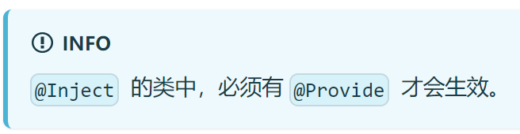

`@Provide` 和 `@Inject` 装饰器是成对出现的，两者通过冒号后的类名进行关联。

```typescript
// service
@Provide()
export class UserService {  
    //...
}
// controller
@Provide()
@Controller('/api/user')
export class APIController {  
    @Inject()  
    userService: UserService; // <------ 这里的类型是 Class，即会注入一个该类型的实例
  //...
}
```

# 请求、响应、应用

Midway 框架会根据不同的场景来启动不同的应用，前文提到，我们**默认选用 EggJS 作为我们的 Web 框架，也可以使用 Express 或者 Koa。**

每个使用的 Web 框架会提供自己独特的能力，这些独特的能力都会体现在各自的 **请求和响应**（Context）和 **应用**（Application）之上。

## 上下文和应用定义约定[#](https://midwayjs.org/docs/req_res_app#上下文和应用定义约定)

为了简化使用，所有的上层框架导出 **请求和响应**（Context）和 **应用**（Application）定义，我们都保持一致。即 `Context` 和 `Application` 。

```typescript
import { Application, Context } from 'egg';
import { Application, Context } from '@midwayjs/koa';
import { Application, Context } from '@midwayjs/express';
```

且非 Web 框架，我们也保持了一致。

```typescript
import { Application, Context } from '@midwayjs/socketio';
import { Application, Context } from '@midwayjs/grpc';
import { Application, Context } from '@midwayjs/rabbitmq';
```

## 请求和响应

每个 Web 框架的请求和响应对象是不同的，EggJS 和 Koa 都是使用 `ctx` 对象，而 Express 使用 `req` ， `res` 对象。

在 Midway 提供的装饰器不够，或者需要复杂业务逻辑的时候，我们就需要原生框架的对象支持。

在 **默认的请求作用域** 中，也就是说在 控制器（Controller）或者普通的 服务（Service）中，我们可以使用 `@Inject` 来注入对应的实例。

比如在以 EggJS 为上层 Web 框架代码中，我们可以这样获取到对应的 ctx 实例。

```typescript
import { Inject, Controller, Get, Provide } from '@midwayjs/decorator';
import { Context } from 'egg';

@Provide()
@Controller('/')
export class HomeController {
  @Inject()
  ctx: Context;

  @Get('/')
  async home() {
    // this.ctx.query
  }
}
```

而 Koa 和 Express 则是不同的用法。Koa 示例如下。

```typescript
import { Inject, Controller, Get, Provide } from '@midwayjs/decorator';
import { Context } from '@midwayjs/koa';

@Provide()
@Controller('/')
export class HomeController {
  @Inject()
  ctx: Context;

  @Get('/')
  async home() {
    // this.ctx.query
  }
}
```

Express 比较特殊， `@Inject` 注入的 ctx 对象由 Midway 做了封装，为 Express 的 req 对象和 res 对象的集合。

```typescript
import { Inject, Controller, Get, Provide } from '@midwayjs/decorator';
import { Context } from '@midwayjs/express';
import { Request, Response } from 'express';

@Provide()
@Controller('/')
export class HomeController {
  @Inject()
  ctx: Context; // 包含了 req 和 res

  @Inject()
  req: Request;

  @Inject()
  res: Response;

  @Get('/')
  async home() {
    // this.req.query
  }
}
```

## 应用实例

**在编写业务代码中，有时候我们需要用到原本框架的能力，而这些能力可能暴露在各自的 app 对象之上。Midway 提供了 `@App` 这个装饰器，用于注入当前运行时的 app 示例。**

```typescript
import { App, Controller, Get, Provide } from '@midwayjs/decorator';
import { Application } from 'egg';

@Provide()
@Controller('/')
export class HomeController {
  @App()
  app: Application;

  @Get('/')
  async home() {
    const data = await this.app.curl('/api/data.json');
    return {
      data,
    };
  }
}
```

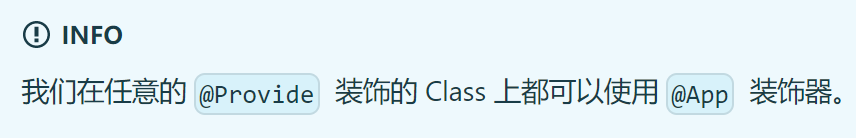

而在 Koa 为 Web 框架的应用上，将会注入 Koa 的 app 实例。

```typescript
import { App, Controller, Get, Provide } from '@midwayjs/decorator';
import { Application } from '@midwayjs/koa';

@Provide()
@Controller('/')
export class HomeController {
  @App()
  app: Application;

  @Get('/')
  async home() {
    // this.app.use(xxx)
  }
}
```

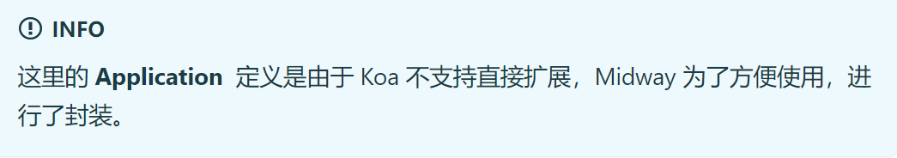

# Web 中间件

Web 中间件是在控制器调用  **之前** 和 **之后（部分）** 调用的函数。 中间件函数可以访问请求和响应对象。

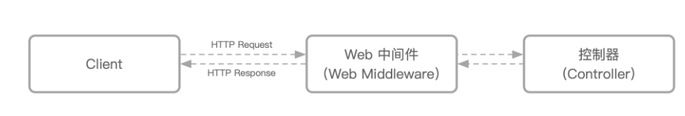

不同的上层 Web 框架中间件形式不同，EggJS 的中间件形式和 Koa 的中间件形式相同，都是基于[洋葱圈模型](https://eggjs.org/zh-cn/intro/egg-and-koa.html#midlleware)。而 Express 则是传统的队列模型。

所以在 Express 中，中间件**只能在控制器之前**调用，而 Koa 和 EggJs 可以在**控制器前后都被执行**。

由于 Web 中间件使用较为类同，下面的代码，我们将以 @midwayjs/web（Egg.js）框架举例。

## 编写 Web 中间件

一般情况下，我们会在 `src/middleware` 文件夹中编写 Web 中间件。

创建一个 `src/middleware/report.ts` 。我们在这个 Web 中间件中打印了控制器（Controller）执行的时间。

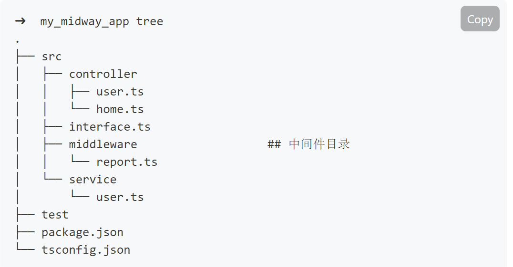

代码如下。

```typescript
import { Provide } from '@midwayjs/decorator';
import { IWebMiddleware, IMidwayWebNext } from '@midwayjs/web';
import { Context } from 'egg';

@Provide()
export class ReportMiddleware implements IWebMiddleware {
  resolve() {
    return async (ctx: Context, next: IMidwayWebNext) => {
      // 控制器前执行的逻辑
      const startTime = Date.now();
      // 执行下一个 Web 中间件，最后执行到控制器
      await next();
      // 控制器之后执行的逻辑
      console.log(Date.now() - startTime);
    };
  }
}
```

简单来说， `await next()` 则代表了下一个要执行的逻辑，这里一般代表控制器执行，在执行的前后，我们可以进行一些打印和赋值操作，这也是洋葱圈模型最大的优势。

注意，这里我们导出了一个 `ReportMiddleware` 类，这个中间件类的 key 为 `reportMiddleware` 。

## 使用 Web 中间件

Web 中间件在写完之后，需要应用到请求流程之中。

根据应用到的位置，分为两种：

- 1、全局中间件，所有的路由都会执行的中间件，比如 cookie、session 等等
- 2、路由中间件，单个/部分路由会执行的中间件，比如某个路由的前置校验，数据处理等等

他们之间的关系一般为：

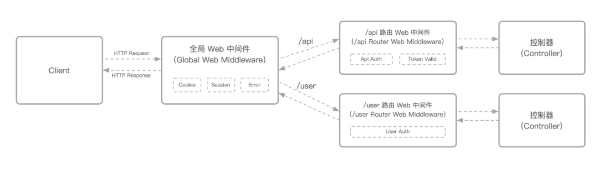

### 路由中间件[#](https://midwayjs.org/docs/web_middleware#路由中间件)

在写完中间件之后，我们需要把它应用到各个控制器路由之上。 `@Controller` 装饰器的第二个参数，可以让我们方便的在某个路由分组之上添加中间件。

```typescript
import { Controller, Provide } from '@midwayjs/decorator';
import { Context } from 'egg';

@Provide()
@Controller('/', { middleware: ['reportMiddleware'] })
export class HomeController {}
```

Midway 同时也在 `@Get` 、 `@Post` 等路由装饰器上都提供了 middleware 参数，方便对单个路由做中间件拦截。

```typescript
import { Controller, Get, Provide } from '@midwayjs/decorator';

@Provide()
@Controller('/')
export class HomeController {
  @Get('/', { middleware: ['reportMiddleware'] })
  async home() {}
}
```

这里 middleware 属性的参数则是依赖注入容器的 key，也就是 `@Provide` 的值，前面讲过，默认为类名的驼峰形式。

### 全局中间件

所谓的全局中间件，就是对所有的路由生效的 Web 中间件。传统的 Express/Koa 中间件都可以是全局中间件。

**设置全局中间件需要拿到应用的实例，同时，需要在所有请求之前被加载。**

在 EggJS 中，其提供了一个配置性的加载全局中间件的用法。在 `src/config/config.default.ts` 中配置 `middleware` 属性即可定义全局中间件，同样的，指定全局中间件的 key 即可。

```typescript
// src/config/config.default.ts

export default (appInfo: EggAppInfo) => {
  const config = {} as DefaultConfig;

  // ...

  config.middleware = ['reportMiddleware'];

  return config;
};
```

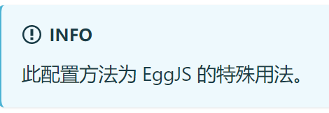

## 常见示例（跳过）

# 启动和部署

Midway 提供了一个轻量的启动器，用于启动你的应用。我们为应用提供了多种部署模式，你既可以将应用按照传统的样子，部署到任意的服务上（比如自己购买的服务器），也可以将应用构建为一个 Serverless 应用，Midway 提供跨多云的部署方式。

## 本地开发

这里列举的主要是本地使用 `dev` 命令开发的方式，有两种。

### 快速启动单个服务

在本地研发时，Midway 在 `package.json` 中提供了一个 `dev` 命令启动框架，比如：

```json
{  
    "script": {    
        "dev": "midway-bin dev --ts"  
    }
}
```

这是一个最精简的命令，他有如下特性：

- 1、使用 `--ts` 指定 TypeScript（ts-node）环境启动
- 2、使用内置的（@midwayjs/mock 的 createApp）创建一个**匹配当前框架** 的服务，并返回 app


在命令行运行下面的命令即可执行。

```bash
$ npm run dev
```

**所谓匹配当前框架，指的是根据内部的框架列表，和 pkg 的依赖匹配查找到最符合当前的框架并启动。**

内部的框架列表如下：

```typescript
const currentFramework = [  '@midwayjs/web',  '@midwayjs/koa',  '@midwayjs/express',  '@midwayjs/serverless-app',  '@midwayjs/grpc',  '@midwayjs/rabbitmq',  '@midwayjs/socketio',  '@midwayjs/faas',];
```

这样启动的服务用于本地快速开发测试，使用的是 **框架初始化的默认值**。

比如，你的 `package.json` 中依赖如下；

```typescript
{    
    "@midwayjs/grpc": "xxx",  
     "@midwayjs/web": "xxx"
}
```

**按照优先级顺序，默认的 `dev` 依旧会启动 `@midwayjs/web` 服务。**

### 指定入口启动服务（不太懂）

由于本地的 dev 命令普通情况下和 `bootstrap.js` 启动文件初始化参数不同，有些用户担心本地开发和线上开发不一致，或者希望一次启动多个框架（多种协议）。

这个时候我们可以直接传递一个入口文件给 `dev` 命令，直接使用入口文件启动服务。

```json
{  
    "script": {    
        "dev": "midway-bin dev --ts --entryFile=bootstrap.js"  
    }
}
```

##### INFO 这种情况下，会忽略其余的参数，比如 --port。

## 部署到普通服务器

### 部署后和本地开发的区别[#](https://midwayjs.org/docs/deployment#部署后和本地开发的区别)

在部署后，有些地方和本地开发有所区别。

**1、node 环境的变化**

最大的不同是，服务器部署后，会直接使用 node 来启动项目，而不是 ts-node，这意味着不再读取 `*.ts` 文件。

**2、加载目录的变化**

服务器部署后，只会加载构建后的 `dist` 目录，而本地开发则是加载 `src` 目录。

|         | **本地**                | **服务器**               |
| ------- | ----------------------- | ------------------------ |
| appDir  | 项目根目录              | 项目根目录               |
| baseDir | 项目根目录下的 src 目录 | 项目根目录下的 dist 目录 |

**3、环境的变化**

服务器环境，一般使用 `NODE_ENV=production` ，很多库都会在这个环境下提供性能更好的方式，例如启用缓存，报错处理等。

**4、日志文件**

一般服务器环境，日志不再打印到项目的 logs 目录下，而是其他不会受到项目更新影响的目录，比如 `home/admin/logs` 等等，这样固定的目录，也方便其他工具采集日志。

### 部署的流程[#](https://midwayjs.org/docs/deployment#部署的流程)

整个部署分为几个部分，由于 Midway 是 TypeScript 编写，比传统 JavaScript 代码增加了一个构建的步骤，整个部署的过程如下。

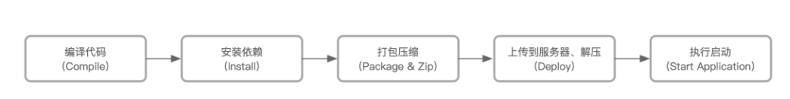

由于部署和平台、环境非常相关，下面我们都将以 Linux 来演示，其他平台可以视情况参考。

### 编译代码和安装依赖

由于 Midway 项目是 TypeScript 编写，在部署前，我们先进行编译。在示例中，我们预先写好了构建脚本，执行 `npm run build` 即可，如果没有，在 `package.json` 中添加下面的 `build` 命令即可。

```json
// package.json
{  
    "scripts": {    
        "build": "midway-bin build -c"  
    }
}
```

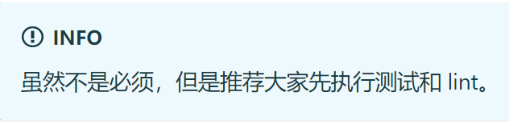

一般来说，部署构建的环境和本地开发的环境是两套，我们推荐在一个干净的环境中构建你的应用。

下面的代码，是一个示例脚本，你可以保存为 `build.sh` 执行。

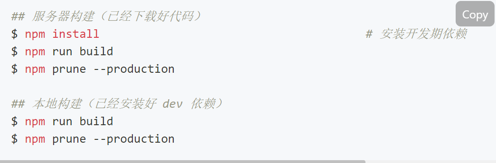

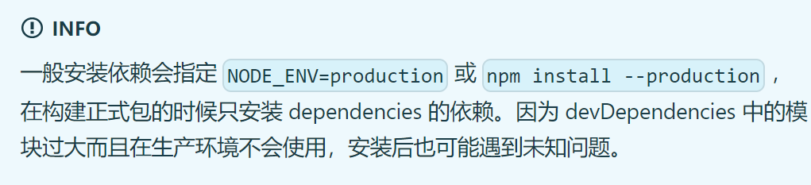

执行完构建后，会出现 Midway 构建产物 `dist` 目录。

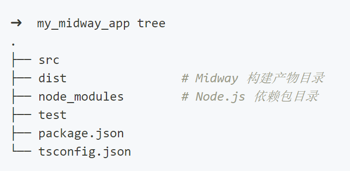

### 打包压缩

构建完成后，你可以简单的打包压缩，上传到待发布的环境。

### 上传和解压

有很多种方式可以上传到服务器，比如常见的 `ssh/FTP/git` 等。也可以使用 [OSS](https://www.aliyun.com/product/oss) 等在线服务进行中转。

### 启动方式一：使用纯 Node.js 或者 pm2 等工具启动[#](https://midwayjs.org/docs/deployment#启动方式一使用纯-nodejs-或者-pm2-等工具启动)

Midway 构建出来的项目是单进程的，不管是采用 `fork` 模式还是 `cluster` 模式，单进程的代码总是很容易的兼容到不同的体系中，因此非常容易被社区现有的 pm2/forever 等工具所加载，

我们这里以 pm2 来演示如何部署。

项目一般都需要一个入口文件，比如，我们在根目录创建一个 `bootstrap.js` 作为我们的部署文件。

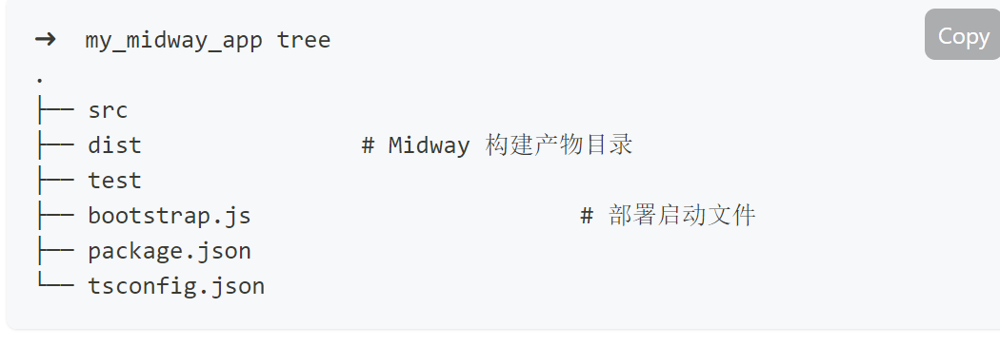

Midway 提供了一个简单方式以满足不同场景的启动方式，只需要安装我们提供的 `@midwayjs/bootstrap` 模块。

```bash
$ npm install @midwayjs/bootstrap --save
```

然后在入口文件中写入代码，注意，这里的代码使用的是 `JavaScript` 。

```javascript
// 获取框架
const WebFramework = require('@midwayjs/web').Framework;
// 初始化 web 框架并传入启动参数
const web = new WebFramework().configure({  port: 7001,});
const { Bootstrap } = require('@midwayjs/bootstrap');
// 加载框架并执行
Bootstrap.load(web).run();
```

**我们提供的每个上层框架都将会导出一个 `Framework` 类，而 `Bootstrap` 的作用则是加载这些框架，传入启动参数，运行他们。**

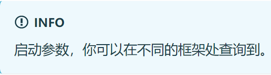

这个时候，你已经可以直接使用 `NODE_ENV=production node bootstrap.js` 来启动代码了，也可以使用 pm2 来执行启动。

**pm2 启动可以参考 [pm2 使用文档](https://midwayjs.org/docs/pm2)。**

如果你希望把 `bootstrap.js` 文件放到不同的目录，比如 `bin/bootstrap.js` ，你可以修改 Bootstrap 的参数。

```javascript
// bin/bootstrap.js
const { join } = require('path');
// 获取框架
const WebFramework = require('@midwayjs/web').Framework;
// 初始化 web 框架并传入启动参数
const web = new WebFramework().configure({  
    port: 7001,
});
const { Bootstrap } = require('@midwayjs/bootstrap');
// 加载框架并执行
Bootstrap.configure({  appDir: join(__dirname, '../'),})  
    .load(web)  
    .run();
```

### 启动方式二：EggJS 特有的启动形式

由于 EggJS 提供了默认的多进程部署工具 `egg-scripts` ，**Midway 也继续支持这种方式，如果上层是 EggJS，推荐这种部署方式。**

首先在依赖中，确保安装 `egg-scripts` 包和 `midway` 包。

```bash
$ npm i egg-scripts --save
```

添加 `npm scripts` 到 `package.json`：

在上面的代码构建之后，使用我们的 `start` 和 `stop` 命令即可完成启动和停止。

```json
"scripts": {    
    "start": "egg-scripts start --daemon --title=********* --framework=@midwayjs/web",    
    "stop": "egg-scripts stop --title=*********",
}
```

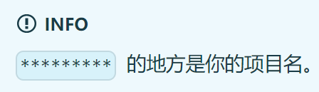

注意：`egg-scripts` 对 Windows 系统的支持有限，参见 [#22](https://github.com/eggjs/egg-scripts/pull/22)。

**启动参数**

```bash
$ egg-scripts start --port=7001 --daemon --title=egg-server-showcase
```

如上示例，支持以下参数：

- `--port=7001` 端口号，默认会读取环境变量 process.env.PORT，如未传递将使用框架内置端口 7001。
- `--daemon` 是否允许在后台模式，无需 nohup。若使用 Docker 建议直接前台运行。
- `--env=prod` 框架运行环境，默认会读取环境变量 process.env.EGG_SERVER_ENV， 如未传递将使用框架内置环境 prod。
- `--workers=2` 框架 worker 线程数，默认会创建和 CPU 核数相当的 app worker 数，可以充分的利用 CPU 资源。
- `--title=egg-server-showcase` 用于方便 ps 进程时 grep 用，默认为 egg-server-${appname}。
- `--framework=yadan` 如果应用使用了[自定义框架](https://eggjs.org/zh-cn/advanced/framework.html)，可以配置 package.json 的 egg.framework 或指定该参数。
- `--ignore-stderr` 忽略启动期的报错。
- `--https.key` 指定 HTTPS 所需密钥文件的完整路径。
- `--https.cert` 指定 HTTPS 所需证书文件的完整路径。
- 所有 [egg-cluster](https://github.com/eggjs/egg-cluster) 的 Options 都支持透传，如 --port 等。

更多参数可查看 [egg-scripts](https://github.com/eggjs/egg-scripts) 和 [egg-cluster](https://github.com/eggjs/egg-cluster) 文档。

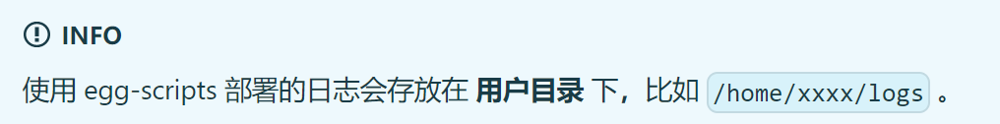

## 部署为 Serverless 应用（跳过）

## 使用 Docker 部署（跳过）

