# 遇到的一些问题

还是要冷静的一道题一道题的过，算法这种东西一次性吃不了太多

# 时间复杂度

## **入门**


## 例题


## 时间复杂度升序表


## 递归的时间复杂度计算

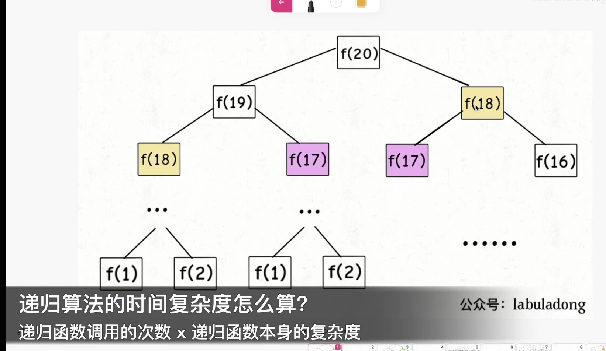

# 	第零章、必读系列 

## 学习算法和刷题的框架思维

### 一、数据结构的存储方式

数据结构种类很多，甚至你也可以发明自己的数据结构，但是底层存储无非数组或者链表，**二者的优缺点如下**：

**数组**由于是紧凑连续存储,可以随机访问，通过索引快速找到对应元素，而且相对节约存储空间。但正因为连续存储，内存空间必须一次性分配够，所以说数组如果要扩容，需要重新分配一块更大的空间，再把数据全部复制过去，时间复杂度 O(N)；而且你如果想在数组中间进行插入和删除，每次必须搬移后面的所有数据以保持连续，时间复杂度 O(N)。

**链表**因为元素不连续，而是靠指针指向下一个元素的位置，所以不存在数组的扩容问题；如果知道某一元素的前驱和后驱，操作指针即可删除该元素或者插入新元素，时间复杂度 O(1)。但是正因为存储空间不连续，你无法根据一个索引算出对应元素的地址，所以不能随机访问；而且由于每个元素必须存储指向前后元素位置的指针，会消耗相对更多的储存空间。

### 二、数据结构的基本操作

对于任何数据结构，其基本操作无非遍历 + 访问，再具体一点就是：增删查改。

**数据结构种类很多，但它们存在的目的都是在不同的应用场景，尽可能高效地增删查改**。话说这不就是数据结构的使命么？

如何遍历 + 访问？我们仍然从最高层来看，各种数据结构的遍历 + 访问无非两种形式：线性的和非线性的。

线性就是 for/while 迭代为代表，非线性就是递归为代表。再具体一步，无非以下几种框架：

数组遍历框架，典型的线性迭代结构：

```java
void traverse(int[] arr) {
    for (int i = 0; i < arr.length; i++) {
        // 迭代访问 arr[i]
    }
}
```

链表遍历框架，兼具迭代和递归结构：

```java
/* 基本的单链表节点 */
class ListNode {
    int val;
    ListNode next;
}

void traverse(ListNode head) {
    for (ListNode p = head; p != null; p = p.next) {
        // 迭代访问 p.val
    }
}

void traverse(ListNode head) {
    // 递归访问 head.val
    traverse(head.next);
}
```

二叉树遍历框架，典型的非线性递归遍历结构：

```java
/* 基本的二叉树节点 */
class TreeNode {
    int val;
    TreeNode left, right;
}

void traverse(TreeNode root) {
    traverse(root.left);
    traverse(root.right);
}
```

你看二叉树的递归遍历方式和链表的递归遍历方式，相似不？再看看二叉树结构和单链表结构，相似不？如果再多几条叉，N 叉树你会不会遍历？

二叉树框架可以扩展为 N 叉树的遍历框架：

```java
/* 基本的 N 叉树节点 */
class TreeNode {
    int val;
    TreeNode[] children;
}

void traverse(TreeNode root) {
    for (TreeNode child : root.children)
        traverse(child);
}
```

N 叉树的遍历又可以扩展为图的遍历，因为图就是好几 N 叉棵树的结合体。你说图是可能出现环的？这个很好办，用个布尔数组 visited 做标记就行了，这里就不写代码了。

**所谓框架，就是套路。不管增删查改，这些代码都是永远无法脱离的结构，你可以把这个结构作为大纲，根据具体问题在框架上添加代码就行了，下面会具体举例**。

###  三、算法刷题指南

首先要明确的是，**数据结构是工具，算法是通过合适的工具解决特定问题的方法**。也就是说，学习算法之前，最起码得了解那些常用的数据结构，了解它们的特性和缺陷。

那么该如何在 LeetCode 刷题呢？之前的文章[算法学习之路](https://labuladong.github.io/algo/算法思维系列/算法学习之路.html)写过一些，什么按标签刷，坚持下去云云。现在距那篇文章已经过去将近一年了，我不说那些不痛不痒的话，直接说具体的建议：

**先刷二叉树，先刷二叉树，先刷二叉树**！

这是我这刷题一年的亲身体会，下图是去年十月份的提交截图：


公众号文章的阅读数据显示，大部分人对数据结构相关的算法文章不感兴趣，而是更关心动规回溯分治等等技巧。为什么要先刷二叉树呢，**因为二叉树是最容易培养框架思维的，而且大部分算法技巧，本质上都是树的遍历问题**。

刷二叉树看到题目没思路？根据很多读者的问题，其实大家不是没思路，只是没有理解我们说的「框架」是什么。**不要小看这几行破代码，几乎所有二叉树的题目都是一套这个框架就出来了**。

```java
void traverse(TreeNode root) {
    // 前序遍历
    traverse(root.left)
    // 中序遍历
    traverse(root.right)
    // 后序遍历
}
```

比如说我随便拿几道题的解法出来，不用管具体的代码逻辑，只要看看框架在其中是如何发挥作用的就行。

LeetCode 124 题，难度 Hard，让你求二叉树中最大路径和，主要代码如下：

```cpp
int ans = INT_MIN;
int oneSideMax(TreeNode* root) {
    if (root == nullptr) return 0;
    int left = max(0, oneSideMax(root->left));
    int right = max(0, oneSideMax(root->right));
    ans = max(ans, left + right + root->val);
    return max(left, right) + root->val;
}
```

你看，这就是个后序遍历嘛。

LeetCode 105 题，难度 Medium，让你根据前序遍历和中序遍历的结果还原一棵二叉树，很经典的问题吧，主要代码如下：

```java
TreeNode buildTree(int[] preorder, int preStart, int preEnd, 
    int[] inorder, int inStart, int inEnd, Map<Integer, Integer> inMap) {

    if(preStart > preEnd || inStart > inEnd) return null;

    TreeNode root = new TreeNode(preorder[preStart]);
    int inRoot = inMap.get(root.val);
    int numsLeft = inRoot - inStart;

    root.left = buildTree(preorder, preStart + 1, preStart + numsLeft, 
                          inorder, inStart, inRoot - 1, inMap);
    root.right = buildTree(preorder, preStart + numsLeft + 1, preEnd, 
                          inorder, inRoot + 1, inEnd, inMap);
    return root;
}
```

不要看这个函数的参数很多，只是为了控制数组索引而已，本质上该算法也就是一个前序遍历。

LeetCode 99 题，难度 Hard，恢复一棵 BST，主要代码如下：

```cpp
void traverse(TreeNode* node) {
    if (!node) return;
    traverse(node->left);
    if (node->val < prev->val) {
        s = (s == NULL) ? prev : s;
        t = node;
    }
    prev = node;
    traverse(node->right);
}
```

这不就是个中序遍历嘛，对于一棵 BST 中序遍历意味着什么，应该不需要解释了吧。

你看，Hard 难度的题目不过如此，而且还这么有规律可循，只要把框架写出来，然后往相应的位置加东西就行了，这不就是思路吗。

对于一个理解二叉树的人来说，刷一道二叉树的题目花不了多长时间。那么如果你对刷题无从下手或者有畏惧心理，不妨从二叉树下手，前 10 道也许有点难受；结合框架再做 20 道，也许你就有点自己的理解了；刷完整个专题，再去做什么回溯动规分治专题，**你就会发现只要涉及递归的问题，都是树的问题**。

再举例吧，说几道我们之前文章写过的问题。

[动态规划详解](https://labuladong.github.io/algo/动态规划系列/动态规划详解进阶.html)说过凑零钱问题，暴力解法就是遍历一棵 N 叉树：


```python
def coinChange(coins: List[int], amount: int):

    def dp(n):
        if n == 0: return 0
        if n < 0: return -1

        res = float('INF')
        for coin in coins:
            subproblem = dp(n - coin)
            # 子问题无解，跳过
            if subproblem == -1: continue
            res = min(res, 1 + subproblem)
        return res if res != float('INF') else -1

    return dp(amount)
```

这么多代码看不懂咋办？直接提取出框架，就能看出核心思路了：

```python
# 不过是一个 N 叉树的遍历问题而已
def dp(n):
    for coin in coins:
        dp(n - coin)
```

其实很多动态规划问题就是在遍历一棵树，你如果对树的遍历操作烂熟于心，起码知道怎么把思路转化成代码，也知道如何提取别人解法的核心思路。

再看看回溯算法，前文[回溯算法详解](https://labuladong.github.io/algo/算法思维系列/回溯算法详解修订版.html)干脆直接说了，回溯算法就是个 N 叉树的前后序遍历问题，没有例外。

比如 N 皇后问题吧，主要代码如下：

```java
void backtrack(int[] nums, LinkedList<Integer> track) {
    if (track.size() == nums.length) {
        res.add(new LinkedList(track));
        return;
    }

    for (int i = 0; i < nums.length; i++) {
        if (track.contains(nums[i]))
            continue;
        track.add(nums[i]);
        // 进入下一层决策树
        backtrack(nums, track);
        track.removeLast();
    }

/* 提取出 N 叉树遍历框架 */
void backtrack(int[] nums, LinkedList<Integer> track) {
    for (int i = 0; i < nums.length; i++) {
        backtrack(nums, track);
}
```

N 叉树的遍历框架，找出来了把～你说，树这种结构重不重要？

**综上，对于畏惧算法的朋友来说，可以先刷树的相关题目，试着从框架上看问题，而不要纠结于细节问题**。

纠结细节问题，就比如纠结 i 到底应该加到 n 还是加到 n - 1，这个数组的大小到底应该开 n 还是 n + 1 ？

从框架上看问题，就是像我们这样基于框架进行抽取和扩展，既可以在看别人解法时快速理解核心逻辑，也有助于找到我们自己写解法时的思路方向。

当然，如果细节出错，你得不到正确的答案，但是只要有框架，你再错也错不到哪去，因为你的方向是对的。

但是，你要是心中没有框架，那么你根本无法解题，给了你答案，你也不会发现这就是个树的遍历问题。

这种思维是很重要的，[动态规划详解](https://labuladong.github.io/algo/动态规划系列/动态规划详解进阶.html)中总结的找状态转移方程的几步流程，有时候按照流程写出解法，说实话我自己都不知道为啥是对的，反正它就是对了。。。

**这就是框架的力量，能够保证你在快睡着的时候，依然能写出正确的程序；就算你啥都不会，都能比别人高一个级别。**

### 四、总结几句

数据结构的基本存储方式就是链式和顺序两种，基本操作就是增删查改，遍历方式无非迭代和递归。

刷算法题建议从「树」分类开始刷，结合框架思维，把这几十道题刷完，对于树结构的理解应该就到位了。这时候去看回溯、动规、分治等算法专题，对思路的理解可能会更加深刻一些。

# 第一章 手把手刷数据结构

## 手把手刷链表题目（训练递归思维）

### 递归反转链表的一部分

反转单链表的迭代实现不是一个困难的事情，但是递归实现就有点难度了，如果再加一点难度，让你仅仅反转单链表中的一部分，你是否能**够递归实现**呢？

本文就来由浅入深，step by step 地解决这个问题。如果你还不会递归地反转单链表也没关系，**本文会从递归反转整个单链表开始拓展**，只要你明白单链表的结构，相信你能够有所收获。

```java
// 单链表节点的结构
public class ListNode {
    int val;
    ListNode next;
    ListNode(int x) { val = x; }
}
```

什么叫反转单链表的一部分呢，就是给你一个索引区间，让你把单链表中这部分元素反转，其他部分不变：


**注意这里的索引是从 1 开始的**。迭代的思路大概是：先用一个 for 循环找到第 `m` 个位置，然后再用一个 for 循环将 `m` 和 `n` 之间的元素反转。但是我们的递归解法不用一个 for 循环，纯递归实现反转。

迭代实现思路看起来虽然简单，但是细节问题很多的，反而不容易写对。相反，递归实现就很简洁优美，下面就由浅入深，先从反转整个单链表说起。

#### 一、递归反转整个链表

这个算法可能很多读者都听说过，这里详细介绍一下，先直接看实现代码：

```java
ListNode reverse(ListNode head) {
    if (head.next == null) return head;
    ListNode last = reverse(head.next);
    head.next.next = head;
    head.next = null;
    return last;
}
```

看起来是不是感觉不知所云，完全不能理解这样为什么能够反转链表？这就对了，这个算法常常拿来显示递归的巧妙和优美，我们下面来详细解释一下这段代码。

**对于递归算法，最重要的就是明确递归函数的定义**。具体来说，我们的 `reverse` 函数定义是这样的：

**输入一个节点 `head`，将「以 `head` 为起点」的链表反转，并返回反转之后的头结点**。

明白了函数的定义，在来看这个问题。比如说我们想反转这个链表：


那么输入 `reverse(head)` 后，会在这里进行递归：

```java
ListNode last = reverse(head.next);
```

不要跳进递归（你的脑袋能压几个栈呀？），而是要根据刚才的函数定义，来弄清楚这段代码会产生什么结果：


这个 `reverse(head.next)` 执行完成后，整个链表就成了这样：


并且根据函数定义，`reverse` 函数会返回反转之后的头结点，我们用变量 `last` 接收了。

现在再来看下面的代码：

```java
head.next.next = head;
```


接下来：

```java
head.next = null;
return last;
```


神不神奇，这样整个链表就反转过来了！递归代码就是这么简洁优雅，不过其中有两个地方需要注意：

1、递归函数要有 base case，也就是这句：

```java
if (head.next == null) return head;
```

意思是如果链表只有一个节点的时候反转也是它自己，直接返回即可。

2、当链表递归反转之后，新的头结点是 `last`，而之前的 `head` 变成了最后一个节点，别忘了链表的末尾要指向 null：

```java
head.next = null;
```

理解了这两点后，我们就可以进一步深入了，接下来的问题其实都是在这个算法上的扩展。

#### 二、反转链表前 N 个节点

这次我们实现一个这样的函数：

```java
// 将链表的前 n 个节点反转（n <= 链表长度）
ListNode reverseN(ListNode head, int n)
```

比如说对于下图链表，执行 `reverseN(head, 3)`：


解决思路和反转整个链表差不多，只要稍加修改即可：

```java
ListNode successor = null; // 后驱节点

// 反转以 head 为起点的 n 个节点，返回新的头结点
ListNode reverseN(ListNode head, int n) {
    if (n == 1) { 
        // 记录第 n + 1 个节点
        successor = head.next;
        return head;
    }
    // 以 head.next 为起点，需要反转前 n - 1 个节点
    ListNode last = reverseN(head.next, n - 1);

    head.next.next = head;
    // 让反转之后的 head 节点和后面的节点连起来
    head.next = successor;
    return last;
}
```

具体的区别：

1、base case 变为 `n == 1`，反转一个元素，就是它本身，同时**要记录后驱节点**。

2、刚才我们直接把 `head.next` 设置为 null，因为整个链表反转后原来的 `head` 变成了整个链表的最后一个节点。但现在 `head` 节点在递归反转之后不一定是最后一个节点了，所以要记录后驱 `successor`（第 n + 1 个节点），反转之后将 `head` 连接上。


OK，如果这个函数你也能看懂，就离实现「反转一部分链表」不远了。

#### 三、反转链表的一部分

现在解决我们最开始提出的问题，给一个索引区间 `[m,n]`（索引从 1 开始），仅仅反转区间中的链表元素。

```java
ListNode reverseBetween(ListNode head, int m, int n)
```

首先，如果 `m == 1`，就相当于反转链表开头的 `n` 个元素嘛，也就是我们刚才实现的功能：

```java
ListNode reverseBetween(ListNode head, int m, int n) {
    // base case
    if (m == 1) {
        // 相当于反转前 n 个元素
        return reverseN(head, n);
    }
    // ...
}
```

如果 `m != 1` 怎么办？如果我们把 `head` 的索引视为 1，那么我们是想从第 `m` 个元素开始反转对吧；如果把 `head.next` 的索引视为 1 呢？那么相对于 `head.next`，反转的区间应该是从第 `m - 1` 个元素开始的；那么对于 `head.next.next` 呢……

区别于迭代思想，这就是递归思想，所以我们可以完成代码：

```java
ListNode reverseBetween(ListNode head, int m, int n) {
    // base case
    if (m == 1) {
        return reverseN(head, n);
    }
    // 前进到反转的起点触发 base case
    head.next = reverseBetween(head.next, m - 1, n - 1);
    return head;
}
```

至此，我们的最终大 BOSS 就被解决了。

#### 四、最后总结

递归的思想相对迭代思想，稍微有点难以理解，处理的技巧是：不要跳进递归，而是利用明确的定义来实现算法逻辑。

处理看起来比较困难的问题，可以尝试化整为零，把一些简单的解法进行修改，解决困难的问题。

值得一提的是，递归操作链表并不高效。和迭代解法相比，虽然时间复杂度都是 O(N)，但是迭代解法的空间复杂度是 O(1)，而递归解法需要堆栈，空间复杂度是 O(N)。所以递归操作链表可以作为对递归算法的练习或者拿去和小伙伴装逼，但是考虑效率的话还是使用迭代算法更好。

### 如何k个一组反转链表

之前的文章「递归反转链表的一部分」讲了如何递归地反转一部分链表，有读者就问如何迭代地反转链表，这篇文章解决的问题也需要反转链表的函数，我们不妨就用迭代方式来解决。

本文要解决「K 个一组反转链表」，不难理解：


这个问题经常在面经中看到，而且 LeetCode 上难度是 Hard，它真的有那么难吗？

对于基本数据结构的算法问题其实都不难，只要结合特点一点点拆解分析，一般都没啥难点。下面我们就来拆解一下这个问题。

#### 一、分析问题

首先，前文[学习数据结构的框架思维](https://labuladong.github.io/algo/算法思维系列/学习数据结构和算法的框架思维.md)提到过，链表是一种兼具递归和迭代性质的数据结构，认真思考一下可以发现**这个问题具有递归性质**。

什么叫递归性质？直接上图理解，比如说我们对这个链表调用 `reverseKGroup(head, 2)`，即以 2 个节点为一组反转链表：


如果我设法把前 2 个节点反转，那么后面的那些节点怎么处理？后面的这些节点也是一条链表，而且规模（长度）比原来这条链表小，这就叫**子问题**。


我们可以直接递归调用 `reverseKGroup(cur, 2)`，因为子问题和原问题的结构完全相同，这就是所谓的递归性质。

发现了递归性质，就可以得到大致的算法流程：

**1、先反转以 `head` 开头的 `k` 个元素**。


**2、将第 `k + 1` 个元素作为 `head` 递归调用 `reverseKGroup` 函数**。


**3、将上述两个过程的结果连接起来**。


整体思路就是这样了，最后一点值得注意的是，递归函数都有个 base case，对于这个问题是什么呢？

题目说了，如果最后的元素不足 `k` 个，就保持不变。这就是 base case，待会会在代码里体现。

#### 二、代码实现

首先，我们要实现一个 `reverse` 函数反转一个区间之内的元素。在此之前我们再简化一下，给定链表头结点，如何反转整个链表？

```java
// 反转以 a 为头结点的链表
ListNode reverse(ListNode a) {
    ListNode pre, cur, nxt;
    pre = null; cur = a; nxt = a;
    while (cur != null) {
        nxt = cur.next;
        // 逐个结点反转
        cur.next = pre;
        // 更新指针位置
        pre = cur;
        cur = nxt;
    }
    // 返回反转后的头结点
    return pre;
}
```


这次使用迭代思路来实现的，借助动画理解应该很容易。

「反转以 `a` 为头结点的链表」其实就是「反转 `a` 到 null 之间的结点」，那么如果让你「反转 `a` 到 `b` 之间的结点」，你会不会？

### 还不懂

只要更改函数签名，并把上面的代码中 `null` 改成 `b` 即可：

```java
/** 反转区间 [a, b) 的元素，注意是左闭右开 */
ListNode reverse(ListNode a, ListNode b) {
    ListNode pre, cur, nxt;
    pre = null; cur = a; nxt = a;
    // while 终止的条件改一下就行了
    while (cur != b) {
        nxt = cur.next;
        cur.next = pre;
        pre = cur;
        cur = nxt;
    }
    // 返回反转后的头结点
    return pre;
}
```

现在我们迭代实现了反转部分链表的功能，接下来就按照之前的逻辑编写 `reverseKGroup` 函数即可：

```java
ListNode reverseKGroup(ListNode head, int k) {
    if (head == null) return null;
    // 区间 [a, b) 包含 k 个待反转元素
    ListNode a, b;
    a = b = head;
    for (int i = 0; i < k; i++) {
        // 不足 k 个，不需要反转，base case
        if (b == null) return head;
        b = b.next;
    }
    // 反转前 k 个元素
    ListNode newHead = reverse(a, b);
    // 递归反转后续链表并连接起来
    a.next = reverseKGroup(b, k);
    return newHead;
}
```

解释一下 `for` 循环之后的几句代码，注意 `reverse` 函数是反转区间 `[a, b)`，所以情形是这样的：


递归部分就不展开了，整个函数递归完成之后就是这个结果，完全符合题意：


#### 三、最后说两句

从阅读量上看，基本数据结构相关的算法文章看的人都不多，我想说这是要吃亏的。

大家喜欢看动态规划相关的问题，可能因为面试很常见，但就我个人理解，很多算法思想都是源于数据结构的。我们公众号的成名之作之一，「学习数据结构的框架思维」就提过，什么动规、回溯、分治算法，其实都是树的遍历，树这种结构它不就是个多叉链表吗？你能处理基本数据结构的问题，解决一般的算法问题应该也不会太费事。

那么如何分解问题、发现递归性质呢？这个只能多练习，也许后续可以专门写一篇文章来探讨一下，本文就到此为止吧，希望对大家有帮助！

### 如何高效判断回文链表

**寻找**回文串的核心思想是从中心向两端扩展：

```cpp
string palindrome(string& s, int l, int r) {
    // 防止索引越界
    while (l >= 0 && r < s.size()
            && s[l] == s[r]) {
        // 向两边展开
        l--; r++;
    }
    // 返回以 s[l] 和 s[r] 为中心的最长回文串
    return s.substr(l + 1, r - l - 1);
}
```

因为回文串长度可能为奇数也可能是偶数，长度为奇数时只存在一个中心点，而长度为偶数时存在两个中心点，所以上面这个函数需要传入`l`和`r`。

而**判断**一个字符串是不是回文串就简单很多，不需要考虑奇偶情况，只需要「双指针技巧」，从两端向中间逼近即可：

```cpp
bool isPalindrome(string s) {
    int left = 0, right = s.length - 1;
    while (left < right) {
        if (s[left] != s[right])
            return false;
        left++; right--;
    }
    return true;
}
```

以上代码很好理解吧，**因为回文串是对称的，所以正着读和倒着读应该是一样的，这一特点是解决回文串问题的关键**。

下面扩展这一最简单的情况，来解决：如何判断一个「单链表」是不是回文。

#### 一、判断回文单链表

输入一个单链表的头结点，判断这个链表中的数字是不是回文：

```java
/**
 * 单链表节点的定义：
 * public class ListNode {
 *     int val;
 *     ListNode next;
 * }
 */

boolean isPalindrome(ListNode head);

输入: 1->2->null
输出: false

输入: 1->2->2->1->null
输出: true
```

这道题的关键在于，单链表无法倒着遍历，无法使用双指针技巧。那么最简单的办法就是，把原始链表反转存入一条新的链表，然后比较这两条链表是否相同。关于如何反转链表，可以参见前文「递归操作链表」。

其实，**借助二叉树后序遍历的思路，不需要显式反转原始链表也可以倒序遍历链表**，下面来具体聊聊。

对于二叉树的几种遍历方式，我们再熟悉不过了：

```java
void traverse(TreeNode root) {
    // 前序遍历代码
    traverse(root.left);
    // 中序遍历代码
    traverse(root.right);
    // 后序遍历代码
}
```

在「学习数据结构的框架思维」中说过，链表兼具递归结构，树结构不过是链表的衍生。那么，**链表其实也可以有前序遍历和后序遍历**：

```java
void traverse(ListNode head) {
    // 前序遍历代码
    traverse(head.next);
    // 后序遍历代码
}
```

这个框架有什么指导意义呢？如果我想正序打印链表中的`val`值，可以在前序遍历位置写代码；反之，如果想倒序遍历链表，就可以在后序遍历位置操作：

```java
/* 倒序打印单链表中的元素值 */
void traverse(ListNode head) {
    if (head == null) return;
    traverse(head.next);
    // 后序遍历代码
    print(head.val);
}
```

说到这了，其实可以稍作修改，模仿双指针实现回文判断的功能：

```java
// 左侧指针
ListNode left;

boolean isPalindrome(ListNode head) {
    left = head;
    return traverse(head);
}

boolean traverse(ListNode right) {
    if (right == null) return true;
    boolean res = traverse(right.next);
    // 后序遍历代码
    // 且 res 的原因是只有上一层的前后相等下一层的前后相等才有用
    res = res && (right.val == left.val);
    left = left.next;
    return res;
}
```

这么做的核心逻辑是什么呢？**实际上就是把链表节点放入一个栈，然后再拿出来，这时候元素顺序就是反的**，只不过我们利用的是递归函数的堆栈而已。


当然，无论造一条反转链表还是利用后序遍历，算法的时间和空间复杂度都是 O(N)。下面我们想想，能不能不用额外的空间，解决这个问题呢？


#### 二、优化空间复杂度

更好的思路是这样的：

**1、先通过「双指针技巧」中的快慢指针来找到链表的中点**：

```java
ListNode slow, fast;
slow = fast = head;
while (fast != null && fast.next != null) {
    slow = slow.next;
    fast = fast.next.next;
}
// slow 指针现在指向链表中点
```


**2、如果`fast`指针没有指向`null`，说明链表长度为奇数，`slow`还要再前进一步**：

```java
if (fast != null)
    slow = slow.next;
```


**3、从`slow`开始反转后面的链表，现在就可以开始比较回文串了**：

```java
ListNode left = head;
ListNode right = reverse(slow);

while (right != null) {
    if (left.val != right.val)
        return false;
    left = left.next;
    right = right.next;
}
return true;
```


至此，把上面 3 段代码合在一起就高效地解决这个问题了，其中`reverse`函数很容易实现：

```java
ListNode reverse(ListNode head) {
    ListNode pre = null, cur = head;
    while (cur != null) {
        ListNode next = cur.next;
        cur.next = pre;
        pre = cur;
        cur = next;
    }
    return pre;
}
```


算法总体的时间复杂度 O(N)，空间复杂度 O(1)，已经是最优的了。

我知道肯定有读者会问：这种解法虽然高效，但破坏了输入链表的原始结构，能不能避免这个瑕疵呢？

其实这个问题很好解决，关键在于得到`p, q`这两个指针位置：


这样，只要在函数 return 之前加一段代码即可恢复原先链表顺序：

```java
p.next = reverse(q);
```

篇幅所限，我就不写了，读者可以自己尝试一下。

#### 三、最后总结

首先，寻找回文串是从中间向两端扩展，判断回文串是从两端向中间收缩。对于单链表，无法直接倒序遍历，可以造一条新的反转链表，可以利用链表的后序遍历，也可以用栈结构倒序处理单链表。

具体到回文链表的判断问题，由于回文的特殊性，可以不完全反转链表，而是仅仅反转部分链表，将空间复杂度降到 O(1)。

## 手把手刷二叉树

### 手把手刷二叉树（第一期）

```java
/* 二叉树遍历框架 */
void traverse(TreeNode root) {
    // 前序遍历
    traverse(root.left)
    // 中序遍历
    traverse(root.right)
    // 后序遍历
}
```

#### 一、二叉树的重要性

举个例子，比如说我们的经典算法「快速排序」和「归并排序」，对于这两个算法，你有什么理解？**如果你告诉我，快速排序就是个二叉树的前序遍历，归并排序就是个二叉树的后续遍历，那么我就知道你是个算法高手了**。

为什么快速排序和归并排序能和二叉树扯上关系？我们来简单分析一下他们的算法思想和代码框架：

**快速排序的逻辑是，若要对 `nums[lo..hi]` 进行排序，我们先找一个分界点 `p`，通过交换元素使得 `nums[lo..p-1]` 都小于等于 `nums[p]`，且 `nums[p+1..hi]` 都大于 `nums[p]`，然后递归地去 `nums[lo..p-1]` 和 `nums[p+1..hi]` 中寻找新的分界点，最后整个数组就被排序了。**

快速排序的代码框架如下：

```java
void sort(int[] nums, int lo, int hi) {
    /****** 前序遍历位置 ******/
    // 通过交换元素构建分界点 p
    // partition函数用于得到分界点p
    int p = partition(nums, lo, hi);
    /************************/
	// sort函数用于排序
    sort(nums, lo, p - 1);
    sort(nums, p + 1, hi);
}
```

先构造分界点，然后去左右子数组构造分界点，你看这不就是一个二叉树的前序遍历吗？

前序遍历

前序遍历（VLR）， 是二叉树的一种，也叫做先根遍历、先序遍历、前序周游，可记做根左右。前序遍历首先访问根节点然后遍历左子树，最后遍历右子树。

归并排序的代码框架如下：

```java
void sort(int[] nums, int lo, int hi) {
    int mid = (lo + hi) / 2;
    sort(nums, lo, mid);
    sort(nums, mid + 1, hi);

    /****** 后序遍历位置 ******/
    // 合并两个排好序的子数组
    merge(nums, lo, mid, hi);
    /************************/
}
```

先对左右子数组排序，然后合并（类似合并有序链表的逻辑），你看这是不是二叉树的后序遍历框架？另外，这不就是传说中的分治算法嘛，不过如此呀。

后序遍历

后序遍历（LRD）是二叉树遍历的一种，也叫做后根遍历、后序周游，可记做左右根。后序遍历有递归算法和非递归算法两种。在二叉树中，先左后右再根，即首先遍历左子树，然后遍历右子树，最后访问根结点。

如果你一眼就识破这些排序算法的底细，还需要背这些算法代码吗？这不是手到擒来，从框架慢慢扩展就能写出算法了。

说了这么多，旨在说明，二叉树的算法思想的运用广泛，甚至可以说，只要涉及递归，都可以抽象成二叉树的问题，**所以本文和后续的 [手把手带你刷二叉树（第二期）](https://labuladong.github.io/algo/数据结构系列/二叉树系列2.html) 以及 [手把手刷二叉树（第三期）](https://labuladong.github.io/algo/数据结构系列/二叉树系列3.html)，我们直接上几道比较有意思，且能体现出递归算法精妙的二叉树题目，东哥手把手教你怎么用算法框架搞定它们**。

#### 二、写递归算法的秘诀

我们前文 [二叉树的最近公共祖先](https://labuladong.github.io/algo/算法思维系列/公共祖先.html) 写过，**写递归算法的关键是要明确函数的「定义」是什么，然后相信这个定义，利用这个定义推导最终结果，绝不要跳入递归的细节**。

怎么理解呢，我们用一个具体的例子来说，比如说让你计算一棵二叉树共有几个节点：

```java
// 定义：count(root) 返回以 root 为根的树有多少节点
int count(TreeNode root) {
    // base case
    if (root == null) return 0;
    // 自己加上子树的节点数就是整棵树的节点数
    return 1 + count(root.left) + count(root.right);
}
```

这个问题非常简单，大家应该都会写这段代码，`root` 本身就是一个节点，加上左右子树的节点数就是以 `root` 为根的树的节点总数。

左右子树的节点数怎么算？其实就是计算根为 `root.left` 和 `root.right` 两棵树的节点数呗，按照定义，递归调用 `count` 函数即可算出来。

**写树相关的算法，简单说就是，先搞清楚当前 `root` 节点该做什么，然后根据函数定义递归调用子节点**，递归调用会让孩子节点做相同的事情。

我们接下来看几道算法题目实操一下。

####  三、算法实践（看到这里）

**第一题、翻转二叉树**

我们先从简单的题开始，看看力扣第 226 题「翻转二叉树」，输入一个二叉树根节点 `root`，让你把整棵树镜像翻转，比如输入的二叉树如下：

```python
     4
   /   \
  2     7
 / \   / \
1   3 6   9
```

算法原地翻转二叉树，使得以 `root` 为根的树变成：

```python
     4
   /   \
  7     2
 / \   / \
9   6 3   1
```

通过观察，**我们发现只要把二叉树上的每一个节点的左右子节点进行交换，最后的结果就是完全翻转之后的二叉树**。

可以直接写出解法代码：

```java
// 将整棵树的节点翻转
TreeNode invertTree(TreeNode root) {
    // base case
    if (root == null) {
        return null;
    }

    /**** 前序遍历位置 ****/
    // root 节点需要交换它的左右子节点
    TreeNode tmp = root.left;
    root.left = root.right;
    root.right = tmp;

    // 让左右子节点继续翻转它们的子节点
    invertTree(root.left);
    invertTree(root.right);

    return root;
}
```

这道题目比较简单，关键思路在于我们发现翻转整棵树就是交换每个节点的左右子节点，于是我们把交换左右子节点的代码放在了前序遍历的位置。

值得一提的是，如果把交换左右子节点的代码放在后序遍历的位置也是可以的，但是放在中序遍历的位置是不行的。

首先讲这道题目是想告诉你，**二叉树题目的一个难点就是，如何把题目的要求细化成每个节点需要做的事情**。

中序遍历

中序遍历（LDR）是[二叉树遍历](https://baike.baidu.com/item/二叉树遍历/9796049)的一种，也叫做[中根遍历](https://baike.baidu.com/item/中根遍历/1703566)、中序周游。在二叉树中，中序遍历首先遍历左子树，然后访问根结点，最后遍历右子树。

**第二题、填充二叉树节点的右侧指针**

这是力扣第 116 题，看下题目：


```java
Node connect(Node root);
```

题目的意思就是把二叉树的每一层节点都用 `next` 指针连接起来：


而且题目说了，输入是一棵「完美二叉树」，形象地说整棵二叉树是一个正三角形，除了最右侧的节点 `next` 指针会指向 `null`，其他节点的右侧一定有相邻的节点。

这道题怎么做呢？把每一层的节点穿起来，是不是只要把每个节点的左右子节点都穿起来就行了？

我们可以模仿上一道题，写出如下代码：

```java
Node connect(Node root) {
    if (root == null || root.left == null) {
        return root;
    }

    root.left.next = root.right;

    connect(root.left);
    connect(root.right);

    return root;
}
```

这样其实有很大问题，再看看这张图：


节点 5 和节点 6 不属于同一个父节点，那么按照这段代码的逻辑，它俩就没办法被穿起来，这是不符合题意的。

回想刚才说的，**二叉树的问题难点在于，如何把题目的要求细化成每个节点需要做的事情**，但是如果只依赖一个节点的话，肯定是没办法连接「跨父节点」的两个相邻节点的。

那么，我们的做法就是增加函数参数，一个节点做不到，我们就给他安排两个节点，「将每一层二叉树节点连接起来」可以细化成「将每两个相邻节点都连接起来」：

```java
// 主函数
Node connect(Node root) {
    if (root == null) return null;
    connectTwoNode(root.left, root.right);
    return root;
}

// 辅助函数
void connectTwoNode(Node node1, Node node2) {
    if (node1 == null || node2 == null) {
        return;
    }
    /**** 前序遍历位置 ****/
    // 将传入的两个节点连接
    node1.next = node2;

    // 连接相同父节点的两个子节点
    connectTwoNode(node1.left, node1.right);
    connectTwoNode(node2.left, node2.right);
    // 连接跨越父节点的两个子节点
    connectTwoNode(node1.right, node2.left);
}
```

这样，`connectTwoNode` 函数不断递归，可以无死角覆盖整棵二叉树，将所有相邻节点都连接起来，也就避免了我们之前出现的问题，这道题就解决了。

**第三题、将二叉树展开为链表**

这是力扣第 114 题，看下题目：


函数签名如下：

```java
void flatten(TreeNode root);
```

我们尝试给出这个函数的定义：

**给 `flatten` 函数输入一个节点 `root`，那么以 `root` 为根的二叉树就会被拉平为一条链表**。

我们再梳理一下，如何按题目要求把一棵树拉平成一条链表？很简单，以下流程：

1、将 `root` 的左子树和右子树拉平。

2、将 `root` 的右子树接到左子树下方，然后将整个左子树作为右子树。


上面三步看起来最难的应该是第一步对吧，如何把 `root` 的左右子树拉平？其实很简单，按照 `flatten` 函数的定义，对 `root` 的左右子树递归调用 `flatten` 函数即可：

```java
// 定义：将以 root 为根的树拉平为链表
void flatten(TreeNode root) {
    // base case
    if (root == null) return;

    flatten(root.left);
    flatten(root.right);

    /**** 后序遍历位置 ****/
    // 1、左右子树已经被拉平成一条链表
    TreeNode left = root.left;
    TreeNode right = root.right;

    // 2、将左子树作为右子树
    root.left = null;
    root.right = left;

    // 3、将原先的右子树接到当前右子树的末端
    TreeNode p = root;
    while (p.right != null) {
        p = p.right;
    }
    p.right = right;
}
```

你看，这就是递归的魅力，你说 `flatten` 函数是怎么把左右子树拉平的？说不清楚，但是只要知道 `flatten` 的定义如此，相信这个定义，让 `root` 做它该做的事情，然后 `flatten` 函数就会按照定义工作。另外注意递归框架是后序遍历，因为我们要先拉平左右子树才能进行后续操作。

至此，这道题也解决了，我们旧文 [k个一组翻转链表](https://labuladong.github.io/algo/高频面试系列/k个一组反转链表.html) 的递归思路和本题也有一些类似。

#### 四、最后总结

递归算法的关键要明确函数的定义，相信这个定义，而不要跳进递归细节。

写二叉树的算法题，都是基于递归框架的，我们先要搞清楚 `root` 节点它自己要做什么，然后根据题目要求选择使用前序，中序，后续的递归框架。

二叉树题目的难点在于如何通过题目的要求思考出每一个节点需要做什么，这个只能通过多刷题进行练习了。


### 手把手刷二叉树（第二期）

#### 构造最大二叉树

先来道简单的，这是力扣第 654 题，题目如下：


函数签名如下：

```java
TreeNode constructMaximumBinaryTree(int[] nums);
```

按照我们刚才说的，先明确根节点做什么？**对于构造二叉树的问题，根节点要做的就是把想办法把自己构造出来**。

我们肯定要遍历数组把找到最大值 `maxVal`，把根节点 `root` 做出来，然后对 `maxVal` 左边的数组和右边的数组进行递归调用，作为 `root` 的左右子树。

按照题目给出的例子，输入的数组为 `[3,2,1,6,0,5]`，对于整棵树的根节点来说，其实在做这件事：

```java
TreeNode constructMaximumBinaryTree([3,2,1,6,0,5]) {
    // 找到数组中的最大值
    TreeNode root = new TreeNode(6);
    // 递归调用构造左右子树
    root.left = constructMaximumBinaryTree([3,2,1]);
    root.right = constructMaximumBinaryTree([0,5]);
    return root;
}
```

再详细一点，就是如下伪码：

```java
TreeNode constructMaximumBinaryTree(int[] nums) {
    if (nums is empty) return null;
    // 找到数组中的最大值
    int maxVal = Integer.MIN_VALUE;
    int index = 0;
    for (int i = 0; i < nums.length; i++) {
        if (nums[i] > maxVal) {
            maxVal = nums[i];
            index = i;
        }
    }

    TreeNode root = new TreeNode(maxVal);
    // 递归调用构造左右子树
    root.left = constructMaximumBinaryTree(nums[0..index-1]);
    root.right = constructMaximumBinaryTree(nums[index+1..nums.length-1]);
    return root;
}
```

看懂了吗？**对于每个根节点，只需要找到当前 `nums` 中的最大值和对应的索引，然后递归调用左右数组构造左右子树即可**。

明确了思路，我们可以重新写一个辅助函数 `build`，来控制 `nums` 的索引：

```java
/* 主函数 */
TreeNode constructMaximumBinaryTree(int[] nums) {
    return build(nums, 0, nums.length - 1);
}

/* 将 nums[lo..hi] 构造成符合条件的树，返回根节点 */
TreeNode build(int[] nums, int lo, int hi) {
    // base case
    if (lo > hi) {
        return null;
    }

    // 找到数组中的最大值和对应的索引
    int index = -1, maxVal = Integer.MIN_VALUE;
    for (int i = lo; i <= hi; i++) {
        if (maxVal < nums[i]) {
            index = i;
            maxVal = nums[i];
        }
    }

    TreeNode root = new TreeNode(maxVal);
    // 递归调用构造左右子树
    root.left = build(nums, lo, index - 1);
    root.right = build(nums, index + 1, hi);

    return root;
}
```

至此，这道题就做完了，还是挺简单的对吧，下面看两道更困难的常见算法题：让你用前序/中序遍历结果还原二叉树，以及用后序/中序遍历结果还原二叉树。

#### 通过前序和中序遍历结果构造二叉树

经典问题了，面试/笔试中常考，力扣第 105 题就是这个问题：


函数签名如下：

```
TreeNode buildTree(int[] preorder, int[] inorder);
```

废话不多说，直接来想思路，首先思考，根节点应该做什么。

**类似上一题，我们肯定要想办法确定根节点的值，把根节点做出来，然后递归构造左右子树即可**。

我们先来回顾一下，前序遍历和中序遍历的结果有什么特点？

```
void traverse(TreeNode root) {
    // 前序遍历
    preorder.add(root.val);
    traverse(root.left);
    traverse(root.right);
}

void traverse(TreeNode root) {
    traverse(root.left);
    // 中序遍历
    inorder.add(root.val);
    traverse(root.right);
}
```

前文 [二叉树就那几个框架](http://mp.weixin.qq.com/s?__biz=MzAxODQxMDM0Mw==&mid=2247485871&idx=1&sn=bcb24ea8927995b585629a8b9caeed01&chksm=9bd7f7a7aca07eb1b4c330382a4e0b916ef5a82ca48db28908ab16563e28a376b5ca6805bec2&scene=21#wechat_redirect) 写过，这样的遍历顺序差异，导致了`preorder`和`inorder`数组中的元素分布有如下特点：


找到根节点是很简单的，前序遍历的第一个值`preorder[0]`就是根节点的值，关键在于如何通过根节点的值，将`preorder`和`postorder`数组划分成两半，构造根节点的左右子树？

换句话说，对于以下代码中的`?`部分应该填入什么：

```
/* 主函数 */
TreeNode buildTree(int[] preorder, int[] inorder) {
    return build(preorder, 0, preorder.length - 1,
                 inorder, 0, inorder.length - 1);
}

/* 
   若前序遍历数组为 preorder[preStart..preEnd]，
   后续遍历数组为 postorder[postStart..postEnd]，
   构造二叉树，返回该二叉树的根节点 
*/
TreeNode build(int[] preorder, int preStart, int preEnd, 
               int[] inorder, int inStart, int inEnd) {
    // root 节点对应的值就是前序遍历数组的第一个元素
    int rootVal = preorder[preStart];
    // rootVal 在中序遍历数组中的索引
    int index = 0;
    for (int i = inStart; i <= inEnd; i++) {
        if (inorder[i] == rootVal) {
            index = i;
            break;
        }
    }

    TreeNode root = new TreeNode(rootVal);
    // 递归构造左右子树
    root.left = build(preorder, ?, ?,
                      inorder, ?, ?);

    root.right = build(preorder, ?, ?,
                       inorder, ?, ?);
    return root;
}
```

对于代码中的`rootVal`和`index`变量，就是下图这种情况：


现在我们来看图做填空题，下面这几个问号处应该填什么：

```
root.left = build(preorder, ?, ?,
                  inorder, ?, ?);

root.right = build(preorder, ?, ?,
                   inorder, ?, ?);
```

对于左右子树对应的`inorder`数组的起始索引和终止索引比较容易确定：


```
root.left = build(preorder, ?, ?,
                  inorder, inStart, index - 1);

root.right = build(preorder, ?, ?,
                   inorder, index + 1, inEnd);
```

对于`preorder`数组呢？如何确定左右数组对应的起始索引和终止索引？

这个可以通过左子树的节点数推导出来，假设左子树的节点数为`leftSize`，那么`preorder`数组上的索引情况是这样的：


看着这个图就可以把`preorder`对应的索引写进去了：

```
int leftSize = index - inStart;

root.left = build(preorder, preStart + 1, preStart + leftSize,
                  inorder, inStart, index - 1);

root.right = build(preorder, preStart + leftSize + 1, preEnd,
                   inorder, index + 1, inEnd);
```

至此，整个算法思路就完成了，我们再补一补 base case 即可写出解法代码：

```
TreeNode build(int[] preorder, int preStart, int preEnd, 
               int[] inorder, int inStart, int inEnd) {

    if (preStart > preEnd) {
        return null;
    }

    // root 节点对应的值就是前序遍历数组的第一个元素
    int rootVal = preorder[preStart];
    // rootVal 在中序遍历数组中的索引
    int index = 0;
    for (int i = inStart; i <= inEnd; i++) {
        if (inorder[i] == rootVal) {
            index = i;
            break;
        }
    }

    int leftSize = index - inStart;

    // 先构造出当前根节点
    TreeNode root = new TreeNode(rootVal);
    // 递归构造左右子树
    root.left = build(preorder, preStart + 1, preStart + leftSize,
                      inorder, inStart, index - 1);

    root.right = build(preorder, preStart + leftSize + 1, preEnd,
                       inorder, index + 1, inEnd);
    return root;
}
```

我们的主函数只要调用`build`函数即可，你看着函数这么多参数，解法这么多代码，似乎比我们上面讲的那道题难很多，让人望而生畏，实际上呢，这些参数无非就是控制数组起止位置的，画个图就能解决了。

#### 通过后序和中序遍历结果构造二叉树

类似上一题，这次我们利用**后序**和**中序**遍历的结果数组来还原二叉树，这是力扣第 106 题：


函数签名如下：

```
TreeNode buildTree(int[] inorder, int[] postorder);
```

类似的，看下后序和中序遍历的特点：

```
void traverse(TreeNode root) {
    traverse(root.left);
    traverse(root.right);
    // 前序遍历
    postorder.add(root.val);
}

void traverse(TreeNode root) {
    traverse(root.left);
    // 中序遍历
    inorder.add(root.val);
    traverse(root.right);
}
```

这样的遍历顺序差异，导致了`preorder`和`inorder`数组中的元素分布有如下特点：


这道题和上一题的关键区别是，后序遍历和前序遍历相反，根节点对应的值为`postorder`的最后一个元素。

整体的算法框架和上一题非常类似，我们依然写一个辅助函数`build`：

```
TreeNode buildTree(int[] inorder, int[] postorder) {
    return build(inorder, 0, inorder.length - 1,
                 postorder, 0, postorder.length - 1);
}

TreeNode build(int[] inorder, int inStart, int inEnd,
               int[] postorder, int postStart, int postEnd) {
    // root 节点对应的值就是后序遍历数组的最后一个元素
    int rootVal = postorder[postEnd];
    // rootVal 在中序遍历数组中的索引
    int index = 0;
    for (int i = inStart; i <= inEnd; i++) {
        if (inorder[i] == rootVal) {
            index = i;
            break;
        }
    }

    TreeNode root = new TreeNode(rootVal);
    // 递归构造左右子树
    root.left = build(preorder, ?, ?,
                      inorder, ?, ?);

    root.right = build(preorder, ?, ?,
                       inorder, ?, ?);
    return root;
}
```

现在`postoder`和`inorder`对应的状态如下：


我们可以按照上图将问号处的索引正确填入：

```
int leftSize = index - inStart;

root.left = build(inorder, inStart, index - 1,
                  postorder, postStart, postStart + leftSize - 1);

root.right = build(inorder, index + 1, inEnd,
                   postorder, postStart + leftSize, postEnd - 1);
```

综上，可以写出完整的解法代码：

```
TreeNode build(int[] inorder, int inStart, int inEnd,
               int[] postorder, int postStart, int postEnd) {

    if (inStart > inEnd) {
        return null;
    }
    // root 节点对应的值就是后序遍历数组的最后一个元素
    int rootVal = postorder[postEnd];
    // rootVal 在中序遍历数组中的索引
    int index = 0;
    for (int i = inStart; i <= inEnd; i++) {
        if (inorder[i] == rootVal) {
            index = i;
            break;
        }
    }
    // 左子树的节点个数
    int leftSize = index - inStart;
    TreeNode root = new TreeNode(rootVal);
    // 递归构造左右子树
    root.left = build(inorder, inStart, index - 1,
                        postorder, postStart, postStart + leftSize - 1);

    root.right = build(inorder, index + 1, inEnd,
                        postorder, postStart + leftSize, postEnd - 1);
    return root;
}
```

### 手把手刷二叉树（第三期）

**如何判断我们应该用前序还是中序还是后序遍历的框架**？

那么本文就针对这个问题，不贪多，给你掰开揉碎只讲一道题。

还是那句话，**根据题意，思考一个二叉树节点需要做什么，到底用什么遍历顺序就清楚了**。

看题，这是力扣第 652 题「寻找重复子树」：


函数签名如下：

```
List<TreeNode> findDuplicateSubtrees(TreeNode root);
```

我来简单解释下题目，输入是一棵二叉树的根节点`root`，返回的是一个列表，里面装着若干个二叉树节点，这些节点对应的子树在原二叉树中是存在重复的。

说起来比较绕，举例来说，比如输入如下的二叉树：


首先，节点 4 本身可以作为一棵子树，且二叉树中有多个节点 4：


类似的，还存在两棵以 2 为根的重复子树：


那么，我们返回的`List`中就应该有两个`TreeNode`，值分别为 4 和 2（具体是哪个节点都无所谓）。

这题咋做呢？**还是老套路，先思考，对于某一个节点，它应该做什么**。

比如说，你站在图中这个节点 2 上：


如果你想知道以自己为根的子树是不是重复的，是否应该被加入结果列表中，你需要知道什么信息？

**你需要知道以下两点**：

**1、以我为根的这棵二叉树（子树）长啥样**？

**2、以其他节点为根的子树都长啥样**？

这就叫知己知彼嘛，我得知道自己长啥样，还得知道别人长啥样，然后才能知道有没有人跟我重复，对不对？

好，那我们一个一个来解决，先来思考，**我如何才能知道以自己为根的二叉树长啥样**？

其实看到这个问题，就可以判断本题要使用「后序遍历」框架来解决：

```
void traverse(TreeNode root) {
    traverse(root.left);
    traverse(root.right);
    /* 解法代码的位置 */
}
```

为什么？很简单呀，我要知道以自己为根的子树长啥样，是不是得先知道我的左右子树长啥样，再加上自己，就构成了整棵子树的样子？

如果你还绕不过来，我再来举个非常简单的例子：计算一棵二叉树有多少个节点。这个代码应该会写吧：

```
int count(TreeNode root) {
    if (root == null) {
        return 0;
    }
    // 先算出左右子树有多少节点
    int left = count(root.left);
    int right = count(root.right);
    /* 后序遍历代码位置 */
    // 加上自己，就是整棵二叉树的节点数
    int res = left + right + 1;
    return res;
}
```

这不就是标准的后序遍历框架嘛，和我们本题在思路上没啥区别对吧。

现在，明确了要用后序遍历，那应该怎么描述一棵二叉树的模样呢？我们前文 [序列化和反序列化二叉树](http://mp.weixin.qq.com/s?__biz=MzAxODQxMDM0Mw==&mid=2247485871&idx=1&sn=bcb24ea8927995b585629a8b9caeed01&chksm=9bd7f7a7aca07eb1b4c330382a4e0b916ef5a82ca48db28908ab16563e28a376b5ca6805bec2&scene=21#wechat_redirect) 其实写过了，二叉树的前序/中序/后序遍历结果可以描述二叉树的结构。

所以，我们可以通过拼接字符串的方式把二叉树序列化，看下代码：

```
String traverse(TreeNode root) {
    // 对于空节点，可以用一个特殊字符表示
    if (root == null) {
        return "#";
    }
    // 将左右子树序列化成字符串
    String left = traverse(root.left);
    String right = traverse(root.right);
    /* 后序遍历代码位置 */
    // 左右子树加上自己，就是以自己为根的二叉树序列化结果
    String subTree = left + "," + right + "," + root.val;
    return subTree;
}
```

我们用非数字的特殊符`#`表示空指针，并且用字符`,`分隔每个二叉树节点值，这属于序列化二叉树的套路了，不多说。

注意我们`subTree`是按照左子树、右子树、根节点这样的顺序拼接字符串，也就是后序遍历顺序。你完全可以按照前序或者中序的顺序拼接字符串，因为这里只是为了描述一棵二叉树的样子，什么顺序不重要。

**这样，我们第一个问题就解决了，对于每个节点，递归函数中的`subTree`变量就可以描述以该节点为根的二叉树**。

**现在我们解决第二个问题，我知道了自己长啥样，怎么知道别人长啥样**？这样我才能知道有没有其他子树跟我重复对吧。

这很简单呀，我们借助一个外部数据结构，让每个节点把自己子树的序列化结果存进去，这样，对于每个节点，不就可以知道有没有其他节点的子树和自己重复了么？

初步思路可以使用`HashSet`记录子树，代码如下：

```
// 记录所有子树
HashSet<String> memo = new HashSet<>();
// 记录重复的子树根节点
LinkedList<TreeNode> res = new LinkedList<>();

String traverse(TreeNode root) {
    if (root == null) {
        return "#";
    }

    String left = traverse(root.left);
    String right = traverse(root.right);

    String subTree = left + "," + right+ "," + root.val;

    if (memo.contains(subTree)) {
        // 有人和我重复，把自己加入结果列表
        res.add(root);
    } else {
        // 暂时没人跟我重复，把自己加入集合
        memo.add(subTree);
    }
    return subTree;
}
```

但是呢，这有个问题，如果出现多棵重复的子树，结果集`res`中必然出现重复，而题目要求不希望出现重复。

为了解决这个问题，可以把`HashSet`升级成`HashMap`，额外记录每棵子树的出现次数：

```
// 记录所有子树以及出现的次数
HashMap<String, Integer> memo = new HashMap<>();
// 记录重复的子树根节点
LinkedList<TreeNode> res = new LinkedList<>();

/* 主函数 */
List<TreeNode> findDuplicateSubtrees(TreeNode root) {
    traverse(root);
    return res;
}

/* 辅助函数 */
String traverse(TreeNode root) {
    if (root == null) {
        return "#";
    }

    String left = traverse(root.left);
    String right = traverse(root.right);

    String subTree = left + "," + right+ "," + root.val;

    int freq = memo.getOrDefault(subTree, 0);
    // 多次重复也只会被加入结果集一次
    if (freq == 1) {
        res.add(root);
    }
    // 给子树对应的出现次数加一
    memo.put(subTree, freq + 1);
    return subTree;
}
```

这样，这道题就完全解决了，题目本身算不上难，但是思路拆解下来还是挺有启发性的吧？


### 手把手刷二插搜索树（第一期）

首先，BST 的特性大家应该都很熟悉了：

1、对于 BST 的每一个节点`node`，左子树节点的值都比`node`的值要小，右子树节点的值都比`node`的值大。

2、对于 BST 的每一个节点`node`，它的左侧子树和右侧子树都是 BST。

二叉搜索树并不算复杂，但我觉得它构建起了数据结构领域的半壁江山，直接基于 BST 的数据结构有 AVL 树，红黑树等等，拥有了自平衡性质，可以提供 logN 级别的增删查改效率；还有 B+ 树，线段树等结构都是基于 BST 的思想来设计的。

**从做算法题的角度来看 BST，除了它的定义，还有一个重要的性质：BST 的中序遍历结果是有序的（升序）**。

也就是说，如果输入一棵 BST，以下代码可以将 BST 中每个节点的值升序打印出来：

```
void traverse(TreeNode root) {
    if (root == null) return;
    traverse(root.left);
    // 中序遍历代码位置
    print(root.val);
    traverse(root.right);
}
```

那么根据这个性质，我们来做两道算法题。

#### 寻找第 K 小的元素

首先是力扣第 230 题「二叉搜索树中第K小的元素」，看下题目：


这个需求很常见吧，一个直接的思路就是升序排序，然后找第`k`个元素呗。BST 的中序遍历其实就是升序排序的结果，找第`k`个元素肯定不是什么难事。

按照这个思路，可以直接写出代码：

```
int kthSmallest(TreeNode root, int k) {
    // 利用 BST 的中序遍历特性
    traverse(root, k);
    return res;
}

// 记录结果
int res = 0;
// 记录当前元素的排名
int rank = 0;
void traverse(TreeNode root, int k) {
    if (root == null) {
        return;
    }
    traverse(root.left, k);
    /* 中序遍历代码位置 */
    rank++;
    if (k == rank) {
        // 找到第 k 小的元素
        res = root.val;
        return;
    }
    /*****************/
    traverse(root.right, k);
}
```

这道题就做完了，不过呢，还是要多说几句，因为**这个解法并不是最高效的解法，而是仅仅适用于这道题。**

我们旧文 [高效计算数据流的中位数](http://mp.weixin.qq.com/s?__biz=MzAxODQxMDM0Mw==&mid=2247487197&idx=1&sn=0cb587fda164bda7fbcaa54cb9630fde&chksm=9bd7f0d5aca079c3ec2e68ba81a3bbd52e4260f413fa50c6d70fbffc8dd418ad68423cc1f482&scene=21#wechat_redirect) 中就提过今天的这个问题：

> 如果让你实现一个在二叉搜索树中通过排名计算对应元素的方法`select(int k)`，你会怎么设计？

如果按照我们刚才说的方法，利用「BST 中序遍历就是升序排序结果」这个性质，每次寻找第`k`小的元素都要中序遍历一次，最坏的时间复杂度是`O(N)`，`N`是 BST 的节点个数。

要知道 BST 性质是非常牛逼的，像红黑树这种改良的自平衡 BST，增删查改都是`O(logN)`的复杂度，让你算一个第`k`小元素，时间复杂度竟然要`O(N)`，有点低效了。

所以说，计算第`k`小元素，最好的算法肯定也是对数级别的复杂度，不过这个依赖于 BST 节点记录的信息有多少。

我们想一下 BST 的操作为什么这么高效？就拿搜索某一个元素来说，BST 能够在对数时间找到该元素的根本原因还是在 BST 的定义里，左子树小右子树大嘛，所以每个节点都可以通过对比自身的值判断去左子树还是右子树搜索目标值，从而避免了全树遍历，达到对数级复杂度。

那么回到这个问题，想找到第`k`小的元素，或者说找到排名为`k`的元素，如果想达到对数级复杂度，关键也在于每个节点得知道他自己排第几。

比如说你让我查找排名为`k`的元素，当前节点知道自己排名第`m`，那么我可以比较`m`和`k`的大小：

1、如果`m == k`，显然就是找到了第`k`个元素，返回当前节点就行了。

2、如果`k < m`，那说明排名第`k`的元素在左子树，所以可以去左子树搜索第`k`个元素。

3、如果`k > m`，那说明排名第`k`的元素在右子树，所以可以去右子树搜索第`k - m - 1`个元素。

这样就可以将时间复杂度降到`O(logN)`了。

那么，如何让每一个节点知道自己的排名呢？

这就是我们之前说的，需要在二叉树节点中维护额外信息。**每个节点需要记录，以自己为根的这棵二叉树有多少个节点**。

也就是说，我们`TreeNode`中的字段应该如下：

```
class TreeNode {
    int val;
    // 以该节点为根的树的节点总数
    int size;
    TreeNode left;
    TreeNode right;
}
```

有了`size`字段，外加 BST 节点左小右大的性质，对于每个节点`node`就可以通过`node.left`推导出`node`的排名，从而做到我们刚才说到的对数级算法。

当然，`size`字段需要在增删元素的时候需要被正确维护，力扣提供的`TreeNode`是没有`size`这个字段的，所以我们这道题就只能利用 BST 中序遍历的特性实现了，但是我们上面说到的优化思路是 BST 的常见操作，还是有必要理解的。

#### BST 转化累加树

力扣第 538 题和 1038 题都是这道题，完全一样，你可以把它们一块做掉。看下题目：


题目应该不难理解，比如图中的节点 5，转化成累加树的话，比 5 大的节点有 6，7，8，加上 5 本身，所以累加树上这个节点的值应该是 5+6+7+8=26。

我们需要把 BST 转化成累加树，函数签名如下：

```
TreeNode convertBST(TreeNode root)
```

按照二叉树的通用思路，需要思考每个节点应该做什么，但是这道题上很难想到什么思路。

BST 的每个节点左小右大，这似乎是一个有用的信息，既然累加和是计算大于等于当前值的所有元素之和，那么每个节点都去计算右子树的和，不就行了吗？

这是不行的。对于一个节点来说，确实右子树都是比它大的元素，但问题是它的父节点也可能是比它大的元素呀？这个没法确定的，我们又没有触达父节点的指针，所以二叉树的通用思路在这里用不了。

**其实，正确的解法很简单，还是利用 BST 的中序遍历特性**。

刚才我们说了 BST 的中序遍历代码可以**升序**打印节点的值：

```
void traverse(TreeNode root) {
    if (root == null) return;
    traverse(root.left);
    // 中序遍历代码位置
    print(root.val);
    traverse(root.right);
}
```

那如果我想**降序**打印节点的值怎么办？

很简单，只要把递归顺序改一下就行了：

```
void traverse(TreeNode root) {
    if (root == null) return;
    // 先递归遍历右子树
    traverse(root.right);
    // 中序遍历代码位置
    print(root.val);
    // 后递归遍历左子树
    traverse(root.left);
}
```

**这段代码可以从大到小降序打印 BST 节点的值，如果维护一个外部累加变量`sum`，然后把`sum`赋值给 BST 中的每一个节点，不就将 BST 转化成累加树了吗**？

看下代码就明白了：

```
TreeNode convertBST(TreeNode root) {
    traverse(root);
    return root;
}

// 记录累加和
int sum = 0;
void traverse(TreeNode root) {
    if (root == null) {
        return;
    }
    traverse(root.right);
    // 维护累加和
    sum += root.val;
    // 将 BST 转化成累加树
    root.val = sum;
    traverse(root.left);
}
```

这道题就解决了，核心还是 BST 的中序遍历特性，只不过我们修改了递归顺序，降序遍历 BST 的元素值，从而契合题目累加树的要求。

简单总结下吧，BST 相关的问题，要么利用 BST 左小右大的特性提升算法效率，要么利用中序遍历的特性满足题目的要求，也就这么些事儿吧


### 手把手刷二插搜索树（第二期）

#### 判断 BST 的合法性（98）

```
boolean isValidBST(TreeNode root) {
    return isValidBST(root, null, null);
}

/* 限定以 root 为根的子树节点必须满足 max.val > root.val > min.val */
boolean isValidBST(TreeNode root, TreeNode min, TreeNode max) {
    // base case
    if (root == null) return true;
    // 若 root.val 不符合 max 和 min 的限制，说明不是合法 BST
    if (min != null && root.val <= min.val) return false;
    if (max != null && root.val >= max.val) return false;
    // 限定左子树的最大值是 root.val，右子树的最小值是 root.val
    return isValidBST(root.left, min, root) 
        && isValidBST(root.right, root, max);
}
```


#### 在 BST 中搜索一个数（700）

```
 public TreeNode searchBST(TreeNode root, int val) {
        if (root == null || val == root.val) return root;

         return val < root.val ? searchBST(root.left, val) : searchBST(root.right, val);
    }
```

于是，我们对原始框架进行改造，抽象出一套**针对 BST 的遍历框架**：

```java
void BST(TreeNode root, int target) {
    if (root.val == target)
        // 找到目标，做点什么
    if (root.val < target) 
        BST(root.right, target);
    if (root.val > target)
        BST(root.left, target);
}
```

这个代码框架其实和二叉树的遍历框架差不多，无非就是利用了 BST 左小右大的特性而已。

#### 在 BST 中插入一个数（701）

```
class Solution {
    public TreeNode insertIntoBST(TreeNode root, int val) {
        // base case
        if ( root == null ) return new TreeNode(val);
        else if ( root.val < val ) {
            root.right = insertIntoBST(root.right,val);
        }
        else {
            root.left = insertIntoBST(root.left,val);
        }
        return root;
    }
}
```

#### 删除BST中的节点（405）

**情况 1**：`A`恰好是末端节点，两个子节点都为空，那么它可以当场去世了。

图片来自 LeetCode

```
if (root.left == null && root.right == null)
    return null;
```

**情况 2**：`A`只有一个非空子节点，那么它要让这个孩子接替自己的位置。

图片来自 LeetCode

```
// 排除了情况 1 之后
if (root.left == null) return root.right;
if (root.right == null) return root.left;
```

**情况 3**：`A`有两个子节点，麻烦了，为了不破坏 BST 的性质，`A`必须找到左子树中最大的那个节点，或者右子树中最小的那个节点来接替自己。我们以第二种方式讲解。

图片来自 LeetCode

```
if (root.left != null && root.right != null) {
    // 找到右子树的最小节点
    TreeNode minNode = getMin(root.right);
    // 把 root 改成 minNode
    root.val = minNode.val;
    // 转而去删除 minNode
    root.right = deleteNode(root.right, minNode.val);
}
```

三种情况分析完毕，填入框架，简化一下代码：

```
class Solution {
    public TreeNode deleteNode(TreeNode root, int key) {
        // base case
        if( root == null ) return null;
        if( root.val == key ) {
            // root 只有一个非空节点
            if( root.left == null ) return root.right;
            if( root.right == null ) return root.left;
            // root 有两个以上节点
            // 让根替换为右子树最小的节点
            root.val = getMin(root.right);
            // 删除右子树最小的节点
            root.right = deleteNode(root.right,root.val);
         }
         else if( root.val > key ) {
             root.left = deleteNode(root.left,key);
         }
         else {
             root.right = deleteNode(root.right,key);
         }
         return root;
    }
    public int getMin(TreeNode rightNode) {
        while( rightNode.left != null ) {
            rightNode = rightNode.left;
        }
        return rightNode.val;
    }
}
```

#### 总结

通过这篇文章，我们总结出了如下几个技巧：

1、如果当前节点会对下面的子节点有整体影响，可以通过辅助函数增长参数列表，借助参数传递信息。

2、在二叉树递归框架之上，扩展出一套 BST 代码框架：

```java
void BST(TreeNode root, int target) {
    if (root.val == target)
        // 找到目标，做点什么
    if (root.val < target) 
        BST(root.right, target);
    if (root.val > target)
        BST(root.left, target);
}
```

3、根据代码框架掌握了 BST 的增删查改操作。


### 二叉树的序列与反序列化（297）

#### 通过前序遍历

```
public class Codec {
    String SEP = ",";
    String NULL = "#";

    /* 主函数，将二叉树序列化为字符串 */
    String serialize(TreeNode root) {
        StringBuilder sb = new StringBuilder();
        serialize(root, sb);
        return sb.toString();
    }

    /* 辅助函数，将二叉树存入 StringBuilder */
    // 因为当前节点的结果string会对后面的操作造成影响所以借用辅助函数
    // 用不用借助辅助函数需要去理解函数的含义，主函数中传一个根节点就可以返回string，那么对于左右节点来说他们返回的就是左右子树对应的string,当你最后return 需要对他们进行拼接，那还不如借助辅助函数
    void serialize(TreeNode root, StringBuilder sb) {
        if (root == null) {
            sb.append(NULL).append(SEP);
            return;
        }

        /****** 前序遍历位置 ******/
        sb.append(root.val).append(SEP);
        /***********************/

        serialize(root.left, sb);
        serialize(root.right, sb);
    }
    // Decodes your encoded data to tree.
    /* 主函数，将字符串反序列化为二叉树结构 */
    public TreeNode deserialize(String data) {
        // 将字符串转化成列表
        LinkedList<String> nodes = new LinkedList<>();
        for (String s : data.split(SEP)) {
            nodes.addLast(s);
        }
        return deserialize(nodes);
    }

    /* 辅助函数，通过 nodes 列表构造二叉树 */
    TreeNode deserialize(LinkedList<String> nodes) {
        if (nodes.isEmpty()) return null;

        /****** 前序遍历位置 ******/
        // 列表最左侧就是根节点
        String first = nodes.removeFirst();
        if (first.equals(NULL)) return null;
        TreeNode root = new TreeNode(Integer.parseInt(first));
        /***********************/

        root.left = deserialize(nodes);
        root.right = deserialize(nodes);

        return root;
    }
}
```

#### 通过后序遍历

#### 层次遍历


### 完全二叉树的节点数（222）

#### 完全二叉树和满二叉树的区别

首先要明确一下两个关于二叉树的名词「完全二叉树」和「满二叉树」。

我们说的**完全二叉树**如下图，每一层都是**紧凑靠左**排列的：


我们说的**满二叉树**如下图，是一种特殊的完全二叉树，每层都是是满的，像一个稳定的三角形：


说句题外话，关于这两个定义，中文语境和英文语境似乎有点区别，我们说的完全二叉树对应英文 Complete Binary Tree，没有问题。但是我们说的满二叉树对应英文 Perfect Binary Tree，而英文中的 Full Binary Tree 是指一棵二叉树的所有节点要么没有孩子节点，要么有两个孩子节点。如下：


#### 思路分析

如果是一个**普通**二叉树，显然只要向下面这样遍历一边即可，时间复杂度 O(N)：

```
public int countNodes(TreeNode root) {
    if (root == null) return 0;
    return 1 + countNodes(root.left) + countNodes(root.right);
}
```

那如果是一棵**满**二叉树，节点总数就和树的高度呈指数关系，时间复杂度 O(logN)：

```
public int countNodes(TreeNode root) {
    int h = 0;
    // 计算树的高度
    while (root != null) {
        root = root.left;
        h++;
    }
    // 节点总数就是 2^h - 1
    return (int)Math.pow(2, h) - 1;
}
```

**假设节点个数是 N 则高度为 log2N 循环时间复杂度是O（h）-> O(logN)**

**完全**二叉树比普通二叉树特殊，但又没有满二叉树那么特殊，计算它的节点总数，可以说是普通二叉树和完全二叉树的结合版，先看代码：

```
class Solution {
    public int countNodes(TreeNode root) {
        TreeNode l = root, r = root;
        int leftHeight = 0; int rightHeight = 0;
        while ( l != null ) {
            l = l.left;
            leftHeight++;
        }
        while ( r != null ) {
            r = r.right;
            rightHeight++;
        }
        if ( leftHeight == rightHeight) {
            return (int)Math.pow(2,leftHeight) -1;
        }
        return 1 + countNodes(root.left) + countNodes(root.right);
    }
}
```

**Math.pow用于计算第一个参数的第二参数次方的结果**

#### 复杂度分析

开头说了，这个算法的时间复杂度是 O(logN*logN)，这是怎么算出来的呢？

直觉感觉好像最坏情况下是 O(N*logN) 吧，因为之前的 while 需要 logN 的时间，最后要 O(N) 的时间向左右子树递归：

```
return 1 + countNodes(root.left) + countNodes(root.right);
```

**关键点在于，这两个递归只有一个会真的递归下去（也只是比另一个递归多几个常数项可以忽略），另一个一定会触发`hl == hr`而立即返回，不会递归下去**。

所以两个递归的时间复杂度是是O(2logN) -> O(logN),上面的while也是O(logN) 所以总的就是O(logN)*O(logN)

为什么呢？原因如下：

**一棵完全二叉树的两棵子树，至少有一棵是满二叉树**：


看图就明显了吧，由于完全二叉树的性质，其子树一定有一棵是满的，所以一定会触发`hl == hr`，只消耗 O(logN) 的复杂度而不会继续递归。

综上，算法的递归深度就是树的高度 O(logN)，每次递归所花费的时间就是 while 循环，需要 O(logN)，所以总体的时间复杂度是 O(logN*logN)。

所以说，「完全二叉树」这个概念还是有它存在的原因的，不仅适用于数组实现二叉堆，而且连计算节点总数这种看起来简单的操作都有高效的算法实现。

## 手把手设计数据结构（难度较高，学完整体在学）

### Union-Find 并查集算法详解

#### 一、问题介绍

简单说，动态连通性其实可以抽象成给一幅图连线。比如下面这幅图，总共有 10 个节点，他们互不相连，分别用 0~9 标记：


现在我们的 Union-Find 算法主要需要实现这两个 API：

```
class UF {
    /* 将 p 和 q 连接 */
    public void union(int p, int q);
    /* 判断 p 和 q 是否连通 */
    public boolean connected(int p, int q);
    /* 返回图中有多少个连通分量 */
    public int count();
}
```

这里所说的「连通」是一种等价关系，也就是说具有如下三个性质：

**1、自反性**：节点`p`和`p`是连通的。

**2、对称性**：如果节点`p`和`q`连通，那么`q`和`p`也连通。

**3、传递性**：如果节点`p`和`q`连通，`q`和`r`连通，那么`p`和`r`也连通。

比如说之前那幅图，0～9 任意两个**不同**的点都不连通，调用`connected`都会返回 false，连通分量为 10 个。

如果现在调用`union(0, 1)`，那么 0 和 1 被连通，连通分量降为 9 个。

再调用`union(1, 2)`，这时 0,1,2 都被连通，调用`connected(0, 2)`也会返回 true，连通分量变为 8 个。


判断这种「等价关系」非常实用，比如说编译器判断同一个变量的不同引用，比如社交网络中的朋友圈计算等等。

这样，你应该大概明白什么是动态连通性了，Union-Find 算法的关键就在于`union`和`connected`函数的效率。那么用什么模型来表示这幅图的连通状态呢？用什么数据结构来实现代码呢？

#### 二、基本思路

注意我刚才把「模型」和具体的「数据结构」分开说，这么做是有原因的。因为我们使用森林（若干棵树）来表示图的动态连通性，用数组来具体实现这个森林。

怎么用森林来表示连通性呢？我们设定树的每个节点有一个指针指向其父节点，如果是根节点的话，这个指针指向自己。

比如说刚才那幅 10 个节点的图，一开始的时候没有相互连通，就是这样：


```
class UF {
    // 记录连通分量
    private int count;
    // 节点 x 的节点是 parent[x]
    private int[] parent;

    /* 构造函数，n 为图的节点总数 */
    public UF(int n) {
        // 一开始互不连通
        this.count = n;
        // 父节点指针初始指向自己
        parent = new int[n];
        for (int i = 0; i < n; i++)
            parent[i] = i;
    }

    /* 其他函数 */
}
```

****

**如果某两个节点被连通，则让其中的（任意）一个节点的根节点接到另一个节点的根节点上**：


```
public void union(int p, int q) {
    int rootP = find(p);
    int rootQ = find(q);
    if (rootP == rootQ)
        return;
    // 将两棵树合并为一棵
    parent[rootP] = rootQ;
    // parent[rootQ] = rootP 也一样
    count--; // 两个分量合二为一
}

/* 返回某个节点 x 的根节点 */
private int find(int x) {
    // 根节点的 parent[x] == x
    while (parent[x] != x)
        x = parent[x];
    return x;
}

/* 返回当前的连通分量个数 */
public int count() { 
    return count;
}
```

****

**这样，如果节点`p`和`q`连通的话，它们一定拥有相同的根节点**：


```
public boolean connected(int p, int q) {
    int rootP = find(p);
    int rootQ = find(q);
    return rootP == rootQ;
}
```


至此，Union-Find 算法就基本完成了。是不是很神奇？竟然可以这样使用数组来模拟出一个森林，如此巧妙的解决这个比较复杂的问题！

那么这个算法的复杂度是多少呢？我们发现，主要 API`connected`和`union`中的复杂度都是`find`函数造成的，所以说它们的复杂度和`find`一样。

`find`主要功能就是从某个节点向上遍历到树根，其时间复杂度就是树的高度。我们可能习惯性地认为树的高度就是`logN`，但这并不一定。**`logN`的高度只存在于平衡二叉树，对于一般的树可能出现极端不平衡的情况，使得「树」几乎退化成「链表」，树的高度最坏情况下可能变成`N`。**


所以说上面这种解法，`find`,`union`,`connected`的时间复杂度都是 O(N)。这个复杂度很不理想的，你想图论解决的都是诸如社交网络这样数据规模巨大的问题，对于`union`和`connected`的调用非常频繁，每次调用需要线性时间完全不可忍受。

**问题的关键在于，如何想办法避免树的不平衡呢**？只需要略施小计即可。

#### 三、平衡性优化

我们要知道哪种情况下可能出现不平衡现象，关键在于`union`过程：

```
public void union(int p, int q) {
    int rootP = find(p);
    int rootQ = find(q);
    if (rootP == rootQ)
        return;
    // 将两棵树合并为一棵
    parent[rootP] = rootQ;
    // parent[rootQ] = rootP 也可以
    count--; 
```

我们一开始就是简单粗暴的把`p`所在的树接到`q`所在的树的根节点下面，那么这里就可能出现「头重脚轻」的不平衡状况，比如下面这种局面：


长此以往，树可能生长得很不平衡。**我们其实是希望，小一些的树接到大一些的树下面，这样就能避免头重脚轻，更平衡一些**。解决方法是额外使用一个`size`数组，记录每棵树包含的节点数，我们不妨称为「重量」：

```
class UF {
    private int count;
    private int[] parent;
    // 新增一个数组记录树的“重量”
    private int[] size;

    public UF(int n) {
        this.count = n;
        parent = new int[n];
        // 最初每棵树只有一个节点
        // 重量应该初始化 1
        size = new int[n];
        for (int i = 0; i < n; i++) {
            parent[i] = i;
            size[i] = 1;
        }
    }
    /* 其他函数 */
}
```

比如说`size[3] = 5`表示，以节点`3`为根的那棵树，总共有`5`个节点。这样我们可以修改一下`union`方法：

```
public void union(int p, int q) {
    int rootP = find(p);
    int rootQ = find(q);
    if (rootP == rootQ)
        return;

    // 小树接到大树下面，较平衡
    if (size[rootP] > size[rootQ]) {
        parent[rootQ] = rootP;
        size[rootP] += size[rootQ];
    } else {
        parent[rootP] = rootQ;
        size[rootQ] += size[rootP];
    }
    count--;
}
```

这样，通过比较树的重量，就可以保证树的生长相对平衡，树的高度大致在`logN`这个数量级，极大提升执行效率。

此时，`find`,`union`,`connected`的时间复杂度都下降为 O(logN)，即便数据规模上亿，所需时间也非常少。

#### 四、路径压缩

这步优化特别简单，所以非常巧妙。我们能不能进一步压缩每棵树的高度，使树高始终保持为常数？


这样`find`就能以 O(1) 的时间找到某一节点的根节点，相应的，`connected`和`union`复杂度都下降为 O(1)。

要做到这一点，非常简单，只需要在`find`中加一行代码：

```
private int find(int x) {
    while (parent[x] != x) {
        // 进行路径压缩
        parent[x] = parent[parent[x]];
        x = parent[x];
    }
    return x;
}
```

这个操作有点匪夷所思，看个 GIF 就明白它的作用了（为清晰起见，这棵树比较极端）：


可见，调用`find`函数每次向树根遍历的同时，顺手将树高缩短了，最终所有树高都不会超过 3（`union`的时候树高可能达到 3）。

PS：读者可能会问，这个 GIF 图的`find`过程完成之后，树高恰好等于 3 了，但是如果更高的树，压缩后高度依然会大于 3 呀？不能这么想。这个 GIF 的情景是我编出来方便大家理解路径压缩的，但是实际中，每次`find`都会进行路径压缩，所以树本来就不可能增长到这么高，你的这种担心应该是多余的。

#### 五、最后总结

我们先来看一下完整代码：

```
class UF {
    // 连通分量个数
    private int count;
    // 存储一棵树
    private int[] parent;
    // 记录树的“重量”
    private int[] size;

    public UF(int n) {
        this.count = n;
        parent = new int[n];
        size = new int[n];	
        for (int i = 0; i < n; i++) {
            parent[i] = i;
            size[i] = 1;
        }
    }

    public void union(int p, int q) {
        int rootP = find(p);
        int rootQ = find(q);
        if (rootP == rootQ)
            return;

        // 小树接到大树下面，较平衡
        if (size[rootP] > size[rootQ]) {
            parent[rootQ] = rootP;
            size[rootP] += size[rootQ];
        } else {
            parent[rootP] = rootQ;
            size[rootQ] += size[rootP];
        }
        count--;
    }

    public boolean connected(int p, int q) {
        int rootP = find(p);
        int rootQ = find(q);
        return rootP == rootQ;
    }

    private int find(int x) {
        while (parent[x] != x) {
            // 进行路径压缩
            parent[x] = parent[parent[x]]; // 让子节点的父节点等于当前父节点的父节点
            x = parent[x];	// 并将 x 等于赋值后的父节点再进行循环判断此时这个新的父节点还有无父节点
        }
        return x;
    }
}
```

Union-Find 算法的复杂度可以这样分析：构造函数初始化数据结构需要 O(N) 的时间和空间复杂度；连通两个节点`union`、判断两个节点的连通性`connected`、计算连通分量`count`所需的时间复杂度均为 O(1)。


### Union-Find 算法怎么应用？

#### 二、判定合法算式

这个问题用 Union-Find 算法就显得十分优美了。题目是这样：

给你一个数组`equations`，装着若干字符串表示的算式。每个算式`equations[i]`长度都是 4，而且只有这两种情况：`a==b`或者`a!=b`，其中`a,b`可以是任意小写字母。你写一个算法，如果`equations`中所有算式都不会互相冲突，返回 true，否则返回 false。

比如说，输入`["a==b","b!=c","c==a"]`，算法返回 false，因为这三个算式不可能同时正确。

再比如，输入`["c==c","b==d","x!=z"]`，算法返回 true，因为这三个算式并不会造成逻辑冲突。

我们前文说过，动态连通性其实就是一种等价关系，具有「自反性」「传递性」和「对称性」，其实`==`关系也是一种等价关系，具有这些性质。所以这个问题用 Union-Find 算法就很自然。

核心思想是，**将`equations`中的算式根据`==`和`!=`分成两部分，先处理`==`算式，使得他们通过相等关系各自勾结成门派；然后处理`!=`算式，检查不等关系是否破坏了相等关系的连通性**。

```
boolean equationsPossible(String[] equations) {
    // 26 个英文字母
    UF uf = new UF(26);
    // 先让相等的字母形成连通分量
    for (String eq : equations) {
        if (eq.charAt(1) == '=') {
            char x = eq.charAt(0);
            char y = eq.charAt(3);
            uf.union(x - 'a', y - 'a');
        }
    }
    // 检查不等关系是否打破相等关系的连通性
    for (String eq : equations) {
        if (eq.charAt(1) == '!') {
            char x = eq.charAt(0);
            char y = eq.charAt(3);
            // 如果相等关系成立，就是逻辑冲突
            if (uf.connected(x - 'a', y - 'a'))
                return false;
        }
    }
    return true;
}
```

至此，这道判断算式合法性的问题就解决了，借助 Union-Find 算法，是不是很简单呢？

#### 三、简单总结

使用 Union-Find 算法，主要是如何把原问题转化成图的动态连通性问题。对于算式合法性问题，可以直接利用等价关系，对于棋盘包围问题，则是利用一个虚拟节点，营造出动态连通特性。

另外，将二维数组映射到一维数组，利用方向数组`d`来简化代码量，都是在写算法时常用的一些小技巧，如果没见过可以注意一下。

很多更复杂的 DFS 算法问题，都可以利用 Union-Find 算法更漂亮的解决。LeetCode 上 Union-Find 相关的问题也就二十多道，有兴趣的读者可以去做一做。

### LRU 算法（ Least Recently Used 146）

LRU 算法就是一种缓存淘汰策略，原理不难，但是面试中写出没有 bug 的算法比较有技巧，需要对数据结构进行层层抽象和拆解，本文 labuladong 就给你写一手漂亮的代码。

计算机的缓存容量有限，如果缓存满了就要删除一些内容，给新内容腾位置。但问题是，删除哪些内容呢？我们肯定希望删掉哪些没什么用的缓存，而把有用的数据继续留在缓存里，方便之后继续使用。那么，什么样的数据，我们判定为「有用的」的数据呢？

LRU 缓存淘汰算法就是一种常用策略。LRU 的全称是 Least Recently Used，也就是说我们认为最近使用过的数据应该是是「有用的」，很久都没用过的数据应该是无用的，内存满了就优先删那些很久没用过的数据。

举个简单的例子，安卓手机都可以把软件放到后台运行，比如我先后打开了「设置」「手机管家」「日历」，那么现在他们在后台排列的顺序是这样的：


但是这时候如果我访问了一下「设置」界面，那么「设置」就会被提前到第一个，变成这样：


假设我的手机只允许我同时开 3 个应用程序，现在已经满了。那么如果我新开了一个应用「时钟」，就必须关闭一个应用为「时钟」腾出一个位置，关那个呢？

按照 LRU 的策略，就关最底下的「手机管家」，因为那是最久未使用的，然后把新开的应用放到最上面：


现在你应该理解 LRU（Least Recently Used）策略了。当然还有其他缓存淘汰策略，比如不要按访问的时序来淘汰，而是按访问频率（LFU 策略）来淘汰等等，各有应用场景。本文讲解 LRU 算法策略。

#### 一、LRU 算法描述

力扣第 146 题「LRU缓存机制」就是让你设计数据结构：

首先要接收一个 `capacity` 参数作为缓存的最大容量，然后实现两个 API，一个是 `put(key, val)` 方法存入键值对，另一个是 `get(key)` 方法获取 `key` 对应的 `val`，如果 `key` 不存在则返回 -1。

注意哦，`get` 和 `put` 方法必须都是 `O(1)` 的时间复杂度，我们举个具体例子来看看 LRU 算法怎么工作。

```cpp
/* 缓存容量为 2 */
LRUCache cache = new LRUCache(2);
// 你可以把 cache 理解成一个队列
// 假设左边是队头，右边是队尾
// 最近使用的排在队头，久未使用的排在队尾
// 圆括号表示键值对 (key, val)

cache.put(1, 1);
// cache = [(1, 1)]

cache.put(2, 2);
// cache = [(2, 2), (1, 1)]

cache.get(1);       // 返回 1
// cache = [(1, 1), (2, 2)]
// 解释：因为最近访问了键 1，所以提前至队头
// 返回键 1 对应的值 1

cache.put(3, 3);
// cache = [(3, 3), (1, 1)]
// 解释：缓存容量已满，需要删除内容空出位置
// 优先删除久未使用的数据，也就是队尾的数据
// 然后把新的数据插入队头

cache.get(2);       // 返回 -1 (未找到)
// cache = [(3, 3), (1, 1)]
// 解释：cache 中不存在键为 2 的数据

cache.put(1, 4);    
// cache = [(1, 4), (3, 3)]
// 解释：键 1 已存在，把原始值 1 覆盖为 4
// 不要忘了也要将键值对提前到队头
```

#### 二、LRU 算法设计

分析上面的操作过程，要让 `put` 和 `get` 方法的时间复杂度为 O(1)，我们可以总结出 `cache` 这个数据结构必要的条件：

1、显然 `cache` 中的元素必须有时序，以区分最近使用的和久未使用的数据，当容量满了之后要删除最久未使用的那个元素腾位置。

2、我们要在 `cache` 中快速找某个 `key` 是否已存在并得到对应的 `val`；

3、每次访问 `cache` 中的某个 `key`，需要将这个元素变为最近使用的，也就是说 `cache` 要支持在任意位置快速插入和删除元素。

那么，什么数据结构同时符合上述条件呢？哈希表查找快，但是数据无固定顺序；链表有顺序之分，插入删除快，但是查找慢。所以结合一下，形成一种新的数据结构：哈希链表 `LinkedHashMap`。

LRU 缓存算法的核心数据结构就是哈希链表，双向链表和哈希表的结合体。这个数据结构长这样：


借助这个结构，我们来逐一分析上面的 3 个条件：

1、如果我们每次默认从链表尾部添加元素，那么显然越靠尾部的元素就是最近使用的，越靠头部的元素就是最久未使用的。

2、对于某一个 `key`，我们可以通过哈希表快速定位到链表中的节点，从而取得对应 `val`。

3、链表显然是支持在任意位置快速插入和删除的，改改指针就行。只不过传统的链表无法按照索引快速访问某一个位置的元素，而这里借助哈希表，可以通过 `key` 快速映射到任意一个链表节点，然后进行插入和删除。

**也许读者会问，为什么要是双向链表，单链表行不行？另外，既然哈希表中已经存了 `key`，为什么链表中还要存 `key` 和 `val` 呢，只存 `val` 不就行了**？

想的时候都是问题，只有做的时候才有答案。这样设计的原因，必须等我们亲自实现 LRU 算法之后才能理解，所以我们开始看代码吧～

#### 三、代码实现

很多编程语言都有内置的哈希链表或者类似 LRU 功能的库函数，但是为了帮大家理解算法的细节，我们先自己造轮子实现一遍 LRU 算法，然后再使用 Java 内置的 `LinkedHashMap` 来实现一遍。

首先，我们把双链表的节点类写出来，为了简化，`key` 和 `val` 都认为是 int 类型：

```java
class Node {
    public int key, val;
    public Node next, prev;
    public Node(int k, int v) {
        this.key = k;
        this.val = v;
    }
}
```

然后依靠我们的 `Node` 类型构建一个双链表，实现几个 LRU 算法必须的 API：

```java
class DoubleList {  
    // 头尾虚节点
    private Node head, tail;  
    // 链表元素数
    private int size;

    public DoubleList() {
        // 初始化双向链表的数据
        head = new Node(0, 0);
        tail = new Node(0, 0);
        head.next = tail;
        tail.prev = head;
        size = 0;
    }

    // 在链表尾部添加节点 x，时间 O(1)
    public void addLast(Node x) {
        x.prev = tail.prev;
        x.next = tail;
        tail.prev.next = x;
        tail.prev = x;
        size++;
    }

    // 删除链表中的 x 节点（x 一定存在）
    // 由于是双链表且给的是目标 Node 节点，时间 O(1)
    public void remove(Node x) {
        x.prev.next = x.next;
        x.next.prev = x.prev;
        size--;
    }

    // 删除链表中第一个节点，并返回该节点，时间 O(1)
    public Node removeFirst() {
        if (head.next == tail)
            return null;
        Node first = head.next;
        remove(first);
        return first;
    }

    // 返回链表长度，时间 O(1)
    public int size() { return size; }

}
```

到这里就能回答刚才「为什么必须要用双向链表」的问题了，因为我们需要删除操作。删除一个节点不光要得到该节点本身的指针，也需要操作其前驱节点的指针，而双向链表才能支持直接查找前驱，保证操作的时间复杂度 O(1)。

**注意我们实现的双链表 API 只能从尾部插入，也就是说靠尾部的数据是最近使用的，靠头部的数据是最久为使用的**。

有了双向链表的实现，我们只需要在 LRU 算法中把它和哈希表结合起来即可，先搭出代码框架：

```java
class LRUCache {
    // key -> Node(key, val)
    private HashMap<Integer, Node> map;
    // Node(k1, v1) <-> Node(k2, v2)...
    private DoubleList cache;
    // 最大容量
    private int cap;

    public LRUCache(int capacity) {
        this.cap = capacity;
        map = new HashMap<>();
        cache = new DoubleList();
    }
```

先不慌去实现 LRU 算法的 `get` 和 `put` 方法。由于我们要同时维护一个双链表 `cache` 和一个哈希表 `map`，很容易漏掉一些操作，比如说删除某个 `key` 时，在 `cache` 中删除了对应的 `Node`，但是却忘记在 `map` 中删除 `key`。

**解决这种问题的有效方法是：在这两种数据结构之上提供一层抽象 API**。

说的有点玄幻，实际上很简单，就是尽量让 LRU 的主方法 `get` 和 `put` 避免直接操作 `map` 和 `cache` 的细节。我们可以先实现下面几个函数：

```java
/* 将某个 key 提升为最近使用的 */
private void makeRecently(int key) {
    Node x = map.get(key);
    // 先从链表中删除这个节点
    cache.remove(x);
    // 重新插到队尾
    cache.addLast(x);
}

/* 添加最近使用的元素 */
private void addRecently(int key, int val) {
    Node x = new Node(key, val);
    // 链表尾部就是最近使用的元素
    cache.addLast(x);
    // 别忘了在 map 中添加 key 的映射
    map.put(key, x);
}

/* 删除某一个 key */
private void deleteKey(int key) {
    Node x = map.get(key);
    // 从链表中删除
    cache.remove(x);
    // 从 map 中删除
    map.remove(key);
}

/* 删除最久未使用的元素 */
private void removeLeastRecently() {
    // 链表头部的第一个元素就是最久未使用的
    Node deletedNode = cache.removeFirst();
    // 同时别忘了从 map 中删除它的 key
    int deletedKey = deletedNode.key;
    map.remove(deletedKey);
}
```

这里就能回答之前的问答题「为什么要在链表中同时存储 key 和 val，而不是只存储 val」，注意 `removeLeastRecently` 函数中，我们需要用 `deletedNode` 得到 `deletedKey`。

也就是说，当缓存容量已满，我们不仅仅要删除最后一个 `Node` 节点，还要把 `map` 中映射到该节点的 `key` 同时删除，而这个 `key` 只能由 `Node` 得到。如果 `Node` 结构中只存储 `val`，那么我们就无法得知 `key` 是什么，就无法删除 `map` 中的键，造成错误。

上述方法就是简单的操作封装，调用这些函数可以避免直接操作 `cache` 链表和 `map` 哈希表，下面我先来实现 LRU 算法的 `get` 方法：

```java
public int get(int key) {
    if (!map.containsKey(key)) {
        return -1;
    }
    // 将该数据提升为最近使用的
    makeRecently(key);
    return map.get(key).val;
}
```

`put` 方法稍微复杂一些，我们先来画个图搞清楚它的逻辑：


这样我们可以轻松写出 `put` 方法的代码：

```java
public void put(int key, int val) {
    if (map.containsKey(key)) {
        // 删除旧的数据
        deleteKey(key);
        // 新插入的数据为最近使用的数据
        addRecently(key, val);
        return;
    }

    if (cap == cache.size()) {
        // 删除最久未使用的元素
        removeLeastRecently();
    }
    // 添加为最近使用的元素
    addRecently(key, val);
}
```

至此，你应该已经完全掌握 LRU 算法的原理和实现了，我们最后用 Java 的内置类型 `LinkedHashMap` 来实现 LRU 算法，逻辑和之前完全一致，我就不过多解释了：

```java
class LRUCache {
    int cap;
    LinkedHashMap<Integer, Integer> cache = new LinkedHashMap<>();
    public LRUCache(int capacity) { 
        this.cap = capacity;
    }

    public int get(int key) {
        if (!cache.containsKey(key)) {
            return -1;
        }
        // 将 key 变为最近使用
        makeRecently(key);
        return cache.get(key);
    }

    public void put(int key, int val) {
        if (cache.containsKey(key)) {
            // 修改 key 的值
            cache.put(key, val);
            // 将 key 变为最近使用
            makeRecently(key);
            return;
        }

        if (cache.size() >= this.cap) {
            // 链表头部就是最久未使用的 key
            int oldestKey = cache.keySet().iterator().next();
            cache.remove(oldestKey);
        }
        // 将新的 key 添加链表尾部
        cache.put(key, val);
    }

    private void makeRecently(int key) {
        int val = cache.get(key);
        // 删除 key，重新插入到队尾
        cache.remove(key);
        cache.put(key, val);
    }
}
```

# 第二章 手把手刷数据结构


## 动态规划解题套路

思路：想暴力解法，对其进行空间和时间上的优化

### 一、斐波那契数列（剑指offer 10-1）

#### 递归暴力解法

```
public int fib(int n) {
	if( n < 2 ) return n;
	retrun fib(n-1) + fib(n-2);
}
```

#### dp 数组的迭代解法

```
class Solution {
    public int fib(int n) {
        if( n == 0 ) return 0;
        if( n < 3 ) return 1;
        int pre = 1,cur = 1;
        for( int i = 3; i <= n; i++ ) {
            int sum = (pre + cur)%1000000007; // 记录上一状态(备忘录)
            pre = cur;
            cur = sum;
        }
        return cur;
    }
}
```

## 二分查找算法详解

### 框架

```
int binarySearch(int[] nums, int target) {
    int left = 0, right = ...;

    while(...) {
        int mid = (right + left) / 2;
        if (nums[mid] == target) {
            ...
        } else if (nums[mid] < target) {
            left = ...
        } else if (nums[mid] > target) {
            right = ...
        }
    }
    return ...;
}
```

### 总结

第一个，最基本的二分查找算法：


```
因为我们初始化 right = nums.length - 1
所以决定了我们的「搜索区间」是 [left, right]
所以决定了 while (left <= right)
同时也决定了 left = mid+1 和 right = mid-1

因为我们只需找到一个 target 的索引即可
所以当 nums[mid] == target 时可以立即返回
```


第二个，寻找左侧边界的二分查找：


```
因为我们初始化 right = nums.length
所以决定了我们的「搜索区间」是 [left, right)
所以决定了 while (left < right)
同时也决定了 left = mid+1 和 right = mid

因为我们需找到 target 的最左侧索引
所以当 nums[mid] == target 时不要立即返回
而要收紧右侧边界以锁定左侧边界
```


第三个，寻找右侧边界的二分查找：


```
因为我们初始化 right = nums.length
所以决定了我们的「搜索区间」是 [left, right)
所以决定了 while (left < right)
同时也决定了 left = mid+1 和 right = mid

因为我们需找到 target 的最右侧索引
所以当 nums[mid] == target 时不要立即返回
而要收紧左侧边界以锁定右侧边界

又因为收紧左侧边界时必须 left = mid + 1
所以最后无论返回 left 还是 right，必须减一
```


如果以上内容你都能理解，那么恭喜你，二分查找算法的细节不过如此。


通过本文，你学会了：


*1.* 分析二分查找代码时，不要出现 else，全部展开成 else if 方便理解。


*2.* 注意「搜索区间」和 while 的终止条件，如果存在漏掉的元素，记得在最后检查。


*3.* 如需要搜索左右边界，只要在 nums[mid] == target 时做修改即可。搜索右侧时需要减一。

### 实例

一、Koko 吃香蕉


也就是说，Koko 每小时最多吃一堆香蕉，如果吃不下的话留到下一小时再吃；如果吃完了这一堆还有胃口，也只会等到下一小时才会吃下一堆。在这个条件下，让我们确定 Koko 吃香蕉的**最小速度**（根/小时）。

那么我们先抛开二分查找技巧，**想想如何暴力解决这个问题呢？**

首先，算法要求的是「`H`小时内吃完香蕉的最小速度」，我们不妨称为`speed`，**请问`speed`最大可能为多少，最少可能为多少呢？**

显然最少为 1，最大为`max(piles)`，因为一小时最多只能吃一堆香蕉。那么暴力解法就很简单了，只要从 1 开始穷举到`max(piles)`，一旦发现发现某个值可以在`H`小时内吃完所有香蕉，这个值就是最小速度：

```
int minEatingSpeed(int[] piles, int H) {
    // piles 数组的最大值
    int max = getMax(piles);
    for (int speed = 1; speed < max; speed++) {
        // 以 speed 是否能在 H 小时内吃完香蕉
        if (canFinish(piles, speed, H))
            return speed;
    }
    return max;
}
```

注意这个 for 循环，就是在**连续的空间线性搜索，这就是二分查找可以发挥作用的标志****。**

由于我们要求的是最小速度，所以可以用一个**搜索左侧边界的二分查找**来代替线性搜索，提升效率：

```
int minEatingSpeed(int[] piles, int H) {
    // 套用搜索左侧边界的算法框架
    int left = 1, right = getMax(piles) + 1;
    while (left < right) {
        // 防止溢出
        int mid = left + (right - left) / 2;
        if (canFinish(piles, mid, H)) {
            right = mid;
        } else {
            left = mid + 1;
        }
    }
    return left;
}
```

PS：如果对于这个二分查找算法的细节问题有疑问，建议看下前文 [二分查找算法详解](http://mp.weixin.qq.com/s?__biz=MzAxODQxMDM0Mw==&mid=2247484507&idx=1&sn=36b8808fb8fac0e1906493347d3c96e6&chksm=9bd7fa53aca0734531ec9f37127c0f371344e1690918888dfb1cfdf043c40c0b43d1121e5851&scene=21#wechat_redirect) 搜索左侧边界的算法模板，这里不展开了。

剩下的辅助函数也很简单，可以一步步拆解实现：

```
// 时间复杂度 O(N)
boolean canFinish(int[] piles, int speed, int H) {
    int time = 0;
    for (int n : piles) {
        time += timeOf(n, speed);
    }
    return time <= H;
}

int timeOf(int n, int speed) {
    return (n / speed) + ((n % speed > 0) ? 1 : 0);
}

int getMax(int[] piles) {
    int max = 0;
    for (int n : piles)
        max = Math.max(n, max);
    return max;
}
```

至此，借助二分查找技巧，算法的时间复杂度为 O(NlogN)。

二、包裹运输问题

类似的，再看一道运输问题：


要在`D`天内运输完所有货物，货物不可分割，如何确定运输的最小载重呢（下文称为`cap`）？

其实本质上和 Koko 吃香蕉的问题一样的，首先确定`cap`的最小值和最大值分别为`max(weights)`和`sum(weights)`。

类似刚才的问题，我们要求**最小载重**，可以用 for 循环从小到大遍历，那么就可以用**搜索左侧边界的二分查**找算法优化线性搜索：

```
// 寻找左侧边界的二分查找
int shipWithinDays(int[] weights, int D) {
    // 载重可能的最小值
    int left = getMax(weights);
    // 载重可能的最大值 + 1
    int right = getSum(weights) + 1;
    while (left < right) {
        int mid = left + (right - left) / 2;
        if (canFinish(weights, D, mid)) {
            right = mid;
        } else {
            left = mid + 1;
        }
    }
    return left;
}

// 如果载重为 cap，是否能在 D 天内运完货物？
boolean canFinish(int[] w, int D, int cap) {
    int i = 0;
    for (int day = 0; day < D; day++) {
        int maxCap = cap;
        while ((maxCap -= w[i]) >= 0) {
            i++;
            if (i == w.length)
                return true;
        }
    }
    return false;
}
```

通过这两个例子，你是否明白了二分查找在实际问题中的应用呢？

首先思考使用 for 循环暴力解决问题，观察代码是否如下形式：

```
for (int i = 0; i < n; i++)
    if (isOK(i))
        return answer;
```

如果是，那么就可以使用二分搜索优化搜索空间：如果要求最小值就是搜索左侧边界的二分，如果要求最大值就用搜索右侧边界的二分。


# 回溯算法

## 核心框架

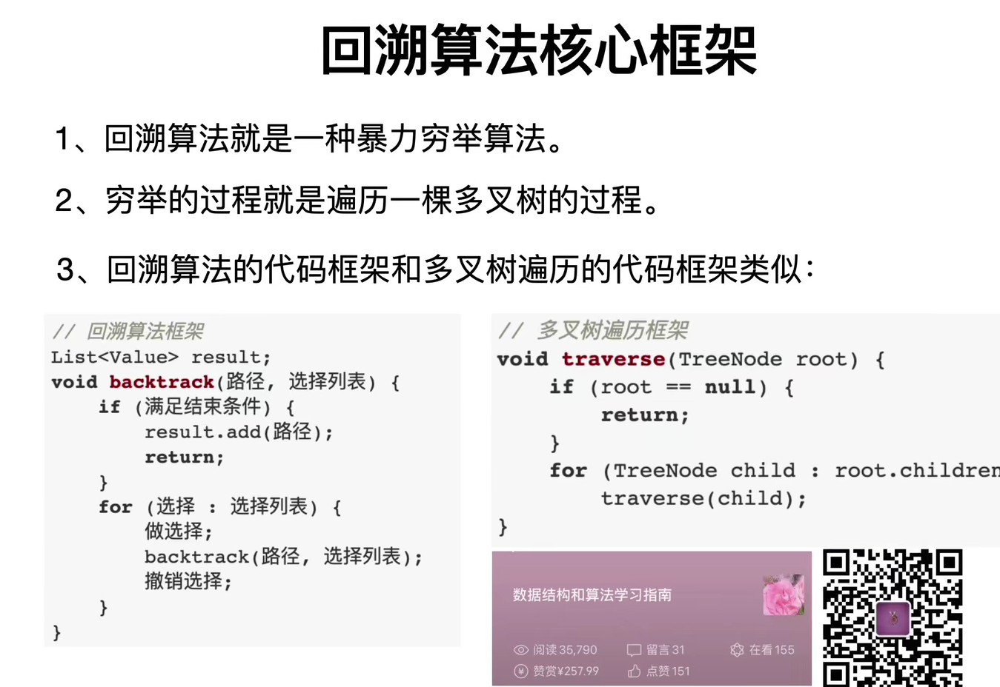

如果是 for ( let i = 0; i < nums.length; i++ ) 这种形式的，都不用终止条件，因为 i < nums.length 它就终止了

代表题型：全排列，N 皇后

# 动态规划

## 特点和套路

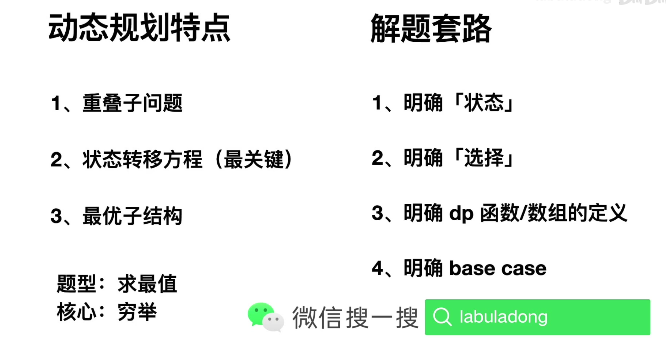

## 解法框架

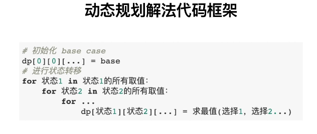

## 例题

### 斐波那契数列

**自底向上解法**

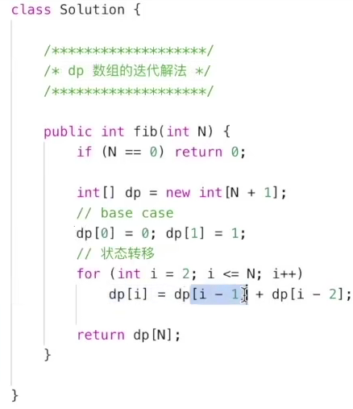

空间复杂度优化

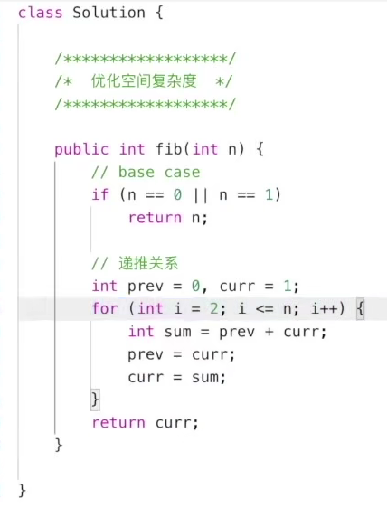

**自顶向下解法**

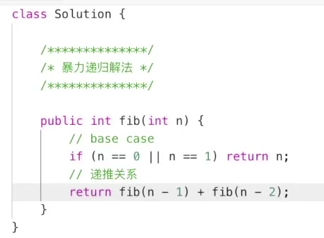

优化带备忘录

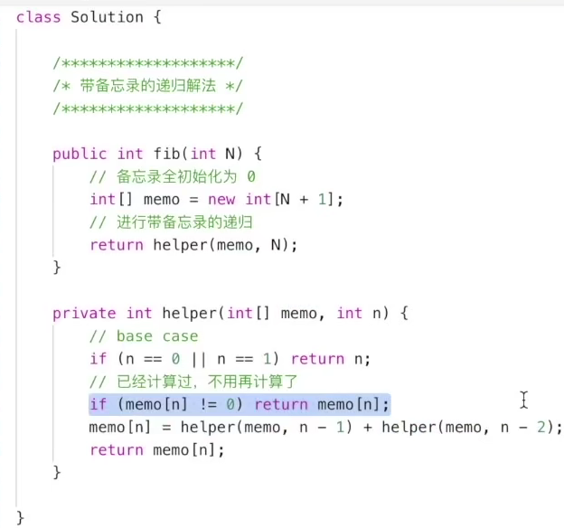

### 零钱兑换

**自顶向下解法**

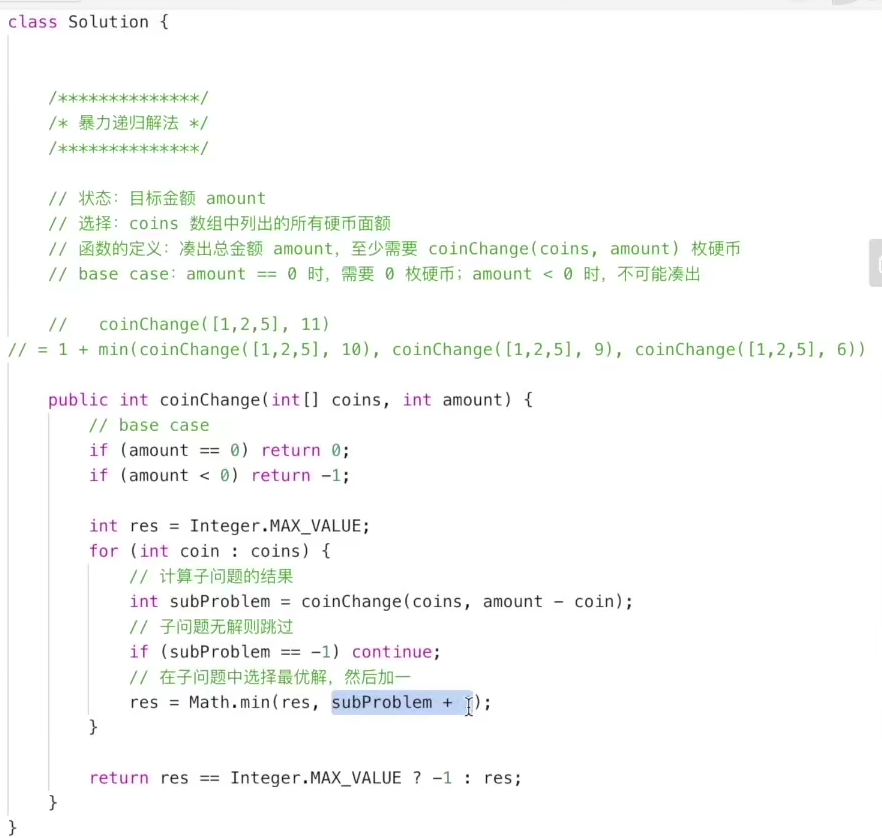

tips：要求 11 元需要多少枚硬币（可选择的有 1,2,5）就相当于求 10、9、6 元需要的硬币数 + 1即可

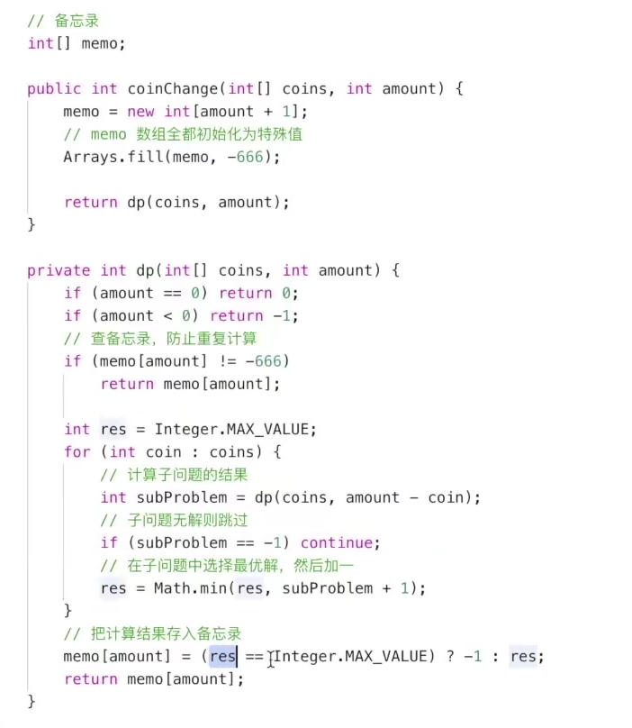

tips：使用备忘录优化

### 自底向上解法

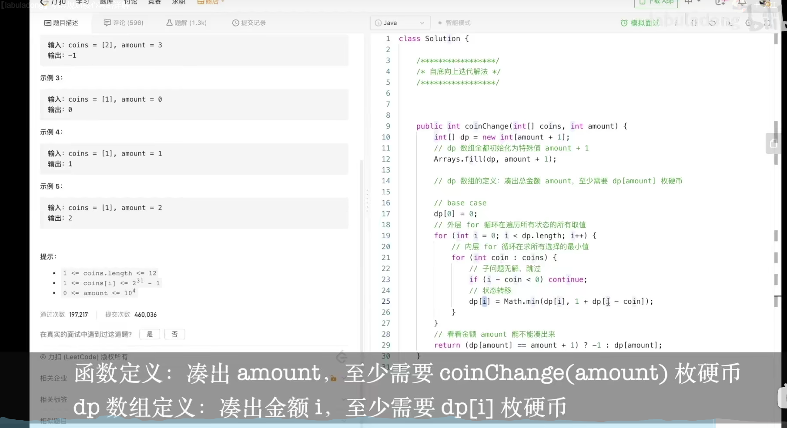

## 本质

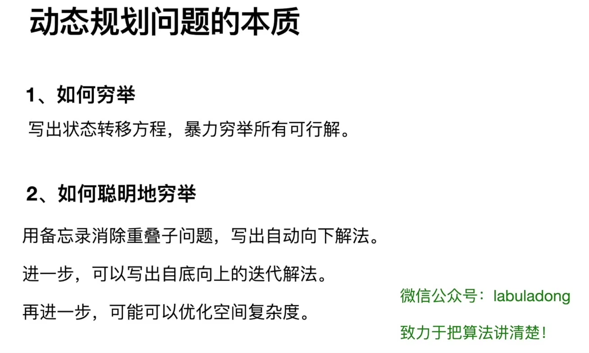

# 树的深度的几种遍历方法

## DFS（深度优先遍历）

```js
var maxDepth = function(root) {
    if ( !root ) return 0;

    // 这里有点像动态规划的思想，根节点的高度其实就是子节点中最高的 + 1
    // 自顶向下，再自底向上
    return 1 + Math.max( maxDepth( root.left), maxDepth( root.right ) )
}
```

## BFS（广度优先遍历）

```js
var maxDepth = function(root) {

    let Que = []

    function BFS( root ) {
        if ( !root ) return 0;
        Que.push( root )
        
        let ans = 0
        while( Que.length ) {
            const curLength = Que.length

            // 遍历当前层次的节点
            for ( let i = 0; i < curLength; i++ ) {
                if ( Que[i].left ) {
                    Que.push( Que[i].left )
                }
                if ( Que[i].right ) {
                    Que.push( Que[i].right )
                }
            }
            // 清空前面遍历过的节点
            Que.splice( 0, curLength )
            // 每层遍历完就加 1
            ans++
        } 

        return ans
    }

    return BFS(root)
}
```

## 回溯解法

```js
var maxDepth = function(root) {
    
    let path = []
    let maxLength = 0

    function backTrack( root ) {
        if ( !root ) {
            return
        }
        path.push( root )
        if ( root.left ) {
            backTrack( root.left )
        }

        if ( root.right ) {
            backTrack( root.right )
        }

        // 左右节点都为空说明是叶子节点
        maxLength = Math.max( maxLength, path.length ) // 保留最长深度
        path.pop() // 尽头回退 
    }
    backTrack( root )

    return maxLength
};
```

# 排序算法

## 冒泡排序

```js
 /**
   * 如何理解冒泡？
   * 每次循环都会确定一个最大值或最小值
   * 这也是为什么每次循环最后一位就不用再去比较它了
   * 时间复杂度是 n ²
 */
function Bubble( array ) {
 	for ( let i = 0; i < array.length - 1; i++ ) {
 	    for( let j = 0; j < array.length - i - 1; j++ ) {
 	        if ( array[j] > array[j+1] ) {
 	            const temp = array[j]
 	            array[j] = array[j+1]
 	            array[j+1] = temp
 	        }
 	    }
 	}
}
```

## 快速排序

```js
        /**
         * 快速排序: 取一个基准值，然后数组里比它小的放左边，大的放右边，递归
         * 这个过程即可
         */
        function QuickSort( array ) {
            if ( array.length <= 1 ) return array;
            let pivotPlace = Math.floor( array.length/2 )
            let pivot = array.splice( pivotPlace, 1 )[0]
            let left = []
            let right = []
            for ( let i = 0; i < array.length; i++ ) {
                if ( array[i] > pivot ) right.push( array[i] )
                else left.push(array[i])
            }
            return QuickSort(left).concat( [pivot], QuickSort(right) )
        }
        console.log(QuickSort( array ));
```

## 二路归并排序

# 二分查找

```js
function BinarySearch(nums, target) {
    let left = 0,
       right = nums.length - 1

    while (left <= right) {
        const mid = Math.floor((left + right)/2)

        if (nums[mid] === target) {
            return mid // 猜到了
        } else if (nums[mid] < target) {
            left = mid + 1 // 猜小了
        } else {
            right = mid - 1 // 猜大了
        }
    }
}
```

tips：二分查找的前提是nums是个有序数组

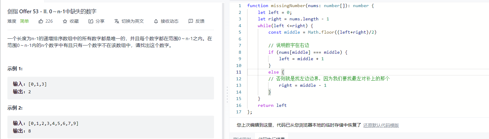

```js
function missingNumber(nums: number[]): number {
    let left = 0;
    let right = nums.length - 1
    while(left <=right) {
        const middle = Math.floor((left+right)/2)

        // 说明数字在右边
        if (nums[middle] === middle) {
            left = middle + 1
        }
        else {
        // 否则就是找左边边界，因为我们要找最左对补上的那个
            right = middle - 1
        } 
    }
    return left
};
```

