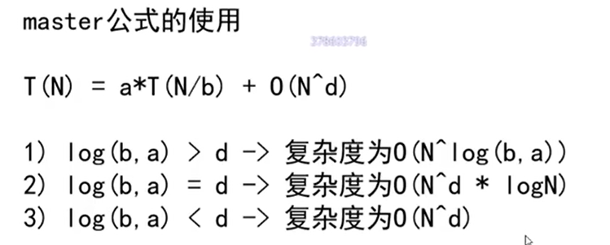

等量递归行为求时间复杂度，可以用以上公式，如:

```javascript
function getMaxValue(arr, left, right) {
    if (left === right) {
        return arr[left];
    }

    const mid = left + ((right - left) >> 1);

    const leftMax = getMaxValue(arr, left, mid);
    const rightMax = getMaxValue(arr, mid + 1, right);

    return Math.max(leftMax, rightMax);
}
```

a 为 2，每次调用两次递归，每次递归量为 N/2 其他的计算步骤都是常量操作

所以就是 T(N) = 2 * T(N/ 2) + O(1)

