## 哈希表介绍

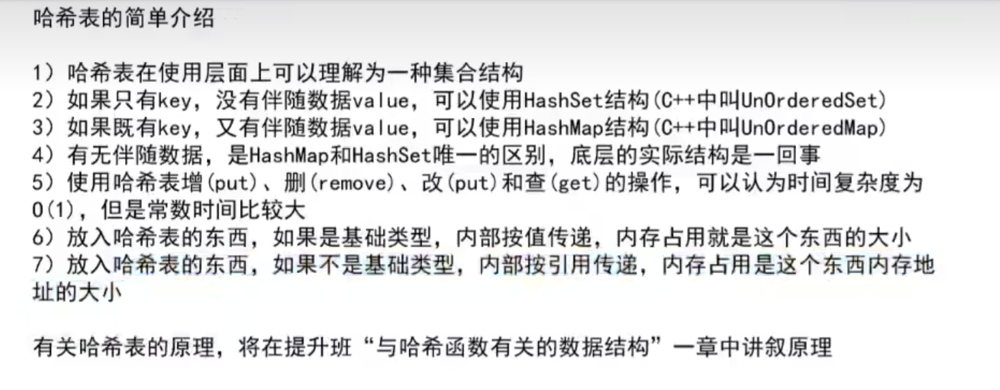

## 有序表减少

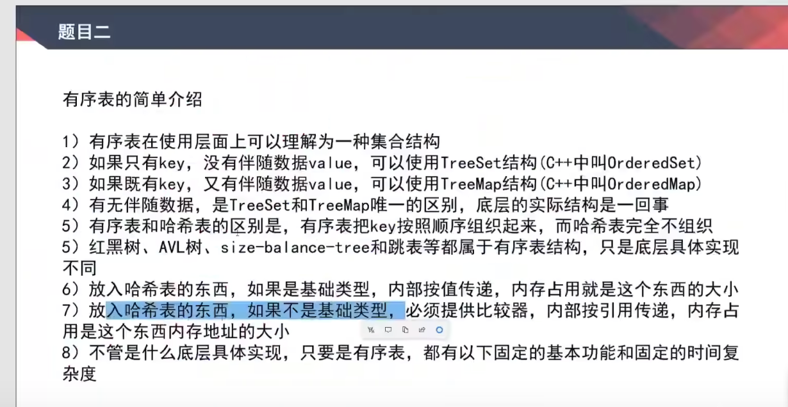

## 反转单向和双向链表题目

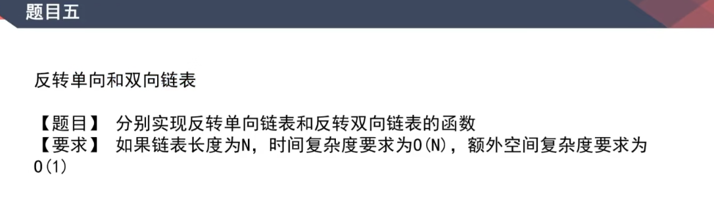

## 打印两个有序链表的公共部分题目

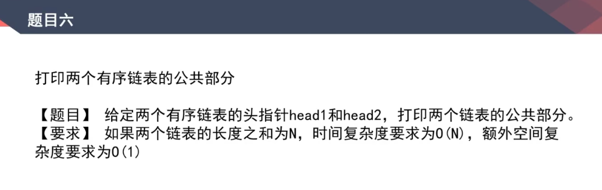

## 面试时链表解题的方法论

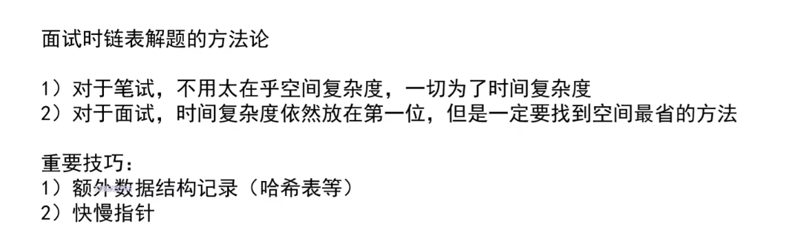

## 判断一个链表是否为回文结构
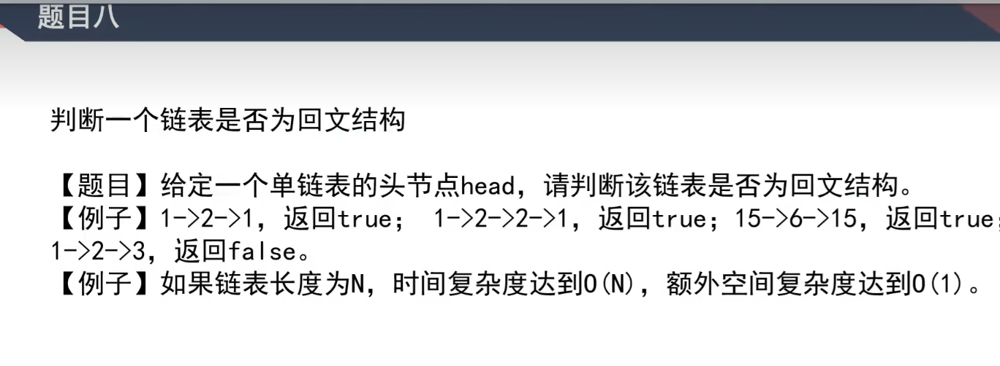

## 将单向链表划分为小于部分等于部分和大于部分
题目：
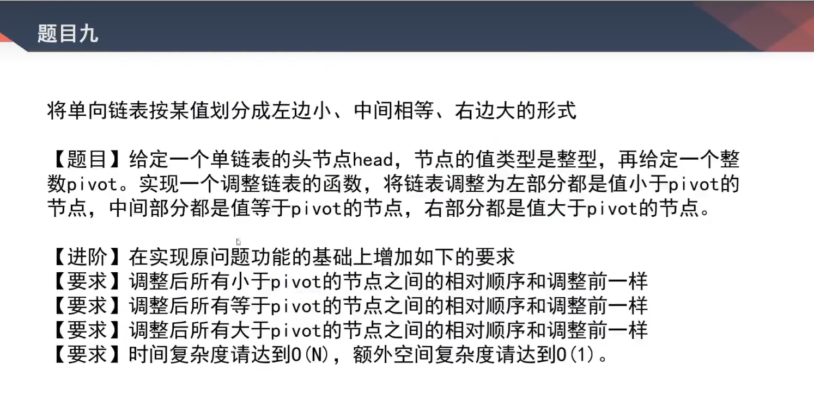

思路：
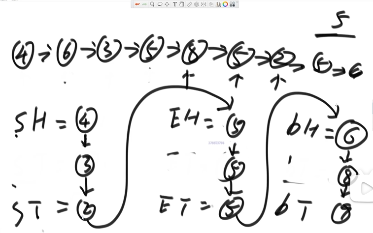

## 复制含有随机指针节点的链表
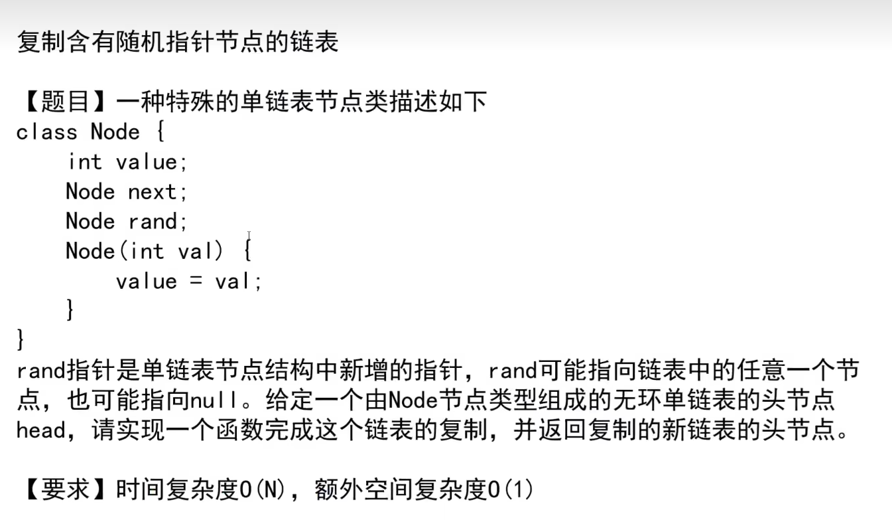
思路1：用哈希表的方式实现：
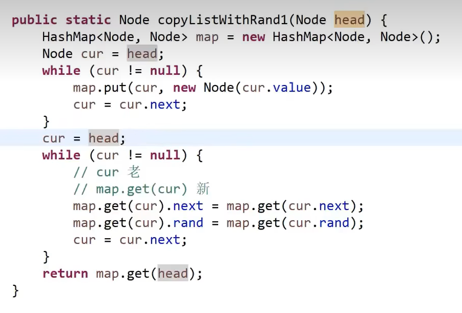
思路2：将每个复制节点放在原节点的下一位，然后再进行分离

## 两个单链表相交的一系列问题
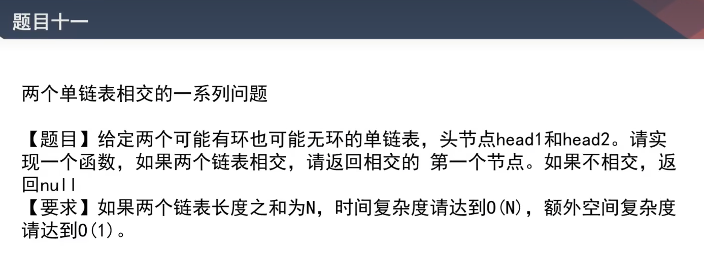

几种情况：

