## 二叉树递归/非递归遍历
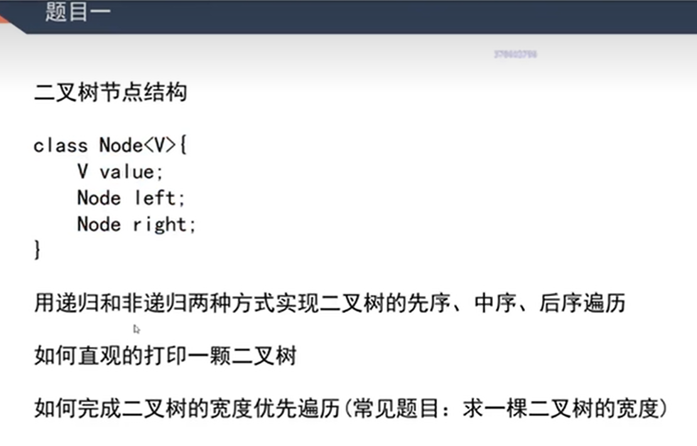

非递归先序遍历

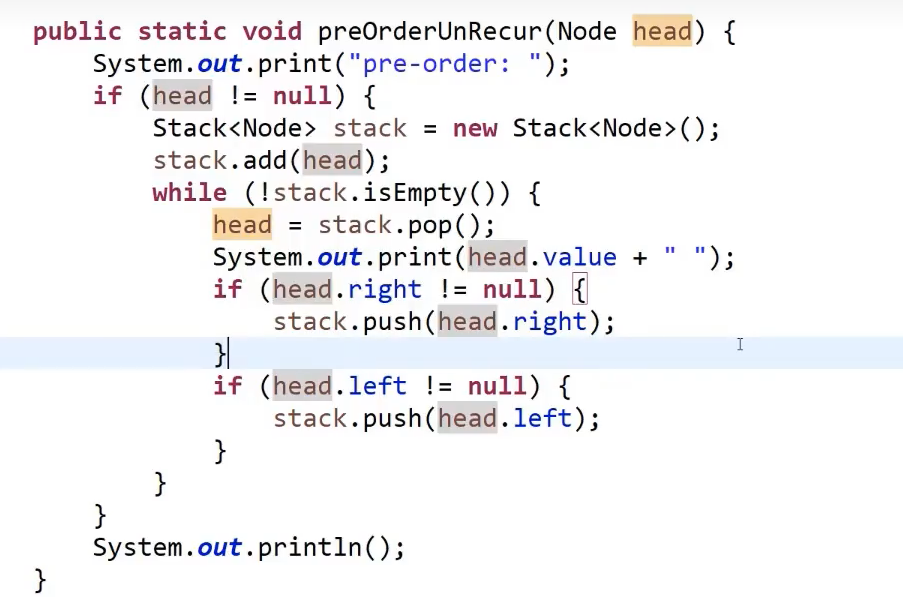

思路：加入头结点出栈打印，然后先压右再压左

非递归后续遍历

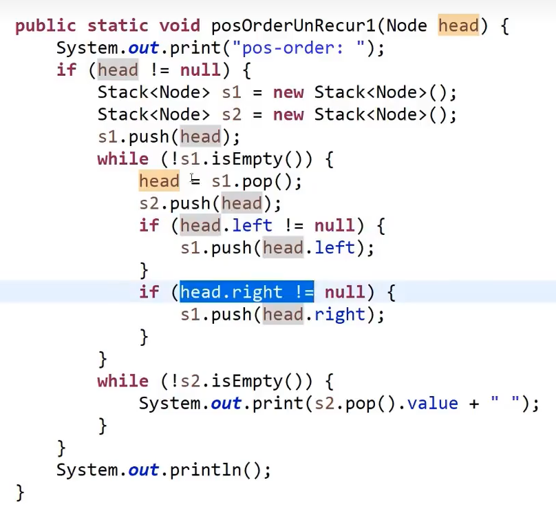

思路：准备一个辅助栈，加入头结点，出栈的时候加入辅助栈，后续先压左后压右，所以加入辅助栈的顺序是 头右左，结束时将辅助栈弹出打印就是 左右头

非递归中序遍历

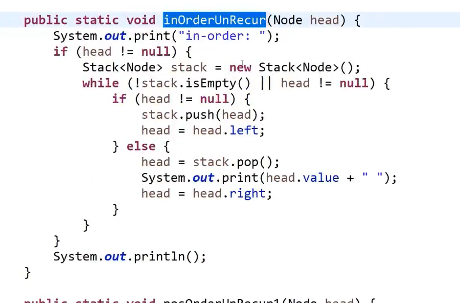

思路：让树不断以头左的方式压栈，遇到右的时候就将第一个节点(左)弹出打印，继续让右边的头左压栈
看法：每个节点都是先左再头，自己先左再头，左节点也是，右节点，可以把看淡    

## 二叉树的相关概念及其实现判断

### 判断是否是搜索二叉树

思路1：中序遍历的过程中，每个节点去判断上一个值是否比自己小，并且替换整个值

递归方式
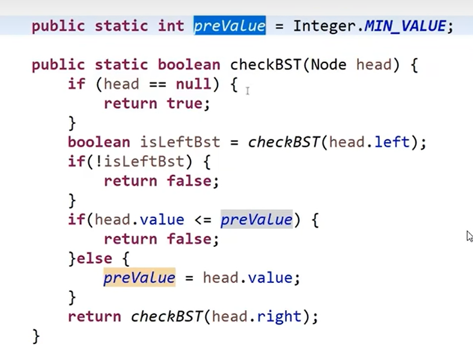

非递归方式
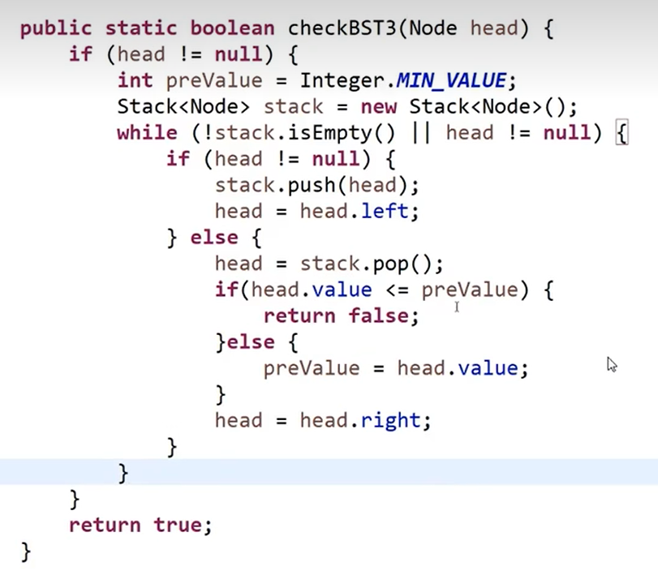

思路2：将遍历的值都记录在list里，然后去遍历它里面的值
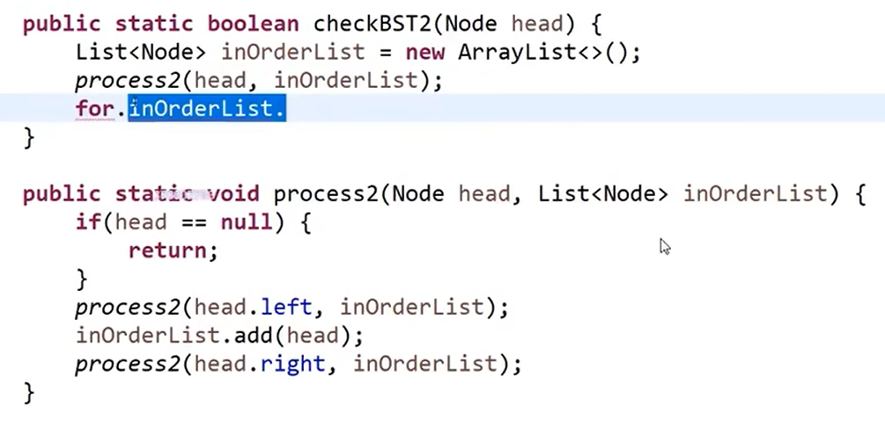

### 判断是否为完全二叉树
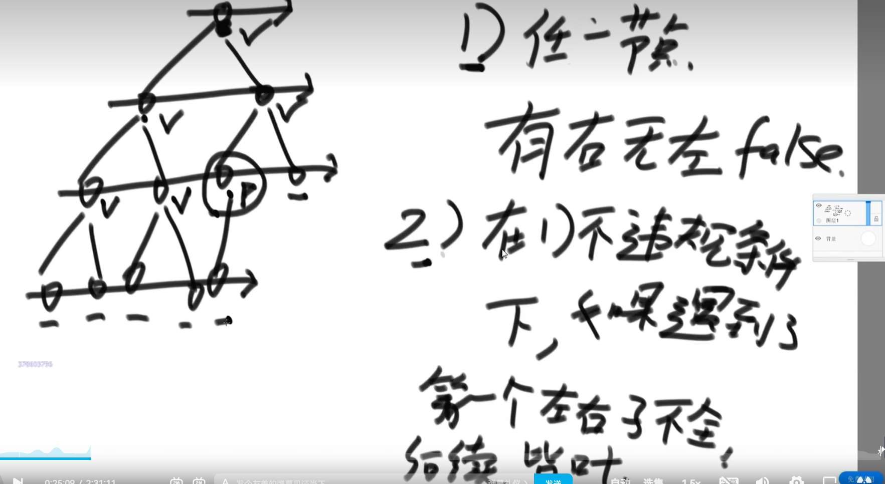

实现代码如下：

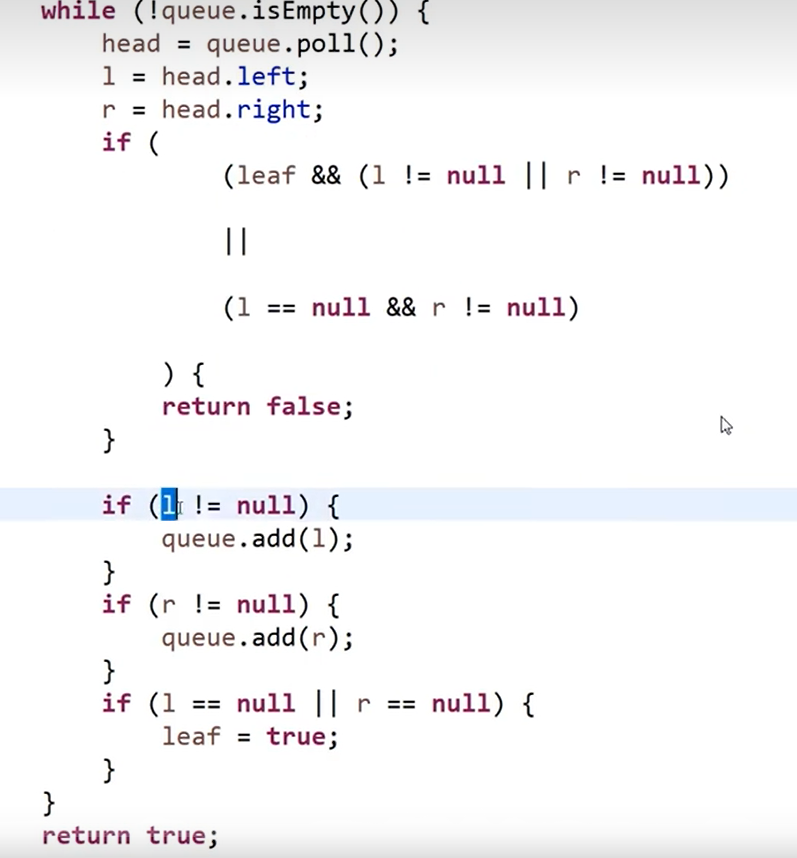
### 判断是否为平衡树
思路：左树得是平衡树，右树得是平衡树，且左右子树的高度差小于 2
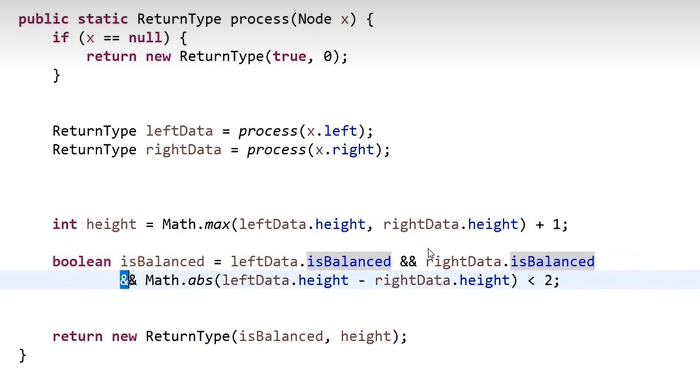

### 判断是为搜索二叉树
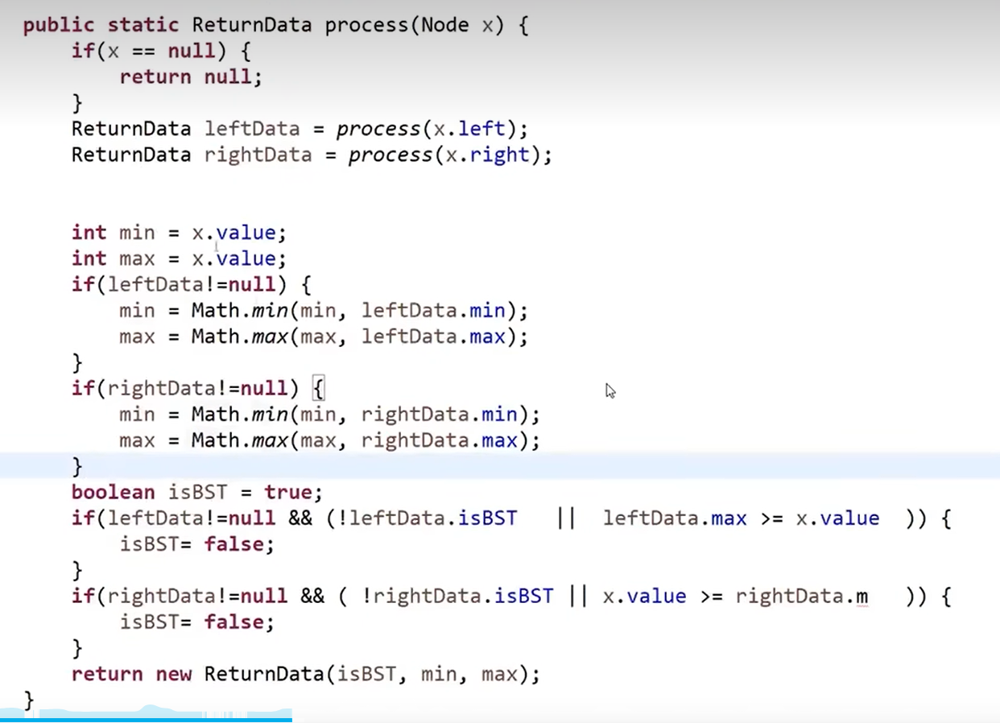