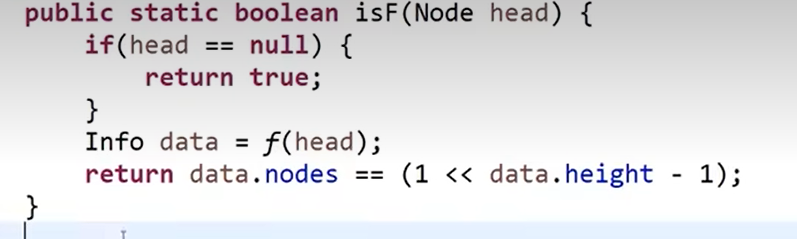
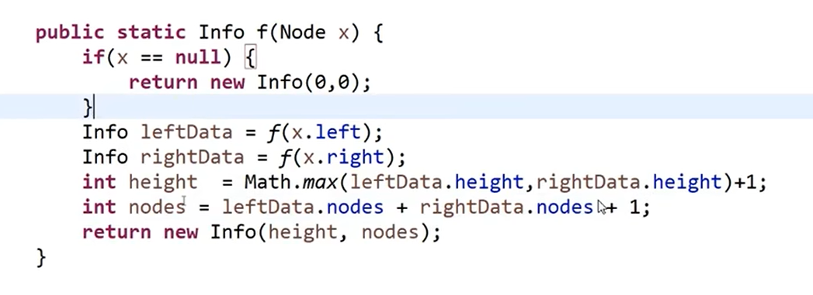
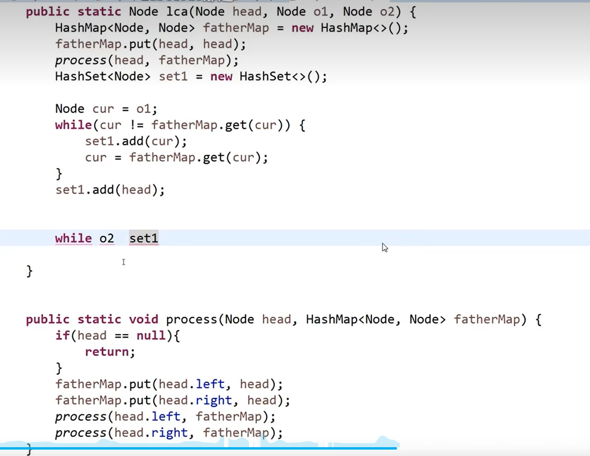
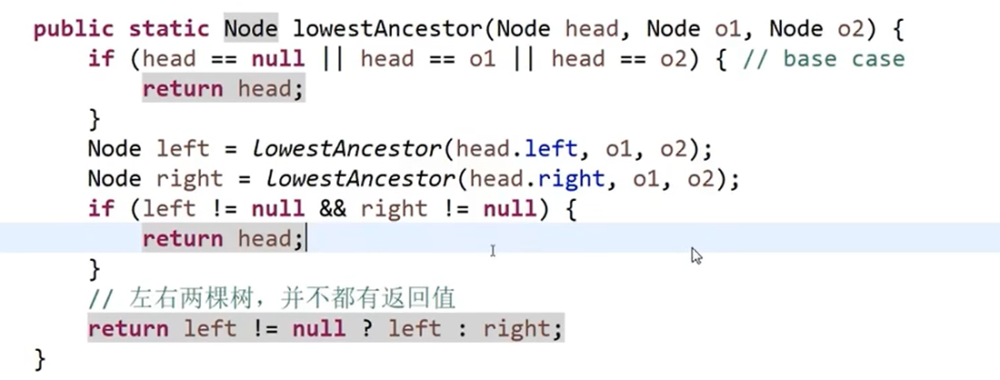
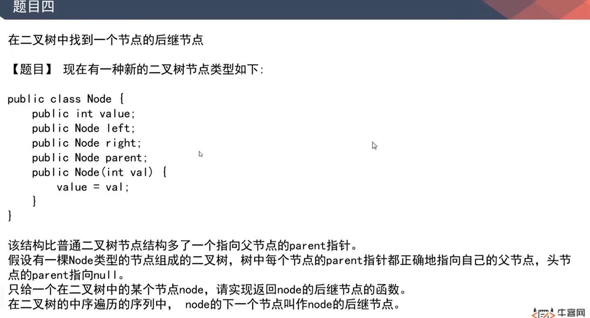
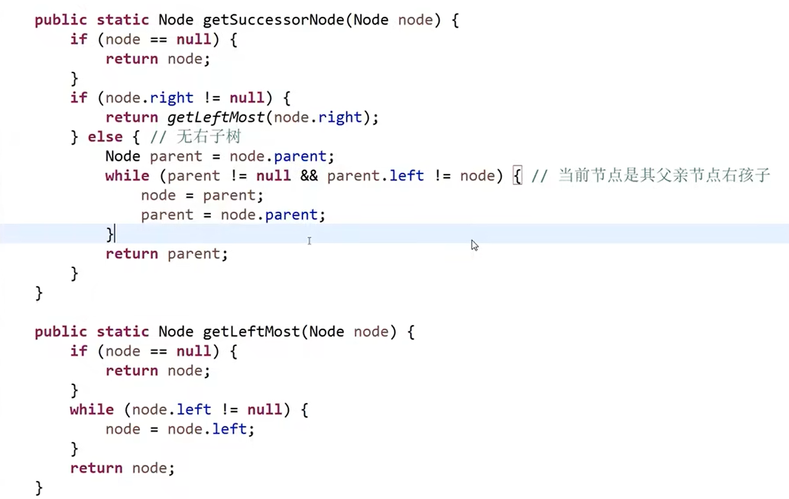
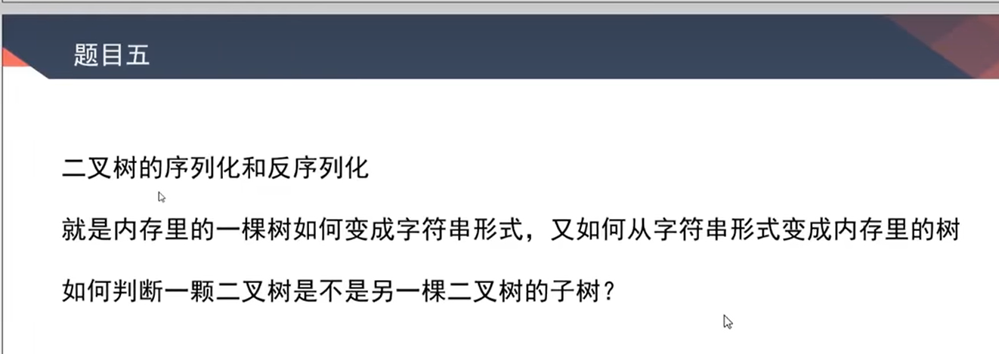
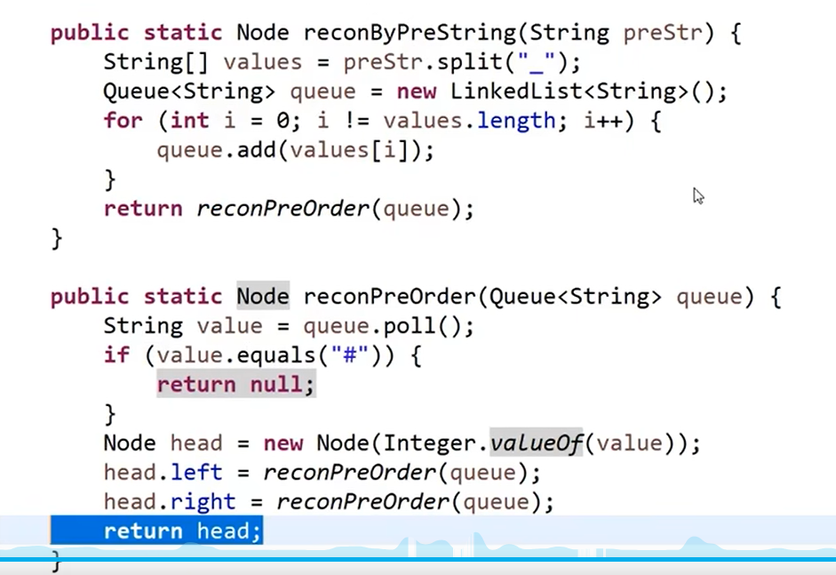
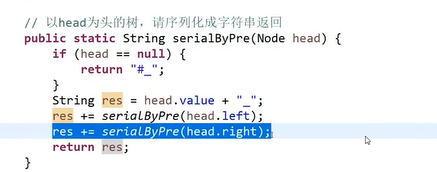
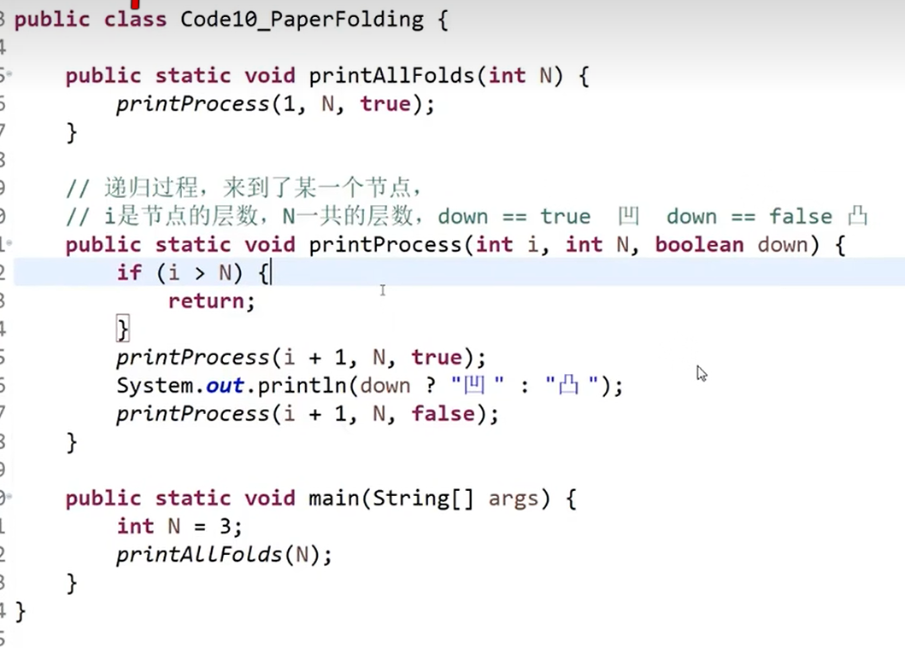

## 二叉树递归/非递归遍历

非递归先序遍历

思路：加入头结点出栈打印，然后先压右再压左

非递归后续遍历

思路：准备一个辅助栈，加入头结点，出栈的时候加入辅助栈，后续先压左后压右，所以加入辅助栈的顺序是 头右左，结束时将辅助栈弹出打印就是 左右头

非递归中序遍历

思路：让树不断以头左的方式压栈，遇到右的时候就将第一个节点(左)弹出打印，继续让右边的头左压栈
看法：每个节点都是先左再头，自己先左再头，左节点也是，右节点，可以把看淡

## 二叉树的相关概念及其实现判断

### 判断是否是搜索二叉树

思路 1：中序遍历的过程中，每个节点去判断上一个值是否比自己小，并且替换整个值

递归方式

非递归方式

思路 2：将遍历的值都记录在 list 里，然后去遍历它里面的值

### 判断是否为完全二叉树

实现代码如下：

### 判断是否为平衡树

思路：左树得是平衡树，右树得是平衡树，且左右子树的高度差小于 2

### 判断是为搜索二叉树

### 判断是否为满二叉树

记住一个概念，树形 DP

## 找两个节点的最低公共祖先节点

简单思路：

-   先记录每个节点的父节点，然后用 set1 拿到 O1 的父节点链条，然后遍历 O2 的父节点链，当第一个匹配上的时候就是最低父节点
    

困难写法：

代入场景思考

## 在二叉树中找到一个节点的后继节点

思路：

-   如果该节点有右子树，根据中序遍历，说明他的右节点找最左就是他的后继节点
-   如果该节点无右子树，根据中序遍历，说明他的后继节点在父亲节点向上找，找到第一个是处于左节点位置的节点，也是代入中序遍历思考
-   有一种情况是它在这棵树的最边缘位置，就没有后继节点
    

## 二叉树序列化和反序列化

代码如下：

## 打印折痕

思路：中序遍历

