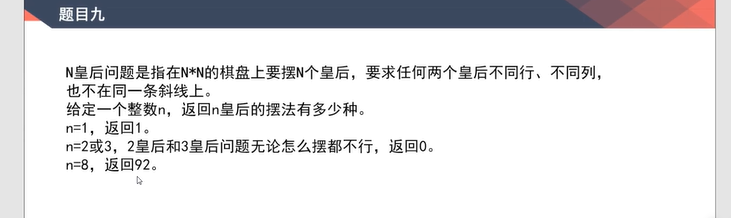

## 图的存储方式

## 图的宽度和广度优先遍历

**宽度优先遍历**
思路：类似于树的层序遍历

**深度优先遍历**
思路：一旦知道有条路没走过就走到黑，其他的路先不管

## 拓扑排序算法
思路：入度为0的加入结果，并从其他节点剔除该节点的入度，当所有节点都变成入度为0后结束
使用场景：给你包间的相互依赖关系，求出这些包有那些

## kruskal 算法 

使用场景：主要用于生成最小生成树（图变成树），如下所示

思路：
1、集合查询，一开始每个节点都是单独的第一个组合。
2、把每条边从小到大排序，然后每加入一条边就判断边的起始点是否为同一个集合，不是就合并，是就不要这条边

## prim 算法

使用场景：也是用于生成最小生成树
思路：
1、让所有的边从小到大排序

## Di jkstra算法

使用场景：最短路径
思路：
1、记录开始节点到各个节点的距离
2、每走到一个节点就去判断是否有更短的距离能更新记录，并且锁住这个点
