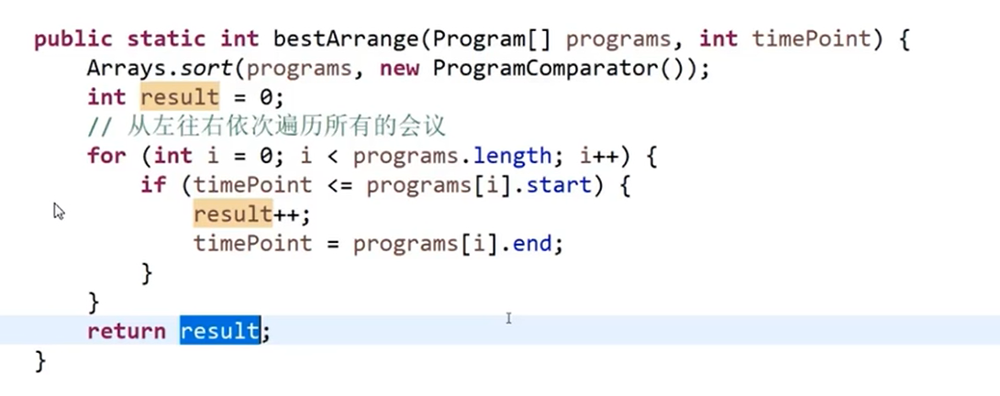

## 前缀树

case

bc 进入的过程：
1、第一个点 p++ 
2、b 没有创建一个初始化为 p = 1 e = 0
3、c 没有创建一个初始化为 p = 1 e = 1(结束点)

思考1：怎么通过这颗树判断是否有 bc 呢?
从头节点出发，如果 b 有 、c 有且 c 的 end !=0 说明有 bc

思考2：怎么判断 ab 前缀的字符串有几个？
从头节点出发，如果 a 有、 b 有 则 b 的 p 值就是有几个以 ab 为前缀的字符串

root 可以理解成空字符串节点
不一定要用26的空数组来存储，可以改用hash表

插入字符串实现：

查询字符串加入过几次实现：

查询前缀树中有几个是以某个字符串为前缀的：

删除前缀树字符串：

## 贪心算法

### 会议室安排

代码：

思路：
1、先将会议安排用结束时间从早到晚排序
2、优先安排最早结束的会议