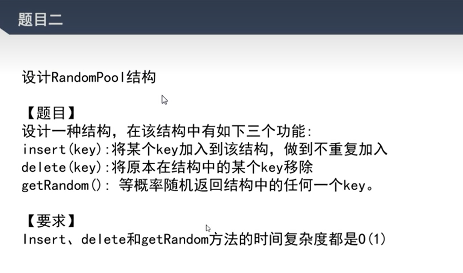
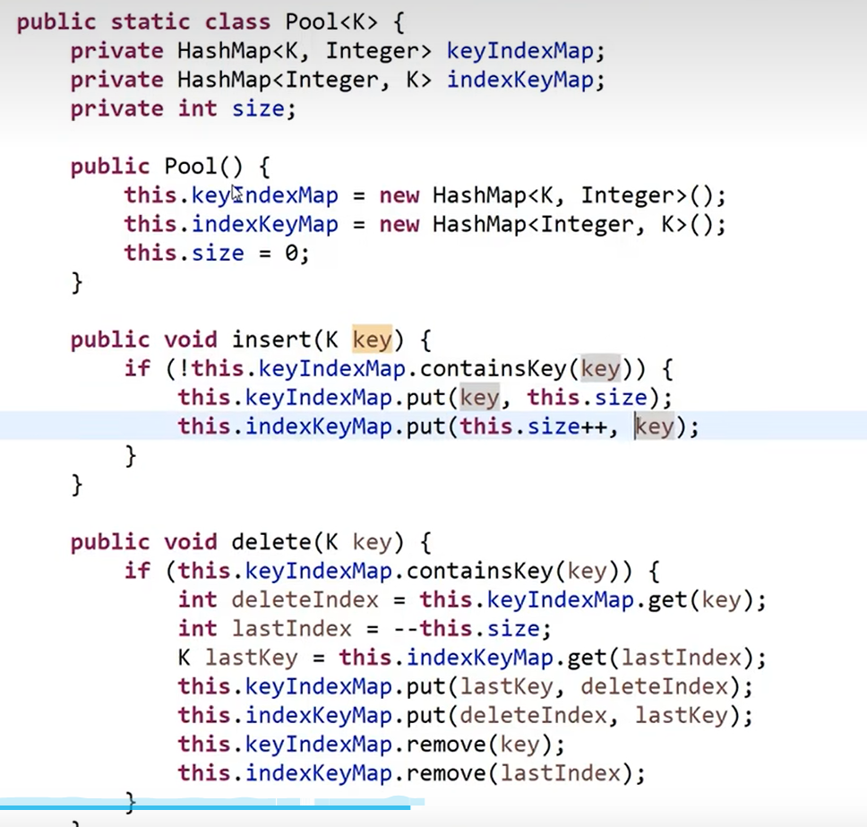
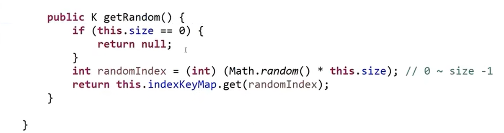

## 哈希函数

哈希函数（Hash Function）是一种将输入数据映射到固定大小的哈希值（Hash Value）的函数。哈希函数具有以下特征：

1、一致性：对于相同的输入，哈希函数始终产生相同的哈希值。

2、均匀性：哈希函数应该尽可能地将输入数据均匀地映射到哈希值空间中的不同位置。这样可以减少哈希冲突的概率，提高哈希函数的性能。

3、离散性：哈希函数的输出应该尽可能地与输入数据无关，即输入数据的微小变化也会导致输出哈希值的显著变化。这样可以确保输入数据的细微变化能够产生不同的哈希值。

4、高效性：哈希函数的计算过程应该是高效的，即在合理的时间内能够计算出哈希值。

5、不可逆性：从哈希值无法逆向推导出原始输入数据。这意味着无法通过哈希值来获取原始数据的信息，保护了数据的安全性。

常见的哈希函数：MD5、SHA-1、SHA-256

## 哈希表

哈希表（Hash Table），也称为散列表，是一种基于哈希函数实现的数据结构。它通过将键（Key）映射到存储位置来实现高效的数据访问。

哈希表的原理如下：

1、哈希函数：首先，需要选择一个合适的哈希函数。哈希函数将键映射为哈希值，通常是将键的每个字符或字节进行计算，并将计算结果映射到一个固定范围的索引值。

2、存储位置：哈希表通常使用数组作为底层的存储结构。哈希函数生成的哈希值被用作数组的索引，将键值对存储在对应的索引位置上。

3、冲突处理：由于哈希函数的映射范围有限，不同的键可能会映射到相同的索引位置，这就是哈希冲突。常见的解决冲突的方法有两种：

-   链地址法（Chaining）：将冲突的键值对存储在一个链表或其他数据结构中，通过链表的方式解决冲突。当发生冲突时，新的键值对被添加到链表的末尾。

-   开放地址法（Open Addressing）：当发生冲突时，通过一定的方法寻找下一个可用的存储位置，直到找到一个空闲的位置为止。常见的开放地址法有线性探测、二次探测等。

查找和插入操作：通过哈希函数计算键的哈希值，找到对应的存储位置。对于查找操作，根据哈希值在对应位置上查找键对应的值。对于插入操作，根据哈希值找到存储位置，将键值对存储在对应位置上。

哈希表的优点是可以实现快速的查找、插入和删除操作，时间复杂度通常为 O(1)。然而，哈希表的性能取决于哈希函数的选择和冲突处理方法的效率。合理选择哈希函数和冲突处理方法可以提高哈希表的性能

## 使用场景

假设一个文件有 40 亿个数字(每个 8B)，就是 32GB，内存只有 1GB，求这些数字中出现最多词频
思路：
1、把 40 亿个函数经过哈希函数转换后%100，因为哈希函数有均匀分布的特性这样这个 40 亿数会均匀分布在 100 个文件中，那么每个文件只有 0.32 GB
2、这样依次统计每个文件中出现次数最多的数字即可求出

## 设计 RandomPool 结构

代码：

删除的时候怎么保证顺序仍然能连续？
把最后一位补到被删除的那位即可，那么这些记录仍然保持在一个连续的区间

## 布隆过滤器
使用场景：
1、如果10亿个黑名单的 url 需要你存储，可以利用哈希函数将这些名单的hash结果，记录在数组中，而如果数组中每一位都是用一个整数表示，因为整数其实有8位它是可以记录8个url状态(黑/白)的。
2、但是这也有一定的弊端，因为哈希函数会存在hash碰撞的概率也就是说可能出现两个 url 撞到同个位置的情况
3、出现这种情况可以通过拓展数组的长度来降低这种概率，还有增加哈希函数的个数，这样即便有一个被碰撞了也不会有问题
4、哈希函数的增加也会造成对数组的长度要求更高，不然很有可能出现白名单被判断成黑名单的情况，所以也要适当增加

## 详解一致性哈希原理
原理：
1、把哈希函数的散列值看成一个环，比如 md5 是 0 - 2的64次方-1的一个环

2、m1、m2、m3 机器各负责这个环的 1/3

3、每个机器  1/3的这个环并不是连续的环，有一个虚拟节点的概念，可以看成每个机器有 1000 个虚拟绩点，分散在这个环上面

4、如果增加机器就去这个环上抢节点、删除就迁移节点