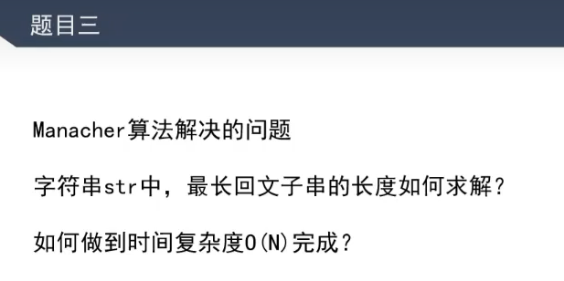

## KMP

### KMP 算法思路

1、假设有 str1 = aabaacf，str2 = aabaaf，判断 str2 是否在 str1 中
2、如果用暴力解就是 str1 从第一个字符开始去匹配 str2，直到匹配上，时间复杂度是 o(M \* N)
3、有这么一种情况当 c 和 f 比较时没匹配上，aa 是不用再匹配的了，因为已经判断过 aa 的存在了，就让 str1 指向 c，str2 指向 b 再去进行一轮匹配就可以了，这种优化就是 kmp 算法做的事情

### KMP 算法解决的问题


**\*示例解法：**

主题逻辑：


next 数组求法：


next 数组说明：

```javascript
// str1 = 'abcabcd';
// next: [0,0,0,0,1,2,3]
// next[i] 代表 0 到 i-1 位置的最长相同前后缀
// 如 next[3] 代表 abc 的最长相同前后缀为 0
// 如 next[6] 代表 abcabc 的最长相同前后缀为 abc 和 abc 为 3
```

### 时间复杂度的推理

### KMP 算法的全部细节和实现讲解

```javascript
class KMP {
    // 还需要调整，现在还是错的
    static exec(str1, str2) {
        const next = this.getNext(str2);

        let i = 0;
        let j = 0;

        while (i < str1.length && j < str2.length) {
            // 相等两边继续往前走去比对
            if (str1[i] === str2[j]) {
                i++;
                j++;
            } else if (next[j] === -1) {
                // j 不能再回退了，让 i 走
                i++;
            } else {
                // 不相等让 j 回退到前缀的后一位，可以避免重复比对
                j = next[j];
            }
        }
        return j === str2.length ? i - j : -1;
    }

    static getNext(str) {
        const next = [-1, 0];
        let i = 2,
            j = next[i - 1];
        while (i < str.length) {
            // 如 abcdabcd 求 7 位置的值
            // 如果 str[7 - 1] === str[next[7-1]](前缀子串的下一位)
            // 那么 next[7] = next[6] + 1;
            if (str[i - 1] === str[j]) {
                next[i] = j + 1;
                i++; // 继续计算 next 的下一位
                j++; // 因为 j 的含义是 next[i - 1] ，所以 i++ j也要++
            } else if (j > 0) {
                // 没匹配上用上一个子串来尝试匹配
                j = next[j];
            } else {
                // 无子串可配了只能是0
                next[i] = 0;

                // 继续计算 next 的下一位
                i++;
            }
        }

        return next;
    }
}

const str1 = 'abefcabefgd';

const str2 = 'cabef';

console.log(KMP.exec(str1, str2));
```

## Manacher 算法（马拉车）

### 解决的问题



**暴力解法**

**Manacher 解法**

### 概念

#### 回文半径、回文直径


比如 2 这个字符的回文直径就是 7、回文半径就是 4

#### 之前扩的所有位置中所到达的最右回文右边界和中心点


比如 2 位置的时候右边界是 2，中心点不变，到达 3 位置时这个右边界就变成了 4。中心是 3
注：2 位置左右不一致所以回文右边界不更新，中心点也不更新，而 3 右边界扩了所以记录到它右边界和中心点的最新位置

### 利用上文提到的这两点能得到什么信息？

**场景一**

当前求的点 i 的对称位置 i' 的回文在最新回文区间内[L, R]，则 i 的回文则为 i‘ 的回文


当我们求 i 位置的回文字符串时，如果它包含有右边界里面，可以根据中心点去求它的对称位置，然后再利用它的对称位置就可以求到它的回文字符串.

注：前提是对称位置的回文不超过左边界

**场景 2**

当前求的点 i 的对称位置 i‘ 的回文超出最新回文区间[L, R]，则 i 的回文则为 [L, L']， L' 为 i‘ 的回文右边界


**场景 3**

当前求的点 i 的对称位置 i‘ 的回文刚好在左边界，此时要考虑 i 能不能扩得更远


### 伪代码


### 时间复杂度分析

时间复杂度：O(N)

推理：每次循环两种情况，R 不往外扩，R 往外扩，R 变化幅度最多也就是 str.length，而循环的次数是固定的
