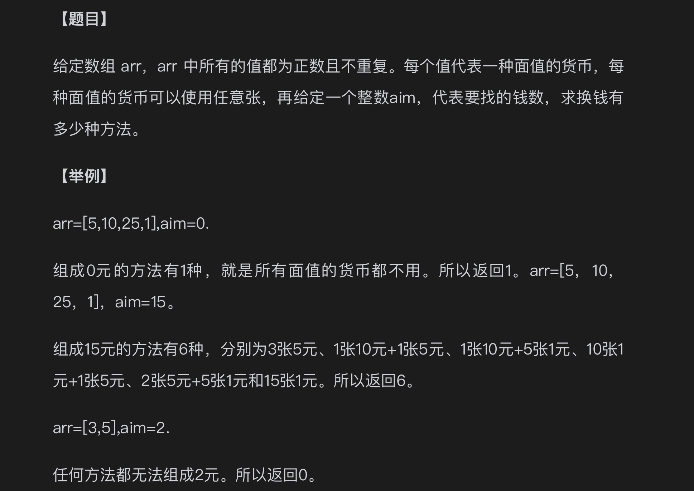

## 题目



## 暴力解法

思路：
1、尝试用 5 块的货币 0 张、1 张、2 张...
2、用这种方式不断尝试

```javascript
const arr = [5, 10, 25, 1];
const aim = 15;

function getAns(arr, aim) {
    if (aim === 0) return 0;

    return process(arr, aim, 0);
}

function process(arr, aim, i) {
    let res = 0;

    if (aim < 0) {
        return res;
    }

    if (aim === 0) {
        res++;
        return res;
    }

    for (let j = 0; arr[i] * j <= aim; j++) {
        res += process(arr, aim - arr[i] * j, i + 1);
    }

    return res;
}

console.log(getAns(arr, aim));
```

## 记忆搜索

```javascript
const arr = [5, 10, 25, 1];
const aim = 15;

function getAns(arr, aim) {
    if (aim === 0) return 0;

    const map = Array.from({ length: aim + 1 }, () =>
        new Array(arr.length + 1).fill(-1)
    );

    return process(arr, aim, 0, map);
}

function process(arr, aim, i, map) {
    let res = 0;

    if (i === arr.length) {
        res = aim === 0 ? 1 : 0;
    } else {
        for (let j = 0; arr[i] * j <= aim; j++) {
            const value = map[aim - arr[i] * j][i + 1];
            if (value !== -1) {
                res += value;
            } else {
                res += process(arr, aim - arr[i] * j, i + 1, map);
            }
        }
    }

    map[aim][i] = res;

    return res;
}

console.log(getAns(arr, aim));
```
