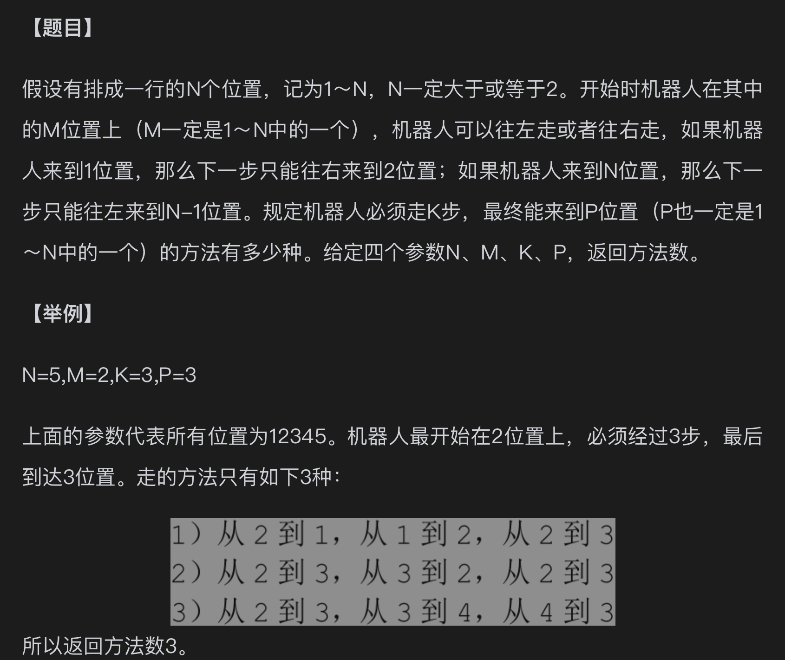
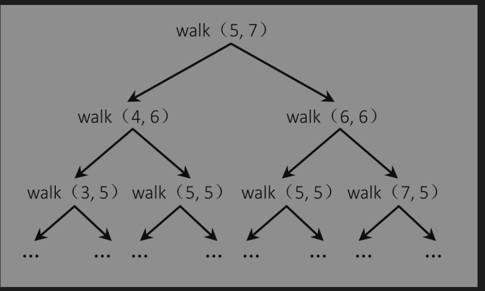

## 题目



## 暴力解法

```javascript
class WayNum {
    static exec(M, N, K, P) {
        return this.process(M, N, K, P);
    }

    static process(M, cur, rest, target) {
        // basecase：如果没有剩余的步数了看现在的位置是不是目标位置，如果是返回1，否则返回0
        if (rest === 0) {
            return cur === target ? 1 : 0;
        }

        // 在最左边只能往右
        if (cur === 1) {
            return this.process(M, cur + 1, rest - 1, target);
        }

        // 在最右边只能往左
        if (cur === M) {
            return this.process(M, cur - 1, rest - 1, target);
        }

        // 两边都能走
        return (
            this.process(M, cur - 1, rest - 1, target) +
            this.process(M, cur + 1, rest - 1, target)
        );
    }
}

console.log(WayNum.exec(5, 2, 3, 3));
```

## 动态规划解法

思路：
1、上面的暴力过程其实可以看成只有 cur，rest 拆解的过程

其中 walk(5, 5) 不管在哪一步拆解出来其返回的结果都是一样的，这就说明这个过程没有后效性，符合动态规划条件
2、确定变化的变量，从暴力递归的过程可以看出只有两个变化的变量
3、两个变量就建立二维表，三个就建立三维表
4、把最简单可确定的数据先填上
5、确定转移方程，根据转移方程确定后续的数据
6、返回最终结果

```javascript
class WayNum {
    static exec(N, M, K, P) {
        const row = K + 1;
        const col = N + 1;
        const dep = Array.from({ length: row }, () => new Array(col).fill(0));
        dep[0][P] = 1; // 此时的位置在 p 剩余步数为 0，则只有一种方法到达 P，那就是原地不动

        // dep[rest][cur] 表示当前剩余rest步在cur位置，有多少种方法可以到达 P
        // 两个都从 1 开始方便状态转换，下面有 cur -1 和 rest - 1 的操作
        for (let rest = 1; rest <= K; rest++) {
            for (let cur = 1; cur <= N; cur++) {
                if (cur === 1) {
                    dep[rest][cur] = dep[rest - 1][cur + 1];
                } else if (cur === N) {
                    dep[rest][cur] = dep[rest - 1][cur - 1];
                } else {
                    dep[rest][cur] =
                        dep[rest - 1][cur - 1] + dep[rest - 1][cur + 1];
                }
            }
        }

        return dep[K][M];
    }
}

console.log(WayNum.exec(5, 2, 3, 3));
```

## 优化解法

压缩空间至 o(N)

观察上一个解法的过程其实可以知道下一行的值取决于下一行的值

```javascript
class WayNum {
    static exec(N, M, K, P) {
        let dp = new Array(N + 1).fill(0);
        dp[M] = 1;

        for (let rest = 1; rest <= K; rest++) {
            // 如果创建这个临时空间，每次替换的时候前一个值会被覆盖掉
            // 也有优化解法，在下面
            const temp = new Array(N + 1).fill(0);
            for (let cur = 1; cur <= N; cur++) {
                if (cur === 1) {
                    temp[cur] = dp[cur + 1];
                } else if (cur === N) {
                    temp[cur] = dp[cur - 1];
                } else {
                    temp[cur] = dp[cur - 1] + dp[cur + 1];
                }
            }

            dp = temp;
        }

        console.log(dp);
        return dp[P];
    }
}

console.log(WayNum.exec(5, 2, 3, 3));
```

## 最终优化

```javascript
class WayNum {
    static exec(N, M, K, P) {
        let dp = new Array(N + 1).fill(0);
        dp[M] = 1;

        for (let rest = 1; rest <= K; rest++) {
            let leftUp = dp[1]; // 记录左上角的值
            for (let cur = 1; cur <= N; cur++) {
                const temp = dp[cur];
                if (cur === 1) {
                    dp[cur] = dp[cur + 1];
                } else if (cur === N) {
                    dp[cur] = leftUp;
                } else {
                    dp[cur] = leftUp + dp[cur + 1];
                }
                leftUp = temp;
            }
        }

        return dp[P];
    }
}

console.log(WayNum.exec(5, 2, 3, 3));
```
