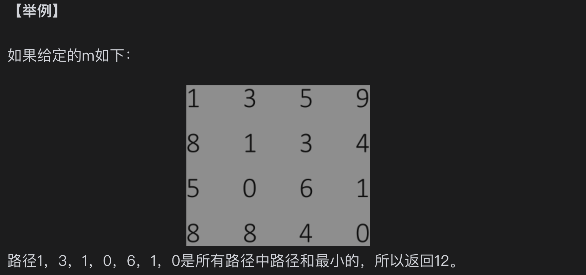

## 题目

给定一个矩阵 m，从左上角开始每次只能向右或者向下走，最后到达右下角的位置，路径上所有的数字累加起来就是路径和，返回所有的路径中最小的路径和。

## 思路

如果每个位置都知道它的左边的路径和和上边的路径和，那边走到它最近的位置就是和小的那条

## 例子



## 暴力解法

```javascript
class minPath {
    static exec(matrix) {
        const col = matrix.length;
        const row = matrix[0].length;
        return this.process(matrix, col, row, 0, 0);
    }

    static process(matrix, col, row, i, j) {
        if (i === col - 1 && j === row - 1) {
            return matrix[i][j];
        }

        if (i === col - 1) {
            return matrix[i][j] + this.process(matrix, col, row, i, j + 1);
        }

        if (j === row - 1) {
            return matrix[i][j] + this.process(matrix, col, row, i + 1, j);
        }

        return (
            matrix[i][j] +
            Math.min(
                this.process(matrix, col, row, i + 1, j),
                this.process(matrix, col, row, i, j + 1)
            )
        );
    }
}

const matrix = [
    [1, 3, 5, 9],
    [8, 1, 3, 4],
    [5, 0, 6, 1],
    [8, 8, 4, 0],
];

console.log(minPath.exec(matrix));
```

## 简单解法

时间复杂度：O（M×N） 空间复杂度：O（MxN）

```javascript
class MinPath {
    static exec(matrix) {
        const dep = Array.from({ length: matrix.length }, () => []);
        const col = matrix.length;
        const row = matrix[0].length;

        dep[0][0] = matrix[0][0];

        for (let i = 1; i < col; i++) {
            dep[i][0] = dep[i - 1][0] + matrix[i][0];
        }

        for (let i = 1; i < row; i++) {
            dep[0][i] = dep[0][i - 1] + matrix[0][i];
        }

        for (let i = 1; i < col; i++) {
            for (let j = 1; j < row; j++) {
                dep[i][j] =
                    Math.min(dep[i - 1][j], dep[i][j - 1]) + matrix[i][j];
            }
        }

        return dep[col - 1][row - 1];
    }
}

const matrix = [
    [1, 3, 5, 9],
    [8, 1, 3, 4],
    [5, 0, 6, 1],
    [8, 8, 4, 0],
];

console.log(MinPath.exec(matrix));
```

## 优化解法

时间复杂度：O（M×N） 空间复杂度：O（N）

思路：
1、先确定第一行的最小路径，再确认第二行，第三行...直到最后一行就可以确认结果

解析：
1、我们创建一个一维数组 dp 来保存中间结果，初始值都为 0。

2、接下来，我们初始化起点位置 (0, 0) 的路径长度为 matrix[0][0]。

3、然后，我们从左到右依次计算第一行的最短路径长度，即 dp[i] = dp[i-1] + matrix[0][i]。

4、接着，我们从第二行开始，逐行计算每个位置的最短路径长度。对于每个位置 (i, j)，它可以从上方位置 (i-1, j) 或左方位置 (i, j-1) 到达，所以到达当前位置的最短路径长度等于上方位置和左方位置的最短路径长度中的较小值加上当前位置的路径长度，即 dp[j] = Math.min(dp[j-1], dp[j]) + matrix[i][j]。

```javascript
class MinPath {
    static exec(matrix) {
        if (!matrix.length) return 0;

        const dep = Array.from({ length: matrix.length }, () => 0);
        const col = matrix.length;
        const row = matrix[0].length;

        dep[0] = matrix[0][0];
        for (let i = 1; i < row; i++) {
            dep[i] = dep[i - 1] + matrix[0][i];
        }

        for (let i = 1; i < col; i++) {
            dep[0] = dep[0] + matrix[i][0];
            for (let j = 1; j < row; j++) {
                dep[j] =
                    matrix[i][j] +
                    Math.min(
                        dep[j] /** 这里代表上一个位置的最短路径 */,
                        dep[j - 1]
                    );
            }
        }

        return dep[row - 1];
    }
}

const matrix = [
    [1, 3, 5, 9],
    [8, 1, 3, 4],
    [5, 0, 6, 1],
    [8, 8, 4, 0],
];

console.log(MinPath.exec(matrix));
```

2、如果是列数比行数用列数来求也是同理

```javascript
class MinPath {
    static exec(matrix) {
        if (!matrix.length) return 0;

        const col = matrix.length;
        const row = matrix[0].length;
        const isColMore = col > row;
        const length = isColMore ? row : col;
        const dep = Array.from({ length }, () => 0);

        dep[0] = matrix[0][0];
        for (let i = 1; i < length; i++) {
            dep[i] = dep[i - 1] + (isColMore ? matrix[i][0] : matrix[0][i]);
        }

        for (let i = 1; i < (isColMore ? row : col); i++) {
            dep[0] = dep[0] + (isColMore ? matrix[i][0] : matrix[0][i]);
            for (let j = 1; j < (isColMore ? col : row); j++) {
                dep[j] = matrix[i][j] + Math.min(dep[j], dep[j - 1]);
            }
        }

        return dep[length - 1];
    }
}

const matrix = [
    [1, 3, 5, 9],
    [8, 1, 3, 4],
    [5, 0, 6, 1],
    [8, 8, 4, 0],
];

console.log(MinPath.exec(matrix));
```
