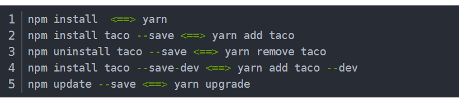

- HTTP2.0

- js 设计模式
- node js 看一套网课
- 做一个 react 的项目
- 多页面和单页面区别在哪里？
- https://api.ikuuu.science/link/B59xFrIgZU6R6mwN?clash=3&extend=1

vendor 存的就是external出来的包，manifest 存的是这些包和模块的对应关系，有 .min 的一般表示压缩的文件

# 工具

- pxcook 美工图分析工具

# 好用的库

- animate.css  去 npm 下载

# Linux 命令

- pwd 可以查看当前路径
- file * 查看到当前目录下文件类型
- mv 可以用于将文件更名

# 《深入浅出 Node.js》

- 跳过了 7.5 关于网络安全的一节（HHTPS，SSL 等）
- promise 原理
- 跳过了第九章玩转进程，需要要操作系统一些知识后读比较好
- React 学完之后学习将静态页面拆封成组件
- 研究一下 async 和 生成器
- rem 单位的原理
- uniapp 的原理

# 鸽子备忘

- 调整弹窗样式
- 权限继续研究
- 研究一下入口文件的调整卡的bug
- 优化代码
- 路由懒加载，http缓存
- 打包后bug

# 工作备忘

## 2021.9.2 下午

1. 弄好请求配置
2. 部署上线
3. 继续按老师要求改
4. 综测文件打印

## 2021.9.4 下午

1. **把基地选择做了，找几张好点的图，解决 image 高度问题**
2. **有时间和灿杰试一下那个跨域问题**
3. 右侧看看做一个鸽笼选择弹窗
4. 初始的背景图改以下

## **2021.9.6 上午**

1. 删掉-入料管理

2. 添加-肉鸽出库-鸽棚出库

   ​					   -出库统计

## **2021.9.6 下午**

- 学习 webpack 完做总结，**刷网课**
- **有时间学装 linux 虚拟机**

## 2021.9.7 上午

- 继续总结 webpack

## 2021.9.7 下午

- 合并代码，重新推送，重新上线
- 学习权限管理

## **2021.9.8 上午**

- 学 promise，看网课

## 2021.9.8 下午

- **

  学习权限管理

## 2021.9.10 上午

- 学习权限管理

## 2021.9.11 下午

- 整理权限管理笔记

## 2021.9.12 上午

- 登录页背景图改
- 表格样式，字体统一
- 新增在左边
- 右上角加基地筛选
- 库房管理加库存统计
- **继续完善**
- **刷网课**

## 2021.9.14 晚上

- 学习完 promise，有时间就整理 vue

## 2021.9.15 早上

- 将基地页面调整到鸽棚哪里
- 继续完善鸽棚选择

## 2021.9.15 下午 or 晚上

- 继续手撕 promise
- 如果还有时间就开始看 vue

## 2021.9.17 下午

- 完成 linux 第一个作业
- 尽量完成登录还有请求头的配置

## 2021.9.18 上午

- 将基地切换与当前的整体基地切换同步起来
- 配置屠宰场和加工厂

## 2021.9.19 下午

- 配置好屠宰场和加工厂页面
- 分配给志伟、晓鸿、珍妮做
- 也要大概了解好页面要做什么（特别是投喂、饮水、请粪）

## 2021.9.20 上午

- 继续看 vue 中不熟悉的地方，特别是自定义指令和路由

## 2021.9.21 下午

- 继续完善好剩余模块的导航，并分配下去
- 有时间弄好权限管理

## 2021.9.22 上午

- 继续学习 vue 里的东西，优先路由这一块

项目：配置好登录显示哪里，配置好打包后的 log 问题

- 看看钱钰师兄的项目

## 2021.9.26 下午

- 弄完生鲜电商任务
- 有时间继续完善生产环境bug

# 新工作备忘

- 电商大创项目实施情况和指导教师意见
