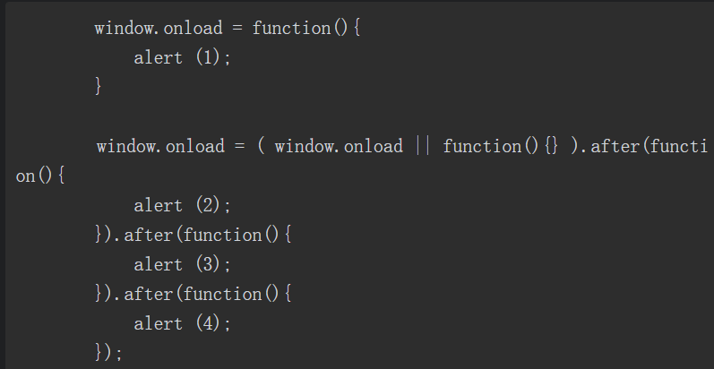
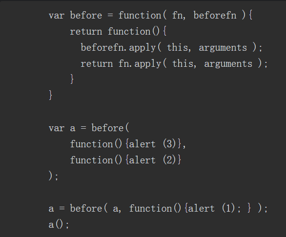
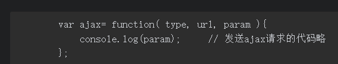
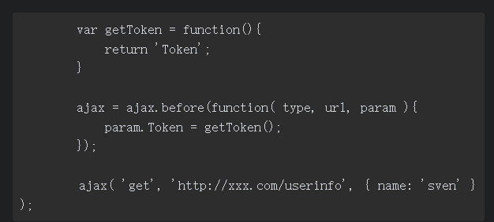

# 第二部分 设计模式

## 第15章 装饰者模式

- **给对象动态地增加职责的方式称为装饰者（decorator）模式。**装饰者模式能够在不改变对象自身的基础上，在程序运行期间给对象动态地添加职责。跟继承相比，装饰者是一种更轻便灵活的做法，这是一种“即用即付”的方式，比如天冷了就多穿一件外套，需要飞行时就在头上插一支竹蜻蜓，遇到一堆食尸鬼时就点开AOE（范围攻击）技能。

### 15.1 模拟传统面向对象语言的装饰者模式

场景：一个飞机游戏，用户分为三级，每升级一次就可以获得新技能

下面来看代码实现，首先是原始的飞机类

接下来增加两个装饰类，分别是导弹和原子弹：

最后看看测试结果：

### 15.2 装饰者也是包装器

在《设计模式》成书之前，GoF原想把装饰者（decorator）模式称为包装器（wrapper）模式。从功能上而言，decorator能很好地描述这个模式，但从结构上看，wrapper的说法更加贴切。装饰者模式将一个对象嵌入另一个对象之中，实际上相当于这个对象被另一个对象包装起来，形成一条包装链。请求随着这条链依次传递到所有的对象，每个对象都有处理这条请求的机会，如图1所示。

### 15.3 回到JavaScript的装饰者

JavaScript语言动态改变对象相当容易，我们可以直接改写对象或者对象的某个方法，并不需要使用“类”来实现装饰者模式，代码如下：

### 15.4 装饰函数

tips：通过保存原引用的方式来改写某个函数

### 15.5 用AOP装饰函数

首先给出Function.prototype.before方法和Function.prototype.after方法：

tips：两个的区别就是传进的函数先执行还是后执行

下面来试试用Function.prototype.before的威力：

再回到window.onload的例子，看看用Function.prototype.after来增加新的window.onload事件是多么简单：

值得提到的是，上面的AOP实现是在Function.prototype上添加before和after方法，但许多人不喜欢这种污染原型的方式，那么我们可以做一些变通，把原函数和新函数都作为参数传入before或者after方法：

### 15.6 AOP的应用实例

#### 15.6.1 数据统计上报

比如页面中有一个登录button，点击这个button会弹出登录浮层，与此同时要进行数据上报，来统计有多少用户点击了这个登录button：

我们看到在showLogin函数里，既要负责打开登录浮层，又要负责数据上报，这是两个层面的功能，在此处却被耦合在一个函数里。使用AOP分离之后，代码如下：

#### 15.6.2 用AOP动态改变函数的参数

观察Function.prototype.before方法：

tips：从这段代码的(1)处和(2)处可以看到，beforefn和原函数__self共用一组参数列表arguments，当我们在beforefn的函数体内改变arguments的时候，原函数__self接收的参数列表自然也会变化。

从ajax函数打印的log可以看到，Token参数已经被附加到了ajax请求的参数中：

明显可以看到，用AOP的方式给ajax函数动态装饰上Token参数，保证了ajax函数是一个相对纯净的函数，提高了ajax函数的可复用性，它在被迁往其他项目的时候，不需要做任何修改。

#### 15.6.3 插件式的表单验证

在表单数据提交给后台之前，常常要做一些校验，比如登录的时候需要验证用户名和密码是否为空，代码如下：

tips：formSubmit函数在此处承担了两个职责，除了提交ajax请求之外，还要验证用户输入的合法性。这种代码一来会造成函数臃肿，职责混乱，二来谈不上任何可复用性。

接下来进一步优化这段代码，使validata和formSubmit完全分离开来。首先要改写Function. prototype.before，如果beforefn的执行结果返回false，表示不再执行后面的原函数，代码如下：

tips：值得注意的是，因为函数通过Function.prototype.before或者Function.prototype.after被装饰之后，返回的实际上是一个新的函数，如果在原函数上保存了一些属性，那么这些属性会丢失。

### 15.7 装饰者模式和代理模式

代理模式的目的是，当直接访问本体不方便或者不符合需要时，为这个本体提供一个替代者。本体定义了关键功能，而代理提供或拒绝对它的访问，或者在访问本体之前做一些额外的事情。装饰者模式的作用就是为对象动态加入行为