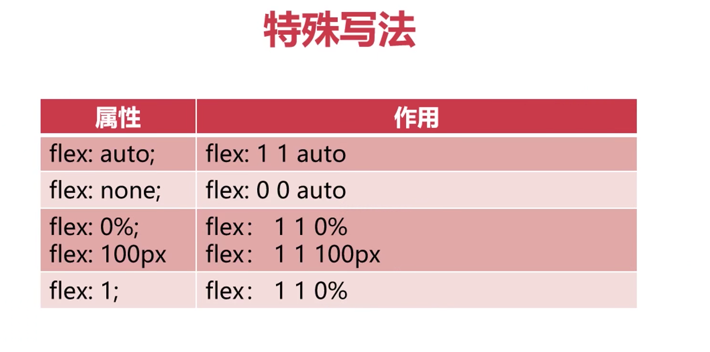
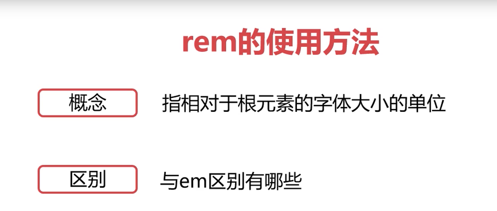
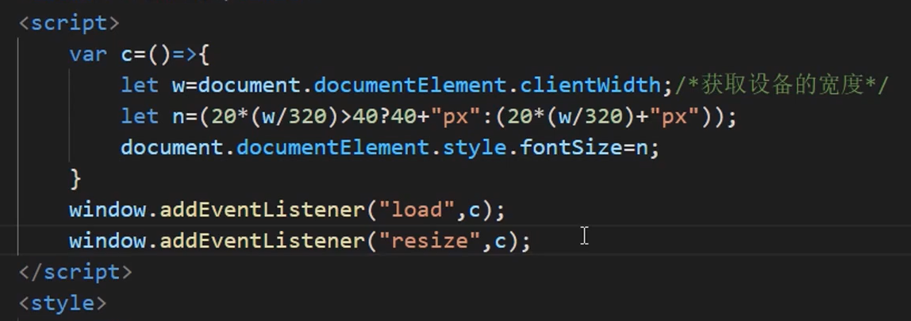
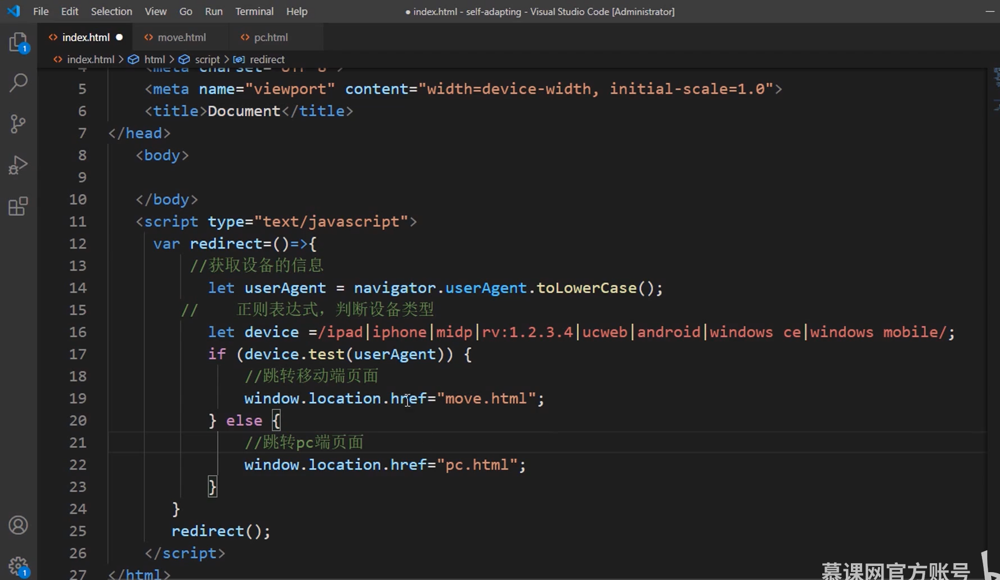
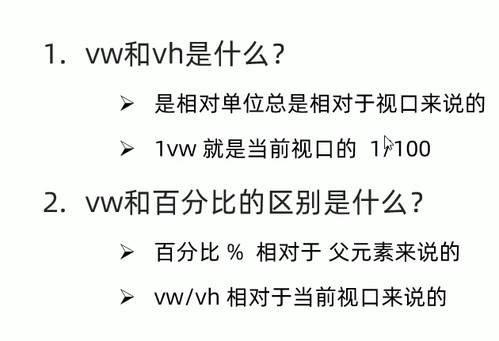
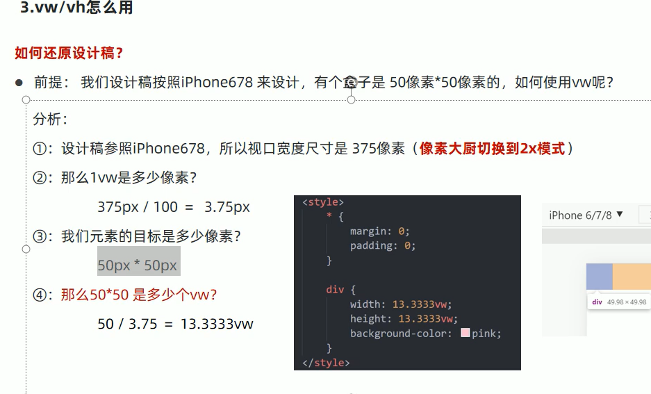
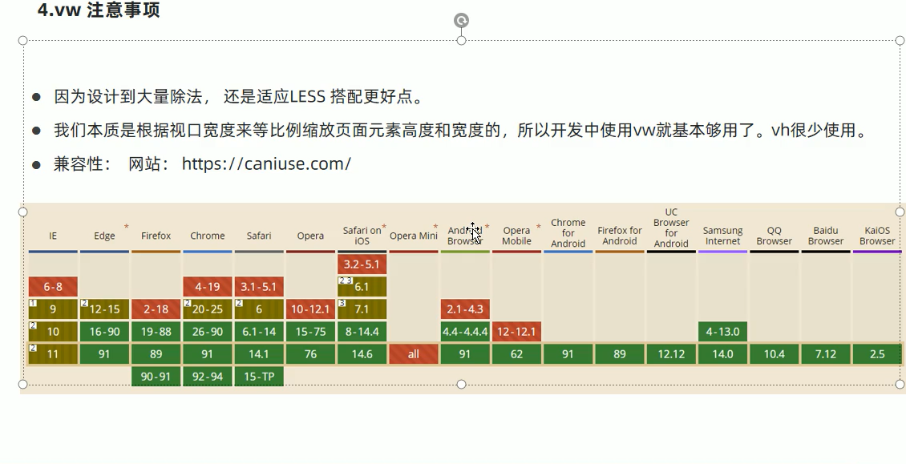

# flex 布局

tips：把多行每一行单独处理

tips：把多行当做一个整体去处理

tips：扩展比率用于当基准值（可以理解成基本宽度）设置后剩余的宽度空间的分配情况

这样相当于第一个盒子拿到剩余的1份，第二个盒子拿到4份

# rem

## 用法

tips：em 相当于父级的字体大小单位来说的，而 rem 是相对于根，所以**一般我们在 html 标签样式里设置好 font-size 便可以设定 rem 的大小了**   1rem = font-size

初始化 rem 的大小，20 可以改的（看你想要以多少像素的字体为基准），320 也可以改（可以调整成主流派屏幕宽度），resize 是页面大小改变时，load 是加载

## 设备判断

# vw 和 vh

