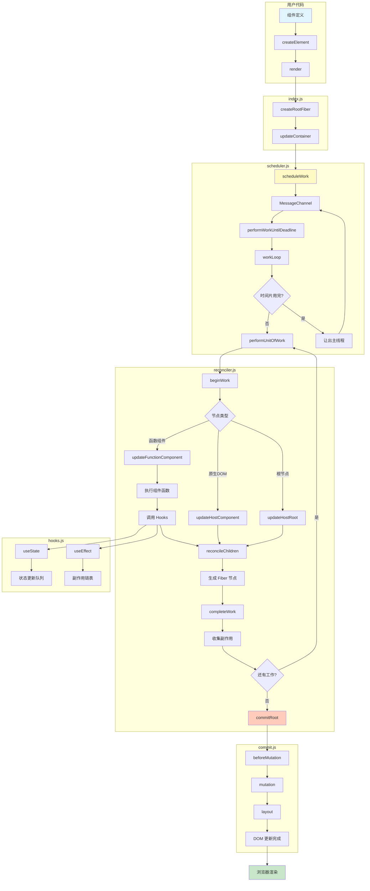
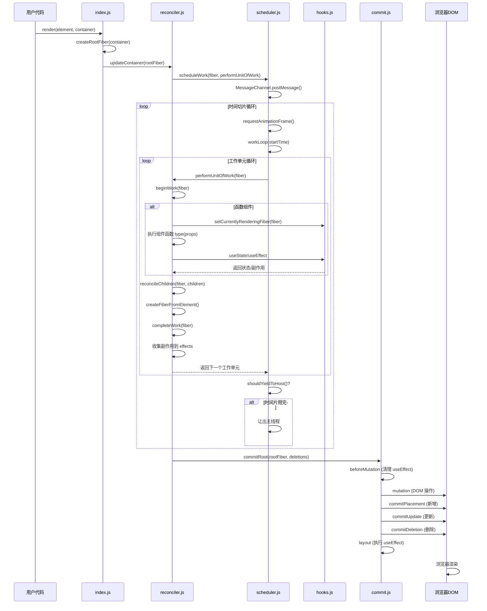
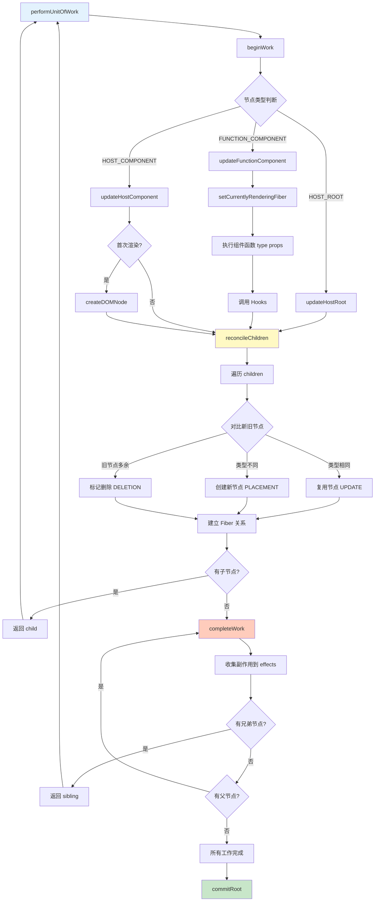
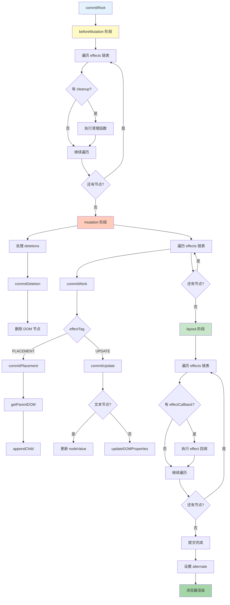
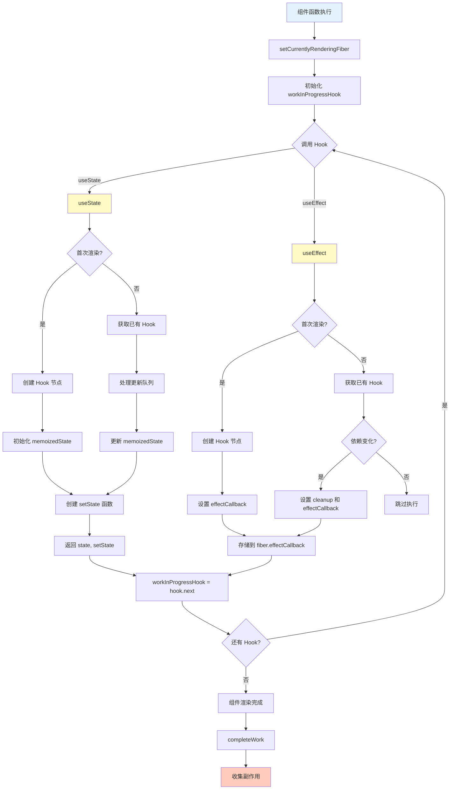
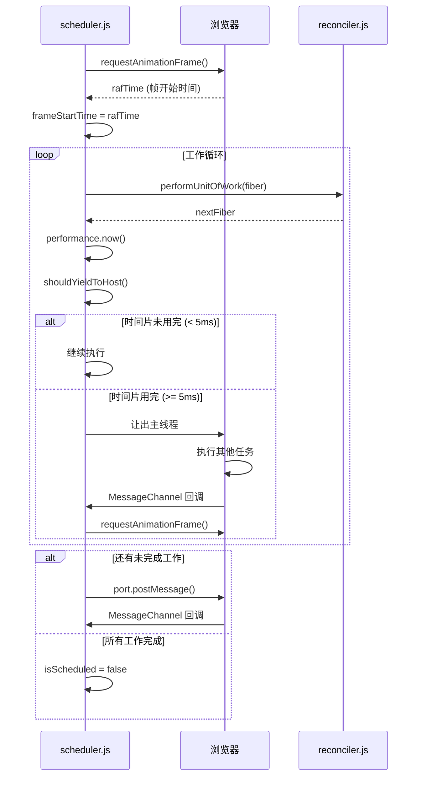

# Mini-React

一个精简的 React 实现，用于理解函数式组件从定义到浏览器渲染的完整流程。

## 项目结构

```
mini-react/
├── src/
│   ├── core/
│   │   ├── createElement.js      # 创建虚拟 DOM 对象
│   │   ├── fiber.js              # Fiber 节点定义和工具函数
│   │   ├── reconciler.js         # 协调阶段（可中断的渲染）
│   │   ├── commit.js             # 提交阶段（DOM 操作）
│   │   └── scheduler.js          # 调度器（任务调度和时间切片）
│   ├── hooks/
│   │   └── hooks.js              # useState 和 useEffect 实现
│   └── index.js                  # 主入口，提供 render 函数
├── examples/
│   └── example.html              # 示例页面
└── README.md                     # 项目说明
```

## 核心概念

### 1. 虚拟 DOM (Virtual DOM)

虚拟 DOM 是对真实 DOM 的抽象描述，格式为：

```javascript
{
  type: 'div',           // 元素类型或组件函数
  props: {                // 属性
    id: 'app',
    children: [...]      // 子节点
  }
}
```

### 2. Fiber 架构

Fiber 是 React 的协调器，每个组件对应一个 Fiber 节点：

```javascript
{
  tag: 'FUNCTION_COMPONENT',  // 节点类型
  type: Component,            // 组件函数
  props: {...},               // 属性
  stateNode: null,           // DOM 节点或组件实例
  child: null,               // 第一个子节点
  sibling: null,             // 下一个兄弟节点
  return: null,              // 父节点
  alternate: null,           // 对应的另一棵树上的节点（双缓冲）
  effectTag: 'PLACEMENT',    // 副作用类型
  effects: []                // 副作用链表
}
```

### 3. 渲染流程

```
1. 组件定义（函数式组件）
   ↓
2. createElement 创建虚拟 DOM
   ↓
3. render 初始化 Fiber 根节点
   ↓
4. scheduler 调度任务（时间切片）
   ↓
5. reconciler 协调阶段（可中断）
   - beginWork: 处理组件，执行函数获取子节点
   - reconcileChildren: 对比新旧节点，生成 Fiber 节点
   - completeWork: 创建 DOM 节点
   ↓
6. commit 提交阶段（不可中断）
   - beforeMutation: 执行 useEffect 清理函数
   - mutation: 执行 DOM 操作
   - layout: 执行 useEffect 回调
   ↓
7. 浏览器渲染
```

### 4. 模块交互流程图

#### 4.1 整体架构图



#### 4.2 完整渲染流程时序图



#### 4.3 协调阶段详细流程



#### 4.4 提交阶段详细流程



#### 4.5 Hooks 工作流程



#### 4.6 时间切片机制



## 核心模块

### createElement.js

创建虚拟 DOM 对象，将 JSX 转换为虚拟 DOM。

```javascript
createElement(
    'div',
    { id: 'app' },
    'Hello',
    createElement('span', null, 'World')
);
```

### fiber.js

定义 Fiber 节点结构和工具函数：

-   `TAG`: 节点类型（HOST_COMPONENT、FUNCTION_COMPONENT、HOST_ROOT）
-   `EFFECT_TAG`: 副作用类型（PLACEMENT、UPDATE、DELETION）
-   `createFiber`: 创建 Fiber 节点
-   `createRootFiber`: 创建根 Fiber 节点

### scheduler.js

任务调度器，使用 React 原生 API 实现时间切片：

-   **MessageChannel**: 用于任务调度，`port.postMessage()` 会在浏览器空闲时执行回调
-   **requestAnimationFrame**: 获取帧开始时间（rafTime），精确对齐浏览器刷新节奏
-   **performance.now()**: 高精度时间戳，用于计算时间差
-   **shouldYieldToHost**: 判断是否需要让出主线程，每帧允许 5ms JS 执行
-   **performWorkUntilDeadline**: 工作循环入口，结合 `requestAnimationFrame` 和 `MessageChannel` 实现时间切片

### reconciler.js

协调器，负责协调阶段的工作：

-   **beginWork**: 处理当前 Fiber 节点，返回子节点
-   **completeWork**: 完成当前节点的工作，构建 DOM 节点
-   **reconcileChildren**: 协调子节点，生成新的 Fiber 节点
-   **performUnitOfWork**: 执行单个工作单元（深度优先遍历）

**fiber 树的遍历顺序**

```
        Root
         ↓ child
        App
      ↙    ↛
   div    button   (sibling)
    ↓       ↓
  span   "Click"
```

### commit.js

提交阶段，将协调阶段计算出的更新应用到实际的 DOM：

-   **commitRoot**: 提交根节点
-   **commitWork**: 提交单个节点
-   **commitPlacement**: 处理新增节点
-   **commitUpdate**: 处理更新节点
-   **commitDeletion**: 处理删除节点

三个子阶段：

1. **beforeMutation**: 执行 useEffect 清理函数
2. **mutation**: 执行 DOM 操作
3. **layout**: 执行 useEffect 回调

### hooks.js

React Hooks 实现：

-   **useState**: 基于 Fiber 节点存储状态，使用队列管理状态更新
-   **useEffect**: 基于副作用链表管理 effect，通过依赖数组决定是否重新执行

Hooks 存储在 Fiber 节点的 `memoizedState` 上，形成一个链表。每次渲染时，通过工作指针（`workInProgressHook`）遍历链表。

## 使用方法

### 1. 打开示例页面

直接在浏览器中打开 `examples/example.html`（需要使用支持 ES6 模块的浏览器）。

### 2. 编写组件

```javascript
import { createElement, render } from './src/index.js';
import { useState, useEffect } from './src/hooks/hooks.js';

function Counter() {
    const [count, setCount] = useState(0);

    useEffect(() => {
        console.log(`Count: ${count}`);
    }, [count]);

    return createElement(
        'div',
        null,
        createElement('p', null, `计数: ${count}`),
        createElement('button', { onClick: () => setCount(count + 1) }, '增加')
    );
}

render(createElement(Counter), document.getElementById('root'));
```

## 关键实现点

1. **Fiber 双缓冲技术**：使用 `alternate` 指针连接新旧 Fiber 树
2. **工作循环**：深度优先遍历，通过 `child` → `sibling` → `return` 遍历
3. **副作用收集**：在 `completeWork` 阶段收集副作用，在 `commit` 阶段统一处理
4. **Hooks 存储**：将 hooks 存储在 Fiber 节点的 `memoizedState` 上
5. **时间切片**：使用 `MessageChannel` + `requestAnimationFrame` + `performance.now()`，通过 `shouldYieldToHost` 判断，每帧允许 5ms JS 执行（与 React 源码一致）

## 与 React 源码的对应关系

| Mini-React         | React 源码                |
| ------------------ | ------------------------- |
| `createElement.js` | `ReactElement.js`         |
| `fiber.js`         | `ReactFiber.js`           |
| `scheduler.js`     | `Scheduler.js`            |
| `reconciler.js`    | `ReactFiberReconciler.js` |
| `commit.js`        | `ReactFiberCommitWork.js` |
| `hooks.js`         | `ReactHooks.js`           |

## 学习要点

1. **虚拟 DOM 的作用**：虚拟 DOM 是对 UI 的抽象描述，不关注具体的渲染细节
2. **Fiber 的作用**：Fiber 是 React 的协调器，负责协调虚拟 DOM 的渲染
3. **时间切片**：通过 MessageChannel 和 requestAnimationFrame 实现可中断的渲染
4. **协调阶段**：可中断，负责计算差异
5. **提交阶段**：不可中断，负责执行 DOM 操作
6. **Hooks 原理**：基于链表结构，通过调用顺序来访问对应的 Hook

## 注意事项

-   这是一个教学项目，代码精简，去除了生产环境的复杂优化
-   仅支持函数式组件和基础的 Hooks（useState、useEffect）
-   不支持 JSX 语法，需要使用 `createElement` 函数
-   需要在支持 ES6 模块的浏览器中运行

## 参考资源

-   [React 源码](https://github.com/facebook/react)
-   [React Fiber 架构](https://github.com/acdlite/react-fiber-architecture)
-   [React Hooks 原理](https://react.dev/reference/react)
