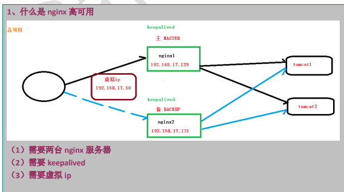
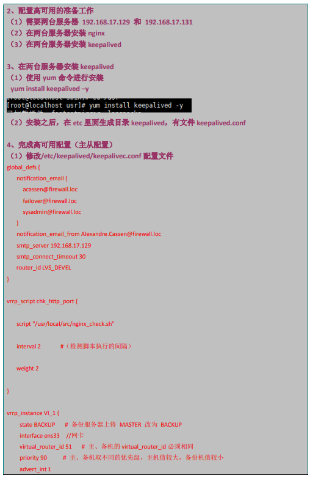
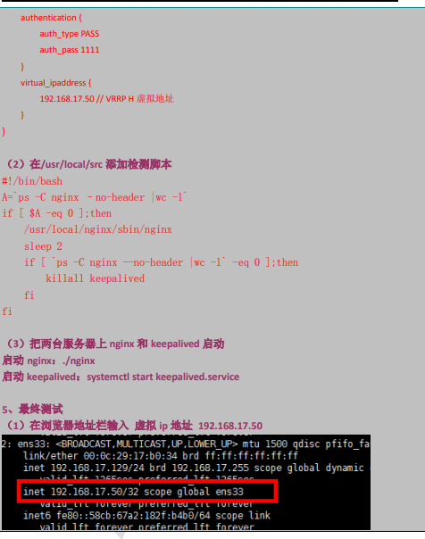
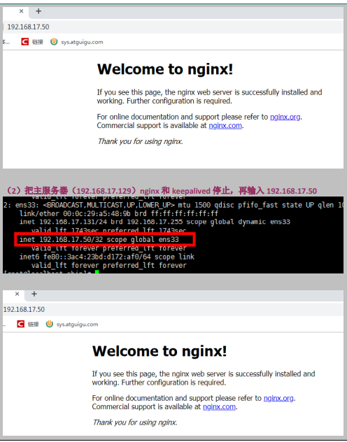
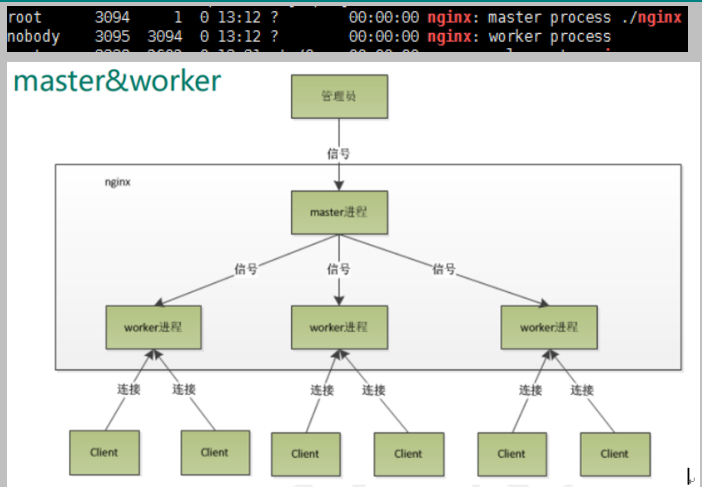
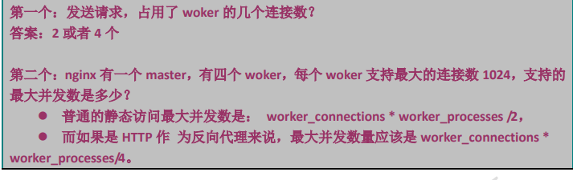
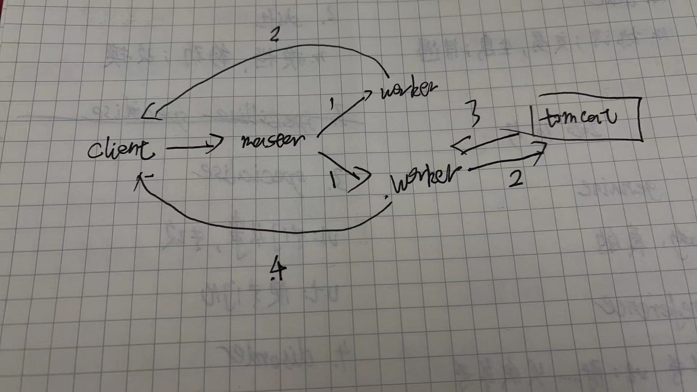
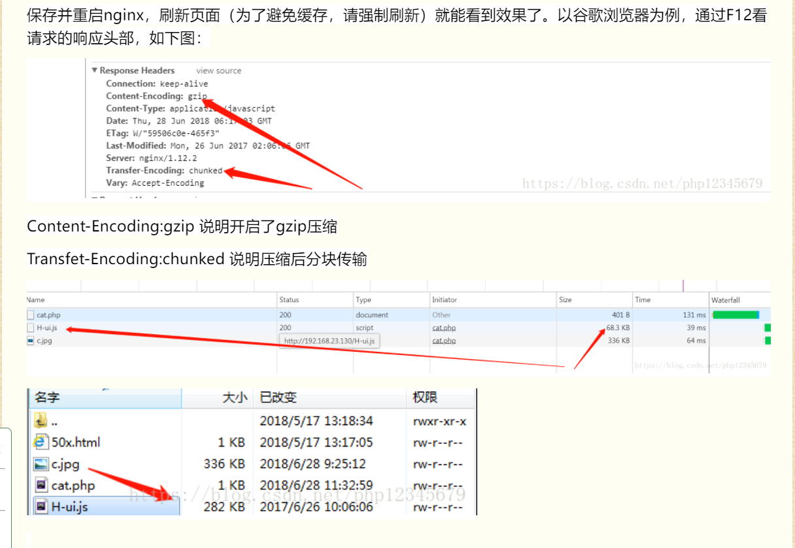

## 补充命令

- 查看进程


- 杀死进程


## Nginx 课程介绍


## Nginx 简介

### 1、什么是 Nginx


### 2、反向代理

- 正向代理：


tips：客户访问 google.com 不是直接访问，而是先访问代理服务器（需要在客户端先配置），代理服务器去访问谷歌，这就是所谓的正向代理

- 反向代理：


tips：个人理解，Nginx 就是一个反向代理的服务器，比如我们的项目部署在5001端口上面，当发送接口请求的时候因为在服务器端配置了反向代理，我们表面好像是向 5001 端口发送了请求（因此不会有跨域问题），实际上经过反向代理处理是向 5000 端口发送了请求


### 3、负载均衡


### 4、动静分离


tips：jsp、sevelet 能动态生成 HTML

## Nginx 安装


## Nginx 常用命令


## Nginx 配置文件


## Nginx配置实例-反向代理

### 实例

tips：这里有开启端口的操作说明


## Nginx配置集群分布









keepalived 原理：master服务器会和 backup 服务器保持通信，若backup收不到master的消息，虚拟ip地址就会漂移到backup服务器上，这时访问虚拟ip服务器地址就变成访问主服务器

## Nginx 原理分析

1. master 和 worker

   

   tips: nginx 启动后最少会有两个进程，master 和 worker

2. worker 如何进行工作的

   

   tips：master 负责接收 client 的请求分配，在 master 收到客户端的请求后，worker 后争抢请求进行处理

3. 一个 master 和 多个 worker 好处

   

   tips：比如说你键入了 reload 这个命令，四个 worker 里有一个 worker 正在处理请求，它的资源不会更新，其他三个会更新，等下个请求来时，没有更新的 worker 不会处理请求，会等到它把上个请求处理完，更新完才会处理下个请求

4. 设置多少个 worker 合适

   

   四核的 cpu 就用 四个 worker，8 个用 8 个

5. 连接数 worker_connerction

   

   

   tips：静态访问两个连接：请求连接，响应连接；反向代理四个连接：请求连接，反向代理连接，反向服务器响应连接，响应连接

## Nginx 开启gizp 压缩

### 开启后



```js
    server {
        listen       9815;

        gzip on;
        gzip_buffers 32 4K;
        gzip_comp_level 6; # 压缩级别
        gzip_min_length 100; # 最小压缩大小
        # 需要压缩类型
        gzip_types application/javascript application/x-javascript text/css text/xml; 
        gzip_disable "MSIE [1-6]\."; # 此处表示ie6及以下不启用gzip（因为ie低版本不支持）
        gzip_vary on; # 是否传输gzip压缩标志
        location / {
            root   html/dove/dist;
            index  index.html index.htm;	
        }	
        location /api {
            proxy_pass  http://120.77.156.205:9803;
            rewrite  ^.+api/?(.*)$ /$1 break;
            include  uwsgi_params;
        }
   }
```

## Nginx 配置 HTTP 缓存

```js
        location / {
            root   html/dove/dist;
            index  index.html index.htm;

            if ($request_uri ~* .*[.](js|css|map|jpg|png|svg|ico)$) {
              add_header Cache-Control "public, max-age=1000";#非html缓存1000s
            }
            
            if ($request_filename ~* ^.*[.](html|htm)$) {
              add_header Cache-Control "public, no-cache";
              #html文件协商缓存，也就是每次都询问服务器，浏览器本地是是否是最新的，是最新的就直接用，非最新的服务器就会返回最新
            }	
        }	
```

