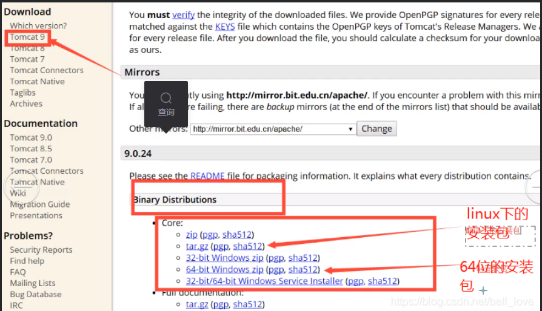
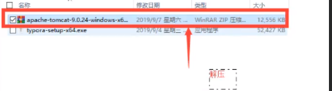
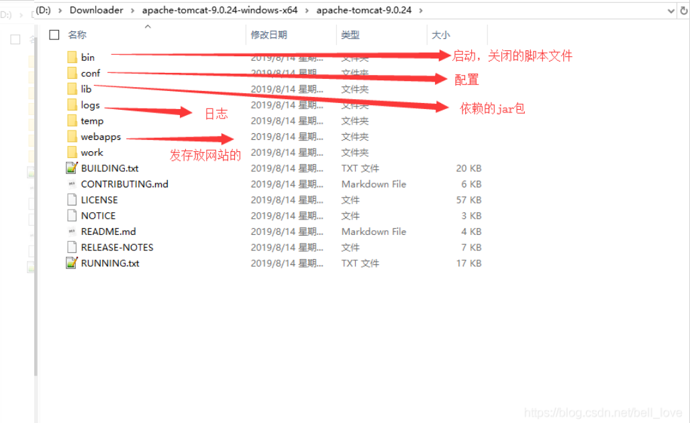
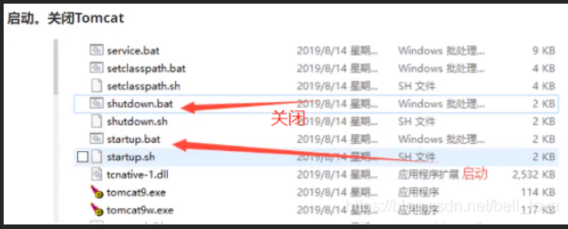
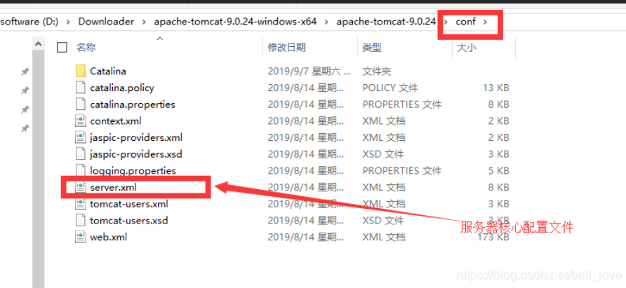
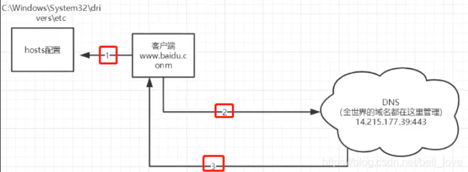

# 1、基本概念

## 1.1、前言

web开发：

- web，网页的意思，www.baidu.com·

- 静态web
  - html,css
  - 提供给所有人看的数据始终不会发生变化！
- 动态web
  - 淘宝，几乎是所有的网站；
  - 提供给所有人看的数据始终会发生变化，每个人在不同的时间，不同的地点看到的信息可以各不相同！
  - 技术栈：Servlet/JSP，ASP，PHP

## 1.2、web应用程序web应用程序：

可以提供浏览器访问的程序；

- a.html、b.html.….多个web资源，这些web资源可以被外界访问，对外界提供服务；
- 你们能访问到的任何一个页面或者资源，都存在于这个世界的某一个角落的计算机上。
- URL
- 这个统一的web资源会被放在同一个文件夹下，web应用程序>Tomcat：服务器
- 一个web应用由多部分组成（静态web，动态web)
  - html,css,js
  - jsp,servlet
  - Java程序
  - jar包
  - 配置文件（Properties)

Web应用程序编写完毕后，若想提供给外界访问；需费一个服务器来统一管理

## 1.3、静态web

- *.htm， *.html这些都是网页的后缀、如果服务器上一直存在这些东西，我们就可以直接进行读取、需要网络；


- 静态web存在的缺点
  - Web页面无法动态更新，所有用户看到都是同一个页面
    - 轮播图，点击特效：伪动态
    - JavaScript[实际开发中，它用的最多]
    - VBScript
  - 它无法和数据库交互（数据无法持久化，用户无法交互）

## 1.4、 动态web

页面会动态展示，“web页面的展示效果因人而异”


缺点：

- 加入服务器的动态web资源出现了错误，我们需要重新编写我们的后台程序，重新发布；
  - 停机维护优点：
- Web页面可以动态更新，所有用户看到都不是同一个页面
- 它可以与数据库交互（数据持久化：注册，商品信息，用户信息………）


# 2、web服务器

## 2.1、技术讲解

**ASP:**

- 微软：国内最早流行的就是ASP；
- ·在HTML中嵌入了VB的脚本，ASP+COM；
- ·在ASP开发中，基本一个页面都有几干行的业务代码，页面极其换乱
- ·维护成本高！
- C#
- IIS

**php:**

- PHP开发速度很快，功能很强大，跨平台，代码很简单（70%，WP）
- ·无法承载大访问量的情况（局限性）

**jSP/Servlet:**
B/S；浏览和服务器C/S：客户端和服务器

- sun公司主推的B/S架构
- 基于Java语言的（所有的大公司，或者一些开源的组件，都是用Java写的）
- 可以承载三高问题带来的影响；
- 语法像ASP，ASP->JSP，加强市场强度；

## 2.2、web服务器

服务器是一种被动的操作，用来处理用户的一些请求和给用户一些响应信息；
**lIS**
微软的；ASP.,Windows中自带的
**Tomcat**


Tomcat：
	Tomcat是Apache 软件基金会（Apache Software Foundation)的jakarta项目中的一个核心项目，最新的Servlet 和JSP 规范总是能在Tomcat中得到体现，因为Tomcat 技术先进、性能稳定，而且免费，因而深受lava爱好者的喜爱并得到了部分软件开发商的认可，成为目前比较流行的Web应用服务器。

​	Tomcat 服务器是一个免费的开放源代码的Web应用服务器，属于轻量级应用服务器，在中小型系统和并发访问用户不是很多的场合下被普遍使用，是开发和调试JSP程序的首选。对于一个Java初学web的人来说，它是最佳的选择

Tomcat 实际上运行JSP页面和Serlet。Tornct最新版易9.0

# 3、Tomcat

## 3.1安装tomcat tomcat

官网：http://tomcat.apache.org/





## 3.2、Tomcat启动和配置

文件夹作用:





访问测试：http://localhost:8080/

可能遇到的问题：

1. Java环境变量没有配置
2. 闪退问题：需要配置兼容性
3. 乱码问题：配置文件中设置

可以修改 conf/logging.properties 中的 java.util.logging.ConsoleHandler.encoding = GBK **解决乱码问题**

## 3.3、配置



可以配置启动的端口号

- tomcat的默认端口号为：8080
- mysql:3306
- http:80
- https：443

```html
<Connector port="8081" protocol="HTTP/1.1"
      connectionTimeout="20000"
      redirectPort="8443" />
```

可以配置主机的名称

- 默认的主机名为：localhost->127.0.0.1
- 默认网站应用存放的位置为：webapps

```html
  <Host name="www.qinjiang.com"  appBase="webapps"
        unpackWARs="true" autoDeploy="true">
```

**高难度面试题：**
请你谈谈网站是如何进行访问的！

1. 输入一个域名；回车

2. 检查本机的C:\Windows\System32\drivers\etc\hosts配置文件下有没有这个域名映射；

   1. 有：直接返回对应的ip地址，这个地址中，有我们需要访问的web程序，可以直接访问

      ```
       127.0.0.1 www.qinjiang.com
      ```

   2. 没有：去DNS服务器找，找到的话就返回，找不到就返回找不到；

   

   

 3.可以配置一下环境变量（可选性）

## 3.4、发布一个web网站

- 将自己写的网站，放到服务器（Tomcat)中指定的web应用的文件夹（webapps)下，就可以访问了

网站应该有的结构

```
--webapps ：Tomcat服务器的web目录
	-ROOT
	-kuangstudy ：网站的目录名
		- WEB-INF
			-classes : java程序
			-lib：web应用所依赖的jar包
			-web.xml ：网站配置文件
		- index.html 默认的首页
		- static 
            -css
            	-style.css
            -js
            -img
         -.....
```

# 4、Http

## 4.1、什么是HTTP

(超文本传输协议）是一个简单的请求-响应协议，它通常运行在TCP之上。

- 文本：html，字符串，…
- 超文本：图片，音乐，视频，定位，地图.……
- 端口:80

Https:安全的

## 4.2、两个时代

- http1.0
  - HTTP/1.0：客户端可以与web服务器连接后，只能获得一个web资源，断开连接
- http2.0
  - HTTP/1.1：客户端可以与web服务器连接后，可以获得多个web资源。

## 4.3、Http请求

```
Request URL:https://www.baidu.com/   请求地址
Request Method:GET    get方法/post方法
Status Code:200 OK    状态码：200
Remote（远程） Address:14.215.177.39:443

Accept:text/html  
Accept-Encoding:gzip, deflate, br
Accept-Language:zh-CN,zh;q=0.9    语言
Cache-Control:max-age=0
Connection:keep-alive
```

### 1、请求行

- 请求行中的请求方式：GET
- 请求方式：Get,Post,HEAD,DELETE,PUT,TRACT.…

### 2、消息头

```
Accept：告诉浏览器，它所支持的数据类型
Accept-Encoding：支持哪种编码格式  GBK   UTF-8   GB2312  ISO8859-1
Accept-Language：告诉浏览器，它的语言环境
Cache-Control：缓存控制
Connection：告诉浏览器，请求完成是断开还是保持连接
HOST：主机..../.
```

## 4.4、Http响应

```
Cache-Control:private    缓存控制
Connection:Keep-Alive    连接
Content-Encoding:gzip    编码
Content-Type:text/html   类型  
```

### 1、响应体

```
Accept：告诉浏览器，它所支持的数据类型
Accept-Encoding：支持哪种编码格式  GBK   UTF-8   GB2312  ISO8859-1
Accept-Language：告诉浏览器，它的语言环境
Cache-Control：缓存控制
Connection：告诉浏览器，请求完成是断开还是保持连接
HOST：主机..../.
Refresh：告诉客户端，多久刷新一次；
Location：让网页重新定位；
```

### 2、响应状态码

200：请求响应成功200
3xx:请求重定向·重定向：你重新到我给你新位置去；
4xx:找不到资源404·资源不存在；
5xx:服务器代码错误 500 502:网关错误

**常见面试题：**
当你的浏览器中地址栏输入地址并回车的一瞬间到页面能够展示回来，经历了什么？
