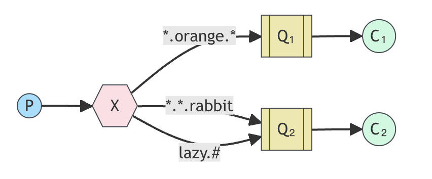

[# Topic 交换器(exchange)](https://www.rabbitmq.com/tutorials/tutorial-five-javascript)

在上一教程中，我们改进了日志系统。我们不再使用只能进行虚假广播的`fanout`exchange，而是使用了`direct`exchange，并获得了选择性接收日志的能力。

虽然使用`direct`交换改进了我们的系统，但它仍有局限性--不能根据多个标准进行路由选择。

在日志系统中，我们可能不仅要根据日志的重要性订阅日志，还要根据日志的来源订阅日志。您可能从 syslog unix 工具中了解到这一概念，它根据重要性（info/warn/crit......）和设施（auth/cron/kern......）筛选日志。

这将为我们提供很大的灵活性--我们可能只想监听来自 "cron "的关键错误，但也想监听来自 "kern "的所有日志。

要在日志系统中实现这一点，我们需要了解更复杂的`topic`交换器。

## Topic 交换器

发送到`topic`交换器(exchange)的消息不能有任意的 `routing_key`--它必须是一个用点分隔的单词列表。这些单词可以是任何内容，但通常会指定与信息相关的一些特征。以下是几个有效的路由密钥示例 `"stock.usd.nyse"`、`"nyse.vyw"`、`"quick.orange.rabbit"`。路由密钥的字数不限，最多 255 字节。

绑定密钥也必须采用相同的形式。`topic`交换器背后的逻辑与`direct`交换类似--使用特定路由密钥发送的信息将被传送到所有绑定了匹配绑定密钥的队列。不过，绑定密钥有两种重要的特殊情况：

-   `*`（星号）可以正好替代一个单词。
-   `#`（哈希）可以替代零个或多个单词。

举例说明最容易理解：


在这个例子中，我们要发送的信息都是描述动物的。信息将使用由三个单词（两个点）组成的路由密钥发送。消息将与路由密钥一起发送，路由密钥由三个单词(两个点)组成。路由键中的第一个词将描述速度，第二个词是颜色，第三个词是物种:"<speed>.<colour>.<species>".

我们创建了三个绑定:Q1 使用绑定键`"*.orange.*"`绑定; Q2 使用`"*.*.rabbit"`和`"lazy.#"`.

这些绑定可以总结为:

-   Q1 对所有橙色的(orange)动物都感兴趣。
-   Q2 想听关于兔子(rabbit)和懒惰(lazy)动物的一切。

举例：

-   “quick.orange.rabbit”：两个队列都去
-   "lazy.orange.elephant"：两个队列都去
-   "quick.orange.fox"：只去第一个队列
-   "lazy.brown.fox" ：只去第二个队列
-   "lazy.pink.rabbit"：只去第二个队列，虽然它匹配了两个但是这两个都是属于第二队列的
-   "quick.brown.fox：不会匹配到任何队列

> **Topic 交换器**
> 主题交换功能强大，可以像其他交换一样运行
> 当队列使用`“#”`(哈希)绑定键绑定时，它将接收所有消息，而不管路由键是什么，就像 `fanout` 交换一样。
> 当绑定中不使用特殊字符`“*”`(星号)和`“#”`(散列)时，主题交换的行为就像`direct`交换一样。

## 将所有内容整合到一起

我们将在日志系统中使用`topic`交换。我们首先假设日志的路由键将包含两个词： "<facility>.<severity>"。

代码与之前的[教程](./路由.md)几乎相同。

emit_log_topic.js 的代码：

```javascript
#!/usr/bin/env node

var amqp = require("amqplib/callback_api");

amqp.connect("amqp://localhost", function(error0, connection) {
    if (error0) {
        throw error0;
    }
    connection.createChannel(function(error1, channel) {
        if (error1) {
            throw error1;
        }
        var exchange = "topic_logs";
        var args = process.argv.slice(2);
        var key = args.length > 0 ? args[0] : "anonymous.info";
        var msg = args.slice(1).join(" ") || "Hello World!";

        channel.assertExchange(exchange, "topic", {
            durable: false,
        });
        channel.publish(exchange, key, Buffer.from(msg));
        console.log(" [x] Sent %s:'%s'", key, msg);
    });

    setTimeout(function() {
        connection.close();
        process.exit(0);
    }, 500);
});
```

receive_logs_topic.js 的代码：

```javascript
#!/usr/bin/env node

var amqp = require("amqplib/callback_api");

var args = process.argv.slice(2);

if (args.length == 0) {
    console.log("Usage: receive_logs_topic.js <facility>.<severity>");
    process.exit(1);
}

amqp.connect("amqp://localhost", function(error0, connection) {
    if (error0) {
        throw error0;
    }
    connection.createChannel(function(error1, channel) {
        if (error1) {
            throw error1;
        }
        var exchange = "topic_logs";

        channel.assertExchange(exchange, "topic", {
            durable: false,
        });

        channel.assertQueue(
            "",
            {
                exclusive: true,
            },
            function(error2, q) {
                if (error2) {
                    throw error2;
                }
                console.log(" [*] Waiting for logs. To exit press CTRL+C");

                args.forEach(function(key) {
                    channel.bindQueue(q.queue, exchange, key);
                });

                channel.consume(
                    q.queue,
                    function(msg) {
                        console.log(
                            " [x] %s:'%s'",
                            msg.fields.routingKey,
                            msg.content.toString()
                        );
                    },
                    {
                        noAck: true,
                    }
                );
            }
        );
    });
});
```

接收所有日志：

```bash
node ./receive_logs_topic.js "#"
```

从设施 "kern "接收所有日志：

```bash
node ./receive_logs_topic.js "kern.*"
```

或者，如果您只想了解 `critical` 日志：

```bash
node ./receive_logs_topic.js "*.critical"
```

你可以监听多个绑定 key:

```bash
node ./receive_logs_topic.js "kern.*" "*.critical"
```

并发出路由键为 `kern.critical` 类型的日志：

```bash
node ./emit_log_topic.js "kern.critical" "A critical kernel error"
```

请尽情使用这些程序。请注意，代码中没有对路由键或绑定键做任何假设，您可能需要使用两个以上的路由键参数。
