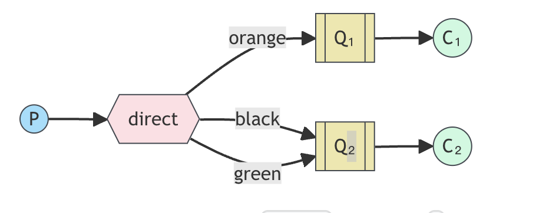
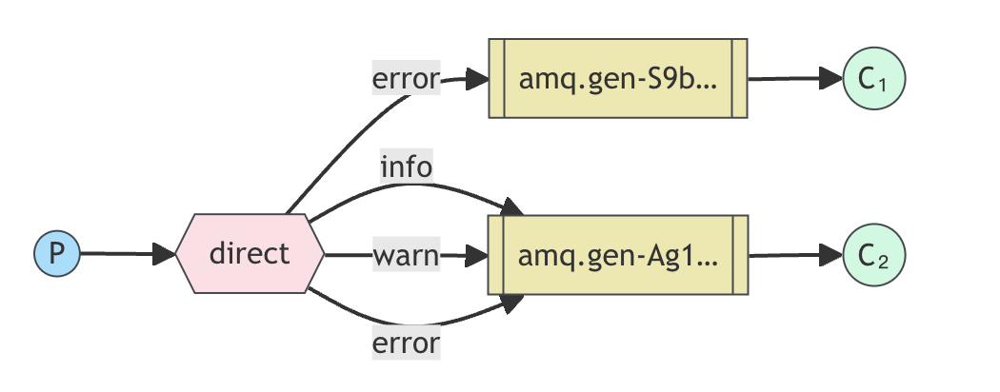

# [RabbitMQ tutorial - Routing](https://www.rabbitmq.com/tutorials/tutorial-four-javascript)

## 路由(Routing)

### (using the amqp.node client)

在[上一教程](./发布和订阅.md)中，我们建立了一个简单的日志系统。我们可以向许多接收器广播日志信息。

在本教程中，我们将为其添加一项功能--只订阅部分消息。例如，我们可以只将重要的错误信息发送到日志文件（以节省磁盘空间），同时仍然可以在控制台上打印所有日志信息。

## 绑定(Bindings)

在之前的示例中，我们已经创建了绑定。您可能还记得以下代码:

```javascript
channel.bindQueue(q.queue, exchange, "");
```

绑定是交换器(exchange)和队列之间的关系。这可以简单地理解为:队列对来自交换器(exchange)的消息感兴趣。

绑定可以接受一个额外的绑定键参数(上面代码中的空字符串)。下面是我们如何创建一个带有 key 的绑定示例:

```javascript
channel.bindQueue(queue_name, exchange_name, "black");
```

绑定密钥(binding key)的含义取决于交换类型。我们之前使用的扇出(fanout)交换只是忽略了它的值。

## 直接交换

上一教程中的日志系统将所有消息广播给所有消费者。我们希望对其进行扩展，以允许根据消息的重要程度过滤消息。例如，我们可能希望将日志消息写入磁盘的脚本只接收关键错误，而不是在警告或信息日志消息上浪费磁盘空间。

我们使用的是`扇出(fanout)`交换，这给不了我们很大的灵活性——它只能进行不需要动脑的广播。

我们将采用`直接(direct)`交换的方式。直接交换背后的路由算法很简单——消息被送到与其`绑定密钥(binding key)`完全匹配的队列中。

为了说明这一点，请思考以下假设:



在这个假设下，我们可以看到绑定了两个队列的`直接(direct)`交换器 。第一个队列用绑定键`orange`绑定，第二个队列有两个绑定，一个绑定键为`black`，另一个绑定键为`green`。

在这种设置中，使用路由密钥(routing key)`orange`发布到交换机的消息将被路由到队列 Q1。路由键为`black`或`green`的消息将转到 Q2。所有其他消息将被丢弃。

在这种假设下，发布到交换中心、路由密钥为`orange`的报文将被路由到队列 Q1。路由密钥为`black`或`green`的报文将进入 Q2。所有其他报文都将被丢弃。

## 多个绑定(Multiple bindings)

用同一个绑定密钥绑定多个队列是完全合法的。在我们的例子中，我们可以用绑定密钥 black 在 X 和 Q1 之间添加一个绑定。在这种情况下，直接交换将像扇出一样，向所有匹配队列广播报文。路由密钥为 black 的报文将同时发送到 Q1 和 Q2。

## 发送日志(Emitting logs)

我们的日志系统将使用这种模式。我们将不使用 `fanout`，而是直接向交换中心发送消息。我们将提供日志重要性作为路由密钥。这样，接收脚本就能根据日志的重要性选择它想接收的。让我们先关注日志的发送。

与往常一样，我们需要先创建一个交易所(exchange)：

```javascript
var exchange = "direct_logs";

channel.assertExchange(exchange, "direct", {
    durable: false,
});
```

我们已经准备好传递信息了：

```javascript
var exchange = "direct_logs";

channel.assertExchange(exchange, "direct", {
    durable: false,
});
channel.publish(exchange, severity, Buffer.from(msg));
```

为简化起见，我们假设 "severity" 可以是 "info"、"warning "和 "error "中的一种。

## 订阅(Subscribing)

接收信息的工作方式与上一教程相同，但有一个例外--我们要为感兴趣的每种严重性创建一个新的绑定。

```javascript
args.forEach(function(severity) {
    channel.bindQueue(q.queue, exchange, severity);
});
```

## 将所有内容整合在一起(Putting it all together)



emit_log_direct.js 脚本的代码：

```javascript
#!/usr/bin/env node

var amqp = require("amqplib/callback_api");

amqp.connect("amqp://localhost", function(error0, connection) {
    if (error0) {
        throw error0;
    }
    connection.createChannel(function(error1, channel) {
        if (error1) {
            throw error1;
        }
        var exchange = "direct_logs";
        var args = process.argv.slice(2);
        var msg = args.slice(1).join(" ") || "Hello World!";
        var severity = args.length > 0 ? args[0] : "info";

        channel.assertExchange(exchange, "direct", {
            durable: false,
        });
        channel.publish(exchange, severity, Buffer.from(msg));
        console.log(" [x] Sent %s: '%s'", severity, msg);
    });

    setTimeout(function() {
        connection.close();
        process.exit(0);
    }, 500);
});
```

receive_logs_direct.js 的代码：

```javascript
#!/usr/bin/env node

var amqp = require("amqplib/callback_api");

var args = process.argv.slice(2);

if (args.length == 0) {
    console.log("Usage: receive_logs_direct.js [info] [warning] [error]");
    process.exit(1);
}

amqp.connect("amqp://localhost", function(error0, connection) {
    if (error0) {
        throw error0;
    }
    connection.createChannel(function(error1, channel) {
        if (error1) {
            throw error1;
        }
        var exchange = "direct_logs";

        channel.assertExchange(exchange, "direct", {
            durable: false,
        });

        channel.assertQueue(
            "",
            {
                exclusive: true,
            },
            function(error2, q) {
                if (error2) {
                    throw error2;
                }
                console.log(" [*] Waiting for logs. To exit press CTRL+C");

                args.forEach(function(severity) {
                    channel.bindQueue(q.queue, exchange, severity);
                });

                channel.consume(
                    q.queue,
                    function(msg) {
                        console.log(
                            " [x] %s: '%s'",
                            msg.fields.routingKey,
                            msg.content.toString()
                        );
                    },
                    {
                        noAck: true,
                    }
                );
            }
        );
    });
});
```

如果只想将 "warning "和 "error"（而不是 "info"）日志信息保存到文件中，只需打开控制台并输入

```bash
./receive_logs_direct.js warning error > logs_from_rabbit.log
```

如果您想在屏幕上看到所有日志信息，请打开一个新终端并执行以下操作

```bash
./receive_logs_direct.js info warning error
# => [*] Waiting for logs. To exit press CTRL+C
```

例如，要输出错误日志信息，只需键入:

```bash
./emit_log_direct.js error "Run. Run. Or it will explode."
# => [x] Sent 'error':'Run. Run. Or it will explode.'
```

(emit_log_direct.js 源代码和 (receive_logs_direct.js 源代码的完整源代码)
