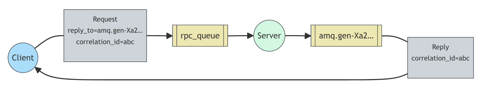

# [Remote procedure call (RPC)](https://www.rabbitmq.com/tutorials/tutorial-six-javascript)

## 远程程序调用 (RPC)

### （使用 amqp.node 客户端）

在[第二个教程](./工作队列.md)中，我们学习了如何使用工作队列在多个工人之间分配耗时的任务。

但如果我们需要在远程计算机上运行一个函数并等待结果呢？那就另当别论了。这种模式通常被称为远程过程调用或 RPC。

在本教程中，我们将使用 RabbitMQ 构建一个 RPC 系统：一个客户端和一个可扩展的 RPC 服务器。由于我们没有任何值得分发的耗时任务，因此我们将创建一个返回斐波那契数字的虚拟 RPC 服务。

> **关于 RPC 的一点说明**
> 虽然 RPC 是计算机中一种相当常见的模式，但它经常受到批评。当程序员不知道函数调用是本地调用还是慢速 RPC(slow RPC) 时，问题就出现了。
>
> 考虑到这一点，请考虑以下建议:
>
> -   确保哪个函数调用是本地调用，哪个是远程调用，一目了然。
> -   为你的系统写一些说明。明确组件之间的依赖关系。
> -   处理错误情况。当 RPC 服务器长时间停机时，客户端应如何反应？
>     如有疑问，请避免使用 RPC。如果可以，应该使用异步流水线--将结果异步推送到下一个计算阶段，而不是类似 RPC 的阻塞。

### 回调队列

一般来说，通过 RabbitMQ 进行 RPC 非常简单。客户端发送请求消息，服务器回复响应消息。为了接收响应，我们需要随请求发送一个 "回调(callback)"队列地址。我们可以使用默认的交换(exchange)。让我们试试看：

```javascript
channel.assertQueue("", {
    exclusive: true,
});

channel.sendToQueue("rpc_queue", Buffer.from("10"), {
    replyTo: queue_name,
});
```

> **消息属性**
> AMQP 0-9-1 协议预定义了一组 14 个属性，与消息一起使用。除以下属性外，大多数属性都很少使用：
>
> -   `persistent:` 将消息标记为持久（值为 true）或暂存（false）。您可能还记得[第二个教程](./工作队列.md)中的这个属性。
> -   `content_type:`: 用于描述编码的 mime 类型。例如，对于常用的 JSON 编码，最好将此属性设置为：application/json。
> -   `reply_to:` 常用于命名回调队列。
> -   `correlation_id:`: 用于将 RPC 响应与请求关联起来。

### 相关 Id(Correlation Id)

在上面介绍的方法中，我们建议为每个 RPC 请求创建一个回调队列。这样做效率很低，但幸运的是，有一个更好的方法--让我们为每个客户端创建一个回调队列。

这就产生了一个新问题，即在该队列中收到一个响应后，不清楚该响应属于哪个请求。这时就需要使用 `correlation_id` 属性。我们将为每个请求设置一个唯一的值。稍后，当我们在回调队列中收到一条消息时，我们就会查看该属性，并根据它来匹配响应和请求。如果我们看到一个未知的 `correlation_id` 值，我们就可以放心地丢弃该消息--它不属于我们的请求。

你可能会问，为什么我们要忽略回调队列中的未知信息，而不是出错？这是由于服务器端可能出现竞赛条件。虽然可能性不大，但 RPC 服务器有可能在向我们发送应答后，但在发送请求确认信息前就死机了。如果发生这种情况，重新启动的 RPC 服务器将再次处理请求。这就是为什么在客户机上我们必须优雅地处理重复响应的原因，理想情况下 RPC 应该是幂等的。

### 总结

我们的 RPC 将这样工作：



-   客户端启动时，会创建一个匿名专属回调队列。
-   对于 RPC 请求，客户端发送的消息有两个属性：`reply_to`（设置为回调队列）和 `correlation_id`（设置为每个请求的唯一值）。
-   请求会被发送到 `rpc_queue` 队列。
-   RPC Worker（又称：服务器）在队列中等待请求。当出现请求时，它就会执行任务，并使用 `reply_to` 字段中的队列将结果发送回客户端。
-   客户端在回调队列中等待数据。当信息出现时，它会检查 `correlation_id` 属性。如果与请求中的值匹配，就会向应用程序返回响应。

## 将所有内容整合在一起

斐波那契函数：

```javascript
function fibonacci(n) {
    if (n == 0 || n == 1) return n;
    else return fibonacci(n - 1) + fibonacci(n - 2);
}
```

我们声明斐波纳契函数。它假设只有有效的正整数输入。(不要指望这个函数对大数有效，而且它可能是最慢的递归实现）。

```javascript
#!/usr/bin/env node

var amqp = require("amqplib/callback_api");

amqp.connect("amqp://localhost", function(error0, connection) {
    if (error0) {
        throw error0;
    }
    connection.createChannel(function(error1, channel) {
        if (error1) {
            throw error1;
        }
        var queue = "rpc_queue";

        channel.assertQueue(queue, {
            durable: false,
        });
        channel.prefetch(1);
        console.log(" [x] Awaiting RPC requests");
        channel.consume(queue, function reply(msg) {
            var n = parseInt(msg.content.toString());

            console.log(" [.] fib(%d)", n);

            var r = fibonacci(n);

            channel.sendToQueue(
                msg.properties.replyTo,
                Buffer.from(r.toString()),
                {
                    correlationId: msg.properties.correlationId,
                }
            );

            channel.ack(msg);
        });
    });
});

function fibonacci(n) {
    if (n == 0 || n == 1) return n;
    else return fibonacci(n - 1) + fibonacci(n - 2);
}
```

服务器代码相当简单：

-   像往常一样，我们首先建立连接、通道并声明队列
-   我们可能希望运行不止一个服务器进程。为了将负载平均分配给多个服务器，我们需要在通道上设置`prefetch`。
-   我们使用 Channel.consume 从队列中消费消息。然后，我们进入回调函数，在此执行工作并将响应发送回去。

RPC 客户端 `rpc_client.js` 的代码：

```javascript
#!/usr/bin/env node

var amqp = require("amqplib/callback_api");

var args = process.argv.slice(2);

if (args.length == 0) {
    console.log("Usage: rpc_client.js num");
    process.exit(1);
}

amqp.connect("amqp://localhost", function(error0, connection) {
    if (error0) {
        throw error0;
    }
    connection.createChannel(function(error1, channel) {
        if (error1) {
            throw error1;
        }
        channel.assertQueue(
            "",
            {
                exclusive: true,
            },
            function(error2, q) {
                if (error2) {
                    throw error2;
                }
                var correlationId = generateUuid();
                var num = parseInt(args[0]);

                console.log(" [x] Requesting fib(%d)", num);

                channel.consume(
                    q.queue,
                    function(msg) {
                        if (msg.properties.correlationId == correlationId) {
                            console.log(" [.] Got %s", msg.content.toString());
                            setTimeout(function() {
                                connection.close();
                                process.exit(0);
                            }, 500);
                        }
                    },
                    {
                        noAck: true,
                    }
                );

                channel.sendToQueue("rpc_queue", Buffer.from(num.toString()), {
                    correlationId: correlationId,
                    replyTo: q.queue,
                });
            }
        );
    });
});

function generateUuid() {
    return (
        Math.random().toString() +
        Math.random().toString() +
        Math.random().toString()
    );
}
```

现在是查看 `rpc_client.js` 和 `rpc_server.js` 完整示例源代码的好时机。

我们的 RPC 服务已经准备就绪。我们可以启动服务器了：

```bash
node rpc_server.js
# => [x] Awaiting RPC requests
```

要请求斐波那契数字，请运行客户端：

```bash
node rpc_client.js 30
# => [x] Requesting fib(30)
```

这里介绍的设计并不是 RPC 服务唯一可能的实现方式，但它有一些重要的优势：

-   如果 RPC 服务器速度太慢，你可以运行另一个服务器来扩大规模。试着在新的控制台中运行第二个 rpc_server.js。
-   在客户端，RPC 只需要发送和接收一条信息。因此，RPC 客户端只需为单个 RPC 请求进行一次网络往返。

我们的代码仍然非常简单，没有尝试解决更复杂（但更重要）的问题，例如

-   如果没有服务器运行，客户端应该如何应对？
-   客户端是否应该为 RPC 设置某种超时？
-   如果服务器出现故障并引发异常，是否应将异常转发给客户端？
-   在处理前防止无效信息（如检查边界和类型）。
