# 自我介绍

面试官您好，我叫陈源鑫，21岁，今年大三；我虽然没有过实习经历，但是我是从大一暑假开始便开始自学前端，大二开学初便进入实验室跟着导师做项目，有实际的项目开发经历，差不多就这些。

# 介绍项目

这个项目是我们实验室与梅州金绿集团合作的一个项目，他是梅州一个养鸽企业，这个系统用于对鸽棚采集的数据进行汇总和分析，我们用的是 vue + ElementUI；在这个项目遇到的问题，首先我比较印象深刻的是首屏渲染速度较慢的问题，尤其是图片加载比较慢，为此我先是对图片做了压缩但是感觉还是不够，就又做了 http 缓存，后面又做了预渲染，还有路由懒加载，external，css 提取等去减少包的体积。


# 欢聚时代

## 一面

### 1.垂直居中方式

#### **Vertical-Align**

#### Line-Height 方法

**这个方法适用于单行文字的垂直居中**，只需要将包含文字元素的容器行高设置为大于字体大小并且等于元素的高度。默认情况下，文字上下部分会留有相同的空间，因而实现了文字的垂直居中。

**html**

```html
<div id="parent">
    <div id="child">Text here</div>
</div>
```

**css**

```css
#child {
    line-height: 200px;
}
```

这种方法只适用于单行文字的垂直居中，如果需要多行文字居中，需要选择其他方法。

##### 使用 Line-Height 垂直居中图片

使 **line-height** 可以实现图片的垂直居中，只需要在包含图片的父元素上设置 **line-height** 然后为图片设置 `vertical-align: middle`。

**html**

```html
<div id="parent">
    
</div>
```

**css**

```css
#parent { 
    line-height: 200px;
}

#parent img {
    vertical-align: middle;
}
```

#### CSS表格法

之前已经提到 **vertical-align** 适用于 **table-cell**, 因此可以通过将元素转化为table来实现垂直居中。

**html**

```html
<div id="parent">
    <div id="child">Text here</div>
</div>
```

**css**

```css
#parent {
    display: table;
}

#child {
    display: table-cell;
    vertical-align: middle;
}
```

注意这种方法的好处在于支持内容的动态改变，缺点是不支持旧版的IE浏览器（<=IE7）。

#### 绝对定位和margin

**html**

```html
    <div class="div1">
        <div class="div2">
        </div>
    </div>
```

**css**

```css
    .div1 {
        width: 100px;
        height: 100px;
        position: relative;
        background-color: black;
    }
    .div2 {
        background-color: pink;
        width: 50px;
        height: 50px;
        position: absolute;
        top: 50%;
        left: 50%;
        margin-top: -25px;
        margin-left: -25px;
    }
```

#### 绝对定位和拉伸法

css

```css
    .div1 {
        width: 100px;
        height: 100px;
        position: relative;
        background-color: black;
    }
    .div2 {
        background-color: pink;
        width: 50px;
        height: 50px;
        position: absolute;
        top: 0;
        bottom: 0;
        left: 0;
        right: 0;
        margin: auto;
    }
```

#### flex 

### 2.call 、appy 和 bind 的区别和源码

- call：参数需要逐个传递
- apply：参数是一个数组
- bind：参数需要逐个传递，不过返回的是一个函数

```js
<script>
    // 1.将方法挂载到我们传入的 ctx
    // 2.将挂在以后的方法调用
    // 3.将我们添加的这个属性删除掉
    Function.prototype.luckyCall = function( ctx, ...args ) {
        // 给我们要指定的那个上下文对象添加一个属性，值是我们要调用的方法，因为 luckyCall 是我们所调用的方法调的，所以 this 指向它
        // 这里有个优化可以做就是 fn 这个名字可能本身在上下文对象就是一个属性，这样写可能会覆盖掉上下文对象的属性
        // 可以通过 let fn = symbol(1) 定义一个唯一的属性名
        ctx.fn = this

        // 调用这个属性方法， this 便变成了上下文对象
        ctx.fn(...args)

        delete ctx.fn
    }

    // 1.将方法挂载到我们传入的 ctx
    // 2.将挂在以后的方法调用
    // 3.将我们添加的这个属性删除掉
    Function.prototype.luckyApply = function( ctx, args = [] ) {

        // 判断参数是否是数组
        if (args && !(args instanceof Array)) {
            throw('参数得是数组')
        }

        // 给我们要指定的那个上下文对象添加一个属性，值是我们要调用的方法，因为 luckyCall 是我们所调用的方法调的，所以 this 指向它
        ctx.fn = this

        // 调用这个属性方法， this 便变成了上下文对象
        ctx.fn(...args)
        
        delete ctx.fn
    }

    Function.prototype.luckyBind = function( ctx, ...args ) {

        // 返回一个函数
        return (...args2) => {
            ctx.fn = this

            // 拼接第二次调用的参数并执行
            ctx.fn(...args1.concat(args2))

            // 删除属性
            delete ctx.fn
        }
    }
</script>
```

### 3.https 的传输过程

- 客户端向服务器发起HTTPS请求，连接到服务器的443端口；
- 服务器端有一个密钥对，即公钥（即数字证书）和私钥，是用来进行非对称加密使用的，服务器端保存着私钥，不能将其泄露，公钥可以发送给任何人；
- 服务器将自己的公钥发送给客户端；
- 客户端收到服务器端的公钥之后，检查其合法性，如果发现发现公钥有问题，那么HTTPS传输就无法继续，如果公钥合格，则客户端会生成一个客户端密钥，然后用服务器的公钥对客户端密钥进行非对称加密成密文，至此，HTTPS中的第一次HTTP请求结束；
- 客户端发起HTTPS中的第二个HTTP请求，将加密之后的客户端密钥发送给服务器；
- 服务器接收到客户端发来的密文之后，会用自己的私钥对其进行非对称解密，解密之后的明文就是客户端密钥，然后用客户端密钥对数据进行对称加密，这样数据就变成了密文；
- 然后服务器将加密后的密文发送给客户端；
- 客户端收到服务器发送来的密文，用客户端密钥对其进行对称解密，得到服务器发送的数据。这样HTTPS中的第二个HTTP请求结束，整个HTTPS传输完成。
  

### 4.跨域以及其解决方式

**什么是跨域？**

- 要理解跨域首先要知道什么是：所谓同源（即指在同一个域）就是两个页面具有相同的协议（protocol），主机（host）端口号（port）
- 浏览器有一个安全功能叫同源策略，它规定不同源的客户端脚本在没有明确授权的情况下，不能读写对方资源。 如果尝试这样操作就是跨域

**非同源的限制**

1. 无法读取非同源网页的 Cookie、LocalStorage 和 IndexedDB
2. 无法接触非同源网页的 DOM
3. 无法向非同源地址发送 AJAX 请求，即 XHR 请求

**解决方案**

- jsonp

```
原理：利用 script 标签没有跨域限制向服务器发送 get 请求，传一个回调函数名给服务端，服务端直接将数据作为参数传回来
JSONP的优势在于支持老式浏览器，弊端也比较明显：只支持GET请求而不支持POST等其它类型的HTTP请求,它只支持跨域HTTP请求这种情况，需要客户端和服务端定制进行开发，服务端返回的数据不能是标准的Json数据，而是callback包裹的数据。
```

- CORS

```
跨资源共享CORS：跨域资源共享(CORS) 是一种机制，它使用额外的 HTTP 头（就是它：Access-Control-Allow-Origin）来告诉浏览器 让运行在一个服务器上的Web应用被准许访问来自不同源服务器上的指定的资源。当一个资源从与该资源本身所在的服务器不同的域、协议或端口请求一个资源时，资源会发起一个跨域 HTTP 请求。

CORS需要浏览器和服务器同时支持，才可以实现跨域请求，目前几乎所有浏览器都支持CORS，IE则不能低于IE10。CORS的整个过程都由浏览器自动完成，前端无需做任何设置，跟平时发送ajax请求并无差异。so，实现CORS的关键在于服务器，只要服务器实现CORS接口，就可以实现跨域通信。
优点：支持所有 http 请求
缺点：兼容性比jsonp差点，安全性问题，最好要控制好访问的域名
```

- 代理
  - nginx 反向代理配置
  - webpack 代理配置

### 5.get、post 区别

- 大部分的答案都是说：
  - GET使用URL或Cookie传参。而POST将数据放在BODY中。
  - GET的URL会有长度上的限制，则POST的数据则可以非常大。
  - POST比GET安全，因为数据在地址栏上不可见。

- 我认为这些区别是错误的，对于 url 的长度限制不过是一种防护机制，避免有人恶意构造几个 M 大小的 URL 然后不停访问你的服务器，去增加你的服务器负担；然后只要你愿意，完全可以在 get 请求上用 body 去传递数据，不过不能通过浏览器发出；至于安不安全如果是小白，你加个 base64 不就行了，如果不是小白，你放在地址栏上和放在 body 上没啥区别。
- 总结我觉得  get、post 的区别仅仅是使用规范上的区别

### 6.cookie的属性

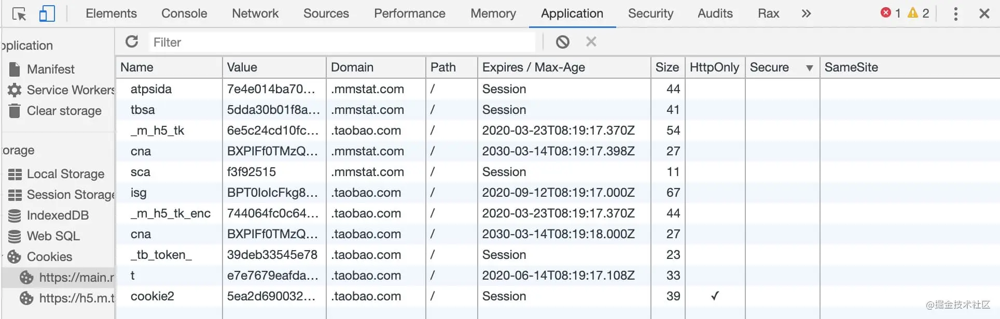

#### name和value

Name和Value是一个键值对。Name是Cookie的名称，**Cookie一旦创建，名称便不可更改**，一般名称不区分大小写；Value是该名称对应的Cookie的值，如果值为Unicode字符，需要为字符编码。如果值为二进制数据，则需要使用BASE64编码。

#### Domain

**Domain决定Cookie在哪个域是有效的**，也就是决定在向该域发送请求时是否携带此Cookie，Domain的设置是对子域生效的，如Doamin设置为 .a.com,则b.a.com和c.a.com均可使用该Cookie，但如果设置为b.a.com,则c.a.com不可使用该Cookie。Domain参数必须以点(".")开始。

#### Path

**Path是Cookie的有效路径**，和Domain类似，也对子路径生效，如Cookie1和Cookie2的Domain均为a.com，但Path不同，Cookie1的Path为 /b/,而Cookie的Path为 /b/c/,则在a.com/b页面时只可以访问Cookie1，在a.com/b/c页面时，可访问Cookie1和Cookie2。Path属性需要使用符号“/”结尾。

#### Expires

**Expires 用于设置 Cookie 的过期时间**。比如：

```
Set-Cookie: id=a3fWa; Expires=Wed, 21 Oct 2015 07:28:00 GMT;
```

当 Expires 属性缺省时，表示是会话性 Cookie，像上图 Expires 的值为 Session，表示的就是会话性 Cookie。当为会话性 Cookie 的时候，值保存在客户端内存中，并在用户关闭浏览器时失效。需要注意的是，有些浏览器提供了会话恢复功能，这种情况下即使关闭了浏览器，会话期 Cookie 也会被保留下来，就好像浏览器从来没有关闭一样。

#### Max-Age

Max-Age 用于设置在 Cookie 失效之前需要经过的秒数。比如：

```
Set-Cookie: id=a3fWa; Max-Age=604800;
```

Max-Age 可以为正数、负数、甚至是 0。

如果 max-Age 属性为正数时，浏览器会将其持久化，即写到对应的 Cookie 文件中。

当 max-Age 属性为负数，则表示该 Cookie 只是一个会话性 Cookie。

当 max-Age 为 0 时，则会立即删除这个 Cookie。

假如 Expires 和 Max-Age 都存在，Max-Age 优先级更高。

#### size

Szie是此Cookie的大小。在所有浏览器中，任何cookie大小超过限制都被忽略，且永远不会被设置。各个浏览器对Cookie的最大值和最大数目有不同的限制。

#### HttpOnly

HttpOnly值为 true 或 false,若设置为true，则不允许通过脚本document.cookie去更改这个值，同样这个值在document.cookie中也不可见，但在发送请求时依旧会携带此Cookie。

#### Secure

Secure为Cookie的安全属性，若设置为true，则浏览器只会在HTTPS和SSL等安全协议中传输此Cookie，不会在不安全的HTTP协议中传输此Cookie。

#### SameSite

SameSite用来限制第三方 Cookie，从而减少安全风险。它有3个属性，分别是：

- Strict

Scrict最为严格，完全禁止第三方Cookie，跨站点时，任何情况下都不会发送Cookie

- Lax

Lax规则稍稍放宽，大多数情况也是不发送第三方 Cookie，但是导航到目标网址的 Get 请求除外。

- None

网站可以选择显式关闭SameSite属性，将其设为None。不过，前提是必须同时设置Secure属性（Cookie 只能通过 HTTPS 协议发送），否则无效。

另外：关闭SameSite的方法

操作方法谷歌浏览器地址栏输入：chrome://flags/ 找到：SameSite by default cookies、Cookies without SameSite must be secure设置上面这两项设置成 Disable

#### Priority

优先级，chrome的提案，定义了三种优先级，Low/Medium/High，当cookie数量超出时，低优先级的cookie会被优先清除。

### 7.什么是 promise/A+ 规范

它是一个 JavaScript Promises 标准——由开发者制定，供开发者参考实现 Promises。

**规范规定**

- 用 fulfilled 表示解决/兑现: 指一个 promise 成功地从 “待定” 状态进入 “兑现” 状态。虽然规范中使用 fulfill 来表示解决，但一般多以 resolve 来指代。
- 拒绝（reject）：指一个 promise 成功地从 “待定” 状态进入 “拒绝” 状态。
- 终值（eventual value）：指一个 promise 解决时传递给解决回调的值，由于 promise 有一次性的特征，因此当这个值被传递时，标志着 promise 等待态的结束，故称之终值，有时也直接简称为值（value）。
- 拒因（reason）：指一个 promise 拒绝时传递给拒绝回调的值（原因），

### 8.你的promise是怎么写的(他应该是想问你的promise是怎么用的，我当时理解错了，把[源码](https://www.nowcoder.com/jump/super-jump/word?word=源码)说了一遍)

### 9.then的返回值

### 10.nginx反向代理怎么弄

### 11.http的方法

### 12.option是干什么的

## 一面

### 1.讲一下 TypeScript 泛型

它允许在程序中定义形式类型参数，然后在泛型实例化时使用实际类型参数来替换形式类型参数；概念我不会背，我直接说一下它的一个常规的使用场景，当我们想要定义一个函数参数和返回值类型一致，而又不想写死的时候，这个时候就需要使用泛型了，**因为它能够捕获传入参数的类型，又能够使用捕获的传入参数的参数类型作为函数返回值的类型。**

### 2.块级和行内块的区别

它们都可以设置宽高，然后块级独占一行，行内块元素可以多个存在一行显示

### 3.讲一下盒子模型；box-sizing 有哪些属性有什么用？

盒子模型一般就分标准的盒子模型和 IE 盒子模型：

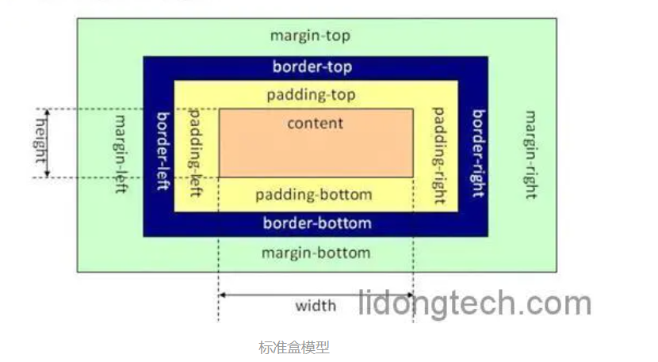

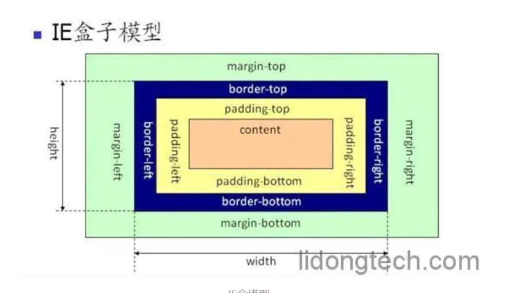

由内到外分别是 content padding border margin 然后 标准的 height 和 width 指的是 content 部分，而 IE 的话还会包含 padding 和 border

box-sizing 有三个属性：content-box丨border-box丨inherit 分别对应标准的盒子模型、IE 盒子模型，还要继承父类的 box-sizing 属性。

### 4.position 有哪些属性有什么作用?

CSS中Position属性有五个可选值，它们分别是：static、absolute、fixed、relative、inherit

static：表示无定位，这是所有元素定位的默认值；一般情况下，我们不需要特别的去声明它，但有时候遇到继承的情况，我们不愿意见到元素所继承的属性影响本身，从而可以用position:static取消继承，即还原元素定位的默认值。

absolute：表示生成绝对定位元素，相对于 static 定位以外的第一个父元素进行定位

fixed：生成绝对定位的元素，相对于浏览器窗口进行定位

relative：生成相对定位元素，相对于其正常位置进行定位

# 汇量科技

## 一面

### 手写快排

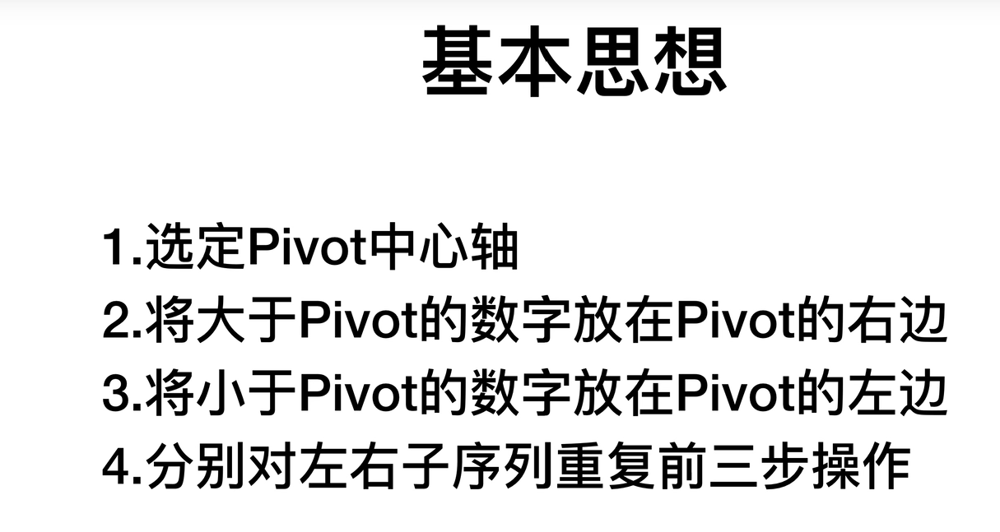

```js
    <script>
        // 快速排序

        function quickSort( arr ) {

            // base case 
            if ( arr.length <= 1 ) return arr;
            
            // 取基准索引
            let pivotIndex = Math.floor( arr.length / 2 )

            // splice 方法会改变原数组，将位置为 pivotIndex 的元素删除
            // 取基准值并改变原数组
            let pivot = arr.splice(pivotIndex, 1)[0];

            let leftArr = []
            let rightArr = []

            for ( let i = 0; i < arr.length; i++ ) {
                if( arr[i] < pivot ) {
                    leftArr.push( arr[i] )
                } else {
                    rightArr.push( arr[i] )
                }
            }
			
            // 左边快排结果加右边快排结果和基准值就是答案
            return quickSort(leftArr).concat( [ pivot ], quickSort(rightArr) )
        }

        let arr = [ 8, 6, 7, 1 , 2, 3 ]
        let ans = quickSort(arr)
        console.log(ans);
        
    </script>
```

### 数组去重

## 二面

### 简述浏览器渲染机制

#### 一 ： 为什么要了解浏览器渲染页面的机制，主要还是性能的优化。

- 了解浏览器如何进行加载，我们可以在引用外部样式文件，外部JS时，将它们放到合适的位置，是浏览器以最快的速度，将文件加载完毕。
- 了解浏览器如何进行解析，我们可以在构建DOM结构，组织CSS选择器的时候，选择最优的写法，提高浏览器的解析速率。
- 了解浏览器如何进行渲染，明白渲染的过程，我们在设置元素属性，编写JS文件时，可以减少“重绘”，“重新布局”的消耗。

------

#### 二 ： 要了解清楚渲染机制，要先弄明白几个基本概念：

1. DOM：Document Object Model，浏览器将HTML解析成树形的数据结构，简称DOM。

2. CSSOM：CSS Object Model，浏览器将CSS解析成树形的数据结构，简称CSSOM。

3. Render Tree: DOM和CSSOM合并后生成Render Tree，如下图：

   

   image.png

4. Layout: 计算出Render Tree每个节点的具体位置。

5. Painting：通过显卡，将Layout后的节点内容分别呈现到屏幕上。

------

#### 三 ： 需要注意的是(重点)：

- 当我们浏览器获得HTML文件后，会自上而下的加载，并在加载过程中进行解析和渲染。
- 加载说的就是获取资源文件的过程，如果在加载过程中遇到外部CSS文件和图片，浏览器会另外发送一个请求，去获取CSS文件和相应的图片，这个请求是异步的，并不会影响HTML文件的加载。
- 但是如果遇到Javascript文件，HTML文件会挂起渲染的进程，等待JavaScript文件加载完毕后，再继续进行渲染。
   为什么HTML需要等待JavaScript呢？因为JavaScript可能会修改DOM，导致后续HTML资源白白加载，所以HTML必须等待JavaScript文件加载完毕后，再继续渲染，这也就是为什么JavaScript文件在写在底部body标签前的原因。

------

#### 四 ： 浏览器渲染的整个流程


image.png


浏览器整个流程如上图所示：

1. 当用户输入一个URL时，浏览器就会向服务器发出一个请求，请求URL对应的资源
2. 接受到服务器的响应内容后，浏览器的HTML解析器，会将HTML文件解析成一棵DOM树，DOM树的构建是一个深度遍历的过程，当前节点的所有子节点都构建完成以后，才会去构建当前节点的下一个兄弟节点。
3. 将CSS解析成CSSOM树（CSS Rule Tree）
4. 根据DOM树和CSSOM树，来构建Render Tree（渲染树）,注意渲染树，并不等于DOM树，因为一些像head或display:none的东西，就没有必要放在渲染树中了。
5. 有了Render Tree，浏览器已经能知道网页中有哪些节点，各个节点的CSS定义，以及它们的从属关系，下一步操作就是Layout,顾名思义，就是计算出每个节点在屏幕中的位置。
6. Layout后，浏览器已经知道哪些节点要显示，每个节点的CSS属性是什么，每个节点在屏幕中的位置是哪里，就进入了最后一步painting,按照算出来的规则，通过显卡，把内容画到屏幕上。

#### 这里还要说两个概念，一个是Reflow，另一个是Repaint。这两个不是一回事。

- Repaint ——改变某个元素的背景色、文字颜色、边框颜色等等不影响它周围或内部布局的属性时，屏幕的一部分要重画，但是元素的几何尺寸没有变。
- Reflow ——元件的几何尺寸变了，我们需要重新验证并计算Render Tree。是Render Tree的一部分或全部发生了变化。
- reflow 几乎是无法避免的。现在界面上流行的一些效果，比如树状目录的折叠、展开（实质上是元素的显 示与隐藏）等，都将引起浏览器的 reflow。鼠标滑过、点击……只要这些行为引起了页面上某些元素的占位面积、定位方式、边距等属性的变化，都会引起它内部、周围甚至整个页面的重新渲 染。通常我们都无法预估浏览器到底会 reflow 哪一部分的代码，它们都彼此相互影响着。
   注：display:none会触发reflow，而visibility:hidden只会触发repaint，因为没有发现位置变化。

------

#### 五 : DOM和CSSOM的具体构建流程：

DOM 和 CSSOM 都是以" Bytes → characters → tokens → nodes → object model. " 这样的方式生成最终的数据。如下图所示：


image.png


具体到DOM树的构建，如下图：


image.png


 1、  当服务器返回一个HTML文件给浏览器的时候，浏览器接受到的是一些字节数据。

2、  然后浏览器根据HTTP响应中的编码方式（通过是UTF8），解析字节数据，得到一些字符。如果这个时候编码方式跟文件的字节编码不一致，便会出现乱码。所以我们通过使用<meta http-equiv="content-type"content="text/html;charset=utf-8">来告诉浏览器我们页面使用的是什么编码。

3、  这个时候，浏览器再根据DTD中的对元素（标签）的定义，对这些接受到的字符进行语义化(token)。我们经常在html文件的第一行，定义<!DOCTYPE HTML PUBLIC "-//W3C//DTD HTML 4.01Transitional//EN" "http://www.w3.org/TR/html4/loose.dtd">，这个DTD就是告诉浏览器，那些字符是有意义的，那些字符是无意义的。DTD常见的有严格、过渡、框架和HTML5三种。不同的DTD中，有不同的元素定义。比如过渡的DTD中就比严格的DTD中多出了<center>、<font>等等一些元素的定义，也就是说使用严格的DTD，即使你在你的HTML文件中使用了<center>，浏览器也会忽略掉的。所以也就有了一些人使用不同的DTD或者不使用DTD的时候，布局会明显不同的原因了。

4、  接着，浏览器再使用这些语义块(token)创建对象，形成一个个节点了。

5、  然后HTML解析器就会从HTML文件的头部到尾部，一个个地遍历这些节点。当这些节点是普通节点的话，HTML解析器就会将这些节点加入到DOM树中。当这些节点是JS代码的话，HTML解析器就会将控制权交给JS解析器。如果这些节点是CSS代码的话，HTML解析器就会将控制权交给CSS解析器。不过，当外联的JS代码和CSS代码还没从服务器传到浏览器的时候，这个时候如果DOM树上有可视元素的话，浏览器通常会选择在这个时候，将一些内容提前渲染到屏幕上来。

6、  当HTML解析器读到最后一个节点的时候，整个DOM树也构建完成了，这个时候就会触发domContentloaded事件。而很多JS库（像JQ）通常会在这个时候有所反应的。

至此，DOM树就全部构建完成了。

#### 总结

浏览器对 HTML 的解析是自上而下的，如果遇到图片、css 会另外发送请求，这个请求是异步的不会影响 HTML 的渲染，但是它如果遇到的是 js 文件会挂起 HTML 渲染进程，因为 js 代码可能会有一些节点操作，这样不会白白浪费 HTML 的渲染资源；（HTML 解析阶段）

HTML 解析完之后就生成了 DOM 树， CSS 解析器也会开始解析 CSS 会生成 CSSOM 树，然后两棵树结合生成 渲染树，然后根据渲染树各个节点 CSS 的定义确定节点在页面的位置（layout阶段），然后就开始渲染页面（painting阶段）。

### Node.js 和 JS 的区别

Node.js 是一个运行平台，而 JS 是一门脚本语言，Node 让 js 可以运行在服务端。

我觉得简单来说就是 node.js 是一个浏览器的解释器封装起来作为服务器的运行平台，它让 js 可以在服务端运行

### 前端性能优化

#### 减少 HTTP 请求

#### 使用服务端渲染

#### 静态资源使用 CDN

```
CDN 原理
当用户访问一个网站时，如果没有 CDN，过程是这样的：

浏览器要将域名解析为 IP 地址，所以需要向本地 DNS 发出请求。
本地 DNS 依次向根服务器、顶级域名服务器、权限服务器发出请求，得到网站服务器的 IP 地址。
本地 DNS 将 IP 地址发回给浏览器，浏览器向网站服务器 IP 地址发出请求并得到资源。

简单一句话：将域名解析为 IP 地址，向 IP 地址对应的服务器发送请求

如果用户访问的网站部署了 CDN，过程是这样的：

浏览器要将域名解析为 IP 地址，所以需要向本地 DNS 发出请求。
本地 DNS 依次向根服务器、顶级域名服务器、权限服务器发出请求，得到全局负载均衡系统（GSLB）的 IP 地址。
本地 DNS 再向 GSLB 发出请求，GSLB 的主要功能是根据本地 DNS 的 IP 地址判断用户的位置，筛选出距离用户较近的本地负载均衡系统（SLB），并将该 SLB 的 IP 地址作为结果返回给本地 DNS。
本地 DNS 将 SLB 的 IP 地址发回给浏览器，浏览器向 SLB 发出请求。
SLB 根据浏览器请求的资源和地址，选出最优的缓存服务器发回给浏览器。
浏览器再根据 SLB 发回的地址重定向到缓存服务器。
如果缓存服务器有浏览器需要的资源，就将资源发回给浏览器。如果没有，就向源服务器请求资源，再发给浏览器并缓存在本地。

简单一句话：将域名解析为 IP 地址得到全局负载均衡系统地址，当我们向它发起请求的时候，它会筛选出距离用户较近的本地负载均衡系统，并将它的 IP 地址作为结果返回，然后向它发请求就会选出最优的缓存服务器发给浏览器，浏览器向该服务器发送请求，如果缓存服务器有浏览器需要的资源，就将资源发回给浏览器。如果没有，就向源服务器请求资源，再发给浏览器并缓存在本地。
```

#### 将 CSS 放在文件头部， JavaScript 文件放在底部

```
CSS 执行会阻塞渲染，阻止 JS 执行
JS 加载和执行会阻塞 HTML 解析，阻止 CSSOM 构建
如果这些 CSS、JS 标签放在 HEAD 标签里，并且需要加载和解析很久的话，那么页面就空白了。所以 JS 文件要放在底部（不阻止 DOM 解析，但会阻塞渲染），等 HTML 解析完了再加载 JS 文件，尽早向用户呈现页面的内容。

那为什么 CSS 文件还要放在头部呢？

因为先加载 HTML 再加载 CSS，会让用户第一时间看到的页面是没有样式的、“丑陋”的，为了避免这种情况发生，就要将 CSS 文件放在头部了。

另外，JS 文件也不是不可以放在头部，只要给 script 标签加上 defer 属性就可以了，异步下载，延迟执行。
```

#### 使用字体图片 iconfont 代替图片图标

```
字体图标就是将图标制作成一个字体，使用时就跟字体一样，可以设置属性，例如 font-size、color 等等，非常方便。并且字体图标是矢量图，不会失真。还有一个优点是生成的文件特别小。
```

#### 开启缓存

#### 压缩文件大小（Gzip 压缩）

```
在 webpack 可以使用如下插件进行压缩：

JavaScript：UglifyPlugin
CSS ：MiniCssExtractPlugin
HTML：HtmlWebpackPlugin
其实，我们还可以做得更好。那就是使用 gzip 压缩。可以通过向 HTTP 请求头中的 Accept-Encoding 头添加 gzip 标识来开启这一功能。当然，服务器也得支持这一功能。
```

#### 图片延迟加载

在页面中，先不给图片设置路径，只有当图片出现在浏览器的可视区域时，才去加载真正的图片，这就是延迟加载。对于图片很多的网站来说，一次性加载全部图片，会对用户体验造成很大的影响，所以需要使用图片延迟加载。

首先可以将图片这样设置，在页面不可见时图片不会加载：

```html

```

等页面可见时，使用 JS 加载图片：

```js
const img = document.querySelector('img')
img.src = img.dataset.src
```

这样图片就加载出来了，完整的代码可以看一下参考资料。

也可以利用插件取实现效果

### vue有什么特色

```
1.遵循MVVM模式

可以实现响应式的数据绑定和可组合的视图。
MVVM是Model-View-ViewModel的简写，model 和 view 就是数据和视图 UI 分开，而 viewmodel 描述的就是它可以通过视图去改变数据，数据的改变去渲染视图。

2.指令化

vue中的指令包括内置指令和自定义指令，其中指令一般以“v-”开头，作用于HTML元素，vue中可以将指令绑定在元素上，如v-bind动态绑定指令、v-if 条件渲染指令、v- for列表渲染指令等。

3.插件化

vue中可以使用插件对功能进行扩展，其中通过MyPlugin.install编写插件后，即可全局使用，常用的扩展插件有vue-router、Vuex 等。

4.组件化
```

## 本人实习技术面

### 非父子通信

利用全局事件总线

~~~js
1. 一种组件间通信的方式，适用于任意组件间通信。

2. 安装全局事件总线：

   ```js
   new Vue({
   	......
   	beforeCreate() {
   		Vue.prototype.$bus = this //安装全局事件总线，$bus就是当前应用的vm
   	},
       ......
   }) 
   ```

3. 使用事件总线：

   1. 接收数据：A组件想接收数据，则在A组件中给$bus绑定自定义事件，事件的回调留在A组件自身。

      ```js
      methods(){
        demo(data){......}
      }
      ......
      mounted() {
        this.$bus.$on('xxxx',this.demo)
      }
      ```

   2. 提供数据的组件提供数据调用：```this.$bus.$emit('xxxx',数据)```

4. 最好在beforeDestroy钩子中，用$off去解绑当前组件所用到的事件。
5. 本质就是将自定义事件定义在 vm 实例上, 接受数据的一方去绑定事件，将回调留在自身，发送数据的一方去触发事件，将数据作为参数传出。
~~~

### HTTP 请求/响应头

### 从数组取几个随机元素

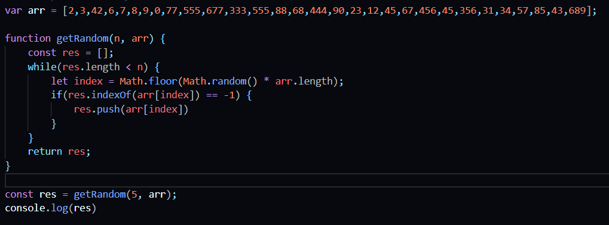

### 递归遍历

```html
    <script>
        let VNode = {
            value: 'A',
            child: [
                {
                    value: 'B',
                    child: [
                        {
                            value: 'E',
                            child: []
                        },
                        {
                            value: 'F',
                            child: []
                        }
                    ]
                },
                {
                    value: 'C',
                    child: []
                },
                {
                    value: 'D',
                    child: []
                }
            ]
        }

        function getArr( VNode, newArr ) {
            

            if ( VNode === null ) return;

            newArr.push( VNode.value )

            for( let i = 0; i < VNode.child.length; i++ ) {
                getArr( VNode.child[i], newArr)
            } 
            
            return newArr
        }

        console.log(getArr( VNode, [] ));
    </script>
```

### 独立像素比

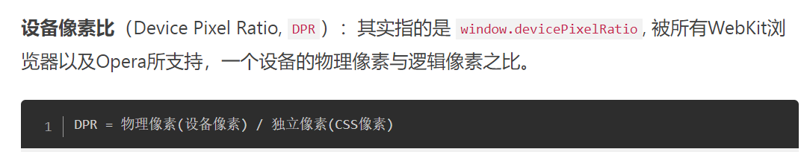

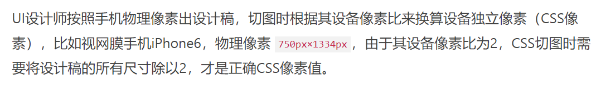

个人理解：就是说设备实际像素如果是 750px 设备像素比如果是 2 那么 css 里的 1px 相当于在设备上显示 2px，所以设计图给的如果是 750px 的设计图，我们在 css 里应该在这个设计图的基础上除2 

# 个人简历

## H5 

语义化标签...、音频视频标签（audios、video）....、本地存储...等等

## CSS3

例如新增的选择器：nth-child、fist-child等等；

新增的属性：

- 文本的像 text-shadow、text-overflow 这些

- 颜色样式：opacity

- 边框的样式 border-radius

- 背景样式：背景大小 background-size

  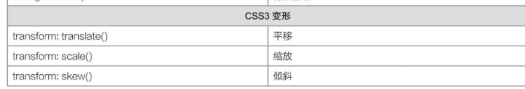

  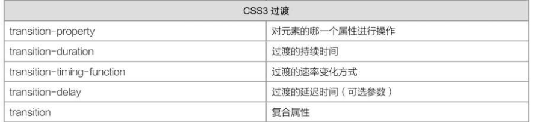

  在 vue 中使用过渡

  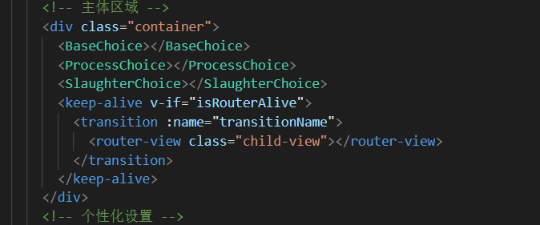

  transitionName：是.slide-left 或 right

  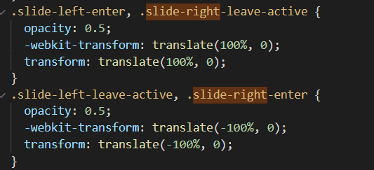

  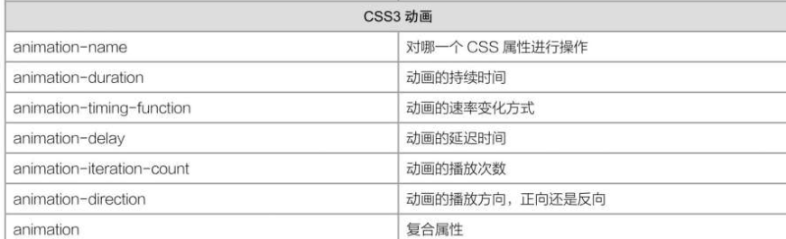

  还有 flex 盒子模型

## Nginx

### gzip 压缩

在 nginx 里配置响应头 Accept-Encoding gzip

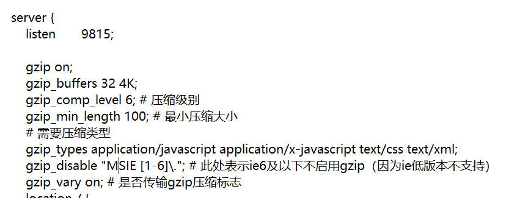

### HTTP 缓存

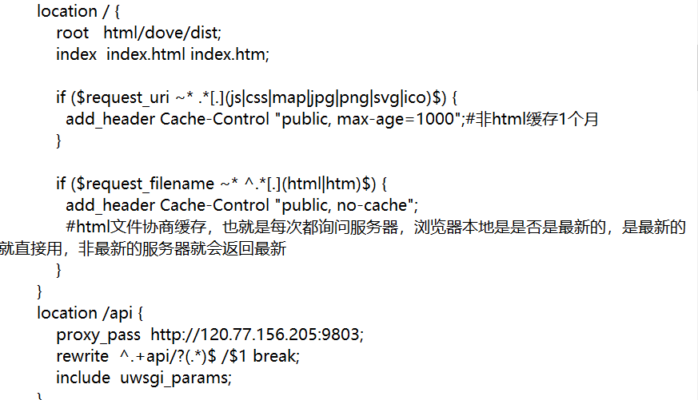

tips：public 指可向任一方提供响应的缓存

（1）已存在缓存数据时（**强制缓存情况**)，请求数据的流程如下所示：

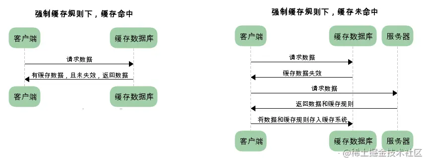

（2）已存在缓存数据时（**对比缓存情况**），请求数据的流程如下所示：

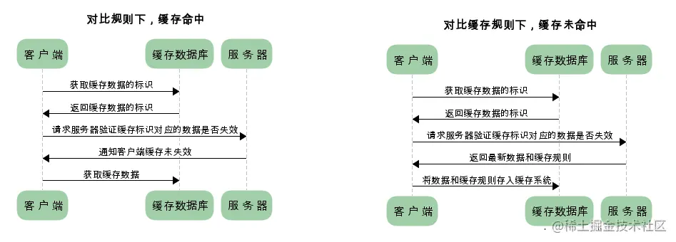

总结：强制缓存，如果数据没失效不会向服务器发请求，直接走缓存，而相对缓存不管如何都会咨询服务器数据是否失效，如果没失效就走缓存，如果失效就从服务器拿数据再将数据存入本地缓存。

### 反向代理

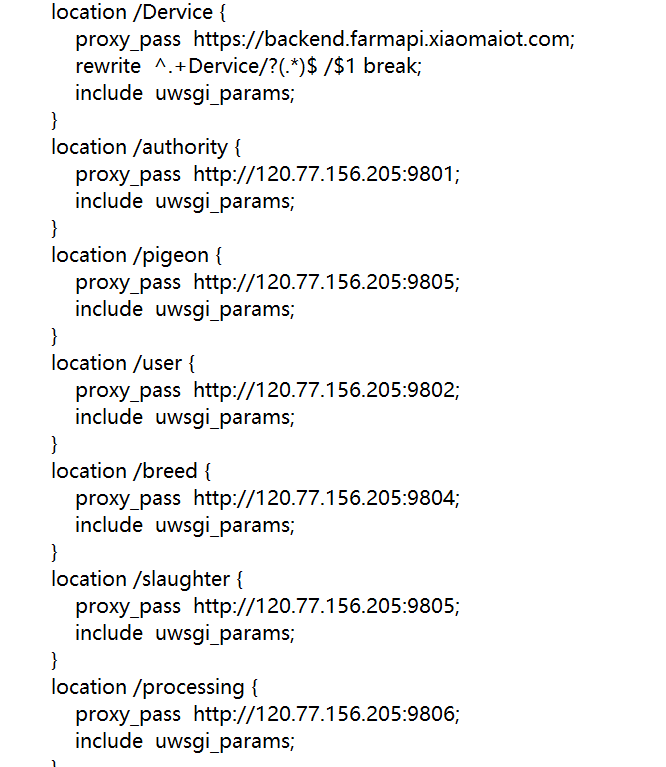

### 负载均衡

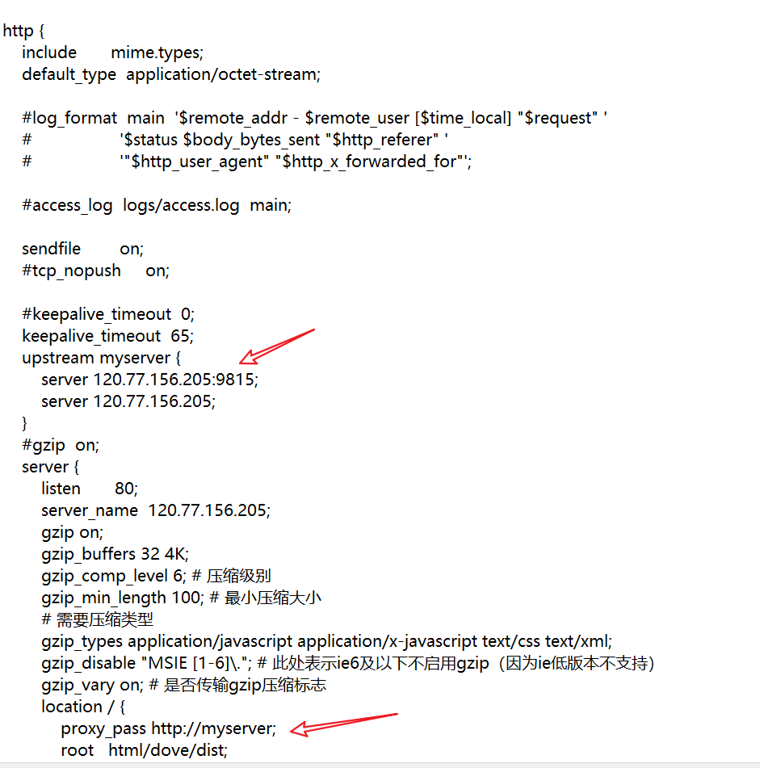

## PC 端响应式适配

```
    // 获取设备的宽度动态改变根节点 font-size
    var getPxSize = () => {
        // 浏览器文档显示区域的的宽度
        let currentWidth = document.documentElement.clientWidth;
        console.log(currentWidth);
        let pxSize = ( 16 * ( currentWidth/1920 ) > 32? 32 + "px" : ( 16 * ( currentWidth/1920 ) + "px") );
        document.documentElement.style.fontSize = pxSize;
    }

    // 窗口加载、缩小扩展时触发
    window.addEventListener( "load", getPxSize )
    window.addEventListener( "resize", getPxSize )
```

总结：获取文档显示区域宽度，再配合窗口加载、缩放事件，调整根节点 font-size 大小，

## 移动端响应式适配

- 利用 flex 布局
- 结合 vw 和 vh 单位：它是相对单位，总是相对于视口来说的，1 vw 就是当前视口的 1/100
  - 注意：百分比是相对于父元素和 vw 和 vh 单位是相对于视口
- 或者是利用 flex 布局结合媒体查询和 rem

## Webpack

### HMR 

```
/*
  HMR: hot module replacement 热模块替换 / 模块热替换
    作用：一个模块发生变化，只会重新打包这一个模块（而不是重新打包所有模块，假如说你改变了一个模块但是相关的其他模块没有变动却要重新打包，这样效率是非常低的） 
      极大提升构建速度
      
      样式文件：可以使用HMR功能：因为style-loader内部实现了~
      js文件：默认不能使用HMR功能 --> 需要修改js代码，添加支持HMR功能的代码
        注意：HMR功能对js的处理，只能处理非入口js文件的其他文件（修改入口文件还是会引起所有的东西重新打包）。
      html文件: 默认不能使用HMR功能.同时会导致问题：html文件不能热更新了~ （不用做HMR功能）
        解决：修改entry入口，将html文件引入
*/
```

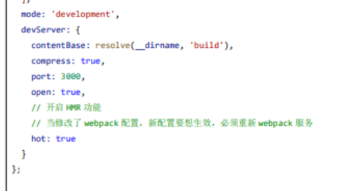

### 多进程打包

tips：当代码量比较大的时候才有必要启动多进程打包去提升构建速度（比如你做鸽子项目的时候应该就有感觉到run start 的时候打包很慢，你去开启多进程打包可能会有妙用），而当代码里比较少的时候去打开多进程打包是得不偿失的，因为打开多进程是需要消耗一定的时间的

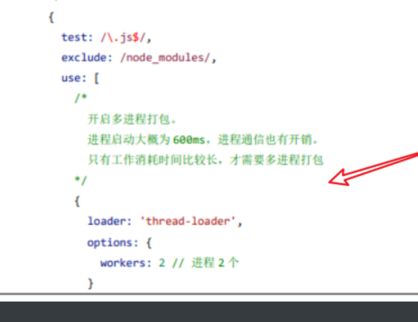

### CSS 提取

tips：如果放在 js 里面，一呢 chunk 变得很大，加载变慢， 还要先加载 js 再动态的创建 style 标签，样式渲染速度慢，这样很容易出现闪屏现象。提取单独文件，用 link 加载

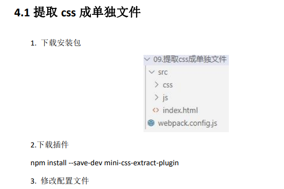

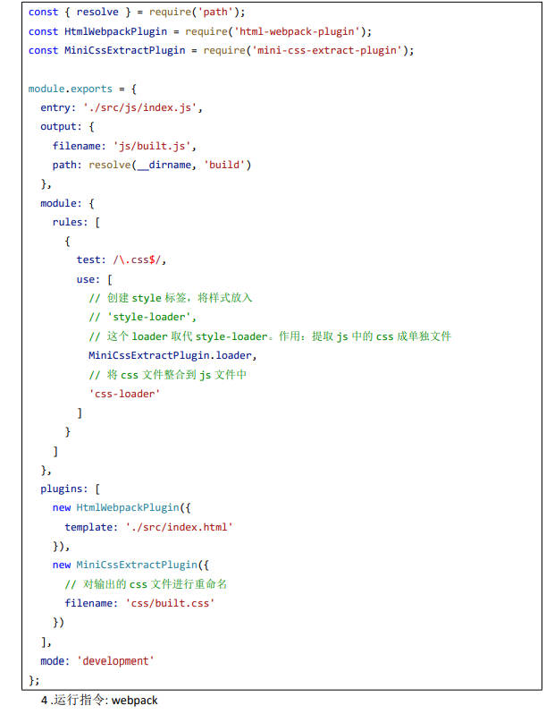

### external

tips: 配置 externals 可以避免一些比较大的库被打包进来，像 jq、react 这些，我们可以通过 cdn 进行引入。

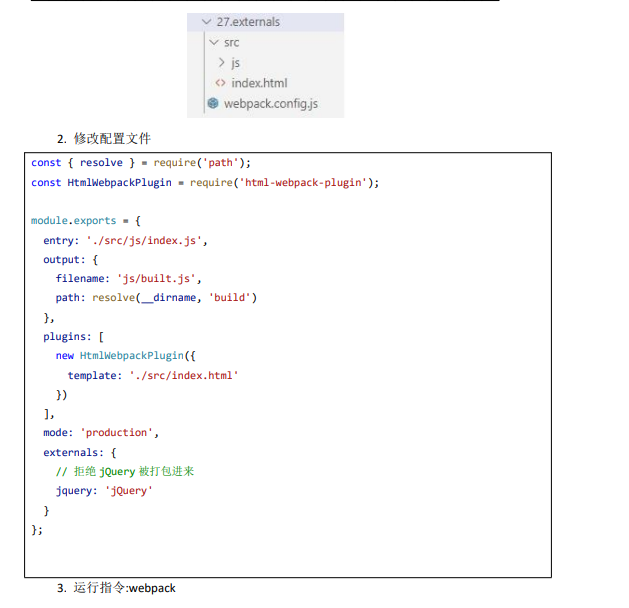

### 预渲染

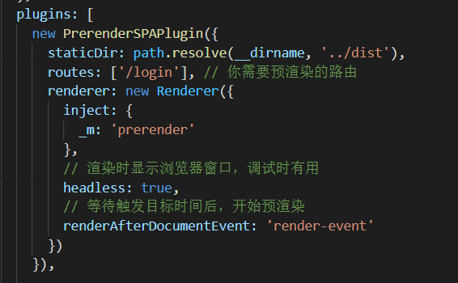

在构建时 (`build time`) 简单地生成针对特定路由的静态` HTML` 文件（ 即在npm run build 的时候将对应路由的文件的 HTML 保存下来 ）。当用户请求对应的路由时直接返回对应 HTML 文件，减少了浏览器解析 js 文件动态渲染 HTML 的时间

插件原理：模拟浏览器访问路由，然后把`JS`生成的`DOM`结构以`HTML`静态文件的形式再保存下来。

## 前端权限管理

- 对菜单的控制：配合后端返回的权限数据，动态渲染菜单
- 对界面的控制：加入路由导航守卫；配置后端返回的权限数据，动态渲染路由

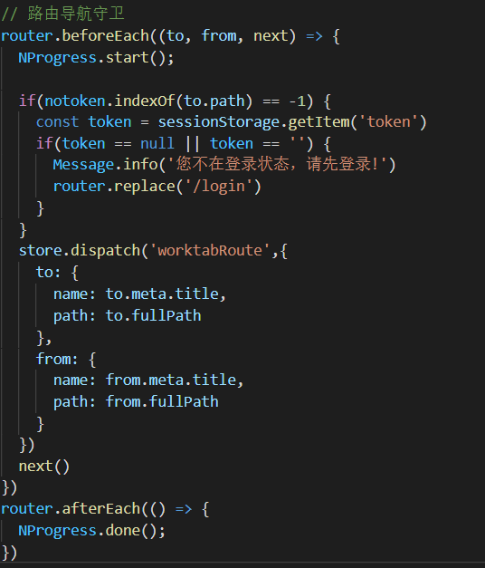

- 对按钮的控制


# CVTE

## 笔试

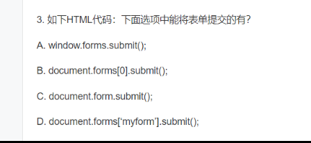

tips： B D

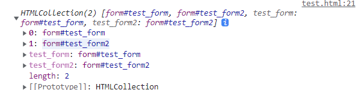

若定义两个表单 id 分别为 test_form、test_form2,打印出来是这样，它会有两个两属性名存放这个表单，一个是 0，一个是 id

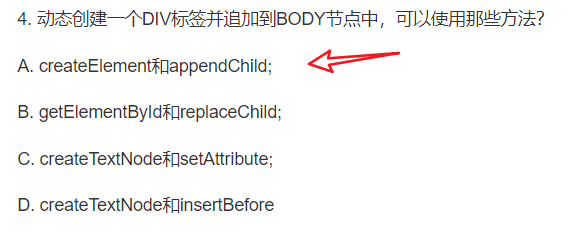

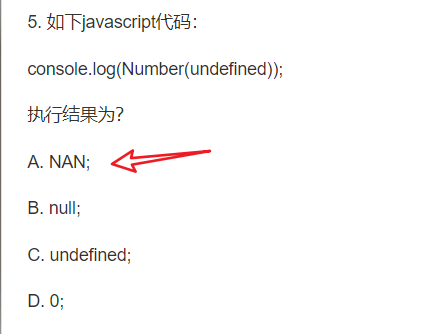

tips：Number(null) = 0 Nubmer(‘a’) = undefined Number("666") = 666

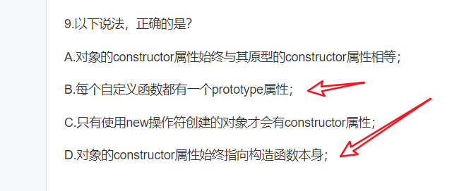

tips：类中的 constructor 本质是就我们定义的一个构造函数，而外层的方法就是我们定义的原型方法，加上 statci 就是我们平时挂载在构造函数上的方法

```js
class A {
    constructor() {
        this.a = 123
    }
    a() {
        console.log(this.a);
    }
    static b() {
        console.log(this);
    }
}

function A() {
	this.a = 123
}
function.protatype = function a() {
	console.log(this.a);
}
A.b = function () {
    console.log(this)
}
```

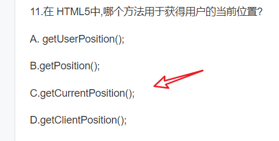

```
console.log(window.navigator.geolocation.getCurrentPosition(function(p) {
            console.log(p)
}));
```

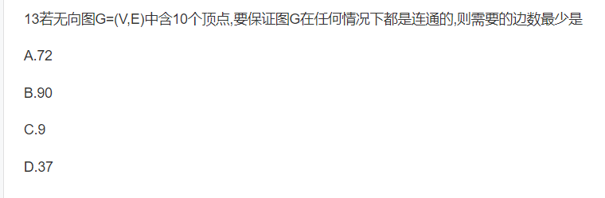

tips: 注意是任何情况，先保证 9 个顶点可以互相连同就是 9 * 8 / 2 = 36 个点，剩下一个点只需要再添加一条边就好了

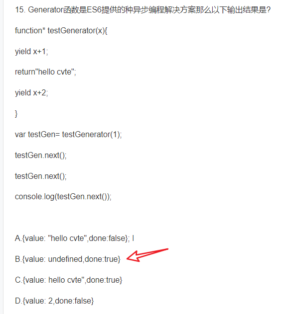

tips：只要 return 了那么后面返回的都是 undefined

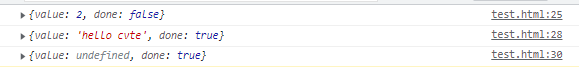

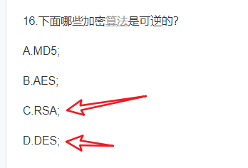

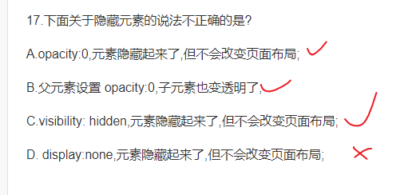

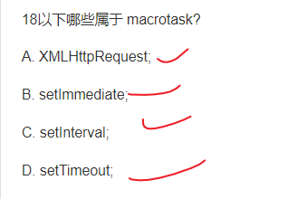

tips：记住 I/O 都是宏任务

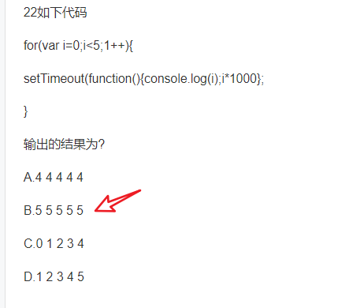

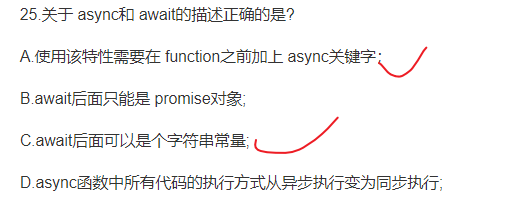

tips：不是所有代码，是有 await 的

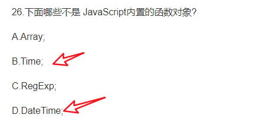

tips：是 Date 不是 DateTime

# 字节跳动

## 一面

### 为什么学前端？

我主要是受到一个师兄的影响，我记得我大一的时候的目标就是毕业能找到一份不错的工作，没想过也不敢想说去进字节这种大厂，后面我认识了一个在腾讯实习的师兄，他也是走前端路线的，然后刚好他们实验室在招新，有几个方向可以选择，在对前端做了一些了解后，我感觉这是比较适合我的路线，我喜欢这种做出来看得到的开发体验，每做出一个项目也可以很直观的向朋友和家人分享我的喜悦，我感觉很有成就感。

### 怎么学的

网课、看书、文档、博客冲浪

### 实现水平垂直居中的方法

tips: absolute 是相对浏览器的，relative 是相对盒子自身的

```html
    <div class="father">
        <div class="children"></div>
    </div>
```

- 弹性布局方式：display：flex，align-items：center，justify-content：center
- 拉扯法+margin：auto

```css
    .father {
        position: relative;
        height: 100px;
        width: 100px;
        background-color: aqua;
    }
    .children {
        position: absolute;
        height: 50px;
        width: 50px;
        background-color: black;
        top: 0;
        left: 0;
        right: 0;
        bottom: 0;
        margin: auto;
    }
```

- 位偏移

```css
    .father {
        position: relative;
        height: 100px;
        width: 100px;
        background-color: aqua;
    }
    .children {
        position: absolute;
        height: 50px;
        width: 50px;
        background-color: black;
        left: 50%;
        top: 50%;
        transform: translate(-50%, -50%);
        // 或者 margin-top: -25px margin-left:-25px
    }
```

tips: 为什么 magin 可以实现？在文档流中元素的边界由margin决定，margin-top 和 left 元素的自身的一半，就相当于把top 和 letf的边界调整到了中间，top和letf会根据这个边界去确定元素的位置

### 说说 BFC

BFC 即 Block Formatting Contexts (块级格式化上下文) ，具有 BFC 特性的元素可以看作是隔离了的独立容器，容器里面的元素不会在布局上影响到外面的元素，并且 BFC 具有普通容器所没有的一些特性，可以把 BFC 理解为一个封闭的大箱子，箱子内部的元素无论如何翻江倒海，都不会影响到外部。

**触发 BFC 的方法**

```
body 根元素
浮动元素：float 除 none 以外的值
绝对定位元素：position (absolute、fixed)
display 为 inline-block、table-cells、flex
overflow 除了 visible 以外的值 (hidden、auto、scroll)
```

**特性**

- 同一个 BFC 下外边距会发生折叠

```html
<head>
div{
    width: 100px;
    height: 100px;
    background: lightblue;
    margin: 100px;
}
</head>
<body>
    <div></div>
    <div></div>
</body>
```

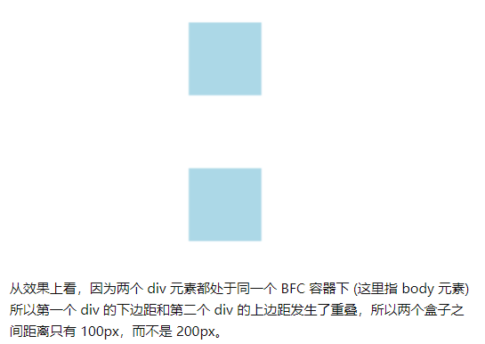

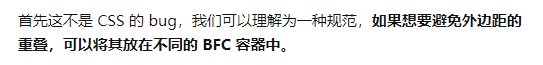

```html
<body>
    <div class="father">
        <div class="brother"></div>
    </div>
    <div class="father">
        <div class="sister"></div>
    </div>
    
</body>
</html>
<style>
    .father {
        overflow: hidden;
    }
    .brother {
        width: 100px;
        height: 100px;
        background-color: black;
        margin-bottom: 50px;
        /* overflow: hidden; */ // 你在这里生成bfc只是内部有一个独立的渲染区域，外部的magin仍然共享
    }
    .sister {
        width: 100px;
        height: 100px;
        background-color: black;
        margin-top: 50px;
        /* overflow: hidden; */
    }
</style>
```


```html
<div class="container">
    <p></p>
</div>
<div class="container">
    <p></p>
</div>
```

```css
.container {
    overflow: hidden;
}
p {
    width: 100px;
    height: 100px;
    background: lightblue;
    margin: 100px;
}
```

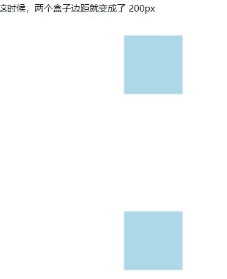

- BFC 可以包含浮动的元素（我们平常清除浮动基本就是利用BFC这个特性）

```html
<div style="border: 1px solid #000;">
    <div style="width: 100px;height: 100px;background: #eee;float: left;"></div>
</div>
```

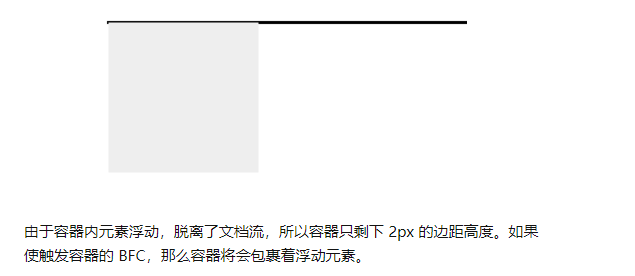

```html
<div style="border: 1px solid #000;overflow: hidden">
    <div style="width: 100px;height: 100px;background: #eee;float: left;"></div>
</div>
```

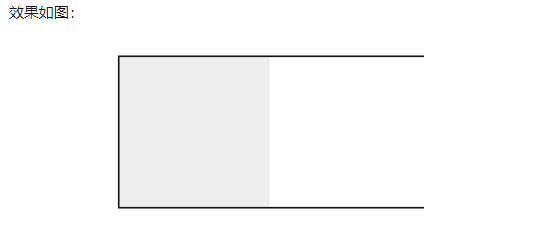

- BFC 可以阻止元素被浮动元素覆盖

```html
<div style="height: 100px;width: 100px;float: left;background: lightblue">我是一个左浮动的元素</div>
<div style="width: 200px; height: 200px;background: #eee">我是一个没有设置浮动, 
也没有触发 BFC 元素, width: 200px; height:200px; background: #eee;</div>
```

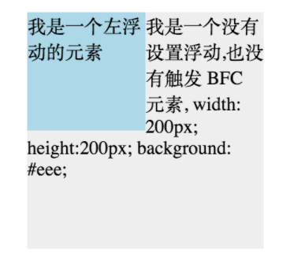

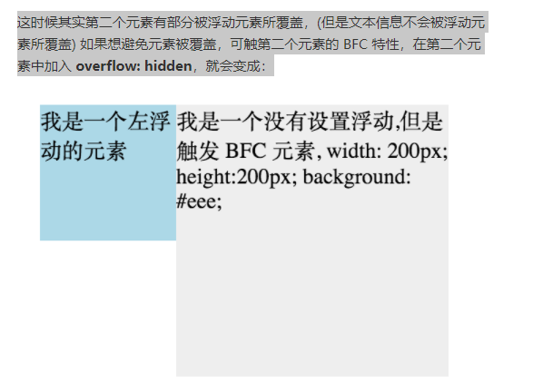

（这个方法可以用来实现两列自适应布局，效果不错，这时候左边的宽度固定，右边的内容自适应宽度(去掉上面右边内容的宽度）

### 说说事件循环 EventLoop

`Event Loop`即事件循环，是指浏览器或`Node`的一种解决`javaScript`单线程运行时不会阻塞的一种机制，也就是我们经常使用**异步**的原理。

它由三个部分组成：调用栈、微任务队列、消息队列

event-loop 遇到函数调用 会压入到调用栈中 被压入的函数当函数返回后会从调用栈中弹出，只有当调用栈执行完之后，才会依次处理微任务队列和消息队列

```js
async function async1() {
  console.log('async1 start'); 
  await async2() // 当 asyn 2 的微任务执行完毕后才后将下面的代码加入微任务，所以它才会是最后执行
  console.log('async end');
}
async function async2() {
  return new Promise((resolve, reject) => {
    console.log('async2 start');
    resolve()
  }).then(res => {
    console.log('async2 end');
  })
}
 
async1()
 
new Promise(resolve => {
  console.log('Promise');
  resolve()
}).then(res => {
  console.log('Promise end');
})
 
console.log('script end');
```

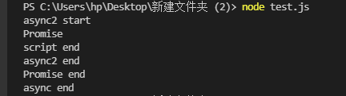

### 说下原型链

在正常创建的对象身上都有一个protatype 属性，它是存在于对象中的一个内部链接，它会引用其他对象。这个链接的作用是：如果在对象上没有找到需要的属性或者方法引用，引擎就会继续在[[Prototype]]关联的对象上进行查找。同理，如果在后者中也没有找到需要的引用就会继续查找它的[[Prototype]]，以此类推。这一系列对象的链接被称为“原型链”。

instanceof操作符的左操作数是一个普通的对象，右操作数是一个函数。instanceof回答的问题是：在a的整条[[Prototype]]链中是否有指向Foo.prototype的对象？

### 浏览器缓存

浏览器请求时，如果是请求缓存资源，会先判断其是否过期，如果没过去会从缓存读取，如果过期会判断缓存资源是否有 etg 和 lastmodified，如果是有 etg 就将它写在请求头 if-none-match（假如不匹配),如果是有 last-Modifeid就写在 if-modified-since（何时修改），然后web服务器会优先去匹配 etg，做出决策，如果etg相同则返回304如果不同则返回200和新资源

两种缓存规则:

- 对于强制缓存，服务器通知浏览器一个缓存时间，在缓存时间内，下次请求，直接用缓存，不在时间内，执行比较缓存策略。
- 对于比较缓存，将缓存信息中的Etag和Last-Modified通过请求发送给服务器，由服务器校验，返回304状态码时，浏览器走缓存。

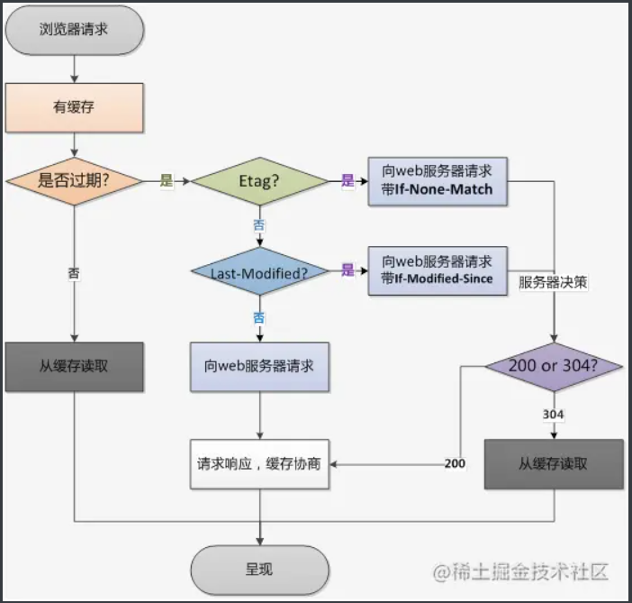

### TCP 是如何保证可靠的传输的

#### TCP 三次握手

客户端向服务端请求，我要建立TCP连接，服户端收到后发送确认报文，客户端收到后连接确立。

三次握手的意义是什么？我觉得可以将 TCP 假设成两次握手来看，假设客户端A发出请求连接报文，这个报文因为各种原因滞留延误到连接释放以后才到达B，本来这是一个早已失效的报文段，但B收到此失效的请求报文段后，就误以为是A又发出了一次新的连接请求。于是就向A发出确认报文段，同意建立连接。由于现在A并没有发出建立连接的请求，因此不会理睬B的确认，也不会向B发送数据。但B却以为新的运输连接已经建立了，并一直等待A发来数据。B的许多资源就这样白白浪费了。

#### TCP 四次挥手

A 告诉 B 我要断开连接了，B回复我已经知道你要断开了，A才可以断开连接，B数据处理完成后告诉A我也要断开连接了，A回复可以后还需要等待一段时间2msl，才可以断开连接

A最后为什么要等待？第一，为了保证A发送的最后一个报文段能够到达B。第二，“已失效的连接请求报文段”出现在后面新的连接中。

我记得它会做数据的校验、超时重传、流量的控制加上可靠的连接建立和连接释放机制，这几种因素确保了它的可靠性，嗯这一块我没有看得那么细

### 冒泡、快速、选择排序

```js
 /**
   * 如何理解冒泡？
   * 每次循环都会确定一个最大值或最小值
   * 这也是为什么每次循环最后一位就不用再去比较它了
   * 时间复杂度是 n ²
 */
function Bubble( array ) {
 	for ( let i = 0; i < array.length - 1; i++ ) {
 	    for( let j = 0; j < array.length - i - 1; j++ ) {
 	        if ( array[j] > array[j+1] ) {
 	            const temp = array[j]
 	            array[j] = array[j+1]
 	            array[j+1] = temp
 	        }
 	    }
 	}
}
```

```js
        /**
         * 快速排序: 取一个基准值，然后数组里比它小的放左边，大的放右边，递归
         * 这个过程即可
         */
        function QuickSort( array ) {
            if ( array.length <= 1 ) return array;
            let pivotPlace = Math.floor( array.length/2 )
            let pivot = array.splice( pivotPlace, 1 )[0]
            let left = []
            let right = []
            for ( let i = 0; i < array.length; i++ ) {
                if ( array[i] > pivot ) right.push( array[i] )
                else left.push(array[i])
            }
            return QuickSort(left).concat( [pivot], QuickSort(right) )
        }
        console.log(QuickSort( array ));
```

```
选择排序思路（了解思想和必须会代码默写）（面试最常考） 原理：首先从原始数组中找到最小的元素，并把该元素放在数组的最前面，然后再从剩下的元素中寻找最小的元素，放在之前最小元素的后面，直到排序完毕。
```

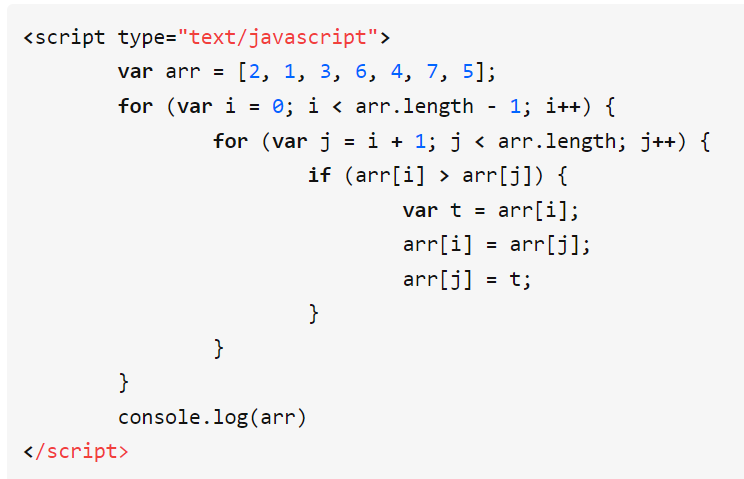

## 一面

### 了解事件流吗

#### 概念

页面触发一个事件时，会按照一定的顺序来响应事件，**事件的响应过程为事件流，事件流有冒泡型事件流（IE提出）和捕获型事件流（网景提出）**

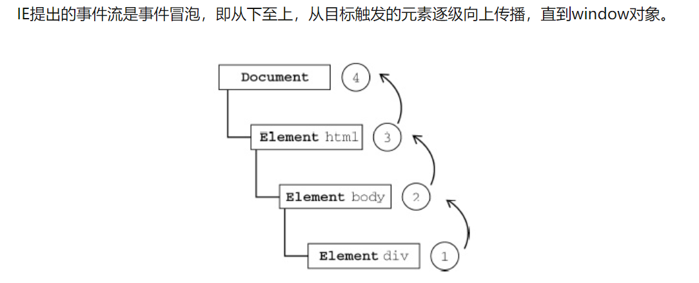


后来ECMAScript在DOM2中对事件流进行了进一步规范，基本上就是上述二者的结合。

DOM2级事件规定的事件流包括三个阶段： （1）事件捕获阶段 （2）处于目标阶段 （3）事件冒泡阶段

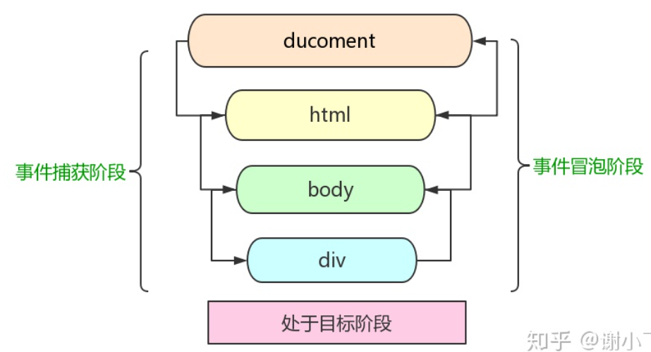

#### Dom0级

**Dom0 级事件处理只有冒泡阶段**

```js
<div id="btn3">
    btn3
    <div id="btn2">
        btn2
        <div id="btn1">
            btn1
        </div>
    </div>
</div>
<script>
    let btn1 = document.getElementById("btn1");
    let btn2 = document.getElementById("btn2");
    let btn3 = document.getElementById("btn3");
    btn1.onclick=function(){
        console.log(1)
    }
    btn2.onclick=function(){
        console.log(2)
    }
    btn3.onclick=function(){
        console.log(3)
    }
</script>
```

#### Dom2级

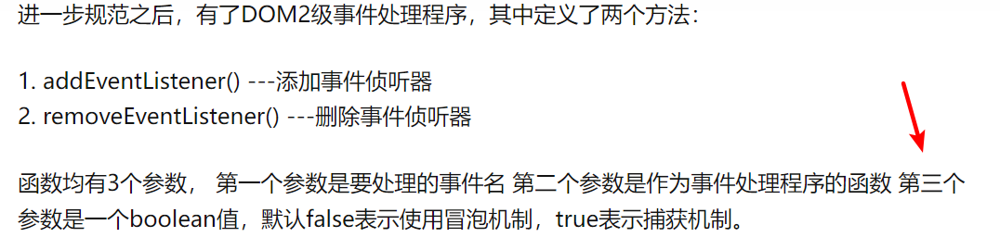

```html
<!DOCTYPE html>
<html lang="en">
<head>
    <meta charset="UTF-8">
    <meta http-equiv="X-UA-Compatible" content="IE=edge">
    <meta name="viewport" content="width=device-width, initial-scale=1.0">
    <title>Document</title>
</head>
<body>
    <div id="btn3">
        btn3
        <div id="btn2">
            btn2
            <div id="btn1">
                btn1
            </div>
        </div>
    </div>
</body>
</html>
<script>
    let btn1 = document.getElementById('btn1');
    let btn2 = document.getElementById('btn2');
    let btn3 = document.getElementById('btn3');
    btn1.addEventListener('click',function(){
        console.log(1)
    }, true)
    btn2.addEventListener('click',function(){
        console.log(2)
    }, true)
    btn3.addEventListener('click',function(){
        console.log(3)
    }, true)
</script>
```

tips：点击btn3会输出3，2，1，只执行捕获阶段

**若为每个元素分别绑定了冒泡和捕获两个事件会先执行捕获后执行冒泡，目标元素区别，那个先绑定那个先触发**

```js
btn1.addEventListener('click',function(){
    console.log('btn1冒泡')
}, false)
btn1.addEventListener('click',function(){
    console.log('btn1捕获')
}, true)

btn2.addEventListener('click',function(){
    console.log('btn2冒泡')
}, false)
btn2.addEventListener('click',function(){
    console.log('btn2捕获')
}, true)

btn3.addEventListener('click',function(){
    console.log('btn3冒泡')
}, false)
btn3.addEventListener('click',function(){
    console.log('btn3捕获')
}, true)
```

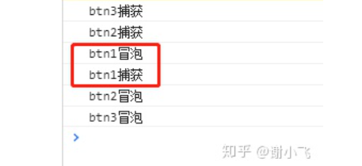

#### 阻止冒泡

IE：window.event.cancelBubble = true

```js
// 有时候我们需要点击事件不再继续向上冒泡，我们在btn2上加上stopPropagation函数，阻止程序冒泡
btn1.addEventListener('click',function(){
    console.log('btn1冒泡')
}, false)
btn1.addEventListener('click',function(){
    console.log('btn1捕获')
}, true)

btn2.addEventListener('click',function(){
    console.log('btn2冒泡')
}, false)
btn2.addEventListener('click',function(ev){
    ev.stopPropagation();
    console.log('btn2捕获')
}, true)

btn3.addEventListener('click',function(){
    console.log('btn3冒泡')
}, false)
btn3.addEventListener('click',function(e){
    console.log('btn3捕获')
}, true)
```

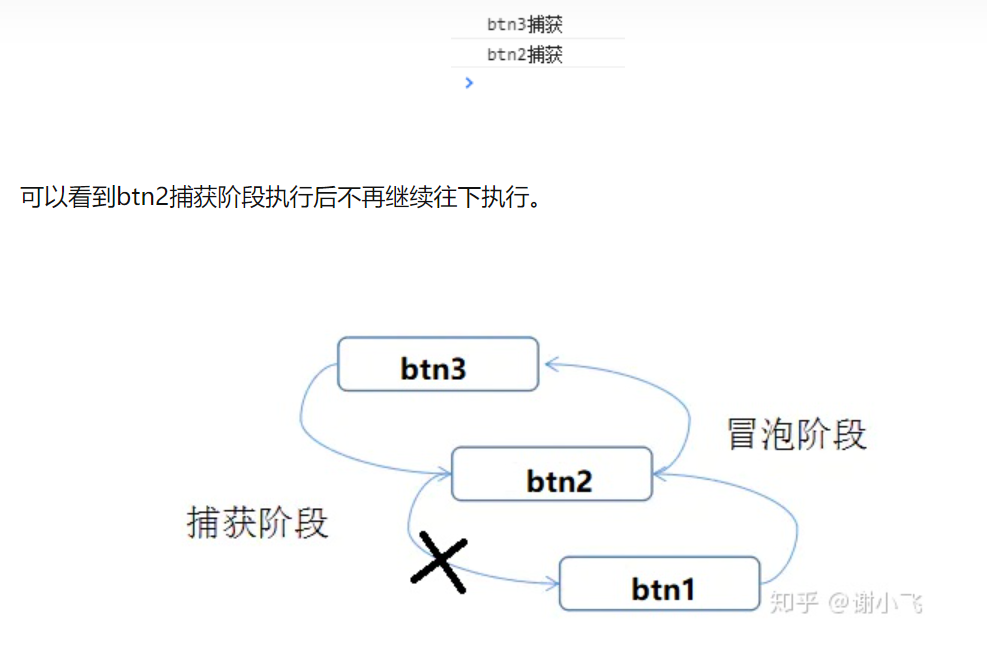

tips:点击button3

#### 事件委托

如果有多个DOM节点需要监听事件的情况下，给每个DOM绑定监听函数，会极大的影响页面的性能，因为我们通过事件委托来进行优化，事件委托利用的就是冒泡的原理。

```js
<ul>
    <li>1</li>
    <li>2</li>
    <li>3</li>
    <li>4</li>
    <li>5</li>
</ul>
<script>
    var li_list = document.getElementsByTagName('li')
    for(let index = 0;index<li_list.length;index++){
        li_list[index].addEventListener('click', function(ev){
            console.log(ev.currentTarget.innerHTML)
        })
    }
</script>
```

正常情况我们给每一个li都会绑定一个事件，但是如果这时候li是动态渲染的，数据又特别大的时候，每次渲染后（有新增的情况）我们还需要重新来绑定，又繁琐又耗性能；这时候我们可以将绑定事件委托到li的父级元素，即ul。

```js
var ul_dom = document.getElementsByTagName('ul')
ul_dom[0].addEventListener('click', function(ev){  
    console.log(ev.target.innerHTML)
})
```

- target返回触发事件的元素，`不一定是绑定事件的元素`
- currentTarget返回的是绑定事件的元素

因此我们总结一下事件委托的优点:

1. 提高性能:每一个函数都会占用内存空间，只需添加一个事件处理程序代理所有事件，所占用的内存空间更少。
2. 动态监听:使用事件委托可以自动绑定动态添加的元素，即新增的节点不需要主动添加也可以一样具有和其他元素一样的事件。

#### 柯里化函数（有难度先过）

柯里化是指这样一个函数(假设叫做createCurry)，他接收函数A作为参数，运行后能够返回一个新的函数。并且这个新的函数能够处理函数A的剩余参数。

```
function A(a, b, c) {
    // do something
}

var _A = createCurry(A);

_A(1, 2, 3);
_A(1, 2)(3);
_A(1)(2, 3);
_A(1)(2)(3);
A(1, 2, 3);
```

### 从输入 URL 到页面展示到底发生了什么？

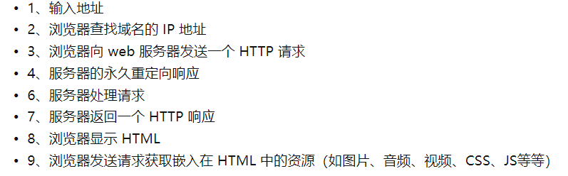

第八点说成: 浏览器开始解析 html 和 css 比较合适

第九点：浏览器在解析 html 的过程会并发的去获取嵌入在 HTML 的资源

总结：额。。。我们在页面输入地址后，如果输入的是域名，会先本地查找域名的映射地址，如果查不到会到dns服务器上去查找域名的映射地址，拿到ip地址后呢，会发送一个 HTTP 请求，也就是 get 请求，输入地址一般默认会发送一个 get请求，然后从服务器拿到 HTTP 响应报文，我们假设返回的 content-type 是 text/html，浏览器会开始去解析 HTML 文档构建 Dom 树，并且会并发的去加载嵌入在 HTML 的资源，解析 css 构建渲染树，解析完之后开始绘制到屏幕上。

我刚才说的只是个非常简略的版本，我觉得很少有人能完完全全地去讲述清楚这个过程，因为它涉及到非常多的领域，我只说了我们程序员看到的最直观的一面。

<script>标签会阻塞DOM的解析和渲染；

带src属性的`<script>`标签会触发页面paint，渲染此`<script>`标签之前的元素，但也有一定的条件：

- 此`<script>`标签是在`<body>`中的，`<head>`中的不会触发paint（因为还没有可以展示的东西）；
- 此`<script>`标签之前的`<link>`标签需加载完毕（避免下面的 dom 操作有涉及到修改样式的部分，造成冲突）。

inline的`<script>`标签不会触发页面paint，页面必须等到脚本执行完毕，且DOM Tree和CSSOM Tree解析完毕后才会渲染；

`<link>`标签不会阻塞DOM的解析；

`<link>`标签会阻塞DOM的渲染；

`<link>`标签同时还会阻塞其之后的`<script>`标签的执行。

### JS 类型判断

#### typeof

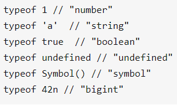

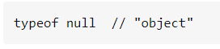

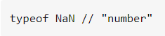

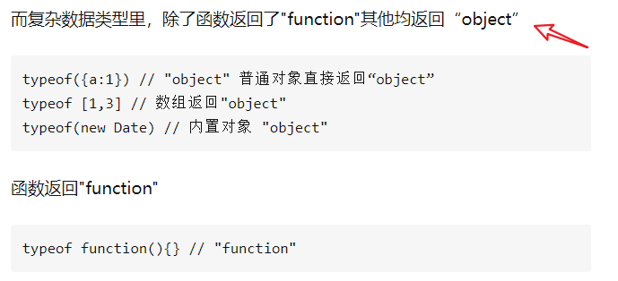

#### Object.prototype.toString.call

tips：这个方法可以返回内置类型

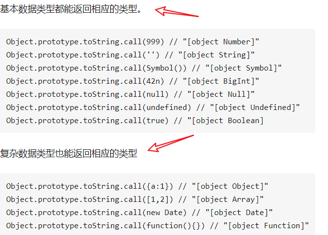

为什么只能通过 Object.prototype.toString.call 的方式去判断数据类型？不能就直接调用 toString？因为 Number，Boolean，String 身上的 toString 方法是被改写的，他们的 toString 方法是无法返回数据类型的，而只有 object.prototype.toSring 的方法可以，也是为什么对象就可以直接通过.toString 的方式去获取到数据类型 

#### obj instanceOf Object

tips：左边放你要判断的内容，右边放类型来进行JS类型判断，**只能用来判断复杂数据类型,因为instanceof 是用于检测构造函数（右边）的 `prototype` 属性是否出现在某个实例对象（左边）的原型链上。**

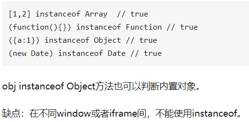

### 如何理解CDN？说说其原理

我觉得要理解CDN可以用一句话总结就近获取，它的原理大概就是把同样的资源分布到各个服务器上，用户请求资源的时候就就近获取资源

术语：用户提交域名的时候，浏览器对域名进行解析，先是到全局负债均衡服务器ip地址，请求它拿到区域负载均衡服务器的ip地址，区域负载均衡服务器会根据用户 ip 选择距离近的一台缓存服务器ip给用户

### 关于vue

#### computed、watch、filter 使用的区别：

- 我觉得可以从字面上理解computed和watch
- computed：当有值依赖于某个值计算得出的我们就可以使用computed
- watch：当我们需要监听某个值的变化去做某些操作的时候，我们可以用watch
- filter：我觉得可以对比computed，它需要显示的调用而且每次模板渲染的时候都要重新计算

#### 讲讲vue的异步更新


vue的异步更新可以利用 nextTick()这API，我没有去真正读过它的源码，但是我大概知道它的原理是什么，就是利用事件循环机制，异步操作只会在调用栈为空的情况执行的规律，等同步状态更新完之后再去执行异步任务

## 一面

### 1.AJAX工作原理

通过XmlHttpRequest对象来向服务器发异步请求，从服务器获得数据，然后用javascript来操作DOM而更新页面。

### 2.单行文本省略号显示

```
white-space: nowrap; // 表示溢出的元素不换行
overflow: hidden; // 超出的部分隐藏
text-overflow: ellipsis; // 文本超出的部分省略号展示
```

### 3.防抖和节流理论＋手撕

防抖：搜索框最后一次输入才发起请求

节流：抢票你点得多快都只在一定频率发一次请求


点得再快一定时间只会发一次请求

## 一面

### new Array(10)

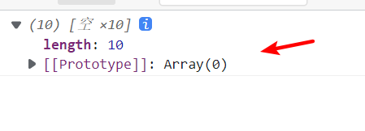

### 跨域

#### 概念

要了解跨域首先要知道浏览器的同源策略：由于请求的文件可能会存在恶意的攻击，浏览器不允许直接访问另一个“域”上的资源，只能访问同一个“域”上的资源。而所谓“同源”就是指：“协议、域名、端口号”相同。当我们试图访问另一个域上的资源时就是跨域，浏览器是不允许的！

#### jsonp

**概念**

利用 script 标签可跨域特性，让后端返回一个 js 函数调用，将要传递的参数写在参数上；前端就写一个函数接收参数。

**优点**

支持老式浏览器

**缺点**

需要前后端双方提前约定好参数函数名等，只能进行get请求

**演示**

```js
// 创建一个文件：jsonpData.js
showData({
    name: "Crimson fire",
    culture: "Yaaxil"
})

// 开启一个服务
const http = require('http')
const fs = require('fs')

http.createServer(function(req, res) {
    if (req.url === '/jsonpData.js') {
        fs.readFile('./jsonpData.js', function (err, file) {
          res.setHeader('Content-Type', 'text/js');
          res.writeHead('200', "OK");
          res.end(file);
      });    
    }
}).listen(8082)

// 前端利用 script 标签调用
const s = document.createElement("script");
s.src = "http://localhost:8082/jsonpData.js";
document.body.appendChild(s);

function showData(myObj) {
  console.log(myObj);
}
```

#### cors

##### **概念**

cross-origin resource sharing（跨域资源共享）是一种跨域的解决方案，它允许浏览器向跨源服务器，发出XMLHttpRequest请求，从而克服了AJAX只能使用同源的限制。但是需要浏览器支持

##### **注意**

整个CORS通信过程，都是浏览器自动完成，不需要用户参与。对于开发者来说，CORS通信(只要在服务器端设置了就行)与同源的AJAX通信没有差别，代码完全一样。**浏览器一旦发现是cors情况的AJAX请求跨源，就会自动添加一些附加的头信息，有时还会多出一次附加的请求（复杂的请求咨询支持的方法等等），但用户不会有感觉。**

##### **发送 cors 简单请求**

就是在头信息之中，增加一个Origin字段

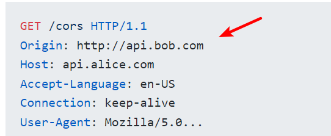

Origin字段用来说明，本次请求来自哪个源（协议 + 域名 + 端口）

如果origin指定的域名在服务端的许可范围，服务端返回的响应会多出几个头部信息字段

如果没有以下字段说明这次跨域不是成功的

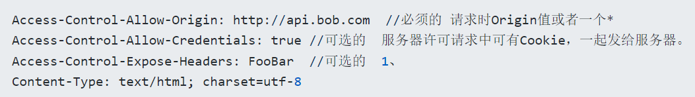

```
1、XMLHttpRequest对象的getResponseHeader()方法只能拿到6个基本字段：Cache-Control、Content-Language、Content-Type、Expires、Last-Modified、Pragma。如果想拿到其他字段，就必须在Access-Control-Expose-Headers里面指定。上面的例子指定，getResponseHeader('FooBar')可以返回FooBar字段的值
```

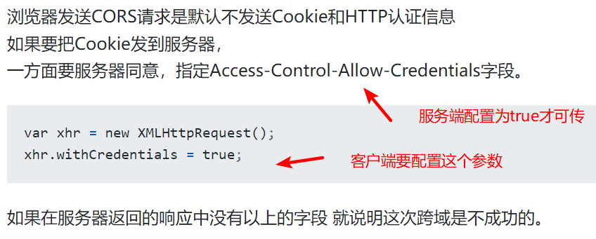

##### 发送非简单请求

非简单请求的CORS请求，会在正式通信之前，增加一次HTTP查询请求，称为"**预检"请求（preflight）**。

浏览器首先发送请求询问服务器，当前网页所在的域名是否在服务器的许可名单之中，以及可以使用哪些HTTP动词和头信息字段。只有得到肯定答复，浏览器才会发出正式的XMLHttpRequest请求，否则就报错。

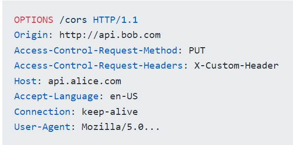

```
"预检"请求用的请求方法是OPTIONS，表示这个请求是用来询问服务器支持什么请求方法的。
"预检"请求的头信息包括两个特殊字段。
（1）Access-Control-Request-Method
该字段是必须的，用来列出浏览器的CORS请求会用到哪些HTTP方法，上例是PUT。
（2）Access-Control-Request-Headers
该字段是一个逗号分隔的字符串，指定浏览器CORS请求会额外发送的头信息字段，上例是X-Custom-Header。
```

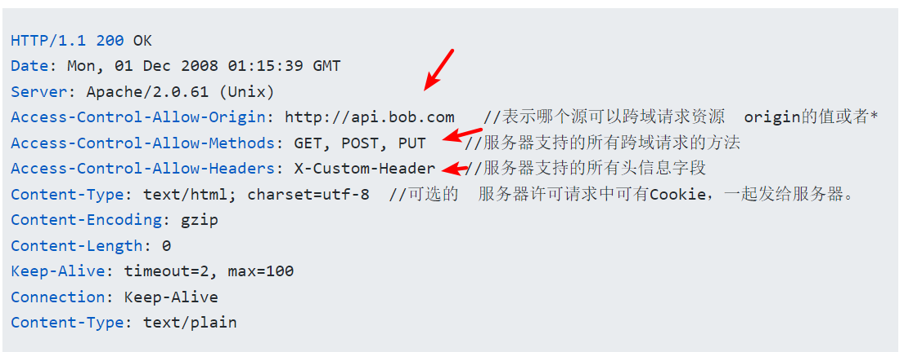

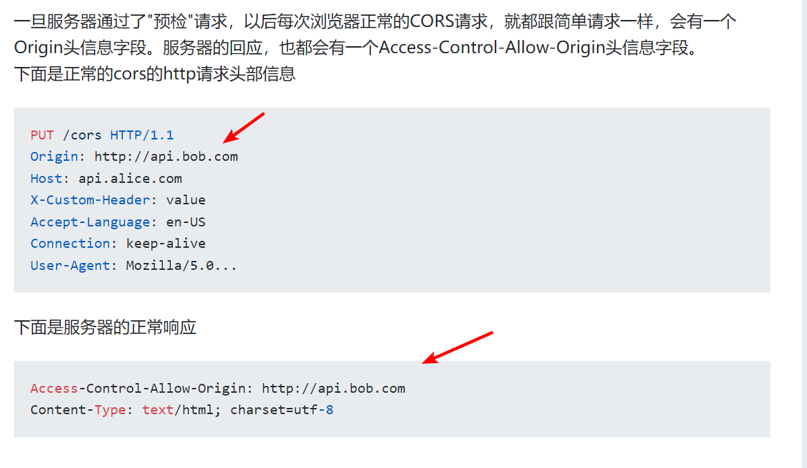

#### 反向代理

跨域只是浏览器向服务器发送请求的时候，浏览器的限制。而服务器和服务器之间是没有跨域的限制的。而反向代理是利用代理服务器接收到请求之后，转发给真正的服务器，并把结果返回到浏览器上。

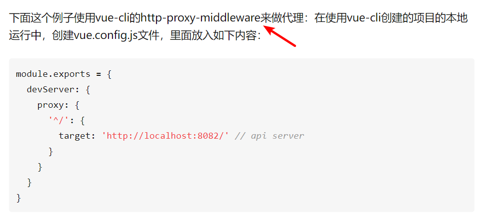

### new 原理

```js
function myNew(fn, val) {
    let obj = Object.create(fn.prototype)
    fn.call(obj, val) // 关键步骤，创建对象属性
    return obj
}
```

### map 和 weakMap 的区别

我们知道map设置键值的本质其实就是将这两个键值分别插入到两个数组的末尾，这样有一个缺点就是可能会导致内存泄漏，因为数组会一直引用着每个键和值。这种引用使得垃圾回收算法不能回收处理他们，即使没有其他任何引用存在了。

`WeakMap` 持有的是每个键对象的“弱引用”，这意味着在没有其他引用存在时垃圾回收能正确进行。**正由于这样的弱引用，`WeakMap` 的 key 是不可枚举的**（没有方法能给出所有的 key）。如果key 是可枚举的话，其列表将会受垃圾回收机制的影响，从而得到不确定的结果。

### for in 和 for of 的区别


## 个人猜测

### Vue 响应式原理

#### Object.defineProperty做数据劫持

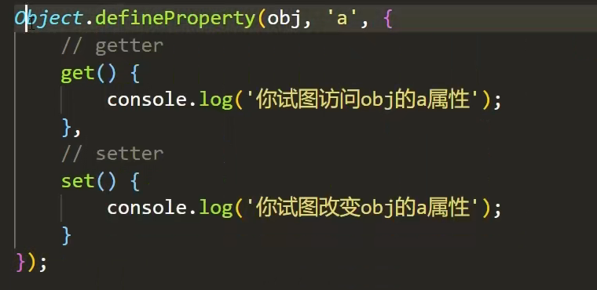

#### defineReactive函数

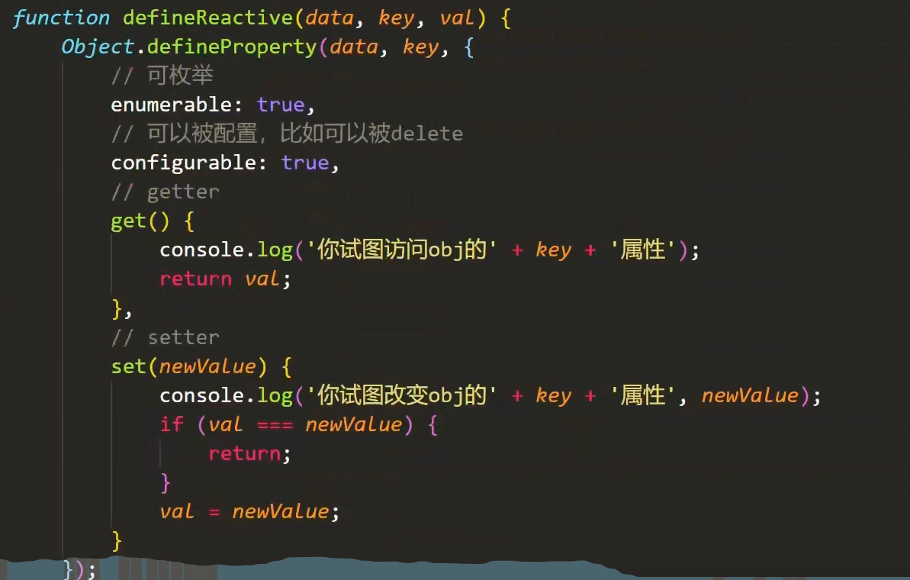

递归侦测对象全部属性

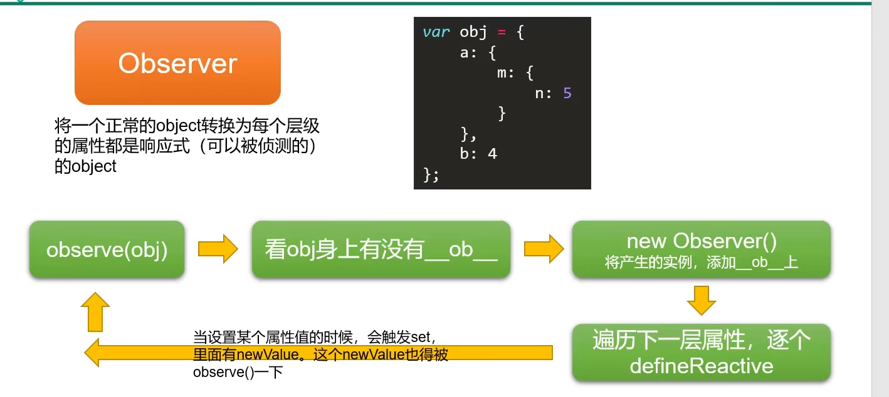

tips：没有 __ob__ 说明还没有侦测

```js
import Observer from './Observer.js';

export default function (value) {
    // 如果value不是对象，什么都不做
    if (typeof value != 'object') return;
    // 定义ob
    var ob;
    if (typeof value.__ob__ !== 'undefined') {
        ob = value.__ob__;
    } else {
        ob = new Observer(value);
    }
    return ob;
}

```

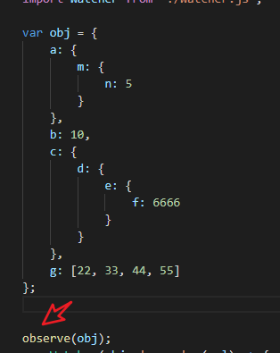

先侦测最外层属性，然后如果子属性是对象会时对象里面的值也会被递归侦测

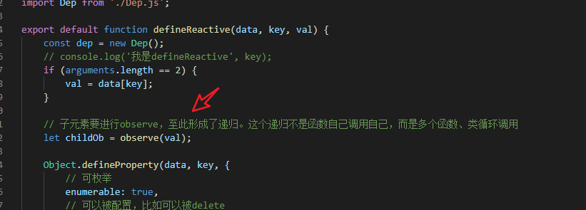

#### 数组响应式处理

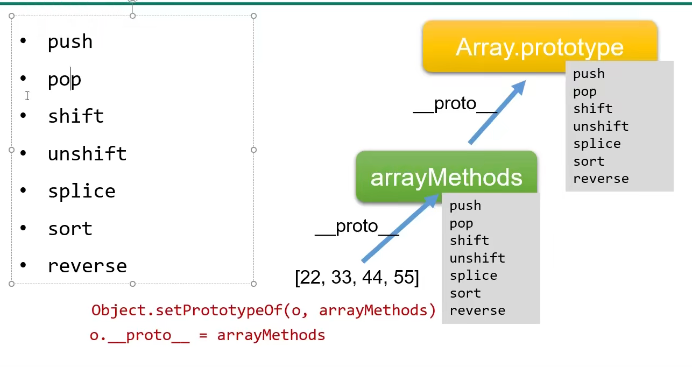

vue 以 Array.protatype 为原型创建了一个 arrayMethods 对象（有改写数组的七个方法），让创建的数组对象的_proto_指向这个对象（调用 ES6 的Object.setPrototypeOf）红色笔上下两种写法是等价的

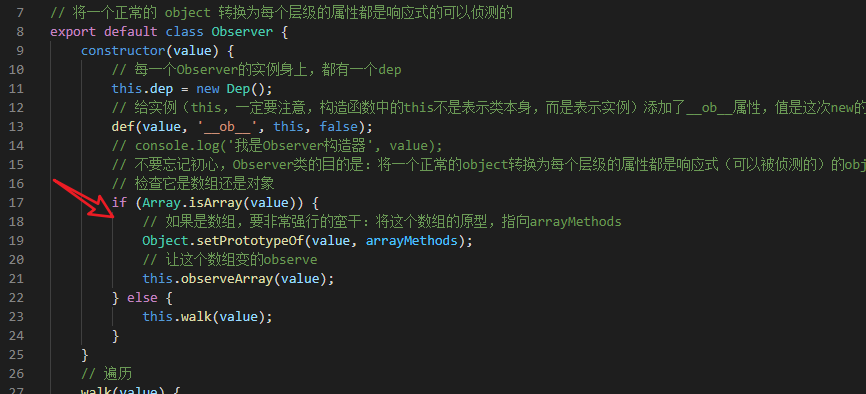

tips：当数组插入新值的时候我们给这个新值做响应式，注意用浅拷贝，这样才会作用到原数组本身

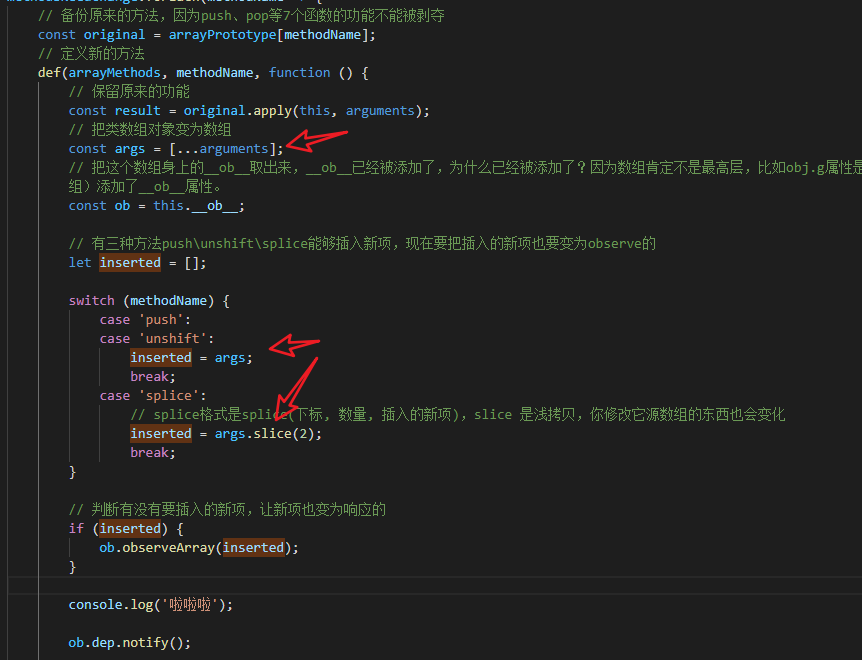

#### 依赖收集

在 set 中收集依赖，在 get 中触发依赖

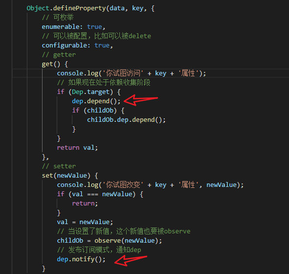

#### Watcher 类 和 Dep 类

#### 总结

我觉得要理解 vue 响应式原理可以从 vue 中的 watch api 出发，我们在 watch 一个数据的时候会传入，要监听的数据，还有一个回调，其实这个过程是调用了 vue 中 new wathcer 的一个过程，我们 new watcher 的时会让window.target 去指向新创建的 wathcer 实例自身，然后它还会主动的去读取我们要监听的对象属性，这个时候就会触发属性的 get，而 get 中会触发收集依赖的操作也就是dep.depend,dep.depend它做的其实就是就是将 window.target 添加到数组中；这样就完成了依赖的收集，当我们再次去修改这个属性值的时候就会触发它的set，这里面它会执行 dep.notify(),而notify做的就是遍历依赖执行回调方法，这就是vue的响应式原理


### 前端安全


# 计算机网络

## HTTPs

相对于 HTTP 的明文传输，HTTPs 利用了对称加密和非对称加密避免数据在传输过程中被窃取，另外HTTPs客户端可以通过服务端SSL证书（向CA机构申请）确定服务端身份，而服务端数据传输给客户端会通过会话密钥加密传输所以不用担心数据被窃取。

- 反问：什么是非对称加密？我觉得可以这样理解非对称加密，通信的双方都拥有自己的公钥和私钥，然后将公钥暴露出来，要传输数据的一方利用对方的公钥对数据进行加密，那么能解密这份数据的也就只有拥有对应的私钥的人，也就是接受数据的一方。
- 反问：会话密钥是如何获取的？这涉及到TSL握手的过程，
  - 首先客户端会将自己的TSL版本和加密套件，生成一个随机数传送给服务端，
  - 服务端收到后会响应自己的TSL版本和加密套件，生成的一个随机数给客户端，
  - 然后响应自己的证书
  - 公钥
  - 还有 server hello done
  - 接着客户端生成第三个随机数，并用刚才服务端的公钥进行加密生成预主密钥发送给服务端
  - 然后服务端利用自己私钥解密也就知道预主密钥了，因为没有直接进行传输现在就只有服务端和客户端知道这个预主密钥
  - 然后双方再利用第一个随机数和第二个随机数加预主密钥生成会话密钥，后续双方就采用对称加密就可以保证数据的安全传输了

## TCP 三次握手和四次挥手

### 三次握手

我先简单的描述一下三次握手的一个过程：首先客户端会告诉服务端我要建立TCP连接，服务端再收到客户端的请求后会响应说我收到你的请求了，然后客户端告诉服务端那我们正式建立TCP连接。

不过我还没讲到握手的核心，**握手的核心在于怎么判断出那些请求或者那些响应需要丢弃**，这个时候就需要有能确定对方身份的标识还有步骤进行到哪一步的表示！那么这个标识怎么生成呢？其实在TCP第一次握手的时候客户端会开启SYN(Synchronization)控制位表示想要与服务端进行数据同步，并且传送一个序号，服务端收到客户端的请求后会开启SYN，和ACK(AcKnowledgement表示确认的意思)控制位还有生成确认号(客户端生成的序列表+1)，序列号一并响应给客户端，客户端就可以通过服务端传递回来的确认号就可以判断是否是自己要通信的服务端，在确定后他会开起ACK控制位，并将刚才对方传递过来的序号＋1生成确认好传递给服务端，服务端收到响应报文，通过确认号就可以判断出是否是要和自己建立TCP的客户端，如果是，TCP握手就成功了，两边不仅能通过序列号还可以通过控制位来区别进行到哪个步骤。

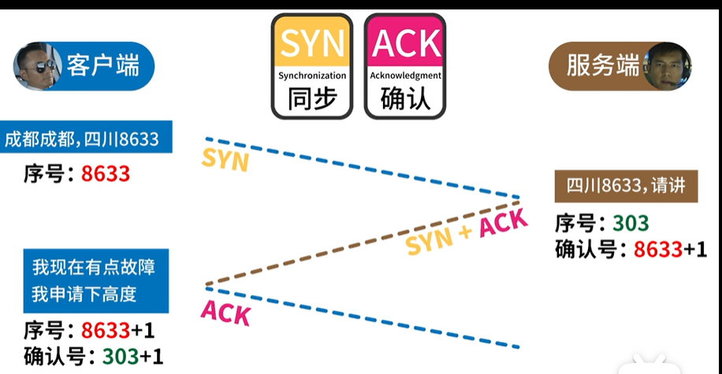

### 四次挥手

因为是全双工通信，双方在通信完毕后都能主动要求关闭要求，我们假设是客户端主动发起关闭请求，

第一次挥手：那么它会开启FIN(finish表示结束的意思)和ACK两个控制位还有发送序号和确认号(这两个数字在通信的过程中不端递增，使用最后一次通信的)，

第二次挥手：服务端收到后会开启ACK控制和发送序号(用对方传来的确认号)和确认号(用对方传来的序号+1),

第三次挥手：服务端在处理完数据后，会再次发送ACK控制位还有FIN控制位来进行最后的确认（确认号和序号不需要改变），

第四次挥手： 开启ACK控制位，序号：对方确认号＋1，确认号:对方序号＋1

反问:为什么要四次挥手：假如说在一边提出连接关闭后就关闭通信的话，会导致另一边可能还存在没发送的数据通信的关闭的情况，设置四次挥手可以避免情况，一方提出申请后等待对方处理完，再关闭。

反问：为什么客户端最后回复ACK后要进行等待，避免服务端没有收到ACK重发FIN和ACK的情况，影响下次通信。

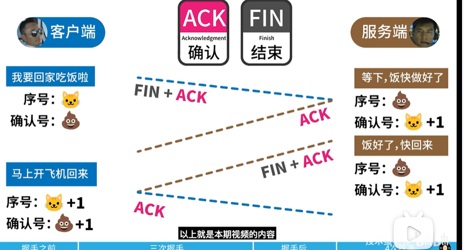
