# 自我介绍

面试官您好，我叫陈源鑫，21岁，今年大三；我虽然没有过实习经历，但是我是从大一暑假开始便开始自学前端，大二开学初便进入实验室跟着导师做项目，有实际的项目开发经历，差不多就这些。

# 介绍项目

这个项目是我们实验室与梅州金绿集团合作的一个项目，他是梅州一个养鸽企业，这个系统用于对鸽棚采集的数据进行汇总和分析，我们用的是 vue + ElementUI；在这个项目遇到的问题，首先我比较印象深刻的是首屏渲染速度较慢的问题，尤其是图片加载比较慢，为此我先是对图片做了压缩但是感觉还是不够，就又做了 http 缓存，后面又做了预渲染，还有路由懒加载，external，css 提取等去减少包的体积。


# 欢聚时代

## 一面

### 1.垂直居中方式

#### **Vertical-Align**

#### Line-Height 方法

**这个方法适用于单行文字的垂直居中**，只需要将包含文字元素的容器行高设置为大于字体大小并且等于元素的高度。默认情况下，文字上下部分会留有相同的空间，因而实现了文字的垂直居中。

**html**

```html
<div id="parent">
    <div id="child">Text here</div>
</div>
```

**css**

```css
#child {
    line-height: 200px;
}
```

这种方法只适用于单行文字的垂直居中，如果需要多行文字居中，需要选择其他方法。

##### 使用 Line-Height 垂直居中图片

使 **line-height** 可以实现图片的垂直居中，只需要在包含图片的父元素上设置 **line-height** 然后为图片设置 `vertical-align: middle`。

**html**

```html
<div id="parent">
    
</div>
```

**css**

```css
#parent { 
    line-height: 200px;
}

#parent img {
    vertical-align: middle;
}
```

#### CSS表格法

之前已经提到 **vertical-align** 适用于 **table-cell**, 因此可以通过将元素转化为table来实现垂直居中。

**html**

```html
<div id="parent">
    <div id="child">Text here</div>
</div>
```

**css**

```css
#parent {
    display: table;
}

#child {
    display: table-cell;
    vertical-align: middle;
}
```

注意这种方法的好处在于支持内容的动态改变，缺点是不支持旧版的IE浏览器（<=IE7）。

#### 绝对定位和margin

**html**

```html
    <div class="div1">
        <div class="div2">
        </div>
    </div>
```

**css**

```css
    .div1 {
        width: 100px;
        height: 100px;
        position: relative;
        background-color: black;
    }
    .div2 {
        background-color: pink;
        width: 50px;
        height: 50px;
        position: absolute;
        top: 50%;
        left: 50%;
        margin-top: -25px;
        margin-left: -25px;
    }
```

#### 绝对定位和拉伸法

css

```css
    .div1 {
        width: 100px;
        height: 100px;
        position: relative;
        background-color: black;
    }
    .div2 {
        background-color: pink;
        width: 50px;
        height: 50px;
        position: absolute;
        top: 0;
        bottom: 0;
        left: 0;
        right: 0;
        margin: auto;
    }
```

#### flex 

### 2.call 、appy 和 bind 的区别和源码

- call：参数需要逐个传递
- apply：参数是一个数组
- bind：参数需要逐个传递，不过返回的是一个函数

```js
<script>
    // 1.将方法挂载到我们传入的 ctx
    // 2.将挂在以后的方法调用
    // 3.将我们添加的这个属性删除掉
    Function.prototype.luckyCall = function( ctx, ...args ) {
        // 给我们要指定的那个上下文对象添加一个属性，值是我们要调用的方法，因为 luckyCall 是我们所调用的方法调的，所以 this 指向它
        // 这里有个优化可以做就是 fn 这个名字可能本身在上下文对象就是一个属性，这样写可能会覆盖掉上下文对象的属性
        // 可以通过 let fn = symbol(1) 定义一个唯一的属性名
        ctx.fn = this

        // 调用这个属性方法， this 便变成了上下文对象
        ctx.fn(...args)

        delete ctx.fn
    }

    // 1.将方法挂载到我们传入的 ctx
    // 2.将挂在以后的方法调用
    // 3.将我们添加的这个属性删除掉
    Function.prototype.luckyApply = function( ctx, args = [] ) {

        // 判断参数是否是数组
        if (args && !(args instanceof Array)) {
            throw('参数得是数组')
        }

        // 给我们要指定的那个上下文对象添加一个属性，值是我们要调用的方法，因为 luckyCall 是我们所调用的方法调的，所以 this 指向它
        ctx.fn = this

        // 调用这个属性方法， this 便变成了上下文对象
        ctx.fn(...args)
        
        delete ctx.fn
    }

    Function.prototype.luckyBind = function( ctx, ...args ) {

        // 返回一个函数
        return (...args2) => {
            ctx.fn = this

            // 拼接第二次调用的参数并执行
            ctx.fn(...args1.concat(args2))

            // 删除属性
            delete ctx.fn
        }
    }
</script>
```

### 3.https 的传输过程

- 客户端向服务器发起HTTPS请求，连接到服务器的443端口；
- 服务器端有一个密钥对，即公钥（即数字证书）和私钥，是用来进行非对称加密使用的，服务器端保存着私钥，不能将其泄露，公钥可以发送给任何人；
- 服务器将自己的公钥发送给客户端；
- 客户端收到服务器端的公钥之后，检查其合法性，如果发现发现公钥有问题，那么HTTPS传输就无法继续，如果公钥合格，则客户端会生成一个客户端密钥，然后用服务器的公钥对客户端密钥进行非对称加密成密文，至此，HTTPS中的第一次HTTP请求结束；
- 客户端发起HTTPS中的第二个HTTP请求，将加密之后的客户端密钥发送给服务器；
- 服务器接收到客户端发来的密文之后，会用自己的私钥对其进行非对称解密，解密之后的明文就是客户端密钥，然后用客户端密钥对数据进行对称加密，这样数据就变成了密文；
- 然后服务器将加密后的密文发送给客户端；
- 客户端收到服务器发送来的密文，用客户端密钥对其进行对称解密，得到服务器发送的数据。这样HTTPS中的第二个HTTP请求结束，整个HTTPS传输完成。
  

### 4.跨域以及其解决方式

**什么是跨域？**

- 要理解跨域首先要知道什么是：所谓同源（即指在同一个域）就是两个页面具有相同的协议（protocol），主机（host）端口号（port）
- 浏览器有一个安全功能叫同源策略，它规定不同源的客户端脚本在没有明确授权的情况下，不能读写对方资源。 如果尝试这样操作就是跨域

**非同源的限制**

1. 无法读取非同源网页的 Cookie、LocalStorage 和 IndexedDB
2. 无法接触非同源网页的 DOM
3. 无法向非同源地址发送 AJAX 请求，即 XHR 请求

**解决方案**

- jsonp

```
原理：利用 script 标签没有跨域限制向服务器发送 get 请求，传一个回调函数名给服务端，服务端直接将数据作为参数传回来
JSONP的优势在于支持老式浏览器，弊端也比较明显：只支持GET请求而不支持POST等其它类型的HTTP请求,它只支持跨域HTTP请求这种情况，需要客户端和服务端定制进行开发，服务端返回的数据不能是标准的Json数据，而是callback包裹的数据。
```

- CORS

```
跨资源共享CORS：跨域资源共享(CORS) 是一种机制，它使用额外的 HTTP 头（就是它：Access-Control-Allow-Origin）来告诉浏览器 让运行在一个服务器上的Web应用被准许访问来自不同源服务器上的指定的资源。当一个资源从与该资源本身所在的服务器不同的域、协议或端口请求一个资源时，资源会发起一个跨域 HTTP 请求。

CORS需要浏览器和服务器同时支持，才可以实现跨域请求，目前几乎所有浏览器都支持CORS，IE则不能低于IE10。CORS的整个过程都由浏览器自动完成，前端无需做任何设置，跟平时发送ajax请求并无差异。so，实现CORS的关键在于服务器，只要服务器实现CORS接口，就可以实现跨域通信。
优点：支持所有 http 请求
缺点：兼容性比jsonp差点，安全性问题，最好要控制好访问的域名
```

- 代理
  - nginx 反向代理配置
  - webpack 代理配置

### 5.get、post 区别

- 大部分的答案都是说：
  - GET使用URL或Cookie传参。而POST将数据放在BODY中。
  - GET的URL会有长度上的限制，则POST的数据则可以非常大。
  - POST比GET安全，因为数据在地址栏上不可见。

- 我认为这些区别是错误的，对于 url 的长度限制不过是一种防护机制，避免有人恶意构造几个 M 大小的 URL 然后不停访问你的服务器，去增加你的服务器负担；然后只要你愿意，完全可以在 get 请求上用 body 去传递数据，不过不能通过浏览器发出；至于安不安全如果是小白，你加个 base64 不就行了，如果不是小白，你放在地址栏上和放在 body 上没啥区别。
- 总结我觉得  get、post 的区别仅仅是使用规范上的区别

### 6.cookie的属性


#### name和value

Name和Value是一个键值对。Name是Cookie的名称，**Cookie一旦创建，名称便不可更改**，一般名称不区分大小写；Value是该名称对应的Cookie的值，如果值为Unicode字符，需要为字符编码。如果值为二进制数据，则需要使用BASE64编码。

#### Domain

**Domain决定Cookie在哪个域是有效的**，也就是决定在向该域发送请求时是否携带此Cookie，Domain的设置是对子域生效的，如Doamin设置为 .a.com,则b.a.com和c.a.com均可使用该Cookie，但如果设置为b.a.com,则c.a.com不可使用该Cookie。Domain参数必须以点(".")开始。

#### Path

**Path是Cookie的有效路径**，和Domain类似，也对子路径生效，如Cookie1和Cookie2的Domain均为a.com，但Path不同，Cookie1的Path为 /b/,而Cookie的Path为 /b/c/,则在a.com/b页面时只可以访问Cookie1，在a.com/b/c页面时，可访问Cookie1和Cookie2。Path属性需要使用符号“/”结尾。

#### Expires

**Expires 用于设置 Cookie 的过期时间**。比如：

```
Set-Cookie: id=a3fWa; Expires=Wed, 21 Oct 2015 07:28:00 GMT;
```

当 Expires 属性缺省时，表示是会话性 Cookie，像上图 Expires 的值为 Session，表示的就是会话性 Cookie。当为会话性 Cookie 的时候，值保存在客户端内存中，并在用户关闭浏览器时失效。需要注意的是，有些浏览器提供了会话恢复功能，这种情况下即使关闭了浏览器，会话期 Cookie 也会被保留下来，就好像浏览器从来没有关闭一样。

#### Max-Age

Max-Age 用于设置在 Cookie 失效之前需要经过的秒数。比如：

```
Set-Cookie: id=a3fWa; Max-Age=604800;
```

Max-Age 可以为正数、负数、甚至是 0。

如果 max-Age 属性为正数时，浏览器会将其持久化，即写到对应的 Cookie 文件中。

当 max-Age 属性为负数，则表示该 Cookie 只是一个会话性 Cookie。

当 max-Age 为 0 时，则会立即删除这个 Cookie。

假如 Expires 和 Max-Age 都存在，Max-Age 优先级更高。

#### size

Szie是此Cookie的大小。在所有浏览器中，任何cookie大小超过限制都被忽略，且永远不会被设置。各个浏览器对Cookie的最大值和最大数目有不同的限制。

#### HttpOnly

HttpOnly值为 true 或 false,若设置为true，则不允许通过脚本document.cookie去更改这个值，同样这个值在document.cookie中也不可见，但在发送请求时依旧会携带此Cookie。

#### Secure

Secure为Cookie的安全属性，若设置为true，则浏览器只会在HTTPS和SSL等安全协议中传输此Cookie，不会在不安全的HTTP协议中传输此Cookie。

#### SameSite

SameSite用来限制第三方 Cookie，从而减少安全风险。它有3个属性，分别是：

- Strict

Scrict最为严格，完全禁止第三方Cookie，跨站点时，任何情况下都不会发送Cookie

- Lax

Lax规则稍稍放宽，大多数情况也是不发送第三方 Cookie，但是导航到目标网址的 Get 请求除外。

- None

网站可以选择显式关闭SameSite属性，将其设为None。不过，前提是必须同时设置Secure属性（Cookie 只能通过 HTTPS 协议发送），否则无效。

另外：关闭SameSite的方法

操作方法谷歌浏览器地址栏输入：chrome://flags/ 找到：SameSite by default cookies、Cookies without SameSite must be secure设置上面这两项设置成 Disable

#### Priority

优先级，chrome的提案，定义了三种优先级，Low/Medium/High，当cookie数量超出时，低优先级的cookie会被优先清除。

### 7.什么是 promise/A+ 规范

它是一个 JavaScript Promises 标准——由开发者制定，供开发者参考实现 Promises。

**规范规定**

- 用 fulfilled 表示解决/兑现: 指一个 promise 成功地从 “待定” 状态进入 “兑现” 状态。虽然规范中使用 fulfill 来表示解决，但一般多以 resolve 来指代。
- 拒绝（reject）：指一个 promise 成功地从 “待定” 状态进入 “拒绝” 状态。
- 终值（eventual value）：指一个 promise 解决时传递给解决回调的值，由于 promise 有一次性的特征，因此当这个值被传递时，标志着 promise 等待态的结束，故称之终值，有时也直接简称为值（value）。
- 拒因（reason）：指一个 promise 拒绝时传递给拒绝回调的值（原因），

### 8.你的promise是怎么写的(他应该是想问你的promise是怎么用的，我当时理解错了，把[源码](https://www.nowcoder.com/jump/super-jump/word?word=源码)说了一遍)

### 9.then的返回值

### 10.nginx反向代理怎么弄

### 11.http的方法

### 12.option是干什么的

## 一面

### 1.讲一下 TypeScript 泛型

它允许在程序中定义形式类型参数，然后在泛型实例化时使用实际类型参数来替换形式类型参数；概念我不会背，我直接说一下它的一个常规的使用场景，当我们想要定义一个函数参数和返回值类型一致，而又不想写死的时候，这个时候就需要使用泛型了，**因为它能够捕获传入参数的类型，又能够使用捕获的传入参数的参数类型作为函数返回值的类型。**

### 2.块级和行内块的区别

它们都可以设置宽高，然后块级独占一行，行内块元素可以多个存在一行显示

### 3.讲一下盒子模型；box-sizing 有哪些属性有什么用？

盒子模型一般就分标准的盒子模型和 IE 盒子模型：


由内到外分别是 content padding border margin 然后 标准的 height 和 width 指的是 content 部分，而 IE 的话还会包含 padding 和 border

box-sizing 有三个属性：content-box丨border-box丨inherit 分别对应标准的盒子模型、IE 盒子模型，还要继承父类的 box-sizing 属性。

### 4.position 有哪些属性有什么作用?

CSS中Position属性有五个可选值，它们分别是：static、absolute、fixed、relative、inherit

static：表示无定位，这是所有元素定位的默认值；一般情况下，我们不需要特别的去声明它，但有时候遇到继承的情况，我们不愿意见到元素所继承的属性影响本身，从而可以用position:static取消继承，即还原元素定位的默认值。

absolute：表示生成绝对定位元素，相对于 static 定位以外的第一个父元素进行定位

fixed：生成绝对定位的元素，相对于浏览器窗口进行定位

relative：生成相对定位元素，相对于其正常位置进行定位

# 汇量科技

## 一面

### 手写快排


```js
    <script>
        // 快速排序

        function quickSort( arr ) {

            // base case 
            if ( arr.length <= 1 ) return arr;
            
            // 取基准索引
            let pivotIndex = Math.floor( arr.length / 2 )

            // splice 方法会改变原数组，将位置为 pivotIndex 的元素删除
            // 取基准值并改变原数组
            let pivot = arr.splice(pivotIndex, 1)[0];

            let leftArr = []
            let rightArr = []

            for ( let i = 0; i < arr.length; i++ ) {
                if( arr[i] < pivot ) {
                    leftArr.push( arr[i] )
                } else {
                    rightArr.push( arr[i] )
                }
            }
			
            // 左边快排结果加右边快排结果和基准值就是答案
            return quickSort(leftArr).concat( [ pivot ], quickSort(rightArr) )
        }

        let arr = [ 8, 6, 7, 1 , 2, 3 ]
        let ans = quickSort(arr)
        console.log(ans);
        
    </script>
```

### 数组去重

## 二面

### 简述浏览器渲染机制

#### 一 ： 为什么要了解浏览器渲染页面的机制，主要还是性能的优化。

- 了解浏览器如何进行加载，我们可以在引用外部样式文件，外部JS时，将它们放到合适的位置，是浏览器以最快的速度，将文件加载完毕。
- 了解浏览器如何进行解析，我们可以在构建DOM结构，组织CSS选择器的时候，选择最优的写法，提高浏览器的解析速率。
- 了解浏览器如何进行渲染，明白渲染的过程，我们在设置元素属性，编写JS文件时，可以减少“重绘”，“重新布局”的消耗。

------

#### 二 ： 要了解清楚渲染机制，要先弄明白几个基本概念：

1. DOM：Document Object Model，浏览器将HTML解析成树形的数据结构，简称DOM。

2. CSSOM：CSS Object Model，浏览器将CSS解析成树形的数据结构，简称CSSOM。

3. Render Tree: DOM和CSSOM合并后生成Render Tree，如下图：

   

   image.png

4. Layout: 计算出Render Tree每个节点的具体位置。

5. Painting：通过显卡，将Layout后的节点内容分别呈现到屏幕上。

------

#### 三 ： 需要注意的是(重点)：

- 当我们浏览器获得HTML文件后，会自上而下的加载，并在加载过程中进行解析和渲染。
- 加载说的就是获取资源文件的过程，如果在加载过程中遇到外部CSS文件和图片，浏览器会另外发送一个请求，去获取CSS文件和相应的图片，这个请求是异步的，并不会影响HTML文件的加载。
- 但是如果遇到Javascript文件，HTML文件会挂起渲染的进程，等待JavaScript文件加载完毕后，再继续进行渲染。
   为什么HTML需要等待JavaScript呢？因为JavaScript可能会修改DOM，导致后续HTML资源白白加载，所以HTML必须等待JavaScript文件加载完毕后，再继续渲染，这也就是为什么JavaScript文件在写在底部body标签前的原因。

------

#### 四 ： 浏览器渲染的整个流程


image.png


浏览器整个流程如上图所示：

1. 当用户输入一个URL时，浏览器就会向服务器发出一个请求，请求URL对应的资源
2. 接受到服务器的响应内容后，浏览器的HTML解析器，会将HTML文件解析成一棵DOM树，DOM树的构建是一个深度遍历的过程，当前节点的所有子节点都构建完成以后，才会去构建当前节点的下一个兄弟节点。
3. 将CSS解析成CSSOM树（CSS Rule Tree）
4. 根据DOM树和CSSOM树，来构建Render Tree（渲染树）,注意渲染树，并不等于DOM树，因为一些像head或display:none的东西，就没有必要放在渲染树中了。
5. 有了Render Tree，浏览器已经能知道网页中有哪些节点，各个节点的CSS定义，以及它们的从属关系，下一步操作就是Layout,顾名思义，就是计算出每个节点在屏幕中的位置。
6. Layout后，浏览器已经知道哪些节点要显示，每个节点的CSS属性是什么，每个节点在屏幕中的位置是哪里，就进入了最后一步painting,按照算出来的规则，通过显卡，把内容画到屏幕上。

#### 这里还要说两个概念，一个是Reflow，另一个是Repaint。这两个不是一回事。

- Repaint ——改变某个元素的背景色、文字颜色、边框颜色等等不影响它周围或内部布局的属性时，屏幕的一部分要重画，但是元素的几何尺寸没有变。
- Reflow ——元件的几何尺寸变了，我们需要重新验证并计算Render Tree。是Render Tree的一部分或全部发生了变化。
- reflow 几乎是无法避免的。现在界面上流行的一些效果，比如树状目录的折叠、展开（实质上是元素的显 示与隐藏）等，都将引起浏览器的 reflow。鼠标滑过、点击……只要这些行为引起了页面上某些元素的占位面积、定位方式、边距等属性的变化，都会引起它内部、周围甚至整个页面的重新渲 染。通常我们都无法预估浏览器到底会 reflow 哪一部分的代码，它们都彼此相互影响着。
   注：display:none会触发reflow，而visibility:hidden只会触发repaint，因为没有发现位置变化。

------

#### 五 : DOM和CSSOM的具体构建流程：

DOM 和 CSSOM 都是以" Bytes → characters → tokens → nodes → object model. " 这样的方式生成最终的数据。如下图所示：


image.png


具体到DOM树的构建，如下图：


image.png


 1、  当服务器返回一个HTML文件给浏览器的时候，浏览器接受到的是一些字节数据。

2、  然后浏览器根据HTTP响应中的编码方式（通过是UTF8），解析字节数据，得到一些字符。如果这个时候编码方式跟文件的字节编码不一致，便会出现乱码。所以我们通过使用<meta http-equiv="content-type"content="text/html;charset=utf-8">来告诉浏览器我们页面使用的是什么编码。

3、  这个时候，浏览器再根据DTD中的对元素（标签）的定义，对这些接受到的字符进行语义化(token)。我们经常在html文件的第一行，定义<!DOCTYPE HTML PUBLIC "-//W3C//DTD HTML 4.01Transitional//EN" "http://www.w3.org/TR/html4/loose.dtd">，这个DTD就是告诉浏览器，那些字符是有意义的，那些字符是无意义的。DTD常见的有严格、过渡、框架和HTML5三种。不同的DTD中，有不同的元素定义。比如过渡的DTD中就比严格的DTD中多出了<center>、<font>等等一些元素的定义，也就是说使用严格的DTD，即使你在你的HTML文件中使用了<center>，浏览器也会忽略掉的。所以也就有了一些人使用不同的DTD或者不使用DTD的时候，布局会明显不同的原因了。

4、  接着，浏览器再使用这些语义块(token)创建对象，形成一个个节点了。

5、  然后HTML解析器就会从HTML文件的头部到尾部，一个个地遍历这些节点。当这些节点是普通节点的话，HTML解析器就会将这些节点加入到DOM树中。当这些节点是JS代码的话，HTML解析器就会将控制权交给JS解析器。如果这些节点是CSS代码的话，HTML解析器就会将控制权交给CSS解析器。不过，当外联的JS代码和CSS代码还没从服务器传到浏览器的时候，这个时候如果DOM树上有可视元素的话，浏览器通常会选择在这个时候，将一些内容提前渲染到屏幕上来。

6、  当HTML解析器读到最后一个节点的时候，整个DOM树也构建完成了，这个时候就会触发domContentloaded事件。而很多JS库（像JQ）通常会在这个时候有所反应的。

至此，DOM树就全部构建完成了。

#### 总结

浏览器对 HTML 的解析是自上而下的，如果遇到图片、css 会另外发送请求，这个请求是异步的不会影响 HTML 的渲染，但是它如果遇到的是 js 文件会挂起 HTML 渲染进程，因为 js 代码可能会有一些节点操作，这样不会白白浪费 HTML 的渲染资源；（HTML 解析阶段）

HTML 解析完之后就生成了 DOM 树， CSS 解析器也会开始解析 CSS 会生成 CSSOM 树，然后两棵树结合生成 渲染树，然后根据渲染树各个节点 CSS 的定义确定节点在页面的位置（layout阶段），然后就开始渲染页面（painting阶段）。

### Node.js 和 JS 的区别

Node.js 是一个运行平台，而 JS 是一门脚本语言，Node 让 js 可以运行在服务端。

我觉得简单来说就是 node.js 是一个浏览器的解释器封装起来作为服务器的运行平台，它让 js 可以在服务端运行

### 前端性能优化

#### 减少 HTTP 请求

#### 使用服务端渲染

#### 静态资源使用 CDN

```
CDN 原理
当用户访问一个网站时，如果没有 CDN，过程是这样的：

浏览器要将域名解析为 IP 地址，所以需要向本地 DNS 发出请求。
本地 DNS 依次向根服务器、顶级域名服务器、权限服务器发出请求，得到网站服务器的 IP 地址。
本地 DNS 将 IP 地址发回给浏览器，浏览器向网站服务器 IP 地址发出请求并得到资源。

简单一句话：将域名解析为 IP 地址，向 IP 地址对应的服务器发送请求

如果用户访问的网站部署了 CDN，过程是这样的：

浏览器要将域名解析为 IP 地址，所以需要向本地 DNS 发出请求。
本地 DNS 依次向根服务器、顶级域名服务器、权限服务器发出请求，得到全局负载均衡系统（GSLB）的 IP 地址。
本地 DNS 再向 GSLB 发出请求，GSLB 的主要功能是根据本地 DNS 的 IP 地址判断用户的位置，筛选出距离用户较近的本地负载均衡系统（SLB），并将该 SLB 的 IP 地址作为结果返回给本地 DNS。
本地 DNS 将 SLB 的 IP 地址发回给浏览器，浏览器向 SLB 发出请求。
SLB 根据浏览器请求的资源和地址，选出最优的缓存服务器发回给浏览器。
浏览器再根据 SLB 发回的地址重定向到缓存服务器。
如果缓存服务器有浏览器需要的资源，就将资源发回给浏览器。如果没有，就向源服务器请求资源，再发给浏览器并缓存在本地。

简单一句话：将域名解析为 IP 地址得到全局负载均衡系统地址，当我们向它发起请求的时候，它会筛选出距离用户较近的本地负载均衡系统，并将它的 IP 地址作为结果返回，然后向它发请求就会选出最优的缓存服务器发给浏览器，浏览器向该服务器发送请求，如果缓存服务器有浏览器需要的资源，就将资源发回给浏览器。如果没有，就向源服务器请求资源，再发给浏览器并缓存在本地。
```

#### 将 CSS 放在文件头部， JavaScript 文件放在底部

```
CSS 执行会阻塞渲染，阻止 JS 执行
JS 加载和执行会阻塞 HTML 解析，阻止 CSSOM 构建
如果这些 CSS、JS 标签放在 HEAD 标签里，并且需要加载和解析很久的话，那么页面就空白了。所以 JS 文件要放在底部（不阻止 DOM 解析，但会阻塞渲染），等 HTML 解析完了再加载 JS 文件，尽早向用户呈现页面的内容。

那为什么 CSS 文件还要放在头部呢？

因为先加载 HTML 再加载 CSS，会让用户第一时间看到的页面是没有样式的、“丑陋”的，为了避免这种情况发生，就要将 CSS 文件放在头部了。

另外，JS 文件也不是不可以放在头部，只要给 script 标签加上 defer 属性就可以了，异步下载，延迟执行。
```

#### 使用字体图片 iconfont 代替图片图标

```
字体图标就是将图标制作成一个字体，使用时就跟字体一样，可以设置属性，例如 font-size、color 等等，非常方便。并且字体图标是矢量图，不会失真。还有一个优点是生成的文件特别小。
```

#### 开启缓存

#### 压缩文件大小（Gzip 压缩）

```
在 webpack 可以使用如下插件进行压缩：

JavaScript：UglifyPlugin
CSS ：MiniCssExtractPlugin
HTML：HtmlWebpackPlugin
其实，我们还可以做得更好。那就是使用 gzip 压缩。可以通过向 HTTP 请求头中的 Accept-Encoding 头添加 gzip 标识来开启这一功能。当然，服务器也得支持这一功能。
```

#### 图片延迟加载

在页面中，先不给图片设置路径，只有当图片出现在浏览器的可视区域时，才去加载真正的图片，这就是延迟加载。对于图片很多的网站来说，一次性加载全部图片，会对用户体验造成很大的影响，所以需要使用图片延迟加载。

首先可以将图片这样设置，在页面不可见时图片不会加载：

```html

```

等页面可见时，使用 JS 加载图片：

```js
const img = document.querySelector('img')
img.src = img.dataset.src
```

这样图片就加载出来了，完整的代码可以看一下参考资料。

也可以利用插件取实现效果

### vue有什么特色

```
1.遵循MVVM模式

可以实现响应式的数据绑定和可组合的视图。
MVVM是Model-View-ViewModel的简写，model 和 view 就是数据和视图 UI 分开，而 viewmodel 描述的就是它可以通过视图去改变数据，数据的改变去渲染视图。

2.指令化

vue中的指令包括内置指令和自定义指令，其中指令一般以“v-”开头，作用于HTML元素，vue中可以将指令绑定在元素上，如v-bind动态绑定指令、v-if 条件渲染指令、v- for列表渲染指令等。

3.插件化

vue中可以使用插件对功能进行扩展，其中通过MyPlugin.install编写插件后，即可全局使用，常用的扩展插件有vue-router、Vuex 等。

4.组件化
```

## 本人实习技术面

### 非父子通信

利用全局事件总线

~~~js
1. 一种组件间通信的方式，适用于任意组件间通信。

2. 安装全局事件总线：

   ```js
   new Vue({
   	......
   	beforeCreate() {
   		Vue.prototype.$bus = this //安装全局事件总线，$bus就是当前应用的vm
   	},
       ......
   }) 
   ```

3. 使用事件总线：

   1. 接收数据：A组件想接收数据，则在A组件中给$bus绑定自定义事件，事件的回调留在A组件自身。

      ```js
      methods(){
        demo(data){......}
      }
      ......
      mounted() {
        this.$bus.$on('xxxx',this.demo)
      }
      ```

   2. 提供数据的组件提供数据调用：```this.$bus.$emit('xxxx',数据)```

4. 最好在beforeDestroy钩子中，用$off去解绑当前组件所用到的事件。
5. 本质就是将自定义事件定义在 vm 实例上, 接受数据的一方去绑定事件，将回调留在自身，发送数据的一方去触发事件，将数据作为参数传出。
~~~

### HTTP 请求/响应头

### 从数组取几个随机元素


### 递归遍历

```html
    <script>
        let VNode = {
            value: 'A',
            child: [
                {
                    value: 'B',
                    child: [
                        {
                            value: 'E',
                            child: []
                        },
                        {
                            value: 'F',
                            child: []
                        }
                    ]
                },
                {
                    value: 'C',
                    child: []
                },
                {
                    value: 'D',
                    child: []
                }
            ]
        }

        function getArr( VNode, newArr ) {
            

            if ( VNode === null ) return;

            newArr.push( VNode.value )

            for( let i = 0; i < VNode.child.length; i++ ) {
                getArr( VNode.child[i], newArr)
            } 
            
            return newArr
        }

        console.log(getArr( VNode, [] ));
    </script>
```

### 独立像素比


个人理解：就是说设备实际像素如果是 750px 设备像素比如果是 2 那么 css 里的 1px 相当于在设备上显示 2px，所以设计图给的如果是 750px 的设计图，我们在 css 里应该在这个设计图的基础上除2 

# 个人简历

## H5 

语义化标签...、音频视频标签（audios、video）....、本地存储...等等

## CSS3

例如新增的选择器：nth-child、fist-child等等；

新增的属性：

- 文本的像 text-shadow、text-overflow 这些

- 颜色样式：opacity

- 边框的样式 border-radius

- 背景样式：背景大小 background-size

  

  

  在 vue 中使用过渡

  

  transitionName：是.slide-left 或 right

  

  

  还有 flex 盒子模型

## Nginx

### gzip 压缩

在 nginx 里配置响应头 Accept-Encoding gzip


### HTTP 缓存


tips：public 指可向任一方提供响应的缓存

（1）已存在缓存数据时（**强制缓存情况**)，请求数据的流程如下所示：


（2）已存在缓存数据时（**对比缓存情况**），请求数据的流程如下所示：


总结：强制缓存，如果数据没失效不会向服务器发请求，直接走缓存，而相对缓存不管如何都会咨询服务器数据是否失效，如果没失效就走缓存，如果失效就从服务器拿数据再将数据存入本地缓存。

### 反向代理


### 负载均衡


## PC 端响应式适配

```js
    // 获取设备的宽度动态改变根节点 font-size
    var getPxSize = () => {
        // 浏览器文档显示区域的的宽度
        let currentWidth = document.documentElement.clientWidth;
        console.log(currentWidth);
        let pxSize = ( 16 * ( currentWidth/1920 ) > 32? 32 + "px" : ( 16 * ( currentWidth/1920 ) + "px") );
        document.documentElement.style.fontSize = pxSize;
    }

    // 窗口加载、缩小扩展时触发
    window.addEventListener( "load", getPxSize )
    window.addEventListener( "resize", getPxSize )
```

总结：整体采用 rem 单位，获取文档显示区域宽度，再配合窗口加载、缩放事件，调整根节点 font-size 大小，

## 移动端响应式适配

- 利用 flex 布局
- 结合 vw 和 vh 单位：它是相对单位，总是相对于视口来说的，1 vw 就是当前视口的 1/100
  - 注意：百分比是相对于父元素和 vw 和 vh 单位是相对于视口
- 或者是利用 flex 布局结合媒体查询和 rem

## Webpack

### HMR 

```js
/*
  HMR: hot module replacement 热模块替换 / 模块热替换
    作用：一个模块发生变化，只会重新打包这一个模块（而不是重新打包所有模块，假如说你改变了一个模块但是相关的其他模块没有变动却要重新打包，这样效率是非常低的） 
      极大提升构建速度
      
      样式文件：可以使用HMR功能：因为style-loader内部实现了~
      js文件：默认不能使用HMR功能 --> 需要修改js代码，添加支持HMR功能的代码
        注意：HMR功能对js的处理，只能处理非入口js文件的其他文件（修改入口文件还是会引起所有的东西重新打包）。
      html文件: 默认不能使用HMR功能.同时会导致问题：html文件不能热更新了~ （不用做HMR功能）
        解决：修改entry入口，将html文件引入
*/
```


### 多进程打包

tips：当代码量比较大的时候才有必要启动多进程打包去提升构建速度（比如你做鸽子项目的时候应该就有感觉到run start 的时候打包很慢，你去开启多进程打包可能会有妙用），而当代码里比较少的时候去打开多进程打包是得不偿失的，因为打开多进程是需要消耗一定的时间的


### CSS 提取

tips：如果放在 js 里面，一呢 chunk 变得很大，加载变慢， 还要先加载 js 再动态的创建 style 标签，样式渲染速度慢，这样很容易出现闪屏现象。提取单独文件，用 link 加载


### external

tips: 配置 externals 可以避免一些比较大的库被打包进来，像 jq、react 这些，我们可以通过 cdn 进行引入。


### 预渲染


在构建时 (`build time`) 简单地生成针对特定路由的静态` HTML` 文件（ 即在npm run build 的时候将对应路由的文件的 HTML 保存下来 ）。当用户请求对应的路由时直接返回对应 HTML 文件，减少了浏览器解析 js 文件动态渲染 HTML 的时间

插件原理：模拟浏览器访问路由，然后把`JS`生成的`DOM`结构以`HTML`静态文件的形式再保存下来。

## 前端权限管理

- 对菜单的控制：配合后端返回的权限数据，动态渲染菜单
- 对界面的控制：加入路由导航守卫；配置后端返回的权限数据，动态渲染路由


- 对按钮的控制：利用自定义指令，配合后端数据判断其是否可用


## nginx 配置 docker 怎么配高可用、负载均衡集群

首先拉取 centos 的镜像，创建两个容器取安装nginx和keepalived，配置nginx.conf文件和keepalived.conf文件（主要改下router-id，优先级，虚拟地址，state mater/backup）

docker pull

docker run

docker exec 进入容器

# CVTE

## 笔试


tips： B D


若定义两个表单 id 分别为 test_form、test_form2,打印出来是这样，它会有两个两属性名存放这个表单，一个是 0，一个是 id


tips：Number(null) = 0 Nubmer(‘a’) = undefined Number("666") = 666


tips：类中的 constructor 本质是就我们定义的一个构造函数，而外层的方法就是我们定义的原型方法，加上 statci 就是我们平时挂载在构造函数上的方法

```js
class A {
    constructor() {
        this.a = 123
    }
    a() {
        console.log(this.a);
    }
    static b() {
        console.log(this);
    }
}

function A() {
	this.a = 123
}
function.protatype = function a() {
	console.log(this.a);
}
A.b = function () {
    console.log(this)
}
```


```
console.log(window.navigator.geolocation.getCurrentPosition(function(p) {
            console.log(p)
}));
```


tips: 注意是任何情况，先保证 9 个顶点可以互相连同就是 9 * 8 / 2 = 36 个点，剩下一个点只需要再添加一条边就好了


tips：只要 return 了那么后面返回的都是 undefined


tips：记住 I/O 都是宏任务


tips：不是所有代码，是有 await 的


tips：是 Date 不是 DateTime

# 字节跳动

## 一面

### 为什么学前端？

在我大一的时候疫情爆发，然后那段时间感觉自己很咸鱼，想找点事情干，然后刚好我们班群发通知说实验室招新，然后我就去了，那时有两个路线供我们选择，一个是前端一个是后端，在对前后端做了一定的了解后，我觉得我自己还是更喜欢前端这种就是做了什么就能很直观的看到，也可以直接得展示给我身边人，说这个是我们团队做的，我负责做哪里哪里，我觉得很有成就感。还有一个原因是我受到一个师兄的影响，我记得我大一的时候的目标就是毕业能找到一份不错的工作，没想过也不敢想说去进字节这种大厂，后面我认识了一个在腾讯实习的师兄，他也是走前端路线的，然后刚好他们实验室在招新，有几个方向可以选择，在对前端做了一些了解后，我感觉这是比较适合我的路线，我喜欢这种做出来看得到的开发体验，每做出一个项目也可以很直观的向朋友和家人分享我的喜悦，我感觉很有成就感。

### 怎么学的

网课、看书、文档、博客冲浪

### 实现水平垂直居中的方法

tips: absolute 是相对浏览器的，relative 是相对盒子自身的

```html
    <div class="father">
        <div class="children"></div>
    </div>
```

- 弹性布局方式：display：flex，align-items：center，justify-content：center
- 拉扯法+margin：auto

```css
    .father {
        position: relative;
        height: 100px;
        width: 100px;
        background-color: aqua;
    }
    .children {
        position: absolute;
        height: 50px;
        width: 50px;
        background-color: black;
        top: 0;
        left: 0;
        right: 0;
        bottom: 0;
        margin: auto;
    }
```

- 位偏移

```css
    .father {
        position: relative;
        height: 100px;
        width: 100px;
        background-color: aqua;
    }
    .children {
        position: absolute;
        height: 50px;
        width: 50px;
        background-color: black;
        left: 50%;
        top: 50%;
        transform: translate(-50%, -50%);
        // 或者 margin-top: -25px margin-left:-25px
    }
```

tips: 为什么 magin 可以实现？在文档流中元素的边界由margin决定，margin-top 和 left 元素的自身的一半，就相当于把top 和 letf的边界调整到了中间，top和letf会根据这个边界去确定元素的位置

### 说说 BFC

简洁回答：我觉得BFC可以理解成一个封闭的大箱子，箱子内部的元素不会影响到外部，然后不会被浮动元素所遮盖，我们利用这个特性就可以实现像三栏布局啊或者左边右边自适应等等，而且BFC还有一个特性是同一个BFC下的元素外边距会发生折叠，这种特性被称为margin塌陷

BFC 即 Block Formatting Contexts (块级格式化上下文) ，具有 BFC 特性的元素可以看作是隔离了的独立容器，容器里面的元素不会在布局上影响到外面的元素，并且 BFC 具有普通容器所没有的一些特性，可以把 BFC 理解为一个封闭的大箱子，箱子内部的元素无论如何翻江倒海，都不会影响到外部。

**触发 BFC 的方法**

```
body 根元素
浮动元素：float 除 none 以外的值
绝对定位元素：position (absolute、fixed)
display 为 inline-block、table-cells、flex
overflow 除了 visible 以外的值 (hidden、auto、scroll)
```

**特性**

- 同一个 BFC 下外边距会发生折叠

```html
<head>
div{
    width: 100px;
    height: 100px;
    background: lightblue;
    margin: 100px;
}
</head>
<body>
    <div></div>
    <div></div>
</body>
```


```html
<body>
    <div class="father">
        <div class="brother"></div>
    </div>
    <div class="father">
        <div class="sister"></div>
    </div>
    
</body>
</html>
<style>
    .father {
        overflow: hidden;
    }
    .brother {
        width: 100px;
        height: 100px;
        background-color: black;
        margin-bottom: 50px;
        /* overflow: hidden; */ // 你在这里生成bfc只是内部有一个独立的渲染区域，外部的magin仍然共享
    }
    .sister {
        width: 100px;
        height: 100px;
        background-color: black;
        margin-top: 50px;
        /* overflow: hidden; */
    }
</style>
```


```html
<div class="container">
    <p></p>
</div>
<div class="container">
    <p></p>
</div>
```

```css
.container {
    overflow: hidden;
}
p {
    width: 100px;
    height: 100px;
    background: lightblue;
    margin: 100px;
}
```


- BFC 可以包含浮动的元素（我们平常清除浮动基本就是利用BFC这个特性）

```html
<div style="border: 1px solid #000;">
    <div style="width: 100px;height: 100px;background: #eee;float: left;"></div>
</div>
```


```html
<div style="border: 1px solid #000;overflow: hidden">
    <div style="width: 100px;height: 100px;background: #eee;float: left;"></div>
</div>
```


- BFC 可以阻止元素被浮动元素覆盖

```html
<div style="height: 100px;width: 100px;float: left;background: lightblue">我是一个左浮动的元素</div>
<div style="width: 200px; height: 200px;background: #eee">我是一个没有设置浮动, 
也没有触发 BFC 元素, width: 200px; height:200px; background: #eee;</div>
```


（这个方法可以用来实现两列自适应布局，效果不错，这时候左边的宽度固定，右边的内容自适应宽度(去掉上面右边内容的宽度）

### 说说事件循环 EventLoop

简单描述：我觉得要理解 eventLoop 首先我们应该知道它解决了什么问题，我们知道js是单线程的，那它是怎么做到对让耗时任务不阻塞呢？其实就是利用了eventloop机制。eventloop它由三个部分组成，调用栈，微任务队列，消息队列，eventloop它会优先处理调用栈的任务，紧接着才会处理微任务队列，最后才会处理消息队列，利用这样的特性，那么我们在遇到耗时操作的时候把这些操作想办法加入到微任务队列或者是消息队列中不就可以解决阻塞问题了吗？这就是js的异步原理。我对eventloop的理解就是这样

`Event Loop`即事件循环，是指浏览器或`Node`的一种解决`javaScript`单线程运行时不会阻塞的一种机制，也就是我们经常使用**异步**的原理。

它由三个部分组成：调用栈、微任务队列、消息队列

event-loop 遇到函数调用 会压入到调用栈中 被压入的函数当函数返回后会从调用栈中弹出，只有当调用栈执行完之后，才会依次处理微任务队列和消息队列

```js
async function async1() {
  console.log('async1 start'); 1
  await async2() // 当 asyn 2 的微任务执行完毕后才后将下面的代码加入微任务，所以它才会是最后执行
  console.log('async end'); 7
}
async function async2() {
  return new Promise((resolve, reject) => {
    console.log('async2 start');2
    resolve()
  }).then(res => {
    console.log('async2 end'); // 5
  })
}
 
async1()
 
new Promise(resolve => {
  console.log('Promise'); 3
  resolve()
}).then(res => {
  console.log('Promise end'); // 6
})
 
console.log('script end'); // 4
```


### 说下原型链

比如说我创建了一个数组，但是我明明没有往它身上添加像.push，.pop 这样的方法为什么我可以调用这些方法呢？其实这就是因为原型链的存在，我们往一个对象身上获取一个属性的时候如果它本身不存在这个属性，那么它就会沿着它的proto属性向上查找，我们把它向上查找的路线称之为原型链！

在正常创建的对象身上都有一个protatype 属性，它是存在于对象中的一个内部链接，它会引用其他对象。这个链接的作用是：如果在对象上没有找到需要的属性或者方法引用，引擎就会继续在[[Prototype]]关联的对象上进行查找。同理，如果在后者中也没有找到需要的引用就会继续查找它的[[Prototype]]，以此类推。这一系列对象的链接被称为“原型链”。

instanceof操作符的左操作数是一个普通的对象，右操作数是一个函数。instanceof回答的问题是：在a的整条[[Prototype]]链中是否有指向Foo.prototype的对象？

### 浏览器缓存

浏览器请求时，如果是请求缓存资源，会先判断其是否过期，如果没过去会从缓存读取，如果过期会判断缓存资源是否有 etg 和 lastmodified，如果是有 etg 就将它写在请求头 if-none-match（假如不匹配),如果是有 last-Modifeid就写在 if-modified-since（何时修改），然后web服务器会优先去匹配 etg，做出决策，如果etg相同则返回304如果不同则返回200和新资源

两种缓存规则:

- 对于强制缓存，服务器通知浏览器一个缓存时间，在缓存时间内，下次请求，直接用缓存，不在时间内，执行比较缓存策略。
- 对于比较缓存，将缓存信息中的Etag和Last-Modified通过请求发送给服务器，由服务器校验，返回304状态码时，浏览器走缓存。


### TCP 是如何保证可靠的传输的

#### TCP 三次握手

客户端向服务端请求，我要建立TCP连接，服户端收到后发送确认报文，客户端收到后连接确立。

三次握手的意义是什么？我觉得可以将 TCP 假设成两次握手来看，假设客户端A发出请求连接报文，这个报文因为各种原因滞留延误到连接释放以后才到达B，本来这是一个早已失效的报文段，但B收到此失效的请求报文段后，就误以为是A又发出了一次新的连接请求。于是就向A发出确认报文段，同意建立连接。由于现在A并没有发出建立连接的请求，因此不会理睬B的确认，也不会向B发送数据。但B却以为新的运输连接已经建立了，并一直等待A发来数据。B的许多资源就这样白白浪费了。

#### TCP 四次挥手

A 告诉 B 我要断开连接了，B回复我已经知道你要断开了，A才可以断开连接，B数据处理完成后告诉A我也要断开连接了，A回复可以后还需要等待一段时间2msl，才可以断开连接

A最后为什么要等待？第一，为了保证A发送的最后一个报文段能够到达B。第二，“已失效的连接请求报文段”出现在后面新的连接中。

我记得它会做数据的校验、超时重传、流量的控制加上可靠的连接建立和连接释放机制，这几种因素确保了它的可靠性，嗯这一块我没有看得那么细

### 冒泡、快速、选择排序

```js
 /**
   * 如何理解冒泡？
   * 每次循环都会确定一个最大值或最小值
   * 这也是为什么每次循环最后一位就不用再去比较它了
   * 时间复杂度是 n ²
 */
function Bubble( array ) {
 	for ( let i = 0; i < array.length - 1; i++ ) {
 	    for( let j = 0; j < array.length - i - 1; j++ ) {
 	        if ( array[j] > array[j+1] ) {
 	            const temp = array[j]
 	            array[j] = array[j+1]
 	            array[j+1] = temp
 	        }
 	    }
 	}
}
```

```js
        /**
         * 快速排序: 取一个基准值，然后数组里比它小的放左边，大的放右边，递归
         * 这个过程即可
         * 时间复杂度 O
         */
        function QuickSort( array ) {
            if ( array.length <= 1 ) return array;
            let pivotPlace = Math.floor( array.length/2 )
            let pivot = array.splice( pivotPlace, 1 )[0]
            let left = []
            let right = []
            for ( let i = 0; i < array.length; i++ ) {
                if ( array[i] > pivot ) right.push( array[i] )
                else left.push(array[i])
            }
            return QuickSort(left).concat( [pivot], QuickSort(right) )
        }
        console.log(QuickSort( array ));
```

```
选择排序思路（了解思想和必须会代码默写）（面试最常考） 原理：首先从原始数组中找到最小的元素，并把该元素放在数组的最前面，然后再从剩下的元素中寻找最小的元素，放在之前最小元素的后面，直到排序完毕。
```


## 一面

### 了解事件流吗

#### 概念

页面触发一个事件时，会按照一定的顺序来响应事件，**事件的响应过程为事件流，事件流有冒泡型事件流（IE提出）和捕获型事件流（网景提出）**


后来ECMAScript在DOM2中对事件流进行了进一步规范，基本上就是上述二者的结合。

DOM2级事件规定的事件流包括三个阶段： （1）事件捕获阶段 （2）处于目标阶段 （3）事件冒泡阶段


#### Dom0级

**Dom0 级事件处理只有冒泡阶段**

```js
<div id="btn3">
    btn3
    <div id="btn2">
        btn2
        <div id="btn1">
            btn1
        </div>
    </div>
</div>
<script>
    let btn1 = document.getElementById("btn1");
    let btn2 = document.getElementById("btn2");
    let btn3 = document.getElementById("btn3");
    btn1.onclick=function(){
        console.log(1)
    }
    btn2.onclick=function(){
        console.log(2)
    }
    btn3.onclick=function(){
        console.log(3)
    }
</script>
```

#### Dom2级


```html
<!DOCTYPE html>
<html lang="en">
<head>
    <meta charset="UTF-8">
    <meta http-equiv="X-UA-Compatible" content="IE=edge">
    <meta name="viewport" content="width=device-width, initial-scale=1.0">
    <title>Document</title>
</head>
<body>
    <div id="btn3">
        btn3
        <div id="btn2">
            btn2
            <div id="btn1">
                btn1
            </div>
        </div>
    </div>
</body>
</html>
<script>
    let btn1 = document.getElementById('btn1');
    let btn2 = document.getElementById('btn2');
    let btn3 = document.getElementById('btn3');
    btn1.addEventListener('click',function(){
        console.log(1)
    }, true)
    btn2.addEventListener('click',function(){
        console.log(2)
    }, true)
    btn3.addEventListener('click',function(){
        console.log(3)
    }, true)
</script>
```

tips：点击btn3会输出3，2，1，只执行捕获阶段

**若为每个元素分别绑定了冒泡和捕获两个事件会先执行捕获后执行冒泡，目标元素区别，那个先绑定那个先触发**

```js
btn1.addEventListener('click',function(){
    console.log('btn1冒泡')
}, false)
btn1.addEventListener('click',function(){
    console.log('btn1捕获')
}, true)

btn2.addEventListener('click',function(){
    console.log('btn2冒泡')
}, false)
btn2.addEventListener('click',function(){
    console.log('btn2捕获')
}, true)

btn3.addEventListener('click',function(){
    console.log('btn3冒泡')
}, false)
btn3.addEventListener('click',function(){
    console.log('btn3捕获')
}, true)
```


#### 阻止冒泡

IE：window.event.cancelBubble = true

```js
// 有时候我们需要点击事件不再继续向上冒泡，我们在btn2上加上stopPropagation函数，阻止程序冒泡
btn1.addEventListener('click',function(){
    console.log('btn1冒泡')
}, false)
btn1.addEventListener('click',function(){
    console.log('btn1捕获')
}, true)

btn2.addEventListener('click',function(){
    console.log('btn2冒泡')
}, false)
btn2.addEventListener('click',function(ev){
    ev.stopPropagation();
    console.log('btn2捕获')
}, true)

btn3.addEventListener('click',function(){
    console.log('btn3冒泡')
}, false)
btn3.addEventListener('click',function(e){
    console.log('btn3捕获')
}, true)
```


tips:点击button3

#### 事件委托

如果有多个DOM节点需要监听事件的情况下，给每个DOM绑定监听函数，会极大的影响页面的性能，因为我们通过事件委托来进行优化，事件委托利用的就是冒泡的原理。

```js
<ul>
    <li>1</li>
    <li>2</li>
    <li>3</li>
    <li>4</li>
    <li>5</li>
</ul>
<script>
    var li_list = document.getElementsByTagName('li')
    for(let index = 0;index<li_list.length;index++){
        li_list[index].addEventListener('click', function(ev){
            console.log(ev.currentTarget.innerHTML)
        })
    }
</script>
```

正常情况我们给每一个li都会绑定一个事件，但是如果这时候li是动态渲染的，数据又特别大的时候，每次渲染后（有新增的情况）我们还需要重新来绑定，又繁琐又耗性能；这时候我们可以将绑定事件委托到li的父级元素，即ul。

```js
var ul_dom = document.getElementsByTagName('ul')
ul_dom[0].addEventListener('click', function(ev){  
    console.log(ev.target.innerHTML)
})
```

- target返回触发事件的元素，`不一定是绑定事件的元素`
- currentTarget返回的是绑定事件的元素

因此我们总结一下事件委托的优点:

1. 提高性能:每一个函数都会占用内存空间，只需添加一个事件处理程序代理所有事件，所占用的内存空间更少。
2. 动态监听:使用事件委托可以自动绑定动态添加的元素，即新增的节点不需要主动添加也可以一样具有和其他元素一样的事件。

#### 柯里化函数（有难度先过）

柯里化是指这样一个函数(假设叫做createCurry)，他接收函数A作为参数，运行后能够返回一个新的函数。并且这个新的函数能够处理函数A的剩余参数。

```
function A(a, b, c) {
    // do something
}

var _A = createCurry(A);

_A(1, 2, 3);
_A(1, 2)(3);
_A(1)(2, 3);
_A(1)(2)(3);
A(1, 2, 3);
```

### 从输入 URL 到页面展示到底发生了什么？


第八点说成: 浏览器开始解析 html 和 css 比较合适

第九点：浏览器在解析 html 的过程会并发的去获取嵌入在 HTML 的资源

总结：额。。。我们在页面输入地址后，如果输入的是域名，会先本地查找域名的映射地址，如果查不到会到dns服务器上去查找域名的映射地址，拿到ip地址后呢，会发送一个 HTTP 请求，也就是 get 请求，输入地址一般默认会发送一个 get请求，然后从服务器拿到 HTTP 响应报文，我们假设返回的 content-type 是 text/html，浏览器会开始去解析 HTML 文档构建 Dom 树，并且会并发的去加载嵌入在 HTML 的资源，解析 css 构建渲染树，解析完之后开始绘制到屏幕上。

我刚才说的只是个非常简略的版本，我觉得很少有人能完完全全地去讲述清楚这个过程，因为它涉及到非常多的领域，我只说了我们程序员看到的最直观的一面。

<script>标签会阻塞DOM的解析和渲染；

带src属性的`<script>`标签会触发页面paint，渲染此`<script>`标签之前的元素，但也有一定的条件：

- 此`<script>`标签是在`<body>`中的，`<head>`中的不会触发paint（因为还没有可以展示的东西）；
- 此`<script>`标签之前的`<link>`标签需加载完毕（避免下面的 dom 操作有涉及到修改样式的部分，造成冲突）。

inline的`<script>`标签不会触发页面paint，页面必须等到脚本执行完毕，且DOM Tree和CSSOM Tree解析完毕后才会渲染；

`<link>`标签不会阻塞DOM的解析；

`<link>`标签会阻塞DOM的渲染；

`<link>`标签同时还会阻塞其之后的`<script>`标签的执行。

### JS 类型判断

#### typeof


#### Object.prototype.toString.call

tips：这个方法可以返回内置类型


为什么只能通过 Object.prototype.toString.call 的方式去判断数据类型？不能就直接调用 toString？因为 Number，Boolean，String 身上的 toString 方法是被改写的，他们的 toString 方法是无法返回数据类型的，而只有 object.prototype.toSring 的方法可以，也是为什么对象就可以直接通过.toString 的方式去获取到数据类型 

#### obj instanceOf Object

tips：左边放你要判断的内容，右边放类型来进行JS类型判断，**只能用来判断复杂数据类型,因为instanceof 是用于检测构造函数（右边）的 `prototype` 属性是否出现在某个实例对象（左边）的原型链上。**


### 如何理解CDN？说说其原理

我觉得要理解CDN可以用一句话总结就近获取，它的原理大概就是把同样的资源分布到各个服务器上，用户请求资源的时候就就近获取资源

术语：用户提交域名的时候，浏览器对域名进行解析，先是到全局负债均衡服务器ip地址，请求它拿到区域负载均衡服务器的ip地址，区域负载均衡服务器会根据用户 ip 选择距离近的一台缓存服务器ip给用户

### 关于vue

#### computed、watch、filter 使用的区别：

- 我觉得可以从字面上理解computed和watch
- computed：当有值依赖于某个值计算得出的我们就可以使用computed
- watch：当我们需要监听某个值的变化去做某些操作的时候，我们可以用watch
- filter：我觉得可以对比computed，它需要显示的调用而且每次模板渲染的时候都要重新计算

#### 讲讲vue的异步更新


vue的异步更新可以利用 nextTick()这API，我没有去真正读过它的源码，但是我大概知道它的原理是什么，就是利用事件循环机制，异步操作只会在调用栈为空的情况执行的规律，等同步状态更新完之后再去执行异步任务

## 一面

### 1.AJAX工作原理

通过XmlHttpRequest对象来向服务器发异步请求，从服务器获得数据，然后用javascript来操作DOM而更新页面。

### 2.单行文本省略号显示

```
white-space: nowrap; // 表示溢出的元素不换行
overflow: hidden; // 超出的部分隐藏
text-overflow: ellipsis; // 文本超出的部分省略号展示
```

### 3.防抖和节流理论＋手撕

防抖：搜索框最后一次输入才发起请求

节流：抢票你点得多快都只在一定频率发一次请求


点得再快一定时间只会发一次请求

## 一面

### new Array(10)


### 跨域

#### 概念

要了解跨域首先要知道浏览器的同源策略：由于请求的文件可能会存在恶意的攻击，浏览器不允许直接访问另一个“域”上的资源，只能访问同一个“域”上的资源。而所谓“同源”就是指：“协议、域名、端口号”相同。当我们试图访问另一个域上的资源时就是跨域，浏览器是不允许的！

#### jsonp

**概念**

利用 script 标签可跨域特性，让后端返回一个 js 函数调用，将要传递的参数写在参数上；前端就写一个函数接收参数。

**优点**

支持老式浏览器

**缺点**

需要前后端双方提前约定好参数函数名等，只能进行get请求

**演示**

```js
// 创建一个文件：jsonpData.js
showData({
    name: "Crimson fire",
    culture: "Yaaxil"
})

// 开启一个服务
const http = require('http')
const fs = require('fs')

http.createServer(function(req, res) {
    if (req.url === '/jsonpData.js') {
        fs.readFile('./jsonpData.js', function (err, file) {
          res.setHeader('Content-Type', 'text/js');
          res.writeHead('200', "OK");
          res.end(file);
      });    
    }
}).listen(8082)

// 前端利用 script 标签调用
const s = document.createElement("script");
s.src = "http://localhost:8082/jsonpData.js";
document.body.appendChild(s);

function showData(myObj) {
  console.log(myObj);
}
```

#### cors

##### **概念**

cross-origin resource sharing（跨域资源共享）是一种跨域的解决方案，它允许浏览器向跨源服务器，发出XMLHttpRequest请求，从而克服了AJAX只能使用同源的限制。但是需要浏览器支持

##### **注意**

整个CORS通信过程，都是浏览器自动完成，不需要用户参与。对于开发者来说，CORS通信(只要在服务器端设置了就行)与同源的AJAX通信没有差别，代码完全一样。**浏览器一旦发现是cors情况的AJAX请求跨源，就会自动添加一些附加的头信息，有时还会多出一次附加的请求（复杂的请求咨询支持的方法等等），但用户不会有感觉。**

##### **发送 cors 简单请求**

就是在头信息之中，增加一个Origin字段


Origin字段用来说明，本次请求来自哪个源（协议 + 域名 + 端口）

如果origin指定的域名在服务端的许可范围，服务端返回的响应会多出几个头部信息字段

如果没有以下字段说明这次跨域不是成功的


```
1、XMLHttpRequest对象的getResponseHeader()方法只能拿到6个基本字段：Cache-Control、Content-Language、Content-Type、Expires、Last-Modified、Pragma。如果想拿到其他字段，就必须在Access-Control-Expose-Headers里面指定。上面的例子指定，getResponseHeader('FooBar')可以返回FooBar字段的值
```


##### 发送非简单请求

非简单请求的CORS请求，会在正式通信之前，增加一次HTTP查询请求，称为"**预检"请求（preflight）**。

浏览器首先发送请求询问服务器，当前网页所在的域名是否在服务器的许可名单之中，以及可以使用哪些HTTP动词和头信息字段。只有得到肯定答复，浏览器才会发出正式的XMLHttpRequest请求，否则就报错。


```
"预检"请求用的请求方法是OPTIONS，表示这个请求是用来询问服务器支持什么请求方法的。
"预检"请求的头信息包括两个特殊字段。
（1）Access-Control-Request-Method
该字段是必须的，用来列出浏览器的CORS请求会用到哪些HTTP方法，上例是PUT。
（2）Access-Control-Request-Headers
该字段是一个逗号分隔的字符串，指定浏览器CORS请求会额外发送的头信息字段，上例是X-Custom-Header。
```


#### 反向代理

跨域只是浏览器向服务器发送请求的时候，浏览器的限制。而服务器和服务器之间是没有跨域的限制的。而反向代理是利用代理服务器接收到请求之后，转发给真正的服务器，并把结果返回到浏览器上。

客户端发送请求：locahost：8080 ->  代理服务器转发 -> 服务端

客户端接收请求：服务端响应 -> 代理服务器(伪造成locathost:8080) -> 客户端


### new 原理

```js
function myNew(fn, val) {
    let obj = Object.create(fn.prototype)
    fn.call(obj, val) // 关键步骤，创建对象属性
    return obj
}
```

### map 和 weakMap 的区别

我们知道map设置键值的本质其实就是将这两个键值分别插入到两个数组的末尾，这样有一个缺点就是可能会导致内存泄漏，因为数组会一直引用着每个键和值。这种引用使得垃圾回收算法不能回收处理他们，即使没有其他任何引用存在了。

`WeakMap` 持有的是每个键对象的“弱引用”，这意味着在没有其他引用存在时垃圾回收能正确进行。**正由于这样的弱引用，`WeakMap` 的 key 是不可枚举的**（没有方法能给出所有的 key）。如果key 是可枚举的话，其列表将会受垃圾回收机制的影响，从而得到不确定的结果。

### for in 和 for of 的区别


## 个人猜测

### Vue 响应式原理

#### Object.defineProperty做数据劫持


#### defineReactive函数


递归侦测对象全部属性


tips：没有 __ob__ 说明还没有侦测

```js
import Observer from './Observer.js';

export default function (value) {
    // 如果value不是对象，什么都不做
    if (typeof value != 'object') return;
    // 定义ob
    var ob;
    if (typeof value.__ob__ !== 'undefined') {
        ob = value.__ob__;
    } else {
        ob = new Observer(value);
    }
    return ob;
}

```


先侦测最外层属性，然后如果子属性是对象会时对象里面的值也会被递归侦测


#### 数组响应式处理


vue 以 Array.protatype 为原型创建了一个 arrayMethods 对象（有改写数组的七个方法），让创建的数组对象的_proto_指向这个对象（调用 ES6 的Object.setPrototypeOf）红色笔上下两种写法是等价的


tips：当数组插入新值的时候我们给这个新值做响应式，注意用浅拷贝，这样才会作用到原数组本身


#### 依赖收集

在 set 中收集依赖，在 get 中触发依赖


#### Watcher 类 和 Dep 类

#### 总结

我觉得要理解 vue 响应式原理可以从 vue 中的 watch api 出发，我们在 watch 一个数据的时候会传入，要监听的数据，还有一个回调，其实这个过程是调用了 vue 中 new wathcer 的一个过程，我们 new watcher 的时会让window.target 去指向新创建的 wathcer 实例自身，然后它还会主动的去读取我们要监听的对象属性，这个时候就会触发属性的 get，而 get 中会触发收集依赖的操作也就是dep.depend,dep.depend它做的其实就是就是将 window.target 添加到数组中；这样就完成了依赖的收集，当我们再次去修改这个属性值的时候就会触发它的set，这里面它会执行 dep.notify(),而notify做的就是遍历依赖执行回调方法，这就是vue的响应式原理


### 前端安全

## 说一说你的实习项目

我现在在公司做的是维护我小组一个叫playsmart的项目，包括它的前后台和脚手架；我做得最多的是维护一个叫 psd2ui 的脚手架，它实现功能就是将设计师psd文件转换为我们小组游戏引擎所支持的文件结构，去提升前端游戏工程师的开发效率，我说一说我为它添加的两个我觉得比较有意义的功能吧，虽然说实现难度没有那么高，但是我觉得这样提升了大家的一个研发效率，

一个是我为它引入了一个叫inquirer的一个库，让它有了像vue-cli那样的命令行操作，大家原先都是通过 psd2ui -s ‘输入路径’ -o '路径'，但是我觉得这样很不方便，多说无益，我直接演示一下我实现的功能吧。

还有一个是我修复了里面一个无像素图层报错的bug，首先我通过debug去定位了这个错误，然后我的leader希望我能把这个错误的上下文，给暴露提示出来，本来是一个挺简单的需求嘛，就简单的throw一下然后在最外层去catch这个错误的时候，但是这个库的开发者（一位已经离职的同学），他是一个很谨慎的人，他在这里面做了大量的 try catch 语句，但是他每次 catch 的时候就只是简单的打印，以至于我在外面捕获不到错误，然后我就不得不沿着这个函数的调用栈去为这些 try catch 添加 throw err，我不知道您编程的时候有没有这样的疑惑，到底这个地方我该不该做个捕获处理呢，psd2ui库的开发者的这种处理方式可以称为是防御式的编程，但其实经过这次工作我对错误的捕获做了一定的思考，我挺赞同新时期node.js这本书作者的一个观点，let it crash，就是与其小心翼翼的去防御某个未知的错误，不妨让这个错误暴露出来，在函数调用的最外层去捕获这个错误即可，这样不仅让程序得以继续运行，也能通过最外层的捕获去定位错误！

我就介绍这么多，您有没有什么其他想问的？

如果他不赞同这种观点：我说的这种处理方式当然不是在每一个场景里都适用，如果这个错误是可预知的那就不建议用这种方式去处理，如果程序里很有不可预知的错误，那么不妨可以试试这种方式


## 说一说你的项目经历

这个项目是我在实验室负责的一个项目，为了做这个项目我们团队还去了梅州金绿集团的鸽子厂做了两个星期的调研，这个项目模块比较多，我去汇量之后就没有在继续做这个项目了，不过已经是基本成型的了，我在之前在这个项目做的工作有管理整个项目的代码，分配前端人员的工作，包括跟后端联调，封装一些通用的公共组件，一些通用的页面模板，还有我还给他做了响应式的适配，包括webpack的一些性能优化还有项目部署

- PC端的响应式适配怎么做

# 金山 WPS

## 一面

### 介绍一下执行上下文

执行上下文：分为全局执行上下文、函数执行上下文，其区别在于全局执行上下文只有一个，函数执行上下文在每次调用函数时候会创建一个新的函数执行上下文。

我们在执行全局代码的前会将 window 确定为全局执行上下文，对全局数据进行预处理(例如变量声明提示、函数声明提示，this指向等)然后才开始执行全局上下文代码；然后函数执行上下文也是同样的道理，不同的是this的指向问题。

this 指向：强绑定、隐式绑定、默认绑定、new 绑定

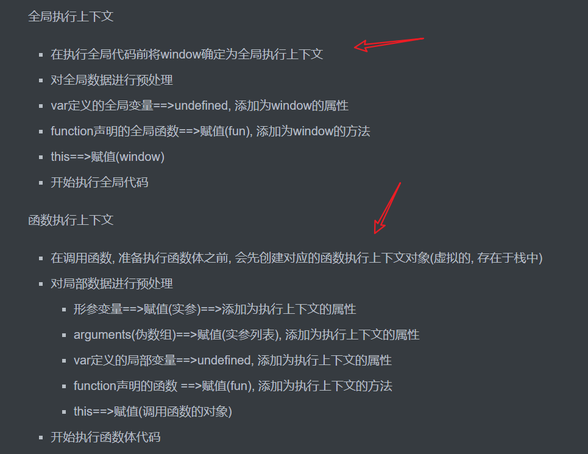

### 面向对象有哪些优势和特点

三大特点：

- 封装：将一些对象的共同特性封装到一块 -> 复用性好
- 多态：同样的动作不同的对象可以有不同的表现形式 -> 表现形式多
- 继承：继承父类的特性 -> 拓展性强

### flex 属性

align-items: 交叉轴对齐方式

justify-contet：主轴对齐方式

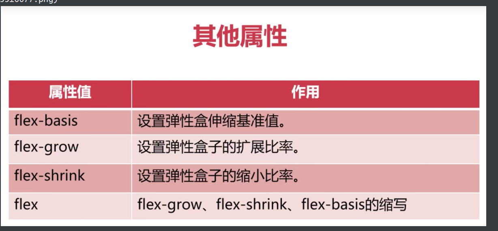

### 自己写一个 vue-cli

- 思路就是：配置好问答，通过 git 等方式拉取模板到本地

- 先有一个模板放在远程仓库
- npm init 初始化一个项目，写好入口文件和名字，npm link 到全局方便调试
- 引入依赖：comander、download-git-repo 就行

### web worker 和 web socket

#### web worker

worker.html

```js
const worker = new Worker('worker.js')
worker.postMessage('丹敏是猪')
worker.onmessage = function(e) {
    console.log(e.data);
}
```

worker.js

```js
onmessage = function(e) {
    let data = e.data
    data = data.split("").reverse().join('')
    postMessage(data)
}
```

在HTML5中，我们可以使用Web Worker创建一个“后台线程”来执行某一段耗时较长的JavaScript程序，而不会影响页面响应。Web Worker其实就是HTML5提供的“JavaScript多线程”解决方案。

Web Worker技术基本原理就是：在当前JavaScript的主线程中，使用Worker()构造函数新建一个worker实例，然后加载某一个JavaScript文件，发送给一个后台线程来处理（注意，这里是后台线程）。

#### web socket

我们知道 HTTP 协议有一个缺陷就是通信只能由客户端发起，HTTP 协议做不到服务器主动向客户端推送消息，如果服务端有连续的状态变化，如果我们想知道就非常麻烦，只能采用轮询的方式，这样不仅效率低而且非常消耗资源，而 webSocket 就这样诞生了，服务端可以主动向客户端发送消息，而客户端也可以主动向服务器发送消息，是真正的双向平等对话，属于服务器推送技术的一种。 

websocket.html

```html
<!DOCTYPE html>
<html>

<head>
	<meta charset="UTF-8">
	<title>WebSocket Chat</title>
</head>

<body>
	<script type="text/javascript">
		var socket;
		if (!window.WebSocket) {
			window.WebSocket = window.MozWebSocket;
		}
		if (window.WebSocket) {
			socket = new WebSocket("ws://localhost:8080/ws");
			socket.onmessage = function (event) {
				var ta = document.getElementById('responseText');
				ta.value = ta.value + '\n' + event.data
			};
			socket.onopen = function (event) {
				var ta = document.getElementById('responseText');
				ta.value = "连接开启!";
			};
			socket.onclose = function (event) {
				var ta = document.getElementById('responseText');
				ta.value = ta.value + "连接被关闭";
			};
		} else {
			alert("你的浏览器不支持 WebSocket！");
		}

		function send(message) {
			if (!window.WebSocket) {
				return;
			}
			if (socket.readyState == WebSocket.OPEN) {
				socket.send(message);
			} else {
				alert("连接没有开启.");
			}
		}
	</script>
	<form onsubmit="return false;">
		<h3>WebSocket 聊天室：</h3>
		<textarea id="responseText" style="width: 500px; height: 300px;"></textarea>
		<br>
		<input type="text" name="message" style="width: 300px" value="Welcome to waylau.com">
		<input type="button" value="发送消息" onclick="send(this.form.message.value)">
		<input type="button" onclick="javascript:document.getElementById('responseText').value=''" 
			value="清空聊天记录">
	</form>
	<br>
	<br>
</body>

</html>
```

webSocket.js

```js
const WebSocket = require('ws');

const server = new WebSocket.Server({ port: 8080 });

server.on('open', function open() {
  console.log('connected');
});

server.on('close', function close() {
  console.log('disconnected');
});

server.on('connection', function connection(ws, req) {
  const ip = req.connection.remoteAddress;
  const port = req.connection.remotePort;
  const clientName = ip + port;

  console.log(ip, port);

  console.log('%s is connected', clientName)

  // 发送欢迎信息给客户端
  ws.send("Welcome " + clientName);

  ws.on('message', function incoming(message) {
    console.log('received: %s from %s', message, clientName);
    
    // 广播消息给所有客户端
    server.clients.forEach(function each(client) {
      if (client.readyState === WebSocket.OPEN) {
        client.send( clientName + " -> " + message);
      }
    });

  });

});
```

### async 和 generator

tips: async await 其实就是下面这份操作的一个语法糖，牢记是在 then 回调中才执行下一步

```js
function getApi(params) {
    return new Promise((resolve) => {
      // 模拟ajax
      setTimeout(() => {
        resolve('api result: ' + params)
      }, 1000)
    })
  }
  
  function* gen(stage0) {
    console.log(stage0)
    let stage1 = yield getApi('startParams')
    console.log('stage1', stage1)
    let stage2 = yield getApi(stage1)
    console.log('stage2', stage2)
    let stage3 = yield getApi(stage2)
    console.log('stage3', stage3)
    return 'all Done!!'
  }
  
  function run(generator, v) {
    let { value, done } = generator.next(v)
    console.log(value, done, '------');
    if (!done) {
      value.then((res) => {
        run(generator, res)
      })
    } else {
      console.log(value)
    }
  }
  
  run(gen('start'))
```

### CSS3 动画、变形、过渡

#### 动画

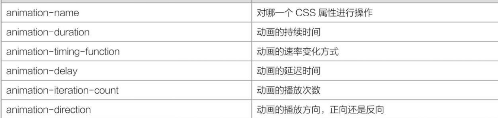


#### 变形

在CSS3中，我们可以使用transform属性来实现元素的变形效果

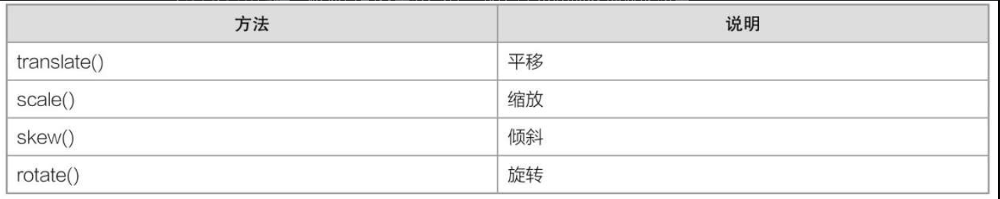

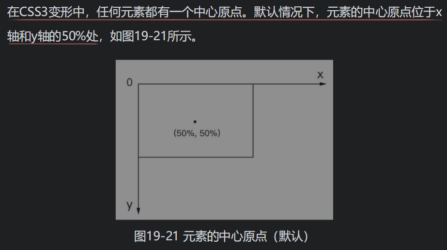

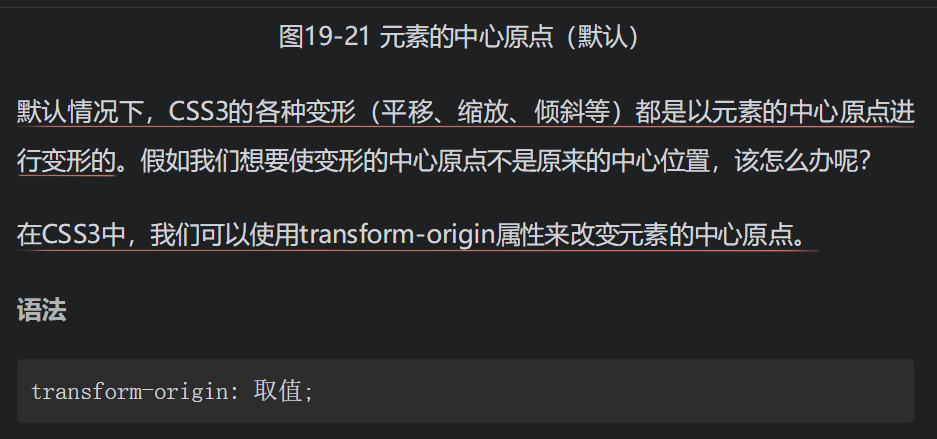

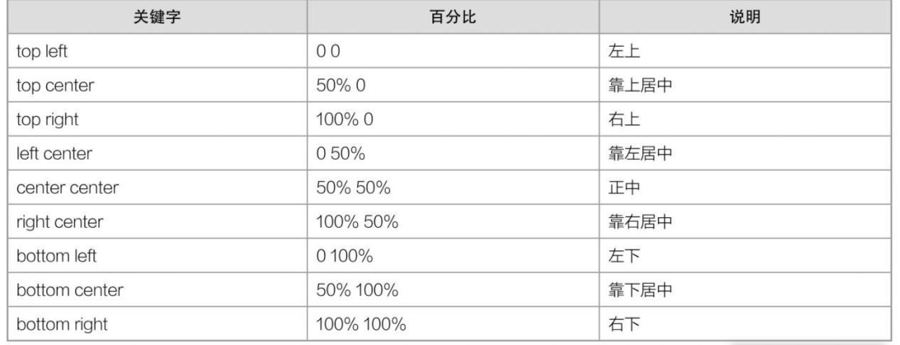

#### 过渡

在CSS3中，我们可以使用transition属性将元素的某一个属性从“一个属性值”在指定的时间内平滑地过渡到“另一个属性值”，从而实现动画效果（请字斟句酌地理解这句话，非常重要）。

CSS变形（transform）呈现的仅仅是一个“结果”，而CSS过渡（transition）呈现的是一个“过程”。这个所谓的“过程”，通俗来说就是一种动画变化过程，如渐渐显示、渐渐隐藏、动画快慢等

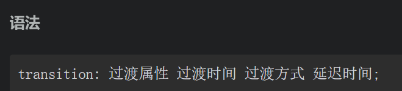

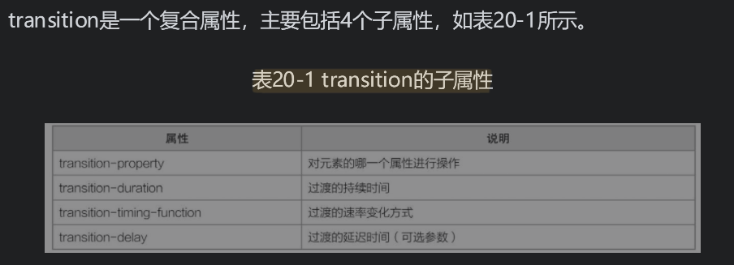

凡是涉及CSS3过渡，我们都是结合:hover伪类来实现过渡效果的

```
.father {
    width: 100px;
    height: 100px;
    background-color: pink;
    transition: background-color 1s linear 2s;
}

.father:hover {
    background-color: aqua;
}
```

### box-sizing

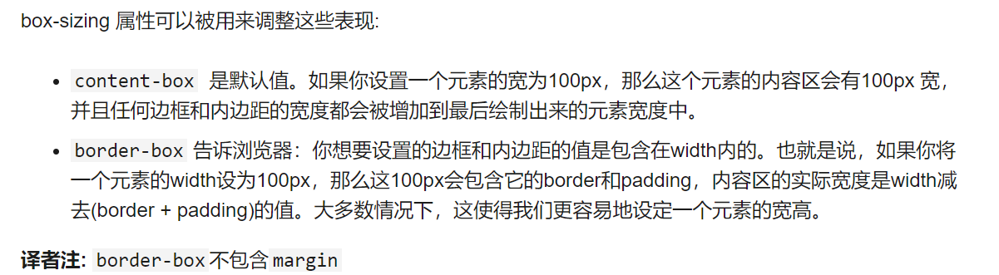

### sessionStorage 和 localStorage 的区别

- localStorage生命周期是永久，这意味着除非用户显示在浏览器提供的UI上清除localStorage信息，否则这些信息将永远存在。
- sessionStorage生命周期为当前窗口或标签页，一旦窗口或标签页被永久关闭了，那么所有通过sessionStorage存储的数据也就被清空了。
- 不同浏览器无法共享localStorage或sessionStorage中的信息。相同浏览器的不同页面间可以共享相同的 localStorage（页面属于相同域名和端口），但是不同页面或标签页间无法共享sessionStorage的信息。这里需要注意的是，页面及标 签页仅指顶级窗口，如果一个标签页包含多个iframe标签且他们属于同源页面，那么他们之间是可以共享sessionStorage的。

# 计算机网络

## HTTP发展历程和各个版本的区别

HTTP协议到现在为止总共经历了3个版本的演化

### HTTP 0.9

HTTP 0.9是第一个版本的HTTP协议，已过时。它的组成极其简单，**只允许客户端发送GET这一种请求，且不支持请求头**。由于没有协议头，造成了HTTP 0.9协议只**支持一种内容，即纯文本**。不过网页仍然支持用HTML语言格式化，同时无法插入图片。

HTTP 0.9具有典型的**无状态性**，每个事务独立进行处理，事务结束时就释放这个连接。一次HTTP 0.9的传输首先要建立一个由客户端到Web服务器的TCP连接，由客户端发起一个请求，然后由Web服务器返回页面内容，然后连接会关闭。**如果请求的页面不存在，也不会返回任何错误码。**

### HTTP 1.0

HTTP协议的第二个版本，第一个在通讯中指定版本号的HTTP协议版本，至今仍被广泛采用。相对于HTTP 0.9 增加了如下主要特性：

- 请求与响应支持头域
- 响应对象以一个响应状态行开始
- 响应对象不只限于超文本
- 开始支持客户端通过POST方法向Web服务器提交数据，支持GET、HEAD、POST方法
- 支持长连接（但默认还是使用短连接），缓存机制，以及身份认证 

### **HTTP 1.1**

HTTP协议的第三个版本，是目前使用最广泛的协议版本

HTTP 1.1引入了许多关键性能优化：keepalive连接，chunked编码传输，字节范围请求，请求流水线等

#### Persistent Connection（keepalive连接，持久连接）

允许HTTP设备在事务处理结束之后将TCP连接保持在打开的状态，避免未来的HTTP请求想要重用现在的连接，直到客户端或服务器端决定将其关闭为止。

在HTTP1.0中使用长连接需要添加请求头 Connection: Keep-Alive，而在HTTP 1.1 所有的连接默认都是长连接，除非特殊声明（ HTTP请求报文首部加上Connection: close ）

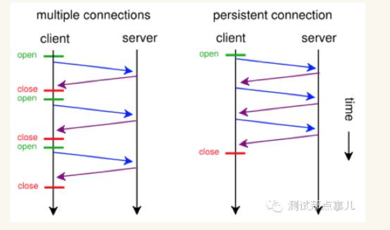

tips：多个连接和持久连接的过程，很明显后面的情况更为合理

#### chunked编码传输

该编码将实体分块传送并逐块标明长度,直到长度为0块表示传输结束, 这在实体长度未知时特别有用(比如由数据库动态产生的数据)

#### 字节范围请求

HTTP1.1支持传送内容的一部分。比方说，当客户端已经有内容的一部分，为了节省带宽，可以只向服务器请求一部分。该功能通过在请求消息中引入了range头域来实现，它允许只请求资源的某个部分。在响应消息中Content-Range头域声明了返回的这部分对象的偏移值和长度。如果服务器相应地返回了对象所请求范围的内容，则响应码206（Partial Content）

#### Pipelining（请求流水线）

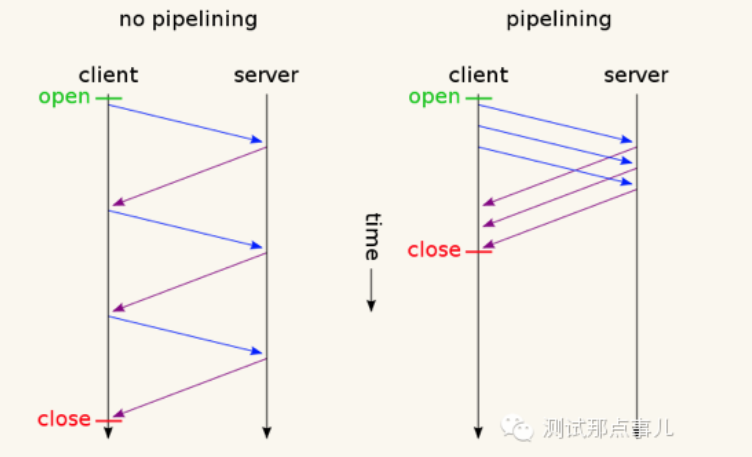

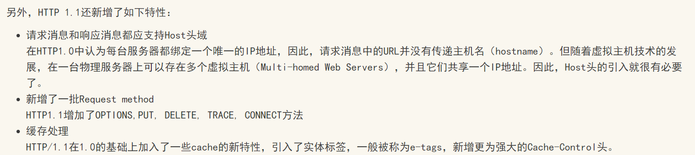

### HTTP 2.0

HTTP 2.0最大的特点: 不会改动HTTP 的语义，HTTP 方法、状态码、URI 及首部字段，等等这些核心概念上一如往常，却能致力于突破上一代标准的性能限制，改进传输性能，实现低延迟和高吞吐量。

HTTP 2.0是下一代HTTP协议，目前应用还非常少。主要特点有：

- **多路复用（二进制分帧）**
  - 之所以叫2.0，是在于新增的二进制分帧层。在二进制分帧层上， HTTP 2.0 会将所有传输的信息分割为更小的消息和帧,并对它们采用二进制格式的编码 ，其中HTTP1.x的首部信息会被封装到Headers帧，而我们的request body则封装到Data帧里面。
  - 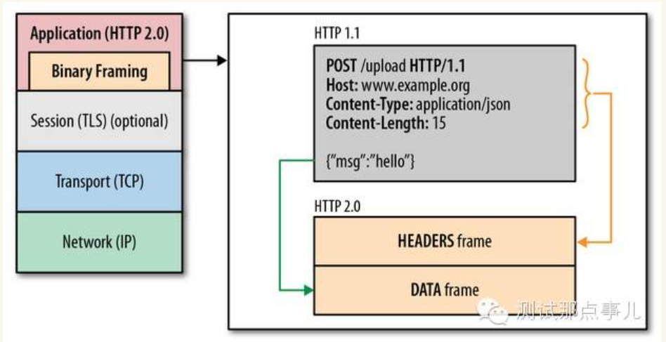
- 头部压缩（不太懂）
  - 当一个客户端向相同服务器请求许多资源时，像来自同一个网页的图像，将会有大量的请求看上去几乎同样的，这就需要压缩技术对付这种几乎相同的信息。
- 随时复位（不太懂）
  - HTTP1.1一个缺点是当HTTP信息有一定长度大小数据传输时，你不能方便地随时停止它，中断TCP连接的代价是昂贵的。使用HTTP2的RST_STREAM将能方便停止一个信息传输，启动新的信息，在不中断连接的情况下提高带宽利用效率。
- **服务器端推流: Server Push**
  - 客户端请求一个资源X，服务器端判断也许客户端还需要资源Z，在无需事先询问客户端情况下将资源Z推送到客户端，客户端接受到后，可以缓存起来以备后用。
- 优先权和依赖（不太懂）
  - 每个流都有自己的优先级别，会表明哪个流是最重要的，客户端会指定哪个流是最重要的，有一些依赖参数，这样一个流可以依赖另外一个流。优先级别可以在运行时动态改变，当用户滚动页面时，可以告诉浏览器哪个图像是最重要的，你也可以在一组流中进行优先筛选，能够突然抓住重点流。 

## HTTP 和 HTTPs 的区别

### HTTP 与 HTTPS 区别

- HTTP 明文传输，数据都是未加密的，安全性较差，HTTPS（SSL+HTTP） 数据传输过程是加密的，安全性较好。
- 使用 HTTPS 协议需要到 CA（Certificate Authority，数字证书认证机构） 申请证书
- HTTP 页面响应速度比 HTTPS 快，主要是因为 HTTP 使用 TCP 三次握手建立连接，客户端和服务器需要交换 3 个包，而 HTTPS除了 TCP 的三个包，还要加上 ssl 握手需要的 9 个包，所以一共是 12 个包。
- http 和 https 使用的是完全不同的连接方式，用的端口也不一样，前者是 80，后者是 443。
- HTTPS 其实就是建构在 SSL/TLS 之上的 HTTP 协议，所以，要比较 HTTPS 比 HTTP 要更耗费服务器资源，但是相对的它也更加安全

## HTTPs

相对于 HTTP 的明文传输，HTTPs 利用了对称加密（用同一个私钥加密和解密）和非对称加密（用公钥加密用私钥解密）避免数据在传输过程中被窃取，另外HTTPs客户端可以通过服务端SSL证书（向CA机构申请）确定服务端身份，而服务端数据传输给客户端会通过会话密钥加密传输所以不用担心数据被窃取。

- 反问：什么是非对称加密？我觉得可以这样理解非对称加密，通信的双方都拥有自己的公钥和私钥，然后将公钥暴露出来，要传输数据的一方利用对方的公钥对数据进行加密，那么能解密这份数据的也就只有拥有对应的私钥的人，也就是接受数据的一方。
- 反问：会话密钥是如何获取的？这涉及到TSL握手的过程，
  - 首先客户端（client hello）会将自己的TSL版本和加密套件，生成一个随机数传送给服务端，(第一次握手)
  - 服务端（server hello）收到后会响应自己的TSL版本和加密套件，生成的一个随机数给客户端，
  - 然后响应自己的证书;公钥;还有 server hello done（第二次握手）
  - 接着客户端生成第三个随机数，并用刚才服务端的公钥进行加密生成预主密钥发送给服务端（第三次握手）
  - 然后服务端利用自己私钥解密也就知道预主密钥了，因为没有直接进行传输现在就只有服务端和客户端知道这个预主密钥
  - 然后双方再利用第一个随机数和第二个随机数加预主密钥生成会话密钥，后续双方就采用对称加密就可以保证数据的安全传输了

## TCP 三次握手和四次挥手

### 三次握手

我先简单的描述一下三次握手的一个过程：首先客户端会告诉服务端我要建立TCP连接，服务端再收到客户端的请求后会响应说我收到你的请求了，然后客户端告诉服务端那我们正式建立TCP连接。

不过我还没讲到握手的核心，**握手的核心在于怎么判断出那些请求或者那些响应需要丢弃**，这个时候就需要标识去确认！那么这个标识怎么生成呢？其实在TCP第一次握手的时候客户端会开启SYN(Synchronization)控制位表示想要与服务端进行数据同步，并且传送一个序号，服务端收到客户端的请求后会开启SYN，和ACK(AcKnowledgement表示确认的意思)控制位还有生成确认号(客户端生成的序列表+1)，序列号一并响应给客户端，客户端就可以通过服务端传递回来的确认号就可以判断是否是自己要通信的服务端，在确定后他会开起ACK控制位，并将刚才对方传递过来的序号＋1生成确认好传递给服务端，服务端收到响应报文，通过确认号就可以判断出是否是要和自己建立TCP的客户端，如果是，TCP握手就成功了，两边不仅能通过序列号还可以通过控制位来区别进行到哪个步骤。


#### 为什么是三次握手？

要知道为什么我觉得我们可以先假定一种异常情况，A发出的第一个连接请求在某些网络结点长时间滞留了，以致延误到连接释放以后的某个时间才到达B。本来这应该是一个早已失效的报文段。但B收到此失效的连接请求报文段后，就误认为是A又发出一次新的连接请求。于是就向A发出确认报文段，同意建立连接，这样就会造成B资源的占用，所以才要进行三次握手让A做一个确认连接建立。

### 四次挥手

因为是全双工通信，双方在通信完毕后都能主动要求关闭要求，我们假设是客户端主动发起关闭请求，

第一次挥手：那么它会开启FIN(finish表示结束的意思)和ACK两个控制位还有发送序号和确认号(这两个数字在通信的过程中不端递增，使用最后一次通信的)，

第二次挥手：服务端收到后会开启ACK控制和发送序号(用对方传来的确认号)和确认号(用对方传来的序号+1),

第三次挥手：服务端在处理完数据后，会再次发送ACK控制位还有FIN控制位来进行最后的确认（确认号和序号不需要改变），

第四次挥手： 开启ACK控制位，序号：对方确认号＋1，确认号:对方序号＋1

反问:为什么要四次挥手：假如说在一边提出连接关闭后就关闭通信的话，会导致另一边可能还存在没发送的数据通信的关闭的情况，设置四次挥手可以避免情况，一方提出申请后等待对方处理完，再关闭。

反问：为什么客户端最后回复ACK后要进行等待，避免服务端没有收到ACK重发FIN和ACK的情况，影响下次通信。


#### 为什么要进行四次挥手？

因为TCP是全双工通信，其实觉得可以客户端和服务端各自的两次挥手，双方在处理完自己的数据后都可以主动断开自己的连接，避免出现说我处理完数据就直接就断开连接，不管对方数据有没有处理完的情况。

## TCP 和 UDP 的区别

### UDP

用户数据报协议UDP只在IP的数据报服务之上增加了很少一点的功能，这就是复用和分用的功能以及差错检测的功能。

#### UDP 的主要特点是：

- (1) **UDP是无连接的**：即发送数据之前不需要建立连接（当然，发送数据结束时也没有连接可释放），因此减少了开销和发送数据之前的时延。
- (2) UDP使用尽最大努力交付：即不保证可靠交付，因此主机不需要维持复杂的连接状态表（这里面有许多参数）(所以丢包率高一些)
- (3) UDP是面向报文的：发送方的UDP对应用程序交下来的报文，在添加首部后就向下交付IP层。UDP对应用层交下来的报文，既不合并，也不拆分，而是保留这些报文的边界。因此，应用程序必须选择合适大小的报文。若报文太长，UDP把它交给IP层后，IP层在传送时可能要进行分片，这会降低IP层的效率。反之，若报文太短，UDP把它交给IP层后，会使IP数据报的首部的相对长度太大，这也降低了IP层的效率。

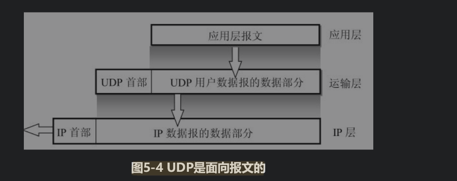

- (4) **UDP没有拥塞控制**，因此网络出现的拥塞不会使源主机的发送速率降低。这对某些实时应用是很重要的。**很多的实时应用（如IP电话、实时视频会议等）要求源主机以恒定的速率发送数据，并且允许在网络发生拥塞时丢失一些数据，但却不允许数据有太大的时延。UDP正好适合这种要求。**但是虽然某些实时应用需要使用没有拥塞控制的UDP，但当很多的源主机同时都向网络发送高速率的实时视频流时，网络就有可能发生拥塞，结果大家都无法正常接收。因此，不使用拥塞控制功能的UDP**有可能会引起网络产生严重的拥塞问题**。
- (5) UDP支持一对一、一对多、多对一和多对多的交互通信。
- (6) UDP的首部开销小，只有8个字节，比TCP的20个字节的首部要短。

#### UDP 的首部格式

用户数据报UDP有两个字段：数据字段和首部字段。首部字段很简单，只有8个字节(图5-5)，由四个字段组成，每个字段的长度都是两个字节。各字段意义如下：

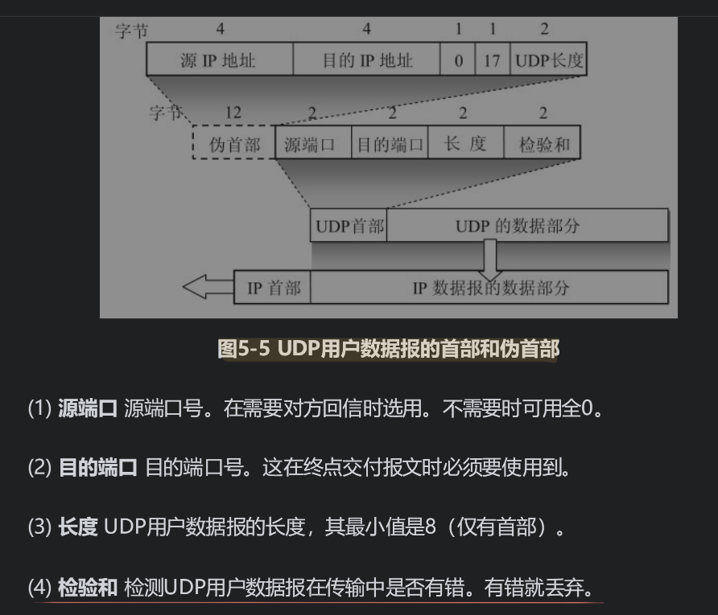

### TCP

#### TCP 最主要的特点

- TCP是**面向连接**的运输层协议:
  -  这就是说，应用程序在使用TCP协议之前，必须先建立TCP连接。在传送数据完毕后，必须释放已经建立的TCP连接。也就是说，**应用进程之间的通信好像在“打电话”：通话前要先拨号建立连接，通话结束后要挂机释放连接。**
- TCP提供**可靠交付**的服务: 
  - 通过TCP连接传送的数据，无差错、不丢失、不重复、并且按序到达(因为它的重传机制)。
- TCP提供**全双工通信**：
  - TCP允许通信双方的应用进程在任何时候都能发送数据。TCP连接的两端都设有发送缓存和接收缓存，用来临时存放双向通信的数据。在发送时，应用程序在把数据传送给TCP的缓存后，就可以做自己的事，而TCP在合适的时候把数据发送出去。在接收时，TCP把收到的数据放入缓存，上层的应用进程在合适的时候读取缓存中的数据。
- **面向字节流**：
  - TCP不保证接收方应用程序所收到的数据块和发送方应用程序所发出的数据块具有对应大小的关系（例如，发送方应用程序交给发送方的TCP共10个数据块，但接收方的TCP可能只用了4个数据块就把收到的字节流交付上层的应用程序）。但接收方应用程序收到的字节流必须和发送方应用程序发出的字节流完全一样。当然，接收方的应用程序必须有能力识别收到的字节流，把它还原成有意义的应用层数据。

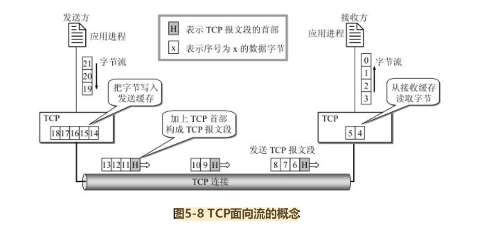

tips：TCP和UDP在发送报文时所采用的方式完全不同。TCP并不关心应用进程一次把多长的报文发送到TCP的缓存中，而是根据对方给出的窗口值和当前网络拥塞的程度来决定一个报文段应包含多少个字节（UDP发送的报文长度是应用进程给出的）。如果应用进程传送到TCP缓存的数据块太长，TCP就可以把它划分短一些再传送。如果应用进程一次只发来一个字节，TCP也可以等待积累有足够多的字节后再构成报文段发送出去。

#### 可靠传输的原理

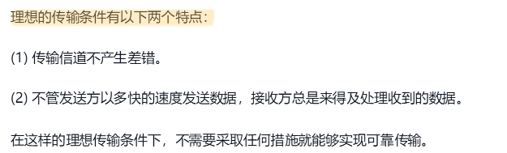

## cookie、session、Token

- cookie 其实就是一种数据的载体，每次发请求的时候都会默认添加到请求头中
- 而 session 是保存在服务端的，服务端可以利用 session(保存用户信息) 保持登录状态，服务端生成 session 后会返回一个 sessionID 给客户端，客户端在请求时利用 cookie 作为载体传送给服务端
- Token(也是记录着用户信息等，可以用来保持登录状态) 的话是由服务端生成，但是存储在客户端的(可以用cookie或者storage存)，一般我们存在storage里，可以防止csrf的攻击，cookie会自动添加到请求头

# 操作系统

## 堆和栈的概念

我觉得可以把栈理解成成有序的格子，容量小但是因为它的有序性读取起来也快，而堆是一大块区域，虽然容量大但是找一个东西很麻烦，读取慢，然后我们js中基本类型是存储在栈中的，而引用类型是存储在堆里面的，不过它的引用仍然是存储在栈内存中的。

# 数据结构与算法

## 打印三角形

```js
function triangle(n) {
    for ( let i = 1; i <= n; i++ ) {
        let str = ''
        // 确定空格
        for ( let j = 0; j < n - i; j++) {
            str += ' '
        }

        // 确定星星
        for ( let k = 0; k < 2*i - 1; k++ ) {
            str += '*'
        }
        console.log(str);
    }
}

triangle(5)
```


## 链表和数组的区别

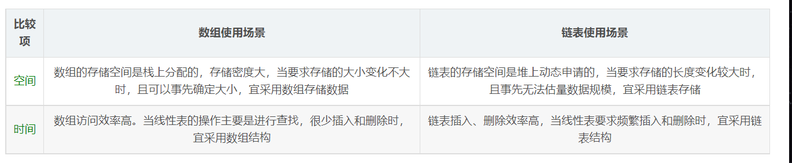

## 时间复杂度

极限的执行次数取它的最高次项并去掉它的系数

# Vue

## vue 的生命周期

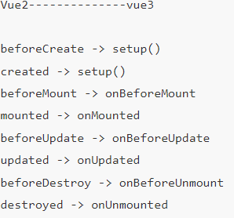

## 讲一下 setup

首先是它的执行时机: 在 beforeCreate 之前执行一次，此时 this 是 undefined

另一个是它的参数: 

- props: 值为对象，包含: 组件外部传递过来，且组件内部声明接收了的属性
- context: 上下文对象
  - attrs: 值为对象，包含：组件外部传递过来，但没有在props配置中声明的属性, 相当于 ```this.$attrs```。
  - slots: 收到的插槽内容, 相当于 ```this.$slots```。
  - emit: 分发自定义事件的函数, 相当于 ```this.$emit```。

# 腾讯一面

## 双向绑定原理

我觉得要了解双向绑定原理可以从vue里面一个非常经典的指令出发也就是v-model，比如我们在input 绑定v-model：value，然后同时在它上方搞个h1然后它也展示value吧，然后我们在input修改数据的同时我们发现上面的数据也会发生变化，这到底发什么了什么呢？如果我们不用vue框架用原生的js去实现我们会怎么实现无非就是监听输入框的变化，然后就给h1的innerhtml改下值嘛，然后要是有很多个像h1的标签呢，我们难道每个标签都自己手动去获取，如果是后面通过服务器的数据动态渲染的标签怎么办，有很多时候我们是无法一次性知道有那些标签引用了这个值的，那么有没有一种方法可以自动去完成这些操作呢？这就要引入一个叫做数据劫持的概念了，vue源码里它是利用 object.defineProperty 去实现的，什么是数据劫持呢，官方术语就是在get中的收集依赖在set中触发依赖，如果要简单的说就是如果有人要拿这个值的时候我们就把这个人记住，然后修改这个值的时候通知所有拿过这个值的人去做一个更新，这样就能实现双向绑定了嘛。

## eventloop题目

```js
console.log("1");
 
setTimeout(function() {
    console.log("2");
}, 0);
 
new Promise(res=>{
console.log(6); 
res() // 说明promise已经是成功状态了，但是then的回调仍然要等到调用栈的东西执行完，所以5要先执行
}).then(function() {
        console.log("3");
}).then(function() {
        console.log("4");
});
 
console.log("5");
```

165342

```
async function async2() {
    console.log('async2')
}

async function async1() {
  await async2()
  console.log(77);
}
async1()
console.log(666);
```

async2 666 77

## 事件机制

从根本上讲，浏览器的事件机制是很简单的。它是在指**定的DOM 结点上为指定的事件注册一个处理函数，**当事件发生的时候，如果存在处理函数，则调用。

## 如何阻止a标签跳转

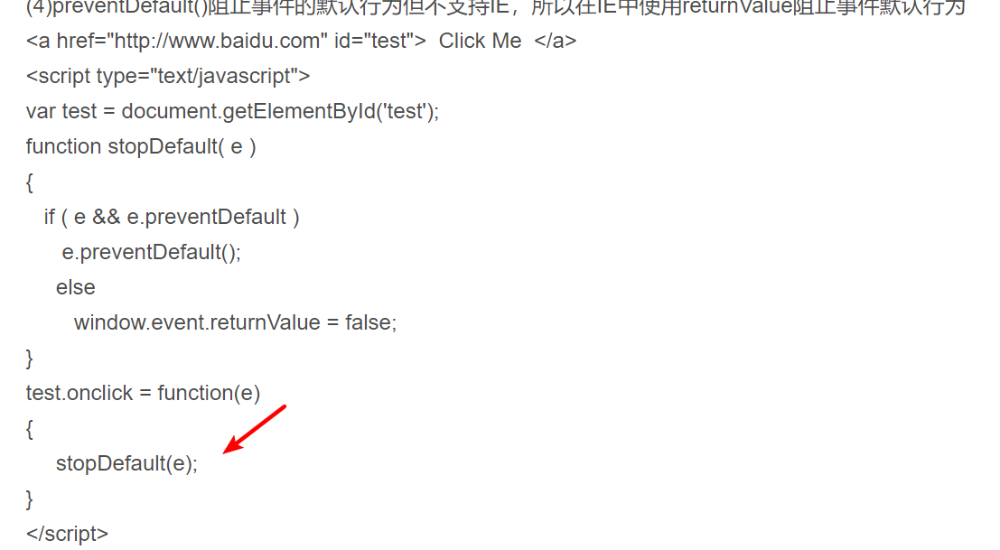


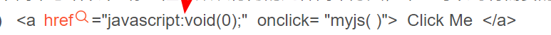

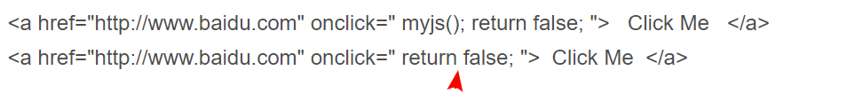

## 数组去重

```js
    var arr = [{
      key: '01',
      value: '乐乐'
    }, {
      key: '02',
      value: '博博'
    }, {
      key: '03',
      value: '淘淘'
    }, {
      key: '04',
      value: '哈哈'
    }, {
      key: '01',
      value: '乐乐'
    }];

    // 方法1：利用reduce方法遍历数组,reduce第一个参数是遍历需要执行的函数，第二个参数是item的初始值
    var obj = {};
    temp = arr.reduce(function (item, next) {
      console.log(item, next);
      obj[next.key] ? '' : obj[next.key] = true && item.push(next);
      return item;
    }, []);
    console.log(temp)
```

## 深度拷贝存在循环引用

```js
      function deepCopy(object) {
        const ans = {}

        Object.keys(object).forEach( item => {

          if ( Object.prototype.toString.call(object[item]) === '[object Object]') {
            if (map.get(object[item]) === true) {
              ans[item] = object[item]
              return
            }
            map.set(object[item], true)
            ans[item] = deepCopy(object[item])
          } else {
            ans[item] = object[item]
          }
        } )

        return ans
      }
```

## 扁平化数组

```js
var array = [1, [2, [3, [4, 5]]]];

function flatArr(array) {
    let ans = []
    for ( let i = 0; i < array.length; i++ ) {
        if ( array[i] instanceof Array ) {
            ans = ans.concat(flatArr(array[i]))
            // 或者 ans = [...ans, ...flatArr(array[i])]
        } else {
            ans.push(array[i])
        }
    }

    return ans
}

console.log(flatArr(array));
```

## 400状态码一般是什么问题，如何排查错误

客户端请求的语法错误，服务器无法理解

## session 是什么，有什么缺点

session 是保存在服务端的，服务端可以利用 session(保存用户信息) 保持登录状态，服务端生成 session 后会返回一个 sessionID 给客户端，客户端在请求时可以利用 cookie 作为载体传送给服务端; 缺点就是要保存在服务端嘛

## 垃圾回收机制

### v8 的内存分代

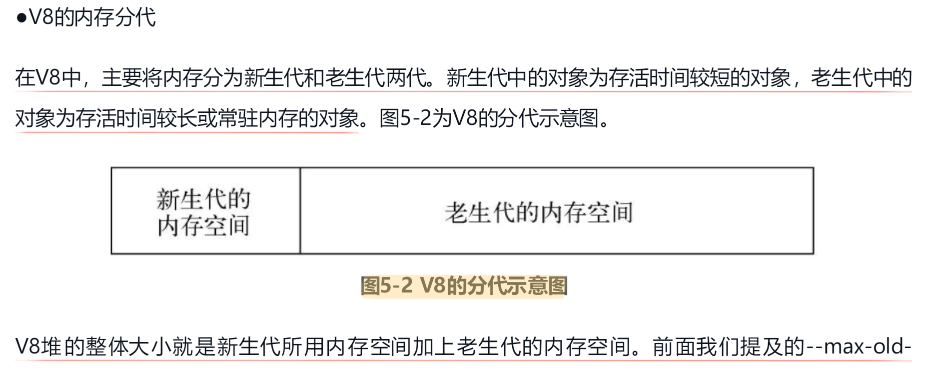

#### **新生代内存用Scavenge（skævɪndʒ）算法**

##### 思路

它将堆内存一分为二，在这两个空间中，只有一个处于使用中，另一个处于闲置状态。一个称为 From 一个称为 To 当我们分配对象时会在 from 中进行分配，当开始进行垃圾回收机制的时候，会检查 From 空间中的存活对象，这些存活对象将为被复制到 To 空间中，然后释放到 From 里面失活的对象，接着 from 和 to 的角色发生调换，from 变成 to， to 变成 from；

##### 晋升

当一个对象经过多次复制依然存活时，它将会被认为是生命周期较长的对象。这种较长生命周期的对象随后会被移动到老生代中，采用新的算法进行管理。对象从新生代中移动到老生代中的过程称为晋升。

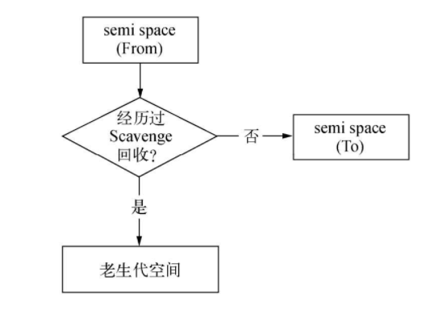

一个判断条件是To空间的内存占用比。当要从From空间复制一个对象到To空间时，如果To空间已经使用了超过25%，则这个对象直接晋升到老生代空间中

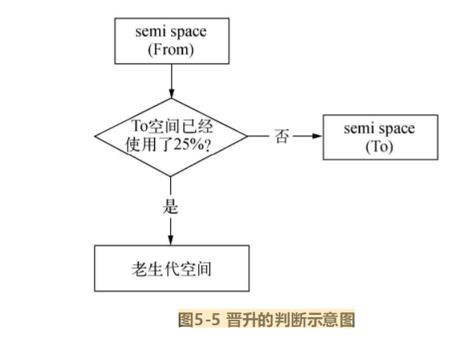

##### 缺点

这个算法的缺点就是只能使用堆内存的一半，典型的牺牲空间换取时间的算法

#### 老生代内存主要使用mark-sweep & mark-compact

标记清除 标记紧凑

tips：对于老生代中的对象，由于存活对象占较大比重，再采用Scavenge的方式会有两个问题：一个是存活对象较多，复制存活对象的效率将会很低；另一个问题依然是浪费一半空间的问题

#### mark-sweep

Mark-Sweep在标记阶段遍历堆中的所有对象，并标记活着的对象，在随后的清除阶段中，只清除没有被标记的对象

#### mark-compact

Mark-Sweep最大的问题是在进行一次标记清除回收后，内存空间会出现不连续的状态。这种内存碎片会对后续的内存分配造成问题，因为很可能出现需要分配一个大对象的情况，这时所有的碎片空间都无法完成此次分配，就会提前触发垃圾回收，而这次回收是不必要的。

为了解决Mark-Sweep的内存碎片问题，Mark-Compact被提出来。Mark-Compact是标记整理的意思，是在Mark-Sweep的基础上演变而来的。它们的差别在于对象在标记为死亡后，在整理的过程中，将活着的对象往一端移动，移动完成后，直接清理掉边界外的内存。

#### Incremental Marking（增量标记）

为了降低全堆垃圾回收带来的停顿时间，V8先从标记阶段入手，将原本要一口气停顿完成的动作改为增量标记（incremental marking），也就是拆分为许多小“步进”，每做完一“步进”就让JavaScript应用逻辑执行一小会儿，垃圾回收与应用逻辑交替执行直到标记阶段完成

**什么是全停顿？**

为了降低全堆垃圾回收带来的停顿时间，V8先从标记阶段入手，将原本要一口气停顿完成的动作改为增量标记（incremental marking），也就是拆分为许多小“步进”，每做完一“步进”就让JavaScript应用逻辑执行一小会儿，垃圾回收与应用逻辑交替执行直到标记阶段完成

在V8的分代式垃圾回收中，一次小垃圾回收只收集新生代，由于新生代默认配置得较小，且其中存活对象通常较少，所以即便它是全停顿的影响也不大。但V8的老生代通常配置得较大，且存活对象较多，全堆垃圾回收（full垃圾回收）的标记、清理、整理等动作造成的停顿就会比较可怕，需要设法改善。

#### 总结

要将垃圾回收机制我觉得可以分为四个点讲吧，

第一点就是在 v8 中主要将内存分为新生代和老生代两代，顾名思义就是新生代中的对象为存活时间较短的对象，然后老生代中的对象为存活时间较长或常驻内存的对象

第二点就是我们要知道新生代内存中主要采用 scavenge 算法也就是打扫算法，它将空间分为两部分一个 from 空间 一个 to 空间，一个处于使用中一个处于闲置状态，当我们开始进行垃圾回收机制的时候，会先检查 from 空间的存货对象，这些存货对象将被复制到 to 空间中，然后释放 from 里面的对象，接着两个空间的角色发送调换

第三点就是老生代内存中主要采用的是标记清除和标记紧凑算法，在标记阶段会遍历堆中的所有对象，并标记活着的对象，在随后清除中，只清除没有标记的对象，但是有一个问题就是会导致内存空间出现不连续状态，当出现要分配一个大对象的情况时，就会使用紧凑算法，将活着的对象往一端移动，移动完成后去清除掉边界外的内存

第四个点就是解决全停顿问题，采用了增量标记的方式，就是将一口气要完成的动作，分为很多个步骤完成，垃圾回收一会，就让js应用逻辑执行一会

##  浏览器渲染原理

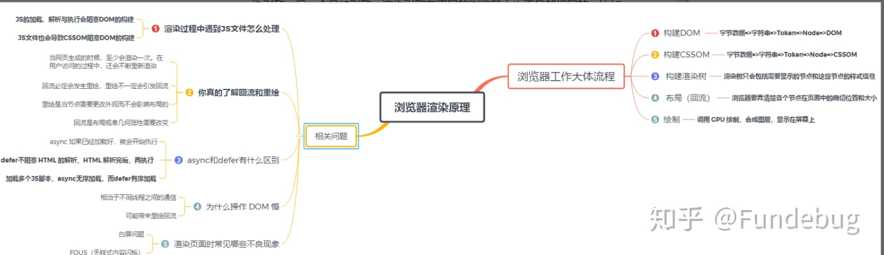

### **总结**

可以分成五个部分第一就是构建 dom ->  然后构建 cssom -> 结合 dom 和 cssom 生成渲染树 -> 开始布局 -> 然后绘制到页面上

- CSSOM会阻塞渲染，只有当CSSOM构建完毕后才会进入下一个阶段构建渲染树。
- 通常情况下DOM和CSSOM是并行构建的，但是当浏览器遇到一个script标签时，DOM构建将暂停，直至脚本完成执行。但由于JavaScript可以修改CSSOM，所以需要等CSSOM构建完毕后再执行JS。
- 如果你想首屏渲染的越快，就越不应该在首屏就加载 JS 文件，建议将 script 标签放在 body 标签底部或者利用defer属性。

## 浏览器输入URL到网页完全呈现的过程

我觉得整体可以分为六个步骤吧

- DNS解析——解析域名，获取对应的ip地址
- TCP连接——TCP三次握手
- 浏览器发送http请求
- 服务器处理请求并返回http报文
- 浏览器解析返回的数据并渲染页面
- 断开连接：TCP四次挥手

## 总结

### vue-router 原理

#### hash 路由

通过 window.location.hash（跳转） window.location.href（重定向） window.onhaschange（监听hash变化）

#### history 路由

通过 window.history.pushState（跳转） 和 replaceState（重定向） 以及 back（返回） state（监听变化）

```js
    window.history.pushState('123', '123', '666')
    window.addEventListener('message', function() {
        console.log(window.history.state, 888);
    })

    document.getElementById('button').onclick = () => { 
        
        window.history.back()
        window.postMessage(window.history.state, '*')
        console.log(777);
       
    }
```

### fech请求

```js
// fetch 不管请求处理成功还是失败，都会触发promise的resolve状态回掉。
// fetch只有当网络故障导致请求发送失败或者跨域的时候才会触发reject的逻辑。
fetch('http://127.0.0.1:8000/fetch-server?vip=10', {
    //请求方法
    method: 'POST',
    //请求头
    headers: {
        name:'atguigu'
    },
    //请求体
    body: 'username=admin&password=admin'
}).then(response => {
    // return response.text();
    return response.json();
}).then(response=>{
    console.log(response);
});
```

### for in 和 for of

- for in: 会遍历到原型上的方法，遍历的是 key，可以利用 hasownProperty 去判断，只输出自身属性
- for of: 只能遍历有迭代器的对象，而且是遍历出元素值


### cookie 和 session、local 区别

4k/5MB/5MB

### 304 是协商缓存还是强缓存

是协商缓存，200 是强缓存

# 欢聚一面

## 清除浮动

- 额外标签或者伪元素clear：both：本质就是闭合浮动， 就是让父盒子闭合出口和入口，不让子盒子出来
- 触发父盒子的BFC

## 节流和防抖

节流：只触发最后一次

```js
  function limitSend() {
    // console.log(123);
    let timer = null
    return function() {
      if (timer) {
        clearTimeout(timer)
      }
      timer = setTimeout(function() {
        console.log(123);
      }, 1000)
    }
  }

  const test = limitSend()
  document.addEventListener('click', function() {
    test()
  })
```

防抖：一定频率内只触发一次

```js
  function limitSend() {
    // console.log(123);
    let timer = null
    return function() {
      if (timer) {
        return
      }
      timer = setTimeout(function() {
        timer = null
        console.log(123);
      }, 1000)
    }
  }

  const test = limitSend()
  document.addEventListener('click', function() {
    test()
  })
```

# AJAX

## 简单请求和复杂请求

### 简单请求

1、请求方法是以下三种方法之一：GET、POST、HEAD。

2、不能自定义请求头header；不得人为设置该集合之外的其他响应首部字段。该集合为：Accept、Accept-Language、Content-Language、Content-Type

3、Content-Type 的值仅限于下列三者之一：

- text/plain
- multipart/form-data
- application/x-www-http-urlencoded

4、请求中的任意XMLHttpRequestUpload 对象均没有注册任何事件监听器；XMLHttpRequestUpload 对象可以使用 XMLHttpRequest.upload 属性访问

5、请求中没有使用 ReadableStream 对象

简单请求的发送从代码上来看和普通的XHR没太大区别，但是HTTP头当中要求总是包含一个域（Origin）的信息。该域包含协议名、地址以及一个可选的端口。不过这一项实际上由浏览器代为发送，并不是开发者代码可以触及到的。

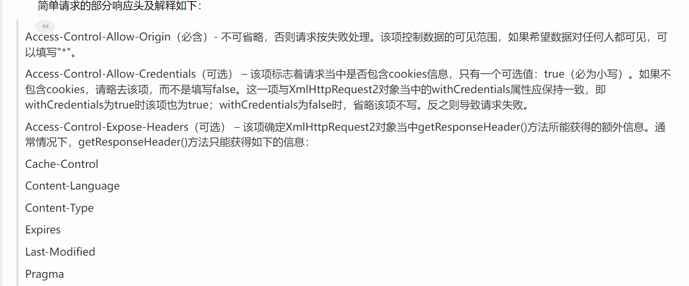

### 复杂请求

简单来说，任何不满足上述简单请求要求的请求，都属于复杂请求。复杂请求在正式请求前都会有预检请求，在浏览器中都能看到有OPTIONS请求，用于向服务器请求权限信息的。

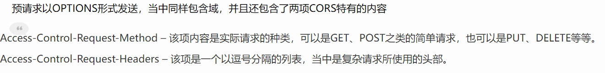

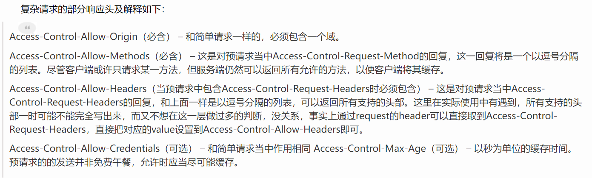

# 跨域

## 反向代理原理

其实就是利用服务端之间不会由跨域问题来解决的，客户端去请求代理服务器，由代理服务器去接收和发起真实请求，

# 浏览器

## 页面间通信

### 广播形式

#### BroadcastChannel（广播频道）

```js
// 发送
const bc = new BroadcastChannel('我是 tag 1');
console.log(bc.name);
bc.postMessage('我是 tag 1');
bc.close()
// 关闭
bc.postMessage('我是 tag 1 ---');

// 接收
const bc = new BroadcastChannel('我是 tag 1');
bc.onmessage = function (e) {
    const data = e.data;    
    console.log(data);
};
```

#### LocalStorage

```js
// 发送
document.getElementById('test').addEventListener('click', function() {
    window.localStorage.setItem(Math.random(), Math.random())
})

// 接收
window.addEventListener('storage', function (e) {
   console.log(e.storageArea);
})
```

#### service worker

### 共享存储方式

利用 cookie 和 indexdb，不断的轮询判断数据有没有变化

### 通过 iframe 可跨域

```js
// 接收
window.addEventListener('message', function (e) {
    // …… do something
});
// 父发送
window.frames[0].window.postMessage(mydata, '*');

// 子接收
window.addEventListener('message', function (e) {
    // …… do something
});
// 子发送
window.parent.postMessage(mydata, "*");
```

### web Socket

在服务端设置监听

# ES6

## 类的继承

```js
class parent {
    constructor(name) {
        this.name = name
        this.val = 123
    }

    parentMethod() {
        console.log(this.val);
    }
}

class son extends parent {
    constructor(name) {
        super(name) // 本质 parent.constructor.call(this)
        this.sonName = name
        this.val = 456
        super.parentMethod() // 本质 parent.protatype.parentMethod.call(this)
    }

    sonMethod() {
        super.parentMethod()
    }
}

const sonObject = new son('chen')
console.log(sonObject);

sonObject.sonMethod()
```

tips:

- 主要就是配合 super 和 extends 实现继承
- 子类的构造方法中要优先实现 super 方法不然会报错

## TS 中的类

**定义只读属性**

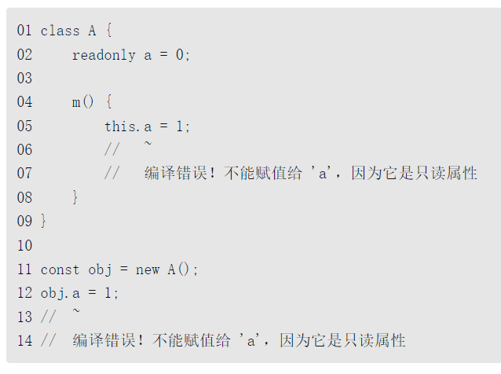

**对成员增加了可访问性**

public、protected、private

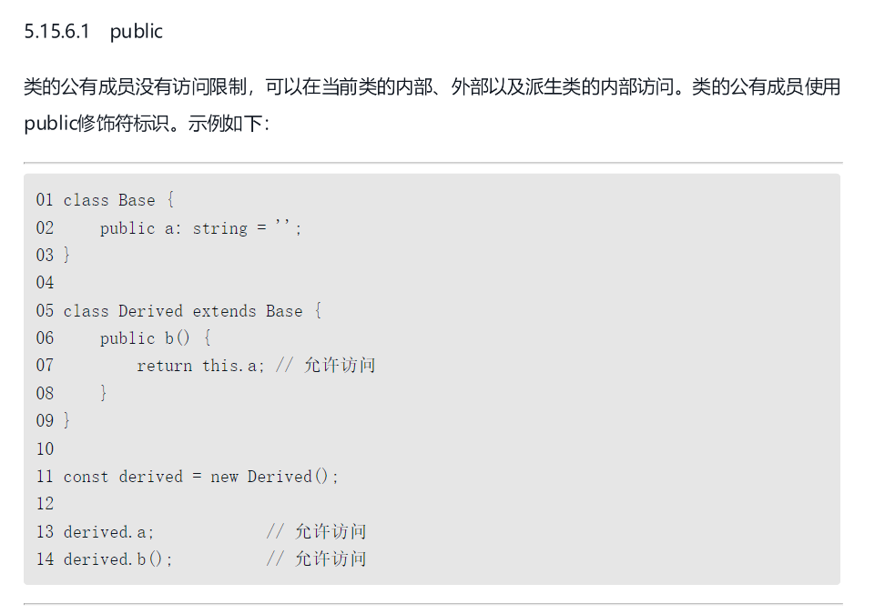

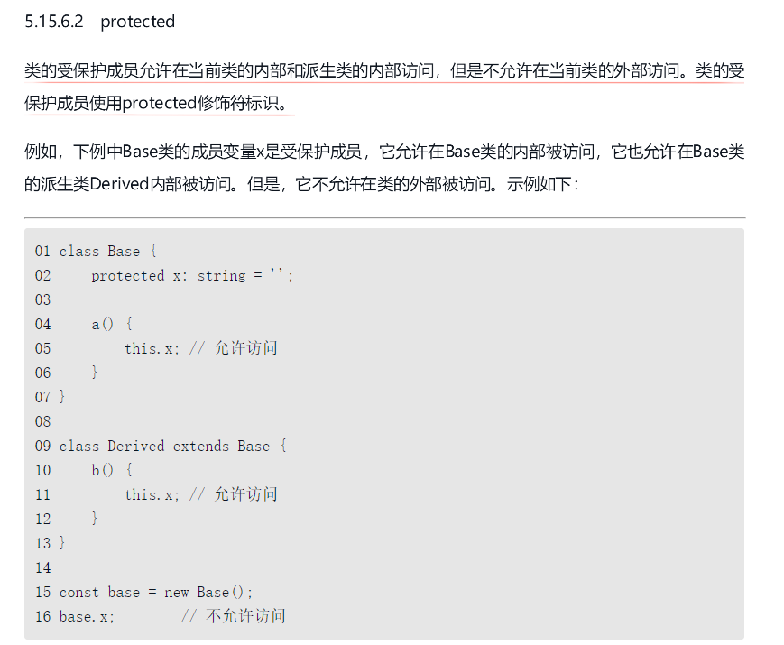

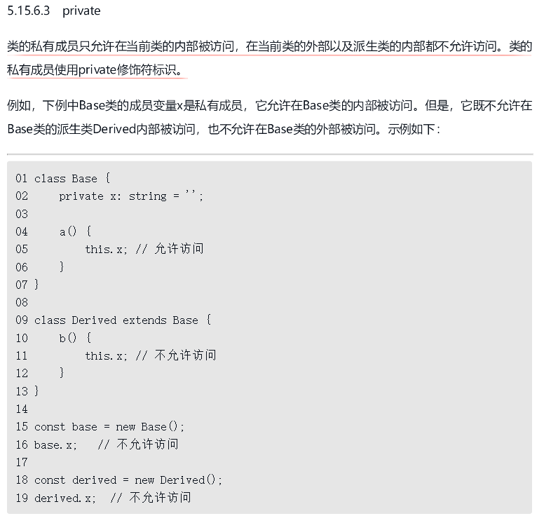

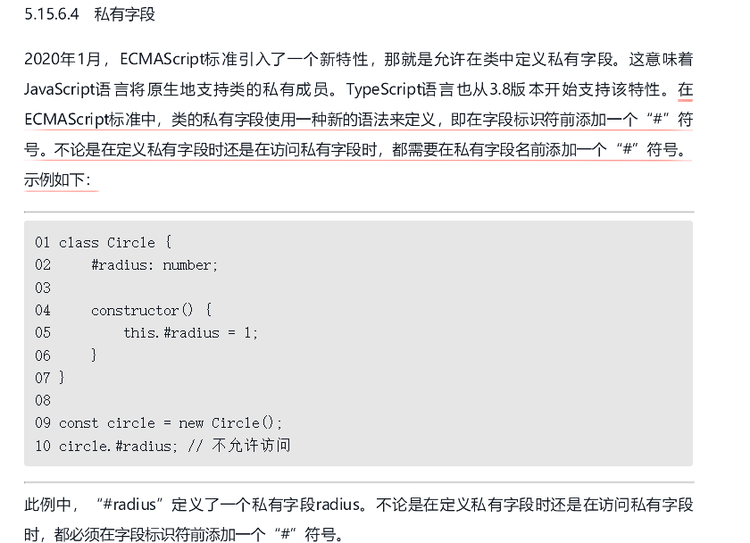

# 项目部署

## 线上排错

你首先得统计错误吧，简单的可以利用 try catch，利用鼎鼎有名的 window.error 你甚至可以拿到错误的url，和行数

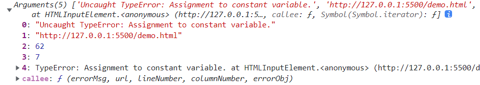

有必要的时候可以做一些埋点去记录用户的行为，调用的接口等，方便我们去复现错误

再有可能排错会不会是用户机型出了问题，用 navigator.userAgent 去获取用户机型

# git

## merge 和 rebase 的区别

merge 是利用两个最新的修改合并后生成的最新代码

而 rebase 是汇成一条线，你在这个分支的最新修改是放在前面的，提取公共部分 -> 要被合并部分 -> 本分支的最新修改

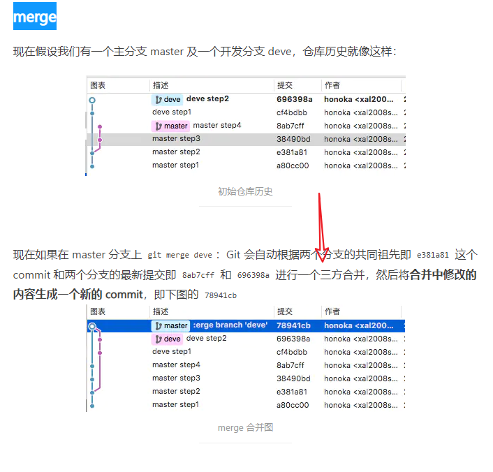

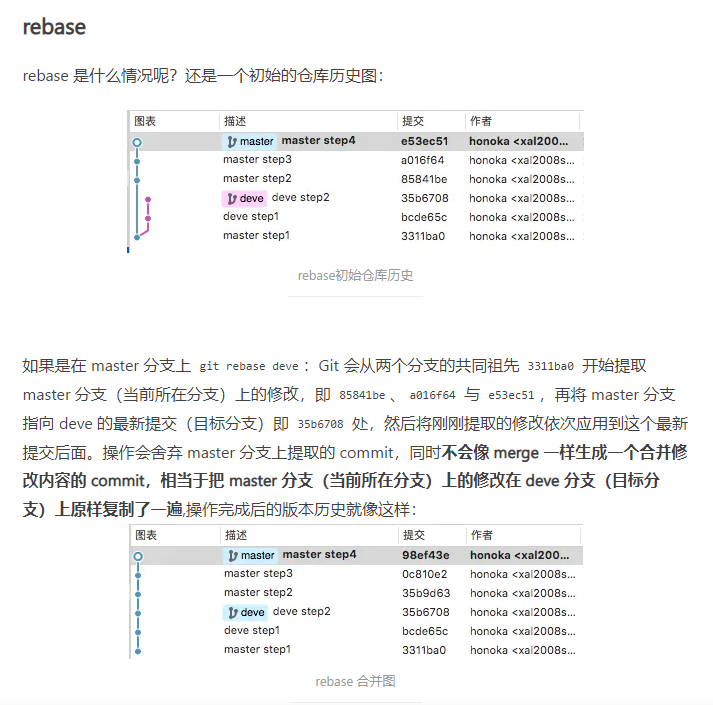

# node

## 创建子进程 spawn、exec、fork

与 exec  相比 spawn 可以做到实时打印，而他需要等到执行完一次性将结果反馈过来

fork会创建两个node进程，而上面的api不会，你可以通过 process.pid 观察到这两个的进程不一样，注意它是异步执行的

# 腾讯音乐

## 一面不会的题

### 状态码204 

HTTP **`204 No Content `**成功状态响应码，表示该请求已经成功了，但是客户端客户不需要离开当前页面。默认情况下 204 响应是可缓存的。一个 [`ETag`](https://developer.mozilla.org/zh-CN/docs/Web/HTTP/Headers/ETag) 标头包含在此类响应中。 

使用惯例是，在 [`PUT`](https://developer.mozilla.org/zh-CN/docs/Web/HTTP/Methods/PUT) 请求中进行资源更新，但是不需要改变当前展示给用户的页面，那么返回 204 No Content。如果创建了资源，则返回 [`201`](https://developer.mozilla.org/zh-CN/docs/Web/HTTP/Status/201) `Created` 。如果应将页面更改为新更新的页面，则应改用 [`200`](https://developer.mozilla.org/zh-CN/docs/Web/HTTP/Status/200) 。

### 重定向怎么配置

返回3xx状态，在请求头中使用location：想要跳转的地址

301是永久重定向（会改变客户端的链接记录），302是临时重定向

## 一面

### 说说你对闭包的理解

```js
// 内函数保持外函数变量的一个引用
// 使用场景：单例模式
var getSingle = function (fn) {
  var result
  return function () {
    // return result || (result = fn.apply(this, arguments))
    return result || (result = fn(...arguments))
  }
}

// 节流、防抖
```

### 同源策略、跨域

同源（即指在同一个域）就是两个页面具有相同的协议（protocol），主机（host）端口号（port）

同源策略是浏览器的一个安全功能，它规定不同源的客户端脚本在没有明确授权的情况下，不能读写对方资源。 如果尝试这样操作就是跨域

### 浏览器缓存机制，强缓存时如何判断命中缓存，通过cache-control信息判断

1、**对于强制缓存，服务器通知浏览器一个缓存时间，在缓存时间内，下次请求，直接用缓存，不在时间内，执行比较缓存策略。**

2、对于比较缓存，将缓存信息中的Etag（响应，请求：If-None-Match）和Last-Modified（响应，If-Modified-Since）通过请求发送给服务器，由服务器校验，返回304状态码时，浏览器。

### HTTP 状态码

**分类**

| 分类 | 分类描述                                           |
| :--- | :------------------------------------------------- |
| 1**  | 信息类响应，服务器收到请求，需要请求者继续执行操作 |
| 2**  | 成功，操作被成功接收并处理                         |
| 3**  | 重定向，需要进一步的操作以完成请求                 |
| 4**  | 客户端错误，请求包含语法错误或无法完成请求         |
| 5**  | 服务器错误，服务器在处理请求的过程中发生了错误     |

**常见的状态码**

301： 永久移动，请求的资源已被永久的移动到新URI，返回信息会包括新的URI，浏览器会自动定向到新URI。今后任何新的请求都应使用新的URI代替

302：临时移动。与301类似。但资源只是临时被移动。客户端应继续使用原有URI

304:  走缓存

400：Bad Request 客户端请求的语法错误，服务器无法理解

403：Forbidden 服务器理解请求客户端的请求，但是拒绝执行此请求

404：not found 服务器无法根据客户端的请求找到资源（网页）

500：internal server error 服务器内部错误

### HTTP 请求方法

HTTP1.1新增了五种请求方法：OPTIONS, PUT, DELETE, TRACE 和 CONNECT 方法。

| 序号 | 方法    | 描述                                                         |
| :--- | :------ | :----------------------------------------------------------- |
| 1    | GET     | 请求指定的页面信息，并返回实体主体。                         |
| 2    | HEAD    | 类似于get请求，只不过返回的响应中没有具体的内容，用于获取报头 |
| 3    | POST    | 向指定资源提交数据进行处理请求（例如提交表单或者上传文件）。数据被包含在请求体中。POST请求可能会导致新的资源的建立和/或已有资源的修改。 |
| 4    | PUT     | 从客户端向服务器传送的数据取代指定的文档的内容。             |
| 5    | DELETE  | 请求服务器删除指定的页面。                                   |
| 6    | CONNECT | HTTP/1.1协议中预留给能够将连接改为管道方式的代理服务器。     |
| 7    | OPTIONS | 允许客户端查看服务器的性能。                                 |
| 8    | TRACE   | 回显服务器收到的请求，主要用于测试或诊断。                   |

### POST 请求数据类型

form-data、x-www-form-urlencoded（url格式编码）、raw、binary

### HTTP2 对比 HTTP1

现在传输的限制不像过去一直都是带宽问题，现在web传输比较突出的一个问题反而是HTTP的性能瓶颈，它每个连接的等待请求和响应的时间延时太长了

HTTP2分帧传输，服务端推流，低延迟，高吞吐量

## 一面

### CDN 是什么，原理是什么

#### 回答话术

我觉得简单理解 CDN 其实就是一种缩短时延的技术，它的全称是内容分发网络，其实通过它的全称也可以知道它的原理就是将资源缓存在到多个服务器上，用户请求资源时就近获取，以达到加速的目的

#### 理念

CDN，就是一项非常有效的**缩短时延**的技术（利用数学运算法则来处理内容的动态路由算法技术）

CDN（**Content Delivery Network，内容分发网络**。）这个技术其实说起来并不复杂，最初的核心理念，就是**将内容缓存在终端用户附近**。

具体来说，CDN就是采用更多的缓存服务器（CDN边缘节点），布放在用户访问相对集中的地区或网络中。当用户访问网站时，利用全局负载技术，将用户的访问指向距离最近的缓存服务器上，由缓存服务器响应用户请求。

镜像服务器是源内容服务器的完整复制。而CDN，是部分内容的缓存，智能程度更高。

#### 过程

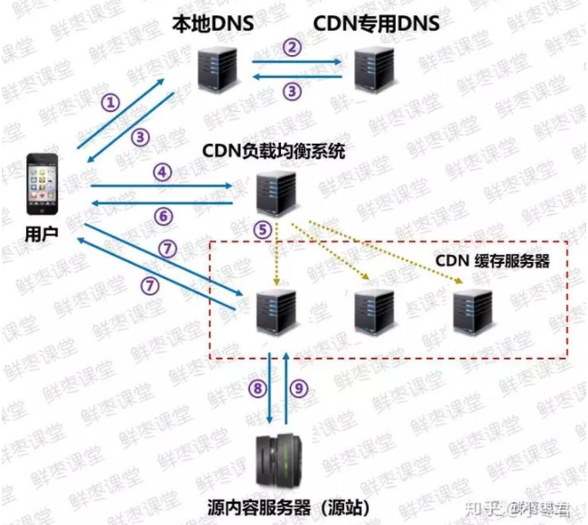

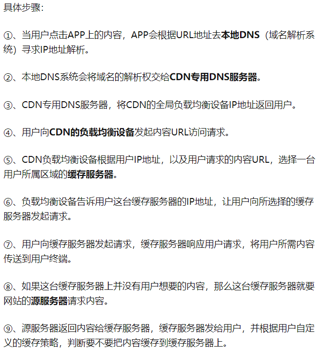

#### 好处

采用CDN技术，最大的好处，就是加速了网站的访问——用户与内容之间的物理距离缩短，用户的等待时间也得以缩短。

此外，CDN还有安全方面的好处。内容进行分发后，源服务器的IP被隐藏，受到攻击的概率会大幅下降。而且，当某个服务器故障时，系统会调用临近的健康服务器，进行服务，避免对用户造成影响。

### 前端优化有什么方案

我觉得前端优化按需去做吧，比如说像图片加载比较多的情况，肯定要用到图片懒加载呀，静态资源 CDN 这些优化，如果遇到重复请求相同资源的情况呢，就可以合理利用缓存嘛，然后我觉得几个常规必做的就像gizp压缩啊，路由懒加载啊，像优先加载css，利用防抖节流这些设计减少 http 请求啊，然后有必要的话甚至可以使用服务端渲染嘛

#### 减少 HTTP 请求

#### 使用 HTTP2

#### 使用服务端渲染

#### 静态资源使用CDN

#### 使用字体图标 iconfont 代替图片图标

字体图标就是将图标制作成一个字体，使用时就跟字体一样，可以设置属性，例如 font-size、color 等等，非常方便。并且字体图标是矢量图，不会失真。还有一个优点是生成的文件特别小。

#### 善用缓存，不重复加载重复的资源

Expires 设置了一个时间，只要在这个时间之前，浏览器都不会请求文件，而是直接使用缓存。而 max-age 是一个相对时间，建议使用 max-age 代替 Expires 。

#### 压缩文件

在 webpack 可以使用如下插件进行压缩：

- JavaScript：UglifyPlugin
- CSS ：MiniCssExtractPlugin
- HTML：HtmlWebpackPlugin

其实，我们还可以做得更好。那就是使用 gzip 压缩。可以通过向 HTTP 请求头中的 Accept-Encoding 头添加 gzip 标识来开启这一功能。当然，服务器也得支持这一功能。

#### 图片的优化

##### 懒加载

首先可以将图片这样设置，在页面不可见时图片不会加载：

```html

```

等页面可见时（监听页面的拖动啊，利用offset这样的参数），使用 JS 加载图片：

```js
const img = document.querySelector('img')
img.src = img.dataset.src
```

这样图片就加载出来了

##### 响应式图片

## 一面

### 模块循环引用问题

### 数组和一般对象的区别

我觉得最大的区别是数组的一个有序的集合，而对象是一个无序的集合，数组有它特有的方法，还有像 length 属性这些

## 二面

### cookie、session、token 的优缺点

cookie：占用更少的内存，因为存在客户端，持久性好，我们可以设置它的一个很长过期时间；缺点的就不安全吧，因为是明文形式的一个存储，然后也有大小的限制一般是4kb嘛cookie的数量（一般每个站点20个）存在一些限制，每个站点只能容纳20个cookie。

session：更安全：检验、生成、验证都是在服务端按照指定规则完成，然后传输的数据更少一般还需要返回给客户端一个 sessionid；不足的话就是 session 都存在了服务端，这让服务器是有状态的，如果有多台后端服务器会出现无法共享 session 的情况（专门准备一台session服务器）

token：安全性更高，返回的token串是经过加密的，存在客户端；缺点的话如果硬要说它有什么缺点那就是它增加了服务器的压力吧，毕竟要经过加密和解密

### mysql索引

MySQL索引的建立对于MySQL的高效运行是很重要的，索引可以大大提高MySQL的检索速度。

打个比方，如果合理的设计且使用索引的MySQL是一辆兰博基尼的话，那么没有设计和使用索引的MySQL就是一个人力三轮车。

拿汉语字典的目录页（索引）打比方，我们可以按拼音、笔画、偏旁部首等排序的目录（索引）快速查找到需要的字。

### 如果我要实现一个多台服务器都能允许同一用户认证登录，怎么做？

单点登录：单点登录就是在多个系统中，用户只需一次登录，各个系统即可感知该用户已经登录。

在**初学/以前**的时候，一般我们就**单系统**，所有的功能都在同一个系统上。


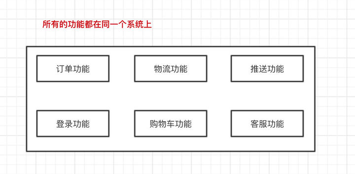

后来，我们为了**合理利用资源和降低耦合性**，于是把单系统**拆分**成多个子系统。


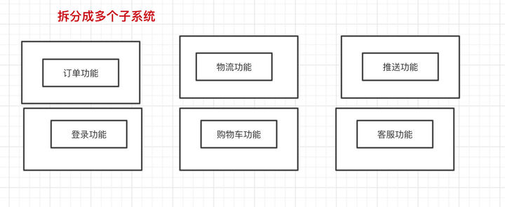


比如阿里系的**淘宝和天猫**，很明显地我们可以知道这是两个系统，但是你在使用的时候，登录了天猫，淘宝也会自动登录。

#### 认证中心

用户统一在认证中心进行登录，登录成功后，由认证中心记录用户的状态，并将 token 写入 cookie 中（注意这个 Cookie 是认证中心的，应用系统是访问不到的。）

应用系统检查当前请求有没有 Token，如果没有，说明用户在当前系统中尚未登录，那么就将页面跳转至认证中心。由于这个操作会将认证中心的 Cookie 自动带过去（请求认证中心页面，自然会让认证中心的cookie带过去），因此，认证中心能够根据 Cookie 知道用户是否已经登录过了。如果认证中心发现用户尚未登录，则返回登录页面，等待用户登录，如果发现用户已经登录过了，就不会让用户再次登录了，而是会跳转回目标 URL ，并在跳转前生成一个 Token，拼接在目标 URL 的后面，回传给目标应用系统。

应用系统拿到 Token 之后，还需要向认证中心确认下 Token 的合法性，防止用户伪造。确认无误后，应用系统记录用户的登录状态，并将 Token 写入 Cookie，然后给本次访问放行。（注意这个 Cookie 是当前应用系统的，其他应用系统是访问不到的。）当用户再次访问当前应用系统时，就会自动带上这个 Token，应用系统验证 Token 发现用户已登录，于是就不会有认证中心什么事了。

两款认证中心的开源实现：

- Apereo CAS 是一个企业级单点登录系统，其中 CAS 的意思是”Central Authentication Service“。它最初是耶鲁大学实验室的项目，后来转让给了 JASIG 组织，项目更名为 JASIG CAS，后来该组织并入了Apereo 基金会，项目也随之更名为 Apereo CAS。
- XXL-SSO 是一个简易的单点登录系统，由大众点评工程师许雪里个人开发，代码比较简单，没有做安全控制，因而不推荐直接应用在项目中，这里列出来仅供参考。

总结：此种实现方式相对复杂，支持跨域，扩展性好，是**单点登录的标准做法**。

#### **父域 Cookie**

Cookie 的作用域由 domain 属性和 path 属性共同决定。domain 属性的有效值为当前域或其父域的域名/IP地址，在 Tomcat 中，domain 属性默认为当前域的域名/IP地址。path 属性的有效值是以“/”开头的路径，在 Tomcat 中，path 属性默认为当前 Web 应用的上下文路径。

如果将 Cookie 的 domain 属性设置为当前域的父域，那么就认为它是父域 Cookie。**Cookie 有一个特点，即父域中的 Cookie 被子域所共享，换言之，子域会自动继承父域中的Cookie(通过 http only 判断是否可以修改，读取)。**

利用 Cookie 的这个特点，不难想到，将 Session ID（或 Token）保存到父域中不就行了。没错，我们只需要将 Cookie 的 domain 属性设置为父域的域名（主域名），同时将 Cookie 的 path 属性设置为根路径，这样所有的子域应用就都可以访问到这个 Cookie 了。**不过这要求应用系统的域名需建立在一个共同的主域名之下**，如 [http://tieba.baidu.com](https://link.zhihu.com/?target=http%3A//tieba.baidu.com) 和 [http://map.baidu.com](https://link.zhihu.com/?target=http%3A//map.baidu.com)，它们都建立在 [http://baidu.com](https://link.zhihu.com/?target=http%3A//baidu.com) 这个主域名之下，那么它们就可以通过这种方式来实现单点登录。

#### localStorage

前端拿到 Session ID （或 Token ）后，除了将它写入自己的 LocalStorage 中之外，还可以通过特殊手段将它写入多个其他域下的 LocalStorage 中。

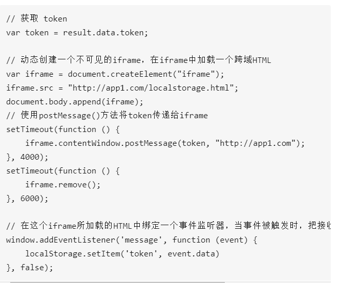

前端通过 iframe+postMessage() 方式，将同一份 Token 写入到了多个域下的 LocalStorage 中，前端每次在向后端发送请求之前，都会主动从 LocalStorage 中读取 Token 并在请求中携带，这样就实现了同一份 Token 被多个域所共享。

总结：此种实现方式完全由前端控制，几乎不需要后端参与，同样支持跨域。

### 热模块替换

hot：true；

基本原理：当文件发生改动，进行重新打包，生成新的bundle文件，然后替换浏览器页面的script标签，达到热更新的效果

### .Sync 修饰符

tips：类似于 v-model

```vue
    <!-- 语法糖式写法 -->
    <!-- <Child :money.sync="total"/> -->
    <Child :money="total" v-on:update:money="total = $event"/>
```

### object.assign()

tips: 浅拷贝

```js
        const a = {
            test: {
                f: 666
            }
        }

        const b = {
         	
        }
	    // 它的返回值是 target object.assign(target，source) source 合并到 target 有相同的会替换掉target的
        Object.assign(b, a) 
        console.log('a', a);
        console.log('b', b);
        b.test.f = 777
```

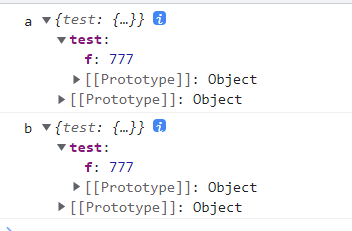

### 深拷贝方法

json，递归，jq的extend，postmessage，lodash，lodash的.cloneDeep

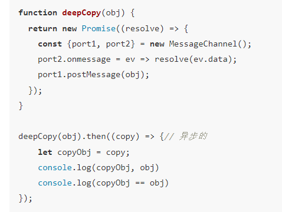

### async await 原理

```js
        function p1() {
            return new Promise(resolve => {
                setTimeout(function() {
                    resolve('p1')
                }, 1000)
            })
        }
        function p2() {
            return new Promise(resolve => {
                setTimeout(function() {
                    resolve('p2')
                }, 1000)
            })
        }
        function* test() {
            let c = yield p1()
            console.log(c);
            let d = yield p2()
            console.log(d);
            let f = yield 666
            console.log(f);
            let h = yield 777
            console.log(h);
        }

        let a = test()
        let next = a.next()
        function continueNext(next) {
            if (!next.done) {
                if (next.value instanceof Promise) {
                    next.value.then(res => {
                        next = a.next(res)
                        continueNext(next)
                    })
                } else {
                    next = a.next(next.value)
                    continueNext(next)
                }
            }
        }
        continueNext(next)
```

### 懒加载原理

```js
//方法一：JS代码实现
var imgs = document.getElementsByTagName('img');//获取img元素

function lazyLoad(){//监听页面滚动事件
    var vHeight = window.innerHeight||document.documentElement.clientHeight||document.body.clientHeight;//可视区域距浏览器窗口的距离
    var scrollHeight = window.pageYOffset||document.documentElement.scrollTop||document.body.scrollTop;//浏览器窗口与文档顶部的距离，即：垂直滚动高度

    for(var i = 0; i < imgs.length; i++){
         // offsetTop 图片到文档顶部的距离
        if(imgs[i].offsetTop < vHeight + scrollHeight){ // 这个地方可以适当减少一些距离，快到了就可以加载
            imgs[i].src = imgs.getAttribute('data-src');
        }
    }
}

lazyLoad();//页面加载完毕后，加载图片
window.onscroll = lazyload;//滚动时触发
```

### http3

将


# 腾讯暑期面试准备

## 简历内容复盘

### vue

#### vue 执行流程

- 调用 createApp(app).mount(root) 会调用 ensureRender 判断其是否存在 render 选项，如果不存在就会开始编译模板
- 编译模板底层是调用一个 basecomplier 函数，它做的最主要的工作就是parseHtml 生产 AST（描述树的结构和节点的类型），添加选项还有生成 render函数（返回虚拟节点）
- patch 进行 diff 比对

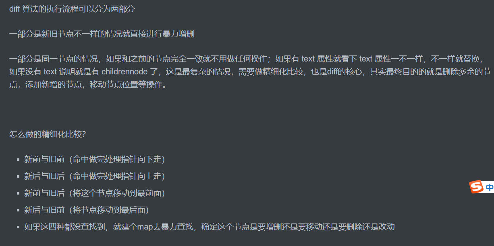

### webpack

#### webpack构建流程

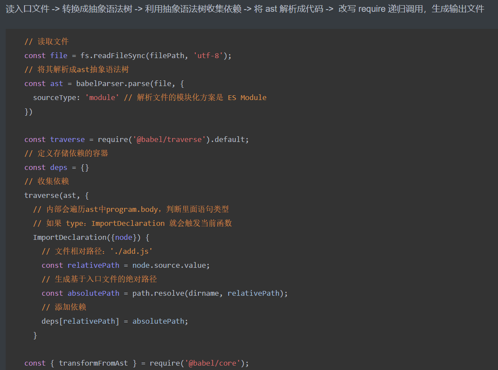

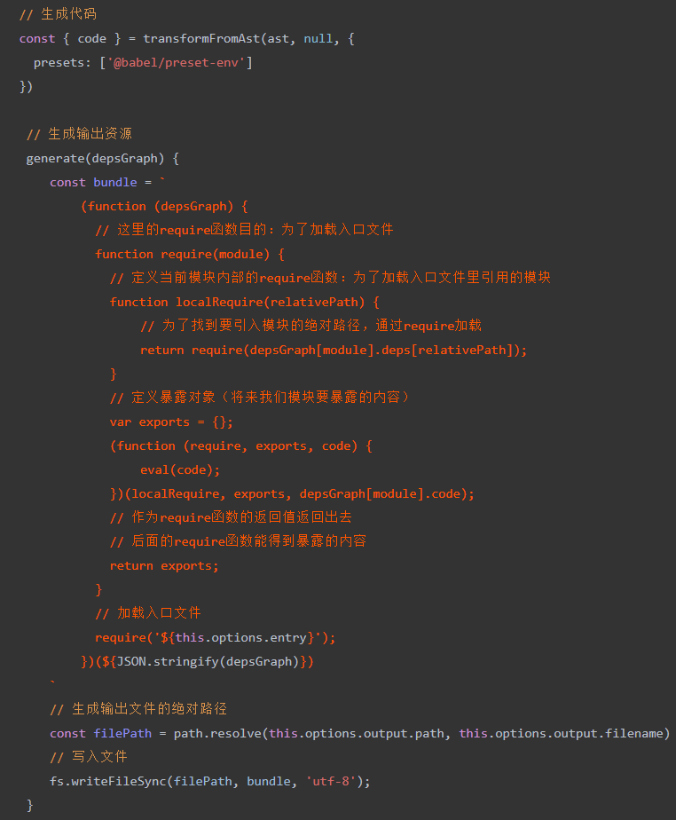


#### loader 和 plugin

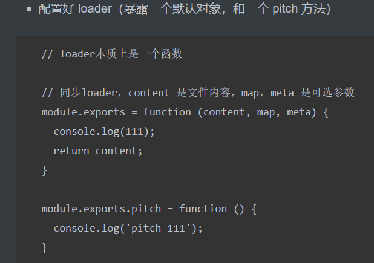

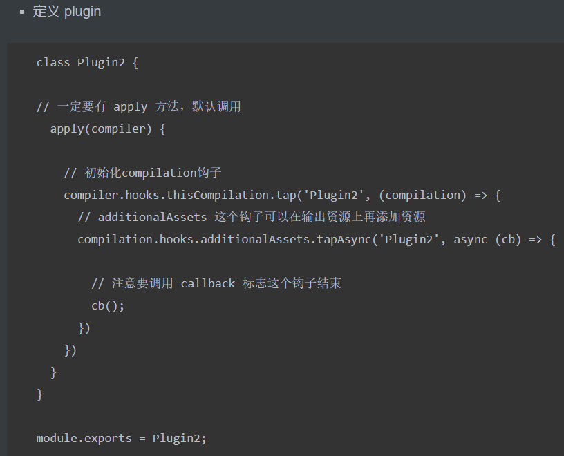

### node

#### streams

- stream 的独特之处在于，它不像传统程序那样 **一次性** 将文件读入内存，而是`逐块读取数据块，处理其内容而不会将其全部保存在内存中。`
- 让我们以 Youtube 或 Netflix 等 ”流媒体“ 服务为例：这些服务不会让你一次性下载整个视频和音频。相反，你的浏览器会接收到连续不断的视频片段，让接收人立即开始观看。

### python

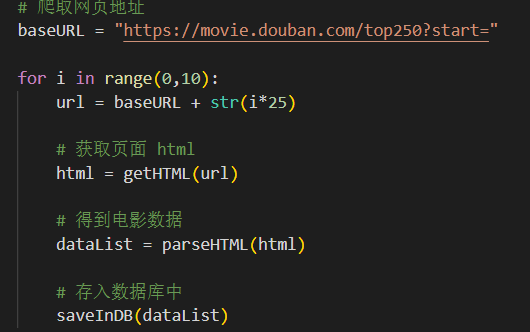

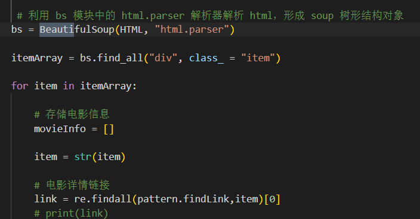

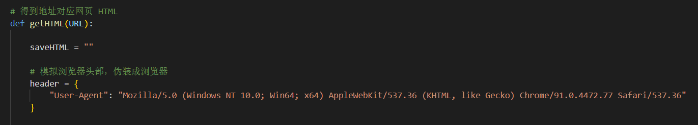

### 微前端

#### MicroApp 

##### 讲一下实现过程

- 渲染： microApp.start() =》 定义一个自定义标签 =》 替换 head 和 body 成 microapphead 和 microappbody => fetch link script => htmldom上树，eval script

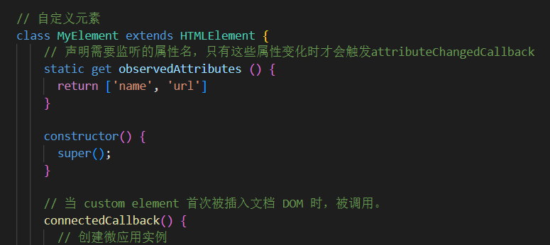

```
  window.customElements.define('micro-app', MyElement)
```

- 沙箱（sandbox）：将当前对象改成代理对象，用 with 函数改变顶部作用域为 micoAppWindow 

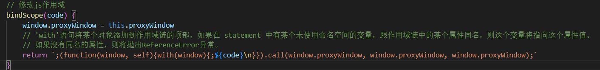

- 样式隔离（修改cssRules）：内联样式就直接获取它的 cssRules，外部资源就先将它插入style标签内再获取，一样都是遍历cssRules 添加 microApp[name=xxx] 前缀，缺点就是一些样式库的节点有些是插入在全局下的，导致样式失效
- 数据通信：
  - 父通过 :data(改写 setAttribute让其支持object) 传递数据，通过 dataChange(由 new CustomEvent 定义) 事件接受数据
  - 子通过：子通过监听 ‘appName’ 事件去接受数据，通过dispatch datachange去传递数据 

## 面经

### 前端安全


# 多益网络

## 笔试

### 多行不溢出

```css
    p {
      width: 600px;
      overflow: hidden; /** 超出的文本隐藏 */
      text-overflow: ellipsis; /** 溢出省略号显示 */
      white-space: nowrap; /** 换行无效，单行的话用这个, 以下不用 */
      display: -webkit-box; /** 作为弹性伸缩盒子模型显示 */
      -webkit-box-orient:vertical; /** 设置伸缩盒子的子元素排列方式--从上到下垂直排列 */
      -webkit-line-clamp: 3; /** 显示的行 */
    }
```

### 字体加粗的两种方法

利用css font-weight 或者用 b、strong 标签

### 字体图标的优缺点

**优势**

- **轻量级：**一个图标字体要比一系列的图像要**小**。一旦字体加载了，图标就会马上渲染出来，**不需要下载一个个图像。这样可以减少HTTP的请求数量，**而且和HTML5的离线存储配合，可以对性能做出优化。
- **灵活性：** **通过font-size属性来对其进行大小的设置，而且还可以添加各种文字效果，**如color、hover、filter、text-shadow、transform等效果。灵活的简直不像话！
- **兼容性**：图标字体**支持现代浏览器，甚至是低版本的IE浏览器**，所以可以放心的使用它。**相比于位图放大图片会出现失真、缩小又会浪费掉像素点，图标字体不会出现这种情况。**

**劣势**

- **图标字体只能被渲染成单色，或者是CSS3的渐变色**
- **版权上也有着对应的限制**，当然还是有很多免费的图标字体可以供我们下载。
- 当**自己创作图标字体的时候，是比较耗费时间的，重构人员的后期维护成本也比较高**

### Ajax 请求

[个人博客](https://juejin.cn/post/7119472863530188808)

### 判断空对象

- Object.keys
- JSON.stringfy
- Object.getOwnPropertyNames()
- for in 循环判断

### 爬楼梯

```js
function climbStairs(n: number): number {
    const dep = [1, 2]
    for (let i = 2; i < n; i++) {
        dep[i%2] = dep[(i - 1)%2] + dep[(i - 2)%2]
    }

    return dep[(n - 1)%2]
};
```

### span 间的距离怎么消除

**原因**: 换行的时候会多一个空格

解决方法：

- 设置父的 font-size: 0，再单独设置 span 的 font-size
- 利用定位
- 不要换行，标签连在一起

### 设置阴影

```css
box-shadow: h-shadow v-shadow blur spread color inset;
```

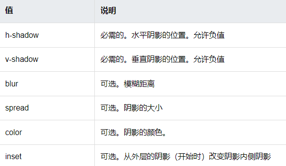

