# 自我介绍

面试官您好，我叫陈源鑫，21岁，今年大三；我虽然没有过实习经历，但是我是从大一暑假开始便开始自学前端，大二开学初便进入实验室跟着导师做项目，有实际的项目开发经历，差不多就这些。

# 介绍项目

这个项目是我们实验室与梅州金绿集团合作的一个项目，他是梅州一个养鸽企业，这个系统用于对鸽棚采集的数据进行汇总和分析，我们用的是 vue + ElementUI；在这个项目遇到的问题，首先我比较印象深刻的是首屏渲染速度较慢的问题，尤其是图片加载比较慢，为此我先是对图片做了压缩但是感觉还是不够，就又做了 http 缓存，后面又做了预渲染，还有路由懒加载，external，css 提取等去减少包的体积。


# 欢聚时代

## 一面

### 1.垂直居中方式

#### **Vertical-Align**

#### Line-Height 方法

**这个方法适用于单行文字的垂直居中**，只需要将包含文字元素的容器行高设置为大于字体大小并且等于元素的高度。默认情况下，文字上下部分会留有相同的空间，因而实现了文字的垂直居中。

**html**

```html
<div id="parent">
    <div id="child">Text here</div>
</div>
```

**css**

```css
#child {
    line-height: 200px;
}
```

这种方法只适用于单行文字的垂直居中，如果需要多行文字居中，需要选择其他方法。

##### 使用 Line-Height 垂直居中图片

使 **line-height** 可以实现图片的垂直居中，只需要在包含图片的父元素上设置 **line-height** 然后为图片设置 `vertical-align: middle`。

**html**

```html
<div id="parent">
    
</div>
```

**css**

```css
#parent { 
    line-height: 200px;
}

#parent img {
    vertical-align: middle;
}
```

#### CSS表格法

之前已经提到 **vertical-align** 适用于 **table-cell**, 因此可以通过将元素转化为table来实现垂直居中。

**html**

```html
<div id="parent">
    <div id="child">Text here</div>
</div>
```

**css**

```css
#parent {
    display: table;
}

#child {
    display: table-cell;
    vertical-align: middle;
}
```

注意这种方法的好处在于支持内容的动态改变，缺点是不支持旧版的IE浏览器（<=IE7）。

#### 绝对定位和margin

**html**

```html
    <div class="div1">
        <div class="div2">
        </div>
    </div>
```

**css**

```css
    .div1 {
        width: 100px;
        height: 100px;
        position: relative;
        background-color: black;
    }
    .div2 {
        background-color: pink;
        width: 50px;
        height: 50px;
        position: absolute;
        top: 50%;
        left: 50%;
        margin-top: -25px;
        margin-left: -25px;
    }
```

#### 绝对定位和拉伸法

css

```css
    .div1 {
        width: 100px;
        height: 100px;
        position: relative;
        background-color: black;
    }
    .div2 {
        background-color: pink;
        width: 50px;
        height: 50px;
        position: absolute;
        top: 0;
        bottom: 0;
        left: 0;
        right: 0;
        margin: auto;
    }
```

#### flex 

### 2.call 、appy 和 bind 的区别和源码

- call：参数需要逐个传递
- apply：参数是一个数组
  - bind：参数需要逐个传递，不过返回的是一个函数

```js
<script>
    // 1.将方法挂载到我们传入的 ctx
    // 2.将挂在以后的方法调用
    // 3.将我们添加的这个属性删除掉
    Function.prototype.luckyCall = function( ctx, ...args ) {
        // 给我们要指定的那个上下文对象添加一个属性，值是我们要调用的方法，因为 luckyCall 是我们所调用的方法调的，所以 this 指向它
        // 这里有个优化可以做就是 fn 这个名字可能本身在上下文对象就是一个属性，这样写可能会覆盖掉上下文对象的属性
        // 可以通过 let fn = symbol(1) 定义一个唯一的属性名
        ctx.fn = this

        // 调用这个属性方法， this 便变成了上下文对象
        ctx.fn(...args)

        delete ctx.fn
    }

    // 1.将方法挂载到我们传入的 ctx
    // 2.将挂在以后的方法调用
    // 3.将我们添加的这个属性删除掉
    Function.prototype.luckyApply = function( ctx, args = [] ) {

        // 判断参数是否是数组
        if (args && !(args instanceof Array)) {
            throw('参数得是数组')
        }

        // 给我们要指定的那个上下文对象添加一个属性，值是我们要调用的方法，因为 luckyCall 是我们所调用的方法调的，所以 this 指向它
        ctx.fn = this

        // 调用这个属性方法， this 便变成了上下文对象
        ctx.fn(...args)
        
        delete ctx.fn
    }

    Function.prototype.luckyBind = function( ctx, ...args ) {

        // 返回一个函数
        return (...args2) => {
            ctx.fn = this

            // 拼接第二次调用的参数并执行
            ctx.fn(...args.concat(args2))

            // 删除属性
            delete ctx.fn
        }
    }
</script>
```

### 3.https 的传输过程

- 客户端向服务器发起HTTPS请求，连接到服务器的443端口；
- 服务器端有一个密钥对，即公钥（即数字证书）和私钥，是用来进行非对称加密使用的，服务器端保存着私钥，不能将其泄露，公钥可以发送给任何人；
- 服务器将自己的公钥发送给客户端；
- 客户端收到服务器端的公钥之后，检查其合法性，如果发现发现公钥有问题，那么HTTPS传输就无法继续，如果公钥合格，则客户端会生成一个客户端密钥，然后用服务器的公钥对客户端密钥进行非对称加密成密文，至此，HTTPS中的第一次HTTP请求结束；
- 客户端发起HTTPS中的第二个HTTP请求，将加密之后的客户端密钥发送给服务器；
- 服务器接收到客户端发来的密文之后，会用自己的私钥对其进行非对称解密，解密之后的明文就是客户端密钥，然后用客户端密钥对数据进行对称加密，这样数据就变成了密文；
- 然后服务器将加密后的密文发送给客户端；
- 客户端收到服务器发送来的密文，用客户端密钥对其进行对称解密，得到服务器发送的数据。这样HTTPS中的第二个HTTP请求结束，整个HTTPS传输完成。

### 4.跨域以及其解决方式

**什么是跨域？**

- 要理解跨域首先要知道什么是：所谓同源（即指在同一个域）就是两个页面具有相同的协议（protocol），主机（host）端口号（port）
- 浏览器有一个安全功能叫同源策略，它规定不同源的客户端脚本在没有明确授权的情况下，不能读写对方资源。 如果尝试这样操作就是跨域。
- 如果没有同源限制，相当于我们可以随意读取对方的资源，比如cookie，localStroage、dom、window 等等

**非同源的限制**

1. 无法读取非同源网页的 Cookie、LocalStorage 和 IndexedDB
2. 无法接触非同源网页的 DOM
3. 无法向非同源地址发送 AJAX 请求，即 XHR 请求

**解决方案**

- jsonp

```
原理：利用 script 标签没有跨域限制向服务器发送 get 请求，传一个回调函数名给服务端，服务端直接将数据作为参数传回来
JSONP的优势在于支持老式浏览器，弊端也比较明显：只支持GET请求而不支持POST等其它类型的HTTP请求,它只支持跨域HTTP请求这种情况，需要客户端和服务端定制进行开发，服务端返回的数据不能是标准的Json数据，而是callback包裹的数据。
```

- CORS

```
跨资源共享CORS：跨域资源共享(CORS) 是一种机制，它使用额外的 HTTP 头（就是它：Access-Control-Allow-Origin）来告诉浏览器 让运行在一个服务器上的Web应用被准许访问来自不同源服务器上的指定的资源。当一个资源从与该资源本身所在的服务器不同的域、协议或端口请求一个资源时，资源会发起一个跨域 HTTP 请求。

CORS需要浏览器和服务器同时支持，才可以实现跨域请求，目前几乎所有浏览器都支持CORS，IE则不能低于IE10。CORS的整个过程都由浏览器自动完成，前端无需做任何设置，跟平时发送ajax请求并无差异。so，实现CORS的关键在于服务器，只要服务器实现CORS接口，就可以实现跨域通信。
优点：支持所有 http 请求
缺点：兼容性比jsonp差点，安全性问题，最好要控制好访问的域名
```

- 代理
  - nginx 反向代理配置
  - webpack 代理配置

### 5.get、post 区别

- 大部分的答案都是说：
  - GET使用URL或Cookie传参。而POST将数据放在BODY中。
  - GET的URL会有长度上的限制，则POST的数据则可以非常大。
  - POST比GET安全，因为数据在地址栏上不可见。

- 我认为这些区别是错误的，对于 url 的长度限制不过是一种防护机制，避免有人恶意构造几个 M 大小的 URL 然后不停访问你的服务器，去增加你的服务器负担；然后只要你愿意，完全可以在 get 请求上用 body 去传递数据，不过不能通过浏览器发出；至于安不安全如果是小白，你加个 base64 不就行了，如果不是小白，你放在地址栏上和放在 body 上没啥区别。
- 总结我觉得  get、post 的区别仅仅是使用规范上的区别

### 6.cookie的属性


#### name和value

Name和Value是一个键值对。Name是Cookie的名称，**Cookie一旦创建，名称便不可更改**，一般名称不区分大小写；Value是该名称对应的Cookie的值，如果值为Unicode字符，需要为字符编码。如果值为二进制数据，则需要使用BASE64编码。

#### Domain

**Domain决定Cookie在哪个域是有效的**，也就是决定在向该域发送请求时是否携带此Cookie，Domain的设置是对子域生效的，如Doamin设置为 .a.com,则b.a.com和c.a.com均可使用该Cookie，但如果设置为b.a.com,则c.a.com不可使用该Cookie。Domain参数必须以点(".")开始。

#### Path

**Path是Cookie的有效路径**，和Domain类似，也对子路径生效，如Cookie1和Cookie2的Domain均为a.com，但Path不同，Cookie1的Path为 /b/,而Cookie的Path为 /b/c/,则在a.com/b页面时只可以访问Cookie1，在a.com/b/c页面时，可访问Cookie1和Cookie2。Path属性需要使用符号“/”结尾。

#### Expires

**Expires 用于设置 Cookie 的过期时间**。比如：

```
Set-Cookie: id=a3fWa; Expires=Wed, 21 Oct 2015 07:28:00 GMT;
```

当 Expires 属性缺省时，表示是会话性 Cookie，像上图 Expires 的值为 Session，表示的就是会话性 Cookie。当为会话性 Cookie 的时候，值保存在客户端内存中，并在用户关闭浏览器时失效。需要注意的是，有些浏览器提供了会话恢复功能，这种情况下即使关闭了浏览器，会话期 Cookie 也会被保留下来，就好像浏览器从来没有关闭一样。

#### Max-Age

Max-Age 用于设置在 Cookie 失效之前需要经过的秒数。比如：

```
Set-Cookie: id=a3fWa; Max-Age=604800;
```

Max-Age 可以为正数、负数、甚至是 0。

如果 max-Age 属性为正数时，浏览器会将其持久化，即写到对应的 Cookie 文件中。

当 max-Age 属性为负数，则表示该 Cookie 只是一个会话性 Cookie。

当 max-Age 为 0 时，则会立即删除这个 Cookie。

假如 Expires 和 Max-Age 都存在，Max-Age 优先级更高。

#### size

Szie是此Cookie的大小。在所有浏览器中，任何cookie大小超过限制都被忽略，且永远不会被设置。各个浏览器对Cookie的最大值和最大数目有不同的限制。

#### HttpOnly

HttpOnly值为 true 或 false,若设置为true，则不允许通过脚本document.cookie去更改这个值，同样这个值在document.cookie中也不可见，但在发送请求时依旧会携带此Cookie。

#### Secure

Secure为Cookie的安全属性，若设置为true，则浏览器只会在HTTPS和SSL等安全协议中传输此Cookie，不会在不安全的HTTP协议中传输此Cookie。

#### SameSite

SameSite用来限制第三方 Cookie，从而减少安全风险。它有3个属性，分别是：

- Strict

Scrict最为严格，完全禁止第三方Cookie，跨站点时，任何情况下都不会发送Cookie

- Lax

Lax规则稍稍放宽，大多数情况也是不发送第三方 Cookie，但是导航到目标网址的 Get 请求除外。

- None

网站可以选择显式关闭SameSite属性，将其设为None。不过，前提是必须同时设置Secure属性（Cookie 只能通过 HTTPS 协议发送），否则无效。

另外：关闭SameSite的方法

操作方法谷歌浏览器地址栏输入：chrome://flags/ 找到：SameSite by default cookies、Cookies without SameSite must be secure设置上面这两项设置成 Disable

#### Priority

优先级，chrome的提案，定义了三种优先级，Low/Medium/High，当cookie数量超出时，低优先级的cookie会被优先清除。

### 7.什么是 promise/A+ 规范

它是一个 JavaScript Promises 标准——由开发者制定，供开发者参考实现 Promises。

**规范规定**

- 用 fulfilled 表示解决/兑现: 指一个 promise 成功地从 “待定” 状态进入 “兑现” 状态。虽然规范中使用 fulfill 来表示解决，但一般多以 resolve 来指代。
- 拒绝（reject）：指一个 promise 成功地从 “待定” 状态进入 “拒绝” 状态。
- 终值（eventual value）：指一个 promise 解决时传递给解决回调的值，由于 promise 有一次性的特征，因此当这个值被传递时，标志着 promise 等待态的结束，故称之终值，有时也直接简称为值（value）。
- 拒因（reason）：指一个 promise 拒绝时传递给拒绝回调的值（原因），

### 8.你的promise是怎么写的(他应该是想问你的promise是怎么用的，我当时理解错了，把[源码](https://www.nowcoder.com/jump/super-jump/word?word=源码)说了一遍)

### 9.then的返回值

### 10.nginx反向代理怎么弄

### 11.http的方法

### 12.option是干什么的

## 一面

### 1.讲一下 TypeScript 泛型

它允许在程序中定义形式类型参数，然后在泛型实例化时使用实际类型参数来替换形式类型参数；概念我不会背，我直接说一下它的一个常规的使用场景，当我们想要定义一个函数参数和返回值类型一致，而又不想写死的时候，这个时候就需要使用泛型了，**因为它能够捕获传入参数的类型，又能够使用捕获的传入参数的参数类型作为函数返回值的类型。**

### 2.块级和行内块的区别

它们都可以设置宽高，然后块级独占一行，行内块元素可以多个存在一行显示

### 3.讲一下盒子模型；box-sizing 有哪些属性有什么用？

盒子模型一般就分标准的盒子模型和 IE 盒子模型：


由内到外分别是 content padding border margin 然后 标准的 height 和 width 指的是 content 部分，而 IE 的话还会包含 padding 和 border

box-sizing 有三个属性：content-box丨border-box丨inherit 分别对应标准的盒子模型、IE 盒子模型，还要继承父类的 box-sizing 属性。

### 4.position 有哪些属性有什么作用?

CSS中Position属性有五个可选值，它们分别是：static、absolute、fixed、relative、inherit

static：表示无定位，这是所有元素定位的默认值；一般情况下，我们不需要特别的去声明它，但有时候遇到继承的情况，我们不愿意见到元素所继承的属性影响本身，从而可以用position:static取消继承，即还原元素定位的默认值。

absolute：表示生成绝对定位元素，相对于 static 定位以外的第一个父元素进行定位

fixed：生成绝对定位的元素，相对于浏览器窗口进行定位

relative：生成相对定位元素，相对于其正常位置进行定位

# 汇量科技

## 一面

### 手写快排


```js
    <script>
        // 快速排序

        function quickSort( arr ) {

            // base case 
            if ( arr.length <= 1 ) return arr;
            
            // 取基准索引
            let pivotIndex = Math.floor( arr.length / 2 )

            // splice 方法会改变原数组，将位置为 pivotIndex 的元素删除
            // 取基准值并改变原数组
            let pivot = arr.splice(pivotIndex, 1)[0];

            let leftArr = []
            let rightArr = []

            for ( let i = 0; i < arr.length; i++ ) {
                if( arr[i] < pivot ) {
                    leftArr.push( arr[i] )
                } else {
                    rightArr.push( arr[i] )
                }
            }
			
            // 左边快排结果加右边快排结果和基准值就是答案
            return quickSort(leftArr).concat( [ pivot ], quickSort(rightArr) )
        }

        let arr = [ 8, 6, 7, 1 , 2, 3 ]
        let ans = quickSort(arr)
        console.log(ans);
        
    </script>
```

### 数组去重

## 二面

### 简述浏览器渲染机制

#### 一 ： 为什么要了解浏览器渲染页面的机制，主要还是性能的优化。

- 了解浏览器如何进行加载，我们可以在引用外部样式文件，外部JS时，将它们放到合适的位置，是浏览器以最快的速度，将文件加载完毕。
- 了解浏览器如何进行解析，我们可以在构建DOM结构，组织CSS选择器的时候，选择最优的写法，提高浏览器的解析速率。
- 了解浏览器如何进行渲染，明白渲染的过程，我们在设置元素属性，编写JS文件时，可以减少“重绘”，“重新布局”的消耗。

------

#### 二 ： 要了解清楚渲染机制，要先弄明白几个基本概念：

1. DOM：Document Object Model，浏览器将HTML解析成树形的数据结构，简称DOM。

2. CSSOM：CSS Object Model，浏览器将CSS解析成树形的数据结构，简称CSSOM。

3. Render Tree: DOM和CSSOM合并后生成Render Tree，如下图：

   

   image.png

4. Layout: 计算出Render Tree每个节点的具体位置。

5. Painting：通过显卡，将Layout后的节点内容分别呈现到屏幕上。

------

#### 三 ： 需要注意的是(重点)：

- 当我们浏览器获得HTML文件后，会自上而下的加载，并在加载过程中进行解析和渲染。
- 加载说的就是获取资源文件的过程，如果在加载过程中遇到外部CSS文件和图片，浏览器会另外发送一个请求，去获取CSS文件和相应的图片，这个请求是异步的，并不会影响HTML文件的加载。
- 但是如果遇到Javascript文件，HTML文件会挂起渲染的进程，等待JavaScript文件加载完毕后，再继续进行渲染。
  为什么HTML需要等待JavaScript呢？因为JavaScript可能会修改DOM，导致后续HTML资源白白加载，所以HTML必须等待JavaScript文件加载完毕后，再继续渲染，这也就是为什么JavaScript文件在写在底部body标签前的原因。

------

#### 四 ： 浏览器渲染的整个流程


image.png


浏览器整个流程如上图所示：

1. 当用户输入一个URL时，浏览器就会向服务器发出一个请求，请求URL对应的资源
2. 接受到服务器的响应内容后，浏览器的HTML解析器，会将HTML文件解析成一棵DOM树，DOM树的构建是一个深度遍历的过程，当前节点的所有子节点都构建完成以后，才会去构建当前节点的下一个兄弟节点。
3. 将CSS解析成CSSOM树（CSS Rule Tree）
4. 根据DOM树和CSSOM树，来构建Render Tree（渲染树）,注意渲染树，并不等于DOM树，因为一些像head或display:none的东西，就没有必要放在渲染树中了。
5. 有了Render Tree，浏览器已经能知道网页中有哪些节点，各个节点的CSS定义，以及它们的从属关系，下一步操作就是Layout,顾名思义，就是计算出每个节点在屏幕中的位置。
6. Layout后，浏览器已经知道哪些节点要显示，每个节点的CSS属性是什么，每个节点在屏幕中的位置是哪里，就进入了最后一步painting,按照算出来的规则，通过显卡，把内容画到屏幕上。

#### 这里还要说两个概念，一个是Reflow，另一个是Repaint。这两个不是一回事。

- Repaint ——改变某个元素的背景色、文字颜色、边框颜色等等不影响它周围或内部布局的属性时，屏幕的一部分要重画，但是元素的几何尺寸没有变。
- Reflow ——元件的几何尺寸变了，我们需要重新验证并计算Render Tree。是Render Tree的一部分或全部发生了变化。
- reflow 几乎是无法避免的。现在界面上流行的一些效果，比如树状目录的折叠、展开（实质上是元素的显 示与隐藏）等，都将引起浏览器的 reflow。鼠标滑过、点击……只要这些行为引起了页面上某些元素的占位面积、定位方式、边距等属性的变化，都会引起它内部、周围甚至整个页面的重新渲 染。通常我们都无法预估浏览器到底会 reflow 哪一部分的代码，它们都彼此相互影响着。
  注：display:none会触发reflow，而visibility:hidden只会触发repaint，因为没有发现位置变化。

------

#### 五 : DOM和CSSOM的具体构建流程：

DOM 和 CSSOM 都是以" Bytes → characters → tokens → nodes → object model. " 这样的方式生成最终的数据。如下图所示：


image.png


具体到DOM树的构建，如下图：


image.png


 1、  当服务器返回一个HTML文件给浏览器的时候，浏览器接受到的是一些字节数据。

2、  然后浏览器根据HTTP响应中的编码方式（通过是UTF8），解析字节数据，得到一些字符。如果这个时候编码方式跟文件的字节编码不一致，便会出现乱码。所以我们通过使用<meta http-equiv="content-type"content="text/html;charset=utf-8">来告诉浏览器我们页面使用的是什么编码。

3、  这个时候，浏览器再根据DTD中的对元素（标签）的定义，对这些接受到的字符进行语义化(token)。我们经常在html文件的第一行，定义<!DOCTYPE HTML PUBLIC "-//W3C//DTD HTML 4.01Transitional//EN" "http://www.w3.org/TR/html4/loose.dtd">，这个DTD就是告诉浏览器，那些字符是有意义的，那些字符是无意义的。DTD常见的有严格、过渡、框架和HTML5三种。不同的DTD中，有不同的元素定义。比如过渡的DTD中就比严格的DTD中多出了<center>、<font>等等一些元素的定义，也就是说使用严格的DTD，即使你在你的HTML文件中使用了<center>，浏览器也会忽略掉的。所以也就有了一些人使用不同的DTD或者不使用DTD的时候，布局会明显不同的原因了。

4、  接着，浏览器再使用这些语义块(token)创建对象，形成一个个节点了。

5、  然后HTML解析器就会从HTML文件的头部到尾部，一个个地遍历这些节点。当这些节点是普通节点的话，HTML解析器就会将这些节点加入到DOM树中。当这些节点是JS代码的话，HTML解析器就会将控制权交给JS解析器。如果这些节点是CSS代码的话，HTML解析器就会将控制权交给CSS解析器。不过，当外联的JS代码和CSS代码还没从服务器传到浏览器的时候，这个时候如果DOM树上有可视元素的话，浏览器通常会选择在这个时候，将一些内容提前渲染到屏幕上来。

6、  当HTML解析器读到最后一个节点的时候，整个DOM树也构建完成了，这个时候就会触发domContentloaded事件。而很多JS库（像JQ）通常会在这个时候有所反应的。

至此，DOM树就全部构建完成了。

#### 总结

浏览器对 HTML 的解析是自上而下的，如果遇到图片、css 会另外发送请求，这个请求是异步的不会影响 HTML 的渲染，但是它如果遇到的是 js 文件会挂起 HTML 渲染进程，因为 js 代码可能会有一些节点操作，这样不会白白浪费 HTML 的渲染资源；（HTML 解析阶段）

HTML 解析完之后就生成了 DOM 树， CSS 解析器也会开始解析 CSS 会生成 CSSOM 树，然后两棵树结合生成 渲染树，然后根据渲染树各个节点 CSS 的定义确定节点在页面的位置（layout阶段），然后就开始渲染页面（painting阶段）。

### Node.js 和 JS 的区别

Node.js 是一个运行平台，而 JS 是一门脚本语言，Node 让 js 可以运行在服务端。

我觉得简单来说就是 node.js 是一个浏览器的解释器封装起来作为服务器的运行平台，它让 js 可以在服务端运行

### 前端性能优化

#### 减少 HTTP 请求

#### 使用服务端渲染

#### 静态资源使用 CDN

```
CDN 原理
当用户访问一个网站时，如果没有 CDN，过程是这样的：

浏览器要将域名解析为 IP 地址，所以需要向本地 DNS 发出请求。
本地 DNS 依次向根服务器、顶级域名服务器、权限服务器发出请求，得到网站服务器的 IP 地址。
本地 DNS 将 IP 地址发回给浏览器，浏览器向网站服务器 IP 地址发出请求并得到资源。

简单一句话：将域名解析为 IP 地址，向 IP 地址对应的服务器发送请求

如果用户访问的网站部署了 CDN，过程是这样的：

浏览器要将域名解析为 IP 地址，所以需要向本地 DNS 发出请求。
本地 DNS 依次向根服务器、顶级域名服务器、权限服务器发出请求，得到全局负载均衡系统（GSLB）的 IP 地址。
本地 DNS 再向 GSLB 发出请求，GSLB 的主要功能是根据本地 DNS 的 IP 地址判断用户的位置，筛选出距离用户较近的本地负载均衡系统（SLB），并将该 SLB 的 IP 地址作为结果返回给本地 DNS。
本地 DNS 将 SLB 的 IP 地址发回给浏览器，浏览器向 SLB 发出请求。
SLB 根据浏览器请求的资源和地址，选出最优的缓存服务器发回给浏览器。
浏览器再根据 SLB 发回的地址重定向到缓存服务器。
如果缓存服务器有浏览器需要的资源，就将资源发回给浏览器。如果没有，就向源服务器请求资源，再发给浏览器并缓存在本地。

简单一句话：将域名解析为 IP 地址得到全局负载均衡系统地址，当我们向它发起请求的时候，它会筛选出距离用户较近的本地负载均衡系统，并将它的 IP 地址作为结果返回，然后向它发请求就会选出最优的缓存服务器发给浏览器，浏览器向该服务器发送请求，如果缓存服务器有浏览器需要的资源，就将资源发回给浏览器。如果没有，就向源服务器请求资源，再发给浏览器并缓存在本地。
```

#### 将 CSS 放在文件头部， JavaScript 文件放在底部

```
CSS 执行会阻塞渲染，阻止 JS 执行
JS 加载和执行会阻塞 HTML 解析，阻止 CSSOM 构建
如果这些 CSS、JS 标签放在 HEAD 标签里，并且需要加载和解析很久的话，那么页面就空白了。所以 JS 文件要放在底部（不阻止 DOM 解析，但会阻塞渲染），等 HTML 解析完了再加载 JS 文件，尽早向用户呈现页面的内容。

那为什么 CSS 文件还要放在头部呢？

因为先加载 HTML 再加载 CSS，会让用户第一时间看到的页面是没有样式的、“丑陋”的，为了避免这种情况发生，就要将 CSS 文件放在头部了。

另外，JS 文件也不是不可以放在头部，只要给 script 标签加上 defer 属性就可以了，异步下载，延迟执行。
```

#### 使用字体图片 iconfont 代替图片图标

```
字体图标就是将图标制作成一个字体，使用时就跟字体一样，可以设置属性，例如 font-size、color 等等，非常方便。并且字体图标是矢量图，不会失真。还有一个优点是生成的文件特别小。
```

#### 开启缓存

#### 压缩文件大小（Gzip 压缩）

```
在 webpack 可以使用如下插件进行压缩：

JavaScript：UglifyPlugin
CSS ：MiniCssExtractPlugin
HTML：HtmlWebpackPlugin
其实，我们还可以做得更好。那就是使用 gzip 压缩。可以通过向 HTTP 请求头中的 Accept-Encoding 头添加 gzip 标识来开启这一功能。当然，服务器也得支持这一功能。
```

#### 图片延迟加载

在页面中，先不给图片设置路径，只有当图片出现在浏览器的可视区域时，才去加载真正的图片，这就是延迟加载。对于图片很多的网站来说，一次性加载全部图片，会对用户体验造成很大的影响，所以需要使用图片延迟加载。

首先可以将图片这样设置，在页面不可见时图片不会加载：

```html

```

等页面可见时，使用 JS 加载图片：

```js
const img = document.querySelector('img')
img.src = img.dataset.src
```

这样图片就加载出来了，完整的代码可以看一下参考资料。

也可以利用插件取实现效果

### vue有什么特色

```
1.遵循MVVM模式

可以实现响应式的数据绑定和可组合的视图。
MVVM是Model-View-ViewModel的简写，model 和 view 就是数据和视图 UI 分开，而 viewmodel 描述的就是它可以通过视图去改变数据，数据的改变去渲染视图。

2.指令化

vue中的指令包括内置指令和自定义指令，其中指令一般以“v-”开头，作用于HTML元素，vue中可以将指令绑定在元素上，如v-bind动态绑定指令、v-if 条件渲染指令、v- for列表渲染指令等。

3.插件化

vue中可以使用插件对功能进行扩展，其中通过MyPlugin.install编写插件后，即可全局使用，常用的扩展插件有vue-router、Vuex 等。

4.组件化
```

## 本人实习技术面

### 非父子通信

利用全局事件总线

~~~js
1. 一种组件间通信的方式，适用于任意组件间通信。

2. 安装全局事件总线：

   ```js
   new Vue({
   	......
   	beforeCreate() {
   		Vue.prototype.$bus = this //安装全局事件总线，$bus就是当前应用的vm
   	},
       ......
   }) 
   ```

3. 使用事件总线：

   1. 接收数据：A组件想接收数据，则在A组件中给$bus绑定自定义事件，事件的回调留在A组件自身。

      ```js
      methods(){
        demo(data){......}
      }
      ......
      mounted() {
        this.$bus.$on('xxxx',this.demo)
      }
      ```

   2. 提供数据的组件提供数据调用：```this.$bus.$emit('xxxx',数据)```

4. 最好在beforeDestroy钩子中，用$off去解绑当前组件所用到的事件。
5. 本质就是将自定义事件定义在 vm 实例上, 接受数据的一方去绑定事件，将回调留在自身，发送数据的一方去触发事件，将数据作为参数传出。
~~~

### HTTP 请求/响应头

### 从数组取几个随机元素


### 递归遍历

```html
    <script>
        let VNode = {
            value: 'A',
            child: [
                {
                    value: 'B',
                    child: [
                        {
                            value: 'E',
                            child: []
                        },
                        {
                            value: 'F',
                            child: []
                        }
                    ]
                },
                {
                    value: 'C',
                    child: []
                },
                {
                    value: 'D',
                    child: []
                }
            ]
        }

        function getArr( VNode, newArr ) {
            

            if ( VNode === null ) return;

            newArr.push( VNode.value )

            for( let i = 0; i < VNode.child.length; i++ ) {
                getArr( VNode.child[i], newArr)
            } 
            
            return newArr
        }

        console.log(getArr( VNode, [] ));
    </script>
```

### 独立像素比


个人理解：就是说设备实际像素如果是 750px 设备像素比如果是 2 那么 css 里的 1px 相当于在设备上显示 2px，所以设计图给的如果是 750px 的设计图，我们在 css 里应该在这个设计图的基础上除2 

# 个人简历

## H5 

语义化标签...、音频视频标签（audios、video）....、本地存储...等等

## CSS3

例如新增的选择器：nth-child、fist-child等等；

新增的属性：

- 文本的像 text-shadow、text-overflow 这些

- 颜色样式：opacity

- 边框的样式 border-radius

- 背景样式：背景大小 background-size

  

  

  在 vue 中使用过渡

  

  transitionName：是.slide-left 或 right

  

  

  还有 flex 盒子模型

## Nginx

### gzip 压缩

在 nginx 里配置响应头 Accept-Encoding gzip


### HTTP 缓存


tips：public 指可向任一方提供响应的缓存

（1）已存在缓存数据时（**强制缓存情况**)，请求数据的流程如下所示：


（2）已存在缓存数据时（**对比缓存情况**），请求数据的流程如下所示：


总结：强制缓存，如果数据没失效不会向服务器发请求，直接走缓存，而相对缓存不管如何都会咨询服务器数据是否失效，如果没失效就走缓存，如果失效就从服务器拿数据再将数据存入本地缓存。

### 反向代理


### 负载均衡


## PC 端响应式适配

```js
    // 获取设备的宽度动态改变根节点 font-size
    var getPxSize = () => {
        // 浏览器文档显示区域的的宽度
        let currentWidth = document.documentElement.clientWidth;
        console.log(currentWidth);
        let pxSize = ( 16 * ( currentWidth/1920 ) > 32? 32 + "px" : ( 16 * ( currentWidth/1920 ) + "px") );
        document.documentElement.style.fontSize = pxSize;
    }

    // 窗口加载、缩小扩展时触发
    window.addEventListener( "load", getPxSize )
    window.addEventListener( "resize", getPxSize )
```

总结：整体采用 rem 单位，获取文档显示区域宽度，再配合窗口加载、缩放事件，调整根节点 font-size 大小，

## 移动端响应式适配

- 利用 flex 布局
- 结合 vw 和 vh 单位：它是相对单位，总是相对于视口来说的，1 vw 就是当前视口的 1/100
  - 注意：百分比是相对于父元素和 vw 和 vh 单位是相对于视口
- 或者是利用 flex 布局结合媒体查询和 rem

## Webpack

### HMR 

```js
/*
  HMR: hot module replacement 热模块替换 / 模块热替换
    作用：一个模块发生变化，只会重新打包这一个模块（而不是重新打包所有模块，假如说你改变了一个模块但是相关的其他模块没有变动却要重新打包，这样效率是非常低的） 
      极大提升构建速度
      
      样式文件：可以使用HMR功能：因为style-loader内部实现了~
      js文件：默认不能使用HMR功能 --> 需要修改js代码，添加支持HMR功能的代码
        注意：HMR功能对js的处理，只能处理非入口js文件的其他文件（修改入口文件还是会引起所有的东西重新打包）。
      html文件: 默认不能使用HMR功能.同时会导致问题：html文件不能热更新了~ （不用做HMR功能）
        解决：修改entry入口，将html文件引入
*/
```


### 多进程打包

tips：当代码量比较大的时候才有必要启动多进程打包去提升构建速度（比如你做鸽子项目的时候应该就有感觉到run start 的时候打包很慢，你去开启多进程打包可能会有妙用），而当代码里比较少的时候去打开多进程打包是得不偿失的，因为打开多进程是需要消耗一定的时间的


### CSS 提取

tips：如果放在 js 里面，一呢 chunk 变得很大，加载变慢， 还要先加载 js 再动态的创建 style 标签，样式渲染速度慢，这样很容易出现闪屏现象。提取单独文件，用 link 加载


### external

tips: 配置 externals 可以避免一些比较大的库被打包进来，像 jq、react 这些，我们可以通过 cdn 进行引入。


### 预渲染


在构建时 (`build time`) 简单地生成针对特定路由的静态` HTML` 文件（ 即在npm run build 的时候将对应路由的文件的 HTML 保存下来 ）。当用户请求对应的路由时直接返回对应 HTML 文件，减少了浏览器解析 js 文件动态渲染 HTML 的时间

插件原理：模拟浏览器访问路由，然后把`JS`生成的`DOM`结构以`HTML`静态文件的形式再保存下来。

## 前端权限管理

- 对菜单的控制：配合后端返回的权限数据，动态渲染菜单
- 对界面的控制：加入路由导航守卫；配置后端返回的权限数据，动态渲染路由


- 对按钮的控制：利用自定义指令，配合后端数据判断其是否可用


## nginx 配置 docker 怎么配高可用、负载均衡集群

首先拉取 centos 的镜像，创建两个容器取安装nginx和keepalived，配置nginx.conf文件和keepalived.conf文件（主要改下router-id，优先级，虚拟地址，state mater/backup）

docker pull

docker run

docker exec 进入容器

# CVTE

## 笔试


tips： B D


若定义两个表单 id 分别为 test_form、test_form2,打印出来是这样，它会有两个两属性名存放这个表单，一个是 0，一个是 id


tips：Number(null) = 0 Nubmer(‘a’) = undefined Number("666") = 666


tips：类中的 constructor 本质是就我们定义的一个构造函数，而外层的方法就是我们定义的原型方法，加上 statci 就是我们平时挂载在构造函数上的方法

```js
class A {
    constructor() {
        this.a = 123
    }
    a() {
        console.log(this.a);
    }
    static b() {
        console.log(this);
    }
}

function A() {
	this.a = 123
}
function.protatype = function a() {
	console.log(this.a);
}
A.b = function () {
    console.log(this)
}
```


```
console.log(window.navigator.geolocation.getCurrentPosition(function(p) {
            console.log(p)
}));
```


tips: 注意是任何情况，先保证 9 个顶点可以互相连同就是 9 * 8 / 2 = 36 个点，剩下一个点只需要再添加一条边就好了


tips：只要 return 了那么后面返回的都是 undefined


tips：记住 I/O 都是宏任务


tips：不是所有代码，是有 await 的


tips：是 Date 不是 DateTime

# 字节跳动

## 一面

### 为什么学前端？

在我大一的时候疫情爆发，然后那段时间感觉自己很咸鱼，想找点事情干，然后刚好我们班群发通知说实验室招新，然后我就去了，那时有两个路线供我们选择，一个是前端一个是后端，在对前后端做了一定的了解后，我觉得我自己还是更喜欢前端这种就是做了什么就能很直观的看到，也可以直接得展示给我身边人，说这个是我们团队做的，我负责做哪里哪里，我觉得很有成就感。还有一个原因是我受到一个师兄的影响，我记得我大一的时候的目标就是毕业能找到一份不错的工作，没想过也不敢想说去进字节这种大厂，后面我认识了一个在腾讯实习的师兄，他也是走前端路线的，然后刚好他们实验室在招新，有几个方向可以选择，在对前端做了一些了解后，我感觉这是比较适合我的路线，我喜欢这种做出来看得到的开发体验，每做出一个项目也可以很直观的向朋友和家人分享我的喜悦，我感觉很有成就感。

### 怎么学的

网课、看书、文档、博客冲浪

### 实现水平垂直居中的方法

tips: absolute 是相对浏览器的，relative 是相对盒子自身的

```html
    <div class="father">
        <div class="children"></div>
    </div>
```

- 弹性布局方式：display：flex，align-items：center，justify-content：center
- 拉扯法+margin：auto

```css
    .father {
        position: relative;
        height: 100px;
        width: 100px;
        background-color: aqua;
    }
    .children {
        position: absolute;
        height: 50px;
        width: 50px;
        background-color: black;
        top: 0;
        left: 0;
        right: 0;
        bottom: 0;
        margin: auto;
    }
```

- 位偏移

```css
    .father {
        position: relative;
        height: 100px;
        width: 100px;
        background-color: aqua;
    }
    .children {
        position: absolute;
        height: 50px;
        width: 50px;
        background-color: black;
        left: 50%;
        top: 50%;
        transform: translate(-50%, -50%);
        // 或者 margin-top: -25px margin-left:-25px
    }
```

tips: 为什么 magin 可以实现？在文档流中元素的边界由margin决定，margin-top 和 left 元素的自身的一半，就相当于把top 和 letf的边界调整到了中间，top和letf会根据这个边界去确定元素的位置

### 说说 BFC

简洁回答：我觉得BFC可以理解成一个封闭的大箱子，箱子内部的元素不会影响到外部，然后不会被浮动元素所遮盖，我们利用这个特性就可以实现像三栏布局啊或者左边右边自适应等等，而且BFC还有一个特性是同一个BFC下的元素外边距会发生折叠，这种特性被称为margin塌陷

BFC 即 Block Formatting Contexts (块级格式化上下文) ，具有 BFC 特性的元素可以看作是隔离了的独立容器，容器里面的元素不会在布局上影响到外面的元素，并且 BFC 具有普通容器所没有的一些特性，可以把 BFC 理解为一个封闭的大箱子，箱子内部的元素无论如何翻江倒海，都不会影响到外部。

**触发 BFC 的方法**

```
body 根元素
浮动元素：float 除 none 以外的值
绝对定位元素：position (absolute、fixed)
display 为 inline-block、table-cells、flex
overflow 除了 visible 以外的值 (hidden、auto、scroll)
```

**特性**

- 同一个 BFC 下外边距会发生折叠

```html
<head>
div{
    width: 100px;
    height: 100px;
    background: lightblue;
    margin: 100px;
}
</head>
<body>
    <div></div>
    <div></div>
</body>
```


```html
<body>
    <div class="father">
        <div class="brother"></div>
    </div>
    <div class="father">
        <div class="sister"></div>
    </div>
    
</body>
</html>
<style>
    .father {
        overflow: hidden;
    }
    .brother {
        width: 100px;
        height: 100px;
        background-color: black;
        margin-bottom: 50px;
        /* overflow: hidden; */ // 你在这里生成bfc只是内部有一个独立的渲染区域，外部的magin仍然共享
    }
    .sister {
        width: 100px;
        height: 100px;
        background-color: black;
        margin-top: 50px;
        /* overflow: hidden; */
    }
</style>
```


```html
<div class="container">
    <p></p>
</div>
<div class="container">
    <p></p>
</div>
```

```css
.container {
    overflow: hidden;
}
p {
    width: 100px;
    height: 100px;
    background: lightblue;
    margin: 100px;
}
```


- BFC 可以包含浮动的元素（我们平常清除浮动基本就是利用BFC这个特性）

```html
<div style="border: 1px solid #000;">
    <div style="width: 100px;height: 100px;background: #eee;float: left;"></div>
</div>
```


```html
<div style="border: 1px solid #000;overflow: hidden">
    <div style="width: 100px;height: 100px;background: #eee;float: left;"></div>
</div>
```


- BFC 可以阻止元素被浮动元素覆盖

```html
<div style="height: 100px;width: 100px;float: left;background: lightblue">我是一个左浮动的元素</div>
<div style="width: 200px; height: 200px;background: #eee">我是一个没有设置浮动, 
也没有触发 BFC 元素, width: 200px; height:200px; background: #eee;</div>
```


（这个方法可以用来实现两列自适应布局，效果不错，这时候左边的宽度固定，右边的内容自适应宽度(去掉上面右边内容的宽度）

### 说说事件循环 EventLoop

eventloop其实就是 js 的异步原理，我们知道 js 遇到函数调用会压入到调用栈中，被压入的函数当函数返回后会从调用栈中弹出，只有当调用栈执行完之后，才会依次处理微任务队列和消息队列(**注意处理下一个消息队列里的任务之前就先处理上一个任务里加入的微任务，知到微任务队列为空，所以要注意微任务递归调用，避免出错导致程序无法继续执行**)

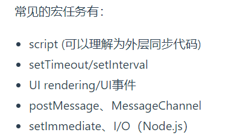

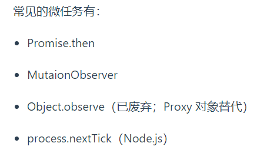

```js
// 宏任务
// script 
// setTimeout/setInterval
// ui 事件
// postMessage、MessageChannel
```

```js
// 微任务
// MutationObserver
// Object.observe
// promise.then
```


```js
async function async1() {
  console.log('async1 start'); 1
  await async2() // 当 asyn 2 的微任务执行完毕后才后将下面的代码加入微任务，所以它才会是最后执行
  console.log('async end'); 7
}
async function async2() {
  return new Promise((resolve, reject) => {
    console.log('async2 start');2
    resolve()
  }).then(res => {
    console.log('async2 end'); // 5
  })
}
 
async1()
 
new Promise(resolve => {
  console.log('Promise'); 3
  resolve()
}).then(res => {
  console.log('Promise end'); // 6
})
 
console.log('script end'); // 4
```


### 说下原型链

比如说我创建了一个数组，但是我明明没有往它身上添加像.push，.pop 这样的方法为什么我可以调用这些方法呢？其实这就是因为原型链的存在，我们往一个对象身上获取一个属性的时候如果它本身不存在这个属性，那么它就会沿着它的proto属性向上查找，我们把它向上查找的路线称之为原型链！

在正常创建的对象身上都有一个protatype 属性，它是存在于对象中的一个内部链接，它会引用其他对象。这个链接的作用是：如果在对象上没有找到需要的属性或者方法引用，引擎就会继续在[[Prototype]]关联的对象上进行查找。同理，如果在后者中也没有找到需要的引用就会继续查找它的[[Prototype]]，以此类推。这一系列对象的链接被称为“原型链”。

instanceof操作符的左操作数是一个普通的对象，右操作数是一个函数。instanceof回答的问题是：在a的整条[[Prototype]]链中是否有指向Foo.prototype的对象？

### 浏览器缓存

浏览器请求时，如果是请求缓存资源，会先判断其是否过期，如果没过去会从缓存读取，如果过期会判断缓存资源是否有 etg 和 lastmodified，如果是有 etg 就将它写在请求头 if-none-match（假如不匹配),如果是有 last-Modifeid就写在 if-modified-since（何时修改），然后web服务器会优先去匹配 etg，做出决策，如果etg相同则返回304如果不同则返回200和新资源

两种缓存规则:

- 对于强制缓存，服务器通知浏览器一个缓存时间，在缓存时间内，下次请求，直接用缓存，不在时间内，执行比较缓存策略。
- 对于比较缓存，将缓存信息中的Etag和Last-Modified通过请求发送给服务器，由服务器校验，返回304状态码时，浏览器走缓存。


### TCP 是如何保证可靠的传输的

#### TCP 三次握手

客户端向服务端请求，我要建立TCP连接，服户端收到后发送确认报文，客户端收到后连接确立。

三次握手的意义是什么？我觉得可以将 TCP 假设成两次握手来看，假设客户端A发出请求连接报文，这个报文因为各种原因滞留延误到连接释放以后才到达B，本来这是一个早已失效的报文段，但B收到此失效的请求报文段后，就误以为是A又发出了一次新的连接请求。于是就向A发出确认报文段，同意建立连接。由于现在A并没有发出建立连接的请求，因此不会理睬B的确认，也不会向B发送数据。但B却以为新的运输连接已经建立了，并一直等待A发来数据。B的许多资源就这样白白浪费了。

#### TCP 四次挥手

A 告诉 B 我要断开连接了，B回复我已经知道你要断开了，A才可以断开连接，B数据处理完成后告诉A我也要断开连接了，A回复可以后还需要等待一段时间2msl，才可以断开连接

A最后为什么要等待？第一，为了保证A发送的最后一个报文段能够到达B。第二，“已失效的连接请求报文段”出现在后面新的连接中。

我记得它会做数据的校验、超时重传、流量的控制加上可靠的连接建立和连接释放机制，这几种因素确保了它的可靠性，嗯这一块我没有看得那么细

### 冒泡、快速、选择排序

```js
 /**
   * 如何理解冒泡？
   * 每次循环都会确定一个最大值或最小值
   * 这也是为什么每次循环最后一位就不用再去比较它了
   * 时间复杂度是 n ²
 */
function Bubble( array ) {
 	for ( let i = 0; i < array.length - 1; i++ ) {
 	    for( let j = 0; j < array.length - i - 1; j++ ) {
 	        if ( array[j] > array[j+1] ) {
 	            const temp = array[j]
 	            array[j] = array[j+1]
 	            array[j+1] = temp
 	        }
 	    }
 	}
}
```

```js
        /**
         * 快速排序: 取一个基准值，然后数组里比它小的放左边，大的放右边，递归
         * 这个过程即可
         * 时间复杂度 O
         */
        function QuickSort( array ) {
            if ( array.length <= 1 ) return array;
            let pivotPlace = Math.floor( array.length/2 )
            let pivot = array.splice( pivotPlace, 1 )[0]
            let left = []
            let right = []
            for ( let i = 0; i < array.length; i++ ) {
                if ( array[i] > pivot ) right.push( array[i] )
                else left.push(array[i])
            }
            return QuickSort(left).concat( [pivot], QuickSort(right) )
        }
        console.log(QuickSort( array ));
```

```
选择排序思路（了解思想和必须会代码默写）（面试最常考） 原理：首先从原始数组中找到最小的元素，并把该元素放在数组的最前面，然后再从剩下的元素中寻找最小的元素，放在之前最小元素的后面，直到排序完毕。
```


## 一面

### 了解事件流吗

#### 概念

页面触发一个事件时，会按照一定的顺序来响应事件，**事件的响应过程为事件流，事件流有冒泡型事件流（IE提出）和捕获型事件流（网景提出）**


后来ECMAScript在DOM2中对事件流进行了进一步规范，基本上就是上述二者的结合。

DOM2级事件规定的事件流包括三个阶段： （1）事件捕获阶段 （2）处于目标阶段 （3）事件冒泡阶段


#### Dom0级

**Dom0 级事件处理只有冒泡阶段**

```js
<div id="btn3">
    btn3
    <div id="btn2">
        btn2
        <div id="btn1">
            btn1
        </div>
    </div>
</div>
<script>
    let btn1 = document.getElementById("btn1");
    let btn2 = document.getElementById("btn2");
    let btn3 = document.getElementById("btn3");
    btn1.onclick=function(){
        console.log(1)
    }
    btn2.onclick=function(){
        console.log(2)
    }
    btn3.onclick=function(){
        console.log(3)
    }
</script>
```

#### Dom2级


```html
<!DOCTYPE html>
<html lang="en">
<head>
    <meta charset="UTF-8">
    <meta http-equiv="X-UA-Compatible" content="IE=edge">
    <meta name="viewport" content="width=device-width, initial-scale=1.0">
    <title>Document</title>
</head>
<body>
    <div id="btn3">
        btn3
        <div id="btn2">
            btn2
            <div id="btn1">
                btn1
            </div>
        </div>
    </div>
</body>
</html>
<script>
    let btn1 = document.getElementById('btn1');
    let btn2 = document.getElementById('btn2');
    let btn3 = document.getElementById('btn3');
    btn1.addEventListener('click',function(){
        console.log(1)
    }, true)
    btn2.addEventListener('click',function(){
        console.log(2)
    }, true)
    btn3.addEventListener('click',function(){
        console.log(3)
    }, true)
</script>
```

tips：点击btn3会输出3，2，1，只执行捕获阶段

**若为每个元素分别绑定了冒泡和捕获两个事件会先执行捕获后执行冒泡，目标元素区别，那个先绑定那个先触发**

```js
btn1.addEventListener('click',function(){
    console.log('btn1冒泡')
}, false)
btn1.addEventListener('click',function(){
    console.log('btn1捕获')
}, true)

btn2.addEventListener('click',function(){
    console.log('btn2冒泡')
}, false)
btn2.addEventListener('click',function(){
    console.log('btn2捕获')
}, true)

btn3.addEventListener('click',function(){
    console.log('btn3冒泡')
}, false)
btn3.addEventListener('click',function(){
    console.log('btn3捕获')
}, true)
```


#### 阻止冒泡

IE：window.event.cancelBubble = true

```js
// 有时候我们需要点击事件不再继续向上冒泡，我们在btn2上加上stopPropagation函数，阻止程序冒泡
btn1.addEventListener('click',function(){
    console.log('btn1冒泡')
}, false)
btn1.addEventListener('click',function(){
    console.log('btn1捕获')
}, true)

btn2.addEventListener('click',function(){
    console.log('btn2冒泡')
}, false)
btn2.addEventListener('click',function(ev){
    ev.stopPropagation();
    console.log('btn2捕获')
}, true)

btn3.addEventListener('click',function(){
    console.log('btn3冒泡')
}, false)
btn3.addEventListener('click',function(e){
    console.log('btn3捕获')
}, true)
```


tips:点击button3

#### 事件委托

如果有多个DOM节点需要监听事件的情况下，给每个DOM绑定监听函数，会极大的影响页面的性能，因为我们通过事件委托来进行优化，事件委托利用的就是冒泡的原理。

```js
<ul>
    <li>1</li>
    <li>2</li>
    <li>3</li>
    <li>4</li>
    <li>5</li>
</ul>
<script>
    var li_list = document.getElementsByTagName('li')
    for(let index = 0;index<li_list.length;index++){
        li_list[index].addEventListener('click', function(ev){
            console.log(ev.currentTarget.innerHTML)
        })
    }
</script>
```

正常情况我们给每一个li都会绑定一个事件，但是如果这时候li是动态渲染的，数据又特别大的时候，每次渲染后（有新增的情况）我们还需要重新来绑定，又繁琐又耗性能；这时候我们可以将绑定事件委托到li的父级元素，即ul。

```js
var ul_dom = document.getElementsByTagName('ul')
ul_dom[0].addEventListener('click', function(ev){  
    console.log(ev.target.innerHTML)
})
```

- target返回触发事件的元素，`不一定是绑定事件的元素`
- currentTarget返回的是绑定事件的元素

因此我们总结一下事件委托的优点:

1. 提高性能:每一个函数都会占用内存空间，只需添加一个事件处理程序代理所有事件，所占用的内存空间更少。
2. 动态监听:使用事件委托可以自动绑定动态添加的元素，即新增的节点不需要主动添加也可以一样具有和其他元素一样的事件。

#### 柯里化函数（有难度先过）

柯里化是指这样一个函数(假设叫做createCurry)，他接收函数A作为参数，运行后能够返回一个新的函数。并且这个新的函数能够处理函数A的剩余参数。

```
function A(a, b, c) {
    // do something
}

var _A = createCurry(A);

_A(1, 2, 3);
_A(1, 2)(3);
_A(1)(2, 3);
_A(1)(2)(3);
A(1, 2, 3);
```

### 从输入 URL 到页面展示到底发生了什么？


第八点说成: 浏览器开始解析 html 和 css 比较合适

第九点：浏览器在解析 html 的过程会并发的去获取嵌入在 HTML 的资源

总结：额。。。我们在页面输入地址后，如果输入的是域名，会先本地查找域名的映射地址，如果查不到会到dns服务器上去查找域名的映射地址，拿到ip地址后呢，会发送一个 HTTP 请求，也就是 get 请求，输入地址一般默认会发送一个 get请求，然后从服务器拿到 HTTP 响应报文，我们假设返回的 content-type 是 text/html，浏览器会开始去解析 HTML 文档构建 Dom 树，并且会并发的去加载嵌入在 HTML 的资源，解析 css 构建渲染树，解析完之后开始绘制到屏幕上。

我刚才说的只是个非常简略的版本，我觉得很少有人能完完全全地去讲述清楚这个过程，因为它涉及到非常多的领域，我只说了我们程序员看到的最直观的一面。

<script>标签会阻塞DOM的解析和渲染；


带src属性的`<script>`标签会触发页面paint，渲染此`<script>`标签之前的元素，但也有一定的条件：

- 此`<script>`标签是在`<body>`中的，`<head>`中的不会触发paint（因为还没有可以展示的东西）；
- 此`<script>`标签之前的`<link>`标签需加载完毕（避免下面的 dom 操作有涉及到修改样式的部分，造成冲突）。

inline的`<script>`标签不会触发页面paint，页面必须等到脚本执行完毕，且DOM Tree和CSSOM Tree解析完毕后才会渲染；

`<link>`标签不会阻塞DOM的解析；

`<link>`标签会阻塞DOM的渲染；

`<link>`标签同时还会阻塞其之后的`<script>`标签的执行。

### JS 类型判断

#### typeof


#### Object.prototype.toString.call

tips：这个方法可以返回内置类型


为什么只能通过 Object.prototype.toString.call 的方式去判断数据类型？不能就直接调用 toString？因为 Number，Boolean，String 身上的 toString 方法是被改写的，他们的 toString 方法是无法返回数据类型的，而只有 object.prototype.toSring 的方法可以，也是为什么对象就可以直接通过.toString 的方式去获取到数据类型 

#### obj instanceOf Object

tips：左边放你要判断的内容，右边放类型来进行JS类型判断，**只能用来判断复杂数据类型,因为instanceof 是用于检测构造函数（右边）的 `prototype` 属性是否出现在某个实例对象（左边）的原型链上。**


### 如何理解CDN？说说其原理

我觉得要理解CDN可以用一句话总结就近获取，它的原理大概就是把同样的资源分布到各个服务器上，用户请求资源的时候就就近获取资源

术语：用户提交域名的时候，浏览器对域名进行解析，先是到全局负债均衡服务器ip地址，请求它拿到区域负载均衡服务器的ip地址，区域负载均衡服务器会根据用户 ip 选择距离近的一台缓存服务器ip给用户

### 关于vue

#### computed、watch、filter 使用的区别：

- 我觉得可以从字面上理解computed和watch
- computed：当有值依赖于某个值计算得出的我们就可以使用computed
- watch：当我们需要监听某个值的变化去做某些操作的时候，我们可以用watch
- filter：我觉得可以对比computed，它需要显示的调用而且每次模板渲染的时候都要重新计算

#### 讲讲vue的异步更新


vue的异步更新可以利用 nextTick()这API，我没有去真正读过它的源码，但是我大概知道它的原理是什么，就是利用事件循环机制，异步操作只会在调用栈为空的情况执行的规律，等同步状态更新完之后再去执行异步任务

## 一面

### 1.AJAX工作原理

通过XmlHttpRequest对象来向服务器发异步请求，从服务器获得数据，然后用javascript来操作DOM而更新页面。

### 2.单行文本省略号显示

```
white-space: nowrap; // 表示溢出的元素不换行
overflow: hidden; // 超出的部分隐藏
text-overflow: ellipsis; // 文本超出的部分省略号展示
```

### 3.防抖和节流理论＋手撕

防抖：搜索框最后一次输入才发起请求

节流：抢票你点得多快都只在一定频率发一次请求


点得再快一定时间只会发一次请求

## 一面

### new Array(10)


### 跨域

#### 概念

要了解跨域首先要知道浏览器的同源策略：由于请求的文件可能会存在恶意的攻击，浏览器不允许直接访问另一个“域”上的资源，只能访问同一个“域”上的资源。而所谓“同源”就是指：“协议、域名、端口号”相同。当我们试图访问另一个域上的资源时就是跨域，浏览器是不允许的！

#### jsonp

**概念**

利用 script 标签可跨域特性，让后端返回一个 js 函数调用，将要传递的参数写在参数上；前端就写一个函数接收参数。

**优点**

支持老式浏览器

**缺点**

需要前后端双方提前约定好参数函数名等，只能进行get请求

**演示**

```js
// 创建一个文件：jsonpData.js
showData({
    name: "Crimson fire",
    culture: "Yaaxil"
})

// 开启一个服务
const http = require('http')
const fs = require('fs')

http.createServer(function(req, res) {
    if (req.url === '/jsonpData.js') {
        fs.readFile('./jsonpData.js', function (err, file) {
          res.setHeader('Content-Type', 'text/js');
          res.writeHead('200', "OK");
          res.end(file);
      });    
    }
}).listen(8082)

// 前端利用 script 标签调用
const s = document.createElement("script");
s.src = "http://localhost:8082/jsonpData.js";
document.body.appendChild(s);

function showData(myObj) {
  console.log(myObj);
}
```

#### cors

##### **概念**

cross-origin resource sharing（跨域资源共享）是一种跨域的解决方案，它允许浏览器向跨源服务器，发出XMLHttpRequest请求，从而克服了AJAX只能使用同源的限制。但是需要浏览器支持

##### **注意**

整个CORS通信过程，都是浏览器自动完成，不需要用户参与。对于开发者来说，CORS通信(只要在服务器端设置了就行)与同源的AJAX通信没有差别，代码完全一样。**浏览器一旦发现是cors情况的AJAX请求跨源，就会自动添加一些附加的头信息，有时还会多出一次附加的请求（复杂的请求咨询支持的方法等等），但用户不会有感觉。**

##### **发送 cors 简单请求**

就是在头信息之中，增加一个Origin字段


Origin字段用来说明，本次请求来自哪个源（协议 + 域名 + 端口）

如果origin指定的域名在服务端的许可范围，服务端返回的响应会多出几个头部信息字段

如果没有以下字段说明这次跨域不是成功的


```
1、XMLHttpRequest对象的getResponseHeader()方法只能拿到6个基本字段：Cache-Control、Content-Language、Content-Type、Expires、Last-Modified、Pragma。如果想拿到其他字段，就必须在Access-Control-Expose-Headers里面指定。上面的例子指定，getResponseHeader('FooBar')可以返回FooBar字段的值
```


##### 发送非简单请求

非简单请求的CORS请求，会在正式通信之前，增加一次HTTP查询请求，称为"**预检"请求（preflight）**。

浏览器首先发送请求询问服务器，当前网页所在的域名是否在服务器的许可名单之中，以及可以使用哪些HTTP动词和头信息字段。只有得到肯定答复，浏览器才会发出正式的XMLHttpRequest请求，否则就报错。


```
"预检"请求用的请求方法是OPTIONS，表示这个请求是用来询问服务器支持什么请求方法的。
"预检"请求的头信息包括两个特殊字段。
（1）Access-Control-Request-Method
该字段是必须的，用来列出浏览器的CORS请求会用到哪些HTTP方法，上例是PUT。
（2）Access-Control-Request-Headers
该字段是一个逗号分隔的字符串，指定浏览器CORS请求会额外发送的头信息字段，上例是X-Custom-Header。
```


#### 反向代理

跨域只是浏览器向服务器发送请求的时候，浏览器的限制。而服务器和服务器之间是没有跨域的限制的。而反向代理是利用代理服务器接收到请求之后，转发给真正的服务器，并把结果返回到浏览器上。

客户端发送请求：locahost：8080 ->  代理服务器转发 -> 服务端

客户端接收请求：服务端响应 -> 代理服务器(伪造成locathost:8080) -> 客户端


### new 原理

```js
function myNew(fn, val) {
    let obj = Object.create(fn.prototype)
    fn.call(obj, val) // 关键步骤，创建对象属性
    return obj
}
```

### map 和 weakMap 的区别

我们知道map设置键值的本质其实就是将这两个键值分别插入到两个数组的末尾，这样有一个缺点就是可能会导致内存泄漏，因为数组会一直引用着每个键和值。这种引用使得垃圾回收算法不能回收处理他们，即使没有其他任何引用存在了。

`WeakMap` 持有的是每个键对象的“弱引用”，这意味着在没有其他引用存在时垃圾回收能正确进行。**正由于这样的弱引用，`WeakMap` 的 key 是不可枚举的**（没有方法能给出所有的 key）。如果key 是可枚举的话，其列表将会受垃圾回收机制的影响，从而得到不确定的结果。

### for in 和 for of 的区别


## 个人猜测

### Vue 响应式原理

#### Object.defineProperty做数据劫持


#### defineReactive函数


递归侦测对象全部属性


tips：没有 __ob__ 说明还没有侦测

```js
import Observer from './Observer.js';

export default function (value) {
    // 如果value不是对象，什么都不做
    if (typeof value != 'object') return;
    // 定义ob
    var ob;
    if (typeof value.__ob__ !== 'undefined') {
        ob = value.__ob__;
    } else {
        ob = new Observer(value);
    }
    return ob;
}

```


先侦测最外层属性，然后如果子属性是对象会时对象里面的值也会被递归侦测


#### 数组响应式处理


vue 以 Array.protatype 为原型创建了一个 arrayMethods 对象（有改写数组的七个方法），让创建的数组对象的_proto_指向这个对象（调用 ES6 的Object.setPrototypeOf）红色笔上下两种写法是等价的


tips：当数组插入新值的时候我们给这个新值做响应式，注意用浅拷贝，这样才会作用到原数组本身


#### 依赖收集

在 set 中收集依赖，在 get 中触发依赖


#### Watcher 类 和 Dep 类

#### 总结

我觉得要理解 vue 响应式原理可以从 vue 中的 watch api 出发，我们在 watch 一个数据的时候会传入，要监听的数据，还有一个回调，其实这个过程是调用了 vue 中 new wathcer 的一个过程，我们 new watcher 的时会让window.target 去指向新创建的 wathcer 实例自身，然后它还会主动的去读取我们要监听的对象属性，这个时候就会触发属性的 get，而 get 中会触发收集依赖的操作也就是dep.depend,dep.depend它做的其实就是就是将 window.target 添加到数组中；这样就完成了依赖的收集，当我们再次去修改这个属性值的时候就会触发它的set，这里面它会执行 dep.notify(),而notify做的就是遍历依赖执行回调方法，这就是vue的响应式原理


### 前端安全

## 说一说你的实习项目

我现在在公司做的是维护我小组一个叫playsmart的项目，包括它的前后台和脚手架；我做得最多的是维护一个叫 psd2ui 的脚手架，它实现功能就是将设计师psd文件转换为我们小组游戏引擎所支持的文件结构，去提升前端游戏工程师的开发效率，我说一说我为它添加的两个我觉得比较有意义的功能吧，虽然说实现难度没有那么高，但是我觉得这样提升了大家的一个研发效率，

一个是我为它引入了一个叫inquirer的一个库，让它有了像vue-cli那样的命令行操作，大家原先都是通过 psd2ui -s ‘输入路径’ -o '路径'，但是我觉得这样很不方便，多说无益，我直接演示一下我实现的功能吧。

还有一个是我修复了里面一个无像素图层报错的bug，首先我通过debug去定位了这个错误，然后我的leader希望我能把这个错误的上下文，给暴露提示出来，本来是一个挺简单的需求嘛，就简单的throw一下然后在最外层去catch这个错误的时候，但是这个库的开发者（一位已经离职的同学），他是一个很谨慎的人，他在这里面做了大量的 try catch 语句，但是他每次 catch 的时候就只是简单的打印，以至于我在外面捕获不到错误，然后我就不得不沿着这个函数的调用栈去为这些 try catch 添加 throw err，我不知道您编程的时候有没有这样的疑惑，到底这个地方我该不该做个捕获处理呢，psd2ui库的开发者的这种处理方式可以称为是防御式的编程，但其实经过这次工作我对错误的捕获做了一定的思考，我挺赞同新时期node.js这本书作者的一个观点，let it crash，就是与其小心翼翼的去防御某个未知的错误，不妨让这个错误暴露出来，在函数调用的最外层去捕获这个错误即可，这样不仅让程序得以继续运行，也能通过最外层的捕获去定位错误！

我就介绍这么多，您有没有什么其他想问的？

如果他不赞同这种观点：我说的这种处理方式当然不是在每一个场景里都适用，如果这个错误是可预知的那就不建议用这种方式去处理，如果程序里很有不可预知的错误，那么不妨可以试试这种方式


## 说一说你的项目经历

这个项目是我在实验室负责的一个项目，为了做这个项目我们团队还去了梅州金绿集团的鸽子厂做了两个星期的调研，这个项目模块比较多，我去汇量之后就没有在继续做这个项目了，不过已经是基本成型的了，我在之前在这个项目做的工作有管理整个项目的代码，分配前端人员的工作，包括跟后端联调，封装一些通用的公共组件，一些通用的页面模板，还有我还给他做了响应式的适配，包括webpack的一些性能优化还有项目部署

- PC端的响应式适配怎么做

# 金山 WPS

## 一面

### 介绍一下执行上下文

执行上下文：分为全局执行上下文、函数执行上下文，其区别在于全局执行上下文只有一个，函数执行上下文在每次调用函数时候会创建一个新的函数执行上下文。

我们在执行全局代码的前会将 window 确定为全局执行上下文，对全局数据进行预处理(例如变量声明提示、函数声明提示，this指向等)然后才开始执行全局上下文代码；然后函数执行上下文也是同样的道理，不同的是this的指向问题。

this 指向：强绑定、隐式绑定、默认绑定、new 绑定


### 面向对象有哪些优势和特点

三大特点：

- 封装：将一些对象的共同特性封装到一块 -> 复用性好
- 多态：同样的动作不同的对象可以有不同的表现形式 -> 表现形式多
- 继承：继承父类的特性 -> 拓展性强

### flex 属性

align-items: 交叉轴对齐方式

justify-contet：主轴对齐方式


### 自己写一个 vue-cli

- 思路就是：配置好问答，通过 git 等方式拉取模板到本地

- 先有一个模板放在远程仓库
- npm init 初始化一个项目，写好入口文件和名字，npm link 到全局方便调试
- 引入依赖：comander、download-git-repo 就行

### web worker 和 web socket

#### web worker

worker.html

```js
const worker = new Worker('worker.js')
worker.postMessage('丹敏是猪')
worker.onmessage = function(e) {
    console.log(e.data);
}
```

worker.js

```js
onmessage = function(e) {
    let data = e.data
    data = data.split("").reverse().join('')
    postMessage(data)
}
```

在HTML5中，我们可以使用Web Worker创建一个“后台线程”来执行某一段耗时较长的JavaScript程序，而不会影响页面响应。Web Worker其实就是HTML5提供的“JavaScript多线程”解决方案。

Web Worker技术基本原理就是：在当前JavaScript的主线程中，使用Worker()构造函数新建一个worker实例，然后加载某一个JavaScript文件，发送给一个后台线程来处理（注意，这里是后台线程）。

#### web socket

我们知道 HTTP 协议有一个缺陷就是通信只能由客户端发起，HTTP 协议做不到服务器主动向客户端推送消息，如果服务端有连续的状态变化，如果我们想知道就非常麻烦，只能采用轮询的方式，这样不仅效率低而且非常消耗资源，而 webSocket 就这样诞生了，服务端可以主动向客户端发送消息，而客户端也可以主动向服务器发送消息，是真正的双向平等对话，属于服务器推送技术的一种。 

websocket.html

```html
<!DOCTYPE html>
<html>

<head>
	<meta charset="UTF-8">
	<title>WebSocket Chat</title>
</head>

<body>
	<script type="text/javascript">
		var socket;
		if (!window.WebSocket) {
			window.WebSocket = window.MozWebSocket;
		}
		if (window.WebSocket) {
			socket = new WebSocket("ws://localhost:8080/ws");
			socket.onmessage = function (event) {
				var ta = document.getElementById('responseText');
				ta.value = ta.value + '\n' + event.data
			};
			socket.onopen = function (event) {
				var ta = document.getElementById('responseText');
				ta.value = "连接开启!";
			};
			socket.onclose = function (event) {
				var ta = document.getElementById('responseText');
				ta.value = ta.value + "连接被关闭";
			};
		} else {
			alert("你的浏览器不支持 WebSocket！");
		}

		function send(message) {
			if (!window.WebSocket) {
				return;
			}
			if (socket.readyState == WebSocket.OPEN) {
				socket.send(message);
			} else {
				alert("连接没有开启.");
			}
		}
	</script>
	<form onsubmit="return false;">
		<h3>WebSocket 聊天室：</h3>
		<textarea id="responseText" style="width: 500px; height: 300px;"></textarea>
		<br>
		<input type="text" name="message" style="width: 300px" value="Welcome to waylau.com">
		<input type="button" value="发送消息" onclick="send(this.form.message.value)">
		<input type="button" onclick="javascript:document.getElementById('responseText').value=''" 
			value="清空聊天记录">
	</form>
	<br>
	<br>
</body>

</html>
```

webSocket.js

```js
const WebSocket = require('ws');

const server = new WebSocket.Server({ port: 8080 });

server.on('open', function open() {
  console.log('connected');
});

server.on('close', function close() {
  console.log('disconnected');
});

server.on('connection', function connection(ws, req) {
  const ip = req.connection.remoteAddress;
  const port = req.connection.remotePort;
  const clientName = ip + port;

  console.log(ip, port);

  console.log('%s is connected', clientName)

  // 发送欢迎信息给客户端
  ws.send("Welcome " + clientName);

  ws.on('message', function incoming(message) {
    console.log('received: %s from %s', message, clientName);
    
    // 广播消息给所有客户端
    server.clients.forEach(function each(client) {
      if (client.readyState === WebSocket.OPEN) {
        client.send( clientName + " -> " + message);
      }
    });

  });

});
```

### async 和 generator

tips: async await 其实就是下面这份操作的一个语法糖，牢记是在 then 回调中才执行下一步

```js
function getApi(params) {
    return new Promise((resolve) => {
      // 模拟ajax
      setTimeout(() => {
        resolve('api result: ' + params)
      }, 1000)
    })
  }
  
  function* gen(stage0) {
    console.log(stage0)
    let stage1 = yield getApi('startParams')
    console.log('stage1', stage1)
    let stage2 = yield getApi(stage1)
    console.log('stage2', stage2)
    let stage3 = yield getApi(stage2)
    console.log('stage3', stage3)
    return 'all Done!!'
  }
  
  function run(generator, v) {
    let { value, done } = generator.next(v)
    console.log(value, done, '------');
    if (!done) {
      value.then((res) => {
        run(generator, res)
      })
    } else {
      console.log(value)
    }
  }
  
  run(gen('start'))
```

### CSS3 动画、变形、过渡

#### 动画


#### 变形

在CSS3中，我们可以使用transform属性来实现元素的变形效果


#### 过渡

在CSS3中，我们可以使用transition属性将元素的某一个属性从“一个属性值”在指定的时间内平滑地过渡到“另一个属性值”，从而实现动画效果（请字斟句酌地理解这句话，非常重要）。

CSS变形（transform）呈现的仅仅是一个“结果”，而CSS过渡（transition）呈现的是一个“过程”。这个所谓的“过程”，通俗来说就是一种动画变化过程，如渐渐显示、渐渐隐藏、动画快慢等


凡是涉及CSS3过渡，我们都是结合:hover伪类来实现过渡效果的

```
.father {
    width: 100px;
    height: 100px;
    background-color: pink;
    transition: background-color 1s linear 2s;
}

.father:hover {
    background-color: aqua;
}
```

### box-sizing


### sessionStorage 和 localStorage 的区别

- localStorage生命周期是永久，这意味着除非用户显示在浏览器提供的UI上清除localStorage信息，否则这些信息将永远存在。
- sessionStorage生命周期为当前窗口或标签页，一旦窗口或标签页被永久关闭了，那么所有通过sessionStorage存储的数据也就被清空了。
- 不同浏览器无法共享localStorage或sessionStorage中的信息。相同浏览器的不同页面间可以共享相同的 localStorage（页面属于相同域名和端口），但是不同页面或标签页间无法共享sessionStorage的信息。这里需要注意的是，页面及标 签页仅指顶级窗口，如果一个标签页包含多个iframe标签且他们属于同源页面，那么他们之间是可以共享sessionStorage的。

# 计算机网络

## HTTP发展历程和各个版本的区别

HTTP协议到现在为止总共经历了3个版本的演化

### HTTP 0.9

HTTP 0.9是第一个版本的HTTP协议，已过时。它的组成极其简单，**只允许客户端发送GET这一种请求，且不支持请求头**。由于没有协议头，造成了HTTP 0.9协议只**支持一种内容，即纯文本**。不过网页仍然支持用HTML语言格式化，同时无法插入图片。

HTTP 0.9具有典型的**无状态性**，每个事务独立进行处理，事务结束时就释放这个连接。一次HTTP 0.9的传输首先要建立一个由客户端到Web服务器的TCP连接，由客户端发起一个请求，然后由Web服务器返回页面内容，然后连接会关闭。**如果请求的页面不存在，也不会返回任何错误码。**

### HTTP 1.0

HTTP协议的第二个版本，第一个在通讯中指定版本号的HTTP协议版本，至今仍被广泛采用。相对于HTTP 0.9 增加了如下主要特性：

- 请求与响应支持头域
- 响应对象以一个响应状态行开始
- 响应对象不只限于超文本
- 开始支持客户端通过POST方法向Web服务器提交数据，支持GET、HEAD、POST方法
- 支持长连接（但默认还是使用短连接），缓存机制，以及身份认证 

### **HTTP 1.1**

HTTP协议的第三个版本，是目前使用最广泛的协议版本

HTTP 1.1引入了许多关键性能优化：keepalive连接，chunked编码传输，字节范围请求，请求流水线等

#### Persistent Connection（keepalive连接，持久连接）

允许HTTP设备在事务处理结束之后将TCP连接保持在打开的状态，避免未来的HTTP请求想要重用现在的连接，直到客户端或服务器端决定将其关闭为止。

在HTTP1.0中使用长连接需要添加请求头 Connection: Keep-Alive，而在HTTP 1.1 所有的连接默认都是长连接，除非特殊声明（ HTTP请求报文首部加上Connection: close ）


tips：多个连接和持久连接的过程，很明显后面的情况更为合理

#### chunked编码传输

该编码将实体分块传送并逐块标明长度,直到长度为0块表示传输结束, 这在实体长度未知时特别有用(比如由数据库动态产生的数据)

#### 字节范围请求

HTTP1.1支持传送内容的一部分。比方说，当客户端已经有内容的一部分，为了节省带宽，可以只向服务器请求一部分。该功能通过在请求消息中引入了range头域来实现，它允许只请求资源的某个部分。在响应消息中Content-Range头域声明了返回的这部分对象的偏移值和长度。如果服务器相应地返回了对象所请求范围的内容，则响应码206（Partial Content）

#### Pipelining（请求流水线）


### HTTP 2.0

HTTP 2.0最大的特点: 不会改动HTTP 的语义，HTTP 方法、状态码、URI 及首部字段，等等这些核心概念上一如往常，却能致力于突破上一代标准的性能限制，改进传输性能，实现低延迟和高吞吐量。

HTTP 2.0是下一代HTTP协议，目前应用还非常少。主要特点有：

- **多路复用（二进制分帧）**
  - 之所以叫2.0，是在于新增的二进制分帧层。在二进制分帧层上， HTTP 2.0 会将所有传输的信息分割为更小的消息和帧,并对它们采用二进制格式的编码 ，其中HTTP1.x的首部信息会被封装到Headers帧，而我们的request body则封装到Data帧里面。
  - 
- 头部压缩（不太懂）
  - 当一个客户端向相同服务器请求许多资源时，像来自同一个网页的图像，将会有大量的请求看上去几乎同样的，这就需要压缩技术对付这种几乎相同的信息。
- 随时复位（不太懂）
  - HTTP1.1一个缺点是当HTTP信息有一定长度大小数据传输时，你不能方便地随时停止它，中断TCP连接的代价是昂贵的。使用HTTP2的RST_STREAM将能方便停止一个信息传输，启动新的信息，在不中断连接的情况下提高带宽利用效率。
- **服务器端推流: Server Push**
  - 客户端请求一个资源X，服务器端判断也许客户端还需要资源Z，在无需事先询问客户端情况下将资源Z推送到客户端，客户端接受到后，可以缓存起来以备后用。
- 优先权和依赖（不太懂）
  - 每个流都有自己的优先级别，会表明哪个流是最重要的，客户端会指定哪个流是最重要的，有一些依赖参数，这样一个流可以依赖另外一个流。优先级别可以在运行时动态改变，当用户滚动页面时，可以告诉浏览器哪个图像是最重要的，你也可以在一组流中进行优先筛选，能够突然抓住重点流。 

## HTTP 和 HTTPs 的区别

### HTTP 与 HTTPS 区别

- HTTP 明文传输，数据都是未加密的，安全性较差，HTTPS（SSL+HTTP） 数据传输过程是加密的，安全性较好。
- 使用 HTTPS 协议需要到 CA（Certificate Authority，数字证书认证机构） 申请证书
- HTTP 页面响应速度比 HTTPS 快，主要是因为 HTTP 使用 TCP 三次握手建立连接，客户端和服务器需要交换 3 个包，而 HTTPS除了 TCP 的三个包，还要加上 ssl 握手需要的 9 个包，所以一共是 12 个包。
- http 和 https 使用的是完全不同的连接方式，用的端口也不一样，前者是 80，后者是 443。
- HTTPS 其实就是建构在 SSL/TLS 之上的 HTTP 协议，所以，要比较 HTTPS 比 HTTP 要更耗费服务器资源，但是相对的它也更加安全

## HTTPs

相对于 HTTP 的明文传输，HTTPs 利用了对称加密（用同一个私钥加密和解密）和非对称加密（用公钥加密用私钥解密）避免数据在传输过程中被窃取，另外HTTPs客户端可以通过服务端SSL证书（向CA机构申请）确定服务端身份，而服务端数据传输给客户端会通过会话密钥加密传输所以不用担心数据被窃取。

- 反问：什么是非对称加密？我觉得可以这样理解非对称加密，通信的双方都拥有自己的公钥和私钥，然后将公钥暴露出来，要传输数据的一方利用对方的公钥对数据进行加密，那么能解密这份数据的也就只有拥有对应的私钥的人，也就是接受数据的一方。
- 反问：会话密钥是如何获取的？这涉及到TSL握手的过程，
  - 首先客户端（client hello）会将自己的TSL版本和加密套件，生成一个随机数传送给服务端，(第一次握手)
  - 服务端（server hello）收到后会响应自己的TSL版本和加密套件，生成的一个随机数给客户端，
  - 然后响应自己的证书;公钥;还有 server hello done（第二次握手）
  - 接着客户端生成第三个随机数，并用刚才服务端的公钥进行加密生成预主密钥发送给服务端（第三次握手）
  - 然后服务端利用自己私钥解密也就知道预主密钥了，因为没有直接进行传输现在就只有服务端和客户端知道这个预主密钥
  - 然后双方再利用第一个随机数和第二个随机数加预主密钥生成会话密钥，后续双方就采用对称加密就可以保证数据的安全传输了

## TCP 三次握手和四次挥手

### 三次握手

我先简单的描述一下三次握手的一个过程：首先客户端会告诉服务端我要建立TCP连接，服务端再收到客户端的请求后会响应说我收到你的请求了，然后客户端告诉服务端那我们正式建立TCP连接。

不过我还没讲到握手的核心，**握手的核心在于怎么判断出那些请求或者那些响应需要丢弃**，这个时候就需要标识去确认！那么这个标识怎么生成呢？其实在TCP第一次握手的时候客户端会开启SYN(Synchronization)控制位表示想要与服务端进行数据同步，并且传送一个序号，服务端收到客户端的请求后会开启SYN，和ACK(AcKnowledgement表示确认的意思)控制位还有生成确认号(客户端生成的序列表+1)，序列号一并响应给客户端，客户端就可以通过服务端传递回来的确认号就可以判断是否是自己要通信的服务端，在确定后他会开起ACK控制位，并将刚才对方传递过来的序号＋1生成确认好传递给服务端，服务端收到响应报文，通过确认号就可以判断出是否是要和自己建立TCP的客户端，如果是，TCP握手就成功了，两边不仅能通过序列号还可以通过控制位来区别进行到哪个步骤。


#### 为什么是三次握手？

要知道为什么我觉得我们可以先假定一种异常情况，A发出的第一个连接请求在某些网络结点长时间滞留了，以致延误到连接释放以后的某个时间才到达B。本来这应该是一个早已失效的报文段。但B收到此失效的连接请求报文段后，就误认为是A又发出一次新的连接请求。于是就向A发出确认报文段，同意建立连接，这样就会造成B资源的占用，所以才要进行三次握手让A做一个确认连接建立。

### 四次挥手

因为是全双工通信，双方在通信完毕后都能主动要求关闭要求，我们假设是客户端主动发起关闭请求，

第一次挥手：那么它会开启FIN(finish表示结束的意思)和ACK两个控制位还有发送序号和确认号(这两个数字在通信的过程中不端递增，使用最后一次通信的)，

第二次挥手：服务端收到后会开启ACK控制和发送序号(用对方传来的确认号)和确认号(用对方传来的序号+1),

第三次挥手：服务端在处理完数据后，会再次发送ACK控制位还有FIN控制位来进行最后的确认（确认号和序号不需要改变），

第四次挥手： 开启ACK控制位，序号：对方确认号＋1，确认号:对方序号＋1

反问:为什么要四次挥手：假如说在一边提出连接关闭后就关闭通信的话，会导致另一边可能还存在没发送的数据通信的关闭的情况，设置四次挥手可以避免情况，一方提出申请后等待对方处理完，再关闭。

反问：为什么客户端最后回复ACK后要进行等待，避免服务端没有收到ACK重发FIN和ACK的情况，影响下次通信。


#### 为什么要进行四次挥手？

因为TCP是全双工通信，其实觉得可以客户端和服务端各自的两次挥手，双方在处理完自己的数据后都可以主动断开自己的连接，避免出现说我处理完数据就直接就断开连接，不管对方数据有没有处理完的情况。

## TCP 和 UDP 的区别

### UDP

用户数据报协议UDP只在IP的数据报服务之上增加了很少一点的功能，这就是复用和分用的功能以及差错检测的功能。

#### UDP 的主要特点是：

- (1) **UDP是无连接的**：即发送数据之前不需要建立连接（当然，发送数据结束时也没有连接可释放），因此减少了开销和发送数据之前的时延。
- (2) UDP使用尽最大努力交付：即不保证可靠交付，因此主机不需要维持复杂的连接状态表（这里面有许多参数）(所以丢包率高一些)
- (3) UDP是面向报文的：发送方的UDP对应用程序交下来的报文，在添加首部后就向下交付IP层。UDP对应用层交下来的报文，既不合并，也不拆分，而是保留这些报文的边界。因此，应用程序必须选择合适大小的报文。若报文太长，UDP把它交给IP层后，IP层在传送时可能要进行分片，这会降低IP层的效率。反之，若报文太短，UDP把它交给IP层后，会使IP数据报的首部的相对长度太大，这也降低了IP层的效率。


- (4) **UDP没有拥塞控制**，因此网络出现的拥塞不会使源主机的发送速率降低。这对某些实时应用是很重要的。**很多的实时应用（如IP电话、实时视频会议等）要求源主机以恒定的速率发送数据，并且允许在网络发生拥塞时丢失一些数据，但却不允许数据有太大的时延。UDP正好适合这种要求。**但是虽然某些实时应用需要使用没有拥塞控制的UDP，但当很多的源主机同时都向网络发送高速率的实时视频流时，网络就有可能发生拥塞，结果大家都无法正常接收。因此，不使用拥塞控制功能的UDP**有可能会引起网络产生严重的拥塞问题**。
- (5) UDP支持一对一、一对多、多对一和多对多的交互通信。
- (6) UDP的首部开销小，只有8个字节，比TCP的20个字节的首部要短。

#### UDP 的首部格式

用户数据报UDP有两个字段：数据字段和首部字段。首部字段很简单，只有8个字节(图5-5)，由四个字段组成，每个字段的长度都是两个字节。各字段意义如下：


### TCP

#### TCP 最主要的特点

- TCP是**面向连接**的运输层协议:
  -  这就是说，应用程序在使用TCP协议之前，必须先建立TCP连接。在传送数据完毕后，必须释放已经建立的TCP连接。也就是说，**应用进程之间的通信好像在“打电话”：通话前要先拨号建立连接，通话结束后要挂机释放连接。**
- TCP提供**可靠交付**的服务: 
  - 通过TCP连接传送的数据，无差错、不丢失、不重复、并且按序到达(因为它的重传机制)。
- TCP提供**全双工通信**：
  - TCP允许通信双方的应用进程在任何时候都能发送数据。TCP连接的两端都设有发送缓存和接收缓存，用来临时存放双向通信的数据。在发送时，应用程序在把数据传送给TCP的缓存后，就可以做自己的事，而TCP在合适的时候把数据发送出去。在接收时，TCP把收到的数据放入缓存，上层的应用进程在合适的时候读取缓存中的数据。
- **面向字节流**：
  - TCP不保证接收方应用程序所收到的数据块和发送方应用程序所发出的数据块具有对应大小的关系（例如，发送方应用程序交给发送方的TCP共10个数据块，但接收方的TCP可能只用了4个数据块就把收到的字节流交付上层的应用程序）。但接收方应用程序收到的字节流必须和发送方应用程序发出的字节流完全一样。当然，接收方的应用程序必须有能力识别收到的字节流，把它还原成有意义的应用层数据。


tips：TCP和UDP在发送报文时所采用的方式完全不同。TCP并不关心应用进程一次把多长的报文发送到TCP的缓存中，而是根据对方给出的窗口值和当前网络拥塞的程度来决定一个报文段应包含多少个字节（UDP发送的报文长度是应用进程给出的）。如果应用进程传送到TCP缓存的数据块太长，TCP就可以把它划分短一些再传送。如果应用进程一次只发来一个字节，TCP也可以等待积累有足够多的字节后再构成报文段发送出去。

#### 可靠传输的原理


## cookie、session、Token

- cookie 其实就是一种数据的载体，每次发请求的时候都会默认添加到请求头中
- 而 session 是保存在服务端的，服务端可以利用 session(保存用户信息) 保持登录状态，服务端生成 session 后会返回一个 sessionID 给客户端，客户端在请求时利用 cookie 作为载体传送给服务端
- Token(也是记录着用户信息等，可以用来保持登录状态) 的话是由服务端生成，但是存储在客户端的(可以用cookie或者storage存)，一般我们存在storage里，可以防止csrf的攻击，cookie会自动添加到请求头

# 操作系统

## 堆和栈的概念

我觉得可以把栈理解成成有序的格子，容量小但是因为它的有序性读取起来也快，而堆是一大块区域，虽然容量大但是找一个东西很麻烦，读取慢，然后我们js中基本类型是存储在栈中的，而引用类型是存储在堆里面的，不过它的引用仍然是存储在栈内存中的。

# 数据结构与算法

## 打印三角形

```js
function triangle(n) {
    for ( let i = 1; i <= n; i++ ) {
        let str = ''
        // 确定空格
        for ( let j = 0; j < n - i; j++) {
            str += ' '
        }

        // 确定星星
        for ( let k = 0; k < 2*i - 1; k++ ) {
            str += '*'
        }
        console.log(str);
    }
}

triangle(5)
```


## 链表和数组的区别


## 时间复杂度

极限的执行次数取它的最高次项并去掉它的系数

# Vue

## vue 的生命周期


## 讲一下 setup

首先是它的执行时机: 在 beforeCreate 之前执行一次，此时 this 是 undefined

另一个是它的参数: 

- props: 值为对象，包含: 组件外部传递过来，且组件内部声明接收了的属性
- context: 上下文对象
  - attrs: 值为对象，包含：组件外部传递过来，但没有在props配置中声明的属性, 相当于 ```this.$attrs```。
  - slots: 收到的插槽内容, 相当于 ```this.$slots```。
  - emit: 分发自定义事件的函数, 相当于 ```this.$emit```。

# 腾讯一面

## 双向绑定原理

我觉得要了解双向绑定原理可以从vue里面一个非常经典的指令出发也就是v-model，比如我们在input 绑定v-model：value，然后同时在它上方搞个h1然后它也展示value吧，然后我们在input修改数据的同时我们发现上面的数据也会发生变化，这到底发什么了什么呢？如果我们不用vue框架用原生的js去实现我们会怎么实现无非就是监听输入框的变化，然后就给h1的innerhtml改下值嘛，然后要是有很多个像h1的标签呢，我们难道每个标签都自己手动去获取，如果是后面通过服务器的数据动态渲染的标签怎么办，有很多时候我们是无法一次性知道有那些标签引用了这个值的，那么有没有一种方法可以自动去完成这些操作呢？这就要引入一个叫做数据劫持的概念了，vue源码里它是利用 object.defineProperty 去实现的，什么是数据劫持呢，官方术语就是在get中的收集依赖在set中触发依赖，如果要简单的说就是如果有人要拿这个值的时候我们就把这个人记住，然后修改这个值的时候通知所有拿过这个值的人去做一个更新，这样就能实现双向绑定了嘛。

## eventloop题目

```js
console.log("1");
 
setTimeout(function() {
    console.log("2");
}, 0);
 
new Promise(res=>{
console.log(6); 
res() // 说明promise已经是成功状态了，但是then的回调仍然要等到调用栈的东西执行完，所以5要先执行
}).then(function() {
        console.log("3");
}).then(function() {
        console.log("4");
});
 
console.log("5");
```

165342

```
async function async2() {
    console.log('async2')
}

async function async1() {
  await async2()
  console.log(77);
}
async1()
console.log(666);
```

async2 666 77

## 事件机制

从根本上讲，浏览器的事件机制是很简单的。它是在指**定的DOM 结点上为指定的事件注册一个处理函数，**当事件发生的时候，如果存在处理函数，则调用。

## 如何阻止a标签跳转


## 数组去重

```js
    var arr = [{
      key: '01',
      value: '乐乐'
    }, {
      key: '02',
      value: '博博'
    }, {
      key: '03',
      value: '淘淘'
    }, {
      key: '04',
      value: '哈哈'
    }, {
      key: '01',
      value: '乐乐'
    }];

    // 方法1：利用reduce方法遍历数组,reduce第一个参数是遍历需要执行的函数，第二个参数是item的初始值
    var obj = {};
    temp = arr.reduce(function (item, next) {
      console.log(item, next);
      obj[next.key] ? '' : obj[next.key] = true && item.push(next);
      return item;
    }, []);
    console.log(temp)
```

## 深度拷贝存在循环引用

```js
      function deepCopy(object) {
        const ans = {}

        Object.keys(object).forEach( item => {

          if ( Object.prototype.toString.call(object[item]) === '[object Object]') {
            if (map.get(object[item]) === true) {
              ans[item] = object[item]
              return
            }
            map.set(object[item], true)
            ans[item] = deepCopy(object[item])
          } else {
            ans[item] = object[item]
          }
        } )

        return ans
      }
```

## 扁平化数组

```js
var array = [1, [2, [3, [4, 5]]]];

function flatArr(array) {
    let ans = []
    for ( let i = 0; i < array.length; i++ ) {
        if ( array[i] instanceof Array ) {
            ans = ans.concat(flatArr(array[i]))
            // 或者 ans = [...ans, ...flatArr(array[i])]
        } else {
            ans.push(array[i])
        }
    }

    return ans
}

console.log(flatArr(array));
```

## 400状态码一般是什么问题，如何排查错误

客户端请求的语法错误，服务器无法理解

## session 是什么，有什么缺点

session 是保存在服务端的，服务端可以利用 session(保存用户信息) 保持登录状态，服务端生成 session 后会返回一个 sessionID 给客户端，客户端在请求时可以利用 cookie 作为载体传送给服务端; 缺点就是要保存在服务端嘛

## 垃圾回收机制

### v8 的内存分代


#### **新生代内存用Scavenge（skævɪndʒ）算法**

##### 思路

它将堆内存一分为二，在这两个空间中，只有一个处于使用中，另一个处于闲置状态。一个称为 From 一个称为 To 当我们分配对象时会在 from 中进行分配，当开始进行垃圾回收机制的时候，会检查 From 空间中的存活对象，这些存活对象将为被复制到 To 空间中，然后释放到 From 里面失活的对象，接着 from 和 to 的角色发生调换，from 变成 to， to 变成 from；

##### 晋升

当一个对象经过多次复制依然存活时，它将会被认为是生命周期较长的对象。这种较长生命周期的对象随后会被移动到老生代中，采用新的算法进行管理。对象从新生代中移动到老生代中的过程称为晋升。


一个判断条件是To空间的内存占用比。当要从From空间复制一个对象到To空间时，如果To空间已经使用了超过25%，则这个对象直接晋升到老生代空间中


##### 缺点

这个算法的缺点就是只能使用堆内存的一半，典型的牺牲空间换取时间的算法

#### 老生代内存主要使用mark-sweep & mark-compact

标记清除 标记紧凑

tips：对于老生代中的对象，由于存活对象占较大比重，再采用Scavenge的方式会有两个问题：一个是存活对象较多，复制存活对象的效率将会很低；另一个问题依然是浪费一半空间的问题

#### mark-sweep

Mark-Sweep在标记阶段遍历堆中的所有对象，并标记活着的对象，在随后的清除阶段中，只清除没有被标记的对象

#### mark-compact

Mark-Sweep最大的问题是在进行一次标记清除回收后，内存空间会出现不连续的状态。这种内存碎片会对后续的内存分配造成问题，因为很可能出现需要分配一个大对象的情况，这时所有的碎片空间都无法完成此次分配，就会提前触发垃圾回收，而这次回收是不必要的。

为了解决Mark-Sweep的内存碎片问题，Mark-Compact被提出来。Mark-Compact是标记整理的意思，是在Mark-Sweep的基础上演变而来的。它们的差别在于对象在标记为死亡后，在整理的过程中，将活着的对象往一端移动，移动完成后，直接清理掉边界外的内存。

#### Incremental Marking（增量标记）

为了降低全堆垃圾回收带来的停顿时间，V8先从标记阶段入手，将原本要一口气停顿完成的动作改为增量标记（incremental marking），也就是拆分为许多小“步进”，每做完一“步进”就让JavaScript应用逻辑执行一小会儿，垃圾回收与应用逻辑交替执行直到标记阶段完成

**什么是全停顿？**

为了降低全堆垃圾回收带来的停顿时间，V8先从标记阶段入手，将原本要一口气停顿完成的动作改为增量标记（incremental marking），也就是拆分为许多小“步进”，每做完一“步进”就让JavaScript应用逻辑执行一小会儿，垃圾回收与应用逻辑交替执行直到标记阶段完成

在V8的分代式垃圾回收中，一次小垃圾回收只收集新生代，由于新生代默认配置得较小，且其中存活对象通常较少，所以即便它是全停顿的影响也不大。但V8的老生代通常配置得较大，且存活对象较多，全堆垃圾回收（full垃圾回收）的标记、清理、整理等动作造成的停顿就会比较可怕，需要设法改善。

#### 总结

要将垃圾回收机制我觉得可以分为四个点讲吧，

第一点就是在 v8 中主要将内存分为新生代和老生代两代，顾名思义就是新生代中的对象为存活时间较短的对象，然后老生代中的对象为存活时间较长或常驻内存的对象

第二点就是我们要知道新生代内存中主要采用 scavenge 算法也就是打扫算法，它将空间分为两部分一个 from 空间 一个 to 空间，一个处于使用中一个处于闲置状态，当我们开始进行垃圾回收机制的时候，会先检查 from 空间的存货对象，这些存货对象将被复制到 to 空间中，然后释放 from 里面的对象，接着两个空间的角色发送调换

第三点就是老生代内存中主要采用的是标记清除和标记紧凑算法，在标记阶段会遍历堆中的所有对象，并标记活着的对象，在随后清除中，只清除没有标记的对象，但是有一个问题就是会导致内存空间出现不连续状态，当出现要分配一个大对象的情况时，就会使用紧凑算法，将活着的对象往一端移动，移动完成后去清除掉边界外的内存

第四个点就是解决全停顿问题，采用了增量标记的方式，就是将一口气要完成的动作，分为很多个步骤完成，垃圾回收一会，就让js应用逻辑执行一会

##  浏览器渲染原理


### **总结**

可以分成五个部分第一就是构建 dom ->  然后构建 cssom -> 结合 dom 和 cssom 生成渲染树 -> 开始布局 -> 然后绘制到页面上

- CSSOM会阻塞渲染，只有当CSSOM构建完毕后才会进入下一个阶段构建渲染树。
- 通常情况下DOM和CSSOM是并行构建的，但是当浏览器遇到一个script标签时，DOM构建将暂停，直至脚本完成执行。但由于JavaScript可以修改CSSOM，所以需要等CSSOM构建完毕后再执行JS。
- 如果你想首屏渲染的越快，就越不应该在首屏就加载 JS 文件，建议将 script 标签放在 body 标签底部或者利用defer属性。

## 浏览器输入URL到网页完全呈现的过程

我觉得整体可以分为六个步骤吧

- DNS解析——解析域名，获取对应的ip地址
- TCP连接——TCP三次握手
- 浏览器发送http请求
- 服务器处理请求并返回http报文
- 浏览器解析返回的数据并渲染页面
- 断开连接：TCP四次挥手

## 总结

### vue-router 原理

#### hash 路由

通过 window.location.hash（跳转） window.location.href（重定向） window.onhaschange（监听hash变化）

#### history 路由

通过 window.history.pushState（跳转） 和 replaceState（重定向） 以及 back（返回） state（监听变化）

```js
    window.history.pushState('123', '123', '666')
    window.addEventListener('message', function() {
        console.log(window.history.state, 888);
    })

    document.getElementById('button').onclick = () => { 
        
        window.history.back()
        window.postMessage(window.history.state, '*')
        console.log(777);
       
    }
```

### fech请求

```js
// fetch 不管请求处理成功还是失败，都会触发promise的resolve状态回掉。
// fetch只有当网络故障导致请求发送失败或者跨域的时候才会触发reject的逻辑。
fetch('http://127.0.0.1:8000/fetch-server?vip=10', {
    //请求方法
    method: 'POST',
    //请求头
    headers: {
        name:'atguigu'
    },
    //请求体
    body: 'username=admin&password=admin'
}).then(response => {
    // return response.text();
    return response.json();
}).then(response=>{
    console.log(response);
});
```

### for in 和 for of

- for in: 会遍历到原型上的方法，遍历的是 key，可以利用 hasownProperty 去判断，只输出自身属性
- for of: 只能遍历有迭代器的对象，而且是遍历出元素值


### cookie 和 session、local 区别

4k/5MB/5MB

### 304 是协商缓存还是强缓存

是协商缓存，200 是强缓存

# 欢聚一面

## 清除浮动

- 额外标签或者伪元素clear：both：本质就是闭合浮动， 就是让父盒子闭合出口和入口，不让子盒子出来
- 触发父盒子的BFC

## 节流和防抖

节流：只触发最后一次

```js
  function limitSend() {
    // console.log(123);
    let timer = null
    return function() {
      if (timer) {
        clearTimeout(timer)
      }
      timer = setTimeout(function() {
        console.log(123);
      }, 1000)
    }
  }

  const test = limitSend()
  document.addEventListener('click', function() {
    test()
  })
```

防抖：一定频率内只触发一次

```js
  function limitSend() {
    // console.log(123);
    let timer = null
    return function() {
      if (timer) {
        return
      }
      timer = setTimeout(function() {
        timer = null
        console.log(123);
      }, 1000)
    }
  }

  const test = limitSend()
  document.addEventListener('click', function() {
    test()
  })
```

# AJAX

## 简单请求和复杂请求

### 简单请求

1、请求方法是以下三种方法之一：GET、POST、HEAD。

2、不能自定义请求头header；不得人为设置该集合之外的其他响应首部字段。该集合为：Accept、Accept-Language、Content-Language、Content-Type

3、Content-Type 的值仅限于下列三者之一：

- text/plain
- multipart/form-data
- application/x-www-http-urlencoded

4、请求中的任意XMLHttpRequestUpload 对象均没有注册任何事件监听器；XMLHttpRequestUpload 对象可以使用 XMLHttpRequest.upload 属性访问

5、请求中没有使用 ReadableStream 对象

简单请求的发送从代码上来看和普通的XHR没太大区别，但是HTTP头当中要求总是包含一个域（Origin）的信息。该域包含协议名、地址以及一个可选的端口。不过这一项实际上由浏览器代为发送，并不是开发者代码可以触及到的。


### 复杂请求

简单来说，任何不满足上述简单请求要求的请求，都属于复杂请求。复杂请求在正式请求前都会有预检请求，在浏览器中都能看到有OPTIONS请求，用于向服务器请求权限信息的。


# 跨域

## 反向代理原理

其实就是利用服务端之间不会由跨域问题来解决的，客户端去请求代理服务器，由代理服务器去接收和发起真实请求，

# 浏览器

## 页面间通信

我觉得主要可以分为两大类吧，一类是同源，一类是非同源

- 同源其实方式比较多，常见的有通过广播，localStorage，seriviceWorker，web socket
- 非同源的话，我们可以利用 iframe、window.open配合postmessage的方式(本质其实都是利用可以拿到要通信页面 window 特性)

### 广播形式

#### BroadcastChannel（广播频道）

广播的话很好理解吧，大家监听同一个频道就可以共享消息了

```js
// 发送
const bc = new BroadcastChannel('我是 tag 1');
console.log(bc.name);
bc.postMessage('我是 tag 1');
bc.close()
// 关闭
bc.postMessage('我是 tag 1 ---');

// 接收
const bc = new BroadcastChannel('我是 tag 1');
bc.onmessage = function (e) {
    const data = e.data;    
    console.log(data);
};
```

#### LocalStorage

localStorage 的话其实就是利用监听 storage 事件，回参可以拿设置的数据

```js
// 发送
document.getElementById('test').addEventListener('click', function() {
    window.localStorage.setItem(Math.random(), Math.random())
})

// 接收
window.addEventListener('storage', function (e) {
   console.log(e.storageArea);
})
```

#### service worker

service worker 的话就是大家都注册同一个service worker，然后利用 message 和 postmessage 区完成数据的共享

```js
/* 页面逻辑 */
navigator.serviceWorker.register('../util.sw.js').then(function () {
    console.log('Service Worker 注册成功');
});

/* 接收数据 */
navigator.serviceWorker.addEventListener('message', function (e) {
    const data = e.data;
    const text = '[receive] ' + data.msg + ' —— tab ' + data.from;
    console.log('[Service Worker] receive message:', text);
});

/* 发送数据 */
navigator.serviceWorker.controller.postMessage(mydata);
```

```js
/* ../util.sw.js Service Worker 逻辑 */
self.addEventListener('message', function (e) {
    console.log('service worker receive message', e.data);
    e.waitUntil(
        self.clients.matchAll().then(function (clients) {
            if (!clients || clients.length === 0) {
                return;
            }
            clients.forEach(function (client) {
                client.postMessage(e.data);
            });
        })
    );
});
```


### 共享存储方式

利用 cookie 和 indexdb，不断的轮询判断数据有没有变化，比较繁琐没去看那么细

### 通过 iframe 可跨域

```js
// 接收
window.addEventListener('message', function (e) {
    // …… do something
});
// 父发送
window.frames[0].window.postMessage(mydata, '*');

// 子接收
window.addEventListener('message', function (e) {
    // …… do something
});
// 子发送
window.parent.postMessage(mydata, "*");
```

### web Socket

主要是利用 web socket 可以进行服务端推流的特性吧，服务端只要维护一个 map 就可以让连接的客户端之间进行通信，这也是聊天的一个应用吧

# ES6

## 类的继承

```js
class parent {
    constructor(name) {
        this.name = name
        this.val = 123
    }

    parentMethod() {
        console.log(this.val);
    }
}

class son extends parent {
    constructor(name) {
        super(name) // 本质 parent.constructor.call(this)
        this.sonName = name
        this.val = 456
        super.parentMethod() // 本质 parent.protatype.parentMethod.call(this)
    }

    sonMethod() {
        super.parentMethod()
    }
}

const sonObject = new son('chen')
console.log(sonObject);

sonObject.sonMethod()
```

tips:

- 主要就是配合 super 和 extends 实现继承
- 子类的构造方法中要优先实现 super 方法不然会报错

## TS 中的类

**定义只读属性**


**对成员增加了可访问性**

public、protected、private


# 项目部署

## 线上排错

你首先得统计错误吧，简单的可以利用 try catch，利用鼎鼎有名的 window.error 你甚至可以拿到错误的url，和行数


有必要的时候可以做一些埋点去记录用户的行为，调用的接口等，方便我们去复现错误

再有可能排错会不会是用户机型出了问题，用 navigator.userAgent 去获取用户机型

# git

## merge 和 rebase 的区别

merge 是利用两个最新的修改合并后生成的最新代码

而 rebase 是汇成一条线，你在这个分支的最新修改是放在前面的，提取公共部分 -> 要被合并部分 -> 本分支的最新修改


# node

## 创建子进程 spawn、exec、fork

与 exec  相比 spawn 可以做到实时打印，而他需要等到执行完一次性将结果反馈过来

fork会创建两个node进程，而上面的api不会，你可以通过 process.pid 观察到这两个的进程不一样，注意它是异步执行的

# 腾讯音乐

## 一面不会的题

### 状态码204 

HTTP **`204 No Content `**成功状态响应码，表示该请求已经成功了，但是客户端客户不需要离开当前页面。默认情况下 204 响应是可缓存的。一个 [`ETag`](https://developer.mozilla.org/zh-CN/docs/Web/HTTP/Headers/ETag) 标头包含在此类响应中。 

使用惯例是，在 [`PUT`](https://developer.mozilla.org/zh-CN/docs/Web/HTTP/Methods/PUT) 请求中进行资源更新，但是不需要改变当前展示给用户的页面，那么返回 204 No Content。如果创建了资源，则返回 [`201`](https://developer.mozilla.org/zh-CN/docs/Web/HTTP/Status/201) `Created` 。如果应将页面更改为新更新的页面，则应改用 [`200`](https://developer.mozilla.org/zh-CN/docs/Web/HTTP/Status/200) 。

### 重定向怎么配置

返回3xx状态，在请求头中使用location：想要跳转的地址

301是永久重定向（会改变客户端的链接记录），302是临时重定向

## 一面

### 说说你对闭包的理解

```js
// 内函数保持外函数变量的一个引用
// 使用场景：单例模式
var getSingle = function (fn) {
  var result
  return function () {
    // return result || (result = fn.apply(this, arguments))
    return result || (result = fn(...arguments))
  }
}

// 节流、防抖
```

### 同源策略、跨域

同源（即指在同一个域）就是两个页面具有相同的协议（protocol），主机（host）端口号（port）

同源策略是浏览器的一个安全功能，它规定不同源的客户端脚本在没有明确授权的情况下，不能读写对方资源。 如果尝试这样操作就是跨域

### 浏览器缓存机制，强缓存时如何判断命中缓存，通过cache-control信息判断

1、**对于强制缓存，服务器通知浏览器一个缓存时间，在缓存时间内，下次请求，直接用缓存，不在时间内，执行比较缓存策略。**

2、对于比较缓存，将缓存信息中的Etag（响应，请求：If-None-Match）和Last-Modified（响应，If-Modified-Since）通过请求发送给服务器，由服务器校验，返回304状态码时，浏览器。

### HTTP 状态码

**分类**

| 分类 | 分类描述                                           |
| :--- | :------------------------------------------------- |
| 1**  | 信息类响应，服务器收到请求，需要请求者继续执行操作 |
| 2**  | 成功，操作被成功接收并处理                         |
| 3**  | 重定向，需要进一步的操作以完成请求                 |
| 4**  | 客户端错误，请求包含语法错误或无法完成请求         |
| 5**  | 服务器错误，服务器在处理请求的过程中发生了错误     |

**常见的状态码**

301： 永久移动，请求的资源已被永久的移动到新URI，返回信息会包括新的URI，浏览器会自动定向到新URI。今后任何新的请求都应使用新的URI代替

302：临时移动。与301类似。但资源只是临时被移动。客户端应继续使用原有URI

304:  走缓存

400：Bad Request 客户端请求的语法错误，服务器无法理解

403：Forbidden 服务器理解请求客户端的请求，但是拒绝执行此请求

404：not found 服务器无法根据客户端的请求找到资源（网页）

500：internal server error 服务器内部错误

### HTTP 请求方法

HTTP1.1新增了五种请求方法：OPTIONS, PUT, DELETE, TRACE 和 CONNECT 方法。

| 序号 | 方法    | 描述                                                         |
| :--- | :------ | :----------------------------------------------------------- |
| 1    | GET     | 请求指定的页面信息，并返回实体主体。                         |
| 2    | HEAD    | 类似于get请求，只不过返回的响应中没有具体的内容，用于获取报头 |
| 3    | POST    | 向指定资源提交数据进行处理请求（例如提交表单或者上传文件）。数据被包含在请求体中。POST请求可能会导致新的资源的建立和/或已有资源的修改。 |
| 4    | PUT     | 从客户端向服务器传送的数据取代指定的文档的内容。             |
| 5    | DELETE  | 请求服务器删除指定的页面。                                   |
| 6    | CONNECT | HTTP/1.1协议中预留给能够将连接改为管道方式的代理服务器。     |
| 7    | OPTIONS | 允许客户端查看服务器的性能。                                 |
| 8    | TRACE   | 回显服务器收到的请求，主要用于测试或诊断。                   |

### POST 请求数据类型

form-data、x-www-form-urlencoded（url格式编码）、raw、binary

### HTTP2 对比 HTTP1

现在传输的限制不像过去一直都是带宽问题，现在web传输比较突出的一个问题反而是HTTP的性能瓶颈，它每个连接的等待请求和响应的时间延时太长了

HTTP2分帧传输，服务端推流，低延迟，高吞吐量

## 一面

### CDN 是什么，原理是什么

#### 回答话术

我觉得简单理解 CDN 其实就是一种缩短时延的技术，它的全称是内容分发网络，其实通过它的全称也可以知道它的原理就是将资源缓存在到多个服务器上，用户请求资源时就近获取，以达到加速的目的

#### 理念

CDN，就是一项非常有效的**缩短时延**的技术（利用数学运算法则来处理内容的动态路由算法技术）

CDN（**Content Delivery Network，内容分发网络**。）这个技术其实说起来并不复杂，最初的核心理念，就是**将内容缓存在终端用户附近**。

具体来说，CDN就是采用更多的缓存服务器（CDN边缘节点），布放在用户访问相对集中的地区或网络中。当用户访问网站时，利用全局负载技术，将用户的访问指向距离最近的缓存服务器上，由缓存服务器响应用户请求。

镜像服务器是源内容服务器的完整复制。而CDN，是部分内容的缓存，智能程度更高。

#### 过程


#### 好处

采用CDN技术，最大的好处，就是加速了网站的访问——用户与内容之间的物理距离缩短，用户的等待时间也得以缩短。

此外，CDN还有安全方面的好处。内容进行分发后，源服务器的IP被隐藏，受到攻击的概率会大幅下降。而且，当某个服务器故障时，系统会调用临近的健康服务器，进行服务，避免对用户造成影响。

### 前端优化有什么方案

我觉得前端优化按需去做吧，比如说像图片加载比较多的情况，肯定要用到图片懒加载呀，静态资源 CDN 这些优化，如果遇到重复请求相同资源的情况呢，就可以合理利用缓存嘛，然后我觉得几个常规必做的就像gizp压缩啊，路由懒加载啊，像优先加载css，利用防抖节流这些设计减少 http 请求啊，然后有必要的话甚至可以使用服务端渲染嘛

#### 减少 HTTP 请求

#### 使用 HTTP2

#### 使用服务端渲染

#### 静态资源使用CDN

#### 使用字体图标 iconfont 代替图片图标

字体图标就是将图标制作成一个字体，使用时就跟字体一样，可以设置属性，例如 font-size、color 等等，非常方便。并且字体图标是矢量图，不会失真。还有一个优点是生成的文件特别小。

#### 善用缓存，不重复加载重复的资源

Expires 设置了一个时间，只要在这个时间之前，浏览器都不会请求文件，而是直接使用缓存。而 max-age 是一个相对时间，建议使用 max-age 代替 Expires 。

#### 压缩文件

在 webpack 可以使用如下插件进行压缩：

- JavaScript：UglifyPlugin
- CSS ：MiniCssExtractPlugin
- HTML：HtmlWebpackPlugin

其实，我们还可以做得更好。那就是使用 gzip 压缩。可以通过向 HTTP 请求头中的 Accept-Encoding 头添加 gzip 标识来开启这一功能。当然，服务器也得支持这一功能。

#### 图片的优化

##### 懒加载

首先可以将图片这样设置，在页面不可见时图片不会加载：

```html

```

等页面可见时（监听页面的拖动啊，利用offset这样的参数），使用 JS 加载图片：

```js
const img = document.querySelector('img')
img.src = img.dataset.src
```

这样图片就加载出来了

##### 响应式图片

## 一面

### 模块循环引用问题

### 数组和一般对象的区别

我觉得最大的区别是数组的一个有序的集合，而对象是一个无序的集合，数组有它特有的方法，还有像 length 属性这些

## 二面

### cookie、session、token 的优缺点

cookie：占用更少的内存，因为存在客户端，持久性好，我们可以设置它的一个很长过期时间；缺点的就不安全吧，因为是明文形式的一个存储，然后也有大小的限制一般是4kb嘛cookie的数量（一般每个站点20个）存在一些限制，每个站点只能容纳20个cookie。

session：更安全：检验、生成、验证都是在服务端按照指定规则完成，然后传输的数据更少一般还需要返回给客户端一个 sessionid；不足的话就是 session 都存在了服务端，这让服务器是有状态的，如果有多台后端服务器会出现无法共享 session 的情况（专门准备一台session服务器）

token：安全性更高，返回的token串是经过加密的，存在客户端；缺点的话如果硬要说它有什么缺点那就是它增加了服务器的压力吧，毕竟要经过加密和解密

### mysql索引

MySQL索引的建立对于MySQL的高效运行是很重要的，索引可以大大提高MySQL的检索速度。

打个比方，如果合理的设计且使用索引的MySQL是一辆兰博基尼的话，那么没有设计和使用索引的MySQL就是一个人力三轮车。

拿汉语字典的目录页（索引）打比方，我们可以按拼音、笔画、偏旁部首等排序的目录（索引）快速查找到需要的字。

### 如果我要实现一个多台服务器都能允许同一用户认证登录，怎么做？

单点登录：单点登录就是在多个系统中，用户只需一次登录，各个系统即可感知该用户已经登录。

在**初学/以前**的时候，一般我们就**单系统**，所有的功能都在同一个系统上。


后来，我们为了**合理利用资源和降低耦合性**，于是把单系统**拆分**成多个子系统。


比如阿里系的**淘宝和天猫**，很明显地我们可以知道这是两个系统，但是你在使用的时候，登录了天猫，淘宝也会自动登录。

#### 认证中心

用户统一在认证中心进行登录，登录成功后，由认证中心记录用户的状态，并将 token 写入 cookie 中（注意这个 Cookie 是认证中心的，应用系统是访问不到的。）

应用系统检查当前请求有没有 Token，如果没有，说明用户在当前系统中尚未登录，那么就将页面跳转至认证中心。由于这个操作会将认证中心的 Cookie 自动带过去（请求认证中心页面，自然会让认证中心的cookie带过去），因此，认证中心能够根据 Cookie 知道用户是否已经登录过了。如果认证中心发现用户尚未登录，则返回登录页面，等待用户登录，如果发现用户已经登录过了，就不会让用户再次登录了，而是会跳转回目标 URL ，并在跳转前生成一个 Token，拼接在目标 URL 的后面，回传给目标应用系统。

应用系统拿到 Token 之后，还需要向认证中心确认下 Token 的合法性，防止用户伪造。确认无误后，应用系统记录用户的登录状态，并将 Token 写入 Cookie，然后给本次访问放行。（注意这个 Cookie 是当前应用系统的，其他应用系统是访问不到的。）当用户再次访问当前应用系统时，就会自动带上这个 Token，应用系统验证 Token 发现用户已登录，于是就不会有认证中心什么事了。

两款认证中心的开源实现：

- Apereo CAS 是一个企业级单点登录系统，其中 CAS 的意思是”Central Authentication Service“。它最初是耶鲁大学实验室的项目，后来转让给了 JASIG 组织，项目更名为 JASIG CAS，后来该组织并入了Apereo 基金会，项目也随之更名为 Apereo CAS。
- XXL-SSO 是一个简易的单点登录系统，由大众点评工程师许雪里个人开发，代码比较简单，没有做安全控制，因而不推荐直接应用在项目中，这里列出来仅供参考。

总结：此种实现方式相对复杂，支持跨域，扩展性好，是**单点登录的标准做法**。

#### **父域 Cookie**

Cookie 的作用域由 domain 属性和 path 属性共同决定。domain 属性的有效值为当前域或其父域的域名/IP地址，在 Tomcat 中，domain 属性默认为当前域的域名/IP地址。path 属性的有效值是以“/”开头的路径，在 Tomcat 中，path 属性默认为当前 Web 应用的上下文路径。

如果将 Cookie 的 domain 属性设置为当前域的父域，那么就认为它是父域 Cookie。**Cookie 有一个特点，即父域中的 Cookie 被子域所共享，换言之，子域会自动继承父域中的Cookie(通过 http only 判断是否可以修改，读取)。**

利用 Cookie 的这个特点，不难想到，将 Session ID（或 Token）保存到父域中不就行了。没错，我们只需要将 Cookie 的 domain 属性设置为父域的域名（主域名），同时将 Cookie 的 path 属性设置为根路径，这样所有的子域应用就都可以访问到这个 Cookie 了。**不过这要求应用系统的域名需建立在一个共同的主域名之下**，如 [http://tieba.baidu.com](https://link.zhihu.com/?target=http%3A//tieba.baidu.com) 和 [http://map.baidu.com](https://link.zhihu.com/?target=http%3A//map.baidu.com)，它们都建立在 [http://baidu.com](https://link.zhihu.com/?target=http%3A//baidu.com) 这个主域名之下，那么它们就可以通过这种方式来实现单点登录。

#### localStorage

前端拿到 Session ID （或 Token ）后，除了将它写入自己的 LocalStorage 中之外，还可以通过特殊手段将它写入多个其他域下的 LocalStorage 中。


前端通过 iframe+postMessage() 方式，将同一份 Token 写入到了多个域下的 LocalStorage 中，前端每次在向后端发送请求之前，都会主动从 LocalStorage 中读取 Token 并在请求中携带，这样就实现了同一份 Token 被多个域所共享。

总结：此种实现方式完全由前端控制，几乎不需要后端参与，同样支持跨域。

### 热模块替换

hot：true；

基本原理：当文件发生改动，进行重新打包，生成新的bundle文件，然后替换浏览器页面的script标签，达到热更新的效果

### .Sync 修饰符

tips：类似于 v-model

```vue
    <!-- 语法糖式写法 -->
    <!-- <Child :money.sync="total"/> -->
    <Child :money="total" v-on:update:money="total = $event"/>
```

### object.assign()

tips: 浅拷贝

```js
        const a = {
            test: {
                f: 666
            }
        }

        const b = {
         	
        }
	    // 它的返回值是 target object.assign(target，source) source 合并到 target 有相同的会替换掉target的
        Object.assign(b, a) 
        console.log('a', a);
        console.log('b', b);
        b.test.f = 777
```


### 深拷贝方法

json，递归，jq的extend，postmessage，lodash，lodash的.cloneDeep


### async await 原理

```js
        function p1() {
            return new Promise(resolve => {
                setTimeout(function() {
                    resolve('p1')
                }, 1000)
            })
        }
        function p2() {
            return new Promise(resolve => {
                setTimeout(function() {
                    resolve('p2')
                }, 1000)
            })
        }
        function* test() {
            let c = yield p1()
            console.log(c);
            let d = yield p2()
            console.log(d);
            let f = yield 666
            console.log(f);
            let h = yield 777
            console.log(h);
        }

        let a = test()
        let next = a.next()
        function continueNext(next) {
            if (!next.done) {
                if (next.value instanceof Promise) {
                    next.value.then(res => {
                        next = a.next(res)
                        continueNext(next)
                    })
                } else {
                    next = a.next(next.value)
                    continueNext(next)
                }
            }
        }
        continueNext(next)
```

### 懒加载原理

```js
//方法一：JS代码实现
var imgs = document.getElementsByTagName('img');//获取img元素

function lazyLoad(){//监听页面滚动事件
    var vHeight = window.innerHeight||document.documentElement.clientHeight||document.body.clientHeight;//可视区域距浏览器窗口的距离
    var scrollHeight = window.pageYOffset||document.documentElement.scrollTop||document.body.scrollTop;//浏览器窗口与文档顶部的距离，即：垂直滚动高度

    for(var i = 0; i < imgs.length; i++){
         // offsetTop 图片到文档顶部的距离
        if(imgs[i].offsetTop < vHeight + scrollHeight){ // 这个地方可以适当减少一些距离，快到了就可以加载
            imgs[i].src = imgs.getAttribute('data-src');
        }
    }
}

lazyLoad();//页面加载完毕后，加载图片
window.onscroll = lazyload;//滚动时触发
```

### http3

将


# 腾讯暑期面试准备

## 简历内容复盘

### vue

#### vue 执行流程

- 调用 createApp(app).mount(root) 会调用 ensureRender 判断其是否存在 render 选项，如果不存在就会开始编译模板
- 编译模板底层是调用一个 basecomplier 函数，它做的最主要的工作就是parseHtml 生产 AST（描述树的结构和节点的类型），添加选项还有生成 render函数（返回虚拟节点）
- patch 进行 diff 比对


### webpack

#### webpack构建流程

  读入口文件经过babelParse生成ast -> 利用babel/traverse ast 收集依赖的绝对路径 -> 利用 babel/transformcodeFromast 生成代码 -> 最后再调用generate函数聚集资源


#### loader 和 plugin


### node

#### streams

- stream 的独特之处在于，它不像传统程序那样 **一次性** 将文件读入内存，而是`逐块读取数据块，处理其内容而不会将其全部保存在内存中。`
- 让我们以 Youtube 或 Netflix 等 ”流媒体“ 服务为例：这些服务不会让你一次性下载整个视频和音频。相反，你的浏览器会接收到连续不断的视频片段，让接收人立即开始观看。

### python


### 微前端

#### MicroApp 

##### 讲一下实现过程

- 渲染： microApp.start() =》 定义一个自定义标签 =》 替换 head 和 body 成 microapphead 和 microappbody => fetch link script => htmldom上树，eval script


```
  window.customElements.define('micro-app', MyElement)
```

- 沙箱（sandbox）：将当前对象改成代理对象，用 with 函数改变顶部作用域为 micoAppWindow 


- 样式隔离（修改cssRules）：内联样式就直接获取它的 cssRules，外部资源就先将它插入style标签内再获取，一样都是遍历cssRules 添加 microApp[name=xxx] 前缀，缺点就是一些样式库的节点有些是插入在全局下的，导致样式失效
- 数据通信：
  - 父通过 :data(改写 setAttribute让其支持object) 传递数据，通过 dataChange(由 new CustomEvent 定义) 事件接受数据
  - 子通过：子通过监听 ‘appName’ 事件去接受数据，通过dispatch datachange去传递数据 

## 面经

### 前端安全


# 多益网络

## 笔试

### 多行不溢出

```css
    p {
      width: 600px;
      overflow: hidden; /** 超出的文本隐藏 */
      text-overflow: ellipsis; /** 溢出省略号显示 */
      white-space: nowrap; /** 换行无效，单行的话用这个, 以下不用 */
      display: -webkit-box; /** 作为弹性伸缩盒子模型显示 */
      -webkit-box-orient:vertical; /** 设置伸缩盒子的子元素排列方式--从上到下垂直排列 */
      -webkit-line-clamp: 3; /** 显示的行 */
    }
```

### 字体加粗的两种方法

利用css font-weight 或者用 b、strong 标签

### 字体图标的优缺点

**优势**

- **轻量级：**一个图标字体要比一系列的图像要**小**。一旦字体加载了，图标就会马上渲染出来，**不需要下载一个个图像。这样可以减少HTTP的请求数量，**而且和HTML5的离线存储配合，可以对性能做出优化。
- **灵活性：** **通过font-size属性来对其进行大小的设置，而且还可以添加各种文字效果，**如color、hover、filter、text-shadow、transform等效果。灵活的简直不像话！
- **兼容性**：图标字体**支持现代浏览器，甚至是低版本的IE浏览器**，所以可以放心的使用它。**相比于位图放大图片会出现失真、缩小又会浪费掉像素点，图标字体不会出现这种情况。**

**劣势**

- **图标字体只能被渲染成单色，或者是CSS3的渐变色**
- **版权上也有着对应的限制**，当然还是有很多免费的图标字体可以供我们下载。
- 当**自己创作图标字体的时候，是比较耗费时间的，重构人员的后期维护成本也比较高**

### Ajax 请求

[个人博客](https://juejin.cn/post/7119472863530188808)

### 判断空对象

- Object.keys
- JSON.stringfy
- Object.getOwnPropertyNames()
- for in 循环判断

### 爬楼梯

```js
function climbStairs(n: number): number {
    const dep = [1, 2]
    for (let i = 2; i < n; i++) {
        dep[i%2] = dep[(i - 1)%2] + dep[(i - 2)%2]
    }

    return dep[(n - 1)%2]
};
```

### span 间的距离怎么消除

**原因**: 换行的时候会多一个空格

解决方法：

- 设置父的 font-size: 0，再单独设置 span 的 font-size
- 利用定位
- 不要换行，标签连在一起

### 设置阴影

```css
box-shadow: h-shadow v-shadow blur spread color inset;
```


## HR 面

### 自我介绍

- 面试官你好，我叫陈源鑫，来自仲恺农业工程学院。我从大一暑假开始加入我们学校的实验室去跟着导师做项目，也是从那时开始学习前端，在实验室期间做得比较多的是 web 项目，然后我也完整的负责过其中的一个项目，带领过一个七八人的前端团队。
- 到了大三上学期，我去到了广州汇量科技实习，在汇量科技做的主要是负责一个脚手架的开发，用于快速生成一个项目结构的，您可以理解成一个内部的效率工具。
- 然后到了大三下学期，也就是这学期我去到了上海百度实习，在百度实习期间主要是负责一个舆情系统的开发，然后在四月份的时候开始负责一个新版本的开发，为了兼容前后两个版本，我为我们团队引入了微前端技术，直到我离开团队，在这个架构的基础上后续有新的版本的引入，它任然保持流畅稳定的运行。
- 这就是我的一个校园经历，您有什么问题想问我的吗？

### 实习期间工作是怎么样，有哪里是做的好，哪里做的还需要提高

在百度实习期间主要负责的是一个B端的舆情系统，帮助企业用户去做舆情分析，辅助他们的生产决策。我做的工作主要是维护这个平台，负责这个平台新版本，考试版的构建。

我觉得做的好的地方一个是我优化了这个平台首屏加载速度，让整体的加载速度提升了30% ~ 40%；另一个是我在新版本里为这个项目引入了微前端技术，这是目前前端领域的前沿技术，使用的人还非常少，然后在这个我搭架构的基础上，现在这个平台又引入了新版本，它仍然流畅稳定能流畅稳定的运行。

还需要提高：我想要变得更全面，不仅仅只止步于前端领域，我像想我leader一样变成一个全栈工程师。

### 就业地广州有什么看法

我从上海回到广州主要就是想留在广州发展，一个是广州对比上海，深圳，北京消费水平还是比较低的，让我觉得在这里还有很多可能，另一个是我挺喜欢广州这座城市的，因为它既有发达的地方，又有很多有烟火气息的地方，既能工作也能生活。

### 有没有女朋友

有，我女朋友也是程序员，那时我去上海的时候其实我是有机会留在广州的，她支持我去上海，因为她知道百度对我们程序员而言意味着什么。bat 是很多程序员追求的地方吧，但是实际上当我真正走进去的时候觉得就很平常，最重要是这份工作这份业务能让你提升，就不怕找不到好工作。

### 跟女朋友以后考虑广州生活吗

是的，就是因为后面考虑在广州生活，才会从上海回来。

### 拿包裹问题

- 能进入像多益这样的公司并成为领导的人，我觉得肯定是有过之处的
- 肯定知道职场中周六日尽量不打扰的潜规则
- 拿这个包裹肯定对于公司而言非常重要，才需要这么紧急，所以我肯定理解，也会去做
- 然后每个人肯定都不希望自己周末加班嘛，可能当下的情绪会受到一些影响，但我也会努力调节自己的情绪，我觉得我心态还是可以的！

### 保护熊猫问题

- 我觉得熊猫之所以会在公园里进行保护，一个点是它其实在野外能存活的机率很小
- 另一个点是把熊猫放在公园也能呼吁大家保护熊猫。

### 如何看待那套主观题

- 我觉得主要是对一个应聘者，稳定性，思维及纪律性的考察吧
- 里面其实也隐喻了多益公司看重应聘者的一些品质

### 如何看待工作强度

- 其实从选择前端开始，我就知道高强度是必不可少的。主要是我个人也喜欢忙碌的生活才会选择程序员
- 然后现在大部分公司都有双休我已经很满足了，因为我们在实验室开发期间，因为要结合工作和学习，其实很多个周末都是需要花时间在这上面的

### 期望薪资

- 因为这是我第一次谈薪资，我其实没什么经验，我想问一下我们岗位的薪资范畴是多少呢？
- 我觉得技术岗是很纯粹的，有多少能力拿多少薪资，就按照您还有面试官对我的一个评价去做一个定薪就可以了，

- 先问一下薪资范围，对半砍＋ 1、2 k
- 说自己期望 15 k 左右，因为我女朋友她的薪资是 15 k 我不希望比她低太多，但是比起薪资也非常看重多益的工作机会
- 她也是程序员，我们即是情侣，也是竞争伙伴。

### 为什么选择多益

- 一个是多益是一个游戏公司，我小时候其实是非常喜欢玩游戏的，长大后因为学习工作原因玩得很少了嘛，但是觉得能去一个游戏公司工作还是很有乐趣
- 另一个是多益有广州的基地嘛，我是比较期望能留在广州的
- 还有一个很现实的就是多益工作环境也不错

### 自己的优缺点

- 挺喜欢钻研的
- 会坚持一件事
- 缺乏自信

## 面试

### 自我介绍

### 项目难点

- 最困难的应该就是在引入微前端这个环节上，因为自己本身其实没有微前端的开发经历。其实看过一些技术文章有一些基本的理解。
- **首先**在技术选型上其实就遇到了困难，那时候和我领导两个人也是一起做了一些调研，因为工期比较赶其实没多少时间，然后在经过对一些资料的查阅还有对框架的体验后，决定还是采用 microapp。
- 一个是它比较符合我们的预期，我们希望我的项目仍然能保持 spa 引用的特性，在用户看来是无感知的。
- 其次我们不希望引入的子应用会对主应用造成影响，很显然它这种 web compoent 的设计思想非常符合我们的预期，它底层是自定义标签去组织一个应用，一个标签即一个应用非常直观，而且它的沙箱隔离，还有通信设计也比较完善。
- 再加上它非常容易上手，也有b站，京东这样的团队在使用，加上时间成本问题我们最后就敲定采用它。
- **然后另一个问题**是它这个框架缺陷的问题：我们在使用 ui 的时候发现，如果我们使用涉及到全局节点的组件它的样式会无法生效。然后你在网上搜，其实搜不到多少资料，因为不像 vue 那样，它的使用用户还是比较少的，那就只能自己去看文档，还有源码去看它的样式隔离的一个实现。然后发现它的样式隔离其实是通过改写 css rules 为每一个样式添加一个前缀将样式限制于它应用的标签下，全局的节点因为和应用是平级的所以样式就没有生效。
- 对于这个问题，那时我考虑了两种解决方案，一种是为这个样式添加一份样式，但是很显然这样很不优雅，而且后续有新的类似的组件出现又得添加一份。另一种方案是，关掉样式隔离，但是关掉样式隔离会不会造成全局样式的污染呢？好在我们项目采用的是vue，我们知道vue其实有天然的样式隔离，也就是它的 scoped，所以说我们只需要注意全局样式的不要造成污染就好了。所以我采用了后者，这个问题就顺利解决了。因为出现了框架缺陷问题，为了后续遇到这种问题能比较快速的解决，我就开始去复盘这框架源码，自己还实现了一份简易的，其实它的库还挺小的，我也在简历上写上了我实现的内容。
- 然后为了项目应对后续可能出现的问题我不仅对样式隔离这块，其他几个比较大的功能也都去做了解析，自己也建了一个库有了一个基本的实现，还有 vue3 也是。

### 为什么不用其他微前端框架比如 single-spa 或 qiankun？

我当时主要考虑到一个点是接入成本的问题，因为那时需求很赶，`micro-app`不需要像`single-spa`和`qiankun`一样要求子应用修改渲染逻辑并暴露出方法，也不需要修改webpack配置，基本是开箱即用，文档写得也比较完善。另一个点是有其他的团队在使用，b站和京东。还有就是它并没有沿袭`single-spa`的思路，而是借鉴了WebComponent的思想非常符合我的预期，它底层是自定义标签去组织一个应用，一个标签即一个应用非常直观，而且它的沙箱隔离，还有通信设计也比较完善。

### 问简历上的问题

#### axios 的 cancel token

```js
let cancel = null
let cancelToken = new CancelToken(function(c){
    cancel = c;
});
cancel()
```

- 创建 cancel token 的过程中会创建一个 promise 对象，我们传进去的回调其实是为了拿它 resolve 的引用，也就是上面的 c

- 而axios 请求创建的最后的一步会有一个判断

- ```js
  if(config.cancelToken){
      //对 cancelToken 对象身上的 promise 对象指定成功的回调
      config.cancelToken.promise.then(value => {
          xhr.abort();
          //将整体结果设置为失败
          reject(new Error('请求已经被取消'))
      });
  }
  ```

- 就是成功的 promise 触发 xhr.abort() 所以说我们只要调用 cancel() 方法就相当于让 promise 变成成功状态，它的 then 就会执行

#### webpack

**构建流程**：在上面搜 webpack 构建流程

**性能优化：**看自己的博客草稿箱

### 对前端开发的理解

不仅仅局限于页面，前端其实可以做的东西很多，也可以做插件，工具链的开发，甚至是 webgl 游戏

### 重排重绘的理解

我们知道DOM 树和 cssom 树生成 render tree 后会先经过 reflow 计算节点位置然后 replaint 最后呈现在用户面前，所以也是为什么我们说 reflow 一定会 repaint 而 repaint 不一定会 reflow。

### 如何减少重排和重绘

主要就是要减少 DOM 树操作和对一些需要经过 reflow 计算的属性的读取。这也是为什么 vue 中 dom 要异步刷新，如果一个 render 被多次触发，只会一次推入到微任务队列中，这减少了很多不必要的 dom 操作和避免不必要的计算。

```js
var bodyStyle = document.body.style; // cache

bodyStyle.padding = "20px"; // reflow, repaint
bodyStyle.border = "10px solid red"; // reflow, repaint

bodyStyle.color = "blue"; // repaint only, no dimensions changed
bstyle.backgroundColor = "#cc0000"; // repaint

bodyStyle.fontSize = "2em"; // reflow, repaint

// new DOM element - reflow, repaint
document.body.appendChild(document.createTextNode('Hello!'));
```

### 内存泄露

**理解**

就是一部分内存已经不再被使用了但它仍然未被释放。

**原因**

未被释放的原因很多本质上是因为我们仍然保持了对它的引用，使它无法被回收。比如常犯错的有全局监听，定时器，全局变量，map，set，闭包等

**如何应对内存泄露问题**

编码的时候要注意引用的回收吧，比如我们在 vue 中，在 beforeDestroy 之前就可以执行对全局监听还有定时器的释放。合理利用 weakmap，set。

**如何检测内存泄露问题**

可以通过 chrome 的 performance tool 去监测观察内存的使用情况。

### HTTP 2.0

对于 HTTP 2.0 最让人印象深刻的特性应该就是它的多路复用和二进制分帧了吧

- 它突破 HTTP1.1 的性能瓶颈，`HTTP/2` 复用`TCP`连接，在一个连接里，客户端和浏览器都可以**同时**发送多个请求或回应，而且不用按照顺序一一对应，这样就避免了HTTP1.1那样的”队头堵塞”。 
- HTTP/2 采用二进制格式传输数据，而非 `HTTP 1.x`的文本格式，解析起来更高效。每个数据流都以消息的形式发送，而消息又由一个或多个帧组成。多个帧之间可以乱序发送，根据帧首部的流标识可以重新组装，这也是多路复用同时发送数据的实现条件。

还有的话就是它的**首部压缩**：在客户端和服务器端使用“首部表”来跟踪和存储之前发送的键值对，对于相同的数据，不再通过每次请求和响应发送。比如 请求一发送了所有的头部字段，第二个请求则只需要发送差异数据，这样可以**减少冗余数据，降低开销。**

还有就是引入了服务端推流，允许服务器推送资源给客户端。

### HTTPS

其实 HTTPS 就是披着 SSL 外壳的 HTTP，在采用了 SSL 后，HTTP 就拥有了加密、证书和完整性保护这些功能。

**怎么加密？**

使用对称和非对称加密结合的方式。为什么？

- 对称密钥密码算法处理迅速，但是需要共享密钥，这往往需要耗费巨大的代价
- 公开密钥无需共享密钥，但是算法处理速度慢

所以就采用非对称加密去共享密钥，后续就采用对称加密的方式。

**完整保护**

在现代密码学中有一个叫散列函数的，也就是哈希函数，它可以将内容转换成一系列的hash，如果内容发生了变化它的hash也会变，利用它我们就可以完成完整性保护。

**CA 证书有什么用？**

它主要是为了确保服务器公钥的合法性，因为公钥很有可能通过第三方伪造。CA 机构会用自己的私钥在证书上完成数字签名，用户通过它的公钥能成功解密就说明这个证书是它所颁发的，因为私钥是它独有的。

**https 加密过程**

- 客户端先发起https连接请求(443端口)
- 服务端收到客户端的请求后会返回证书信息(这份证书中包含着密钥，因为有着第三方机构的数字签名，客户端可以到第三方机构去检验证书的合法性)
- 客户端收到公钥后使用公钥对会话密钥进行加密，然后发送给服务端
- 服务端收到加密信息后使用私钥进行解密也得到会话密钥
- 后续就利用这个会话密钥以对称加密的方式进行通信

### 尾递归

传统的递归算法比较容器爆栈，因为它的递归过程需要去保存每次调用的局部变量，而尾递归其实可以看成每递归一次就算出相应的结果，所以无需去维护一个栈，是覆盖的过程。

```js
// 传统递归
function traverse(n) {
	if (n === 1) return 1;
    return n * traverse(n - 1)
}

// 尾递归
function traverse(n, a) {
    if (n === 1) return a;
    return traverse(n - 1, a * n)
}
```

### v-for 为什么要 key

主要为了高效更新节点，vue 在判断两个虚拟节点是不是同一个节点的时候是通过它的 tag 还有 key 来确认，特别是节点乱序比对vue会建立一个 keyMapindex 来确认每个节点的位置关系，这个时候如果有节点没有 key 就只能暴力遍历所有子节点来判断该节点的位置，这样比较低效。

### 反问

技术栈，如果进去负责的业务

### 按顺序发送请求

**利用递归**

```js
function request(parmas) {
    return function(parmas) {
        new Promise(res, rej => {
            // 根据 pramms 生成不同的请求
            res(/** 请求结果 */)
        })
    }
}

const arr = [request(1), request(2)]
function sendRequset(arr) {
    const temp = arr.unshift()
    temp().then(res => {
        if (arr.length) {
            sendRequset(arr)
        }
    })
}
```

**迭代器写法**

```js
function sendRequst() {
    const arg = [].slice.call(arguments)
    
    function next() {
        if (arg.length) {
            arg.shift()(next)
        }
    }

    arg.shift()(next)
}


function fn1(next) {
    // 请求
    next()
}
function fn2(next) {
    console.log(456);
    next()
}
sendRequst(fn1, fn2)
```

### 多语言

可以用 i18n，其实本质就是几个语言对应几个映射文件，改语言就改映射关系就就可以了

### 前端安全

#### 做过哪些前端安全

- 使用 v-html 的时候使用 loadsh 的 escape 将

  ```
  "&", "<", ">", '"', and "'"
  ```

  等敏感字符转义（转换为 html 编码）

- 做防抖节流本身也是一种安全限制，避免被暴力频繁请求

- 对存入 session、localStorage 的数据用加密算法库去加密

- 打包后的代码用 souce-map 混淆 

#### 知道哪些前端安全

##### **XSS**

脚本注入攻击，常见的可以分成三大类嘛，

- **反射性 XSS：**一般通过黑客诱惑用户点击攻击连接，比如通过链接去获取用户cookie，然后链接的网页里面做的可能的事情是请求资源 `黑客连接?data=window.cookie`
- **存储性XSS：**黑客把恶意脚本保存到服务端，这种危害是最大的，毕竟会散播
- **DOM Based XSS：**  通过修改页面的DOM节点形成的XSS;比如说像用户属于数据，我们通过innnerHtml 的方式插入到某个节点上面
- 防范
  - httponly：浏览器禁止页面 JS 访问带有 HttpOnly 属性的 Cookie
  - 输入检查：过滤敏感字符
  - 输出检查：在做像innerHeml等操作时注意通过 HTMLEncode、JavaScriptEncode 编码输出，经过浏览器解析后只会是普通的字符串，即便这个字符串有标签存在
- 总结：XSS 漏洞虽然复杂，但是我觉得前端开发者了解了它的一个攻击模式，就不用怕它，去针对不同的场景使用不同的方法，现在也有一些的开源库给我们参考和使用，比如像 lodash 的escape

##### CSRF

CSRF 的全名 Cross Site Requet Forgery，翻译成中文就是跨站点请求伪造。它的一个攻击模式基本就是诱使用户访问一个页面，然后利用浏览器会默认发送 cookie 这样的一个特性去伪造用户身份进行操作（前提是用户在这个时间点登陆黑客要攻击的页面）。

**防范措施**

- 验证码：csrf 的攻击过程往往是利用用户不知情的情况进行攻击，利用验证码强制应用与用户必须进行交互，但是出于用户体验的考虑也不是很合理
- Referer Check：每个正常请求的 refer 会有一定的规律，但是就是我们需要去维护一个映射表，在很多情况不会很方便。
- Anti CSRF Token：现在最常见的还是 token了，一般攻击者要进行 csrf 攻击，得先预测基本的参数，token 这种随机性让其难以预测和伪造

##### 点击劫持

点击劫持是一种视觉上的欺骗手段。攻击者使用一个透明的、不可见的iframe，覆盖在一个网页上，然后诱使用户在该网页上进行操作，此时用户将在不知情的情况下点击透明的iframe页面。通过调整iframe页面的位置，可以诱使用户恰好点击在iframe页面的一些功能性按钮上。

**防范**

- 利用 http 头  X-Frame-Options：DENY(页面任何情况都不可以通过 iframe) SAMEORIGIN(同域可以) ALLOW-FROM origin(指定的域下可以，不过已经弃用了)

- 还有是利用 js 控制，不过这种可以通过一些方法绕过，不可靠，也就是所谓的 frame busting

  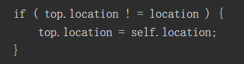

  还有就是在 html5 中 ifame 增加了一个 sandbox 属性，来实现对 iframe 更精准的控制(是否允许同源访问，顶层窗口访问，提交表单，执行脚本)

  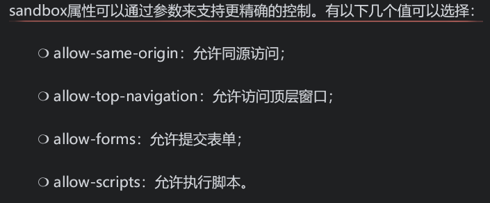

  

  

**SQL注入**

### 常见的行内元素和块级元素有哪些

- 行内元素：span、img、a、lable、input、、textarea、em（强调）、button（默认display：inline-block）、abbr（缩写）、big、cite（引用）、i（斜体）、q（短引用）、select、small、sub、sup，strong、u（下划线）
- 块级元素：div、p、h1~h6、table、ul、ol、dl、li、dd、table、hr、blockquote、address、menu、pre，HTML5新增的header、section、aside、footer

### js 动画

#### setInterval

最暴力的做法是使用 setInterval，但是它性能比较差，为什么这么说呢？因为我们在隐藏选项卡的时候它仍然会运行，这样会浪费资源

#### window.requestAnimationFrame

所以我们用的比较的多的都是 requestAnimationFrame，它会在下次重绘之前调用，它会接收一个 callback（回调函数执行次数通常与浏览器屏幕刷新次数相匹配，为了避免高刷)这个 callback 会接收一个时间戳，利用这个时间戳我们可以控制执行次数，还有它在隐藏选项卡的时候会暂停执行。

```js
    const element = document.getElementById('some-element-you-want-to-animate');
    let start, previousTimeStamp;
    let done = false

    function step(timestamp) {
        console.log(timestamp);
        if (start === undefined) {
            start = timestamp;
        }
        const elapsed = timestamp - start;

        if (previousTimeStamp !== timestamp) {
            // Math.min() is used here to make sure the element stops at exactly 300px
            const count = Math.min(0.1 * elapsed, 300);
            element.style.transform = `translateX(${count}px)`;
            if (count === 300) done = true;
        }

        if (elapsed < 3000) { // Stop the animation after 3 seconds
            previousTimeStamp = timestamp;
            if (!done) {
                window.requestAnimationFrame(step);
            }
        }
    }

    window.requestAnimationFrame(step);
```

### vue 生命周期

- Vue3.0中可以继续使用Vue2.x中的生命周期钩子，但有有两个被更名：
  - ```beforeDestroy```改名为 ```beforeUnmount```
  - ```destroyed```改名为 ```unmounted```
- Vue3.0也提供了 Composition API 形式的生命周期钩子，与Vue2.x中钩子对应关系如下：
  - `beforeCreate`===>`setup()`
  - `created`=======>`setup()`
  - `beforeMount` ===>`onBeforeMount`
  - `mounted`=======>`onMounted`
  - `beforeUpdate`===>`onBeforeUpdate`
  - `updated` =======>`onUpdated`
  - `beforeUnmount` ==>`onBeforeUnmount`
  - `unmounted` =====>`onUnmounted`

#### 题外话：数据请求在created和mouted的区别

`created`是在组件实例一旦创建完成的时候立刻调用，这时候页面`dom`节点并未生成；`mounted`是在页面`dom`节点渲染完毕之后就立刻执行的。触发时机上`created`是比`mounted`要更早的，两者的相同点：都能拿到实例对象的属性和方法。 讨论这个问题本质就是触发的时机，放在`mounted`中的请求有可能导致页面闪动（因为此时页面`dom`结构已经生成），但如果在页面加载前完成请求，则不会出现此情况。建议对页面内容的改动放在`created`生命周期当中。

### call、bind 区别，bind 原理

tips：上面有

### ajax 请求

readystate 的五个状态

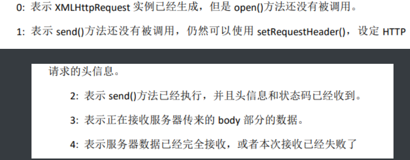

### 知道CSS预处理器吗？用过less的什么属性方法？

我觉得 css 预处理器有点类似于 ts 和 js 的关系，它是 css 的高级，有自己的语法规则，然后有一个编译器，最终会生成对应的 css 文件。

最常用的就是它的嵌套，还有变量。然后有时为了更好的复用会用到混入和模块化

```css
// less
@color: black;
.scoped {
  @bg: blue;
  @color: white;
  color: @color;
  background-color:@bg;
}
.unscoped {
  color:@color;
} 

// 编译后
.scoped {
  color:white;/*白色（调用了局部变量）*/
  background-color:blue;
}
.unscoped {
  color:black;/*黑色（调用了全局变量）*/
} 


// 混入
.alert {
  font-weight: 700;
}

.highlight(@color: red) {
  font-size: 1.2em;
  color: @color;
}

.heads-up {
  .alert;
  .highlight(red);
}
//编译后
.alert {
  font-weight: 700;
}
.heads-up {
  font-weight: 700;
  font-size: 1.2em;
  color: red;
}
```

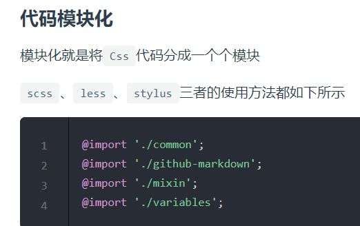

**区别**

我感觉大体功能都差不多，更多是一些语法规则的细微差异，比如都变量的定义，对父级的引用

### 如何提高页面加载速度？

我觉得要具体问题具体分析吧，可以用 chrome 浏览器的 lighthouse 去分析一下阻塞页面加载速度的最主要原因是什么。

比较常见的优化点有：

- 割包，路由懒加载
- 资源压缩，图片懒加载
- 开启 http 2.0 
- 优化 html 代码，让 link 放顶部， 脚本加载延后(defer) 等等

▶ defer属性用于异步加载外部JavaScript文件，**当异步加载完成后，该外部JavaScript文件不会立即执行，而是等到整个HTML文档加载完成才会执行。**

▶ async属性用于异步加载外部JavaScript文件，**当异步加载完成后，该外部JavaScript文件会立即执行，即使整个HTML文档还没有加载完成。**

### css 的性能问题如何解决？

- 我们知道 css 的加载虽然不会阻塞 dom 的解析，但是会阻塞渲染。所以我们可以考虑内联首屏关键样式，异步加载非首屏样式

```html
// 通过rel属性将link元素标记为alternate可选样式表，也能实现浏览器异步加载。同样别忘了加载完成之后，将rel设回stylesheet
<link rel="alternate stylesheet" href="mystyles.css" onload="this.rel='stylesheet'">

// 设置link标签media属性为noexis，浏览器会认为当前样式表不适用当前类型，会在不阻塞页面渲染的情况下再进行下载。加载完成后，将media的值设为screen或all，从而让浏览器开始解析CSS
<link rel="stylesheet" href="mystyles.css" media="noexist" onload="this.media='all'">
```

```js
// 使用javascript将link标签插到head标签最后
// 创建link标签
const myCSS = document.createElement( "link" );
myCSS.rel = "stylesheet";
myCSS.href = "mystyles.css";
// 插入到header的最后位置
document.head.insertBefore( myCSS, document.head.childNodes[ document.head.childNodes.length - 1 ].nextSibling );
```

- 合理使用选择器，嵌套的层级更多，页面中的元素更多，那么匹配所要花费的时间代价自然更高
- 还有就是资源压缩
- 不要使用 import
  - @import`会影响浏览器的并行下载，比如 link 嵌套了 @import 会，解析link 的时候才会去拉取 @import 里的 css
  - 而且多个`@import`可能会导致下载顺序紊乱，比如style 标签里有多个 @import 下面跟着一个 script 标签，这个 script 标签有可能会优先加载，如果里面 getClassName 这样的操作很可能会出 bug 

### 说出ES6中的新特性新变化

- 关键字 let const 
- 解构赋值
- 模板字符串
- 箭头函数
- proxy
- promise
- class
- set、map
- symbol
- object.assign

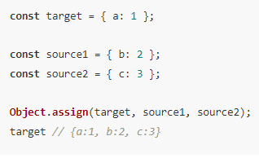

- object.is(类似于 ===)

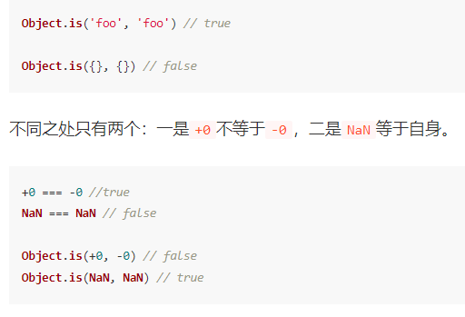

### eventloop

### 交换两个变量值，不用中间变量

```
let a = 2
let b = 3

// 通过加减
a = a + b
b = a - b
a = a - b

// 通过异或运算
// a = a ^ b
// b = a ^ b
// a = a ^ b
console.log(a, b)
```

## 笔试复盘

### tag 间通信

上面有，搜页面间通信

### 获取伪元素

```js
var beforeStyle = window.getComputedStyle(document.getElementsByTagName('p')[0], ":before");
console.log(beforeStyle.getPropertyValue('color'));
```

- 修改的话可以用 class 切换的方式、修改 CSSstyleSheet 里对应的content、也可以用css优先级暴力替换

- ```js
      document.styleSheets[0].addRule('.red::before', 'content: "' + latestContent + '"');
      document.styleSheets[0].insertRule('.red::before { content: "' + latestContent + '" }', 0);
  ```

- 利用 date-

- 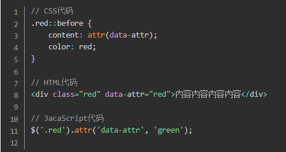

### 选择第奇数个的p标签

```css
p:nth-child(odd){} //奇数行

p:nth-child(even){} //偶数行
```

### date format

this 指 date 对象

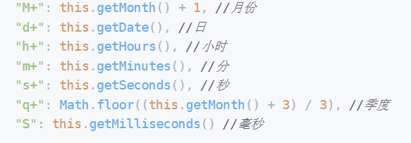

# 最右

## 笔试复盘

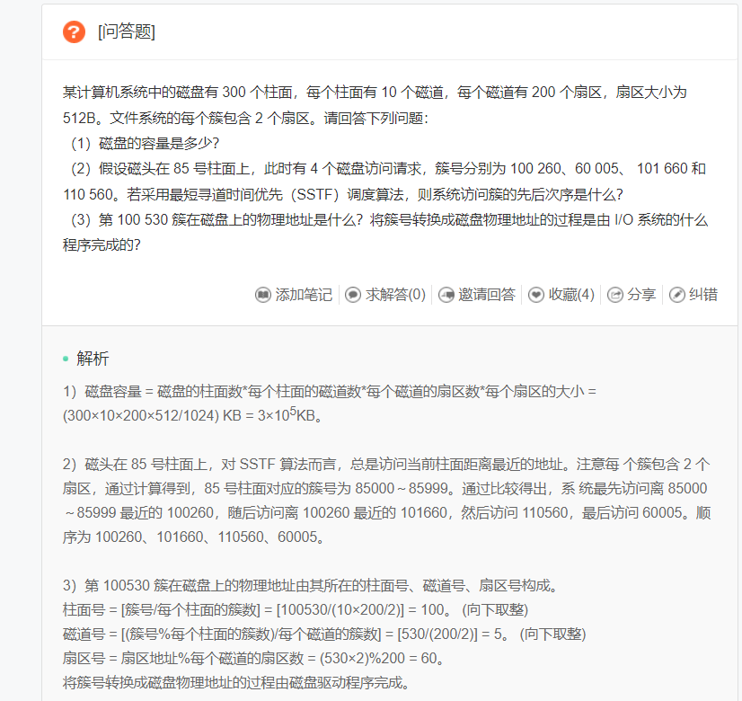

磁道号 = Math.floor(100530 % （10 * 200 */2）/ (200/2)) = 530 / 100 = 5 

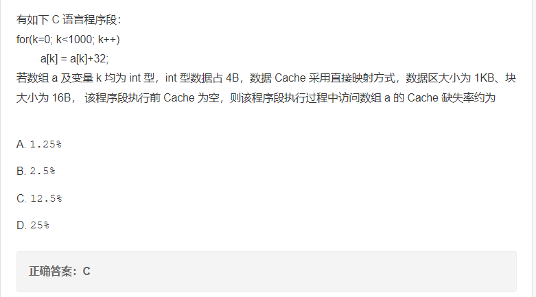

主存和块之间按块传数据，所以第一次读a[0]没找到，去主存中调数据时，实际是一次调了一个块的数据（4个int，即a[0]到a[3]）进cache。所以后面读写a[1]到a[3]时都已经在cache中了，算命中了。所以四次读四次写只有第一次读没有命中，也就是 1/8

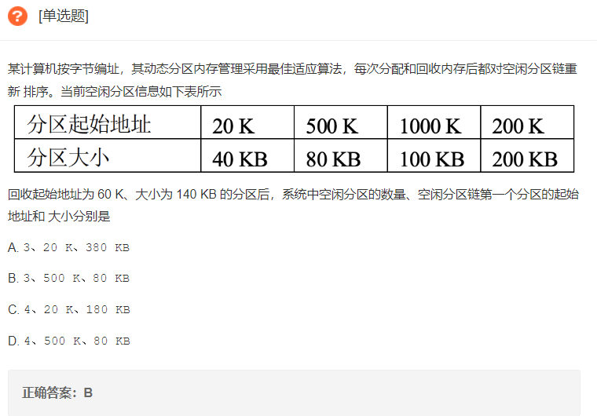

 **最优适应分配算法：**空闲区表中的空闲区可按空闲块从小到大顺序排列，在进行内存分配时，从头开始顺序查找，直到找到一块分区的大小可以满足需求

- 回收起始地址为60K、大小为140KB的分区时，它与表中第一个分区和第四个分区合并，成为起始地址为20K、大小为380KB的分区，剩余3个空闲分区。在回收内存后，算***对空闲分区链按分区大小由小到大进行排序，表中的第二个分区排第一。所以选择B。

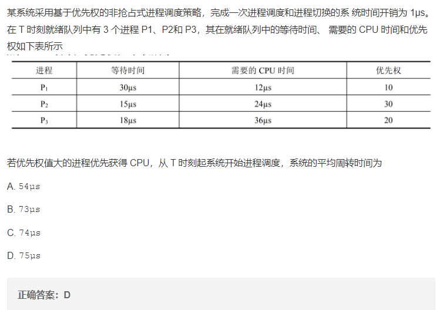

p2： 1 + 15（本身自己要等的时间） + 24 = 40 

p3：1 + 18 + 36  = 45 + 1 + 24（ 等p2）= 70

p1：1 + 30  +  12 = 43  + 1 + 24（等p2）  = 68 + 1 + 36（等p3） = 105

（40 + 70 + 95 ）/ 3 = 75

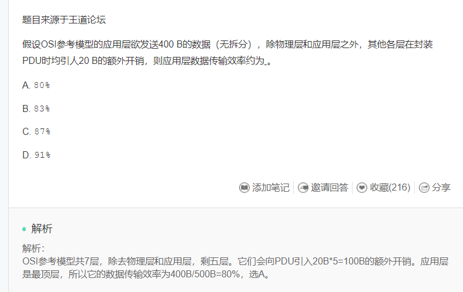

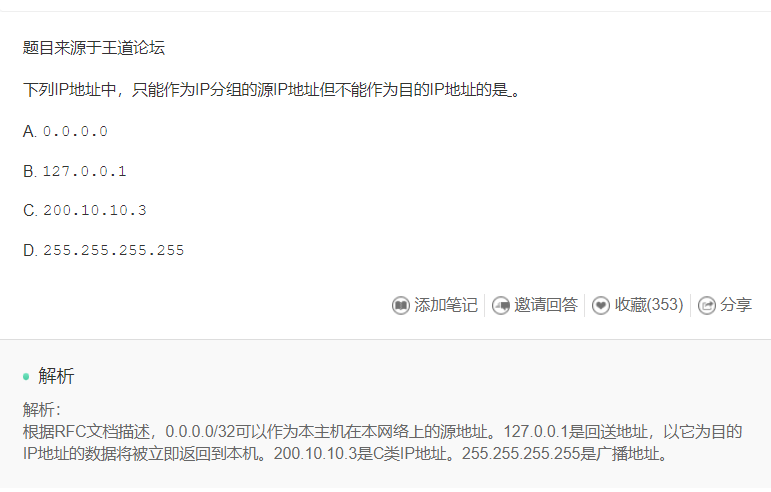

广播地址只在本网络上进行广播（各路由器不转发）


地址2100H，H代表地址是十六进制数地址，所以2100H-2000H=16^2=256B，每个double是8个字节，所以256/8=32。

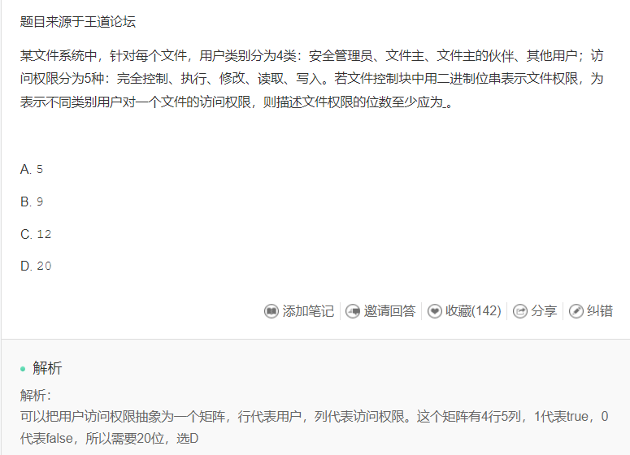

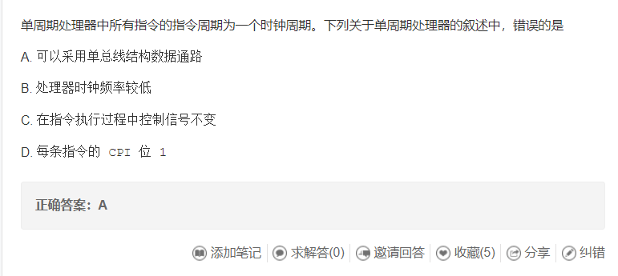

​	A单周期一个时钟周期完成取指令，执行指令。而单总线结构的数据通路一个指令周期分为多个机器周期，例如取指令周期，一个机器周期分为多个时钟周期

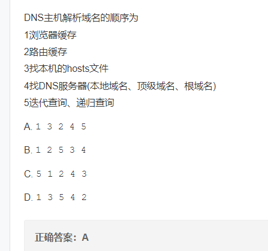

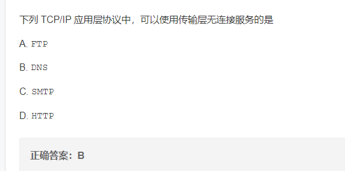

## 面试准备

### 说下 CI/CD 

- ci 持续集成（Continuous Integration）
  - **可以帮助开发人员更加频繁地（有时甚至每天）将代码更改合并到主分支中**。
  - 一旦开发人员对应用所做的更改被合并，系统就会通过自动构建应用并运行不同级别的自动化测试（通常是单元测试和集成测试）来验证这些更改，确保这些更改没有对应用造成破坏。
  - 这意味着测试内容涵盖了从类和函数到构成整个应用的不同模块。如果自动化测试发现新代码和现有代码之间存在冲突，CI 可以更加轻松地快速修复这些错误。

- cd 持续交付（Continuous Delivery）
  - 完成 CI 中构建及单元测试和集成测试的自动化流程后，持续交付可自动将已验证的代码发布到存储库。
  - **持续交付的目标是拥有一个可随时部署到生产环境的代码库。**
  - cd 持续部署（Continuous Deployment）
- CD 持续部署（Continuous Deployment）
  - **持续部署可以自动将应用发布到生产环境**

### 一面复盘

#### 请求头

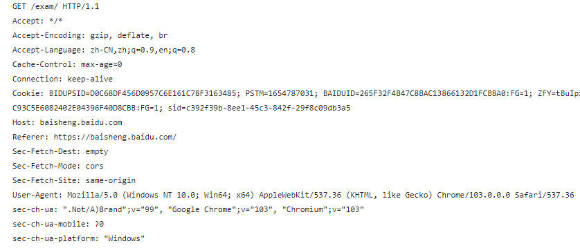

#### cache-control

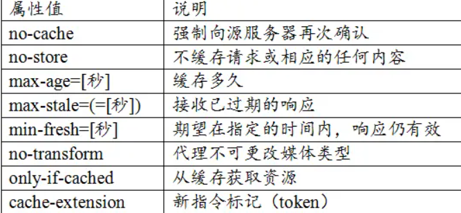

**（1）Cache-Control: no-cache** 

使用`no-cache`指令的目的是为了防止从缓存中返回过期的资源，会强制向服务器确认缓存是否过期。 客户端发送的请求中如果包含 `no-cache` 指令，则表示客户端将不会接收缓存的资源。每次请求都是从服务器获取资源，返回304。 

**（2）Cache-Control: no-store** 

使用`no-store` 指令表示请求的资源不会被缓存，下次任何其它请求获取该资源，还是会从服务器获取，返回 200，即资源本身。

#### 如果说没有同源策略限制

- 随意获取不同的源的cookie、localstorage、indexDB 等
- 随意获取别人页面信息
- 搞个钓鱼网站在用户登录期间去发送非同源的 ajax 请求，窃取用户在别的网站的信息

### Node

#### 说说你对Node.js 的理解？优缺点？应用场景？

- **理解：**我觉得 node.js 就是 js 服务端的运行环境，拥有非阻塞式的 I/O 所以我们经常说它适合文件读写场景，例如我们在读取数据库的代码之后，仍然会继续执行后续的代码，我们就留一个回调，它处理完后自行调用，这就提高了程序的执行效率
- **优点的话：**就跟上面说的那样嘛，适合 I/O 密集型，异步机制也适合高并发场景
- **缺点的话：**js 一直被诟病的问题吧，单线程，不能充分利用 cpu，可靠性低，一旦代码某个环节崩溃，整个系统都崩溃，所以在 js 里面错误捕获也很重要，像典型的有 let it crash 思想。
- **应用场景：** 
  - `Nodejs`能实现几乎一切的应用，只考虑适不适合使用它
  - 那不适合它的场景就是计算太多嘛，会造成阻塞的最好不使用
  - 其他的像 web 聊天室，操作数据库的 json API， 什么后台管理系统其实都可以

#### 说说对中间件概念的理解，如何封装 node 中间件？

其实就是对初始结果做一些特殊处理，得到我们想要的结果，中间件的本质其实就是一个函数，有两个参数一个 ctx、一个是 next

例：token 检验中间件

```js
module.exports = (options) => async (ctx, next) {
  try {
    // 获取 token
    const token = ctx.header.authorization
    if (token) {
      try {
          // verify 函数验证 token，并获取用户相关信息
          await verify(token)
      } catch (err) {
        console.log(err)
      }
    }
    // 进入下一个中间件
    await next()
  } catch (err) {
    console.log(err)
  }
}
```

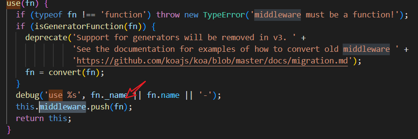

中间的用法是：app.use(token检验中间)，会被push到middleware数组里

经过 compose(middleware) 处理，会有函数的递归调用这样所有的中间件都可以被调用(dispatch.bind(null, i + 1) => 就是 next() 调用)

当 i === middleware.length 也就是超过长度的时候，因为 next 没传是 null，所以就调用 promise.reslove() 结束递归，如果有传就可以定制做特殊的处理

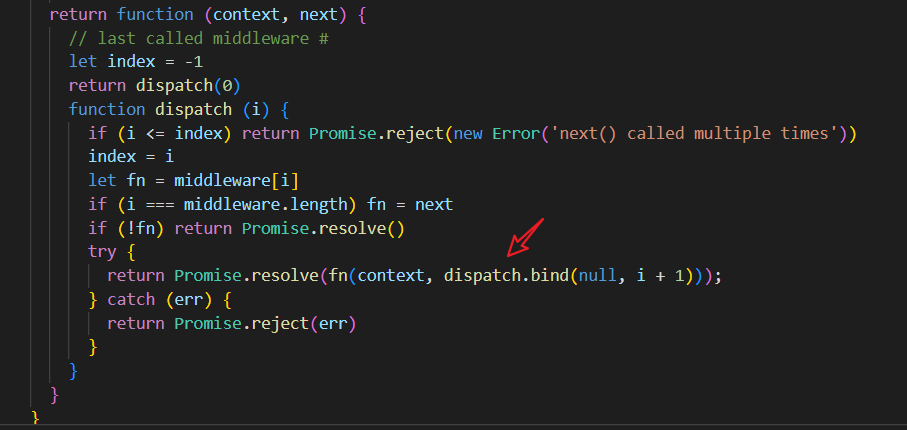

#### Nodejs 中的事件循环机制理解

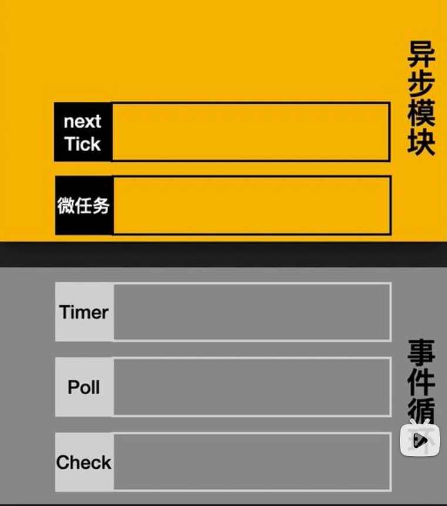	

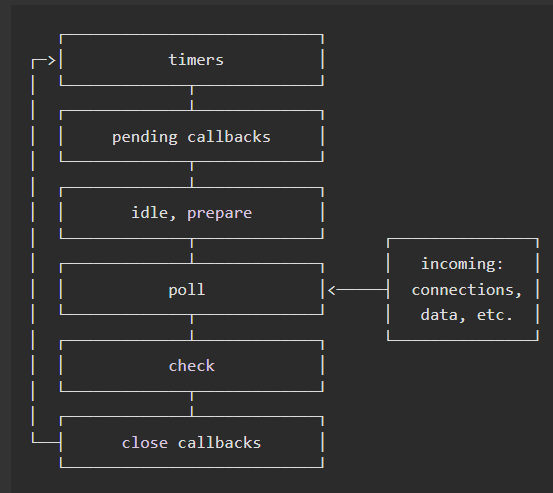

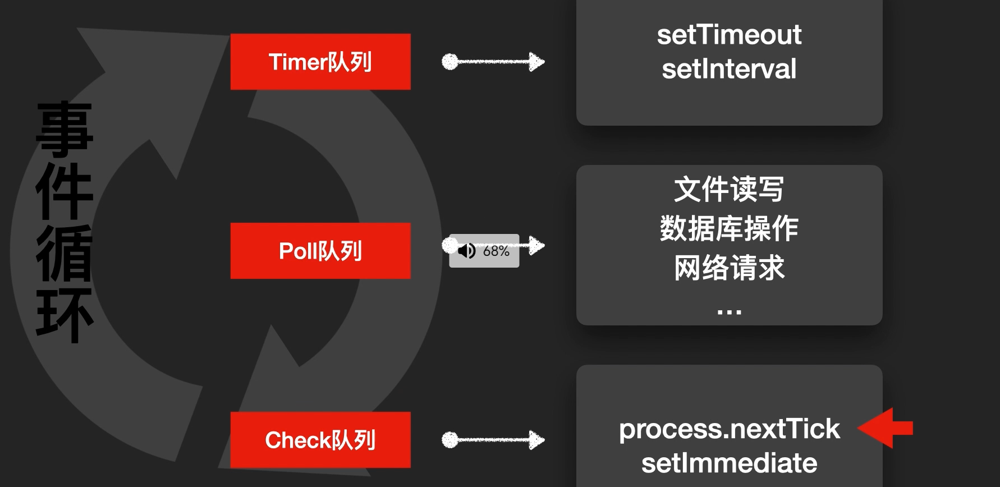

执行同步代码后会执行异步模块（process.nextTrick、微任务队列/microTask)、然后进入事件循环六个阶段，

-  **timers** 阶段
- **pedding callbacks** 阶段 (执行延迟到下一个循环迭代的 I/O 回调)

这个阶段主要是执行一些系统操作，比如说 TCP 连接错误后的错误回调

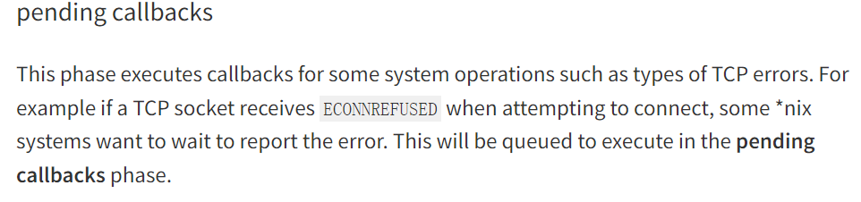

- **idle，prepare** 阶段(闲置阶段，仅供系统内部调用) 
- **poll** 阶段（当队列为空的时候，如果没有 setimmediate 调度就会等待回调被添加到队列中然后立即执行，如果有就继续下一步） 
- **check** 阶段 
- **close callbacks**(关闭事件相关的回调，如数据库、socket 的 close 事件回调

#### jwt 鉴权机制

##### 是什么？

jwt 全称就是 **json web token** 本质其实就是个字符串书写规范嘛（作用就是用来在用户和服务器之间传递安全可靠的消息），然后我们经常用它作为鉴权方案。然后它由三部分组成 **header、payload、signature**，并以 . 进行拼接

- header ：主要声明使用的算法。声明算法的字段名为`alg`，同时还有一个`typ`的字段，默认`JWT`即可。以下示例中算法为HS256

  - ```js
    {  "alg": "HS256",  "typ": "JWT" } 
    
    // base64 编码后	
    eyJhbGciOiJIUzI1NiIsInR5cCI6IkpXVCJ9
    ```

-  payload：这里会存放实际的内容，也就是`Token`的数据声明，例如用户的`id`和`name`，默认情况下也会携带令牌的签发时间`iat`，同时还可以设置过期时间

  - ```js
    {
      "id": "1234567890",
      "name": "John Doe",
      "iat": 1516239022
    }
    
    // base64 编码后
    eyJpZCI6IjEyMzQ1Njc4OTAiLCJuYW1lIjoiSm9obiBEb2UiLCJpYXQiOjE1MTYyMzkwMjJ9
    ```

- signature：签名是对头部和载荷内容进行签名，一般情况，设置一个`secretKey`，对前两个的结果进行`HMACSHA25`算法，公式如下：

  - ```
    Signature = HMACSHA256(base64Url(header)+.+base64Url(payload),secretKey)
    ```

##### 如何实现

**生成**：借助第三方库`jsonwebtoken`，通过`jsonwebtoken` 的 `sign` 方法生成一个 `token`

```js
/** 
第一个参数指的是 Payload

第二个是秘钥，服务端特有

第三个参数是 option，可以定义 token 过期时间
*/
const jwt = require("jsonwebtoken");
const token = jwt.sign(  
    {
      name: result.name
    },
    "test_token", // secret
    { expiresIn: 60 * 60 } // 过期时间：60 * 60 s
);
```

**校验**：使用 `koa-jwt` 中间件进行验证，方式比较简单

```js
// 注意：放在路由前面
app.use(koajwt({
  secret: 'test_token'
}).unless({ // 配置白名单
  path: [/\/api\/register/, /\/api\/login/]
}))
```

- secret 必须和 sign 时候保持一致
- 可以通过 unless 配置接口白名单，也就是哪些 URL 可以不用经过校验，像登陆/注册都可以不用校验
- 校验的中间件需要放在需要校验的路由前面，无法对前面的 URL 进行校验

##### 优缺点

优点：

- json具有通用性，所以可以跨语言

- 组成简单，字节占用小，便于传输

- 服务端无需保存会话信息，很容易进行水平扩展，token 保存在客户端

- 一处生成，多处使用，可以在分布式系统中，解决单点登录问题

  - 在分布式系统中，每个子系统都要获取到秘钥，那么这个子系统根据该秘钥可以发布和验证令牌，但有些服务器只需要验证令牌

    这时候可以采用非对称加密，主服务器利用自己的私钥发布令牌，子系统就可以用主的公钥验证令牌是否是主服务器发出来的，加密算法可以选择`RS256`

- 可防护CSRF攻击

缺点：

- payload部分仅仅是进行简单编码，所以只能用于存储逻辑必需的非敏感信息
- 需要保护好加密密钥，一旦泄露后果不堪设想
- 为避免token被劫持，最好使用https协议

#### node 中 process 的理解，有哪些常用的方法

`process` 对象是一个全局变量，提供了有关当前 `Node.js`进程的信息并对其进行控制

**常见的属性和方法：**

- **process.env**：环境变量，例如通过 `process.env.NODE_ENV 获取不同环境项目配置信息
-  **process.argv**：0：Node 的路径一般用不到、1：被执行的 JS 文件路径（一般用不到，直接忽略）、一般从 process.argv[2] 开始获取 
- **process.nextTick**：这个在谈及 `EventLoop` 时经常为会提到
- process.pid：获取当前进程id
- process.ppid：当前进程对应的父进程
- **process.cwd()**：获取当前进程工作目录，
- process.platform：获取当前进程运行的操作系统平台
- process.uptime()：当前进程已运行时间，例如：pm2 守护进程的 uptime 值
- 进程事件： process.on(‘uncaughtException’,cb) 捕获异常信息、 process.on(‘exit’,cb）进程推出监听
- 三个标准流： process.stdout 标准输出、 process.stdin 标准输入、 process.stderr 标准错误输出
- process.title 指定进程名称，有的时候需要给进程指定一个名称

#### 对 stream 的理解，应用场景

stream 其实就是数据的一种传输形式，它对数据的读取是一块一块的，所以非常适合对大型文件的 I/O 操作。说起流我觉得就要谈起管道模型，它能帮助我们比较好的理解流这个概念，它由 source、 pipe、 dest 组成，比如我们要 copy 一个文件，我们可以创建一个 readStream 和 writeStream，然后调用 pipe 让 readStream 流向 writeStream，这样就完成一个文件的拷贝了，如果这时去监听 memory（内存）我们会发现系统对内存的占用其实还是相对线性的，而如果我们去用 readfile，writefile api，它是将文件内容一次性读入内存，一次性写入文件，会发现内存的占用是几何增长的

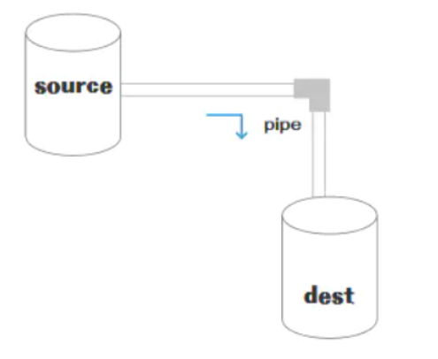

**分类**

在`NodeJS`，几乎所有的地方都使用到了流的概念，分成四个种类：

- 可写流：可写入数据的流。例如 fs.createWriteStream() 可以使用流将数据写入文件

- 可读流： 可读取数据的流。例如fs.createReadStream() 可以从文件读取内容

- 双工流： 既可读又可写的流。例如 net.Socket

  - ```js
    const { Duplex } = require('stream');
    
    const myDuplex = new Duplex({
      read(size) {
        // ...
      },
      write(chunk, encoding, callback) {
        // ...
      }
    });
    ```

- 转换流： 可以在数据写入和读取时修改或转换数据的流。例如，在文件压缩操作中，可以向文件写入压缩数据，并从文件中读取解压数据

  - 比如一个 `babel`，把`es6`转换为，我们在左边写入 `es6`，从右边读取 `es5`

  - ```js
    const { Transform } = require('stream');
    
    const myTransform = new Transform({
      transform(chunk, encoding, callback) {
        // ...
      }
    });
    ```

在`NodeJS`中`HTTP`服务器模块中，`request` 是可读流，`response` 是可写流。还有`fs` 模块，能同时处理可读和可写文件流

可读流和可写流都是单向的，比较容易理解，而另外两个是双向的

**一些打包工具的底层操作**

目前一些比较火的前端打包构建工具，都是通过`node.js`编写的，打包和构建的过程肯定是文件频繁操作的过程，离不来`stream`，如`gulp`

#### 对 Buffer 的理解，应用场景

js 没有二进制数据类型，但在处理像TCP流或文件流时，必须使用到二进制数据。Buffer 类可以用来创建一个专门存放二进制数据的缓存区。一个 Buffer 它类似于一个整数数组，数组中的每一项，都可以保存8位二进制：`00000000`，也就是一个字节，但**它对应于 V8 堆内存之外的一块原始内存。**

##### 常用方法

```
const buffer = Buffer.from('123', 可以指定编码类型 如utf-8) // 123 转为 二进制数据
buffer.toString(可以指定 decode 类型)
// 很多类似于数组的方法也可以使用，如 slice 和 cancat
```


##### **应用场景**

- I/O 操作：可读可写流其实也是 buffer 的读写
- 加解密：加解密算法中，一般都是对 buffer 或者 string 进行加解密
- zlib.js 为 `Node.js` 的核心库之一，其利用`Buffer`（缓存区）的功能来操作二进制数据流，提供了压缩或解压功能

### 计算机网络

#### 说说对 webSocket 的理解及应用场景

##### 是什么

websocket 其实就是一种应用层的协议，可以在单个 tcp 连接上进行全双工通信，所以它常见的应用场景主要就是实况类场景，比如聊天室，弹幕，协同编辑等等

##### 与 socket 的关系

socket 其实就是为了方便使用 tcp/udp 抽象出来的一层接口，一般用户很难去直接使用 tcp/udp，这就像现在前后端这种分离思想，前端调用后端暴露出来的接口去操作数据库，而不是自己去操作，这样比较简单。

##### 创建与连接

```js
const WebSocket = require('ws')

const WebSocketServer = WebSocket.Server;

//在4000端口上打开了一个WebSocket Server，该实例由变量wss引用。
const wss =new WebSocketServer({
    port:4000
})

//如果有WebSocket请求接入，wss对象可以响应connection事件来处理这个WebSocket：
wss.on('connection',function(ws){  //在connection事件中，回调函数会传入一个WebSocket的实例，表示这个WebSocket连接。
    console.log(`[SERVER] connection()`);
    ws.on('message',function(message){  //我们通过响应message事件，在收到消息后再返回一个ECHO: xxx的消息给客户端。
        console.log(`[SERVER] Received:${message}`);
        ws.send(`ECHO:${message}` ,(err)=>{
            if(err){
                console.log(`[SERVER] error:${err}`);
            }
        })
    })
})
```

```js
const WebSocket =require('ws')
let ws = new WebSocket('ws://localhost:4000/test');

// 打开WebSocket连接后立刻发送一条消息:
ws.on('open', function () {
    console.log(`[CLIENT] open()`);
    ws.send('Hello!');
});

// 响应收到的消息:
ws.on('message', function (message) {
    console.log(`[CLIENT] Received: ${message}`);
})
```

#### 如何理解 CDN ？ 说说实现原理

##### 是什么

CDN(content deliver network 内容分发网络) 全称就是内容分发网络嘛，其实就是来用户就近访问所需要的资源

**实现原理**

实现的过程主要就是利用负载均衡系统，我们访问cdn链接，经过 dns 解析会拿到一个`CNAME`(Canonical Name ) 别名记录，它会指向 cdn 全局负载均衡系统，**负载均衡系统会根据用户地址ip，运营商网络，节点负载情况等进行智能匹配**，返回一个 ip 地址给用户，用户就可以通过这个 ip 地址去缓存服务器访问自己想要的资源，如果没有匹配上资源，缓存服务器会向上追溯，直到源服务器，拿到资源为止。


#### DNS 协议是什么？DNS 的完整解析过程

DNS顾名思义吧，全称就是(domain names system)，也就是域名系统。它的出现主要是 ip 地址不容易记忆吧，它记录着域名和 ip 地址的映射关系。

**解析过程**

- 先查浏览器缓存
- 找本机 host 文件
- 找路由缓存
- 这几个是递归查询过程
- 然后都没找到就去 DNS 服务器(本地域名，根域名(记录.com .host等在那个顶级服务器)，顶级域名(比如都是.com)，二级域名服务器(baidu.com), 三级域名服务器(email.baidu.com))，这是迭代查询（重指引）过程，本地域名先访问根，根让它去顶，顶让他去二级，二级让它去三级，这基本已经是最后一级了，有的话就返回，如果还有就继续迭代

### 可能会问

#### 弹幕实现

##### **实现**

移动效果

```js
 let from = `from { visibility: visible; transform: translateX(${width}px); }`
  let to = `to { visibility: visible; transform: translateX(-100%); }`

  const animateString = `@keyframes RightToLeft { ${from} ${to} }`
    const bulletContainer = `
  .${BULLETCLASS} {
		cursor: pointer;
		position: absolute;
		left: 0;
		animation-name: RightToLeft;
		animation-timing-function: linear;
		overflow: hidden;
		display: inline-block;
		word-break: keep-all;
		white-space: nowrap;
	}`
```

计算弹道数可以用容器的大小除以弹幕的高度

然后每一个弹道对应一个数组，弹幕数据优先加入空闲队列（可以用长度判断）

##### 怎么防止碰撞，重叠

**两个解决方案**

- 全部都设置为匀速运动，动画的运动时间等于容器宽度 + 弹幕宽度 / 速度就可以了
- 全部都是同一时间，对于新的弹幕只有当它的运动时间，比上一个弹幕出容器的时间小的时候才可以进入弹道，不满足条件就不让它加入当前弹道加入其他的
- 如果都不满足条件可以切换计算模式，让它以匀速运行，或者跟在上一条后面也可以

#### 多线程

- 在HTML5中，我们可以使用Web Worker创建一个“后台线程”来执行某一段耗时较长的JavaScript程序，而不会影响页面响应。Web Worker其实就是HTML5提供的“JavaScript多线程”解决方案。

- Web Worker技术基本原理就是：在当前JavaScript的主线程中，使用Worker()构造函数新建一个worker实例，然后加载某一个JavaScript文件，发送给一个后台线程来处理（注意，这里是后台线程）。
- 线程间通信通过 worker.postmessage 和 worker.onmessage 完成
-  Web Worker由于使用的是后台线程，发送给后台线程的那个JavaScript文件的使用有一定的限制，例如无法访问DOM、无法访问全局变量或全局函数等。所以一般我们都是将它用于计算耗时过长的任务上，比如像加解密操作这样的复杂运算，实时应用场景，对主线程的频繁占用等等

# Typescript

## 枚举

### **定义**

我觉得枚举就是一个常数的集合吧，比如说一个变量有几个可能的取值时，我们就可以把它定义为枚举类型，再举个实际例子，比如天气，星期日到星期一。

### **分类**

- 数字枚举

  - ```ts
    // 默认是从 0 开始，如果自定义的话会自行累加
    enum Direction {
        Up = 10,
        Down,
        Left,
        Right
    }
    
    console.log(Direction.Up, Direction.Down, Direction.Left, Direction.Right); // 10 11 12 13
    ```

- 字符串枚举

  - ```ts
    enum Direction {
        Up = 'Up',
        Down = 'Down',
        Left = 'Left',
        Right = 'Right'
    }
    
    console.log(Direction['Right'], Direction.Up); // Right Up
    
    // 如果设定了一个变量为字符串之后，后续的字段也需要赋值字符串，否则报错：
    enum Direction {
     Up = 'UP',
     Down, // error TS1061: Enum member must have initializer
     Left, // error TS1061: Enum member must have initializer
     Right // error TS1061: Enum member must have initializer
    }
    ```

    

- 异构枚举

```ts
// 即将数字枚举和字符串枚举结合起来混合起来使用，如下：
enum BooleanLikeHeterogeneousEnum {
    No = 0,
    Yes = "YES",
}
```

**本质**

js编译后

```js
var Direction;
(function (Direction) {
    Direction[Direction["Up"] = 0] = "Up";
    Direction[Direction["Down"] = 1] = "Down";
    Direction[Direction["Left"] = 2] = "Left";
    Direction[Direction["Right"] = 3] = "Right";
})(Direction || (Direction = {}));
```

比如我们往一个枚举类型 Diretion 添加了一个 up 属性，经过js 编译后它是做了两步赋值，一个 direction[0] = “up”，一个是 direction[“up”] = 0

## TS 装饰器

我觉得 ts 装饰器说得简单点就是一个函数，可以接收一些参数，然后对对于的属性和方法特性做一些修改，然后可以分为两类吧，一类是方法/属性的装饰器，一类是参数的装饰器

### 方法/属性装饰器

- 方法/属性装饰器本质其实就是 object.defineproperty 的一个语法糖
- target：对象的原型
- propertyKey：方法的名称
- descriptor：方法的属性描述符

```ts
// 声明装饰器修饰方法/属性
function method(target: any, propertyKey: string, descriptor: PropertyDescriptor) {
  console.log(target);
  console.log("prop " + propertyKey);
  console.log("desc " + JSON.stringify(descriptor) + "\n\n");
  descriptor.writable = false;
};

function property(target: any, propertyKey: string) {
  console.log("target", target)
  console.log("propertyKey", propertyKey)
}

class Person{
 @property
 name: string;
 constructor() {
   this.name = 'huihui';
 }

 @method
 say(){
   return 'instance method';
 }

 @method
 static run(){
   return 'static method';
 }
}

const xmz = new Person();

// 修改实例方法say
xmz.say = function() {
 return 'edit'
}
```

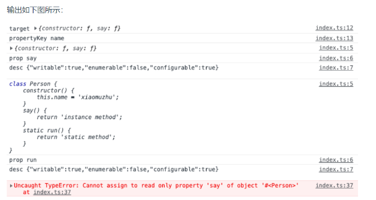

### 参数装饰器

- target ：当前对象的原型
- propertyKey ：参数的名称
- index：参数数组中的位置

```ts
function logParameter(target: Object, propertyName: string, index: number) {
  console.log(target);
  console.log(propertyName);
  console.log(index);
}

class Employee {
  greet(@logParameter message: string): string {
      return `hello ${message}`;
  }
}
const emp = new Employee();
emp.greet('hello');
```

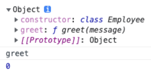

### 应用场景

- 当我们需要在不改变原代码的情况下，对原来功能做一个拓展，我觉得装饰器就是一个不错的选择
- 代码的一些封装，其实装饰器就相当于一个注释，让代码的可读性更强
- 像阿里的 midway 框架就是对装饰器模式的最好实践

## 命名空间与模块的理解

### 模块

- 任何包含顶级 `import` 或者 `export` 的文件都被当成一个模块

- 相反地，如果一个文件不带有顶级的`import`或者`export`声明，那么它的内容被视为全局可见的

- 例如我们在在一个 `TypeScript` 工程下建立一个文件 `1.ts`，声明一个变量`a`，如下：

  - ```js
    const b = 1
    ```

    然后在另一个文件同样声明一个变量`a`，这时候会出现错误信息：

    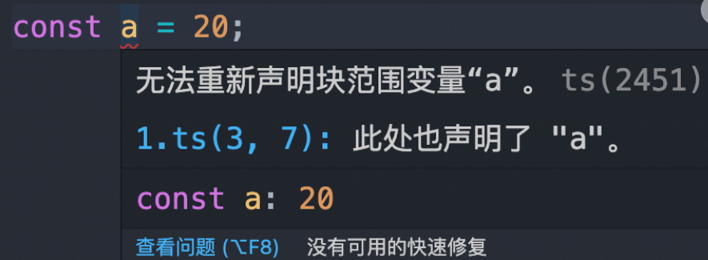

- 如果需要解决这个问题，则通过`import`或者`export`引入模块系统即可，如下：

```js
const a = 10;

export default a
```

### 命名空间

命名空间经过编译后其实本质就是一个对象，命名空间让同名变量可以多次出现，避免命名冲突

```typescript
namespace Letter {
  export let a = 1;
  export let b = 2;
  export let c = 3;
  // ...
  export let z = 26;
}
```

```js
// 编译后
var Letter;
(function (Letter) {
    Letter.a = 1;
    Letter.b = 2;
    Letter.c = 3;
    // ...
    Letter.z = 26;
})(Letter || (Letter = {}));
```

### 模块和命名空间

- 像命名空间一样，模块可以包含代码和声明。 不同的是模块可以声明它的依赖


## TS 高级类型

### 理解

其实就是除了 string、number、boolean 这种基本类型外的我们都可以把它称为高级类型

### 常见的

#### 交叉类型

- 通过 `&` 将多个类型合并为一个类型，包含了所需的所有类型的特性，本质上是一种并的操作

- 适用于对象合并场景，如下将声明一个函数，将两个对象合并成一个对象并返回：

- ```typescript
  interface a {
      a: number
  }
  
  interface b {
      b: boolean
  }
  
  const c: a = {
      a: 123
  }
  const d: b = {
      b: true
  }
  
  // a b 都要实现
  let result: a & b = {
      ...c,
      ...d
  } 
  ```

#### 联合类型

联合类型的语法规则和逻辑 “或” 的符号一致，表示其类型为连接的多个类型中的任意一个，本质上是一个交的关系

```js
// 只能为 number 或者 string 中的一种
const a: number | string = 123
```

#### 类型索引

`keyof` 类似于 `Object.keys` ，用于获取一个接口中 Key 的联合类型。

```typescript
interface Button {
    type: string
    text: string
}

type ButtonKeys = keyof Button
// 等效于
type ButtonKeys = "type" | "text"
```

#### 类型约束

通过关键字 `extend` 进行约束，不同于在 `class` 后使用 `extends` 的继承作用，泛型内使用的主要作用是对泛型加以约束

```typescript
type BaseType = string | number | boolean

// 这里表示 copy 的参数
// 只能是字符串、数字、布尔这几种基础类型
function copy<T extends BaseType>(arg: T): T {
  return arg
}
```

类型约束通常和类型索引一起使用，例如我们有一个方法专门用来获取对象的值，但是这个对象并不确定，我们就可以使用 `extends` 和 `keyof` 进行约束。

```typescript
function getValue<T, K extends keyof T>(obj: T, key: K) {
  return obj[key]
}

const obj = { a: 1 }
const a = getValue(obj, 'a')
```

#### 映射类型

通过 `in` 关键字做类型的映射，遍历已有接口的 `key` 或者是遍历联合类型，如下例子：

```typescript
type Readonly<T> = {
    readonly [P in keyof T]: T[P];
};

interface Obj {
  a: string
  b: string
}

type ReadOnlyObj = Readonly<Obj>
```

上述的结构，可以分成这些步骤：

- keyof T：通过类型索引 keyof 的得到联合类型 'a' | 'b'
- P in keyof T 等同于 p in 'a' | 'b'，相当于执行了一次 forEach 的逻辑，遍历 'a' | 'b'

所以最终`ReadOnlyObj`的接口为下述：

```typescript
interface ReadOnlyObj {
    readonly a: string;
    readonly b: string;
}
```

#### 条件类型

```typescript
T extends U ? X : Y
```

上面的意思就是，如果 T 是 U 的子集，就是类型 X，否则为类型 Y

## 在 vue 中使用 ts

像在 vue3 在引入 ts 编译器后，配置后 ts.config 文件，在 setup 里加个 lang=“ts” 就可以使用了，如果比较喜欢类式组件，有一个官方维护的库，我记得是叫 vue-class-componet，它主要是使用这种装饰器模式。

## ts 函数  与 js 函数区别

类型限定就不提了，下面两个比较主要的

### 可选参数

```ts
function add(arg1: number, arg2?:number) {
    return arg1 + (arg2 ? arg2 : 0)
}

// 编译后本质
function add(arg1, arg2) {
    return arg1 + (arg2 ? arg2 : 0);
}
```

### 函数重载

```ts
// 上边是函数重载(一个函数有类似功能，形式参数(个数、类型)必须不同)
function add (arg1: string, arg2: string): string
function add (arg1: number, arg2: number): number
// 因为我们在下边有具体函数的实现，所以这里并不需要添加 declare 关键字

// 下边是实现
function add (arg1: string | number, arg2: string | number) {
  // 在实现上我们要注意严格判断两个参数的类型是否相等，而不能简单的写一个 arg1 + arg2
  if (typeof arg1 === 'string' && typeof arg2 === 'string') {
    return arg1 + arg2
  } else if (typeof arg1 === 'number' && typeof arg2 === 'number') {
    return arg1 + arg2
  }
}
```

编译后本质

```js
// 因为我们在下边有具体函数的实现，所以这里并不需要添加 declare 关键字
// 下边是实现
function add(arg1, arg2) {
    // 在实现上我们要注意严格判断两个参数的类型是否相等，而不能简单的写一个 arg1 + arg2
    if (typeof arg1 === 'string' && typeof arg2 === 'string') {
        return arg1 + arg2;
    }
    else if (typeof arg1 === 'number' && typeof arg2 === 'number') {
        return arg1 + arg2;
    }
}
```

# git

## git 发生冲突的场景，如何解决

冲突场景：两个分支的最新提交修改了同一份文件

解决：手动解决，要传入当前更改还是传入对方更改，还是双方保留，解决完重新提交就可以了

## git reset 和 git revert

- reset 是向后移动，回退到对应的版本, 有 mixed、soft、hard 三种模式
  - mixed: 回退的内容在工作区
  - soft：回退的内容在暂存区
  - hard：回退的内容删除掉
- revert 的撤销保留了原来的更改，用一个新的提交来实现撤销

## git pull 和 git fetch

git pull 包含 git fetch + git merge，fetch 不会直接 merge 代码

## git stash

保存当前工作进度，比如当我们当前分支修改一半有其他分支需要修改时，可以利用git stash 命令

```shell
git stash // 暂存当前修改
... 跑去别的分支修改代码
git stash pop // 恢复
```

当前分支突然需要更新和远程有冲突也一样可以利用 git stash

- git stash save：可以用于存储修改.并且将`git`的工作状态切回到`HEAD`也就是上一次合法提交上
- git stash list：显示保存进度的列表。
- git stash pop：从栈中读取最近一次保存的内容，也就是栈顶的`stash`会恢复到工作区
- git stash apply：将堆栈中的内容应用到当前目录，不同于`git stash pop`，该命令不会将内容从堆栈中删除，也就说该命令能够将堆栈的内容多次应用到工作目录中，适应于多个分支的情况，同样，可以通过`git stash apply` + `stash`名字执行恢复哪个`stash`恢复到当前目录
- git stash show：查看堆栈中最新保存的`stash`和当前目录的差异
- git stash drop：`git stash drop` + `stash`名称表示从堆栈中移除某个指定的stash
- git stash clear：删除所有存储的进度

# React

## React 的通信方式

## React 和 vue  区别

- 更新粒度不同，vue 由于数据劫持更新的时候可以只更新依赖收集到的组件，而 react 是递归更新，父更子更，一直到结束，这也是为什么有 react fliber 而没有 vue fliber

- React 不监听数据对象变化(setState，prop 触发 vitrual diff)，vue 会监听数据对象
- React 有函数式组件，类式组件
- 核心思想不同，vue的整体思想仍然是拥抱经典的html(结构)+css(表现)+js(行为)的形式；react整体上是函数式的思想，组件使用jsx语法，甚至有 all in js的理念，将html与css全都融入javaScript，感觉写 React 有一种一直再写 js 代码的感觉。

## React 构建组件的方式有什么区别

### **函数式组件**

```js
function HelloComponent(props, /* context */) {
  return <div>Hello {props.name}</div>
}
```

### **类式组件**

```js
class Timer extends React.Component {
  constructor(props) {
    super(props);
    this.state = { seconds: 0 };
  }

  tick() {
    this.setState(state => ({
      seconds: state.seconds + 1
    }));
  }

  componentDidMount() {
    this.interval = setInterval(() => this.tick(), 1000);
  }

  componentWillUnmount() {
    clearInterval(this.interval);
  }

  render() {
    return (
      <div>
        Seconds: {this.state.seconds}
      </div>
    );
  }
}
```

### **区别**

- 感觉类似组件的话相比函数式组件比较冗余吧，所以React 一般都推崇这种函数式组件
- 然后类似组件我们一般就说它的有状态的组件，可以在构造方法定义 state的，但是因为 hook 的出现，所以现在函数式也能成为有状态的组件

## React Hook

它可以让你在不编写 class 的情况下，让你在函数组件里“钩入” React state 及生命周期等特性的函数。感觉和 vue3 的 composition api 非常相似，有些 React 的推崇者就喜欢叫 compostion api 说是 vue hook

## React jsx 转换成真实 DOM 过程

React 的源码我没有去看过，我只大概知道`JSX`通过`babel`最终转化成`React.createElement`这种形式去创建虚拟节点，然后 createElement 的原理我感觉应该和 vue 的 h 函数很相似，像 v 的 h 函数的话其实就是去判断标签类型，获取属性去组织成一个对象嘛。

```js
const element = <h1><h2>hello world</h2></h1>
```

**babel 编译后**

```js
"use strict";

const element = /*#__PURE__*/React.createElement("h1", null, /*#__PURE__*/React.createElement("h2", null, "hello world"));
```

```js
// element
{
    "type": "h1",
    "key": null,
    "ref": null,
    "props": {
        "children": "hello react"
    },
    "_owner": null,
    "_store": {}
}
```


## React 生命周期

`react16.4`之后的生命周期，可以分成三个阶段：

- 创建阶段
- 更新阶段
- 卸载阶段

### **创建阶段**

- **constructor：**实例过程中自动调用的方法，在方法内部通过`super`关键字获取来自父组件的`props`

  在该方法中，通常的操作为初始化`state`状态或者在`this`上挂载方法

- **getDerivedStateFromProps：**是一个静态的方法，因此不能访问到组件的实例；执行时机：组件创建和更新阶段，不论是`props`变化还是`state`变化，也会调用

- **render**：执行时机：组件创建和更新阶段，不论是`props`变化还是`state`变化，也会调用（不要在 `render` 里面 `setState`, 否则会触发死循环导致内存崩溃）

- **componentDidMount：**组件挂载到真实`DOM`节点后执行，其在`render`方法之后执行，此方法多用于执行一些数据获取，事件监听等操作

### **更新阶段**

- getDerivedStateFromProps：和上面一样

- **shouldComponentUpdate：**

  - 用于告知组件本身基于当前的`props`和`state`是否需要重新渲染组件，默认情况返回`true`
  - 执行时机：到新的props或者state时都会调用，通过返回true或者false告知组件更新与否
  - 一般情况，不建议在该周期方法中进行深层比较，会影响效率，同时也不能调用`setState`，否则会导致无限循环调用更新

- render：和上面一样

- **getSnapshotBeforeUpdate：**

  - 此方法的目的在于获取组件更新前的一些信息，比如组件的滚动位置之类的，在组件更新后可以根据这些信息恢复一些UI视觉上的状态
  - 该周期函数在`render`后执行，执行之时`DOM`元素还没有被更新
  - 该方法返回的一个`Snapshot`（快照）值，作为`componentDidUpdate`第三个参数传入

- ### componentDidUpdate：

  - 执行时机：组件更新结束后触发
  - 在该方法中，可以根据前后的`props`和`state`的变化做相应的操作，如获取数据，修改`DOM`样式等

### **卸载阶段**

- **componentWillUnmount：**
  - 此方法用于组件卸载前，清理一些注册是监听事件，或者取消订阅的网络请求等
  - 一旦一个组件实例被卸载，其不会被再次挂载，而只可能是被重新创建

### 新旧版对比

tips:l 删除3个增加2个

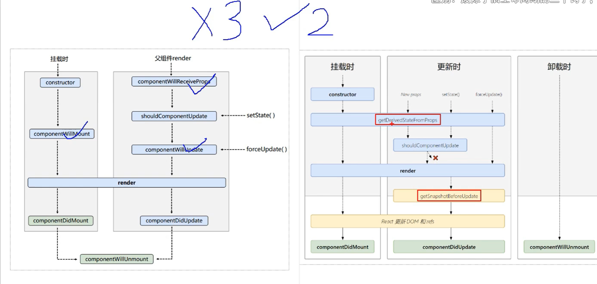

## 说说 React中的setState执行机制

### setState 作用

- 一个组件的显示形态可以由数据状态和外部参数所决定，而数据状态就是`state`
- 当需要修改里面的值的状态需要通过调用`setState`来改变，从而达到更新组件内部数据的作用

### 更新类型

在使用`setState`更新数据的时候，`setState`的更新类型分成：

- 异步更新

  - 在组件生命周期或React合成事件中，setState是异步

  - ```js
    changeText() {
      this.setState({
        message: "你好啊"
      })
      console.log(this.state.message); // Hello World
    }
    
    // 从上面可以看到，最终打印结果为Hello world，并不能在执行完setState之后立马拿到最新的state的结果
    // 如果想要立刻获取更新后的值，在第二个参数的回调中更新后会执行
    changeText() {
      this.setState({
        message: "你好啊"
      }, () => {
        console.log(this.state.message); // 你好啊
      });
    }
    ```

- 同步更新

  - 在setTimeout或者原生dom事件中，setState是同步

  - ```js
    changeText() {
      setTimeout(() => {
        this.setState({
          message: "你好啊
        });
        console.log(this.state.message); // 你好啊
      }, 0);
    }
    ```

  - ```js
    componentDidMount() {
      const btnEl = document.getElementById("btn");
      btnEl.addEventListener('click', () => {
        this.setState({
          message: "你好啊,李银河"
        });
        console.log(this.state.message); // 你好啊,李银河
      })
    }
    ```

### 批量更新

```js
handleClick = () => {
    this.setState({
        count: this.state.count + 1,
    })
    console.log(this.state.count) // 1

    this.setState({
        count: this.state.count + 1,
    })
    console.log(this.state.count) // 1

    this.setState({
        count: this.state.count + 1,
    })
    console.log(this.state.count) // 1
}

// 对同一个值进行多次 setState， setState 的批量更新策略会对其进行覆盖，取最后一次的执行结果

// 上述的例子，实际等价于如下：
Object.assign(
  previousState,
  {index: state.count+ 1},
  {index: state.count+ 1},
  ...
)
```

由于后面的数据会覆盖前面的更改，所以最终只加了一次

如果是下一个`state`依赖前一个`state`的话，推荐给`setState`一个参数传入一个`function`，如下：

```jsx
onClick = () => {
    this.setState((prevState, props) => {
      return {count: prevState.count + 1};
    });
    this.setState((prevState, props) => {
      return {count: prevState.count + 1};
    });
}
```

## 说说 React 的事件机制

## 说说 React render 方法的原理和触发实际

### 原理

```js
// 首先，`render`函数在`react`中有两种形式：
class Foo extends React.Component {
    render() {
        return <h1> Foo </h1>;
    }
}
```

```js
// 在函数组件中，指的是函数组件本身：
function Foo() {
    return <h1> Foo </h1>;
}
```

在`render`中，我们会编写`jsx`，`jsx`通过`babel`编译后就会转化成我们熟悉的`js`格式，如下：

```js
return (
  <div className='cn'>
    <Header> hello </Header>
    <div> start </div>
    Right Reserve
  </div>
)

// `babel`编译后：
return (
  React.createElement(
    'div',
    {
      className : 'cn'
    },
    React.createElement(
      Header,
      null,
      'hello'
    ),
    React.createElement(
      'div',
      null,
      'start'
    ),
    'Right Reserve'
  )
)
```

```js
function render(vnode,container) {
    if(vnode === undefined) return
    // 1 如果vnode是字符串
    if(typeof vnode === 'string'){
      // 2 创建文本节点
      let textNode = document.createTextNode(vnode)
      return container.appendChild(textNode)
    }
    // 3 虚拟DOM对象
    const {tag,attrs,childrens} = vnode
    const dom = document.createElement(tag)
    if(attrs){
      Object.keys(attrs).forEach(key=>{
        const value = attrs[key]
        // 4
        setAttribute(dom,key,attrs[key])
      })
    }

    // 5 渲染子节点,直接调用render
    childrens.forEach(child=>render(child,dom))

    return container.appendChild(dom)
  }
```


### 触发时机

`render`的执行时机主要分成了两部分：

- 类组件调用 setState 修改状态

- ```js
  class Foo extends React.Component {
    state = { count: 0 };
  
    increment = () => {
      const { count } = this.state;
  
      const newCount = count < 10 ? count + 1 : count;
  
      this.setState({ count: newCount });
    };
  
    render() {
      const { count } = this.state;
      console.log("Foo render");
  
      return (
        <div>
          <h1> {count} </h1>
          <button onClick={this.increment}>Increment</button>
        </div>
      );
    }
  }
  ```

- 函数组件通过`useState hook`修改状态

  ```js
  function Foo() {
    const [count, setCount] = useState(0);
  
    function increment() {
      const newCount = count < 10 ? count + 1 : count;
      setCount(newCount);
    }
  
    console.log("Foo render");
    
    return (
      <div>
        <h1> {count} </h1>
        <button onClick={increment}>Increment</button>
      </div>
    );
  }
  ```

  函数组件通过`useState`这种形式更新数据，当数组的值不发生改变了，就不会触发`render`, 而 setState 只要调用就会触发

### 总结

所以，一旦执行了`setState`就会执行`render`方法，`useState` 会判断当前值有无发生改变确定是否执行`render`方法，一旦父组件发生渲染，子组件也会渲染

## 说说你对 immutable 的理解？如何应用在 react 项目中

immutable 顾名思义就是不可变的数据，当这个数据被修改时，会返回一个新的对象，但是对象会尽可能引用之前的数据结构而不会造成内存浪费。

在 react 中可以配合 shouldupdatecomponent 钩子一起使用，我们知道 setState 一定会触发重新渲染且父重新渲染子也会重新渲染，有时这是不必要的，比如父 state 变，子state 不变的情况，子不应该重新渲染，所以我们只要把 state （或 prop） 转换为 immutable 数据，每次用它提供的 api 来比对和修改数据，就可以避免这种情况

## 说说对 Fliber 架构的理解，解决了什么问题

我觉得 fliber 机制就是对任务切片思想的应用，它解决了高优先级任务被阻塞的问题，使展示和反馈更加顺畅

- fliber 树生成阶段
  - React 在首次渲染后会生成一个 fliber 树， fliber 树的每个节点存储了父、子、兄弟节段的引用，为实现断点和恢复断点称成为了可能。

fliber 机制可以分成两个阶段:

- Reconciliation 阶段
  - 我觉得可以理解成 effect 的收集阶段，新旧(新：current树(fliber)， 旧：workinprogress树)节点对比，变化就收集 effet 到 effetlist 中，然后每一次比对就会检查下当前帧是否还有剩余时间，如果有则进行下一个节点的对比工作, 如果没有就利用 window.requestIdleCallback() )将该节点注册至下一次浏览器空闲时的回调函数中，等下一次被唤起时继续进行或重新开始。
- Commit 阶段
  - 此阶段React会将上一阶段收集到的effectList依次提交给真实的DOM操作，触发页面展示的改变。此阶段的任务优先级为同步，也就是说这一系列的DOM操作不能被其他任务中断。
  - 第二阶段结束后，能反映真实DOM树结构的Fiber树是WorkInProgress树。而在协调的第一阶段，current树才对应真实的DOM树。所以在第二阶段结束时React会把current树和WorkInProgress树的指针对调，使其符合current树反映当前真实的DOM树的这一设定。
- 总结
  - 无法继续精细化，由于React Fiber是以Fiber节点为最小颗粒（即操作单元）的，无法在生命周期内对任务进行拆分，所以这些计算任务在执行中途不能被中断；
  - ·大量真实的DOM操作：因为这部分任务在Fiber的第二阶段同步执行，无法被打断，过大的DOM操作压力只能由浏览器承担。

## React 性能优化

## 组件更新流程

```js
function diffComponent(dom,vnode) {
      let comp = dom
      // 如果组件没有变化，重新设置props
      if(comp && comp.constructor === comp.tag){
        // 重新设置props
        setComponentProps(comp,vnode.attrs)
        // 赋值
        dom = comp.base
      }else{
        // 组件类型发生了变化
        if(comp){
          // 先移除旧的组件
          unmountComponent(comp)
          comp = null
        }

        // 1. 创建新的组件
        comp=createComponent(vnode.tag,vnode.attrs)
        //2. 设置组件属性
        setComponentProps(comp,vnode.attrs)
        // 3. 给当前挂载示例
        dom = comp.base
      }
      return dom
    }
```

Vue 

```js
  function processComponent(n1, n2, container, parentComponent) {
    // 如果 n1 没有值的话，那么就是 mount
    if (!n1) {
      // 初始化 component
      mountComponent(n2, container, parentComponent);
    } else {
      updateComponent(n1, n2, container);
    }
  }
  
    // 组件的更新
  function updateComponent(n1, n2, container) {
    console.log("更新组件", n1, n2);
    // 更新组件实例引用
    const instance = (n2.component = n1.component);
    // 先看看这个组件是否应该更新
    if (shouldUpdateComponent(n1, n2)) {
      console.log(`组件需要更新: ${instance}`);
      // 那么 next 就是新的 vnode 了（也就是 n2）
      instance.next = n2;
      // 这里的 update 是在 setupRenderEffect 里面初始化的，update 函数除了当内部的响应式对象发生改变的时候会调用
      // 还可以直接主动的调用(这是属于 effect 的特性)
      // 调用 update 再次更新调用 patch 逻辑
      // 在update 中调用的 next 就变成了 n2了
      instance.update();
    } else {
      console.log(`组件不需要更新: ${instance}`);
      // 不需要更新的话，那么只需要覆盖下面的属性即可
      n2.component = n1.component;
      n2.el = n1.el;
      instance.vnode = n2;
    }
  }
```

## React 组件间通信

### 父组件向子组件传递

通过 props

```js
function EmailInput(props) {
  return (
    <label>
      Email: <input value={props.email} />
    </label>
  );
}

const element = <EmailInput email="123124132@163.com" />;

```

### 子组件向父组件传递

子组件向父组件通信的基本思路是，父组件向子组件传一个函数，然后通过这个函数的回调，拿到子组件传过来的值

```js
// 父代码
class Parents extends Component {
  constructor() {
    super();
    this.state = {
      price: 0
    };
  }

  getItemPrice(e) {
    this.setState({
      price: e
    });
  }

  render() {
    return (
      <div>
        <div>price: {this.state.price}</div>
        {/* 向子组件中传入一个函数  */}
        <Child getPrice={this.getItemPrice.bind(this)} />
      </div>
    );
  }
```

```js
// 子代码
class Child extends Component {
  clickGoods(e) {
    // 在此函数中传入值
    this.props.getPrice(e);
  }

  render() {
    return (
      <div>
        <button onClick={this.clickGoods.bind(this, 100)}>goods1</button>
        <button onClick={this.clickGoods.bind(this, 1000)}>goods2</button>
      </div>
    );
  }
}
```

### 兄弟组件之间的通信

```js
class Parent extends React.Component {
  constructor(props) {
    super(props)
    this.state = {count: 0}
  }
  setCount = () => {
    this.setState({count: this.state.count + 1})
  }
  render() {
    return (
      <div>
        <SiblingA
          count={this.state.count}
        />
        <SiblingB
          onClick={this.setCount}
        />
      </div>
    );
  }
}
```

父组件向后代组件传递数据是一件最普通的事情，就像全局数据一样

使用`context`提供了组件之间通讯的一种方式，可以共享数据，其他数据都能读取对应的数据

通过使用`React.createContext`创建一个`context`

```js
 const PriceContext = React.createContext('price')
```

`context`创建成功后，其下存在`Provider`组件用于创建数据源，`Consumer`组件用于接收数据，使用实例如下：

`Provider`组件通过`value`属性用于给后代组件传递数据：

```jsx
<PriceContext.Provider value={100}>
</PriceContext.Provider>
```

如果想要获取`Provider`传递的数据，可以通过`Consumer`组件或者或者使用`contextType`属性接收，对应分别如下：

```jsx
class MyClass extends React.Component {
  static contextType = PriceContext;
  render() {
    let price = this.context;
    /* 基于这个值进行渲染工作 */
  }
}
```

`Consumer`组件：

```jsx
<PriceContext.Consumer>
    { /*这里是一个函数*/ }
    {
        price => <div>price：{price}</div>
    }
</PriceContext.Consumer>
```

### Redux

```js
const redux = require('redux');

const initialState = {
  counter: 0
}

// 创建reducer
const reducer = (state = initialState, action) => {
  switch (action.type) {
    case "INCREMENT":
      return {...state, counter: state.counter + 1};
    case "DECREMENT":
      return {...state, counter: state.counter - 1};
    case "ADD_NUMBER":
      return {...state, counter: state.counter + action.number}
    default: 
      return state;
  }
}

// 根据reducer创建store
const store = redux.createStore(reducer);

// 订阅 store 的改变，只要 store 发生改变， store.subscrible 这个函数接收的这个回调函数就会被执行
store.subscribe(() => {
  console.log(store.getState());
})

// 修改store中的state
store.dispatch({
  type: "INCREMENT"
})
// console.log(store.getState());

store.dispatch({
  type: "DECREMENT"
})
// console.log(store.getState());

store.dispatch({
  type: "ADD_NUMBER",
  number: 5
})
// console.log(store.getState());
```

### 说说对 Redux 中间件的理解，常用的中间件有哪些？实现原理

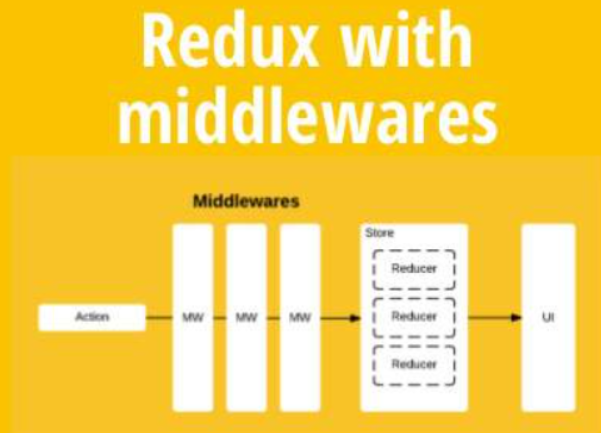

使用

```js
const store = createStore(
  reducer,
  applyMiddleware(thunk, logger) // 使用 thunk 和 logger 中间件
);
```

跟 node 中间件思想相同

```js
function createThunkMiddleware(extraArgument) {
    return function ({
        dispatch,
        getState
    }) {
        return function (next) {
            return function (action) {
                if (typeof action === 'function') {
                    return action(dispatch, getState, extraArgument);
                }
                return next(action);
            };
        }
    }
}
let thunk = createThunkMiddleware();
thunk.withExtraArgument = createThunkMiddleware;
export default thunk;
```

这样就可以dispatch传一个函数了

```js
const getHomeMultidataAction = () => {
  return (dispatch) => {
    axios.get("http://xxx.xx.xx.xx/test").then(res => {
      const data = res.data.data;
      dispatch(changeBannersAction(data.banner.list));
      dispatch(changeRecommendsAction(data.recommend.list));
    })
  }
}

store.dispatch(getHomeMultidataAction()) // dispatch 做异步操作
```

## React 性能优化

[面试官：说说 React 性能优化的手段有哪些？ | web前端面试 - 面试官系列 (vue3js.cn)](https://vue3js.cn/interview/React/Improve performance.html#一、是什么)

# CVTE 

## 笔试准备

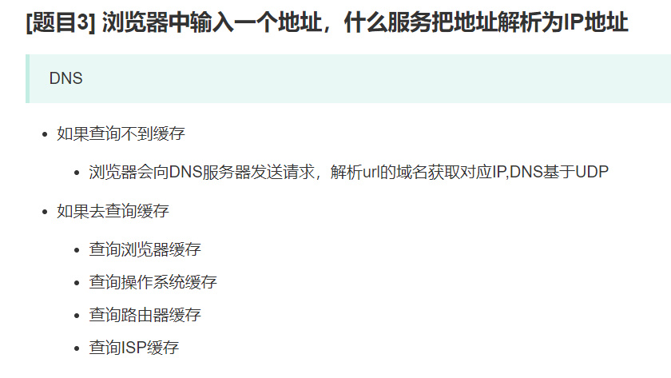

### **某服务通过CORS实现跨域访问，若服务器设置的Header为Access Control Allow Origin: * ，能够在请求中携带Cookie**

如果要发送Cookie，`Access-Control-Allow-Origin`就不能设为星号，必须指定明确的、与请求网页一致的域名，设置 withCredentials: true。同时，Cookie依然遵循同源政策，只有用服务器域名设置的Cookie才会上传，其他域名的Cookie并不会上传，且（跨源）原网页代码中的`document.cookie`也无法读取服务器域名下的Cookie。

### **typeof**

引用类型除了函数会返回 function 其他都是 object，还有 null 也是 object

```js
// 数值
typeof 37 === 'number';
typeof 3.14 === 'number';
typeof(42) === 'number';
typeof Math.LN2 === 'number';
typeof Infinity === 'number';
typeof NaN === 'number'; // 尽管它是 "Not-A-Number" (非数值) 的缩写
typeof Number(1) === 'number'; // Number 会尝试把参数解析成数值

typeof 42n === 'bigint';


// 字符串
typeof '' === 'string';
typeof 'bla' === 'string';
typeof `template literal` === 'string';
typeof '1' === 'string'; // 注意内容为数字的字符串仍是字符串
typeof (typeof 1) === 'string'; // typeof 总是返回一个字符串
typeof String(1) === 'string'; // String 将任意值转换为字符串，比 toString 更安全


// 布尔值
typeof true === 'boolean';
typeof false === 'boolean';
typeof Boolean(1) === 'boolean'; // Boolean() 会基于参数是真值还是虚值进行转换
typeof !!(1) === 'boolean'; // 两次调用 ! (逻辑非) 操作符相当于 Boolean()


// Symbols
typeof Symbol() === 'symbol';
typeof Symbol('foo') === 'symbol';
typeof Symbol.iterator === 'symbol';


// Undefined
typeof undefined === 'undefined';
typeof declaredButUndefinedVariable === 'undefined';
typeof undeclaredVariable === 'undefined';


// 对象
typeof {a: 1} === 'object';

// 使用 Array.isArray 或者 Object.prototype.toString.call
// 区分数组和普通对象
typeof [1, 2, 4] === 'object';

typeof new Date() === 'object';
typeof /regex/ === 'object'; // 历史结果请参阅正则表达式部分


// 下面的例子令人迷惑，非常危险，没有用处。避免使用它们。
typeof new Boolean(true) === 'object';
typeof new Number(1) === 'object';
typeof new String('abc') === 'object';

// 函数
typeof function() {} === 'function';
typeof class C {} === 'function'
typeof Math.sin === 'function';

// JavaScript 诞生以来便如此
typeof null === 'object'
```

### constructor 和 原型的关系

```js
// Person 就是一个 constructor
function Person(name) {
    this.name = name
}

Person.prototype.showName = () => {
    console.log(123);
}

// person.prototype = person.constructor.prototype
const person = new Person('jack')

console.log(Object.getPrototypeOf(person) === Person.prototype);
```

原型是 js 的一种继承方式

### 数字转十六进制字符串，16进制字符串转十进制数字

```js
Number(255).toString(16) // 'ff'

parseInt('ff', 16) // 255
```

### line-height

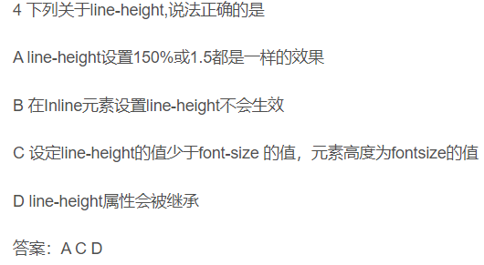

### 打印

changed, executed

```js
var execFunc = function () {
    console.log("executed");
};
setTimeout(execFunc, 0);
console.log("changed");
execFunc = function () {
    console.log("another executed");
}
```

### 阻止事件冒泡的方法

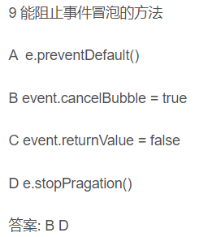

- DOM中的事件对象  event.stopPropagation()可以阻止事件的传播.,取消进一步的事件冒泡或者捕获
- IE中的事件对象  cancelBubble属性值为true,可以取消事件冒泡。

## 面试准备

### 组件复用

我觉得就是对通用模板和功能进行复用，其实我们使用的 ui 组件本质就是我们对组件的复用，当然我们也可以自定义组件

### 项目登录流程

比如说客户端在登录页面输入账户密码验证码然后点击登录，那么我们就发起一个登录请求，然后服务端对请求的信息进行校验，如果校验通过就，返回 token，然后后续我们的请求就利用 token 进行校验

### cookie、localStroage、sessionStorage 区别

- 存储大小：chrome 的话每一个 cookie 能存 4k，storage 都是 5MB
- 有效时间：cookie 可以设置过期时间(expire), localStorage 持久存储，sessionStorage 浏览器窗口会话期间有效
- 交互方式：cookie 会伴随请求自动发送到有效域的服务器

### 常见的设计模式

####  观察者模式和订阅者模式

##### 观察者模式

我觉得观察者模式是一个一对多关系，比如说被观察者是一个报社，那观察者就是每一个订阅报社的人，被观察者需要去记录每一个观察者，从而在有新报纸的时候可以准确送达到订阅报纸的人手中。vue 的响应式原理就是对观察者模式的应用，wather（观察者），数据 (被观察者)

```js
// 被观察者
class Subject {

  constructor() {
    this.observerList = [];
  }

  addObserver(observer) {
    this.observerList.push(observer);
  }

  removeObserver(observer) {
    const index = this.observerList.findIndex(o => o.name === observer.name);
    this.observerList.splice(index, 1);
  }

  notifyObservers(message) {
    const observers = this.observeList;
    observers.forEach(observer => observer.notified(message));
  }

}
```

```js
// 观察者
class Observer {

  constructor(name, subject) {
    this.name = name;
    if (subject) {
      subject.addObserver(this);
    }
  }

  notified(message) {
    console.log(this.name, 'got message', message);
  }
}
```

```js
// 应用
const subject = new Subject();
const observerA = new Observer('observerA', subject);
const observerB = new Observer('observerB');
subject.addObserver(observerB);
subject.notifyObservers('Hello from subject');
subject.removeObserver(observerA);
subject.notifyObservers('Hello again');
```

#### 单例模式

传统的单例模式是保证类仅有一个实例，并提供一个访问它的全局访问点。因为 js 其实本质是一门无类(class free)语言, 我们没有必要生搬单例模式的概念，我们直接创建一个唯一对象，而无需类。最经典就是对闭包的利用了，比如惰性单例(需要的时候才创建)

```js
// 传统定义
function Singleton(name) {
    this.name = name;
}
// 原型扩展类的一个方法getName()
Singleton.prototype.getName = function() {
    console.log(this.name)
};
// 获取类的实例
Singleton.getInstance = (function() {
    var instance = null;
    return function(name) {
        if(!this.instance) {
            this.instance = new Singleton(name);
        }
        return this.instance
    }        
})();

// 获取对象1
const a = Singleton.getInstance('a');
// 获取对象2
const b = Singleton.getInstance('b');
// 进行比较
console.log(a === b);
```

```js
// 惰性单例通用模式
const getSingle = function( fn ){
  let result;
  return function(){
    return result || ( result = fn .apply(this, arguments ) );
  }
}; 
```

#### 代理模式

代理模式的关键是，当客户不方便直接访问一个对象或者不满足需要的时候，提供一个替身对象来控制对这个对象的访问，客户实际上访问的是替身对象。替身对象对请求做出一些处理之后，再把请求转交给本体对象。

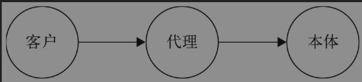

- 比如 es6 的 proxy，代理本体对象的访问，再进行把实际操作进行转发，最经验的场景就是vue的数据劫持嘛

- 还有像缓存代理，把计算结果缓存在代理对象上，减少重复操作，也可以合并多个请求

  - 

- 还有虚拟代理，把开销大的操作，延迟到需要它的时候再操作，比如实现图片的预加载

  - 创建一个代理对象，有一个 setSrc 的 api，在 setSrc 里利用闭包保持对 img 对象的引用，img 对象 监听 onload 事件，加载完就 给真实的节点 setSrc

  - ```js
    // 图片本地对象，负责往页面中创建一个img标签，并且提供一个对外的setSrc接口
    let myImage = (function(){
        let imgNode = document.createElement( 'img' );
        document.body.appendChild( imgNode );
    
        return {
            //setSrc接口，外界调用这个接口，便可以给该img标签设置src属性
            setSrc: function( src ){
                imgNode.src = src;
            }
        }
    })();
    // 代理对象，负责图片预加载功能
    let proxyImage = (function(){
        // 创建一个Image对象，用于加载需要设置的图片
        let img = new Image;
        img.onload = function(){
            // 监听到真实图片加载完成后，给被代理的图片本地对象设置src为加载完成后的图片
            myImage.setSrc( this.src );
        }
        
        return {
            setSrc: function( src ){
                // 设置图片时，在图片未被真正加载好时，以这张图作为loading，提示用户图片正在加载
                myImage.setSrc( 'https://img.zcool.cn/community/01deed576019060000018c1bd2352d.gif' );
                img.src = src;
            }
        }
    })();
    
    proxyImage.setSrc( 'https://xxx.jpg' ); 
    ```

#### js 独特的 promise.then 链式调用，

- 我觉得也可以归结为一种设计模式，有点类似于职责链模式，像 axios 拦截器的实现
- 职责链模式的定义是：使多个对象都有机会处理请求，从而避免请求的发送者和接收者之间的耦合关系，将这些对象连成一条链，并沿着这条链传递该请求，直到有一个对象处理它为止。

### service worker

- 有简单了解，它是一个代理服务器，可以拦截网络请求，做接口的缓存，真实资源的修改，也可以做计算成本高的操作，比如线上的编译操作，还有资源预获取等等。
- 有三个生命周期
  - 下载：访问有注册 service worker 的页面就会立即下载
  - 安装：如果是首次，或者不同的 service worker（比对文件字节） 就会进行安装
  - 激活：首次安装成功后就会激活，如果是有 service worker 在运行会等待到旧的不再对控制客户端才会激活，激活前会处于wating状态

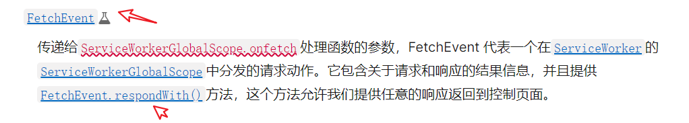

主要接口

### 浏览器渲染流程

#### chrome 浏览器多进程架构

!(https://p1-jj.byteimg.com/tos-cn-i-t2oaga2asx/gold-user-assets/2020/5/7/171ec92af3abe729~tplv-t2oaga2asx-zoom-in-crop-mark:3024:0:0:0.awebp)

- 浏览器进程。主要负责界面显示、用户交互、子进程管理，同时提供存储等功能。
- 渲染进程。核心任务是将 HTML、CSS 和 JavaScript 转换为用户可以与之交互的网页，排版引擎 Blink 和 JavaScript 引擎 V8 都是运行在该进程中，默认情况下，Chrome 会为每个 Tab 标签创建一个渲染进程。出于安全考虑，渲染进程都是运行在沙箱模式下。
- GPU 进程。其实，Chrome 刚开始发布的时候是没有 GPU 进程的。而 GPU 的使用初衷是为了实现 3D CSS 的效果，只是随后网页、Chrome 的 UI 界面都选择采用 GPU 来绘制，这使得 GPU 成为浏览器普遍的需求。最后，Chrome 在其多进程架构上也引入了 GPU 进程。
  - 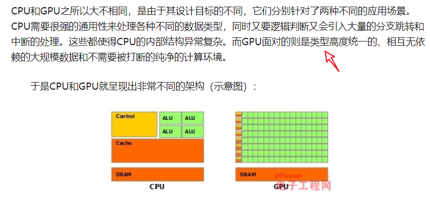
  - tips：可以理解成是对 cpu 的特别定制，专用于特定的场景
- 网络进程。主要负责页面的网络资源加载，之前是作为一个模块运行在浏览器进程里面的，直至最近才独立出来，成为一个单独的进程。（输入url 后，网络进程获取对应的资源，创建一个渲染进程，并通过 ipc 管道将资源传递给对应的页面）
- 插件进程。主要是负责插件的运行，因插件易崩溃，所以需要通过插件进程来隔离，以保证插件进程崩溃不会对浏览器和页面造成影响。

#### chrome 浏览器多进程架构

#### 流程

html解析（遇到link不会阻塞，因为不影响dom生成，遇到script会） =》DOM 和 CSSOM => renderTree => layout (布局计算，layoutTree)=>  paint （根据lyoutTree生成绘制顺序表）=》  layer(根据layoutTree分层，layerTree)  => composting(合成)

tips：transform 实现动画，不用进行layer，直接到达合成器线程

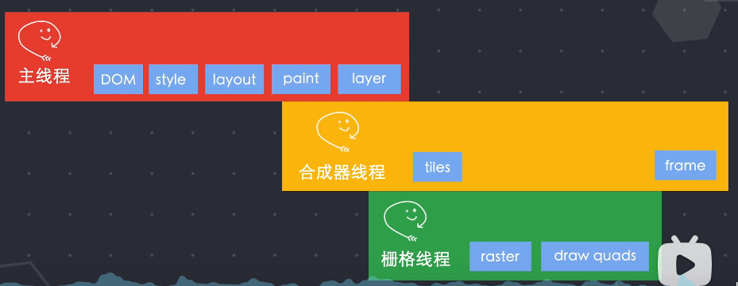

整体来说，就是：

- 浏览器中的网络线程会将加载进来的数据，如 HTML 之类的通过 IPC（进程间的通讯）传递给渲染进程。
- 渲染进程中的主线程会将 HTML 解析成 DOM；
- 将 CSS 解析成 CSSOM（styleSheets）并计算单位绝对值得到样式表；
- 然后将 DOM 和 CSSOM 结合生成仅含可见元素的布局树，并应用样式和计算布局；（再细会生成render tree再生成layout Tree）
- layoutTree（布局树）进行绘制操作（paint），生成绘制指令表；
- layoutTree进行layer生成layerTree（分层树）
- 然后主线程会将layerTree和绘制指令表一起传递给合成线程，合成线程在将图层拆分成更小的图块（tile）也称为贴片；接着会传递给 GPU 进行栅格化（raster，将图块转换成位图，存储在显存中，**位于视口（可见区域）的图块，优先处理**），栅格化线程处理完毕后，合成线程会得到称为 “draw quads” 的图块信息，将这些信息合成一个帧（frame）称为合成器帧，通过 IPC 传递给浏览器进程；
- 最后，浏览器进程得到当前合成帧后，viz（可视化模块）会调用 GPU 进行相应的绘制操作，将当前图片信息绘制到显示器上。

#### paint 绘制

根据 layoutTree 生成绘制指令表（包含有绘制的操作、坐标、样式等）

#### **Layer分层**

分层其实就是一种分而治之的思想，一个复杂的页面会包含大量的元素，如果这些元素都集中在同一个图层中，一个元素发生变化，就会牵一而动全身，整个图层都要重新绘制。（根据 layout Tree 生成） 

可以将内容提升到 GPU 层 可以提高绘制(paint)和重新绘制(repaint)的性能，保证一些页面比较复杂的效果和动画可以平滑滚动，只要是有层叠上下文属性(z-index,  transform, position fixed、opacity等)的节点都会被视为特殊节点生成图层，tansform 变化不会造成 reflow 和 repaint，只对它的那个图层进行合成（光栅化和渲染）

```
层叠上下文：我们假定用户正面向（浏览器）视窗或网页，而 HTML 元素沿着其相对于用户的一条虚构的 z 轴排开，**层叠上下文**就是对这些 HTML 元素的一个三维构想。众 HTML 元素基于其元素属绘性按照优先级顺序占据这个空间。
```

#### Composting 合成

主线程会将layer tree和绘制指令表一起传递给合成线程。由于有些图层很大，全部进行绘制会产生极大的性能开销，所以合成线程会将图层进行**分块**，然后将位于视口（可见区域）的图块优先进行栅格化的操作（就是生成位图），也就是「异步分块光栅化」。图层分块称为「tile 机制」，很多开放世界游戏都使用这种机制来绘制无缝地图，如 GTA5。

图块全被栅格化后，就会生成一个绘制图块的指令（DrawQuad），将该指令提交给浏览器进程后，viz（可视化模块）会调用 GPU 进行相应的绘制操作，将当前图片信息绘制到显示器上。

#### reflow 和 repaint

当你通过 JavaScript 或者 CSS 改变了元素的布局信息

reflow：重新进行layout，layer，paint

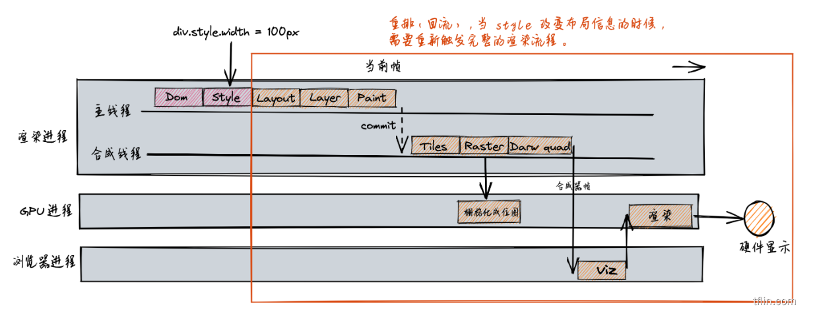

repaint：重新绘制 paint 操作

触发条件：当你改变不会影响元素布局的属性的时候，比如元素的颜色、背景颜色、边框颜色、阴影等

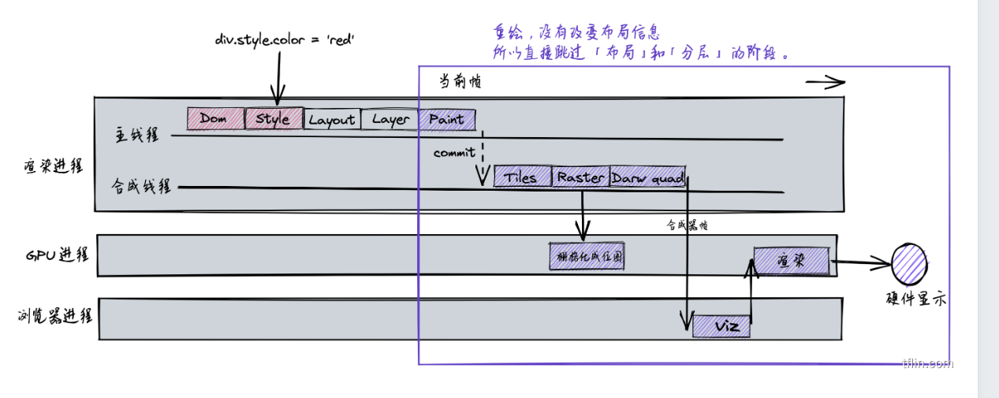

tips：比如我们懒加载一张图片，如果我们定义了图像的大小，就不需要reflow，只需要重新绘制需要重新绘制的层，并在必要时进行合成。但我们没有包括图像大小！从服务器获取图像后，就会进行 reflow

#### React fliber

因为布局和绘制都是在主线程进行的，当在一帧的时间内布局和绘制结束后，如果还有剩余时间，js就会拿到主线程的使用权，如果js执行时间过长就会导致在下一帧开始时，js 没有及时归还主线程导致下一帧动画没有及时渲染就会导致页面卡顿，利用requestAnimationFrame将js操作分成更小的任务块细分到每一个帧，在每一帧时间用完暂停 js 执行，归还主线程

### 快速排序和冒泡排序

**冒泡：**时间o(n²)，空间o(1)，只需要一个temp 临时变量来交换位置；稳定，不会去交换两个相等数据的相对位置

**冒泡优化**

```js
const case1 = [5, 2, 1, 3, 6, 7, 8]
let count = 0

function bubble(arr) {
    let nextPos = arr.length
    for (let i = 0; i < arr.length; i++) {
        let curPos = nextPos
        let mark = false // 如果没有发生交换说明已经搞定了，没有必要再循环下去，直接break
        for (let j = 0; j < curPos; j++) {
            count++ // 用来查看计算次数而已
            if (arr[j] > arr[j + 1]) {
                const temp = arr[j]
                arr[j] = arr[j + 1]
                arr[j + 1] = temp
                nextPos = j + 1 // 记录当前交换的位置，下次遍历的时候只要遍历这前面的值就可以了
                mark = true     // 如上面的例子 6、7、8 很显然没有必要在第一次循环后遍历了，这个区间没发生过交换说明他们是按序的
            }
        }

        if (!mark) break;
    }
    console.log(count);
    return arr
}


console.log(bubble(case1));
```

**快排：**o(nlogn)，空间o(log2n),

快速排序的稳定性：不稳定，会交换比如 53363 =》 33356

稳定性的定义：**能保证排序前两个相等的数据其在序列中的先后位置顺序与排序后它们两个先后位置顺序相同**

### vue

#### MVVM 和 MVC

MVVM与MVC最大的区别就是：它实现了View和Model的自动同步，也就是当Model的属性改变时，我们不用再自己手动操作Dom元素，来改变View的显示，而是改变属性后该属性对应View层显示会自动改变。

#### Vue 双向绑定原理

其实讲 vue 的双向绑定原理我觉得我们可以从 v-model 指令出发，我们知道 v-model 是一个语法糖，本质就是监听change事件，数据发生变化就把值赋值给对应的 model(view => model)，因为这个 model 是做过数据劫持处理的，所以它会驱动视图的更新(model => view), 这就实现了 view 和 model 的一个自动同步。

#### Vue3 提升的点

##### compotion API

- 我觉得最经典的就是 compotion api
- 一个是它让 vue 更容易学习，开发起来更接近原生；还有就是让整体更加稳定更容易维护，我们写一块业务逻辑在 vue2 里面需要拆分在 data，method，compoted，watch 等模块里面，那有 c api 就可以写在一块了，甚至我们可以让通用的逻辑提取出去，实现复用。

##### diff  算法性能的提升

- 利用最长递增子序列来优化对比流程减少最大程度的减少
  - 比如说 3、4、5、1、2 =》 1、2、3、4、5。 好像每个元素都需要去移动，实际上不用只要让1、2 移动就行了，让2插到3前，1插到2前，只需要操作两次
  - 思路：先将第一个数放进一个数组里，第二个数如果比它大就加进来，如果比它小就替换掉这个数组中比它大的最大那个（贪心思想，用二分查找找）

- 定义了一个 shapeFlag 的枚举类型，利用位运算来标识节点类型
  - 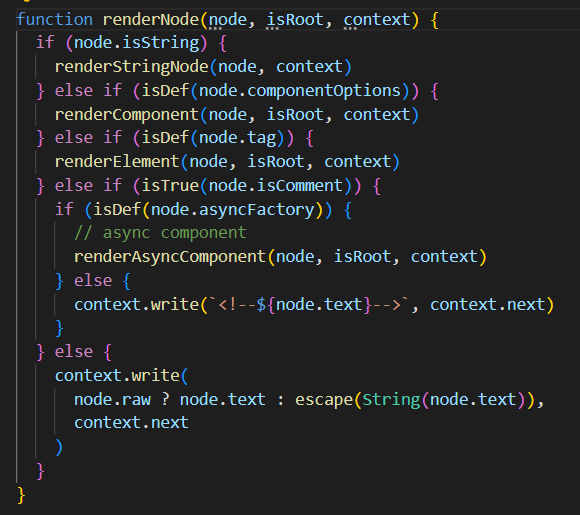
  - 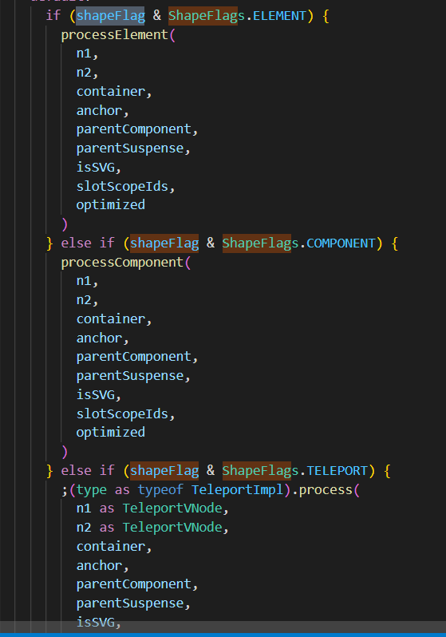
- 全量 diff 变成了靶向更新
  - diff 不用去比对静态的节点，比对动态的节点和属性即可 
  - 主要是vnode 多了个 patchFlag 和 dynamicChildren（收集动态节点） 属性，判断 patchFlag，编译的时候判断它是否用上了动态属性或者内容给它打上对应的标志
    - 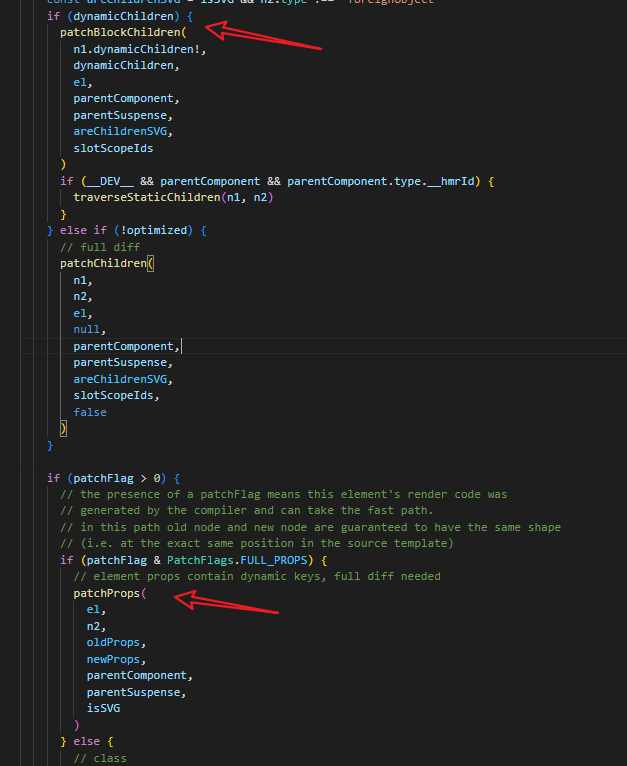
    - 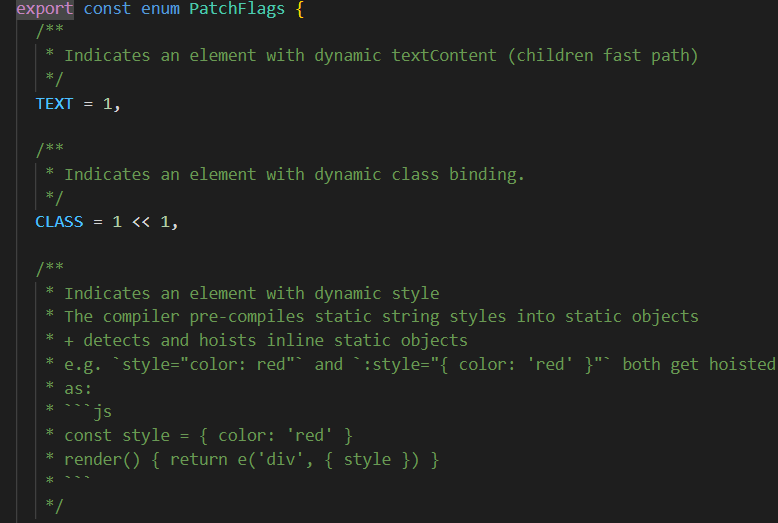

##### 响应式优化

利用 defineproperty 和 proxy 相结合的方式来实现响应式

- proxy 可以监听对象增删改查的操作

  - ```js
    const obj = {
        a: 123,
        b: 456
    }
    
    const proxy = new Proxy(obj, {
        get: function(target,  key) {
            console.log(key)
        },
        set: function(target, key) {
            console.log(key);
        },
        deleteProperty: function(target, key) {
            console.log(key);
        }
    })
    
    
    delete proxy.b
    ```

- 还可以监听数组的操作（注意会变化length的api要让他避免被length收集，不然可能会出现循环触发）

  - 如果不这样，比如 proxyArr.push(1)会读取 length 属性，作为依赖被 length 收集，然后它会 set length =  4，就会触发依赖 push，就会不断的死循环

  - ```js
    const arr = [1, 2, 3]
    const proxyArr = new Proxy(arr, {
        get: function(target,  key, r) {
            console.log('get', key)
            return Reflect.get(target, key, r)
        },
        set: function(target, key, r) {
            console.log('set', key, r);
            return Reflect.set(target, key, r)
        },
        deleteProperty: function(target, key, r) {
            console.log('del', key);
            return Reflect.deleteProperty(target, key, r)
        }
    })
    
    proxyArr.push(1)
    console.log(proxyArr);
    ```

    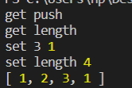

##### 全面支持 TS 还有 setup 语法糖

- 源码本身就是 ts 写的，会有非常友好的代码提示
- setup 语法糖写起来就非常爽，不用 return 哪些响应式数据，和组件也不用自己显示的注册，引入就好了，它会帮你处理

##### computed 原理

在 vue3 的实现里面，computed 是用一个 computedRefIml 类实现的，本质是一个只读的 ref，所以 computed 是响应式的

- computed 创建的时候会讲用户传进来的 getter 转换为 ReactiveEffect
- 当我们每一次读取 computed.value 的时候它会通过 dirty 变量判断是否为脏数据，如果是就会调用用户 effect.run，因为初始化默认dirty为true，所以就会第一次访问的时候就会被调用，一旦执行了 effect.run 就会调用到用户的 getter 返回计算结果，并且这个时候 effect 会被 getter 依赖的数据收集。
- 所以当我们修改依赖的数据的时候，就会执行到它的依赖，执行依赖的时候会调用 schedular，schedular 会将 dirty 变为 true

```js
export class ComputedRefImpl {
    public dep: any;
    public effect: ReactiveEffect;

    private _dirty: boolean;
    private _value

    constructor(getter) {
        this._dirty = true;
        this.effect = new ReactiveEffect(getter, () => {
            if (this._dirty) return;
            this._dirty = true;
            
            // computedRefImp 实例化后 this 就是这个对象，因为 new 绑定
            triggerRefValue(this); // 触发依赖（用到 computed 的依赖去更新数据）
        });
    }

    get value() {
        // 收集依赖（用到 computed 的依赖）
        trackRefValue(this);

        if (this._dirty) {
            this._dirty = false;
            this._value = this.effect.run();
        }

        return this._value;
    }
}
```

##### watch 原理

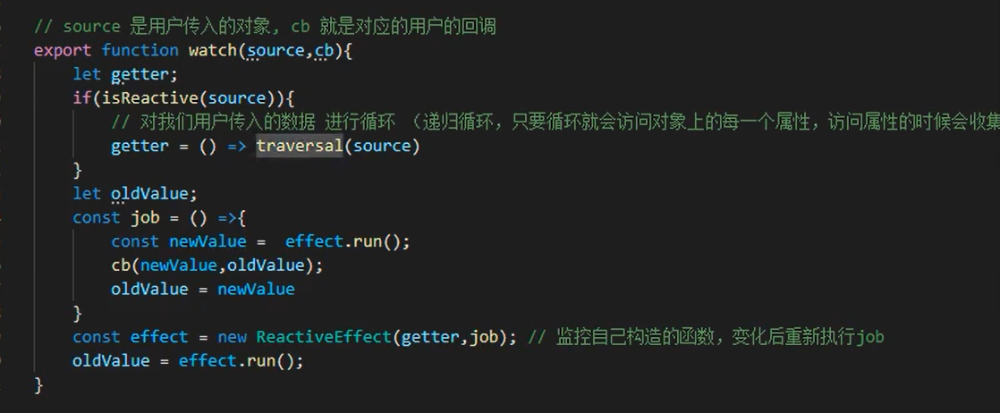

比如我们 watch 一个 object，它会去 new ReactiveEffect 就像我们 vue2 里的 new Watcher 然后会将 activeEffect = this，然后主动去读取传进来的数据，因为数据是一个响应式数据，它会触发依赖收集，所以当它修改的时候就会调用 effect.run 因为用户的回调是这个 effect 的schedular 所以会先被调用

### React diff 和 vue diff 的区别

vue 是双端比对，react 是单边按序比对

react 有 fliber，vue 没有，不过vue也不需要

vue3 开始实现了最长递增子序列减少了dom移动操作

### koa 和 exprexs 区别

我感觉两个本质其实差不多，不过 koa 更加轻量级吧，express 内置了很多中间件，功能更加完善，那 koa 的话基本不内置什么中间件，把控制权和复杂度更多的交给开发者。

### ts

#### 函数重载

其实和 java 的函数重载的概念差不多，就是一个函数可以表现出类似的功能，就是形式参数的类型或个数不同。本质编译看上面

#### 泛型

对于泛型，我觉得可以从它的使用场景上来理解它，我们常见的一个使用场景就是我们想要一个函数的参数类型和它的返回值有所关联，我们就可以使用泛型，还有一个场景是我们想要让用户能自定义自己想要的参数类型，比如说泛型接口，泛型类嘛，像Array接口的pop方法，返回 T | undefined，当我们限定它为 number 它就返回 numbrer | undefined

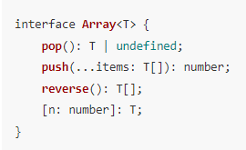

### css

#### css 盒子模型

搜盒子模型，看上面

#### 说说常见的布局方式

像最常见的就有浮动布局和定位布局，还有flex布局，弹性盒子模型嘛，还有多列布局，就是瀑布流嘛，还有号称最强大的grid布局。

- 看自己的博客

##### grid 布局

将容器分为一个个格子，最经典就是利用 fr 实现空间等分，又可以控制行，又可以控制列

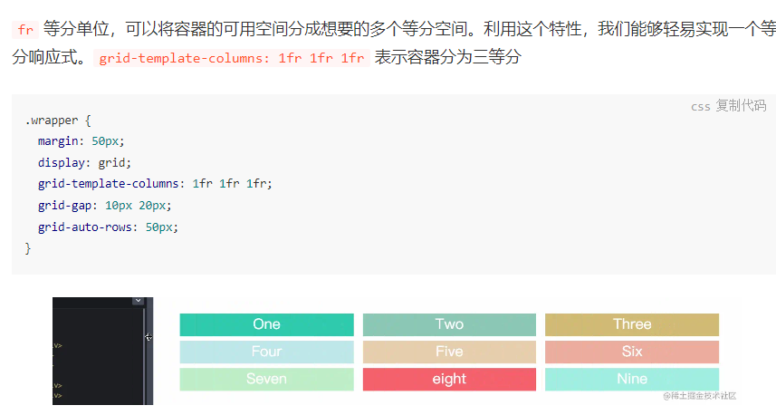

#### BFC

BFC 它可以包含内部浮动，排除外部浮动，阻止外边距重叠(同一个 bfc 下的两个 div margin 会重叠)。

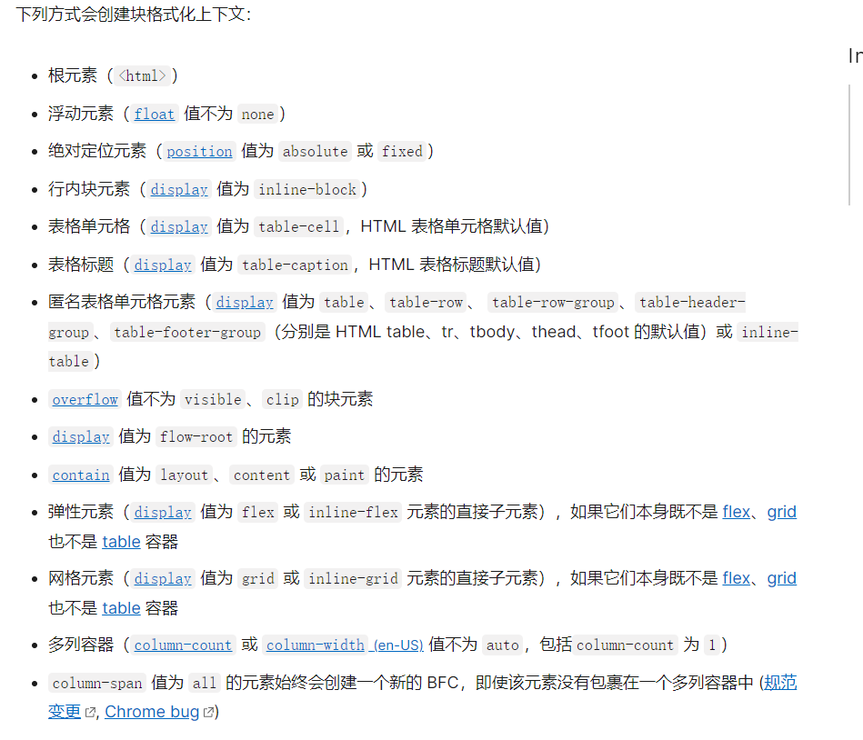

看上面

### js

#### 闭包

是什么？闭包是一个内部函数与它引用外部函数的周围环境的组合；简单的理解就是一个内部函数引用了外部函数的变量嘛，所以可以说函数的创建就伴随着闭包的创建。

有什么用？利用闭包的特性我们可以去创建一个唯一的变量，并提供的它的访问入口；比如说防抖、节流、单例模式应用。

#### es7

```js
// 数组
const arr = [1, 2, 3]
// 为数组中的每个条目返回一个可迭代的键、值对
const iterator = arr.entries()

let next = {
    done: false
}

while(!next.done) {
    next = iterator.next()
    console.log(next); 
}

// arr.includes 
// for of 遍历值
// for in 遍历key，对象会遍历到原型的属性

// async await

// 将字符串填充到长度为6
console.log('abcd'.padStart(6, '0'))
console.log('abcd'.padEnd(6, '0'))
// 00abcd
// abcd00
```

#### es6

搜说出ES6中的新特性新变化

#### promise 和 async await 的区别

**`Promise`** 也是一种异步的解决方案嘛，避免了这种回调地狱，取而代之的是链式调用

`async`和`await`让我们可以用一种更简洁的方式写出基于promise的异步行为，而无需刻意地链式调用`promise`。

#### 继承

**寄生组合式继承**，借助解决普通对象的继承问题的`Object.create` 方法，在前面几种继承方式的优缺点基础上进行改造，这也是所有继承方式里面相对最优的继承方式

```js
function clone (parent, child) {
    // 这里改用 Object.create 就可以减少组合继承中多进行一次构造的过程
    child.prototype = Object.create(parent.prototype); // 以传进来的对象为原型创建一个空对象
    child.prototype.constructor = child;
}

function Parent6() {
    this.name = 'parent6';
    this.play = [1, 2, 3];
}
Parent6.prototype.getName = function () {
    return this.name;
}
function Child6() {
    Parent6.call(this);
    this.friends = 'child5';
}

clone(Parent6, Child6);

Child6.prototype.getFriends = function () {
    return this.friends;
}

let person6 = new Child6();
console.log(person6); //{friends:"child5",name:"child5",play:[1,2,3],__proto__:Parent6}
console.log(person6.getName()); // parent6
console.log(person6.getFriends()); // child5
```

```js
// 寄生组合继承语法糖
class Person {
  constructor(name) {
    this.name = name
  }
  // 原型方法
  // 即 Person.prototype.getName = function() { }
  // 下面可以简写为 getName() {...}
  getName = function () {
    console.log('Person:', this.name)
  }
}
class Gamer extends Person {
  constructor(name, age) {
    // 子类中存在构造函数，则需要在使用“this”之前首先调用 super()。
    super(name)
    this.age = age
  }
}
const asuna = new Gamer('Asuna', 20)
asuna.getName() // 成功访问到父类的方法
```

#### js 为什么是单线程的

其实这与它的用途有关。作为浏览器脚本语言，JavaScript 的主要用途是与用户互动，以及操作 DOM。若以多线程的方式操作这些 DOM，则可能出现操作的冲突。假设有两个线程同时操作一个 DOM 元素，线程 1 要求浏览器删除 DOM，而线程 2 却要求修改 DOM 样式，这时浏览器就无法决定采用哪个线程的操作。当然，我们可以为浏览器引入“锁”的机制来解决这些冲突，但这会大大提高复杂性，所以 JavaScript 从诞生开始就选择了单线程执行。

我觉得也和作者的设计理念有关，毕竟设计之初仅仅是想让它完成一些非常简单的操作，单线程也降低了它使用的复杂度


### 浏览器缓存机制

一般就分为强缓存和协商缓存，强缓存会直接从缓存数据库中读，不用请求浏览器（要刷新就可以生成新的hash，即资源路径和之前不一样了）

细节搜“浏览器缓存”（在“说下原型链”的下面）

## 面试复盘

### 大图片加载

### cookie sameSite

#### strict

Strict最为严格，完全禁止第三方 Cookie，跨站点时，任何情况下都不会发送 Cookie。换言之，**只有当前网页的 URL 与请求目标一致，才会带上 Cookie。**

```
Set-Cookie: CookieName=CookieValue; SameSite=Strict;
```

这个规则过于严格，可能造成非常不好的用户体验。比如，当前网页有一个 GitHub 链接，用户点击跳转就不会带有 GitHub 的 Cookie，跳转过去总是未登陆状态。

##### lax

Lax规则稍稍放宽，大多数情况也是不发送第三方 Cookie，但是导航到目标网址的 Get 请求除外（get 请求一般用于查看，影响不会特别大）。

##### none

Chrome 计划将Lax变为默认设置。这时，网站可以选择显式关闭SameSite属性，将其设为None。不过，**前提是必须同时设置Secure属性**（Cookie 只能通过 HTTPS 协议发送），否则无效。

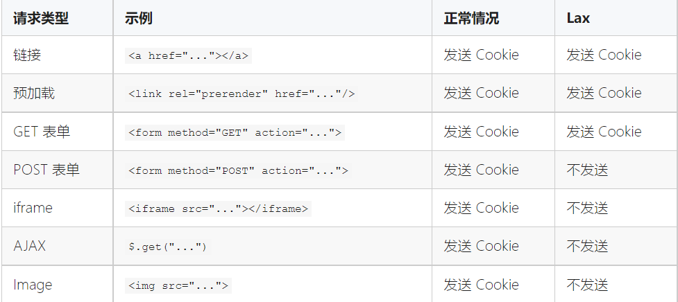

### token 放 cookie 和 storage 的区别

- storage 没有跨域限制，容易被 xss 攻击
- cookie有跨域限制(可以用 withCredients，和配置 allow-origin 不要是 *，就可以跨域了)，有安全字段可以防范，security，httponly，samesite
- 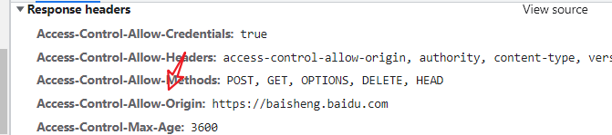

## 综合面准备

### 自我介绍

- 面试官你好，我叫陈源鑫，来自仲恺农业工程学院。我从大一暑假开始学习前端并加入我们学校的实验室跟着导师做项目，在实验室期间做得比较多的是 web 项目，然后我也完整的负责过其中的一个项目，带领过一个七八人的前端团队
- 到了大三上学期，我去到了广州汇量科技实习，在汇量科技做的主要是负责一个脚手架的开发，您可以理解成效率工具，在汇量科技的小组是一个游戏小组，然后也了解到前端另一个比较成熟的领域，就是webgl游戏，您可以理解成就是我们在 4399 上面看到的那些小游戏。
- 然后到了大三下学期，也就是这学期我去到了上海百度实习，在百度实习期间主要是负责一个舆情系统的开发，然后在四月份的时候开始负责这个系统新版本的开发，然后引入了现在前端比较前沿的技术，微前端，然后这一块也是由我去做技术调研还有落地，也在6月份的时候顺利上线。
- 这就是我的一个校园经历，您有什么问题想问我的吗？

### 如果 cvte 和奇安信

我会选择cvte，一个原因是有熟系的人在里面，一个是在广州，然后还有就是和面试官们的交流上面体验都非常好，然后还有就是一场面试流程走下来其实需要耗费非常多的精力，像我这段时间其实过得比较紧张，都是在不断地去复盘基础，准备面试，也不能去接触一些新的技术。

### 对 cvte 的了解

我刚开始知道 cvte 是通过师兄了解的，也就是我的内推人，他是去年通过校招进入cvte，我和他关系比较好，然后他那会秋招的时候就会跟我分享他秋招的一些心得啊和经历，然后也是通过他了解到了cvte这家公司。然后后面他提前实习嘛，也从他了解到cvte不管是环境也好还是氛围都非常不错。然后我也就开始关注起cvte 的一些招聘动态还有相关的宣传视频。

也了解到cvte成立之初是专注于液晶电视主控板的研发与营销（全球每三台电视机中就有一台的驱动显示方案来自 CVTE），还有专注于自主教育的品牌希沃，就是教育信息化应用工具及服务的提供商，还有企业服务品牌 maxhub（智慧协作平台）（已为超过20万家企业提供产品和服务），以及服务型机器人的新业务。

产业园：广州、苏州、合肥、西安

有哪些好的点？

还有就是技术水平也非常不错，我从上一轮面试与面试官的交流中也得知cvte会有这种技术的交流和review，我觉得这是帮助大家成长一个很好点，还有就是我上一轮面试完之后，我通过邮件也和面试官讨论了一个技术问题，他也非常耐心的解答我，也给了我一些学习的建议，就是给我的感觉就是整体的技术氛围非常不错。

然后在员工待遇上也非常吸引我，特别是有小孩子的幼儿园，这给我的一个感觉就是cvte确实是一家比较贴心企业，这也是非常吸引我的一个点。（虽然我没有小孩，但是我觉得说其实员工的个人问题其实是比较好解决了，而家庭问题是比较难解决的，那 cvte 不仅帮助员工解决私人问题，也帮助部分解决家庭问题，让员工能更专注于工作，我觉得这是很难得的，是很多企业所不具备的）这是我对cvte的一个大概了解吧，也希望自己能有机会去更深入的了解cvte

### 对前面的面试打分

我给自己打7分，1分是扣自己还不够自信，面试过程中有一些紧张，2分是扣在自己在回答面试官一些技术问题的时候呢没有很好的完全表达出来一些自己的见解，考虑问题的时候还不够全面。然后6分就是及格线嘛，1分是加在自己有比较认真的、充足的去准备这个面试，因为我非常珍惜在我面前的这个机会。

### 做的最成功的一件事

我觉得就是我从大一开始一直坚持学习前端到现在，可能不像其他人那样有那么丰富多彩的校园生活，但是我通过自己的努力，不断弥补自己的不足，在竞争这么强烈的大环境下，仍然能有一定的竞争力，甚至能获得像cvte这样的大企业提前批的一个面试机会，这对于我们学校来说是比较难的，但是我不去抱怨这件事情，不断地去提升自己，所以我觉得这是目前的我来说做得做成功的一件事情。

### 特别困难的时候

我觉得应该是我在汇量科技实习的时候，那时候一方面是我面临着期末考试，然后那学期课非常多，好像接近6、7门吧，然后一边是实习工作也不轻松，然后我连续加班了一个多月，其实不是因为工作需要天天加班，而是我解决完工作后就继续去复习我的期末考试，还有周末也是接连不断的学习。然后我报销那个打车费嘛，连续一个多月的报销，以至于我们bp感到很惊讶来问我领导说你们实习生怎么加班这么严重的，以为我领导在压榨我，但其实不是我领导对我还是很好的。现在说这件事情的时候是笑着说出来的，但是过去那个时候确实是非常辛苦，但是这一切都是值得的，因为这段实习经历让我获得了去百度的实习机会，因为百度的实习，让我获得了cvte的面试机会，所以我非常珍惜在我面前的机会，也非常的重视这个面试。

### 家里的情况

我觉得我们家里是非常穷到慢慢变好的一个家庭，我爸是汽修工人，我有两个哥哥初中就辍学也跟着我爸做汽修，我姐是中专在打工，我是家里唯一一个上本科的，我是比较幸运的，在我的成长过程中我获得了比较好的教育资源，因为几个人就供我一个人读书，可以说我成长的时候是没有遇到什么经济困难的，但我的哥哥姐姐们就不一样了。所以这也是我成长的动力吧，我不仅希望让我自己的生活变得更好，我也希望能帮助我的家人的生活变得更好。

### 对未来的规划

首先在我个人的成长方面，我希望自己精于前端但是不止于前端，朝着团队的技术大牛去前进，努力做到技术管理层。然后在家庭方面呢，我想努力工作，帮家里人解决房贷问题，然后自己努力在广州安居立业。然后在个人生活方面，我想要去精于一件除了工作之外的事情，那首先就是锻炼身体，保持自己身体的健康很重要，然后我了解到 cvte 有健身房嘛，有游泳池这也很吸引我。

### 薪资

您方便讲一下这个岗位的薪资范畴还有薪资结构吗？

我希望自己能拿到14k、15k左右；为什么？我觉得自己是能达到平均标准的，我觉得我和大部分应届生不同的是，我其实从大一暑假就开始就一直处于项目开发状态，我做过多个完整的项目，在实验室，百度实习期间都负责过一个完整的项目，所以我非常有信心能快速的融入团队给公司带来帮助。

好的明白，这也仅是我个人的一个期望薪资

然后我觉得应届生也不应是唯钱而论的，也从面试官哪里了解到加入 cvte 能带给我的提升也是我比较看重的技能点，然后比起薪资，我更看重的是这个学习机会。

### 为什么不考研

一个是觉得技术岗相比其他岗位来说学历的影响不会特别大，另一个方面也是家庭原因吧，我是希望自己能尽快独立，帮助家里减轻一些负担，我两个哥哥都成家立业了，过去是他们几个人一起供我读书，现在他们都有自己的小孩了，我不希望给他们增加负担。

### 对加班的看法

我个人是能接受加班的，因为其实我觉得研发岗加班是很难避免的，特别是项目要上线的时候或者说出一些bug的时候。然后也受我家庭的影响，我觉得有双休本身就已经是很好了，因为我的家人是工人，基本都是日复一日的工作，所以对待这件事情，我是比较容易满足的。然后不管我是在实验室也好在实习也好，其实很多时候连周末都排得很满，因为我不仅要应对工作，课内学习，也需要在技术上有多提升也需要学习，所以我觉得我是挺能抗压的吧。当然我并不是说提倡加班，但是我是能接受加班的，然后有时候其实是我自己陷进去了，因为其实个人是比较喜欢这个岗位的，有成就感其实就很有动力。

### 性格优点缺点

我觉得缺点就是还不够自信的

优点的话就是觉得自己算是比较努力的，挺能坚持的

### 压力大的时候怎么办

运动，听歌，和朋友出去散散心，或者看一部电影

### 家里人支持吗

支持，肯定支持，我现在在面试我家里人也都是知道的

### 目前为止最让你感到挫折的一件事

用上面特别困难的时候回答

### 你和同学相比你觉得谁比较强？

我觉得各有各的优势吧，泽润是比较全面的，因为他是从后端转前端的，然后我是比他更早的加入实验室，更早的学习前端，我觉得在对前端的理解上面我不会输给他。

### 预期的工作时间

工作时间应该不是我能预期的吧，基本都是看当时分配的需求的一个完成情况，如果按照我在汇量还有百度实习的话基本都是12个小时，早10晚10。

# Webpack

## 热模块替换原理

对于热模块替换我觉得要思考两个问题，一个是如何监听文件的变化以及如何让通知页面更新

- 其实大部分自动更新的一个思想都差不多，主要就是监听修改时间，如果文件的修改时间变化，判断一下它的 hash 有没有变化，如果 hash 变化就可以去通知浏览器更新，更新一般就是 reload 或者节点操作删除旧的link 或者script去增加新的，那是 reload 还是节点操作，主要就看我们有没有给这个文件注册钩子，就是通过 hot.acppect（style-loader一般会为样式文件注册一个）。  
- 那对于浏览器的更新实际上就可以通过 websocket 协议，打包过程中会往页面注入监听 websocket 服务器的代码，那么就可以根据服务端传来的数据，去做对应的变化。

```js
// vscode liveserver 	
if ('WebSocket' in window) {
		(function () {
			function refreshCSS() {
				var sheets = [].slice.call(document.getElementsByTagName("link"));
				var head = document.getElementsByTagName("head")[0];
				for (var i = 0; i < sheets.length; ++i) {
					var elem = sheets[i];
					var parent = elem.parentElement || head;
					parent.removeChild(elem);
					var rel = elem.rel;
					if (elem.href && typeof rel != "string" || rel.length == 0 || rel.toLowerCase() == "stylesheet") {
						var url = elem.href.replace(/(&|\?)_cacheOverride=\d+/, '');
						elem.href = url + (url.indexOf('?') >= 0 ? '&' : '?') + '_cacheOverride=' + (new Date().valueOf());
					}
					parent.appendChild(elem);
				}
			}
			var protocol = window.location.protocol === 'http:' ? 'ws://' : 'wss://';
			var address = protocol + window.location.host + window.location.pathname + '/ws';
			var socket = new WebSocket(address);
			socket.onmessage = function (msg) {
				if (msg.data == 'reload') window.location.reload();
				else if (msg.data == 'refreshcss') refreshCSS();
			};
			if (sessionStorage && !sessionStorage.getItem('IsThisFirstTime_Log_From_LiveServer')) {
				console.log('Live reload enabled.');
				sessionStorage.setItem('IsThisFirstTime_Log_From_LiveServer', true);
			}
		})();
	}
	else {
		console.error('Upgrade your browser. This Browser is NOT supported WebSocket for Live-Reloading.');
	}
```

## proxy 原理

利用服务器与服务器间无同源策略限制，浏览器将请求发送给代理服务器，代理服务器转发请求，代理服务器将结果返回给浏览器（代理服务器与浏览器同源，所以没有同源限制）

```js
const express = require('express');
const {
    createProxyMiddleware
} = require('http-proxy-middleware');

const app = express();

function onProxyReq(proxyReq, req, res) {
    // console.log(proxyReq);
    // console.log(req.headers);
}

function onProxyRes(proxyRes, req, res) {
    res.writeHead(200, {
        'Content-Type': 'text/plain',
    });
    res.end('Something went wrong. And we are reporting a custom error message.');
}
app.use('/api', createProxyMiddleware({
    target: 'http://www.baidu.com',
    changeOrigin: true,
    onProxyReq,
    onProxyRes
}));
app.listen(5500);
```


# JS

## async/await 原理

```js
const p1 = () => { return new Promise((res) => {
    setTimeout(() => {
        console.log('p1');
        res(2);
    }, 1000);
})};

function* p () {
    // 第一次 next() 后的 value 就是 yield 后面的值，下次 
    const p2 = yield p1().then(() => { console.log(1234); return 123;});
    console.log(p2)
}

function asyncFunc(generator) {
    const gen = generator();
    function next(data) {
        const { value, done } = gen.next(data); // data 是 yield 的返回值
        if (done) {
            return value;
        } else if (!(value instanceof Promise)) {
            next(value);
        } else {
            // 本质：p1().then(() => { console.log(1234); return 123;}).then((data) => { next(data) })
            value.then((data) => {
                next(data)
            });
        }
    }
    next();
}
asyncFunc(p);
```

# uniapp 的原理

在小程序方面主要通过条件编译吧，将vue语法转换成兼容小程序的语法

- 在 app 的话主要是通过 webview 和 native 相结合的方式（类似于hybrid）

#### **webvie介绍**

- Webview 是一个基于webkit的引擎，可以解析DOM 元素，展示html页面的控件，它和浏览器展示页面的原理是相同的，所以可以把它当做浏览器看待。
- 个人理解，电脑上展示html页面，通过浏览器打开页面即可浏览，而手机系统层面，如果没有webview支持，是无法展示html页面，所以webview的作用即用于手机系统来展示html界面的

#### **缺点**

- 在性能方面肯定不如 native

- 为了模拟`native app`的`UI`和感官，需要投入额外的时间和精力；尽管可以跨平台，但是并不能完全支持所有的设备和操作系统；最后，如果应用的体验不够原生化，如一个简单的网站，则还有被`Apple App Store`拒绝的风险。
- 由于其使用`HTML5`，某些依赖于复杂的原生功能或者繁重的过渡动画的应用会出现卡顿

#### 如何选择 hybrid、web、natvie app

- 如果追求性能就用 natvie（高性能，利用的是机器的静态资源）
- 如果追求低成本就用 web（低性能，在浏览器上运行，利用的是网络资源）
- 如果对图形追求没有那么高，追求性价比用 hybrid（高性能，利用的是机器的静态资源，不过有个 webview 嵌套）

# 小程序

#### 说下对小程序的理解

感觉小程序和普通页面开发差不多，html 稍微修改变成了 wxml，用到的 css 和 js 都是一样的，只不过有 js-sdk 让我们可以调用微信小程序为我们提供的一些接口，感觉有点类似于 hybrid

#### 说下微信小程序的登录流程

- 调用 wx.login() 获取 临时登录凭证code (可以判断用户是否授权读取用户信息，调用 wx.getUserInfo 读取用户数据)，并回传到开发者[服务器](https://cloud.tencent.com/product/cvm?from=10680)。（由于小程序后台授权域名无法授权微信的域名，所以需要自身后端调用微信服务器获取用户信息）
- 调用 auth.code2Session 接口，换取用户唯一标识 OpenID 和会话密钥 session_key。自定义登录状态关联openid和session_key，返回自定义登录状态
- 前端缓存自定义状态到storage，wx.request()携带自定义登录状态请求数据
- 开发者服务器通过自定义登录状态查询openid和session_key，验证通过返回业务数据

# 奇安信

## 一面准备

### 操作系统

#### 进程线程的区别

- **概念：**我觉得书里的总结就非常好了，进程是操作系统资源分配的基本单位（如I/O，内存地址空间分配），而线程是资源调度的基本单位，他们是一种包含关系。
- **在开销方面**：每个进程都有独立的代码和数据空间（程序上下文），程序之间的切换会有较大的开销；线程可以看做轻量级的进程，同一类线程共享代码和数据空间，每个线程都有自己独立的运行栈和程序计数器（PC），线程之间切换的开销小
- **内存分配方面**：系统在运行的时候会为每个进程分配不同的内存空间；而对线程而言，除了CPU外，系统不会为线程分配内存（线程所使用的资源来自其所属进程的资源），线程组之间只能共享资源
- **所处环境**：在操作系统中能同时运行多个进程（程序）；而在同一个进程（程序）中有多个线程同时执行（通过CPU调度，在每个时间片中只有一个线程执行）
- **包含关系**：没有线程的进程可以看做是单线程的，如果一个进程内有多个线程，则执行过程不是一条线的，而是多条线（线程）共同完成的；线程是进程的一部分，所以线程也被称为轻权进程或者轻量级进程
- 线程的引入增加了进程的这种并发度，举个实际的例子，比如说我们的微信，我们可以同时去做视频聊天，文字聊天，还有文件传送，那这显然这几件事情不是顺序执行的。
- 进程占用cpu的一个核，进程是程序的一次执行。

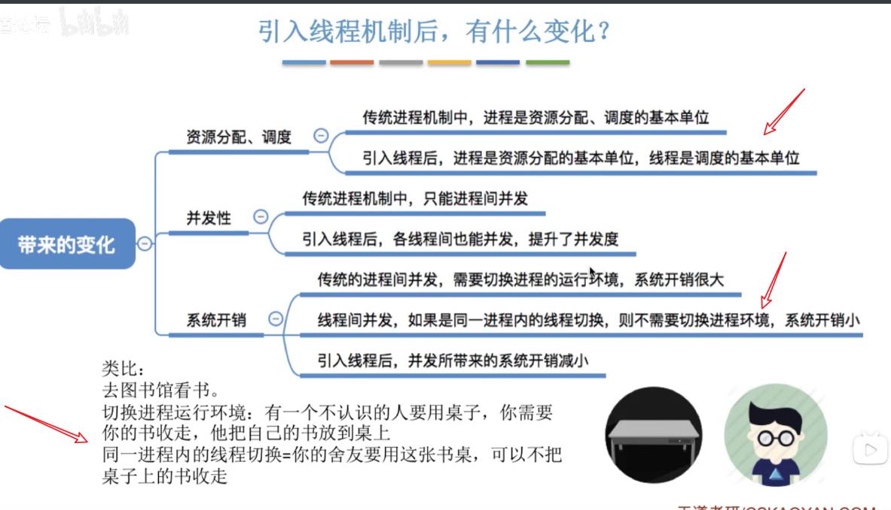

### js

#### set 和 map 的区别

首先他们的不同点是 map 的话是 key，value 这样的一种存储形式，而对于 set 的话它只有 key

共同点的话就是他们的 key 都是不能相同的，唯一的。

那 map 的话我们经常用来组织一些有映射关系的数据，那对于 set 的话就可以用来去重

```js
const map = new Map()

map.set('a', 123)
map.set('a', 456) 
// 这样做 123 会被覆盖掉
```

### echarts 的理解

我其实没有看过它的源码，但是有在开发的时候看到它编译的本质其实是对canvas的使用，比如我们画一个柱状图，其实就是在画布上画两条线，然后画几个矩形，填充一下颜色。

# 诺瓦星云

## 自我介绍

- 面试官您好，我叫陈源鑫，来自仲恺农业工程学院。我从大一暑假开始加入我们学校的实验室去跟着导师做项目，也是从那时开始学习前端，在实验室期间做得比较多的是 web 项目，然后我也完整的负责过其中的一个项目，带领过一个 7、8人的前端小团队。
- 到了大三上学期，我去到了广州汇量科技实习，在汇量科技做的主要是负责一个脚手架的开发，用于快速生成一个项目结构的，算是一个内部的效率工具。
- 然后到了大三下学期，也就是这学期我去到了上海百度实习，在百度实习期间主要是维护一个舆情系统，然后在四月份的时候开始这个项目推出新版，我开始负责这个新版的开发，然后考虑到旧的系统已经兼容了两个版本的代码，可以说是一个巨石应用，我觉得不应该再往上去叠加一个新的版本，应该把这个版本割裂出来，很显然微前端非常符合我们的应用场景，然后我们就开始去调研一个解决方案，后面了解到一个叫 micoapp 的微前端框架，然后它整体的一个设计思想非常符合我们的预期，一个标签对应一个应用，低耦合，不需要对旧系统做多少配置，也有像京东，b站等团队在使用，然后我们经过一些简单的尝试，做了一些 demo 之后就决定开始采用这个框架。
  - 因为是新技术很难不踩一些坑
  - 我们在使用 ui 的时候发现，如果我们使用涉及到全局节点的组件它的样式会无法生效。然后你在网上搜，其实搜不到多少资料，因为不像 vue 那样，它的使用用户还是比较少的，那就只能自己去看文档，还有源码去看它的样式隔离的一个实现。然后发现它的样式隔离其实是通过改写 css rules 为每一个样式添加一个前缀将样式限制于它应用的标签下，全局的节点因为和应用是平级的所以样式就没有生效。
  - 然后我们考虑了两种解决方案...
  - 后续为了能应对可能会产生的新问题，我也对这个整个框架的一些比较核心的功能做了解析，还有 vue3 也是
  - 这就是我的一个个人经历，您有什么想问我的嘛？
- 为了将这个新版本接入旧系统采用了微前端技术，然后项目的整体搭建也是采用了 vue3 + ts 的组合。
- 这就是我的一个校园经历，您有什么问题想问我的吗？

## 个人简历

### webpack 构建流程和性能优化

搜`webpack构建流程`

性能优化看掘金草稿箱

## 一面

### css 有哪些选择器

挺多的吧，像常见的就有像元素选择器，id选择器，class选择器，后代选择器，群组选择器等等

### js 有哪些数据类型

有 7 种基本类型：[string](https://developer.mozilla.org/zh-CN/docs/Glossary/String)，[number](https://developer.mozilla.org/zh-CN/docs/Glossary/Number)，[bigint](https://developer.mozilla.org/zh-CN/docs/Glossary/BigInt)，[boolean](https://developer.mozilla.org/zh-CN/docs/Glossary/Boolean)，[null](https://developer.mozilla.org/zh-CN/docs/Glossary/Null)，[undefined](https://developer.mozilla.org/zh-CN/docs/Glossary/undefined)，[symbol]

引用类型统称为object 类型，细分的话有：**Object 类型、Array 类型、Date 类型、RegExp 类型、Function 类型等**。

- 在JavaScript中的基本数据类Number是双精度浮点数，它可以表示的最大安全范围是正负9007199254740991，也就是2的53次方减一， 比253大的所有数字则可以使用`BigInt`表达。
- `BigInt`是JavaScript中的一个新的原始类型，可以用任意精度表示整数。使用`BigInt`，即使超出JavaScript `Number` 的安全整数限制，也可以安全地存储和操作大整数。
- 可以这样定义一个 `BigInt` 变量：在一个整数字面量后面加 `n`，如：`10n`，或者调用函数`BigInt()`。
- 不能和 [`Math`](https://developer.mozilla.org/zh-CN/docs/Web/JavaScript/Reference/Global_Objects/Math) 对象中的方法一起使用；不能和任何 [`Number`](https://developer.mozilla.org/zh-CN/docs/Web/JavaScript/Reference/Global_Objects/Number) 实例混合运算。

### 面向对象设计原则

我只记得它有一个单一职责原则，这也是我在写代码的时候一直遵守的一个原则，因为前端的逻辑代码基本都拆分成一个个的方法，如果给一个方法分配了多个职责就会造成它的代码逻辑混乱或者是代码冗余，这样是不利于后者来维护的。

### http 报文由什么组成

HTTP报文大致可分为报文首部和报文主体两块。两者由最初出现的空行（CR+LF）来划分。通常，并不一定要有报文主体。

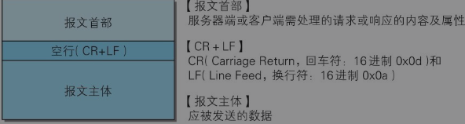

请求报文

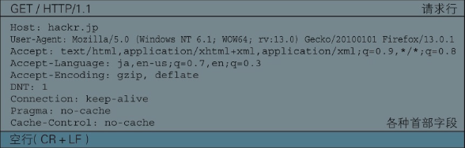

user-agent：客户端信息，爬虫伪造

accept：告知（服务器）客户端可以处理的内容类型；

accept-language：可以处理的语言

accept-encoding：可以处理的编码格式

cache-control：缓存控制

响应报文

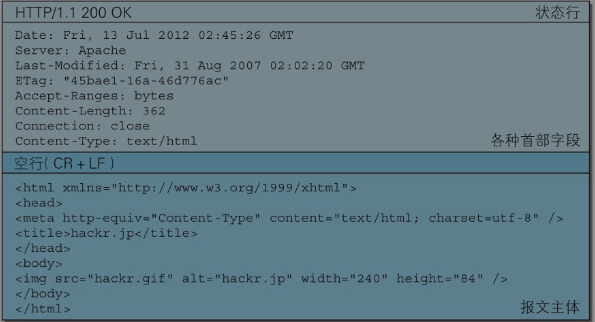

### 对时间复杂度和空间复杂度的理解

表示一个算法执行过程中执行次数和临时占用空间的正比例关系。

比如我们一个 for 循环，它执行次数是随 n 的变化而变化它就是O(n), 如果它在执行过程中开辟的一个 n 长度的数组，那它的空间复杂度就是 O(n)

### vue 生命周期

### react hooks

#### useMemo & useCallback

##### useMemo

```js
function mountMemo(nextCreate, deps) {
    var hook = mountWorkInProgressHook();
    var nextDeps = deps === undefined ? null : deps; // 记录依赖
    var nextValue = nextCreate(); // 记录新值
    hook.memoizedState = [nextValue, nextDeps];
    return nextValue;
  }
```

```js
 function updateMemo(nextCreate, deps) {
    var hook = updateWorkInProgressHook();
    var nextDeps = deps === undefined ? null : deps;
    var prevState = hook.memoizedState;

    if (prevState !== null) {
      // Assume these are defined. If they're not, areHookInputsEqual will warn.
      if (nextDeps !== null) {
        var prevDeps = prevState[1];

        if (areHookInputsEqual(nextDeps, prevDeps)) { // 依赖没变
          return prevState[0];
        }
      }
    }

    // 依赖变化
    var nextValue = nextCreate();
    hook.memoizedState = [nextValue, nextDeps];
    return nextValue;
  }
```

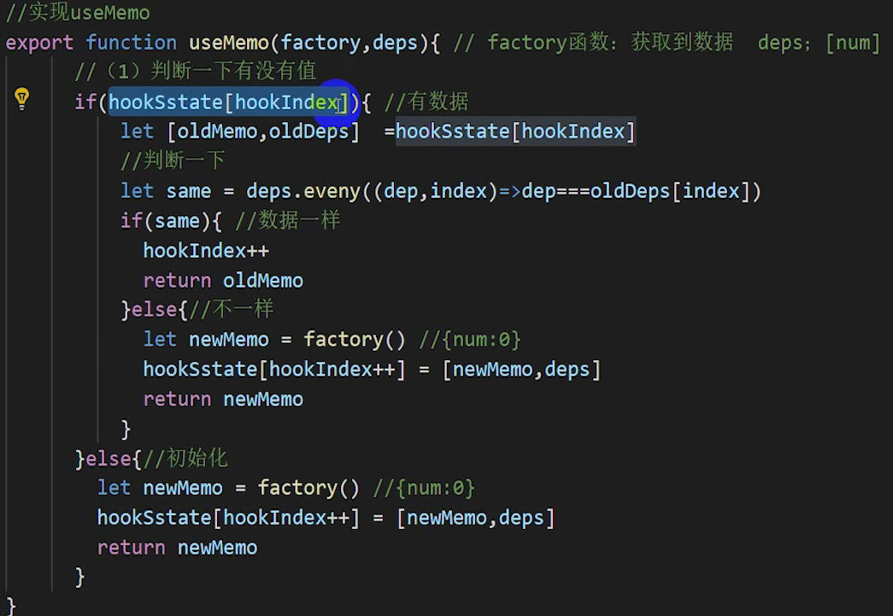

##### useCallback

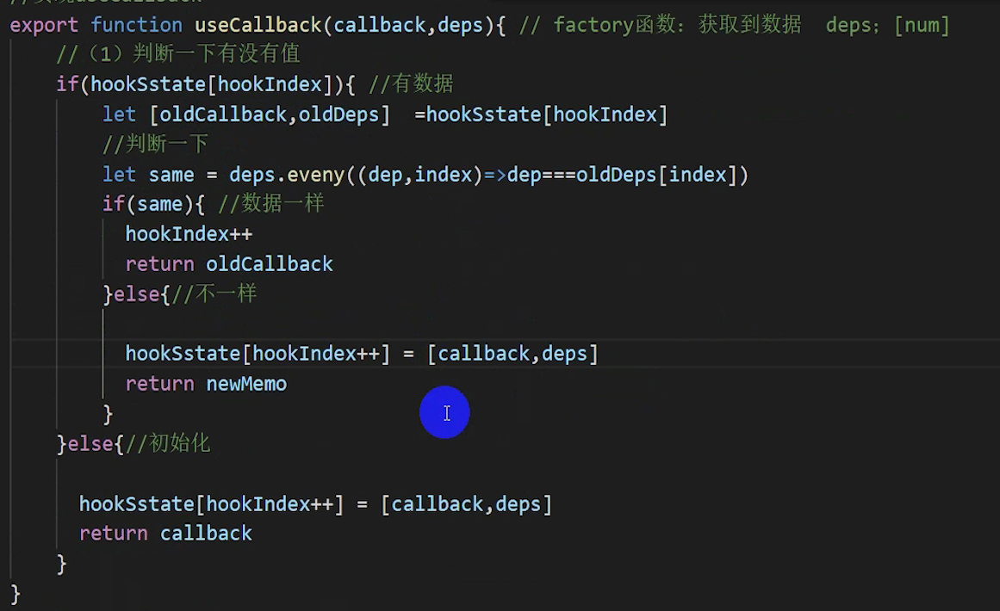

```js
function mountCallback(callback, deps) {
    var hook = mountWorkInProgressHook();
    var nextDeps = deps === undefined ? null : deps;
    hook.memoizedState = [callback, nextDeps];
    return callback;
  }
```

```js
function updateCallback(callback, deps) {
    var hook = updateWorkInProgressHook();
    var nextDeps = deps === undefined ? null : deps;
    var prevState = hook.memoizedState;

    if (prevState !== null) {
      if (nextDeps !== null) {
        var prevDeps = prevState[1];

        if (areHookInputsEqual(nextDeps, prevDeps)) {
          return prevState[0];
        }
      }
    }

    hook.memoizedState = [callback, nextDeps];
    return callback;
  }
```

##### 总结

不管是 useMemo 还是 useCallback 也好都要配合 React.memo，一个组件升级为 memo 组件的时候，每次更新的过程中属性会进行浅比较，如果一致便不再进行更新，但是这种比对并不适用于引用类型，我们知道引用类型的比对是指针的比对，如果指针不一致，内容一致也会被视为不同的对象，useMemo 和 useCallback 会根据依赖值是否变化来判断是否要返回新的对象，如果对象中有值变化就返回新的对象，反之则返回旧的对象。

### 高阶组件

我觉得说得简单点就是可以接收一个或多个组件作为参数并且返回一个组件。这种模式让多个组件可以共用一块逻辑,或者说让他们的属性或状态经过一样的处理逻辑。


如果向一个高阶组件添加`refe`引用，那么`ref` 指向的是最外层容器组件实例的，而不是被包裹的组件，如果需要传递`refs`的话，则使用`React.forwardRef`，如下：

```js
function withLogging(WrappedComponent) {
    class Enhance extends WrappedComponent {
        componentWillReceiveProps() {
            console.log('Current props', this.props);
            console.log('Next props', nextProps);
        }
        render() {
            const {forwardedRef, ...rest} = this.props;
            // 把 forwardedRef 赋值给 ref
            return <WrappedComponent {...rest} ref={forwardedRef} />;
        }
    };

    // React.forwardRef 方法会传入 props 和 ref 两个参数给其回调函数
    // 所以这边的 ref 是由 React.forwardRef 提供的
    function forwardRef(props, ref) {
        return <Enhance {...props} forwardRef={ref} />
    }

    return React.forwardRef(forwardRef);
}
const EnhancedComponent = withLogging(SomeComponent);
```

### react避免重复渲染的方法

##### shouldComponentUpdate

通过`shouldComponentUpdate`生命周期函数来比对 `state`和 `props`，确定是否要重新渲染

默认情况下返回`true`表示重新渲染，如果不希望组件重新渲染，返回 `false` 即可

```js
export default class List extends Component {
    // 在shuoldComponentUpdate里判断props传递的数据没有发生变化，则不需要render
    shouldComponentUpdate(nextProps) {
        // 返回值为true则render，为false则不render
        if(nextProps.list.title === this.props.list.title) {
            return false
        }
        return true
    }
    render() {
        console.log('list render')
        return(
            <div>{this.props.list.title}</div>
        )
    }
}
```

#### PureComponent

PureComponent实际上自动加载shouldComponentUpdate函数，当组件更新时，shouldComponentUpdate对props和state进行了一层浅比较.

```js
import React, { PureComponent } from 'react'
export default class List extends PureComponent {
    render() {
        console.log('list render')
        return(
            <div>{this.props.list.title}</div>
        )
    }
}
```

#### React.memo

### 浏览器有哪些进程、线程

进程：搜 `chrome 浏览器多进程架构`

线程：

- GUI渲染线程：**GUI渲染线程与JS引擎线程是互斥的**，当JS引擎执行时GUI线程会被挂起（相当于被冻结了），GUI更新会被保存在一个队列中**等到JS引擎空闲时**立即被执行。
- JS引擎线程：**GUI渲染线程与JS引擎线程是互斥的**，所以如果JS执行的时间过长，这样就会造成页面的渲染不连贯，导致页面渲染加载阻塞。
- 事件触发线程：归属于浏览器而不是JS引擎，用来控制事件循环（可以理解，JS引擎自己都忙不过来，需要浏览器另开线程协助）
- 定时触发器线程：
  - 浏览器定时计数器并不是由JavaScript引擎计数的,（因为JavaScript引擎是单线程的, 如果处于阻塞线程状态就会影响记计时的准确）
  - 因此通过单独线程来计时并触发定时（计时完毕后，添加到事件队列中，等待JS引擎空闲后执行）
  - 注意，W3C在HTML标准中规定，规定要求setTimeout中低于4ms的时间间隔算为4ms。
- 异步http请求线程：
  - 在XMLHttpRequest在连接后是通过浏览器新开一个线程请求
  - 将检测到状态变更时，如果设置有回调函数，异步线程就**产生状态变更事件**，将这个回调再放入事件队列中。再由JavaScript引擎执行。

### Array.some and Array.every

```js
const arr = [1, 5]

console.log(arr.some(item => item < 2)); // true
console.log(arr.every(item => item < 2)); // false
```

### Array.findIndex and Array.indexOf

```js
const test = {a : 123}
const arr = [test, 2]

console.log(arr.findIndex((item) => item === 2)); // 传 fn
console.log(arr.indexOf(test)); // 传值
```

### vuex 工作流程


### 快速排序思路，时间复杂度，空间复杂度

随机一个数做比对，小的放左边，大的放右边，不断重复这个过程

