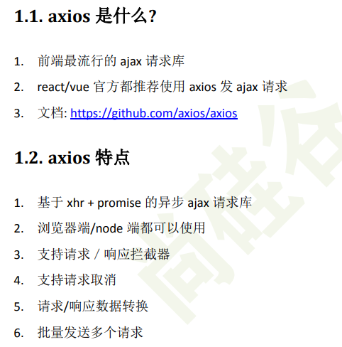
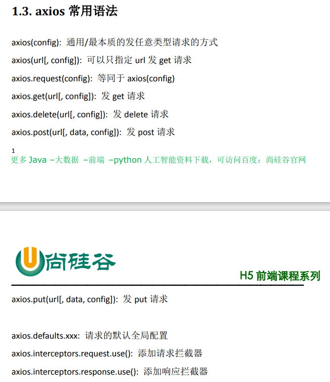
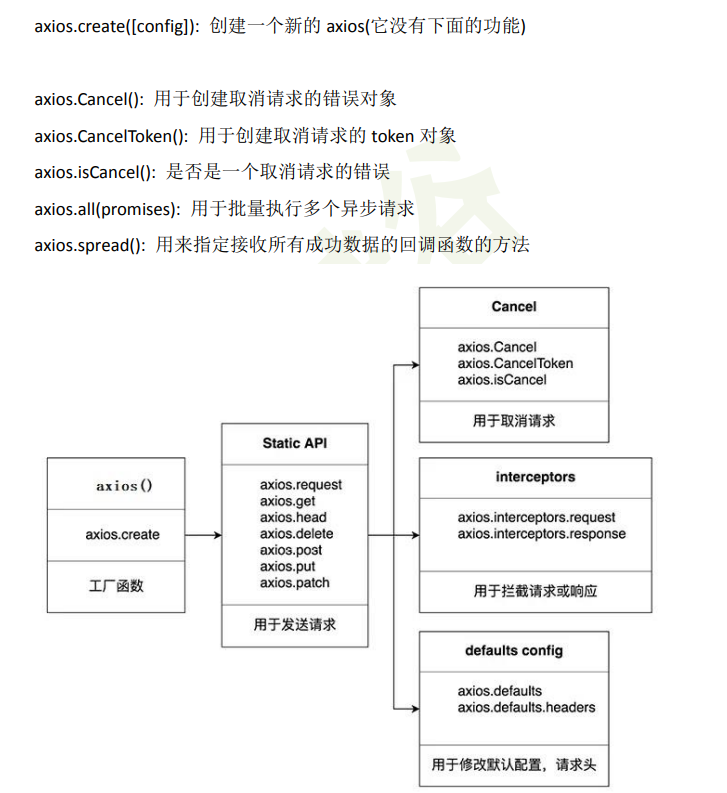
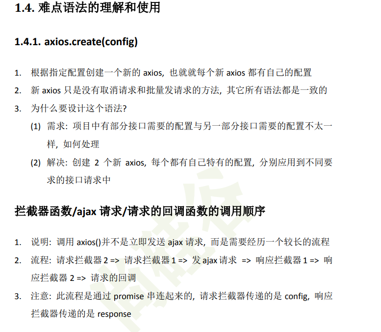
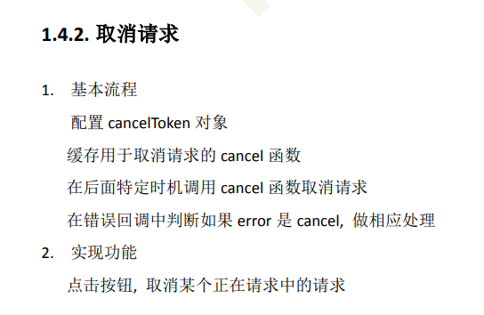
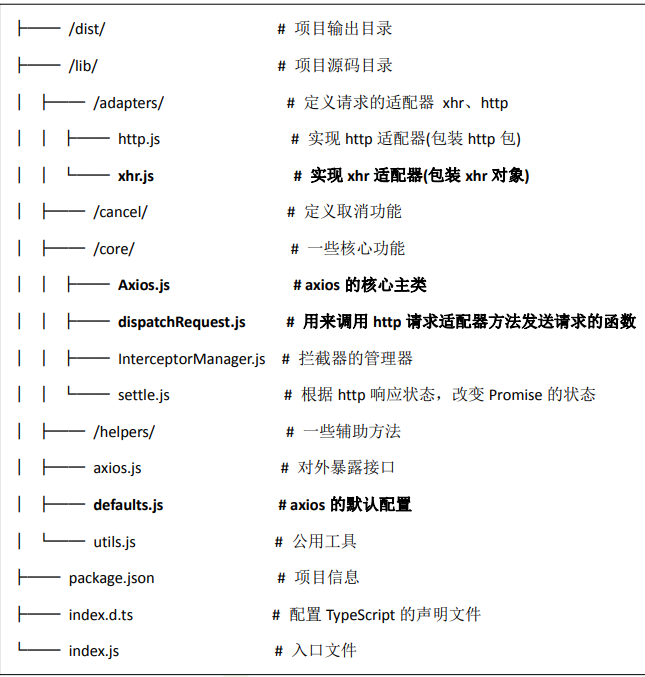
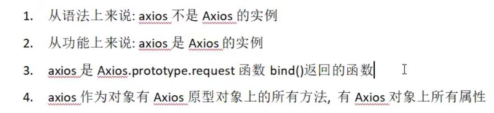
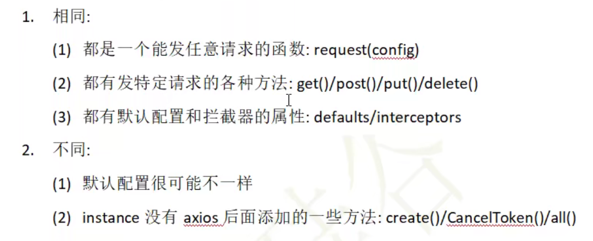

# 第 1 章：axios 的理解和使用











#  第 2 章：axios 源码分析

## 2.1. 源码目录结构



## 2.2 axios 对象创建过程模拟实现

```html
    <script>
        //构造函数
        function Axios(config){
            //初始化
            this.defaults = config;//为了创建 default 默认属性
            this.intercepters = {
                request: {},
                response: {}
            }
        }
        
        //原型添加相关的方法
        Axios.prototype.request = function(config){
            console.log('发送 AJAX 请求 请求的类型为 '+ config.method);
        }
        Axios.prototype.get = function(config){
            return this.request({method: 'GET'});
        }
        Axios.prototype.post = function(config){
            return this.request({method: 'POST'});
        }

        //声明函数
        function createInstance(config){
            //实例化一个对象
            let context = new Axios(config);// context.get()  context.post()  但是不能当做函数使用 context() X
            //创建请求函数,bind 方法去改变 this 指向
            let instance = Axios.prototype.request.bind(context);// instance 是一个函数 并且可以 instance({})  此时 			instance 不能 instance.get 
            //将 Axios.prototype 对象中的方法添加到instance函数对象中，此时可以 instance.get...
            Object.keys(Axios.prototype).forEach(key => {
                instance[key] = Axios.prototype[key].bind(context);// this.default  this.interceptors
            });
            //为 instance 函数对象添加属性 default 与 interceptors
            Object.keys(context).forEach(key => {
                instance[key] = context[key];
            });
            return instance;
        }

        let axios = createInstance();
        // 测试发送请求
        // axios({method:'POST'});
        // axios.get({});
        // axios.post({});
    </script>
```

- 从上面的伪代码我们可以发现为什么 axios 实例既能被当作函数使用，又能当作对象使用

  - 我们拿到的 axios 构造方法其实是基于 Axios 构造方法创建的对象实例封装的

  - 原始Axios 构造方法中创建出来的对象实例只能用 axios.get() 这样的形式去发请求

  - 二次封装的构造方法先是拿到一个原生构造方法的对象实例，紧接着让这个对象实例作为 Axios.prototype.request 方法的 this 指向，赋值给 instance 变量

    - ```js
      //实例化一个对象
         let context = new Axios(config);// context.get()  context.post()  但是不能当做函数使用 context() X
      //创建请求函数,bind 方法去改变 this 指向
         let instance = Axios.prototype.request.bind(context);// instance 是一个函数 并且可以 instance({})  此时 
      ```

    - 然后 instance 此时就是一个函数，再将原生 Axios 对象的属性赋值给 instance 函数对象

      ```js
      //将 Axios.prototype 对象中的方法添加到instance函数对象中，此时可以 instance.get...
      Object.keys(Axios.prototype).forEach(key => {
          instance[key] = Axios.prototype[key].bind(context);// this.default  this.interceptors
      });
      //为 instance 函数对象添加属性 default 与 interceptors
      Object.keys(context).forEach(key => {
          instance[key] = context[key];
      });
      ```

    - 这便实现了最后拿到的 axios 即可以作为函数使用，又可以作为对象使用

## 2.3 axios 发送请求模拟实现

```html
    <script>
        // axios 发送请求   axios  Axios.prototype.request  bind
        //1. 声明构造函数
        function Axios(config){
            this.config = config;
        }

        Axios.prototype.request = function(config){
            //发送请求
            //创建一个 promise 对象
            let promise = Promise.resolve(config);
            //声明一个数组，存放回调方法
            let chains = [dispatchRequest, undefined];// undefined 占位
            //调用 then 方法指定回调
            let result = promise.then(chains[0], chains[1]);
            //返回 promise 的结果
            return result;
        }

        // //2. dispatchRequest 函数
        function dispatchRequest(config){
            //调用适配器发送请求，返回一个结果为 response 的 promise 对象
            return xhrAdapter(config).then(response => {
                //响应的结果进行转换处理
                //....
                return response;
            }, error => {
                throw error;
            });
        }

        // //3. adapter 适配器发送请求（源码会对环境做个判断是 xhr 还是 http）
        function xhrAdapter(config){
            console.log('xhrAdapter 函数执行');
            return new Promise((resolve, reject) => {
                //发送 AJAX 请求
                let xhr = new XMLHttpRequest();
                //初始化
                xhr.open(config.method, config.url);
                //发送
                xhr.send();
                //绑定事件
                xhr.onreadystatechange = function(){
                    if(xhr.readyState === 4){
                        //判断成功的条件
                        if(xhr.status >= 200 && xhr.status < 300){
                            //成功的状态
                            resolve({
                                //配置对象
                                config: config,
                                //响应体
                                data: xhr.response,
                                //响应头
                                headers: xhr.getAllResponseHeaders(), //字符串  parseHeaders
                                // xhr 请求对象
                                request: xhr,
                                //响应状态码
                                status: xhr.status,
                                //响应状态字符串
                                statusText: xhr.statusText
                            });
                        }else{
                            //失败的状态
                            reject(new Error('请求失败 失败的状态码为' + xhr.status));
                        }
                    }
                }
            });
        }


        // //4. 创建 axios 函数
        let axios = Axios.prototype.request.bind(null);
        
        axios({
            method:'GET',
            url:'http://localhost:3000/posts'
        }).then(response => {
            console.log(response);
        });
    </script>
```

## 2.4 axios 拦截器模拟实现

```js
    <script>
        //构造函数
        function Axios(config){
            this.config = config;
            this.interceptors = {
                request: new InterceptorManager(),
                response: new InterceptorManager(),
            }
        }

        //发送请求  难点与重点
        Axios.prototype.request = function(config){

            //创建一个 promise 对象
            let promise = Promise.resolve(config);

            //创建一个数组
            const chains = [dispatchRequest, undefined];

            //处理拦截器

            //请求拦截器 将请求拦截器的回调 压入到 chains 的前面
            //因为后面遍历循环执行，应当执先执行请求拦截、再执行请求、后执行响应拦截
            this.interceptors.request.handlers.forEach(item => {
                chains.unshift(item.fulfilled, item.rejected);
            });

            //响应拦截器 
            this.interceptors.response.handlers.forEach(item => {
                chains.push(item.fulfilled, item.rejected);
            });

            //遍历执行 chains 数组里面的回调
            while(chains.length > 0){
                promise = promise.then(chains.shift(), chains.shift());
            }

            return promise;
        }

        //发送请求
        function dispatchRequest(config){
            //返回一个promise 队形
            return new Promise((resolve, reject) => {
                resolve({
                    status: 200,
                    statusText: 'OK'
                });
            });
        }
       
        //创建实例
        let context = new Axios({});

        //创建axios函数

        let axios = Axios.prototype.request.bind(context);

        //将 context 属性 config interceptors 添加至 axios 函数对象身上
        Object.keys(context).forEach(key => {
            axios[key] = context[key];
        });

        //拦截器管理器构造函数
        function InterceptorManager(){
            this.handlers = [];
        }

        InterceptorManager.prototype.use = function(fulfilled, rejected){
            this.handlers.push({
                fulfilled,
                rejected
            })
        }

        //以下为功能测试代码
        // 设置请求拦截器  config 配置对象
        axios.interceptors.request.use(function one(config) {
            console.log('请求拦截器 成功 - 1号');
            return config;
        }, function one(error) {
            console.log('请求拦截器 失败 - 1号');
            return Promise.reject(error);
        });

        axios.interceptors.request.use(function two(config) {
            console.log('请求拦截器 成功 - 2号');
            return config;
        }, function two(error) {
            console.log('请求拦截器 失败 - 2号');
            return Promise.reject(error);
        });

        // 设置响应拦截器
        axios.interceptors.response.use(function (response) {
            console.log('响应拦截器 成功 1号');
            return response;
        }, function (error) {
            console.log('响应拦截器 失败 1号')
            return Promise.reject(error);
        });

        axios.interceptors.response.use(function (response) {
            console.log('响应拦截器 成功 2号')
            return response;
        }, function (error) {
            console.log('响应拦截器 失败 2号')
            return Promise.reject(error);
        });


        //发送请求
        axios({
            method: 'GET',
            url: 'http://localhost:3000/posts'
        }).then(response => {
            console.log(response);
        });
    </script>
```

## 2.5 axios请求取消模拟实现

```html
<!DOCTYPE html>
<html lang="en">
<head>
    <meta charset="UTF-8">
    <meta name="viewport" content="width=device-width, initial-scale=1.0">
    <title>取消请求</title>
    <link crossorigin='anonymous' href="https://cdn.bootcss.com/twitter-bootstrap/3.3.7/css/bootstrap.min.css" rel="stylesheet">
    <!-- <script src="./node_modules/axios/dist/mine-axios.js"></script> -->
</head>
<body>
    <div class="container">
        <h2 class="page-header">axios取消请求</h2>
        <button class="btn btn-primary"> 发送请求 </button>
        <button class="btn btn-warning"> 取消请求 </button>
    </div>
    <script>
        //构造函数
        function Axios(config){
            this.config = config;
        }
        //原型 request 方法
        Axios.prototype.request = function(config){
            return dispatchRequest(config);
        }
        //dispatchRequest 函数
        function dispatchRequest(config){
            return xhrAdapter(config);
        }

        //xhrAdapter(根据环境判断是发 http 还是 Ajax)
        function xhrAdapter(config){
            //发送 AJAX 请求
            return new Promise((resolve, reject) => {
                //实例化对象
                const xhr = new XMLHttpRequest();
                //初始化
                xhr.open(config.method, config.url);
                //发送
                xhr.send();
                //处理结果
                xhr.onreadystatechange = function(){
                    if(xhr.readyState === 4){
                        //判断结果
                        if(xhr.status >= 200 && xhr.status < 300){
                            //设置为成功的状态
                            resolve({
                                status: xhr.status,
                                statusText: xhr.statusText
                            });
                        }else{
                            reject(new Error('请求失败'));
                        }
                    }
                }
                //关于取消请求的处理
                if(config.cancelToken){
                    //对 cancelToken 对象身上的 promise 对象指定成功的回调
                    config.cancelToken.promise.then(value => {
                        xhr.abort();
                        //将整体结果设置为失败
                        reject(new Error('请求已经被取消'))
                    });
                }
            })
        }

        //创建 axios 函数
        const context = new Axios({});
        const axios = Axios.prototype.request.bind(context);

        //CancelToken 构造函数
        function CancelToken(executor){
            //声明一个变量
            var resolvePromise;
            //关键步骤：为实例对象添加属性
            this.promise = new Promise((resolve) => {
                //将 resolve 赋值给 resolvePromise
                resolvePromise = resolve
            });
            //调用 executor 函数，将函数暴露到全局（相当于把 promise resolve 方法暴露到全局）
            executor(function(){
                //执行 resolvePromise 函数
                resolvePromise();
            });
        }

        //获取按钮 以上为模拟实现的代码
        const btns = document.querySelectorAll('button');

        //2.声明全局变量
        let cancel = null;
        
        //发送请求
        btns[0].onclick = function(){
            //检测上一次的请求是否已经完成
            if(cancel !== null){
                //取消上一次的请求
                cancel();
            }

            //创建 cancelToken 的值，外部定义了一个全局变量 cancel 去获取暴露出来的 resolve 方法
            let cancelToken = new CancelToken(function(c){
                cancel = c;
            });

            axios({
                method: 'GET',
                url: 'http://localhost:3000/posts',
                //1. 添加配置对象的属性
                cancelToken: cancelToken
            }).then(response => {
                console.log(response);
                //将 cancel 的值初始化
                cancel = null;
            })
        }

        //绑定第二个事件取消请求
        btns[1].onclick = function(){
            // 当调用 cancel 的时候 cancalToken 对象里的 promise 会变为成功状态，就会调用我们指定的成功回调（里面有中断请求的操作58行）
            cancel();
        }
    </script>   
</body>
</html>
```

## 2.6 总结

### axios 和 Axios 的关系



### instance 与 axios 的区别



这也是为什么 axios.create 出来的对象，不能调用 create 等方法，因为它是通过 createInstance 创建的

