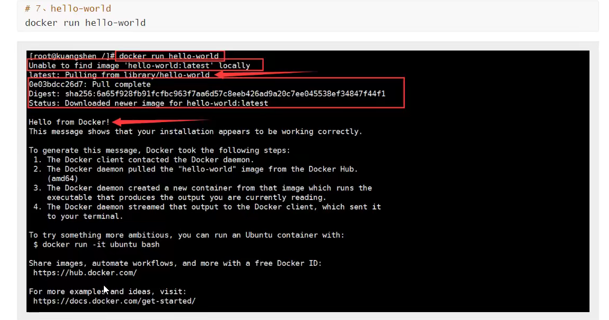

# Docker 概述

## Docker 为什么出现


tips： Docker 让项目和项目环境同时打包上线，省去了环境配置这一复杂的环节

##  Docker 历史


## Docker 官网


## Docker 能干嘛

### 之前的虚拟机技术


### 容器化技术


# Docker 安装

## Docker 的基本组成


**镜像（image）:**

docker镜像就好比是一个模板，可以通过这个模板来创建容器服务，tomcat 镜像 ===> run ==> tomcat01 容器（提供服务器），通过这个镜像可以创建多个容器（最终服务运行或项目运行就是在容器中）

**容器（container）：**

Docker 利用容器技术，独立运行一个或一组应用，通过镜像来创建的。

启动，停止，删除，基本命令！

目前就可以把这个容易理解为一个简易的 Linux 系统

**仓库（repository）：**

仓库就是存放镜像的地方！

仓库分为公有仓库和私有仓库！

Docker Hub（默认是国外的）

阿里云...都有容器服务器（配置镜像加速的）

## 安装 Docker

### 环境准备


### 环境查看


### 安装

#### **1.卸载旧版本**

```
yum remove docker \
docker-client \
docker-client-latest \
docker-common \
docker-latest \
docker-latest-logrotate \
docker-logrotate \
docker-engine
```

#### **2.需要的安装包**

```
yum install -y yum-utils
```

#### **3.设置镜像的仓库**yum install -y yum-utils

```
yum-config-manager \
    --add-repo \
    https://download.docker.com/linux/centos/docker-ce.repo // 默认是国外的

```

```
 yum-config-manager --add-repo http://mirrors.aliyun.com/docker-ce/linux/centos/docker-ce.repo// 阿里云
```

#### **4.安装 docker 相关引擎**

最好先更新下 yum：yum makecache fast

```
yum install docker-ce docker-ce-cli containerd.io
```

tips：docker-ce 社区版 ee是企业版

#### **5.启动docker**

```
systemctl start docker
```

#### **6.使用 docker version 判断是否安装成功**

#### 7.运行 docker



#### **8.查看 Helloword这个镜像**


#### 了解：卸载 docker


## 阿里云镜像加速

- 登录阿里云进入镜像服务

- 找到镜像加速地址

  - ```
    https://tch61tw9.mirror.aliyuncs.com
    // 每个人都是不一样的
    ```

- 配置使用

## 回顾 HelloWorld 的流程

Docker run 的运行流程


## 底层原理

Docker 是怎么工作的？


Docker 为什么比 VM 快？


现在不只linux 了，都支持，因为虚拟机是完全模拟物理机的，所以安全性是比较强的

个人理解：假如要做一道炒白菜，我只需要一把菜刀，锅，铲，docker给我提供刚好的工具，而虚拟机可能还给我提供瓢盆碗各种东西，所以比较笨重

# Docker 命令

## 帮助命令


## 镜像命令

### **docker images**


### **docker search**


tips：start 是收藏数

### docker pull


### docker rmi

删除镜像


## 容器命令

**说明：我们有了镜像才可以创建容器，linux，下载一个 centos 镜像来测试学习**

```
docker pull centos
```

### **新建容器并启动**


### 列出所有运行的容器


### 退出容器


### 删除容器


### 启动和停止容器的操作


## 常用其他命令

### 后台启动容器


### 查看日志


### 查看容器中进程信息ps


### 查看镜像的元数据


### 进入当前正在运行的容器

# Docker 镜像

# 容器数据卷

# DockerFIle

# Docker 网络原理

# IDEA 整合 Docker

# Docker Compose

# Doker Swarm

# CI\CD Jenkins