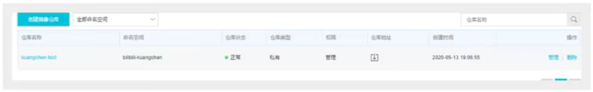
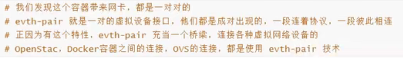
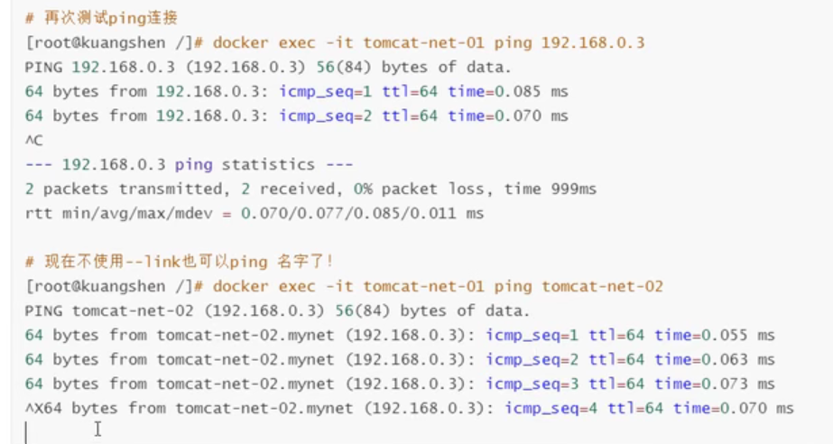
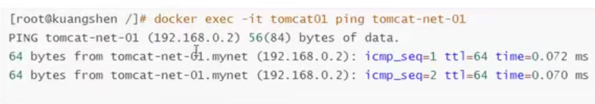

# 常用的小结

查看容器：

- 正在运行：docker ps
- 所有：docker ps -all
启动一个 nginx 镜像和挂载数据卷：docker run -d  -p 5012:80 --name nginx3 --restart=always -v  /linux_class/nginx3/html:/usr/share/nginx/html -v /linux_class/nginx3/nginx.conf:/etc/nginx/nginx.conf nginx

```shell
# 最后的 . 告诉 docker 在当前目录下寻找 Dockerfile 文件
docker build -t 指定镜像名 .
# 80 是本地端口，5000 是镜像端口，-d 表示在后台运行，这样镜像的输出不会直接显示在控制台
docker run -p 80:5000 -d 镜像名
```


图像工具：Docker Desktop

**数据卷**

```shell
# 创建数据卷 my-finace-data
docker volume create my-finace-data
# 将 my-finance-data 挂载到容器 /etc/finance 这个路径下
docker run -dp 80：5000 v my-finace-data:/etc/finance my-finance(镜像名)
```

**docker-compose**

一次性创建和启动多个容器

```yml
# docker-compose.yml 文件
version: "3.4"

services:
  playsmartbackendnode-test:
    build:
      context: .
      dockerfile: ./Dockerfile
    environment:
      NODE_ENV: development
      PLAYSMART_PATH: /usr/src/app/
    command: ["yarn", "online_dev"]
    ports:
      - 6002:6002
  playsmartbackendnode:
    build:
      context: .
      dockerfile: ./Dockerfile
    environment:
      NODE_ENV: production
      PLAYSMART_PATH: /usr/src/app/
    command: ["yarn", "online"]
    ports:
      - 6001:6001
```

创建启动：docker compose up -d  停止删除： docker compose down --volumes(可选，加这个参数会将数据卷也删掉)

**拓展技术：Kubernetes 集群（Cluster）**

# Docker 概述

## Docker 为什么出现

 Docker 让项目和项目环境同时打包上线，省去了环境配置这一复杂的环节( 比如在过去我们要部署一个 Node 项目，我们需要在服务器上得有个 Node 环境的运行工具和安装相关的数据库，现在我们只需要在 Dokerfile 文件里说明这些文件，到那台服务器都是构建一下镜像就能让项目跑起来了)

##  Docker 历史


## Docker 官网


## Docker 能干嘛

### 之前的虚拟机技术


### 容器化技术


# Docker 安装

## Docker 的基本组成


**镜像（image）:**

docker镜像就好比是一个模板，可以通过这个模板来创建容器服务，tomcat 镜像 ===> run ==> tomcat01 容器（提供服务器），通过这个镜像可以创建多个容器（最终服务运行或项目运行就是在容器中）

**容器（container）：**

Docker 利用容器技术，独立运行一个或一组应用，通过镜像来创建的。

启动，停止，删除，基本命令！

目前就可以把这个容易理解为一个简易的 Linux 系统

**仓库（repository）：**

仓库就是存放镜像的地方！

仓库分为公有仓库和私有仓库！

Docker Hub（默认是国外的）

阿里云...都有容器服务器（配置镜像加速的）

## 安装 Docker

### 环境准备


### 环境查看


### 安装

#### **1.卸载旧版本**

```
yum remove docker \
docker-client \
docker-client-latest \
docker-common \
docker-latest \
docker-latest-logrotate \
docker-logrotate \
docker-engine
```

#### **2.需要的安装包**

```
yum install -y yum-utils
```

#### **3.设置镜像的仓库**yum install -y yum-utils

```
yum-config-manager \
    --add-repo \
    https://download.docker.com/linux/centos/docker-ce.repo // 默认是国外的

```

```
 yum-config-manager --add-repo http://mirrors.aliyun.com/docker-ce/linux/centos/docker-ce.repo// 阿里云
```

#### **4.安装 docker 相关引擎**

最好先更新下 yum：yum makecache fast

```
yum install docker-ce docker-ce-cli containerd.io
```

tips：docker-ce 社区版 ee是企业版

#### **5.启动docker**

```
systemctl start docker
```

#### **6.使用 docker version 判断是否安装成功**

#### 7.运行 docker


#### **8.查看 Helloword这个镜像**


#### 了解：卸载 docker


## 阿里云镜像加速

- 登录阿里云进入镜像服务

- 找到镜像加速地址

  - ```
    https://tch61tw9.mirror.aliyuncs.com
    // 每个人都是不一样的
    ```

- 配置使用

## 回顾 HelloWorld 的流程

Docker run 的运行流程


## 底层原理

Docker 是怎么工作的？


Docker 为什么比 VM 快？


现在不只linux 了，都支持，因为虚拟机是完全模拟物理机的，所以安全性是比较强的

**个人理解：假如要做一道炒白菜，我只需要一把菜刀，锅，铲，docker给我提供刚好的工具，而虚拟机可能还给我提供瓢盆碗各种东西，所以比较笨重**

# Docker 命令

## 帮助命令


## 镜像命令

### **docker images**


### **docker search**


tips：start 是收藏数

### docker pull


### docker rmi

删除镜像


## 容器命令

**说明：我们有了镜像才可以创建容器，linux，下载一个 centos 镜像来测试学习**

```
docker pull centos
```

### **新建容器并启动**


### 列出所有运行的容器


### 退出容器


### 删除容器


### 启动和停止容器的操作


## 常用其他命令

### 后台启动容器


### 查看日志


### 查看容器中进程信息ps


### 查看镜像的元数据


### 进入当前正在运行的容器

#### 方式一


#### 方式二


#### 两者区别


### 从容器内拷贝文件到主机上


## 小结


## 练习

### 部署 Nginx

- 搜索镜像：docker search nginx

- 下载镜像：docker pull nginx

- 运行测试

  

  


### 部署 Tomcat（跳过）

### 部署 ES + Kibana（跳过）

## 可视化


```
docker run -d -p 8080（自己开的端口号）:9000 --restart=always -v /var/run/docker.sock:/var/run/docker.sock --name prtainer  portainer/portainer
```

# Docker 镜像

## 镜像是什么

## Docker 镜像加载原理

**联合文件系统（重要）**


**tips: 如果你安装了一个 mysql 和 nginx 他们都需要用到 centos 内核，由于联合文件系统的特性，你无需安装两个，他们会复用这个 centos 内核**

 

## 分层理解


## commit 镜像


# 容器数据卷（看到这里）

## 什么是容器数据卷


## 使用数据卷


**就算停止容器也会同步**


## 实战：MySQL 同步数据（跳过）

## 具名和匿名挂载


tips：volume 指的是容器卷


tips：查看卷的详细信息


**如何确定是具名挂在还是匿名挂在，还是指定路径挂载**


拓展：


## 初始 Dockerfile


启动自己的写的容器

## 数据卷容器

使用场景：多个 mysql 同步数据！


启动 3 个容器


- 测试，可以删除 docker01 查看一下 docker02 和 docker03 是否可以访问这个文件
- 测试依旧可以访问


**多个 mysql 实现数据共享**


**结论：**

容器之间配置信息的传递，数据卷容器的生命周期一直持续到没有容器使用为止。

但是一旦你持久化到了本地（通过容器数据卷就让本地文件与镜像文件建立连接即便镜像被删除），这时候，本地的数据是不会删除的

# DockerFIle

## DockerFile 介绍

dockerfile 是用来构建 docker 镜像的文件！命令参数脚本！

构建步骤：

1. 编写一个 dockerfile 文件
2. docker build 构建成为一个镜像
3. docker run 运行镜像
4. docker push 发布镜像（dockerhub，阿里云）


## DockerFile 构建过程

**基础知识**

1、每个保留关键字（指令）都必须是大写字母

2、执行从上到下顺序执行

3、# 表示注释

4、每一个指令都会创建提交一个新的镜像层，并提交！


dockerfile 是面向开发的，我们以后要发布项目，做镜像，就需要编写 dockerfile 文件，这个文件十分简单！

Docker 镜像逐渐成为企业交付的标准，必须要掌握！

步骤：开发，部署，运维

DockerFile：构建文件，定义一切的步骤，源代码

DockerImages：通过 DokcerFile 构建生成的镜像，最终发布和运行的产品！

Docker 容器：容器就是镜像运行起来提供服务器

## DockerFile 指令

 


**实战测试**

Docker Hub 中 99% 镜像都是从这个基础镜像过来的 FROM scratch，然后配置需要的软件和配置进行的构建（这个镜像是 centos 镜像，毕竟大部分应用都是运行在 linux 系统下的）


创建一个自己的 centos

```dockerfile
1 编写 Dockerfile 的文件
FROM centos
MAINTAINER Axin<1219951647@qq.com>

ENV MYPATH /usr/local
WORKDIR $MYPATH

RUN yum -y install vim
RUN yum -y install net-tools

EXPOSE 80

CMD echo $MYPATH
CMD echo "----end----"
CMD /bin/bash

2 通过文件构建镜像
docker build -f dockerfile文件路径 -t 镜像名：版本号
docker build -f mydockerfile-centos -t mycentos:0.1 .

构建成功显示：
Successfully built 3723d67b1f37
Successfully tagged mycentos:0.1

3 测试运行
运行 mycentos：docker run -it mycentos:0.1
测试 pwd、ifconfig、vim 发现是可以用的
```

我们可以列出本地进行的本地变更历史


通过历史我们可以大概知道这个镜像是怎么做的


## **CMD 和 ENTRYPOINT 区别**


**测试 CMD**（我们 run docker 的时候它就会执行它里面的命令）


**测试 ENTRYPOINT**


## 实战：Tomcat 镜像

1、准备镜像文件 tomcat 压缩包 ， jdk 压缩包


2、编写 dockerfile 文件，官方命名 Dockerfile， build 会自动寻找这个文件，就不需要 -f 指定了！


3、构建镜像


4、启动镜像

5、访问测试

6、发布项目


## 发布自己的镜像

### **Docker Hub**

1、注册账号

2、登录 docker 账号，在我们服务上提交自己的镜像


提交的时候也是按镜像的层级进行提交的

### 阿里云镜像服务上

1、登录阿里云

2、找到容器镜像服务

3、创建命名空间


4、创建容器镜像



5、浏览阿里云


## 小结


# Docker 网络原理

## 理解 Docker0

清空所有环境

**测试**


三个网络

```
问题：docker 是如何处理容器网络访问的？
```


```
启动一个镜像 tomacat

镜像外能否 ping 通镜像内
```


**原理**




**容器和容器之间是可以互相 ping 通的**


**绘制模型图说明**


结论：tomcat01 和 tomcat02 有公用的一个路由器，docker0

所有的容器不指定网络的情况下，都是 docker0 路由的，docker 会给我们的容器分配一个默认的可用 ip 255.255.0.1/16


## 小结

Docker 使用的是 Linux 的桥接，宿主机中是一个 Docker 容器的网桥 docker0


Docker 中的所有网络接口都是虚拟的，虚拟的转发效率搞！（内网传递文件速度快就是利用这个！）

只要容器删除对应的一对网桥也就删除了


## **--link**

```
思考一个场景，我们编写了一个微服务，我们要连接database 就要用它的url=ip，可是我们重新启动 docker 的时候 ip 会变，我们想要在数据库 ip 换掉时，项目不重启，可以通过名字来访问服务（容器）
```


## 自定义网络

查看所有的 docker 网络


**网络模式**

bridge：桥接 docker（默认）

none：不配置网络

host：和宿主机共享网络

container：容器网络连通！（用的少！局限很大）

**测试**

```shell
# 我们直接启动的命令 --net bridge，而这个就是我们的docker0
docker run -d -p --name tomcat01 tomcat
docker run -d -p --name tomcat02  --net bridge tomcat

# docker0 特点，默认，域名不能访问， --link 可以打通连接！

# 我们可以自定义一个网络！
```


启动两个容器再去测试ping




我们自定义的网络 docker 都已经帮我们维护好了对应的关系，推荐我们平时这样使用网络！

**好处**


## 网络连通


01 连通




结论：假设要跨网络去操作别人，就需要使用 docker network connect 连通

## 实战 Redis 集群


shell 脚本！


# SpringBoot 微服务打包 Docker 镜像


tips：比如 node 的项目，我们在 Dockerfile 里配置好 node 运行环境和命令，和项目一起放到服务器，用 docker 去构建一个镜像就可以让 node 项目跑起来了

# IDEA 整合 Docker

# Docker Compose

# Doker Swarm

# CI\CD Jenkins