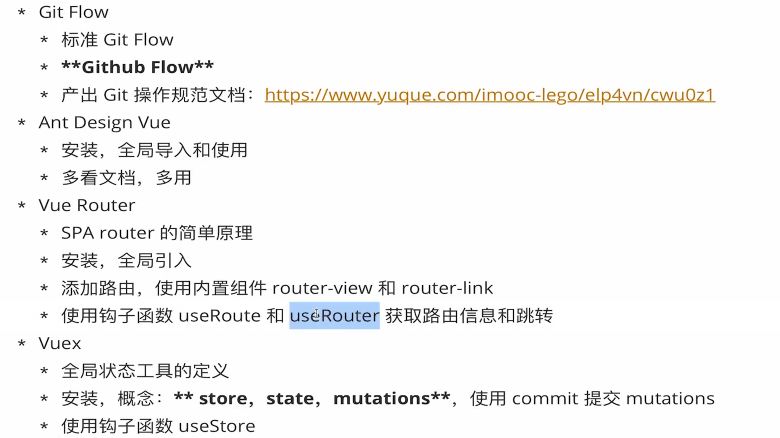
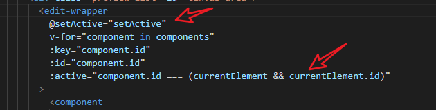
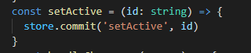
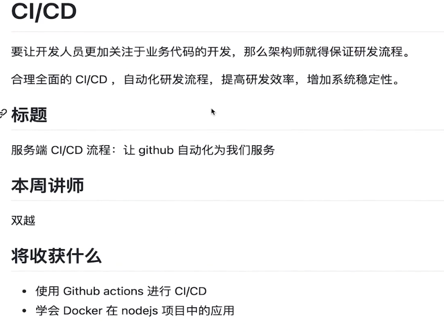

# 第二周

## 2-6 脚手架开发流程

### 开发流程


### 使用流程


### 开发难点解析


## 2-7 快速入门第一个脚手架

**npm init -y 初始化一个工程**

**建一个文件夹 bin 里面有一 js 文件**


tips：注释的那句话表示到全局变量里找到 node 这个变量，然后在它指向的环境下运行（即 node 环境），声明了这句话后执行 index.js == node index.js

**配置 package.json 文件**


tips：第一个是包名，第二个是执行命令，我们全局安装这个包后执行 imooc-test 就会执行 bin 文件下的 index.js 文件

## 2-8 脚手架本地调试方法

在 imooc-test-lib 包下执行 npm link，这个包就可以被链接到本地


在 imooc-test 下执行 npm link imooc-test-lib 即可直接使用这个包


## 2-9 脚手架本地调试标准流程


**链接本地脚手架**


链接了本地脚手架即可根据脚手架的 bin 下的脚手架名直接在命令行输入执行，相当于为它配置了一个环境变量，我们全局变量的配置里有 node_global, 在文件下执行 npm link 就是在 node_global 文件夹下面生成一个软链接


执行 imooc-test 相当于执行了 ./bin/index.js

**链接本地库文件**


库文件执行 npm link 之后，在脚手架里执行 npm link 库文件，脚手架文件的 node_modules 下面就会有一个软连接指向它

**取消链接本地库文件、link、unlink 理解**


## 2-10 脚手架命令注册和参数解析

```js
const argv = require('process').argv

const command = argv[2]
if ( command ) {
    if( lib[command] ) {
        lib[command]()
    } else {
        console.log("无效命令");
    }
} else {
    console.log("请输入命令");
}
```

内置模块 process 的 argv 参数可以获取到我们从终端输入的命令，我们根据命令的不同到对应的库里调用函数即可实现命令行的操作

## 2-11 脚手架项目发布


tips：发布新的包的时候注意修改版本号（npm publish）

## 3-3 本章重点：lerna简介及脚手架开发流程

### Lerna简介

#### **为什么需要 Lerna？**


tips：Lerna 能解决以上痛点

#### **简介**


### **Lerna 开发脚手架流程（重点）**


## 3-4 基于lerna搭建脚手架框架

**初始化脚手架项目**

- npm init 初始化脚手架
- 安装 lerna：npm install lerna -D
- 初始化 lerna：lerna init
- 创建 .gitnore 文件

**创建 packages**

lerna create 包名

**core**


**utils**


**到 npm 上创建分组**


tips：这种分组的命名形式可以避免包名冲突，如果你单单 utils ，npm 上面一大堆有关 utils的包名，这时你就可以创建自己的 organizations 相当于有了自己的命名空间

## 3-5 Lerna核心操作

### lerna add


tips：为指定的包添加依赖,可以指定包名添加也可以全部包都添加


tips：为所有的包添加 @imooc-cli/utils 这个依赖


tips：向指定的包添加依赖

### lerna clean

tips：删除所有依赖

### lerna bootstrap

tips：为包去安装依赖（根据包的package）

### lerna link

tips：对于存在相互依赖的包它自动为其建立起软连接，比如说 core 包引用了 utils 包，当我们使用了 npm link 的时候 core 的 node_modules 就会有一个软连接指向我们本地开发的 utils 包；**如果没有这个命令，我们需要到每个包下面自己去 npm link 对应的包**


### lerna exec --rm -rf node_modules

### 看到这里


## 3-6 脚手架发布流程

### 常用命令

- lerna version
- lerna changed：自上个版本以来那些packetge做了变更
- lernadiff：与上次的 commit 进行diff
- lerna publish: 发布包到 npm，先npm login 登录npm和git push 到仓库


### 流程

- 建立仓库
- 将代码先推送到仓库
- 给私有包的pakege.json加上

```
"publishConfig": {
    "access": "public"
  }
```


tips：若没有加上这句，私有包是没办法发布的

- 执行lerna publish发布到npm

## 4-1 Lerna 源码


## 4.2 Lerna 源码结构分析


## 4-5 npm项目本地依赖引用方法


tips:写好包的路径直接npm install 即可

## 4.6 脚手架 yargs 快速入门

## 4.7 yargs 高级用法讲解

## 4.8 lerna 脚手架初始化

## 4.10 回顾js事件循环

# 第三周

## 1-1 内容介绍


## 2-1 聊话题

**项目设计阶段**


**项目实施阶段**


## 2-2 前端研发过程中的痛点分析


## 2-3 大厂git规范


## 2.4 高端操作：脚手架架构设计 + 绘制架构图


## 2-5 架构师设计图绘图技巧分享


## 3-1 脚手架模块拆分策略


 

## 3-2 core 模块技术方案


##  4-1 脚手架框架代码拆包 + import-local 应用


## 4-2 检查版本号功能开发（require 加载资源类型详解 + npm log 封装）


tips：想创建用于封装 log 的包


tips：安装 npmlog 包，自定义 log


tips：需在用到的地方在 pkg 里先配置好 dependence，注意 require 引入的注意点，不是以上文件的都会当做 js 解析，node 后缀的会调用 process.dlopen 解析

## 4-3 最低 Node 版本检查


tips：安装 smerver 包（用 0.0.0 格式的比对），process.version 获取当前 node 版本号，定义一个常量，存着规定的 node 版本号

##  4-4 root账号启动检查和自动降级功能开发


tips：这一步windows和android 是无效的，为什么要做这一步？root创建的文件，其他用户是没有办法删除修改的，所以需要创建

## 4-5 用户主目录检查功能开发

## 4-6 入参检查和debug模式开发

包：minimist -> 可以帮助我们解析参数


## 4-7 环境变量检查功能

包：dotenv -> 用来加载环境变量从 .env 文件中


## 4-8 通用 npm API 模块封装

## 4-9 npm 全局更新提示功能


```js
// 关键步骤，获取线上的包信息，后面的步骤无非就是根据包信息的版本去比较本地包版本
function getNpmInfo(npmName, registry) {
    if (!npmName) {
        return null;
    }
    const registryUrl = registry || getDefaultRegistry()
    const npmInfoUrl = urlJoin(registryUrl, npmName)
    return axios.get(npmInfoUrl).then(response => {
        if (response.status === 200) {
            return response.data
        }
        return null;
    }).catch(err => {
        return Promise.reject(err)
    })
}

function getDefaultRegistry(isOriginal = false) {
    return isOriginal ? 'http://registry.npm.org' : 'http://registry.npm.taobao.org/'
}

async function getNpmVersions(npmName, registry) {
    const data = await getNpmInfo(npmName, registry);

    if (data) {
        return Object.keys(data.versions)
    } else {
        return []
    }
}

function getSemverVersions(baseVersion, versions) {
    versions = versions.filter( version => {
        semver.satisfies(version, `^${baseVersion}`)
    } ).sort( (a, b) => semver.gt(b, a))
    
    return versions; 
}

async function getNpmSemverVersions(baseVersion, npmName, registry) {
    const versions = await getNpmVersions(npmName, registry)
    const newVersions = getSemverVersions(baseVersion, versions)
    if ( newVersions && newVersions.length > 0) {
        return newVersions[0]
    }
    return null
} 
```

## 5-1 快速实现一个 commander 脚手架


## 5-2 commander 脚手架全局配置

##  5-3 commander 脚手架命令注册的两种方法

```js
#!/usr/bin/env node

const commander = require('commander')
const pkg = require('../package.json')

// 获取 commander 单例
// const { program } = commander.program;

// 实例化一个 Command 示例
const program = new commander.Command()

program
    .name(Object.keys(pkg.bin)[0])
    .usage('<command> [options]')
    .version(pkg.version)
    .option('-d, --debug', '是否开启调试模式', false)
    .option('-e, --envName <envNmae>', '获取环境变量名称')

// comman 注册命令
const clone = program.command('clone')

clone
    .action(() => {
        console.log('do clone');
    });

// addCommand 注册命令
const service = new commander.Command('service')
service
    .command('start [port]')
    .description('start service at some port')
    .action((port) => {
        console.log('do service star    t', port);
    })

program.addCommand(service)

program.parse(process.argv)
```

## 5-4 commander 注册命令的两种高级用法

## 5-5 再讲3条 commander 的高级用法

## 6-1 通过 webpack 完成 ES Module 资源构建

tips：配置好入口，执行webpack即可

## 6-2 通过 webpack target 属性支持 node 内置库


tips：默认环境是 web 肯定不支持node内置库，修改target为node即可

## 6-3 配置 babel-loder 支持低版本 node

# 第四周

## 3-3 脚手架命令动态加载功能架构设计

## 4-1 脚手架命令本地调式功能支持

## 4-2 动态执行库 exec 模块创建	


## 4-3 创建 npm 模块通用类 package


## 4-4 Pakcage 类的属性、方法定义及构造函数逻辑开发

## 4-5 Package 类获取入口文件路径功能开发（pkg-dir应用 + 解决不同操作系统路径兼容问题）

```js
// 获取入口文件的路径
  getRootFilePath() {
    function _getRootFile(targetPath) {
      // 1. 获取package.json所在目录
      // 这个库(pkg-dir)可以帮助查询 package.json 的绝对路径
      const dir = pkgDir(targetPath); 
      if (dir) {
        // 2. 读取package.json
        const pkgFile = require(path.resolve(dir, 'package.json'));
        // 3. 寻找main/lib
        if (pkgFile && pkgFile.main) {
          // 4. 路径的兼容(macOS/windows)
          return formatPath(path.resolve(dir, pkgFile.main));
        }
      }
      return null;
    }
    if (this.storeDir) {
      return _getRootFile(this.cacheFilePath);
    } else {
      return _getRootFile(this.targetPath);
    }
  }
```

## 4-6 利用 npminstall 库安装 npm 模块 

```js
  async install() {
    await this.prepare();
    return npminstall({
      root: this.targetPath, // 要执行 npm install的根路径
      storeDir: this.storeDir, // 安装在哪里
      registry: getDefaultRegistry(), // 使用那个仓库淘宝？
      pkgs: [{
        name: this.packageName, // 要安装的包名，版本
        version: this.packageVersion,
      }],
    });
  }
```

tips：npminstall 这是一个库，可以帮助我们通过函数执行 npm install 包名/版本

## 4-7 Pakcage 类判断模块是否存在方法开发（跳）

## 4-8 Pakcage 类获取缓存模块入口文件功能改造（跳）

## 4-9 Package 类获取缓存模块入口功能改造

## 5-1 进程的基本概念 

tips：讲解在操作系统中如何查看进程的嵌套关系

### 什么是进程


## 5-3 child_process spawn 用法以及与 exec 与 execFile 的区别

与 exec 与 execFile 相比 spawn 可以做到实时打印，而他们需要等到执行完一次性将结果反馈过来

## 5-4 child_process fork 用法及父子进程通信机制讲解

tips：fork会创建两个node进程，而上面的api不会，你可以通过 process.pid 观察到这两个的进程不一样，注意它是异步执行的


这会在子进程执行 child.js


使用场景：通过 node.js 去实现的耗时操作

## 5-5 child_process 同步方法使用教程

- execSync

- execFileSync
- spwanSync


## 6-1 通过脚手架命令 Command 类封装

## 6-2 脚手架初始化方法开发

## 6-3 利用Node多进程动态执行命令（stdio的inherit属性讲解）

## 6-4 生成Node多进程动态执行代码


tips：序列化

## 6-5 windows操作系统spawn执行命令兼容


## 7-1 Node多进程child_process库exec方法源码执行流程分析


tips：exec、execFile 本质都是调用了 spawn，而 spawn 创建进程会调用 new ChildProcess 其底层是 c++实现的


## 7-2 高能 child_process库exec源码精读

# 第五周

## 2-2 项目创建前准备阶段结构设计


## 2-3 下载项目模板阶段架构设计


## 3-1 项目创建准备阶段--判断当前目录是否为空功能开发

imooc-cli-dev/commands/init/lib/index.js

```js
  async prepare() {
    // 0. 判断项目模板是否存在
    const template = await getProjectTemplate();
    if (!template || template.length === 0) {
      throw new Error('项目模板不存在');
    }
    this.template = template;
    // 1. 判断当前目录是否为空
    const localPath = process.cwd();
    if (!this.isDirEmpty(localPath)) {
      let ifContinue = false;
      if (!this.force) {
        // 询问是否继续创建
        ifContinue = (await inquirer.prompt({
          type: 'confirm',
          name: 'ifContinue',
          default: false,
          message: '当前文件夹不为空，是否继续创建项目？',
        })).ifContinue;
        if (!ifContinue) {
          return;
        }
      }
      // 2. 是否启动强制更新
      if (ifContinue || this.force) {
        // 给用户做二次确认
        const { confirmDelete } = await inquirer.prompt({
          type: 'confirm',
          name: 'confirmDelete',
          default: false,
          message: '是否确认清空当前目录下的文件？',
        });
        if (confirmDelete) {
          // 清空当前目录
          fse.emptyDirSync(localPath);
        }
      }
    }
    return this.getProjectInfo();
  }
```

```js
  isDirEmpty(localPath) {
    let fileList = fs.readdirSync(localPath);
    // 文件过滤的逻辑
    fileList = fileList.filter(file => (
      !file.startsWith('.') && ['node_modules'].indexOf(file) < 0
    ));
    return !fileList || fileList.length <= 0;
  }
```

## 3-2 inquirer 基本用法和常用属性入门

[inquirer - npm (npmjs.com)](https://www.npmjs.com/package/inquirer)

## 3-3 inquirer 其他交互形式

[inquirer - npm (npmjs.com)](https://www.npmjs.com/package/inquirer)

## 3-4 强制清除当前目录

利用 fs-extra 的 emptyDirSync

## 3-5 获取项目基本信息功能开发

## 3-6 项目名称和版本号合法性校验

版本号检验合法性包含在获取基本信息功能开发里

```js
  async getProjectInfo() {
    function isValidName(v) {
      return /^[a-zA-Z]+([-][a-zA-Z][a-zA-Z0-9]*|[_][a-zA-Z][a-zA-Z0-9]*|[a-zA-Z0-9])*$/.test(v);
    }

    let projectInfo = {};
    let isProjectNameValid = false;
    if (isValidName(this.projectName)) {
      isProjectNameValid = true;
      projectInfo.projectName = this.projectName;
    }
    // 1. 选择创建项目或组件
    const { type } = await inquirer.prompt({
      type: 'list',
      name: 'type',
      message: '请选择初始化类型',
      default: TYPE_PROJECT,
      choices: [{
        name: '项目',
        value: TYPE_PROJECT,
      }, {
        name: '组件',
        value: TYPE_COMPONENT,
      }],
    });
    log.verbose('type', type);
    this.template = this.template.filter(template =>
      template.tag.includes(type));
    const title = type === TYPE_PROJECT ? '项目' : '组件';
    const projectNamePrompt = {
      type: 'input',
      name: 'projectName',
      message: `请输入${title}名称`,
      default: '',
        
      // 版本号检验
      validate: function(v) {
        const done = this.async();
        setTimeout(function() {
          // 1.首字符必须为英文字符
          // 2.尾字符必须为英文或数字，不能为字符
          // 3.字符仅允许"-_"
          if (!isValidName(v)) {
            done(`请输入合法的${title}名称`);
            return;
          }
          done(null, true);
        }, 0);
      },
      filter: function(v) {
        return v;
      },
    };
    const projectPrompt = [];
    if (!isProjectNameValid) {
      projectPrompt.push(projectNamePrompt);
    }
    projectPrompt.push({
        type: 'input',
        name: 'projectVersion',
        message: `请输入${title}版本号`,
        default: '1.0.0',
        validate: function(v) {
          const done = this.async();
          setTimeout(function() {
            if (!(!!semver.valid(v))) {
              done('请输入合法的版本号');
              return;
            }
            done(null, true);
          }, 0);
        },
        filter: function(v) {
          if (!!semver.valid(v)) {
            return semver.valid(v);
          } else {
            return v;
          }
        },
      },
      {
        type: 'list',
        name: 'projectTemplate',
        message: `请选择${title}模板`,
        choices: this.createTemplateChoice(),
      });
    if (type === TYPE_PROJECT) {
      // 2. 获取项目的基本信息
      const project = await inquirer.prompt(projectPrompt);
      projectInfo = {
        ...projectInfo,
        type,
        ...project,
      };
    } else if (type === TYPE_COMPONENT) {
      const descriptionPrompt = {
        type: 'input',
        name: 'componentDescription',
        message: '请输入组件描述信息',
        default: '',
        validate: function(v) {
          const done = this.async();
          setTimeout(function() {
            if (!v) {
              done('请输入组件描述信息');
              return;
            }
            done(null, true);
          }, 0);
        },
      };
      projectPrompt.push(descriptionPrompt);
      // 2. 获取组件的基本信息
      const component = await inquirer.prompt(projectPrompt);
      projectInfo = {
        ...projectInfo,
        type,
        ...component,
      };
    }
    // 生成classname
    if (projectInfo.projectName) {
      projectInfo.name = projectInfo.projectName;
      projectInfo.className = require('kebab-case')(projectInfo.projectName).replace(/^-/, '');
    }
    if (projectInfo.projectVersion) {
      projectInfo.version = projectInfo.projectVersion;
    }
    if (projectInfo.componentDescription) {
      projectInfo.description = projectInfo.componentDescription;
    }
    return projectInfo;
  }
```

## 4-1 下载项目模板功能实现流程分析+egg.js 简介


## 4-2 imooc-cli 后端项目创建

npm init egg的本质其实就是执行 create-egg

npm init imooc-cli 就是 create-imooc-cli

## 4-3 通过 egg.js 框架添加新的 API

参考imooc-cli-server/app/controller/Project

tips：在 controller 类里，每个方法就对应一个 api

# 第七周 B端项目需求分析和架构设计

## 1-1 本周简介


## 2-1 引子：突破瓶颈，前端破局之路


## 2-2 需求分析 

## 2-3 项目难点分析


## 2-3 下载项目模板架构设计

## 2-3 项目难点分析

##  3-1 组件库难点解决方案

## 3-2 编辑器难点解析一

## 3-3 编辑器难点解析二

## 3-4 技术选型


## 3-5 技术选项 vue 和 react


## 4-1 整体架构


# 第八周 前端基础技术回顾和巡礼

  

## 1-1 本周导学


## 2-1 Typescript 基础知识

在 ts 中 null 和 undeifnd 是所有类型的子类型

```ts
// tuple 元组类型
let user: [string, number] = ['viking', 20]
user = ['viking', 30]  // 前一项改为numbr后面为string也会报错，多一项也会报错
                       // 除非使用 push 方法，不过 push 进的应该满足 s 或 n
```

 

tips：可选参数

## 2-2 接口：interface


定义只读属性

```ts  
interface FunctionWithProps {
  (x: number): number;
  name: string;
}
const a: FunctionWithProps = (x: number) => {
  return x
}
a.name = 'abc'
```

tips：定义一个具有属性的函数 

## 2-3 类和接口

```ts

// 类的基本定义
// public private protected
class Animal {
  protected name: string;
  constructor(name: string) {
    this.name = name
  }
  run() {
    return `${this.name} is running`
  }
}
const snake = new Animal('lily')
snake.run()
// 继承
class Dog extends Animal {
  bark() {
    return `${this.name} is barking`
  }
}

const xiaobao = new Dog('xiaobao')
xiaobao.run()
// 多态
class Cat extends Animal {
  constructor(name) {
    super(name)
    console.log(this.name)
  }
  run() {
    return 'Meow, ' + super.run()
  }
}
const maomao = new Cat('maomao')
```

```ts
interface ClockInterface {
  currentTime: number;
  alert(): void;
}

// 约束静态属性
interface ClockStatic {
  new (h: number, m: number): void;
  time: number;
}
interface GameInterface {
  play(): void;
}

// implements 无法约束静态属性，所以需要两个 interface 进行双重约束
const Clock:ClockStatic = class Clock implements ClockInterface {
  constructor(h:number, m: number) {

  }
  static time = 12;
  currentTime: number = 123;
  alert() {

  }
}
class Cellphone implements ClockInterface, GameInterface {
  currentTime: number = 123;
  alert() {

  }
  play() {

  }
}

```

## 2-4 泛型基础知识

```ts
function echo<T>(arg: T): T {
  return arg
}

function swap<T, U>(tuple: [T, U]): [U, T] {
  return [tuple[1], tuple[0]]
}
const result = swap(['string', 123])
let test = 123

interface GithubResp {
  name: string;
  count: number;
}
interface CountryResp {
  name: string;
  area: number;
  population: number;
}

function withAPI<T>(url: string): Promise<T> {
  return fetch(url).then(resp => resp.json())
}
withAPI<CountryResp>('country.resp').then(resp => {
  
})
```

## 2-5 解析源码：泛型和接口

## 2-6 源码解析：深入泛型

```ts
// 类型别名
let sum: (x: number, y: number) => number
const result = sum(1,2)
type PlusType = (x: number, y: number) => number
let sum2: PlusType
sum2(1, 2)


// 交叉类型
interface IName  {
  name: string
}
type IPerson = IName & { age: number }
let person: IPerson = { name: 'hello', age: 12 }

// 联合类型
let numberOrString: number | string 

// 类型断言
function getLength(input: number | string) {
  const str = input as string
  if (str.length) {
    return str.length
  } else {
    const number = input as number
    return number.toString().length
  }
}

interface Person {
  name: string
  age: number
}

// Partial 可以将参数转化为可选参数
type PersonOptional = Partial<IPerson>
let viking2: PersonOptional = {name: '12'}
```

## 2-7 源码解析：高级特性

```ts
// keyof
type Keys = keyof CountryResp
// lookup types
type NameType = CountryResp['name']
// mapped types
type Test = {
  [key in Keys]: any
}
// 可以说是上面 Partial 的源码
type CountryOpt = {
  [p in Keys]?: CountryResp[p]
}
```

## 2-8 源码解析 extends 的妙用

## 2-9 定义文件 基础知识

- 使用 declare 声明

```ts
type HTTPMethod = 'GET' | 'POST' | 'PATCH' | 'DELETE'
declare function myFetch<T = any>(url: string, method: HTTPMethod, data?: any) : Promise<T>

declare namespace myFetch {
  const get: <T = any>(url: string) => Promise<T>;
  const post: <T = any>(url: string, data: any) => Promise<T>;
}
```

- 或者直接安装库的同时安装它的声明文件即可

## 3-1 新特性的 简介


## 3-2 为什么有 composition API？

在 vue2 中一个功能的东西分的非常散，可能分割成 data、computed、method，这样非常的松散，当代码量较多时，不方便阅读！

## 3-3 composition API 基础知识

- defineComoponet:定义一个组件
- ref:定义一个常规响应式数据
- reactive:定义一个对象类型的响应式数据
- toRefs;将对象里的每个值都转换为响应式数据

```vue
<template>
  <div v-if="todo.loading">Loading TODO!</div>
  <div v-else>{{todo.result && todo.result.title}}</div>
  <div v-if="post.loading">Loading POST!</div>
  <div v-else>{{post.result && post.result.body}}</div>
  <hello :msg="msg" v-if="toggle"></hello>
  <button @click="toggle = !toggle">Hide</button>
  <h1>{{count}}</h1>
  <h1>{{double}}</h1>
  <button @click="addCount"><h1>Add!</h1></button>
  <h1>Name: {{name}}</h1>
  <h1>Age: {{age}}</h1>
  <button @click="change"><h1>Change name!</h1></button>
</template>

<script lang="ts">
import { defineComponent, ref, reactive, computed, toRefs, onMounted, onUpdated } from 'vue'
import Hello from './components/Hello.vue'
import useURLLoader from './useURLLoader'
interface PostProps {
  userId: number;
  id: number;
  title: string;
  body: string;
}
interface TodoProps {
  userId: number;
  id: number;
  title: string;
  completed: boolean; 
}

export default defineComponent({
  name: 'App',
  components: {
    Hello
  },
  setup () {
    const count = ref(0)
    const msg = ref('hello')
    const addCount = () => {
      count.value++
      msg.value += 'hello'
    }
    const todo = useURLLoader<TodoProps>('https://jsonplaceholder.typicode.com/todos/1')
    const post = useURLLoader<PostProps>('https://jsonplaceholder.typicode.com/posts/1')
    const double = computed(() => count.value * 2)
    const toggle = ref(true)
    const person = reactive({
      name: 'viking',
      age: 20,
      change() {
        person.name = 'maomao'
        person.age = 30
      }
    })
    const person2 = toRefs(person)
    return {
      count,
      addCount,
      double,
      msg,
      toggle,
      ...person2,
      todo,
      post
    }
  }
});
</script>

<style>
#app {
  font-family: Avenir, Helvetica, Arial, sans-serif;
  -webkit-font-smoothing: antialiased;
  -moz-osx-font-smoothing: grayscale;
  text-align: center;
  color: #2c3e50;
  margin-top: 60px;
}
</style>
```

## 3-4 深入响应式对象 - 追踪变化


## 3-5 深入响应式对象 - 存储和触发 effect

```js
let product = { price: 5, quantity: 2 }
let total = 0
let dep = new Set()
function track() {
  dep.add(effect) // Store the current effect
}
function trigger() { 
  dep.forEach(effect => effect()) 
}
const reactive = (obj) => {
  const handler = {
    get() {
      let result = Reflect.get(...arguments)
      track()
      return result
    },
    set() {
      let result = Reflect.set(...arguments)
      trigger()
      return result
    }
  }
  return new Proxy(obj, handler)
}

const productProxy = reactive(product)
let effect =  () => { 
  total = productProxy.price * productProxy.quantity
}
effect()
productProxy.price = 10
console.log(total)
```

## 3-6 Vue 副作用处理机制


## 3-7 watchEffect


tips：可以改变 flush 的值为 pre 去获取视图更新前的结果，默认就是 pre

## 3-8 Vue 使用 watch 精确控制副作用


```vue
<template>
  <h1 ref="node">{{msg}}</h1>
  <h1>{{count}}</h1>
  <button @click="count++">change</button>
</template>

<script lang="ts">
import { defineComponent, watch, ref, toRefs } from 'vue'
export default defineComponent({
  name: 'Hello',
  props: {
    msg: {
      type: String,
      required: true
    }
  },
  setup (props) {
    const count = ref(1)
    const node = ref<null | HTMLElement>(null)
    const { msg } = toRefs(props)
    // watch 可以传入一个 getter 或者是一个响应数据，不能是一个普通的值，传入多个值需要用数组的形式传入
    watch([() => props.msg, count], (newValue, oldValue) => {
      console.log('old', oldValue)
      console.log('new', newValue)
      console.log(count.value)
    })
    return {
      count,
      node
    }
  }
})
</script>

<style>

</style>
```

## 3-9 第一个自定义 hooks 函数

```ts
import axios from 'axios'
import { reactive } from 'vue'
interface DataProps<T> {
  result: T | null;
  loading: boolean;
  loaded: boolean;
  error: any;
}
function useURLLoader<T>(url: string) {
  const data = reactive<DataProps<T>>({
    result: null,
    loading: true,
    loaded: false,
    error: null
  })
  axios.get(url).then((rawData) => {
    data.loading = false
    data.loaded = true
    data.result = rawData.data
  }).catch(e => {
    data.error = e
  }).finally(() => {
    data.loading = false
  })
  return data
}

export default useURLLoader

```

tips：自定义 hooks 最大的作用就是将一部分代码从 vue 文件里脱离出来，很大程度上改变了vue的编程方式

```vue
<template>
  <div v-if="todo.loading">Loading TODO!</div>
  <div v-else>{{todo.result && todo.result.title}}</div>
  <div v-if="post.loading">Loading POST!</div>
  <div v-else>{{post.result && post.result.body}}</div>
  <hello :msg="msg" v-if="toggle"></hello>
  <button @click="toggle = !toggle">Hide</button>
  <h1>{{count}}</h1>
  <h1>{{double}}</h1>
  <button @click="addCount"><h1>Add!</h1></button>
  <h1>Name: {{name}}</h1>
  <h1>Age: {{age}}</h1>
  <button @click="change"><h1>Change name!</h1></button>
</template>

<script lang="ts">
import { defineComponent, ref, reactive, computed, toRefs, onMounted, onUpdated } from 'vue'
import Hello from './components/Hello.vue'
import useURLLoader from './useURLLoader'
interface PostProps {
  userId: number;
  id: number;
  title: string;
  body: string;
}
interface TodoProps {
  userId: number;
  id: number;
  title: string;
  completed: boolean; 
}

export default defineComponent({
  name: 'App',
  components: {
    Hello
  },
  setup () {
    const count = ref(0)
    const msg = ref('hello')
    const addCount = () => {
      count.value++
      msg.value += 'hello'
    }
    const todo = useURLLoader<TodoProps>('https://jsonplaceholder.typicode.com/todos/1')
    const post = useURLLoader<PostProps>('https://jsonplaceholder.typicode.com/posts/1')
    const double = computed(() => count.value * 2)
    const toggle = ref(true)
    const person = reactive({
      name: 'viking',
      age: 20,
      change() {
        person.name = 'maomao'
        person.age = 30
      }
    })
    const person2 = toRefs(person)
    return {
      count,
      addCount,
      double,
      msg,
      toggle,
      ...person2,
      todo,
      post
    }
  }
});
</script>

<style>
#app {
  font-family: Avenir, Helvetica, Arial, sans-serif;
  -webkit-font-smoothing: antialiased;
  -moz-osx-font-smoothing: grayscale;
  text-align: center;
  color: #2c3e50;
  margin-top: 60px;
}
</style>

```

## 3-10 使用泛型改造自定义函数

```ts
import axios from 'axios'
import { reactive } from 'vue'
interface DataProps<T> {
  result: T | null;
  loading: boolean;
  loaded: boolean;
  error: any;
}
function useURLLoader<T>(url: string) {
  const data = reactive<DataProps<T>>({
    result: null,
    loading: true,
    loaded: false,
    error: null
  })
  axios.get(url).then((rawData) => {
    data.loading = false
    data.loaded = true
    data.result = rawData.data
  }).catch(e => {
    data.error = e
  }).finally(() => {
    data.loading = false
  })
  return data
}

export default useURLLoader

```

```ts
interface PostProps {
  userId: number;
  id: number;
  title: string;
  body: string;
}
interface TodoProps {
  userId: number;
  id: number;
  title: string;
  completed: boolean; 
}

const todo = useURLLoader<TodoProps>('https://jsonplaceholder.typicode.com/todos/1')
    const post = useURLLoader<PostProps>('https://jsonplaceholder.typicode.com/posts/1')
```

## 3-11 知识小结


# 第九周 项目整体搭建

## 2-3 Vue CLI 对战 Vite


tips：vite 不去考虑浏览器对 es 的兼容问题，它利用了浏览器本身对 ESM 的处理能力


## 3-1 使用 ESLint 添加代码

tips：可以在 vscode 下载插件，也可以直接嵌入项目

## 3-2 深入 ESLint 配置文件

## 3-3 使用 prettier 自动格式化代码


使用


或者在 vscode 安装 prettier 插件，使用快捷键

## 3-4 项目结构规范

## 3-5 了解 Git Flow 标准

## 4-1 安装 ant-design-vue 组件

看文档

## 4-2 使用 ant-design-vue 搭建页面框架

## 4-3 SPA 路由的基本原理

tips：本质是 js 对页面dom的动态修改

## 5-3 Vuex 结合整个应用


## 6-1 本周总结




# 第十周 编辑器基本布局，及业务组件库初步开发

## 1-1 本周导学


 

## 2-1 将编辑器数据结构添加至 vuex store

## 2-2 LText 组件初步实现

## 2-3 LText 添加通用属性

## 2-4 LText 使用 hooks 重用逻辑

useComponentCommon.ts

## 2-5 完成点击模板列表添加到画布的行为

## 2-6 为业务组件属性添加类型的利弊

tips：我们尽可能为所有变量都添加类型，避免出现any情况

## 3-1 获取正在编辑的元素属性

tips：点击对应元素的时候发射一个事件，去更新store的状态，并获取对应的组件

**画布区域**





**元素外壳**


**store**


## 3-2 添加属性和表单的基础对应关系并展示

tips：根据组件属性去为它匹配不同的表单


## 3-3 添加更多简单对应关系并展示

tips：控制组件的一些样式直接bind额外的属性就可以了


## 3-4 添加更多复杂对应关系并展示

tips：组件里面嵌套一个组件的处理方式


tips：对初始值或修改后的值做一个转换，因为数据结构里的数据可能和组件里要求的数据类型不一致

## 3-5 分析展示和编辑属性的“金科玉律”

## 3-6 添加编辑表单并更新页面

# 第十五周 服务端 CI/CD

## 1-1 本周介绍


## 2-1 本章介绍~1


## 2-2 认识 Github actions~1 

tips：CI/CD 的一个工具


## 2-4 Github actions 做自动化测试

## 2-5 Github actions 章总结


## 3-5 介绍 Dockerfile 语法

tips：建议先拉取 node 镜像再去构建，这样速度更快


run 和 cmd 都可以执行命令，我们一般把耗时命令放在 run，因为容器构建完后就可以重复利用，我们就第一次构建容器时比较耗时，后面启动容器不耗时


使该程序可以阻塞控制台，即控制台无法输入


## 3-6 使用 DockerFile 构建镜像


## 3-7 Docker 章总结

## 4-1 Docker-compose 章开始~1


## 5-1 自动发布测试 - 章开始~1


## 5-2 配置测试机~1


## 5-3 自动发布到测试机-讲解配置~1


## 5-4 自动发布到测试机~功能演示

## 5-5 自动发布测试总结

## 6-1 周总结




