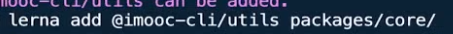
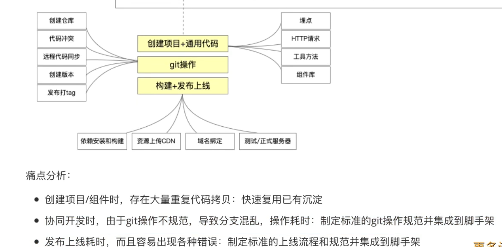

# 第二周

## 2-6 脚手架开发流程

### 开发流程


### 使用流程


### 开发难点解析


## 2-7 快速入门第一个脚手架

**npm init -y 初始化一个工程**

**建一个文件夹 bin 里面有一 js 文件**


tips：注释的那句话表示到全局变量里找到 node 这个变量，然后在它指向的环境下运行（即 node 环境），声明了这句话后执行 index.js == node index.js

**配置 package.json 文件**


tips：第一个是包名，第二个是执行命令，我们全局安装这个包后执行 imooc-test 就会执行 bin 文件下的 index.js 文件

## 2-8 脚手架本地调试方法

在 imooc-test-lib 包下执行 npm link，这个包就可以被链接到本地


在 imooc-test 下执行 npm link imooc-test-lib 即可直接使用这个包


## 2-9 脚手架本地调试标准流程


**链接本地脚手架**


链接了本地脚手架即可根据脚手架的 bin 下的脚手架名直接在命令行输入执行，相当于为它配置了一个环境变量，我们全局变量的配置里有 node_global, 在文件下执行 npm link 就是在 node_global 文件夹下面生成一个软链接


执行 imooc-test 相当于执行了 ./bin/index.js

**链接本地库文件**


库文件执行 npm link 之后，在脚手架里执行 npm link 库文件，脚手架文件的 node_modules 下面就会有一个软连接指向它

**取消链接本地库文件、link、unlink 理解**


## 2-10 脚手架命令注册和参数解析

```js
const argv = require('process').argv

const command = argv[2]
if ( command ) {
    if( lib[command] ) {
        lib[command]()
    } else {
        console.log("无效命令");
    }
} else {
    console.log("请输入命令");
}
```

内置模块 process 的 argv 参数可以获取到我们从终端输入的命令，我们根据命令的不同到对应的库里调用函数即可实现命令行的操作

## 2-11 脚手架项目发布


tips：发布新的包的时候注意修改版本号（npm publish）

## 3-3 本章重点：lerna简介及脚手架开发流程

### Lerna简介

#### **为什么需要 Lerna？**


tips：Lerna 能解决以上痛点

#### **简介**


### **Lerna 开发脚手架流程（重点）**


## 3-4 基于lerna搭建脚手架框架

**初始化脚手架项目**

- npm init 初始化脚手架
- 安装 lerna：npm install lerna -D
- 初始化 lerna：lerna init
- 创建 .gitnore 文件

**创建 packages**

lerna create 包名

**core**


**utils**


**到 npm 上创建分组**


tips：这种分组的命名形式可以避免包名冲突，如果你单单 utils ，npm 上面一大堆有关 utils的包名，这时你就可以创建自己的 organizations 相当于有了自己的命名空间

## 3-5 Lerna核心操作

### lerna add


tips：为指定的包添加依赖,可以指定包名添加也可以全部包都添加


tips：为所有的包添加 @imooc-cli/utils 这个依赖



tips：向指定的包添加依赖

### lerna clean

tips：删除所有依赖

### lerna bootstrap

tips：为包去安装依赖（根据包的package）

### lerna link

tips：对于存在相互依赖的包它自动为其建立起软连接，比如说 core 包引用了 utils 包，当我们使用了 npm link 的时候 core 的 node_modules 就会有一个软连接指向我们本地开发的 utils 包；**如果没有这个命令，我们需要到每个包下面自己去 npm link 对应的包**


### lerna exec --rm -rf node_modules

### 看到这里


## 3-6 脚手架发布流程

### 常用命令

- lerna version
- lerna changed：自上个版本以来那些packetge做了变更
- lernadiff：与上次的 commit 进行diff
- lerna publish: 发布包到 npm，先npm login 登录npm和git push 到仓库


### 流程

- 建立仓库
- 将代码先推送到仓库
- 给私有包的pakege.json加上

```
"publishConfig": {
    "access": "public"
  }
```


tips：若没有加上这句，私有包是没办法发布的

- 执行lerna publish发布到npm

## 4-1 Lerna 源码


## 4.2 Lerna 源码结构分析


## 4-5 npm项目本地依赖引用方法


tips:写好包的路径直接npm install 即可

## 4.6 脚手架 yargs 快速入门

## 4.7 yargs 高级用法讲解

## 4.8 lerna 脚手架初始化

## 4.10 回顾js事件循环

# 第三周

## 1-1 内容介绍


## 2-1 聊话题

**项目设计阶段**


**项目实施阶段**


## 2-2 前端研发过程中的痛点分析




## 2-3 大厂git规范


## 2.4 高端操作：脚手架架构设计 + 绘制架构图


## 2-5 架构师设计图绘图技巧分享


## 3-1 脚手架模块拆分策略


 

## 3-2 core 模块技术方案


##  4-1 脚手架框架代码拆包 + import-local 应用


## 4-2 检查版本号功能开发（require 加载资源类型详解 + npm log 封装）


tips：想创建用于封装 log 的包


tips：安装 npmlog 包，自定义 log


tips：需在用到的地方在 pkg 里先配置好 dependence，注意 require 引入的注意点，不是以上文件的都会当做 js 解析，node 后缀的会调用 process.dlopen 解析

## 4-3 最低 Node 版本检查


tips：安装 smerver 包（用 0.0.0 格式的比对），process.version 获取当前 node 版本号，定义一个常量，存着规定的 node 版本号

##  4-4 root账号启动检查和自动降级功能开发


tips：这一步windows和android 是无效的，为什么要做这一步？root创建的文件，其他用户是没有办法删除修改的，所以需要创建

## 4-5 用户主目录检查功能开发

## 4-6 入参检查和debug模式开发

包：minimist -> 可以帮助我们解析参数


## 4-7 环境变量检查功能

包：dotenv -> 用来加载环境变量从 .env 文件中


## 4-8 通用 npm API 模块封装

## 4-9 npm 全局更新提示功能


```js
// 关键步骤，获取线上的包信息，后面的步骤无非就是根据包信息的版本去比较本地包版本
function getNpmInfo(npmName, registry) {
    if (!npmName) {
        return null;
    }
    const registryUrl = registry || getDefaultRegistry()
    const npmInfoUrl = urlJoin(registryUrl, npmName)
    return axios.get(npmInfoUrl).then(response => {
        if (response.status === 200) {
            return response.data
        }
        return null;
    }).catch(err => {
        return Promise.reject(err)
    })
}

function getDefaultRegistry(isOriginal = false) {
    return isOriginal ? 'http://registry.npm.org' : 'http://registry.npm.taobao.org/'
}

async function getNpmVersions(npmName, registry) {
    const data = await getNpmInfo(npmName, registry);

    if (data) {
        return Object.keys(data.versions)
    } else {
        return []
    }
}

function getSemverVersions(baseVersion, versions) {
    versions = versions.filter( version => {
        semver.satisfies(version, `^${baseVersion}`)
    } ).sort( (a, b) => semver.gt(b, a))
    
    return versions; 
}

async function getNpmSemverVersions(baseVersion, npmName, registry) {
    const versions = await getNpmVersions(npmName, registry)
    const newVersions = getSemverVersions(baseVersion, versions)
    if ( newVersions && newVersions.length > 0) {
        return newVersions[0]
    }
    return null
} 
```

## 5-1 快速实现一个 commander 脚手架


## 5-2 commander 脚手架全局配置

##  5-3 commander 脚手架命令注册的两种方法

```js
#!/usr/bin/env node

const commander = require('commander')
const pkg = require('../package.json')

// 获取 commander 单例
// const { program } = commander.program;

// 实例化一个 Command 示例
const program = new commander.Command()

program
    .name(Object.keys(pkg.bin)[0])
    .usage('<command> [options]')
    .version(pkg.version)
    .option('-d, --debug', '是否开启调试模式', false)
    .option('-e, --envName <envNmae>', '获取环境变量名称')

// comman 注册命令
const clone = program.command('clone')

clone
    .action(() => {
        console.log('do clone');
    });

// addCommand 注册命令
const service = new commander.Command('service')
service
    .command('start [port]')
    .description('start service at some port')
    .action((port) => {
        console.log('do service star    t', port);
    })

program.addCommand(service)

program.parse(process.argv)
```

## 5-4 commander 注册命令的两种高级用法

## 5-5 再讲3条 commander 的高级用法

## 6-1 通过 webpack 完成 ES Module 资源构建

tips：配置好入口，执行webpack即可

## 6-2 通过 webpack target 属性支持 node 内置库


tips：默认环境是 web 肯定不支持node内置库，修改target为node即可

## 6-3 配置 babel-loder 支持低版本 node

# 第四周

## 3-3 脚手架命令动态加载功能架构设计

## 4-1 脚手架命令本地调式功能支持

## 4-2 动态执行库 exec 模块创建	


## 4-3 创建 npm 模块通用类 package


## 4-4 Pakcage 类的属性、方法定义及构造函数逻辑开发

## 4-5 Package 类获取入口文件路径功能开发（pkg-dir应用 + 解决不同操作系统路径兼容问题）

```js
// 获取入口文件的路径
  getRootFilePath() {
    function _getRootFile(targetPath) {
      // 1. 获取package.json所在目录
      // 这个库(pkg-dir)可以帮助查询 package.json 的绝对路径
      const dir = pkgDir(targetPath); 
      if (dir) {
        // 2. 读取package.json
        const pkgFile = require(path.resolve(dir, 'package.json'));
        // 3. 寻找main/lib
        if (pkgFile && pkgFile.main) {
          // 4. 路径的兼容(macOS/windows)
          return formatPath(path.resolve(dir, pkgFile.main));
        }
      }
      return null;
    }
    if (this.storeDir) {
      return _getRootFile(this.cacheFilePath);
    } else {
      return _getRootFile(this.targetPath);
    }
  }
```

## 4-6 利用 npminstall 库安装 npm 模块 

```js
  async install() {
    await this.prepare();
    return npminstall({
      root: this.targetPath, // 要执行 npm install的根路径
      storeDir: this.storeDir, // 安装在哪里
      registry: getDefaultRegistry(), // 使用那个仓库淘宝？
      pkgs: [{
        name: this.packageName, // 要安装的包名，版本
        version: this.packageVersion,
      }],
    });
  }
```

tips：npminstall 这是一个库，可以帮助我们通过函数执行 npm install 包名/版本

## 4-7 Pakcage 类判断模块是否存在方法开发（跳）

## 4-8 Pakcage 类获取缓存模块入口文件功能改造（跳）

## 4-9 Package 类获取缓存模块入口功能改造

## 5-1 进程的基本概念 

tips：讲解在操作系统中如何查看进程的嵌套关系

### 什么是进程


