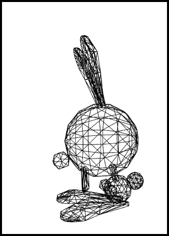

## 第一个场景和模型

无论您是要创建整个世界还是仅将一个模型放入网页中，您都需要一个场景来包含世界或模型，需要一台相机来查看它，一盏灯来照亮它，当然，还需要至少一个可视对象作为模型。所有模型，无论是一个盒子还是一个复杂的角色，都是由三角形或小面的网格制成的。



在 playground 中执行以下代码会生成一个 box：

```javascript
const createScene = () => {
    const scene = new BABYLON.Scene(engine);

    const camera = new BABYLON.ArcRotateCamera('camera', -Math.PI / 2, Math.PI / 2.5, 3, new BABYLON.Vector3(0, 0, 0));
    camera.attachControl(canvas, true);

    const light = new BABYLON.HemisphericLight('light', new BABYLON.Vector3(0, 1, 0));

    const box = BABYLON.MeshBuilder.CreateBox('box', {});

    return scene;
};
```

注意：因为现在只有一个场景，所以可以不用向以下例子一样，每个方法都传场景，会默认传入

```javascript
const scene = new BABYLON.Scene(engine);

const camera = new BABYLON.ArcRotateCamera(
    'camera',
    -Math.PI / 2,
    Math.PI / 2.5,
    3,
    new BABYLON.Vector3(0, 0, 0),
    scene
);
camera.attachControl(canvas, true);

const light = new BABYLON.HemisphericLight('light', new BABYLON.Vector3(0, 1, 0), scene);

const box = BABYLON.MeshBuilder.CreateBox('box', {}, scene);
```

## 学习资料

[First Scene and Model](https://doc.babylonjs.com/features/introductionToFeatures/chap1/first_scene)
