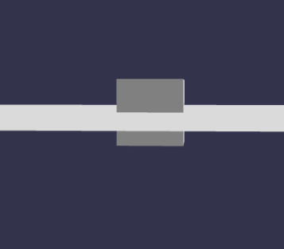

## 搭建地面

添加地面简单代码：

```javascript
const ground = BABYLON.MeshBuilder.CreateGround('ground', { width: 10, height: 10 });
```

效果：



注意：地面穿过盒子的中间。这是因为当它们被创建时，网格被定位在原点

我们需要使用以下方法将盒子移动到其高度的一半：

```javascript
box.position.y = 0.5; //box created with default size so height is 1
```
