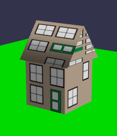

## 组合网格

我们可以分别制作盒子和屋顶的副本，但如果我们可以将盒子和屋顶组合成一个网格，即一座房子，那就更容易了。

### 使用合并网格方法来组合网格

这是结合两个或更多网格的直接方式：

```javascript
const combined = BABYLON.Mesh.MergeMeshes(Array_of_Meshes_to_Combine);
```

如组合一个房子：

```javascript
const house = BABYLON.Mesh.MergeMeshes([box, roof]);
```

效果如下：



我们注意到的第一件事是整个房子只用一种材料覆盖。这可以使用 MergeMes​​hes 的 multiMultiMaterial 参数来纠正，不幸的是，这是最后一个参数：

```javascript
const house = BABYLON.Mesh.MergeMeshes(
    [box, roof],
    true,
    false,
    null,
    false,
    true
);
```

最后一个参数为 true 时允许将原始材质单独应用于与原始网格匹配的零件, 效果如下：


