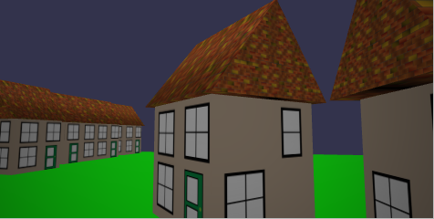

## 改变查看器的摄像头

当我们将村庄作为模型放入查看器时会发生什么？


我们看到地面在闪烁。这是为什么？这是因为默认情况下，查看者已经添加了一个地面，并且在它们重叠的地方它们会“争夺”霸权。

我们如何克服这个问题？我们在<babylon>元素中使用 extends 属性并将其设置为 minimal

```javascript
<babylon extends="minimal" model="path to model file"></babylon>
```

这会删除默认地面以及其他方面，例如 Babylon.js 链接和全屏图标

删除默认接地已停止闪烁。但是，默认查看器会计算模型的范围并相应地调整相机。通过使用最小限度，相机默认靠近模型村庄的中心。



要移动相机，我们必须调整其半径属性。这必须在加载模型之前完成。一旦模型加载到查看器中，属性就无法更改。我们需要从 <babylon> 元素中删除 model 属性，以防止在更改相机半径之前加载模型。还必须为 <babylon> 元素指定一个 id，该 id 由将更改相机属性的脚本引用。

```javascript
<babylon id="myViewer" extends="minimal"></babylon>
<script>
    BabylonViewer.viewerManager.getViewerPromiseById('myViewer').then((viewer) => {
        viewer.onSceneInitObservable.add(() => {
            viewer.sceneManager.camera.radius = 15; //set camera radius
            viewer.sceneManager.camera.beta = Math.PI / 2.2; //angle of depression
        });
        viewer.onEngineInitObservable.add((scene) => {
            viewer.loadModel({
                url: "path to model file"
            });
        });
    });
</script>
```


