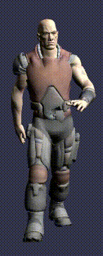

## 一个行走的身影
有时，将模型添加到场景中的最简单方法是从其他地方获取模型。这可以是您在最喜欢的模型构建软件中创建的模型，也可以是您购买的模型。

Dude 模型是用自己的骨架动画构建的模型。



导入后，将从结果对象的网格和骨架属性中获取角色及其骨架。

```javascript
BABYLON.SceneLoader.ImportMeshAsync("mesh name", "path to model", "model file", scene).then((result) => {
    var dude = result.meshes[0];
    dude.scaling = new BABYLON.Vector3(0.25, 0.25, 0.25);
                
    scene.beginAnimation(result.skeletons[0], 0, 100, true, 1.0);
});
```

目前，这个角色被设定在一个位置，我们希望他在村子里走来走去。这一次，我们将在渲染每一帧之前更改其位置和方向，而不是为角色创建另一个动画对象。