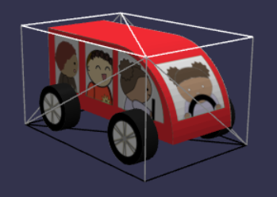

## [避免车祸](https://doc.babylonjs.com/features/introductionToFeatures/chap4/mesh_intersect)

查看两个网格是否接触的最简单方法是使用 intersectsMesh 方法，如下所示:

```javascript
mesh1.intersectsMesh(mesh2);
```

如果盒子边界网格 1 与盒子边界网格 2 重叠，则为真。每个网格都有一个内置边界框，靠近网格表面，用于检查网格的相交。




由于角色的行走和汽车的旅程并不同时进行，因此有时它们会处于同一位置。然而，我们无法预测在村庄里进行长途步行的角色和在短途旅行中的汽车何时会相交。为了演示 intersectsMesh 方法，我们将使角色在汽车的停靠点前后行走。

在我们的例子中，如果汽车位于“命中”区域而角色不在“命中”区域，我们希望角色停止移动。毕竟，如果角色都处于危险区域，那么停下来是很危险的。在我们的例子中，由于 Dude 的构造方式，我们需要使用它的子级之一来检查交集。基本上，Dude 只是头部、躯干、腿和手臂的固定节点，而包围它的盒子太小，在这种情况下不起作用。

代码如下所示：

```javascript
const createScene = function() {
    const scene = new BABYLON.Scene(engine);

    const camera = new BABYLON.ArcRotateCamera(
        "camera",
        -Math.PI / 2.2,
        Math.PI / 2.2,
        15,
        new BABYLON.Vector3(0, 0, 0)
    );
    camera.attachControl(canvas, true);
    const light = new BABYLON.HemisphericLight(
        "light",
        new BABYLON.Vector3(1, 1, 0)
    );

    const wireMat = new BABYLON.StandardMaterial("wireMat");
    wireMat.wireframe = true;

    const hitBox = BABYLON.MeshBuilder.CreateBox("carbox", {
        width: 0.5,
        height: 0.6,
        depth: 4.5,
    });
    hitBox.material = wireMat;
    hitBox.position.x = 3.1;
    hitBox.position.y = 0.3;
    hitBox.position.z = -5;

    let carReady = false;

    BABYLON.SceneLoader.ImportMeshAsync(
        "",
        "https://assets.babylonjs.com/meshes/",
        "car.glb"
    ).then(() => {
        const car = scene.getMeshByName("car");
        carReady = true;
        car.rotation = new BABYLON.Vector3(Math.PI / 2, 0, -Math.PI / 2);
        car.position.y = 0.16;
        car.position.x = -3;
        car.position.z = 8;

        const animCar = new BABYLON.Animation(
            "carAnimation",
            "position.z",
            30,
            BABYLON.Animation.ANIMATIONTYPE_FLOAT,
            BABYLON.Animation.ANIMATIONLOOPMODE_CYCLE
        );

        const carKeys = [];

        carKeys.push({
            frame: 0,
            value: 8,
        });

        carKeys.push({
            frame: 150,
            value: -7,
        });

        carKeys.push({
            frame: 200,
            value: -7,
        });

        animCar.setKeys(carKeys);

        car.animations = [];
        car.animations.push(animCar);

        scene.beginAnimation(car, 0, 200, true);

        //wheel animation
        const wheelRB = scene.getMeshByName("wheelRB");
        const wheelRF = scene.getMeshByName("wheelRF");
        const wheelLB = scene.getMeshByName("wheelLB");
        const wheelLF = scene.getMeshByName("wheelLF");

        scene.beginAnimation(wheelRB, 0, 30, true);
        scene.beginAnimation(wheelRF, 0, 30, true);
        scene.beginAnimation(wheelLB, 0, 30, true);
        scene.beginAnimation(wheelLF, 0, 30, true);
    });

    BABYLON.SceneLoader.ImportMeshAsync(
        "",
        "https://assets.babylonjs.com/meshes/",
        "village.glb"
    );

    const walk = function(turn, dist) {
        this.turn = turn;
        this.dist = dist;
    };

    const track = [];
    track.push(new walk(180, 2.5));
    track.push(new walk(0, 5));

    // Dude
    BABYLON.SceneLoader.ImportMeshAsync(
        "him",
        "/scenes/Dude/",
        "Dude.babylon",
        scene
    ).then((result) => {
        var dude = result.meshes[0];
        dude.scaling = new BABYLON.Vector3(0.008, 0.008, 0.008);

        dude.position = new BABYLON.Vector3(1.5, 0, -6.9);
        dude.rotate(
            BABYLON.Axis.Y,
            BABYLON.Tools.ToRadians(-90),
            BABYLON.Space.LOCAL
        );
        const startRotation = dude.rotationQuaternion.clone();

        scene.beginAnimation(result.skeletons[0], 0, 100, true, 1.0);

        let distance = 0;
        let step = 0.015;
        let p = 0;

        scene.onBeforeRenderObservable.add(() => {
            if (carReady) {
                if (
                    !dude.getChildren()[1].intersectsMesh(hitBox) &&
                    scene.getMeshByName("car").intersectsMesh(hitBox)
                ) {
                    return;
                }
            }
            dude.movePOV(0, 0, step);
            distance += step;

            if (distance > track[p].dist) {
                dude.rotate(
                    BABYLON.Axis.Y,
                    BABYLON.Tools.ToRadians(track[p].turn),
                    BABYLON.Space.LOCAL
                );
                p += 1;
                p %= track.length;
                if (p === 0) {
                    distance = 0;
                    dude.position = new BABYLON.Vector3(1.5, 0, -6.9);
                    dude.rotationQuaternion = startRotation.clone();
                }
            }
        });
    });

    return scene;
};
```

[效果](https://playground.babylonjs.com/#KBS9I5#83)
