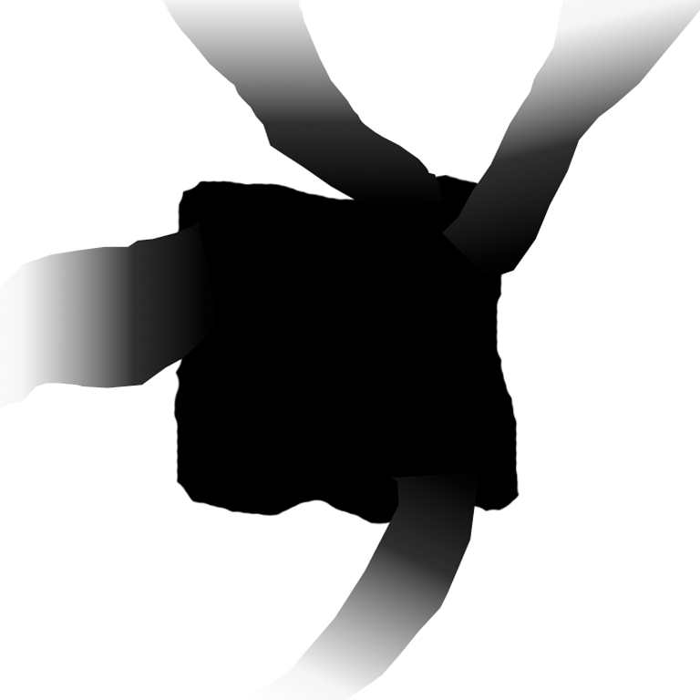
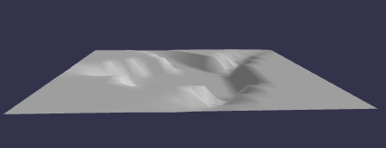
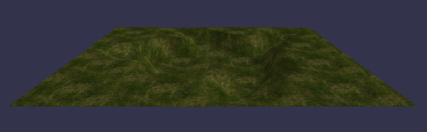

## 远山

我们想把村庄设置在山谷中。可以从网格创建山丘，但是还有另一种方法可以向地面网格添加垂直高度。这是通过使用高度图来实现的，该高度图使用灰色阴影来确定地面的高度。白色区域是最高的部分，黑色区域是最低的部分。这个简单的高度图中间有一个大的黑色区域来容纳村庄，白色区域形成山丘，灰色区域从山谷延伸出来作为道路。



在这张图片中，相机被进一步拉出，垂直高度被夸大。



```javascript
const largeGround = BABYLON.MeshBuilder.CreateGroundFromHeightMap(
    "largeGround",
    "url to height map",
    { width: 150, height: 150, subdivisions: 20, minHeight: 0, maxHeight: 10 }
);
```

选项的细分属性将地面分成 20 x 20 = 400 个部分。细分越多，高度计算的分级就越细。 minHeight 和 maxHeight 这两个属性分别确定黑色和白色区域的垂直高度，灰色区域相应地缩放。[效果如图所示](https://playground.babylonjs.com/#KBS9I5#39)。

我们可以用通常的方式添加纹理，[效果如下所示：](https://playground.babylonjs.com/#KBS9I5#40)



最后，我们给村庄地面一个与大地面相似但更清晰的纹理：

```javascript
//Create Village ground
const groundMat = new BABYLON.StandardMaterial("groundMat");
groundMat.diffuseTexture = new BABYLON.Texture("url to ground texture");
groundMat.diffuseTexture.hasAlpha = true;

const ground = BABYLON.MeshBuilder.CreateGround("ground", {
    width: 24,
    height: 24,
});
ground.material = groundMat;

//large ground
const largeGroundMat = new BABYLON.StandardMaterial("largeGroundMat");
largeGroundMat.diffuseTexture = new BABYLON.Texture(
    "url to large ground texture"
);

const largeGround = BABYLON.MeshBuilder.CreateGroundFromHeightMap(
    "largeGround",
    "url to heightmap",
    { width: 150, height: 150, subdivisions: 20, minHeight: 0, maxHeight: 4 }
);
largeGround.material = largeGroundMat;
largeGround.position.y = -0.01; //确保两个接地不会发生冲突并导致闪烁。
```

[效果](https://playground.babylonjs.com/#KBS9I5#85)

[把屋子添加回来](https://playground.babylonjs.com/#KBS9I5#86)

[把车添加回来](https://playground.babylonjs.com/#KBS9I5#87)
