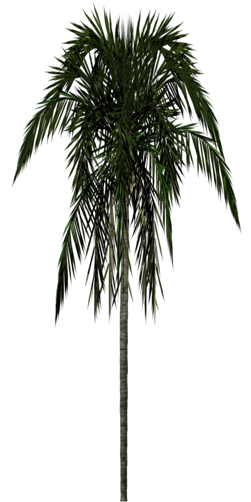

## 精灵树

我们将在我们的世界中种植几片树林，每片树林都有 500 棵树。为了保持渲染速度，我们将使用精灵。这些是始终面向相机的二维图像。

我们将这张图片用于我们的树精灵，并为它设置一个精灵管理器。



```javascript
const spriteManagerTrees = new BABYLON.SpriteManager(
    "treesManager",
    "url to tree image",
    2000,
    { width: 512, height: 1024 },
    scene
);
```

参数是管理器的名称、图像的 url、精灵的最大数量、指定精灵的宽度和高度的对象。

```javascript
for (let i = 0; i < 500; i++) {
    const tree = new BABYLON.Sprite("tree", spriteManagerTrees);
    tree.position.x = Math.random() * -30;
    tree.position.z = Math.random() * 20 + 8;
    tree.position.y = 0.5;
}

for (let i = 0; i < 500; i++) {
    const tree = new BABYLON.Sprite("tree", spriteManagerTrees);
    tree.position.x = Math.random() * 25 + 7;
    tree.position.z = Math.random() * -35 + 8;
    tree.position.y = 0.5;
}
```

[效果](https://playground.babylonjs.com/#KBS9I5#89)

您还可以使用精灵图中的图像集合来生成动画


上面的地图由相同大小的单元框组成，横向 5 个，向下 4 个。这次管理器中给定的宽度和高度是一个单元格的宽度和高度。

```javascript
const spriteManagerUFO = new BABYLON.SpriteManager(
    "UFOManager",
    "url to ufo image",
    1,
    { width: 128, height: 76 }
);
```

精灵的动画是通过给出要使用的第一个和最后一个单元格来设置的，无论它是否循环（true），以及单元格帧之间的时间

```javascript
const ufo = new BABYLON.Sprite("ufo", spriteManagerUFO);
ufo.playAnimation(0, 16, true, 125);
```

[效果](https://playground.babylonjs.com/#KBS9I5#90)
