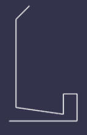

## [喷泉](https://doc.babylonjs.com/features/introductionToFeatures/chap6/fountain)

是时候介绍另一种创建网格的方法了，即 CreateLathe 方法。我们从喷泉的轮廓开始。



使用 3D 向量的 x 和 y 分量在数组中描述轮廓。

```javascript
const fountainProfile = [
    new BABYLON.Vector3(0, 0, 0),
    new BABYLON.Vector3(10, 0, 0),
    new BABYLON.Vector3(10, 4, 0),
    new BABYLON.Vector3(8, 4, 0),
    new BABYLON.Vector3(8, 1, 0),
    new BABYLON.Vector3(1, 2, 0),
    new BABYLON.Vector3(1, 15, 0),
    new BABYLON.Vector3(3, 17, 0),
];
```

该数组用于 CreateLathe 方法中 options 参数的 shape 属性。

```javascript
const fountain = BABYLON.MeshBuilder.CreateLathe(
    "fountain",
    { shape: fountainProfile, sideOrientation: BABYLON.Mesh.DOUBLESIDE },
    scene
);
```

和之前一样，场景参数是可选的。在这种情况下，网格被设置为双面，因为由于顶部的斜坡和中间的空心，内部是可见的。
[效果](https://playground.babylonjs.com/#TC31NV#3)

通过适当改变规模和定位，将其添加到村庄中。
[效果](https://playground.babylonjs.com/#KBS9I5#91)
