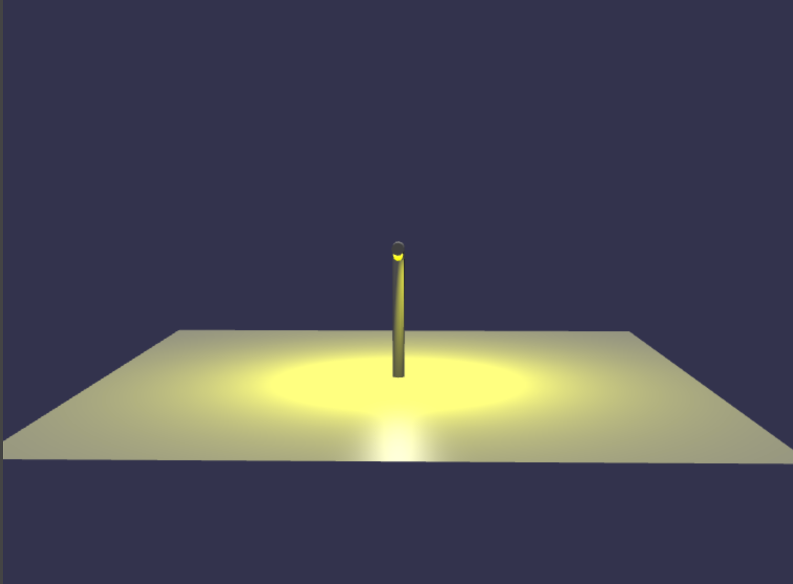

## 路灯

到目前为止，我们刚刚在所有场景中使用了半球光。有多种灯光，但目前我们要介绍的唯一新灯光是聚光灯。它可以放置在任何地方并指定发光方向。光的传播由以弧度表示的角度给出，角度越大，传播越宽。最后一个参数表示光线消失的速度，数字越大，光线照射的距离越短。聚光灯可以被赋予颜色。

```javascript
const lampLight = new BABYLON.SpotLight(
    "name",
    position,
    direction,
    angle_of_spread,
    speed_of_disipation
);
lampLight.diffuse = BABYLON.Color3.Yellow();
```

我们将为路灯添加聚光灯。为了创建灯柱，我们引入了另一种通过沿路径挤压形状来创建网格的方法。

我们仅使用 x, y 平面中的点创建要通过向量 3 序列进行拉伸的形状轮廓。

```javascript
const lampShape = [];
for (let i = 0; i < 20; i++) {
    lampShape.push(
        new BABYLON.Vector3(
            Math.cos((i * Math.PI) / 10),
            Math.sin((i * Math.PI) / 10),
            0
        )
    );
}
lampShape.push(lampShape[0]); //close shape
```

然后，我们再次使用向量 3 为挤出设置路径。路径不必局限于 x、y 平面，可以使用整个三维空间来描述。

```javascript
const lampPath = [];
lampPath.push(new BABYLON.Vector3(0, 0, 0));
lampPath.push(new BABYLON.Vector3(0, 10, 0));
for (let i = 0; i < 20; i++) {
    lampPath.push(
        new BABYLON.Vector3(
            1 + Math.cos(Math.PI - (i * Math.PI) / 40),
            10 + Math.sin(Math.PI - (i * Math.PI) / 40),
            0
        )
    );
}
lampPath.push(new BABYLON.Vector3(3, 11, 0));
```

然后我们形成挤压件。

```javascript
const lamp = BABYLON.MeshBuilder.ExtrudeShape("lamp", {
    cap: BABYLON.Mesh.CAP_END,
    shape: lampShape,
    path: lampPath,
    scale: 0.5,
});
```

为了使灯光更明显，我们调低半球光的强度，

```javascript
light.intensity = 0.5;
```

[效果](https://playground.babylonjs.com/#4G38H4#6)


我们导出尺寸合适的灯，以便在村庄里使用。由于我们需要不止一盏路灯，一旦灯被加载，我们就会克隆它几次。对于每个路灯，我们都会添加灯光。在任何场景中，灯光通常限制为四个。任何更多并且只有最后创建的 4 个是活动的。为了扩展使用的灯光数量，我们设置了任何要照亮的材料所需的数量。

```javascript
material.maxSimultaneousLights = 5;
```

[效果](https://playground.babylonjs.com/#KBS9I5#94)

