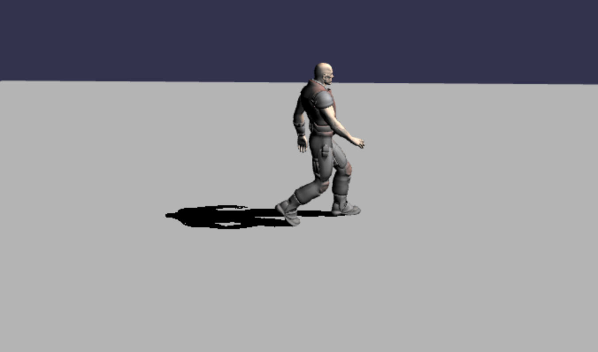

##[添加阴影](https://doc.babylonjs.com/features/introductionToFeatures/chap7/shadows)

到目前为止我们一直使用的光 HemisphericLight 提供环境背景光，不适合产生阴影。我们可以使用聚光灯，但它们产生的阴影可能很微弱，因此我们将引入定向光。

```javascript
const light = new BABYLON.DirectionalLight("dir", direction, scene);
```

像往常一样，方向是一个向量 3，场景参数是可选的。

设置其位置将影响任何创建的阴影的方向和长度。

```javascript
light.position = new BABYLON.Vector3(0, 15, -30);
```

仅当创建 ShadowGenerator 对象、给出投射阴影的网格并将投射阴影的网格设置为接收阴影时，才会出现阴影。

```javascript
const shadowGenerator = new BABYLON.ShadowGenerator(1024, light);
```

第一个参数是阴影贴图和生成阴影的光线的大小。

我们还需要添加一个可以投射阴影的网格。

```javascript
shadowGenerator.addShadowCaster(casting_mesh, true);
```

可选的第二个参数（默认值为 false）会将网格体的任何子项添加到阴影投射器。

最后，我们还必须告诉网格物体投射阴影以接收它。

```javascript
receiving_mesh.receiveShadows = true;
```

在我们的例子中，我们需要在适当的位置

```javascript
const shadowGenerator = new BABYLON.ShadowGenerator(1024, light);

shadowGenerator.addShadowCaster(dude, true);

ground.receiveShadows = true;
```

[效果：](https://playground.babylonjs.com/#4G38H4#7)

