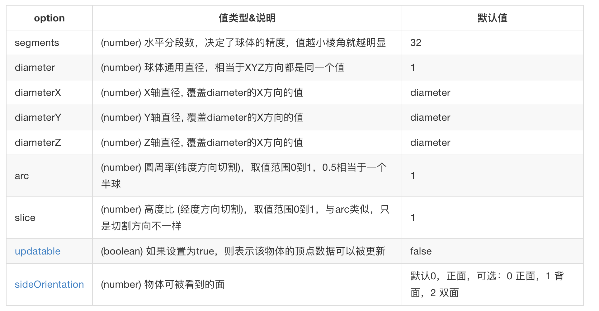
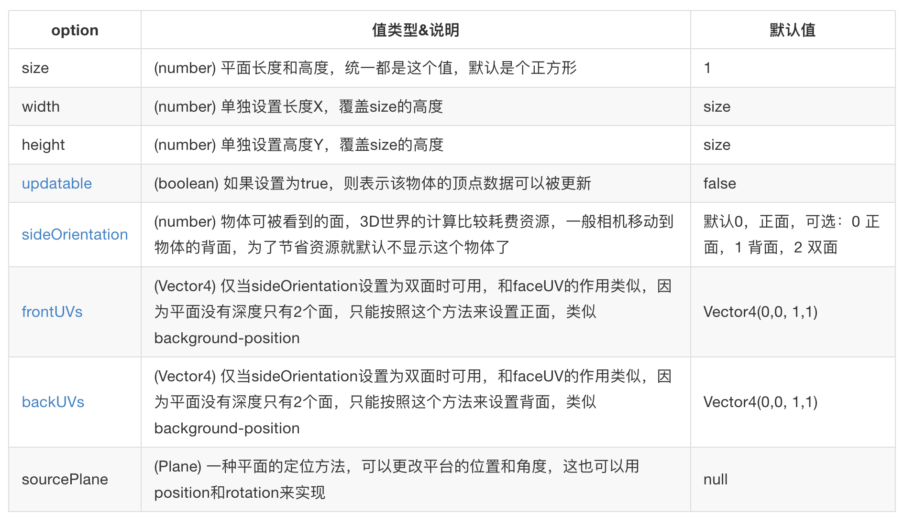
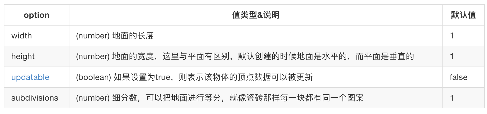
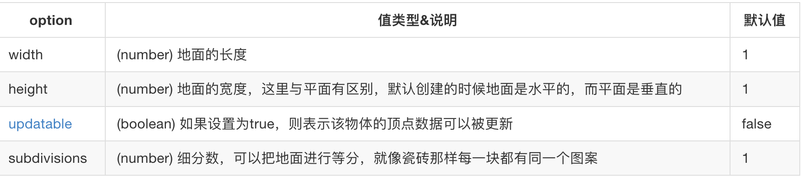

## MeshBuilder 方法介绍

创建一个形状的通用语句如下：

```javascript
var shape = BABYLON.MeshBuilder.CreateShape(name, options, scene); //CreateShape中的Shape可替换为想要创建的物体名称
```

-   name: 表示这个物体的名称，
-   options 可以为物体设置一些体积、长宽，不同物体可配置项有所差异
-   scene: 加入到的场景 scene 变量

## 创建立方体 Box

```javascript
// 创建默认立方体
var box = BABYLON.MeshBuilder.CreateBox('box', {}, scene);
// 设置长宽高并创建
var myBox = BABYLON.MeshBuilder.CreateBox('myBox', { size: 0.5, depth: 0.5 }, scene);
```

options 选项：


## 创建球体

```javascript
// 创建默认球体
var sphere = BABYLON.MeshBuilder.CreateSphere('sphere', {}, scene);
// 设置直径并创建
var mySphere = BABYLON.MeshBuilder.CreateSphere('mySphere', { diameter: 2, diameterX: 3 }, scene);
```



## 创建平面

```javascript
// 创建默认平面
var plane = BABYLON.MeshBuilder.CreatePlane('plane', {}, scene);
// 设置宽高并创建
var myPlane = BABYLON.MeshBuilder.CreatePlane('myPlane', { width: 5, height: 2, sideOrientation: 2 }, scene);
```



## 创建地面

```javascript
var ground = BABYLON.MeshBuilder.CreateGround('ground', {}, scene); //default ground

var myGround = BABYLON.MeshBuilder.CreateGround('myGround', { width: 6, height: 4, subdivisions: 4 }, scene);
```



## 创建地面

```javascript
var ground = BABYLON.MeshBuilder.CreateGround('ground', {}, scene); //default ground
var myGround = BABYLON.MeshBuilder.CreateGround('myGround', { width: 6, height: 4, subdivisions: 4 }, scene);
```



## options 属性详解

### FaceColors 和 FaceUV

Face 代表物体的面，所以 FaceColors 和 FaceUV 只能用在具有面的物体上，例如立方体，而球体就没有这两个选项。FaceColors 能够设置物体每个面的颜色，而 FaceUV 与纹理贴图有很大的关系，这类似于 css sprite，可以把一张图的不同部分展示到物体的每个面上。

### Updatable 可更新形状的物体

Babylon 中的物体都是由一组顶点数据经过彼此之间的连接构成，如果一个物体 Option 中的 updatable 参数设置为 true，那么这个物体的顶点数据就能够被修改，这意味着物体能够改变形状。

### FrontUV 和 BackUV

FrontUV 和 BackUV 与它类似，都是用来把一张图的不同部分展示到物体的每个面上，但不同的是 FrontUV 和 BackUV 只用在只有正反面的物体上，例如平面，FrontUV 用来设置正面，而 BackUV 用来设置反面。而请大家注意，只有当 SideOrientation 选项设置为双面时，这两个选项才能够起作用。

### Vect3 和 Vect4

向量是 3D 世界中的基本单位，Vect3 表示三维向量，也叫作三元数。Vect4 表示四维向量，也叫作四元数。Vect3 用得比较多，例如位置、旋转、放大缩小都使用了 Vect3，用它来表示 X、Y、Z 这 3 个不同的坐标。而 Vect4 一般用来做三维空间的旋转变换，具体可以看看知乎的一篇科普文章[如何形象地理解四元数](https://www.zhihu.com/question/23005815/answer/33971127)？

```javascript
var position = new BABYLON.Vect3(1, 1, 1); //三维向量
var quaternion = new BABYLON.Vect4(1, 1, 1, 1); //四维向量
```

### Color3 和 Color4

Color3 表示 rgb，Color4 表示 rgba，只是 Babylon 中的 Color 值都是用 0 至 1 表示的，例如 Color3(0.5,0.5,0.5)，就相当于 rgb(128,128,128)。

```javascript
var rgb = new BABYLON.Color3(0.5, 0.5, 0.5); //颜色
var rgba = new BABYLON.Color3(0.5, 0.5, 0.5, 1); //透明度颜色
```
