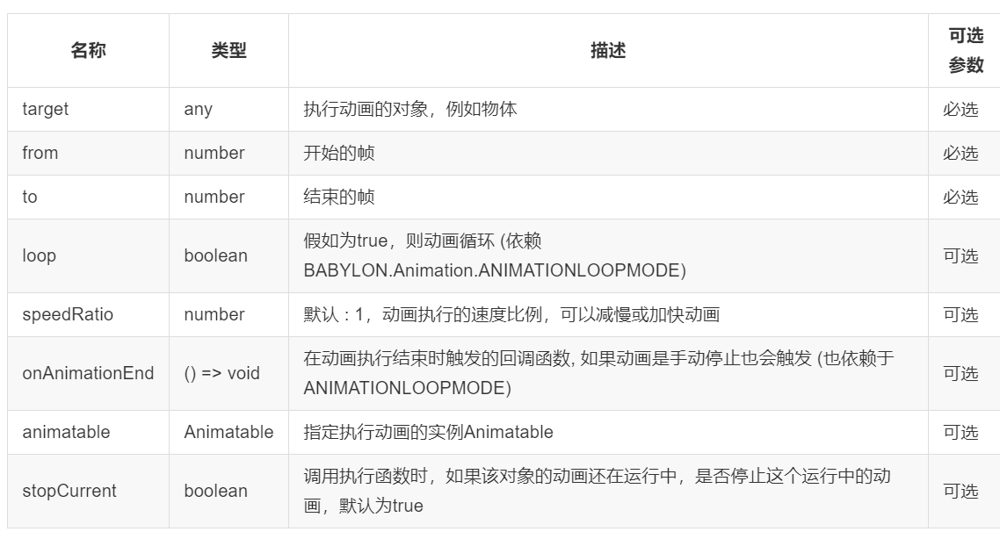

## 动画 Animation

在场景中添加动画主要有 2 种方法:

-   第一种方法：定义一组 keys，同时在每一个 key 中设置物体的状态，例如位置、旋转、缩放等。
-   第二种方法：往往是对于更加复杂的动画，例如按照 sin 曲线运动，那就是通过在场景运行的循环中(runRenderLoop、onBeforeStepObservable)直接设置和改变物体的状态值。

## 基本动画

动画的创建基于一个 Animation 对象，由各种属性和一组 keys 组成。每个 key 代表其在给定时间的动画状态值。

为了完成本章介绍的动画场景，咱们需要创建一个场景并添加若干元素：

```javascript
//记得先创建: [scene, light, camera]
//创建一个立方体，name为Box1
var box1 = BABYLON.Mesh.CreateBox('Box1', 10.0, scene);
box1.position.x = -20;
```

我们的目标：移动上面创建的立方体“ box1”。 首先，创建我们的 Animation 对象：

```javascript
var animationBox = new BABYLON.Animation(
    'myAnimation',
    'scaling.x',
    30,
    BABYLON.Animation.ANIMATIONTYPE_FLOAT,
    BABYLON.Animation.ANIMATIONLOOPMODE_CYCLE
);
```

让我们对 Animation 的参数进行详细解读：

-   参数 1 - 动画的名称
-   参数 2 - 这个与对象的属性相关，可以是任何物体的属性，具体取决于需要更新的内容，上例中我们要在 X 轴的方向缩放 Box1，所以这里设置为 scaling.x 。
-   参数 3 - 每秒请求的帧数：动画中可能达到的最高 FPS。
-   参数 4 - 数值变化类型。根据参数 3 的配置，决定要修改的值类型：浮点数（例如 x 轴位置 Position.x），矢量（例如位置 Position）还是四元数(例如旋转 rotationQuaternion)。 确切的值是：

```
- 浮点数：BABYLON.Animation.ANIMATIONTYPE_FLOAT
- 二维向量：BABYLON.Animation.ANIMATIONTYPE_VECTOR2
- 三维向量：BABYLON.Animation.ANIMATIONTYPE_VECTOR3
- 四元数：BABYLON.Animation.ANIMATIONTYPE_QUATERNION
- 矩阵：BABYLON.Animation.ANIMATIONTYPE_MATRIX
- 颜色：BABYLON.Animation.ANIMATIONTYPE_COLOR3
```

-   参数 5 - 动画的在执行完一个周期后，需要执行的行为模式，例如继续运动、从头开始执行还是立即停止，可选三种模式：

```
相对，相对运动，即：执行完一次，在接着最后的状态，继续执行：BABYLON.Animation.ANIMATIONLOOPMODE_RELATIVE
循环，动画循环执行，即：执行完一次，从头开始再执行：BABYLON.Animation.ANIMATIONLOOPMODE_CYCLE
常量，动画执行一次就停止不动了：BABYLON.Animation.ANIMATIONLOOPMODE_CONSTANT
```

在下面的案例中，我们想做一个立方体缩放的动画，但是不只是简单的均速缩放，需要做一些修饰：放大的过程应该快一些，而缩小的过程应该慢一些。所以我们可以这么做：

```
// An array with all animation keys
var keys = [];

//在动画key==0时, 缩放scaling的值是"1"
keys.push({
    frame: 0,
    value: 1
});

//在动画key==20时, 缩放scaling的值是"0.2"
keys.push({
    frame: 20,
    value: 0.2
});

//在动画key==100时, 缩放scaling的值是"1"
keys.push({
    frame: 100,
    value: 1
});
```

tips: 请注意！加入 keys 中的 frame 有顺序要求，必须是升序。

对于二维向量 Vector2、 三维向量 Vector3 和 四元数 Quaternion，动画默认是使用线性插值的计算方法，即均速；我们可以在 key 中设置正切 inTangent 和 外切 outTangent 属性，以此来使用 spline 插值，即可以由正切 inTangent 和 外切 outTangent 来设置变速。

```javascript
var keys = [];

keys.push({
    frame: 0,
    value: BABYLON.Vector3.Zero(),
    outTangent: new BABYLON.Vector3(1, 0, 0),
});

keys.push({
    frame: 20,
    inTangent: new BABYLON.Vector3(1, 0, 0),
    value: new BABYLON.Vector3(1, 1, 1),
    outTangent: new BABYLON.Vector3(-1, 0, 0),
});

keys.push({
    frame: 100,
    inTangent: new BABYLON.Vector3(-1, 0, 0),
    value: BABYLON.Vector3.Zero(),
});
```

接下来是两个重要的步骤：

-   把之前定义的 keys 动画组加入到 Animation 对象中

```javascript
animationBox.setKeys(keys);
```

-   把动画和物体关联起来

```javascript
box1.animations = [];
box1.animations.push(animationBox);
```

最后，我们需要一行代码来启动自己的动画：

```javascript
scene.beginAnimation(box1, 0, 100, true);
```

我们还能够直接逆向运行动画，也就是从尾到头的顺序执行动画：

```javascript
//只需要交换第二个和第三个参数
scene.beginAnimation(box1, 100, 0, true);
```

以上的函数 beginAnimation，它所包含的参数如下表所示：



beginAnimation 函数返回一个 BABYLON.Animatable 对象，代表 执行动画实例 （例如使用 getAnimationByTargetProperty 函数）。

而 BABYLON.Animatable 对象，支持以下的方法：

-   pause()暂停
-   restart()重新开始
-   stop()停止
-   reset()重置

下面的例子展示了在执行 beginAnimation 方法时，用变量把执行动画的实例保存了下来，之后再做进一步的动画控制。

```javascript
var newAnimation = scene.beginAnimation(box1, 0, 100, true);
```

然后暂停正在运行的动画

```javascript
newAnimation.pause();
```

## 动画和 promise

自从 Babylon.js3.3 版本以后，我们能使用 promises 等待动画实例 animatable 执行完成：

```javascript
var anim = scene.beginAnimation(box1, 0, 100, false);

console.log('before');
await anim.waitAsync();
console.log('after');
```

## 控制动画-差值函数 Controllng animations

每一个 BABYLON.Animation 对象都有一个被称为 当前帧 的属性，对应当前动画中 keys 数组中的一个 key。

对于高级的关键帧动画，我们可以在 keys 中的两个 key 之间自定义插值函数，也就是两个关键帧之间定义一个过渡的算法函数，实现特殊的动画过渡效果。在默认情况下的插值函数如下所示：

```javascript
//表示浮点数的插值，例如scaling.x，position.y
BABYLON.Animation.prototype.floatInterpolateFunction = function(startValue, endValue, gradient) {
    return startValue + (endValue - startValue) * gradient;
};

//表示四元数的插值，例如matrix
BABYLON.Animation.prototype.quaternionInterpolateFunction = function(startValue, endValue, gradient) {
    return BABYLON.Quaternion.Slerp(startValue, endValue, gradient);
};

//表示三维向量Vector3的插值，例如scaling，postion，rotation
BABYLON.Animation.prototype.vector3InterpolateFunction = function(startValue, endValue, gradient) {
    return BABYLON.Vector3.Lerp(startValue, endValue, gradient);
};
```

以上的函数，都可以进行重写，定义自己的插值函数，我们可以自定义的所有插值函数如下所示：

-   floatInterpolateFunction
-   quaternionInterpolateFunction
-   quaternionInterpolateFunctionWithTangents
-   vector3InterpolateFunction
-   vector3InterpolateFunctionWithTangents
-   vector2InterpolateFunction
-   vector2InterpolateFunctionWithTangents
-   sizeInterpolateFunction
-   color3InterpolateFunction
-   matrixInterpolateFunction

## 动画辅助创建函数 Helper function

这里介绍一个扩展函数来快速创建动画：

```javascript
Animation.CreateAndStartAnimation = function(name, mesh, targetProperty, framePerSecond, totalFrame, from, to, loopMode);
```

详细剖析一下这个函数：

-   函数只能定义 2 个关键帧，也就是对应之前的 keys 数组，只能插入两个 key 对象。
-   函数只能针对物体起作用。
-   函数一执行，动画就马上生效，新建和执行两个步骤被统一在一起了。

这是使用 CreateAndStartAnimation() 函数的简单示例：

```javascript
BABYLON.Animation.CreateAndStartAnimation('boxscale', box1, 'scaling.x', 30, 120, 1.0, 1.5);
```

以上等价于

```javascript
var animationBox = new BABYLON.Animation(
    'myAnimation',
    'scaling.x',
    30,
    BABYLON.Animation.ANIMATIONTYPE_FLOAT,
    BABYLON.Animation.ANIMATIONLOOPMODE_CYCLE
);

var keys = [];

keys.push({
    frame: 30,
    value: 1,
});

keys.push({
    frame: 120,
    value: 1.5,
});

animationBox.setKeys(keys);

box1.animations = [];
box1.animations.push(animationBox);

scene.beginAnimation(box1, 0, 120, true);
```

## 动画混合 Animation blending

使用 enableBlending = true 来开启动画混合模式，混合模式就是说动画的执行时以当前物体的状态为准，例如物体初始位置是在(0, 0, 0)原点，先执行一个动画改变位置，当运动到(0, 20, 0)的时候，停止原有动画，加入一个新动画，新动画的第一帧从(0,0,0)开始，默认情况下物体会回到(0,0,0)从头执行新动画，但是如果设置了 enableBlending = true ，则新动画会从(0, 20, 0)的当前位置执行。这个特性对动画改变时的平滑过渡，非常有效。例如：步行的角色切换为跑步时

## 动画权重 Animation weights

## 叠加混合动画 Additive animation blending

## 属性重写 Overrinding properties

## 缓动函数 Easing functions

## 复杂动画

## 为动画添加事件

## 帧同步 Deterministic lockstep
